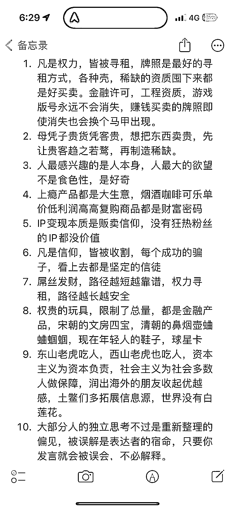

# 大部分人的独立思考不过是重新整理的偏见，被误解是表达者的宿命

> 原文：[`www.yuque.com/for_lazy/thfiu8/qx91ic3lgxyig5ww`](https://www.yuque.com/for_lazy/thfiu8/qx91ic3lgxyig5ww)

## (23 赞)大部分人的独立思考不过是重新整理的偏见，被误解是表达者的宿命

作者： 亦仁的收藏夹

日期：2023-09-05

大部分人的独立思考不过是重新整理的偏见，被误解是表达者的宿命，只要你
发言就会被误会，不必解释。

* * *

评论区：

胖大魔 : 被误解是表达者的成本

* * *