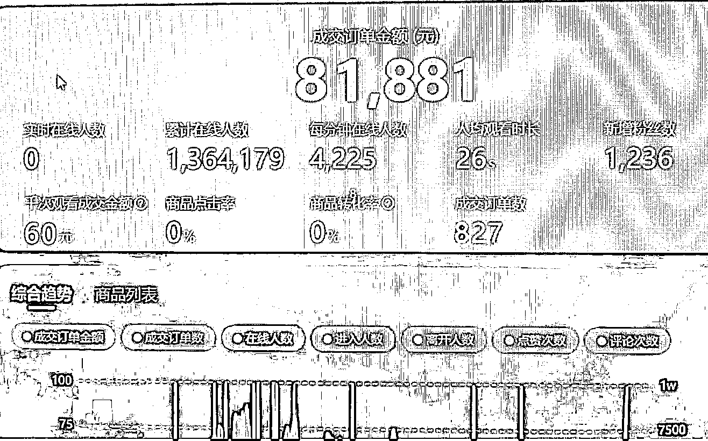
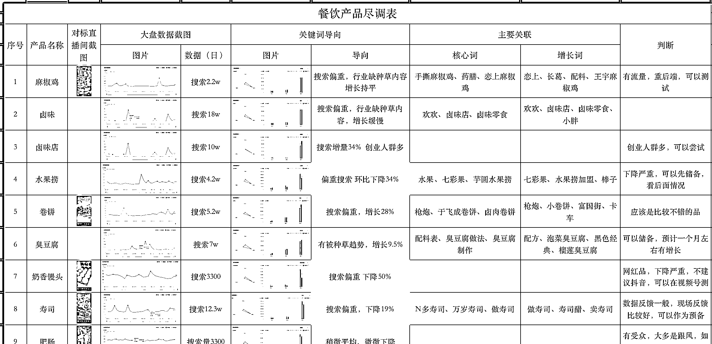
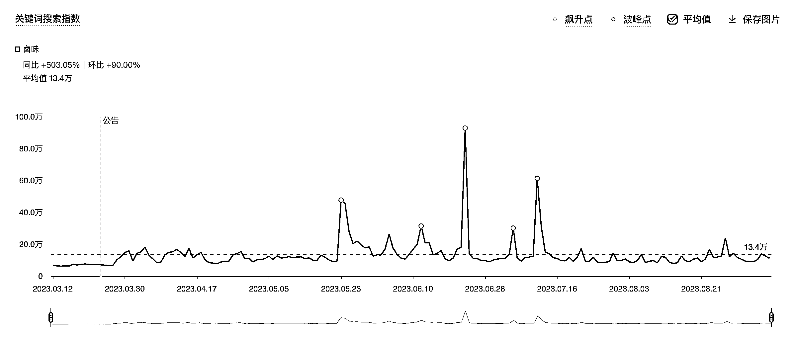
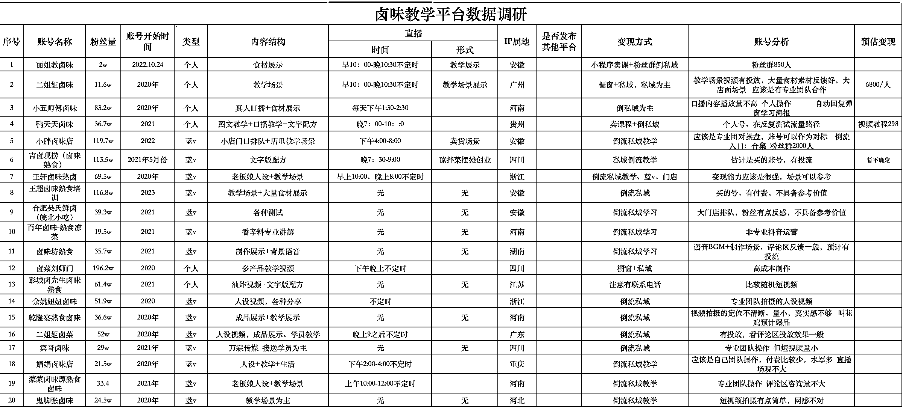
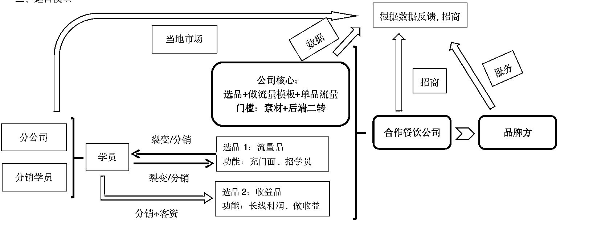

# 从“餐饮技能培训”到“技能培训”，标准化模型单场 100w+观看，做了哪些升级

> 原文：[`www.yuque.com/for_lazy/thfiu8/qtwayge6gg13gusk`](https://www.yuque.com/for_lazy/thfiu8/qtwayge6gg13gusk)

## (23 赞)从“餐饮技能培训”到“技能培训”，标准化模型单场 100w+观看，做了哪些升级

作者： 隔壁老胡

日期：2023-09-11

大家好，距离第一次写“餐饮技能培训”模型，已经过去半个来月，半月个时间，我们把整体的运营模型和赛道做了一个整体升级，周末没什么工作安排，把整体的操盘思路和模型，再跟大家做个分享，大家如果有从事技能培训、创业培训赛道的，希望能给大家带来些帮助。​

​

记得是上周，写了一篇“业务与团队需要平衡点，不是所有业务都需要团队”，文章里提到我从一个人一个小办公室过度到团队运营，中间出现了一些小状况，那就从这个节点，继续给大家分享。

如果是单纯的餐饮技能，可能不会再写什么东西了，行业的深度没有搞明白，扩展到技能培训，感觉还可以再叨叨几句。

我们是没有什么对外业务的，希望我这创业十年的一点思维逻辑和执行路径能给大家带来一点帮助，大家着重看思维

4 月份正式团队化运营，整体变现模型：公域+私域联动，公域作为维持公司运营的基本盘（不需要做太高营业额），私域作为增长点，场观基本都在 50w 以上，一天基本上可以加爆 5 个微信

操盘项目有一个标准化的流程：选品→找对标→拆解元素→创建初始化模型→付费同行学习→组建核心团队→套用 sop→快速测试→全链路优化

无论直播也好，短视频也好，想要盈利，一定是基于市场需求，而不是流量技术，从选品开始讲

**一、选品   选品的原则：**

1、爆品       什么是爆品？    用三个词概括：应时、应季、应点

2、有大型成功案例     有大型成功案例，说明有市场需求，在大案例里面优化，胜过于在小案例里面测试

基于这两个原则 4 月份正式切品，时下，正是卤味和龙虾准备上市季节，连同这两个品在内，把市面上能看到的爆品统一做了一个调研

调研的方法：抓取认为比较爆的直播间，用抖音巨量算数做整体拆解

以卤味举例子

1、看历史半年的数据，半年数据稳定在一个值（热点带动的波动排除）

2、综合指数总体上涨趋势，且偏重搜索，偏重搜索才有内容的优化空间，如果这个品的偏重非常平均，基本可以 pass 了

**其他细节类的分析，在模型阶段先不做太具体，粗糙模型跑不通，精细化运营会极大降低人效**

综合分析下来，确定了卤味和龙虾两个品类

**二、拆解对标**

1、分析对标整体路径

2、抓取对标关键元素

如图，拆解完对标的整体路径，分析成功的关键元素：人设>场景>食材展示>教学，一目了然

然后再分析，以我们现有条件能达成哪个元素，然后统一加劲儿，综合匹配下来，人设虽然成功率最高，但太难控制了，我 18 年做抖音，从 0 到 100w+粉丝的达人孵化过很多个，几乎没有能“善终”的，果断选择第二、第三元素。

**三、创建初始化模型  **

这里的模型指的是商业模型，不是具体运营，有了规划才知道节点，有了节点才知道需要匹配的人才

根据以往的商业经验，一个初始化的模型就这么粗糙的建好了，整体思维来看，没啥问题了，模型执行起来的正确程度，需要实操之后才能验证

根据初始的模型看，**需要的人才：主播、摄影、商务、流量老师、交付老师**

**四、向同行付费学习**

我加了十几个同行：头部 2 个、中腰部 8 个，新锐账号 3-5 个，大概花了 3 万块钱左右学费，摸清楚了整个链路（聊天截图就不发了，避免不必要误会）

头部基本在对打互抄，加多了没用，中腰部的如果仔细探索，会发现其中的标准化玩法，新锐账号纯属是留着长期观察

连续创业之后会发现一个现象，调研所花的时间要大于执行

在朋友圈我写过很多次，创业是一门概率学，应该以“先胜而后战”的视角做事情，而不是“先战后胜”，先战后胜大多数存在于故事中。

可能很多朋友会说，为什么不先找同行学习，然后建模？

我想说，同行给提供的信息非常庞杂，如果没有多年的行业经验，很难系统的整理出来一套脉络。与其花太长时间挨个梳理，倒不如把自己的成功经验通过同行优化

**五、组建核心团队**

这一步先不写了，改天有时间了系统的梳理一遍

创业失败的因素，90%因为人，人和管理是一门非常复杂的学问

**六、套用 sop**

到这一步，算正式进入了操作期，这一步的核心就一个字“抄”，把同行的优质内容搬运，大家注意，这里是搬运，不是仿，还是上述观点，粗糙模型跑明白的项目才值得优化。

需要抄的几个元素

1、短视频

根据带货时期经验，对标近期所有爆款短视频，全部保存，分成 ABCD 四个等级

A 级别  最好的案例，有不可触碰的底线或者模仿难度啊

B 级别  比较好下手

C 级别  标准线，不能再低了

D 级别  看起来好的东西，拆分之后，可能是因为运气

颗粒度拆分，工业化剪辑

小工具

应该还有个背景音乐库，在同事电脑的剪映里面，截图不了了

通过这几个元素的重组，工业化生成 n 个视频

2、直播间场景

这个就简单了，采集软件直接搬运，二剪

3、主播话术

1、和直播间场景同样，一比一搬运

2、一定要让主播自己把话术全部拆解一遍，并标注好每个地方大概是做什么用

主播被市场惯的，一般会比较懒散，通过这种方式，让主播更快速熟悉这个赛道。

剩下的就是起号啦、流量啦这一系列细节问题了，这些在我看来，不是很重要

我们 18 年做抖音，手里经的号不计其数，要相信有运气，有的号天生就在罗马，内容没问题、话术没问题，剩下的就是账号权重问题了，测出来最好的就行了。

所以，起号的一贯原则：量大赶概率，三个号一组，一个号两个小时。起来哪个算哪个，起不来的废掉！

测试周期结束，矩阵了 3 个账号，大体数据如下：

公域课程销量不高，但稳定，私域的客资每天也能维持在 50 个以上，如果按照投放广告换算，基本上在 1w 左右，后端的转化率在 5%-10%。

后面又招了几十个学员一起玩，上面的模型基本上能运转了，我们作为中台，把控全盘，一帮兄弟一起做流量。

七、全盘优化

本该皆大欢喜的事情，奈何链条有点长，大家如果做合作的生意，一定要提前考察好对方的情况，该回款的时候，遇到两个情况

1、合作公司耍赖

2、一起玩的兄弟们

由于前者，整个素材停更，一起玩的兄弟信任感瞬间崩塌。

分析原因：

1、流量公司的流量一定不能交出去，哪怕合作私域团队，都不要交给品牌方，底牌一旦丢了，所有优势瞬间坍塌

2、流量团队依靠素材和话术生存，一旦断粮肯定出问题，而且，整个链路偏长

所以，团队做了深度思考，能否把技能学习的学员转化成引流方，同样都是培养小白，为什么不能把流量技能作为增值项目提供出去？

于是，整个结构又做了一次优化

形成了一个最简单的商业小闭环。

这个小闭环，我们尝试填充了塔罗牌、国学两个项目，基本上可以跑顺。

至此，整个链路算是有了一个落脚点

总结：

1、健康的商业模式，赢利点可以多，但链条一定不能长，第一节点不赚钱的时候，第二节点更难

2、越简单的模式越赚钱，最好是大家一眼能看懂的

3、一定要重视产品，高毛利的前提下，流量可以迅速买到。

* * *

评论区：

餐饮供应链小祥哥 : 大佬留个 v，链接下
隔壁老胡 : xiangbei3456

* * *