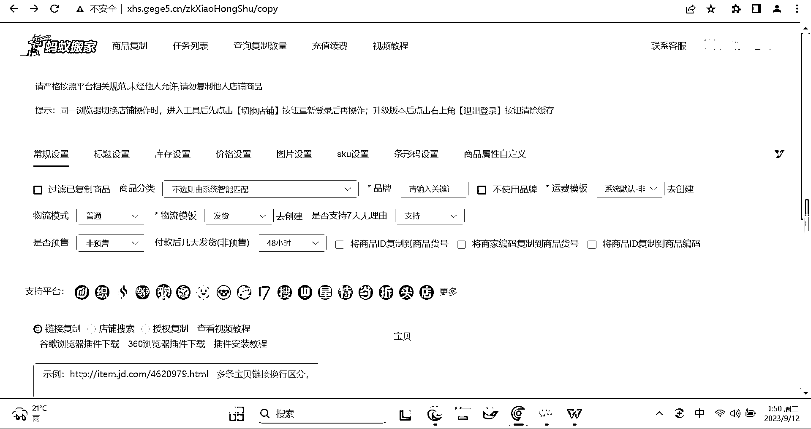

# 小红书店铺新手 0-1 出单指南

> 原文：[`www.yuque.com/for_lazy/thfiu8/gvnsuuu4u7zadq6z`](https://www.yuque.com/for_lazy/thfiu8/gvnsuuu4u7zadq6z)

## (98 赞)小红书店铺新手 0-1 出单指南

作者： 书豪

日期：2023-09-12

大家好，我是生财圈友书豪，也是小红书店铺航海的教练，一个连续四年年入百万的 95 后。

依靠公众号矩阵赚到第一桶金，在抖音做个护家清类目卖过 1000 万 GMV 的货，今年在小红书平台开了 30 个店铺变现了 90 万的利润。

之前分享了一篇教 04 年堂妹开小红书店铺的帖子，关注度还挺高，这是原帖链接：

[`wx.zsxq.com/dweb2/index/topic_detail/211884584128151`](https://wx.zsxq.com/dweb2/index/topic_detail/211884584128151)

今天再给各位圈友系统分享下“如何做一个新项目”，基于小红书电商这个项目，希望给大家带来一些做项目的思路，以及能落地的实操步骤。

我的分享主要分为四个部分：

1.  1、新手心理建设

2.  2、操作流程概要

3.  3、案例拆解演示

4.  4、操作注意点

一、新手心理建设

因为我本人也在小红书店铺的航海中担任教练，我发现很多圈友对小红书项目很感兴趣，但没有相关经验，前期比较迷茫，定不好目标，很容易中途放弃。

这里跟大家分享 2 个项目能成功的心法：

**1、合理的预期管理——定 1 块钱目标**

这里，我特别想跟大家说一句：参加航海的目标不需要太高，赚 1 块钱就可以！

不管你是做小红书店铺、还是公众号流量主、或是视频号带货等航海项目，从我的经验来看：

**项目前期做好预期管理，是你能否坚持下去的关键，而坚持是项目成功的关键。**

如果你对于新项目抱着高预期入场，首先心态上就失败了。

任何一个航海项目，离赚到第一个 1 万元都很接近。

但是只有你先赚到第一个 1 块钱，拿到从 0 到 1 的结果，1 块钱的正向激励会让你发自内心的相信自己，你心里才有航海项目可以赚到第一个 1 万元的强烈希望和坚定信心！

目标越小越简单，你在航海的船上，才能有最大的动力！

轻松上阵，咱们心态上就赢了！

**2、坚持打卡**

第 2 个关键心法是坚持，我们首先把坚持打卡这件事先完成，打卡不是为了拿回押金，而是为了完成选品、找货源，上品、发笔记，测品，出单，发货，售后，放大爆款等一个个具体的动作为关键目标。

例如说：

航海手册你认真看了没有？

优秀船员的日志你认真看了没有？

群聊的信息你看了没有？

群里别人遇见的问题你能解决吗？

一步步去增加自己的做小红书电商的技能！

兄弟们，坚持这件事才是我们在小红书上赚到钱最有威力的武器啊！不坚持发笔记，何谈出单呢？

分享给大家，我经常用来自勉的一句话：纸上得来终觉浅，绝知此事要躬行！

## 二、操作流程概要

OK，做项目前的心态我们如果建立好了，那接下来看看小红书店铺具体怎么来做？

我把新手做小红书店铺的完整步骤拆分为：

第一步：选品——通过灰豚数据或者小红书站内刷爆款

第二步：上架商品——利用蚂蚁搬家插件进行商品上架

第三步：内容创作——单品进行素材的混剪生成 10-15 个视频笔记

第四步：笔记发布——进行关联商品的视频笔记发布

第五步：找货源——通过至尊宝全网搜索订好上家商家

### **第一步：最重要的选品**

选品有 2 种方法：

方法 1：直接刷笔记跟品

直接刷小红书发现页，按照我总结的 3 个【跟品原则】来筛选：

1、小红书账号粉丝≤200

2、最近 7 天发的单篇带货笔记点赞≥100

3、同时该带货笔记商品销量＞100 的品

刷到该类账号笔记进行点赞收藏等动作，这样系统会越推越多！

方法 2：第三方数据平台——灰豚数据

用灰豚数据的具体步骤是：

点击笔记查找 -> 笔记搜索 -> 选择低粉爆文 & 带货笔记选择近 7 天。

我们也可以通过关键词去快速确定，比如“搜搓澡神器”，锁定一些低粉爆款的对标账号。

注意：新手选品不要想太多，避免先入为主！一切看数据说话！

数据好卖爆的品自有市场先生做裁判！爆品才是真实展现小红书大部分用户需要的现实。

### **第二步：上架商品**

关于蚂蚁搬家上架插件怎么用，这里我就不赘述了，大家跟着流程实操一遍就会了。

### **第三步：内容创作**

一定要学会混剪。先批量下载好相关素材，再混剪，一个品一般测试 10～15 条笔记。

可以直接在小红书站内下载爆款笔记素材，结合抖音和快手下载该品的爆款素材，就可以进行混剪笔记了。

混剪的方法很简单，我会在后面的案例拆解中具体分享。

### **第四步：发布笔记**

每隔 40 分钟～60 分钟定时发布 1 篇笔记，单号单天至少发 10 个笔记来测品，1 个品一般 2-3 天就能测完，不行咱就赶紧换下一个品继续测。

### **第五步：找货源**

出单后以淘宝和 1688 为主去找货源，不推荐拼多多，拼多多的机制对于无货源的商家来说不太友好。熟悉淘宝的直接上淘宝就好！

具体操作方法：

1.如果你熟悉淘宝或者 1688，可以下载商品主图，直接去平台以图搜商品；

2.或者通过【至尊宝】全网搜索，找到合适的货源。

找货源的标准：

1.价格上排除最贵和最便宜的；

2.店铺货品不垂直的不能选。很多店铺的上品杂乱，主图不清晰，这样的店铺需要避开；

3.销售量<50 且没有评价或评价与实物不符，或者用商品图刷单的评价的，这样的商品尽量不要选则；

4.销售量>100 且有真实评价，和客服交谈时回复比较快的店铺可以考虑。

以上就是我总结的小红书开店 5 个步骤，也是我教给公司员工和堂妹的标准。

新人不需要思考，有个简简单单可以开干的执行标准，非常重要！

## 三、案例拆解

有了上面的实操步骤，我拿【小白鞋清洁膏】这个品来给大家具体演示下：

首先，我们通过灰豚数据和小红书低粉爆款选品法，都能选到这个品，都能找到这个品。

然后，我们来**拆解这个【解忧丑精灵】账号的爆款笔记。**

1、笔记标题

这是她的爆款标题：！！太太太太太太太牛🐂了！擦不干净算我输！?

标题不用你想，直接抄抄抄！

2、笔记封面

你看它的爆款笔记封面还有一个封面标题：干洗店不会告诉你的秘密

封面怎么抄？加个贴纸，改个滤镜和对比度，不就是伪原创了吗？

3、视频脚本

“看看啊看看啊，这是卖家秀，哇，我买咯。再好的洗涤剂，它也是洗不干净的。包括这种泡沫清洗剂……”

我们可以直接把他的音频拿来用。

好了，接下来制作我们自己的小红书笔记：

第一步：直接下载上面这个爆款笔记的视频，保存到手机或者电脑；

第二步：保留音频，对它的爆款笔记的画面进行混剪就可以。

（混剪画面可以去抖音上搜“小白鞋清洁膏”，找到爆款视频下载下来。)

这里有 2 个关键技巧：

1、定好了一个产品后，一定要测试≥12 个笔记，选择对手最爆的那个笔记脚本混剪 4 条。

2、同商品多爆款笔记模版组合测试：多找几个爆款笔记的【封面+标题】做组合测试。分为三组不同的标题+封面进行测试。

可以看到这个解忧丑精灵的账号，他也是测试了多个标题+封面，最后爆了一条笔记杀上 2945 单。

不要只测试三五个笔记就放弃，也许你测试的第十个笔记就爆了一两千单。小红书的长尾流量是很大的。

就拿小白鞋清洁膏这个品来说，账号“元気优选”和“解忧丑精灵” 的爆款笔记封面和标题不一样，但是都爆了，都是同一套视频笔记在混剪。

至于货源，你只需要保存商品主图，去 1688 以图搜商品，就能知道他的进货价多少钱了！

想要找到性价比更高的货源，可以通过至尊宝来进行全网搜索对比。

兄弟们，你觉得你在小红书赚到第一个 1 块钱还难吗？

## 四、操作注意点

1、很多人问，小红书无货源还能做吗？

我个人认为，小红书无货源还是可以继续做下去的，至少还有 6 个月的红利期；我们可以从操作上规避掉从拼多多下单发货这个动作，避免拼多多的面单和短信问题。

2、听说小红书官方不支持“抖音混剪”那一套？

跟上一个问题一样，目前来看，“在小红书选品，在抖音上找素材”这个动作仍然有效果；我们可以尽量选择一些在小红书还没有太多人去跟的品去进行混剪。

3、关于内容创作

对于新手而言，切记不要盲目创新脚本，对手的脚本模板，已经是经过市场认可的脚本，还是熟悉的佩方，爆款前三秒给痛点或者给猎奇，中间是转化画面，给使用前后对比的使用效果，最后引导购买。这一套玩法的配方百战百胜！

4、常见的违规问题

最常见的还是搬运公共素材太多，我们混剪时注意要做深度一些的混剪，包括图片也是需要二创一下的，因为防止同样的图片用过的人太多。淘宝买家秀的图片视频可以增加混剪视频的原创度。

希望我们走过的经验能够帮助到圈友们，祝大家在搞钱的道路上，顺风顺水顺财神～咱们一起搞钱！

以上，一起生财有术！欢迎各位圈友前来交流，微信  wsh137552775

## **往期文章：**

**[如何矩阵化经营 30 个小红书店铺月利润过 20 万？](https://articles.zsxq.com/id_3qslvwfcmwn3.html)**

**[小红书店铺卖情娶内衣，直播+笔记打法月入 6000 保姆级教程](https://articles.zsxq.com/id_jj8hu5xhf5c4.html)**

**[新人如何做小红书店铺？卖聚拢内衣的店铺用低粉爆款法从 0 到 1 保姆级教程](https://articles.zsxq.com/id_8ugxoroquobl.html)**

**[小红书单店铺单月 6000+利润选品保姆级教程](https://articles.zsxq.com/id_xwveu3e0usfv.html)**

**[小红书无货源电商，单品 4w+利润，我做了什么？](https://articles.zsxq.com/id_8o3ptacdp6mj.html)**

**[带 04 年大二堂妹做小红书店铺，从 0 开始做小红书，月入 3000](https://articles.zsxq.com/id_ker60oc8oimj.html)**

**[2023 小红书幼教考编保姆级教程](https://articles.zsxq.com/id_cpdec6j4xtho.html)**

**[小红书爆款封面最新设计攻略！带你掌握流量密码](https://articles.zsxq.com/id_bbisxulzsup1.html)**

**[如何拆解一个小红书爆款视频](https://articles.zsxq.com/id_opo78sxacew9.html)**

**[小红书无货源电商做女装如何选品？](https://articles.zsxq.com/id_1wxixz3rofb3.html)**

**[小红书颜值测评变现保姆级教程](https://articles.zsxq.com/id_15njj2g5hxfr.html)**

**[小红书低粉爆款案例拆解教程](https://articles.zsxq.com/id_0nmnwdg6mb0l.html)**

**[小红书新人入局月入 100-1000 元保姆级教程](https://articles.zsxq.com/id_sbk8lqv5unca.html)**

**[小红书上日入过万的那些爆款单品，到底要如何跟品测品呢！？](https://articles.zsxq.com/id_whota2lk2rfp.html)**

**[小红书店铺百货赛道单店铺月入 1~2 万净利润玩法分享](https://articles.zsxq.com/id_foz26jrkpup0.html)**

**[人生的第一个 100 万，我是怎么赚到的？！](https://articles.zsxq.com/id_kek27cqo56wf.html)**

**[抖音单品短视频带货 1000 万 GMV，我是怎么做到的？！](https://articles.zsxq.com/id_qoak1w7ptnwf.html)**

**[抖音直播间月消耗过百万的千川投流经验分享](https://articles.zsxq.com/id_d3zembkeh2cw.html)**

**[组织生财有术福建厦门圈友聚会复盘！](https://articles.zsxq.com/id_7gqhllpk7tpk.html)**

**[百家号月入 5000~10000 元口播玩法介绍，保姆级教程来啦！](https://articles.zsxq.com/id_rrl0r4z5x8x0.html)**

* * *

评论区：

饭饭 : 干货满满
颜若一 : 厉害啦！
易生 : 不用看，就知道干货满满。
金金 : 太牛了
刘小 6 : 太棒啦！！
佳佳 : 干的噎得慌~
一只菲比 : 书豪太牛了！超多干货！
安宇轩~ : 泰裤辣

* * *