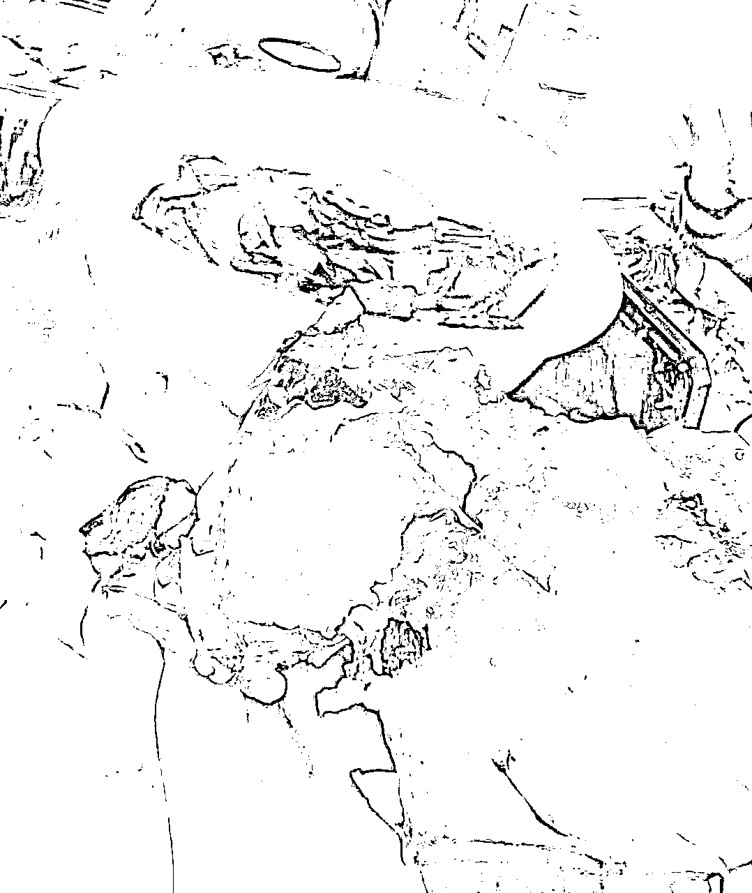
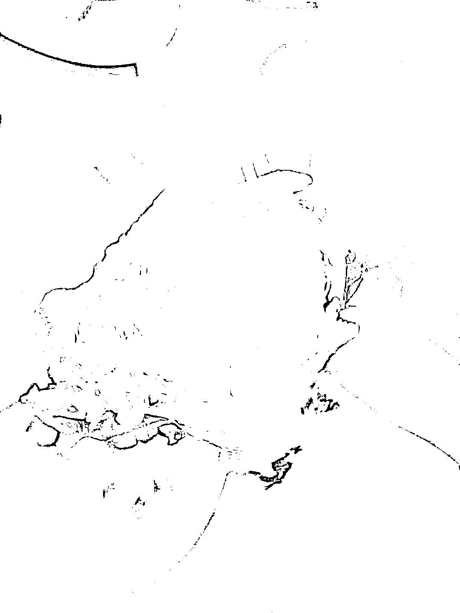
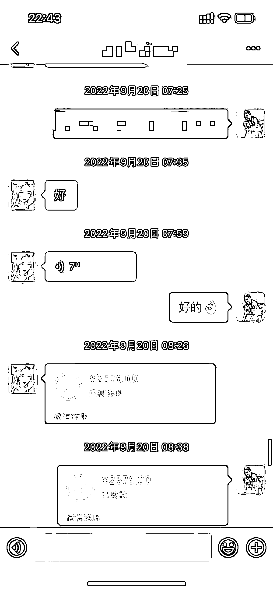
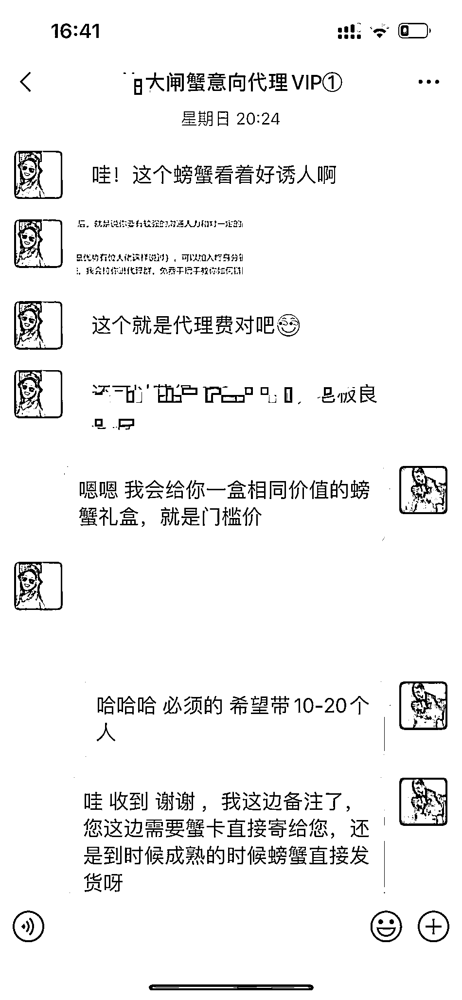
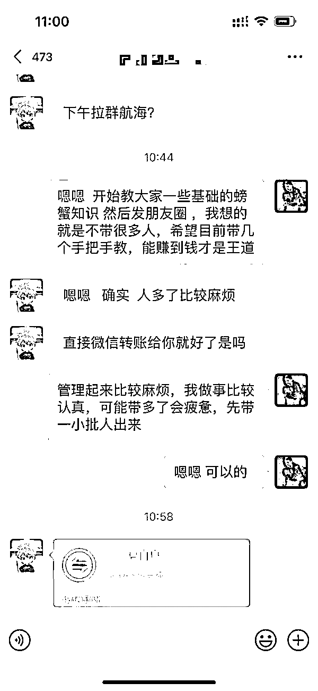
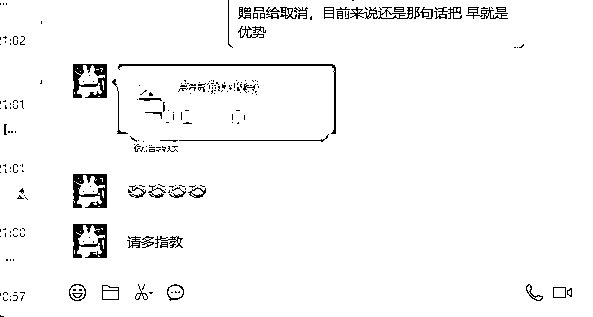

# 螃蟹里的小众蓝海——断脚蟹，把别人看不上的东西处理好，10 天利润 2W+

> 原文：[`www.yuque.com/for_lazy/thfiu8/ylcask3hmbbu3kwp`](https://www.yuque.com/for_lazy/thfiu8/ylcask3hmbbu3kwp)

## (精华帖)(397 赞)螃蟹里的小众蓝海——断脚蟹，把别人看不上的东西处理好，10 天利润 2W+

作者： 帅彬

日期：2023-09-15

又快到该吃螃蟹的时间了，不少朋友也准备买螃蟹来送人，通常大家一般会送蟹卡。

而蟹卡的玩法，在市面上也比较常见。

作为一个接触这个行业已经 10 多年的人，我今天来分享一个更小众的玩法。

大家好，我是星球帅彬，目前就职于常州市交通产业集团，今天给大家带来我的副业之路，尝试卖断脚蟹。

# 一、自我介绍

我的名字叫陈炎彬，1995 年出生，在南京江宁上的一个大专院校，后来专接本上了西南大学的市场营销专业。

对于选择我有一些感触，有的路顺其自然的走最好，有的坑该自己踩的必须要自己踩一遍，别人帮的了你一时，下次可能会再遇到可能会踩更大的坑，而别人不会一直在你身边，而且身边的人大多认知是和你持平的。

所以他们的建议基本对你没有什么更好的判断和选择。

我是 15 年 7 月份实习的，当时学校有校招的机会，是南京 14 所，长江电子，熊猫集团等这些大型国企的合同工，而我在家人的安排下选择了苏宁总部，多走了至少 10 年的弯路可以说是。

我是今年 5 月份加入的生财大家庭，在之前我知识付费过很多，也被割过韭菜。

在加入生财后我发现大家庭和外面是完全不一样的，里面可以说是什么赚钱的知识和技能点都有，但很多都是碎片化的，需要一步一步自己把碎片拼凑起一个拼图，去寻找宝藏。

# 二、做什么领域、卖什么产品

先给大家普及个冷知识，目前长荡湖 10 年禁捕，，以后的养殖塘蟹会越来越多，固城湖和阳澄湖也类似，多数品牌蟹都是挂的商标货源也是蟹农养殖的塘蟹。

自己家里在常州金坛长荡湖附近有蟹塘，蟹塘雇佣了 2 个工人在养螃蟹，自己得空也会去蟹塘，而且家里的亲戚也有做养殖大闸蟹生意的，从养到收到包装到发货，可以说已经形成了一个产业链。

大家可能觉得阳澄湖大闸蟹名气比较大，殊不知大家吃的阳澄湖大闸蟹 99.9%都是假的，可以这么毫不夸张的说。

这里和大家说一下主要的套路。

阳澄湖大闸蟹可以有如下分类：

1、本地蟹：阳澄湖土生土长的正品蟹，又称本地蟹，不到 1%。（基本本地人也吃不到，更不要说大家自己买的了）

2、移民蟹：其他地方的蟹苗，最后来阳澄湖长 1-3 个月镀金增值，不到 2%。

3、洗澡蟹：其他地方的蟹苗，提前几天投入阳澄湖，贩卖的时从阳澄湖捕捞出，大概就洗了个澡，不到 3%。

4、听涛蟹：毕竟湖面有限，洗澡蟹太多的话，也排不上队，一些商家干脆把其他地方的螃蟹运到阳澄湖岸边卖，这种螃蟹只听过湖面涛声，没下过水，澡都不洗，约 10%。

5、授权蟹：由于听涛蟹太多，占地方都难，阳澄湖开放了品牌授权，当地商家可以申请，成功了你就也是阳澄湖大闸蟹，这很羊羊羊，约 20%。

6、标签蟹 ：既然可以跑跑授权，各地的螃蟹，就可以不收钱只打标签开始卖了，毕竟这个事很难查，就有了标签蟹，约 64%。

说完了套路，站在养殖户的角度，简单的和大家聊一聊养殖大闸蟹的一些流程。

**1.水草种植**

水草是组成池塘养殖环境的重要部分，是河蟹生长发育中必不可少的饵料来源和栖息蜕壳的安全保障。水草能吸收水体中无机盐和营养物质，净化水质。

**2.螺蛳投放**

螺蛳也是河蟹生态养殖过程中的重要组成部分。它既是河蟹的天然饵料，也能净化水质，消化水底残余饲料。

**3.选苗**

现在各地养殖户选的基本都是人工蟹苗，而且不是当地蟹苗，一般投苗时间在 3 月的样子。

**4.饲料投喂**

以动物性饲料为主，植物性饲料为辅。动物性饲料以鲜活小杂鱼为主，辅以小麦、玉米、豆饼等，小杂鱼一定要新鲜，腐败变质饲料禁止入塘。

**5.水质管理技术**

在蟹种投放前要培育池塘水的肥度，这一过程一直延续到水温增加到 20℃左右为止。实践证明前期池塘水保持一定的肥度还能预防蟹塘顽症－青苔的生长。水质对于大闸蟹的生长有着至关重要的影响，可以这么说好水出好蟹。

**6.病毒防治技术**

冬季将蟹塘池水排干，清除池底过多的淤泥，每亩用 150－200 公斤生石灰进行消毒，塘底在整个冬天日晒夜冻，简称清塘。

不同的时期螃蟹可能也会有不同的小毛小病一定要用适合的药，螃蟹有时候比人还金贵，一下子不小心，就是大批量的死亡，可能一年忙到头，要丰收了，但是却一蟹塘一蟹塘的死，你说心痛不心痛。

养殖螃蟹当然是门技术活，每年不可抗因素比较大。高温会导致螃蟹缺氧大量死亡，还有水草的多少和养殖的喂养也会影响螃蟹的存活率。

基本就是这些，养殖的注意点，但是并不是懂了养殖的注意点就能养好大闸蟹哈，因为不可确定的要素太多了，比如 2022 年夏天天气炎热，螃蟹都是成批成批的死亡。

所以很多人做中间商，就是海贩子，不需要养殖，没有养殖的风险。

**做为海贩子或者来蟹塘拿货的门店有什么好处？**

首先是没有养殖的风险，从我们蟹塘批发，项目周期为每年 10 月份到 1 月中下旬（每年过年前），项目黄金周期大约 3 个月。

去年接触了生财的前辈自己萌生了想要赚点小钱的想法，所以尝试在朋友圈卖蟹，目前在卖的有礼盒蟹、断脚蟹，没想到朋友圈还是很给力的，开始就发的自己吃螃蟹的图片，还是有很多人购买。

10 月中旬是母蟹上市，拍的都是母蟹的照片。

公蟹上市的时间是 11 月中下旬，还是老样子拍我们自己吃的照片和视频，比较吸引人。

这样吸引了朋友圈很多客户，来购买我家的螃蟹，送螃蟹是有寓意的，是祝你大发横财！

螃蟹：寓意富甲天下或八方招财，纵横天下。

螃蟹总是寻找水质清晰，阳光透彻，水草茂盛的水域栖息...

寓意好：大闸蟹，八条腿，就是发。两个夹，就是抓。煮熟后个通红，象征红运当头！

”味道鲜美、营养健康、“敢蟹”寓意为敢吃螃蟹即改革创新和勇士精神。

当然还有很多是自己吃的，自己吃就不必追求蟹的完整，主要吃的是蟹黄和蟹膏，就是所谓的断脚蟹，断脚蟹是按斤来称的，我为了方便卖也是按个卖，按照不同的规格打包价，200 一份，300 一份都有。

**教一下大家怎么选蟹。**

1、看外观，肚子圆圆是母蟹，尖尖是公蟹，青壳选择有活力的，死蟹千万不能吃。

2、捏一般是从下往上数第二条腿，我们一般说“钢筋腿”就是捏着比较硬，捏不动的样子，螃蟹每次蜕壳，身体都从软到硬，越硬说明成熟度好，软脚蟹不能选。

3、看厚度。

母蟹看屁股顶盖轮胎缝越宽黄越满最好。扒开肚脐泛红，鼓起来说明肉质和黄是饱满充分的。

公蟹看嘴，红嘴了一般品质都不错，然后看胸前平整度，凹陷下去的不要挑，黄的多少跟喂养的鱼和玉米有关，吃的好，长得好。

非专业人士请勿模仿，很伤螃蟹

螃蟹主要就是吃的蟹和膏，断脚的螃蟹价格不及好蟹的十分之一，实在可惜，其实吃都是一样的吃。

之前有个女客户问我有没有断脚蟹，脚全断的那种，我回复她，断脚蟹挺好找的，但是全断的可比全脚蟹也难找。

因为客户喜欢吃黄和膏不喜欢吃蟹腿嫌扒腿麻烦，哈哈。

# 三、流量从哪里来

断脚蟹前期我会送一批，因为中后期蟹塘每天打捞螃蟹会有断脚蟹，然后通过朋友圈发广告，会有很大一批客户来购买我的断脚蟹。

有不少客户是我常州新房群里加的，在群里会有客户问哪里卖大闸蟹，哪里店里卖的大闸蟹品质好，我就会加上好友。

然后和客户好好介绍我的产品，邻居们看到我真实的头像都会有一种信任感，也有好多客户说是我用真实的头像看上去也整个人比较干净的感觉才会加我和我做生意。

加上好友，我就会用我了解的专业知识去解答客户的一些疑惑，还有毕竟我是蟹塘的一手货源，在价格上比在店里卖的商家会有价格优势，我会给邻居让一些利。

在他们吃完后，感觉螃蟹的质量很好，就会给我介绍客户，这样在卖房的群里我就变成了一个卖长荡湖大闸蟹的小帅哥 IP。

自己也会在小红书上引流，只要加我微信的小红书客户，90%都购买了我的大闸蟹。

我也会主动链接微信好友，谈一谈他们需不需要大闸蟹。

# 四、蟹卡

为什么首先先推蟹卡，因为蟹卡一般是买来送礼的，教师节、中秋送螃蟹螃蟹还没有成熟，所以一般人会先送蟹卡，目前蟹卡送礼已经成为了流行。

中秋的螃蟹还没有成熟，吃起来就像吃生米饭一样，所以送领导送朋友蟹卡这样等螃蟹成熟的时候自行兑换比较方便。

母蟹好吃的时候在 10 月中旬，公蟹的成熟期比较晚一些好吃的时候在 11 月份。母蟹吃黄、公蟹吃膏，你吃这个蟹吃起来香甜可口，黄或膏比较饱满，那说明这个蟹就是好蟹。

而且蟹卡企业和政府采购比较多，都是大批量的采购，能尽快把自己蟹塘的货出掉就不错的，蟹卡就是一个很不错的选择，提前回笼资金。

而且我的长荡湖蟹卡承诺永不过期，十年后再来提蟹一样安排发货。不会说两三年后再来兑换就不给你发货的尴尬情况。

# 五、如何变现

好蟹的价格太贵了。一般人送礼才会买礼盒蟹。

断脚蟹的利润为 35%-45%，而且大家购买断脚蟹基本都是 200-300 元区间，一般都是按斤来称断脚蟹，不过前期为了好卖，我都是按个卖，公母搭配，然后一捆，多少斤。

一捆打包 150、200、300 元。

在苏锡常还有泰州、高淳等地大闸蟹的市场已经算是很饱和了，我有个表舅是做的卖蟹生意，90 年代在常州金坛开的第一家卖蟹的店，丝毫不夸张，92 年的万元户。

而且据他说那时候第一年是赚了 20 万元，那时候我们地方 6 万元可以买一套房子了。

但是到 95 年随着大闸蟹门店的越来越多，金坛的客户也被瓜分了，门店生意开始走竞争化。

98 年更有黑社会势力的涌入，让政府和机关单位企业都买他们家的门店，弄螃蟹送礼（后面衍生为蟹卡送礼），听我表舅说这个“黑”店的开张让他们老百姓的生意做的大大不如以前，98 年那几个月这个“黑”店就赚了 100 万元。

而且那时候他们去长荡湖拿货，到现在还有 30 万的货款没有结清，那时候长荡湖是可以养殖螃蟹的。

现在长荡湖 10 年禁捕，大家吃到的都是长荡湖授权的养殖蟹，我们这长荡湖的名字被一家公司注册去了而且弄了专利，毫不夸张，这家公司靠这 3 个字就可以一辈子衣食无忧。

像以后大家吃到的基本都是养殖塘蟹了，可以说是很多地方都发文禁止在保护区养殖围捕（类似长荡湖这样的地方养殖螃蟹，捕螃蟹了），不遵守轻则罚款重则坐牢。

这里有个冷知识大家吃到的阳澄湖大闸蟹 99.9%都是假的，什么过水蟹、听水蟹、外来蟹等等，大家吃到的都是这样，一挂上阳澄湖的名字价格翻几番。

现在毫不夸张在我表舅的店旁边开了有 50 多个卖螃蟹的门店，现在基本都是做外面的客户，大家都有自己的门道，短短 4 个月，从 10 月开始，过年结束，这些店好的赚个几百万，不好的赚个 4、5 十万。

现在视频号和抖音对实体的冲击还是有的，估计用不了多久，门店卖货又会出现新的玩法。而我看好的就是断脚蟹市场，你们做高端，那我普通老百姓就做做下沉市场，用口碑取胜。

在闲鱼上我也发现了很多人卖断脚蟹，生意也非常好，而且网上卖家不算太多，看来螃蟹市场目前来说也算是蓝海的市场。

特别是近几年螃蟹还能招代理帮卖，收代理费，然后一起共赢，售前是代理，发货和售后都是卖家，而且这个生意是每年都会有的。

今年做的好，明年就会更好，因为客户每年都吃螃蟹的，你只管卖出去，我拿我的价格，其他的价格你和你的客户谈。

你质量好，价格实惠明年还选择你家，但是遇到比较坑的货源或者二手代理，质量不能把控的，今年在你这买，明年那就不一定了。

自己也招了几个代理来帮忙卖我的产品，以很低的代理价给他们。在我的代理价上可以加价卖，我的价格在精品蟹类是很低的价格，因为我是蟹塘直接发货所以质量能保证，价格也可以保证是实惠的。

先带领大家把这个项目转起来，3 年入行，5 年懂行，10 年才算真正的行业王者，而我会毫无保留的告诉你一些行业知识和大闸蟹套路。

放一部分照片

首先我保证重量是净重，不含绳，保证足斤足两，按实际标注的螃蟹规格发货，不缺斤少两。

当然，大闸蟹在运输过程中，会不停的吐泡泡， 中间会有 6% 左右的水分流失， 这属于正常范围， 但是一定会保证在蟹券的规格范围之内， 超出正常水分流失可以联系我进行理赔，这是我和代理们承诺的。

就是你负责售前，我负责售后、物流、货源。

卖蟹基本有这几端：

1、蟹塘：直接发货，大量批发给海贩子也做做零散的单子。做的是最辛苦的一层，稍微哪个环节出错，一年到头白忙活了。

2、海贩子：蟹塘货拿过来，去外面赚差价，比如我们这边的蟹拿到高淳、泰州去卖或者卖到集市和门店。

海贩子利润也比较大，但是辛苦，晚上基本都是一夜一夜不睡觉。好处就是没有养殖的风险，养殖死亡率风险会导致今年颗粒无收。

3、门店：传统生意和互联网相结合，蟹卡预售。吃的是人际关系和人脉。

4、互联网：蟹卡和实物相结合在各种电商平台，注册营业执照无需囤货，拼多多、视频号、京东等各大平台。

可玩性比较高，年轻人的舞台。

朋友圈也算互联网的模式，招代理，代理发货，以微商的形式出单，就是代理负责维护客户。

# 六、项目核心

项目核心问题是货源和质量。

你有货源，如果有信任的蟹塘主，也可以做到一件代发，相当于做闲鱼无货源嘛，而且不需要囤货。

有能力者可以注册营业执照弄视频号或电商的直播带货，和货主聊好有源源不断的货源就行，发货是顺丰速运，其他快递京东也有保证，这两个快递公司能保证时效性。

质量的话，你都要有经验才能看出，等上市的时候有的蟹腿软了吧唧的，还有蟹壳扒开来一看里面就是空的那这个蟹就不好，有的蟹长的特别的大，但是其实里面都是空的，肉也没有，黄和膏也没有。

就是这个养殖蟹的没有经验，在蟹发育的时候没有补充充足的营养，导致螃蟹虽然个头大但是华而不实。

这类情况有很多，出现在新手养殖户的身上，什么时候要多喂，什么时候要少喂些都不知道，螃蟹也和小孩一样，每次蜕壳都是一次生长发育的过程，打个比方你在发育期间不多吃点，身体能长好吗？

不建议自己去养殖，养殖的核心和步骤太复杂，稍微不谨慎会功亏一篑，而且螃蟹会一塘一塘的死，也就是为什么会养这麽多亩蟹塘，就是不把鸡蛋放一个筐子里面。稍微说几点：

1、蟹种放养前，清除塘底及四周圩槽沟过深淤泥，为了螃蟹安全度过夏季。

2、养殖螃蟹关键的是是草和水质。

3、螃蟹也吃 VC 和复合维生素，还吃螃蟹吃的蛋白粉，平时喂养都是鱼和东北玉米，但是鱼不是天天喂的，要荤素搭配，不然得不偿失。

4、合理用药尤其是夏秋高温阶段，严格把握好塘口杀藻、杀菌、杀虫用药的品种、剂量、时间和方法，防止造成药害或副作用。

如伤害水草、螺蛳、蜕壳蟹及软壳蟹，以及藻类死亡引起水质突变，缺氧浮头等。

5、螃蟹很金贵，稍有不慎就是大批量的死亡。

还有很多，这里就不一一展开了，有兴趣的可以后期找我单聊。

说了这么多，所以还是找蟹塘代发比较方便一些的。但是有的蟹塘不会因为你的几件货烦心，毕竟源头都是大批量的按斤来卖。

这样你就要拿一批货，自己养殖在水池里面，也可以冲一下蟹塘里面的泥腥味，让螃蟹吐吐水。

螃蟹为什么要绑扎起来运输，就是防止螃蟹在运输的过程中活动消耗能量，运输途中螃蟹会保持休眠状态，我们会在盒子里放上冰冻的冰袋保鲜。

附上大闸蟹的保存方法：

1、如果活蟹买回来后不急着吃，第一步我们先把它放水龙头下冲一-冲，让螃蟹吸收一些水分。

2、接着再把它放到冰箱的冷藏室里，是冷藏室！！！不是冷冻室！！！冷藏室温度设置在 5°C 左右

*螃蟹在低温环境下，会降低代谢，处于休眠状态，这样可以避免螃蟹体力消耗，延长螃蟹生命。

3、放好后，在螃蟹上盖一条拧干的湿毛巾（不能全湿也不能全干）

*盖湿毛巾的作用是因为螃蟹喜欢潮湿的环境，这样可以起到保湿的作用购用这个方法螃蟹应该可以保存一周左右不死，不过一定要保持毛巾的湿润。

注：断脚蟹保存方法同上

# 七、经验分享

想要做好一件事情就要坚持不断的努力，不能半途而废，不能今天想着做这个，明天想着做那个，后天又换一个做做。

目前做大闸蟹销售行业的现状还是蓝海前景，因为首先货源的问题，基本螃蟹很吃水质，而且基本是江苏特别是苏南的水质更适合养殖螃蟹，如果你吃的螃蟹吃起来味道带点甜，清香，那么恭喜你吃到了一只好的螃蟹。

什么样的人可以加入这个销售行业：

1、有强烈执行力的人，身边有喜欢吃螃蟹的圈子的人；

2、有丰富资源的人，客户群体是大客户这样；

3、吃过我们家螃蟹的人，喜欢吃甜蟹；

4、有送礼需要的人；

5、想长期做下去的人。

那么建议你可以尝试一下这个行业。

在你想清楚要做什么生意赚钱的时候，首先要考虑的是你有什么资源，然后可以资源变现，如果你没有好的资源的话，不妨多出去走走，在生财多逛逛，学会合作。

最后在赚钱的同时还要锻炼好自己的身体，保持充足的睡眠，毕竟赚钱的目的是更好的生活，没有了健康的身体什么都是空谈。

我也是健身爱好者，每周锻炼胸、背、肩、手、腿这几个大肌群，喜欢深蹲和卧推，有兴趣的可以一起交流交流。

“秋风起，蟹脚痒；菊花开，闻蟹来”。

吃螃蟹，秋天最该有的美食态度！

不知不觉已经接触大闸蟹这个行业 11 个年头，我想会持续做下去！

* * *

评论区：

来颗苹果咩 : 太有意思了
帅彬 : 谢谢大家阅读，谢谢大家点赞，十分感谢鱼丸、生财的各位家人、靠谱女神！！！
帅彬 : 嘿嘿 生活充满着乐趣有意义
坏脾气的小可爱 : 太厉害了，陈老板
一朵云 : 链接下老板
橙丫 : 哦，没想到原来螃蟹也有，这么多的分类……
帅彬 : 谢谢😊
帅彬 : 是的呢，哈哈😆

* * *