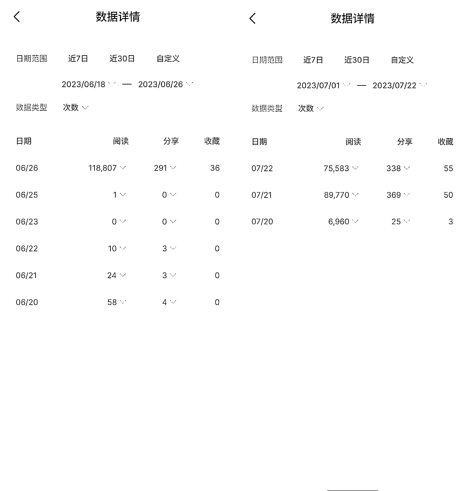
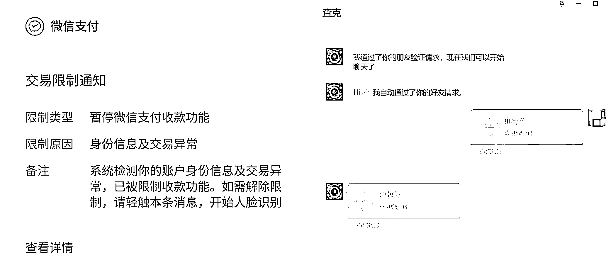
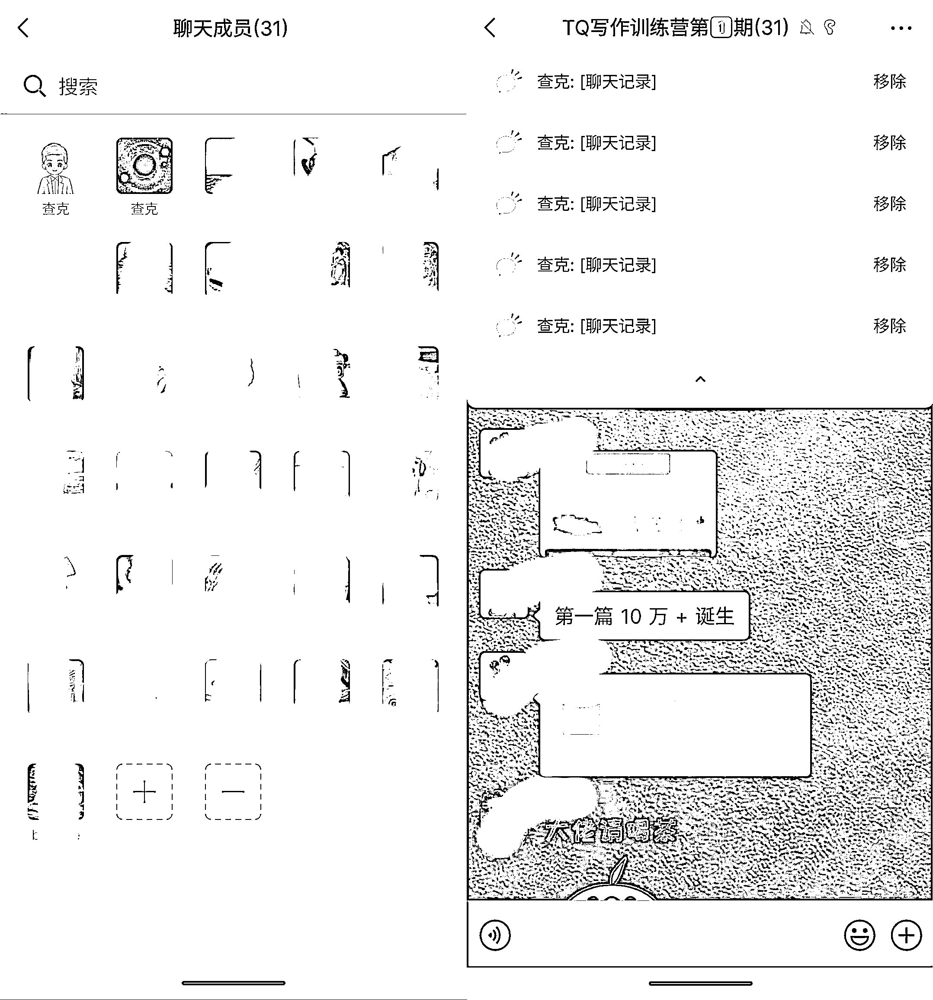

# 我是如何通过生财航海 1 天赚回 5 张门票的

> 原文：[`www.yuque.com/for_lazy/thfiu8/ziov5ru68eedoq3f`](https://www.yuque.com/for_lazy/thfiu8/ziov5ru68eedoq3f)

## (62 赞)我是如何通过生财航海 1 天赚回 5 张门票的

作者： 查克

日期：2023-09-12

本文详细介绍我是如何通过生财航海，1 天赚回 5 张门票的。我把详细操作以及心路历程分享出来，可迁移性非常强，希望对大家有用。

首先要感谢 [@宋大范儿](http://@%E5%AE%8B%E5%A4%A7%E8%8C%83%E5%84%BF)、[@🐵Sunday🐵](http://@%F0%9F%90%B5Sunday%F0%9F%90%B5)、[@薇姐创富](http://@%E8%96%87%E5%A7%90%E5%88%9B%E5%AF%8C)、[@Start9527](http://@Start9527)、[@内容经纪人一三](http://@%E5%86%85%E5%AE%B9%E7%BB%8F%E7%BA%AA%E4%BA%BA%E4%B8%80%E4%B8%89)、[@书豪](http://@%E4%B9%A6%E8%B1%AA) 以及其他的大佬、大嫂在不同阶段从不同角度给予我帮助，促成了这段搞钱历程。

## 自我介绍

先放一段自我介绍。

我是今年 4 月加入生财的萌新，刚好赶上了 5 月的航海。我参加的是【公众号爆文】，从 5 月航海到 6 月续航到 7 月再续航，都参加了。

有一次没打满 21 天，因为那次在弄北京生财群的聊天记录，忘记时间了……

航海的内容，大家可以去看 [公众号爆文写作｜实战手册](https://search01.shengcaiyoushu.com/docx/NSfNdXVuPoQ3mTx1LnpcBnpanie)。

## 航海总结

我自己总共运营 4 个号。

1.  一个是自己一直写的号，主要记录日常生活、技术和投资。

2.  一个是参加航海新开的号，主要写情感故事。

3.  一个是旧号，没留言，从家人手里拿的，主要写天气主题。

4.  另外一个也是旧号，有留言，主要写养老。

自己的号一直中规中矩，阅读量从最初始的几十到现在的几百，高的时候几千，最高 2 万多。

情感故事号一直跟着 5 月航海走，日更到第 11 天，阅读量才上百；日更到第 16 天，阅读量才上千；航海结束，到 8 月份才上万。

天气旧号就好太多了，6 天就入池，一入池就 10W+。养老旧号更猛，当天入池，第二天直逼 10W+。

到航海结束的时候，收益最少的一个号都 1W+ 了。收益高的号，8 月中旬群里答疑的时候不小心发截图到群里了。

到这里，这次航海的收益已经几十张门票了。但这不是今天要介绍的重点。

下面说重点。

## 训练营

我很早就听过一句话：`30 分的教 0 分，60 分教 30 分，80 分的教 60 分` 。但也正如“懂那么多道理也过不好这一生”一样，对这句话仅仅停留在知道。

后来不断地参加线下 Start 和宋宋姐组织的线下聚会；以及薇姐和一三的小局；还有跟 Sunday 的交流。突然有一天好像理解这句话了。

### 成绩

先说成绩，训练营 29 人，结营时只有 1 人退款，其他人都实现了目标。

1.  经济账是 29*499-450=14021，另外还有好多几块几十块的红包。

2.  另外一个价值是收获了 28 个老铁，可以一起搞事情。

3.  更大的价值是打开了思路，拓展了自己的舒适区。

### 预热

8 月 12 号，心血来潮，往往群里发了个邀请，想着拉几位伙伴一起搞搞。

然后群成员在很短时间内就增加到接近 200（群里有圈友，哈哈，他潜水被我发现了）。

这可大大超出我的设想，一时不知道该怎么搞了。

群里一直问要搞啥，怎么搞？我只好说还在想。然后开始有人退群。看到有人退群，我心里一凉。但朋友跟我说，没关系的，这些人，现在不退后面估计也不会参加你的项目，也算是筛选。

### 招募

8 月 14 号，我 5 点多突然醒了，突然有一股冲动，要开个班。然后起来写了一段招募文字，往群里发了出去。

这文案一发出去，马上开始有人在群里问各种问题。但同时，也有人开始打钱。不到 10 分钟，就满 20 人了。后来还有人不断转账、咨询，最后把转账的人也收了，

因为没有提前准备，招人是手忙脚乱的。首先是收款码，瞬间就被限制收款了。不过这难不道大伙，他们马上开始转账，有人没加我微信好友，直接加我机器人转。

又因为没有提前建群，收钱后突然不知道该如何登记。才又匆忙建群。结果扫码支付里不少人没备注，我得挨个找人。到最后还落了一个人付钱了但没进群。

报名阶段还有很多好玩的事情，但跟主题没太大关系，这里按下不表。

### 交付

#### 交付计划

这招人只是第一步，关键是交付。但是参加完航海，交付变得如此简单。

下面是交付计划：

#### 开营

开营部分，我参考航海手册和自己的实战经验，总结了一份一万多字的文档。

首先是前期准备部分，拉群当天，我先让大家去注册公众号，然后开通流量主。

拉群第二天晚上 8 点，通过腾讯会议，进行了 2 个多小时的开营介绍，分享了我理解的关于爆文最本质的东西。

前期准备工作，第一天和第二天白天已经处理完了。训练营公约，则完全参考了航海公约。其他部分参考爆文航海，不再赘述。

#### 打卡

这里需要提一下打卡。因为没有打卡系统，我找到了一个小程序，简单设计了一下，让大家打卡；我针对打卡做批改。

#### 分享

分享分为两部分，一部分是我来输出，另外一部分是学员自己讲。

我分享部分主要是“教”，把一些具体的做法告诉大家，包括：

1.  如何用 BING 来生成公众号爆文

2.  如何找对标

3.  如何用 ChatGPT 写热点文

4.  如何用 ChatGPT 写情感文

5.  公众号快速入池的方法

6.  公众号流量主的经验分享

通过这些内容，告诉大家怎么找对标、怎么实现对标，从而能够产出自己的内容。

学员分享部分是借鉴了再续航里的方法。教练、高手分享再多，也不如自己分享来得深刻。让学员自己分享，一方面增加学员的参与感；另一方面，也有助于学员总结自己的操作方法，找到提升空间。

#### 答疑

交付的另外一部分内容是答疑。学员把问题发在群里，我看到了就回答。因为人数不多，并没有借鉴航海的 #举手 标签。

只要认真参加过航海，自己也实践过，基本上问题都能解答。

训练营就这么简单地开起来、交付完了。

每个航海，都可以借鉴做成训练营。

### 总结

这次训练营当然也有问题，但这不重要，重要的是动起来了。后面有问题解决问题就好了。

再次感谢航海和各位大佬大嫂～

* * *

评论区：

加英 : 厉害的哇
三三 : m
书豪 : 查克牛，执行力一流，商业嗅觉敏感
查克 : 书豪大佬带得好，多谢大佬！
查克 : 我继续向各位圈友们学习[奋斗]
财火 : 组长牛逼[强][强][强] 很荣幸在他的航海组。
查克 : 跟你一个组是我的荣幸啊！啥也没做就被你们卷到了榜一[调皮]
羽晗 : 怎么添加大佬

* * *