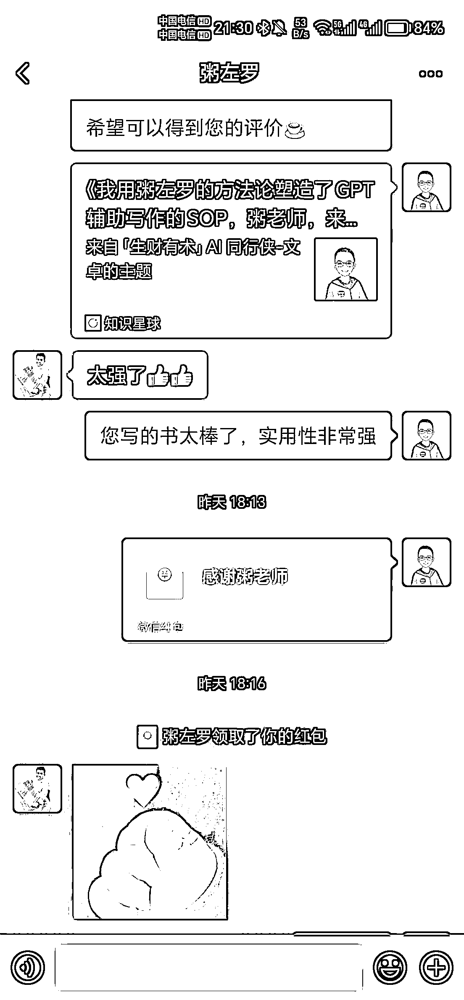

# 我用粥左罗的方法论塑造了 GPT 辅助写作的 SOP

> 原文：[`www.yuque.com/for_lazy/thfiu8/vc6e7054drriddb6`](https://www.yuque.com/for_lazy/thfiu8/vc6e7054drriddb6)

## (精华帖)(178 赞)我用粥左罗的方法论塑造了 GPT 辅助写作的 SOP

作者： AI 同行侠-文卓

日期：2023-09-18

《我用粥左罗的方法论塑造了 GPT 辅助写作的 SOP，粥老师，来评价一下？》

大家好，我是 AI 同行侠-文卓，现在专注于 GPT prompt 在写作领域的应用

2023 年 3 月，我决心深入探索 GPT 的世界，

无论英语、编程还是写作，我都不懂，但这些都未曾成为我的障碍。

看过我另外一篇精华贴的圈友都知道，

半年前的我不懂技术、不会英语，也没系统学过写作，

精华帖传送门：

参加图书共读航海短短 13 天，

我塑造出了 GPT 辅助写作的 SOP，包含 7 个步骤，多个 prompt。

让我们先来思考 2 个问题：

1、GPT 真的只是简单的模仿和‘洗稿’吗？

2、它是否有着更深层次的价值，可以助力我们更高效地创作内容？

今天，我将与大家分享用粥老师的方法论塑造的 GPT 辅助写作的 SOP，

希望我的“剑法”能够得到粥老师和大家的认可。

GPT 辅助写作的 SOP 大纲：

一、GPT 辅助生成文章选题

二、GPT 辅助生成文章提纲

三、GPT 辅助生成文章标题和小标题

四、GPT 辅助扩写文章正文

五、GPT 辅助扩写文章开头

六、GPT 辅助扩写文章结尾

七、GPT 辅助改写文章

由于展示的图片较多，请大家移步飞书观看：

使用电脑观看体验更佳，边看边跟着实操学习的更快

你有多久没有系统地看完一本书了？

感兴趣的圈友推荐看一下粥老师的《学习写作 2.0》

一个高质量的技能书配合 GPT 的 prompt，不是能够轻松超越许多竞争者吗？

来吧，卷起来！希望这篇分享能给你带来启发

粥老师，评价一下？

* * *

09.19  22:00 更新

感谢大家的认可和关注，粥老师的评价来了，请查看图片观看粥老师的评价

这篇文章既是 GPT 辅助写作 SOP，也是提炼方法论制作 prompt 的基本原理讲解：
1、通过阅读书籍内容提取方法论
2、将方法论转化为 prompt
3、将 prompt 应用到想要的写作步骤。
所有 GPT 辅助写作的 prompt 都在每个步骤分享的图片里。

如果你觉得看图片太麻烦，只想要简化版 GPT 辅助 写作 SOP，拿着 prompt 就能实操的那种，请通过评论告诉我。[`t.zsxq.com/12uzqJl3e`](https://t.zsxq.com/12uzqJl3e)[`fieghf3pzz6.feishu.cn/wiki/KOuZw6qqMirqo4kvWpacJHqNnkc?from=from_copylink`](https://fieghf3pzz6.feishu.cn/wiki/KOuZw6qqMirqo4kvWpacJHqNnkc?from=from_copylink)

* * *

评论区：

小满 : 哇塞！！
江南 style : [强]你是真的会读书
诗媛 : 优秀的文卓
朱小茜同志 : 太有用了，棒棒哒
饭饭 : 很详细
一诚 : 太强啦~[强]
三生 : 优秀
健叔的 jian : [色][色][色]感谢分享，正需要这方面内容学习。

* * *