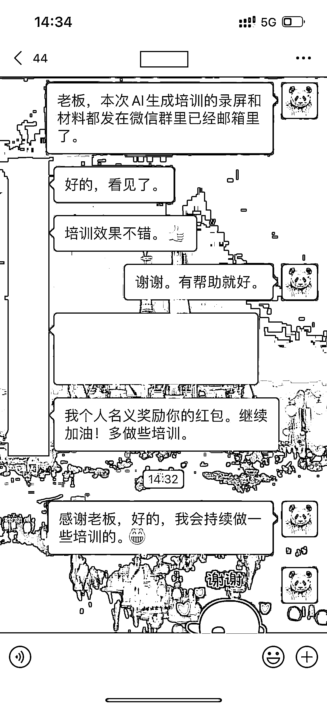

# 超全的 AI 工具生成 PPT 的思路和使用指南

> 原文：[`www.yuque.com/for_lazy/thfiu8/glihavpsg70czzrw`](https://www.yuque.com/for_lazy/thfiu8/glihavpsg70czzrw)

## (精华帖)(74 赞)超全的 AI 工具生成 PPT 的思路和使用指南

作者： 熊猫 Jay

日期：2023-09-19

超全的 AI 工具生成 PPT 的思路和使用指南, 含完整提示词, 收获培训奖励 1000

大家好, 我是熊猫 Jay, 因企业内部要求, 特此编写这篇文章做内部培训, 也公开分享给大家, 希望对大家有所帮助.

你可能是 PPT 的专家，也可能是新手；或者就像我一样，很少深入制作 PPT。但我们共同的愿望是：如何通过 AI 工具更高效地制作 PPT，满足不同需求，提高工作效率。

想象一下：
1、如果你是一个不经常制作 PPT 的小伙伴，今天突然被要求用 PPT 做一个报告或培训，你会如何快速生成 PPT，同时确保不影响你的主要工作？

2、如果你经常制作 PPT，已经积累了大量的素材和经验，如何更加快速地生成高质量的内容，特别是在不熟悉的领域？

AI 工具现在提供了多种精美的 PPT 模板，无论你所在的行业，都能为你提供合适的幻灯片设计。这将大大节省你组织内容和编排思路的时间，并帮助你的 PPT 既有专业感又具有个性。

接下来，我们将为大家详细介绍市面上最受欢迎的 5 款 AI PPT 工具:
1、MindShow
2、爱设计
3、闪击
4、Process ON
5、WPS AI

每一款工具都有其独特的优势，它们都能助你快速、高效地完成 PPT 设计。相信经过本次文章的阅读，你会发现这些 AI 工具是你设计 PPT 的强大助力！

全文请移步:

PS: 由于本篇文章是我为企业内部做的培训材料, 效果不错, 因此还获得老板的 1000 元 红包奖励. 也解决了小伙伴的整合 PPT 和 AI 的需求, 真的备受鼓舞呀!

如果有帮助, 帮忙点个赞哦, 小伙伴们的点赞是我继续创作的巨大动力

* * *

评论区：

我是老赵，赵子龙的赵 : 我的老板：你这都是啥呀，这谁能看懂，说的我们（老年人）能看懂的，这个月考核降级，重新写。
熊猫 Jay : 哈哈😄
雨烟 : 优秀！
熊猫 Jay : 谢谢圈友
亦仁 : 感谢分享，已加精华。
芷蓝 : 纯实操干货，有收获！
熊猫 Jay : 谢谢亦仁老板！[呲牙]
芷蓝 : 制作 ppt 如果放到自媒体变现的场景上，那么就有了更多的商业模式，比如说用 gpt➕提示词搞定自己的课件，这就属于产品制作的场景啦～厉害厉害

* * *