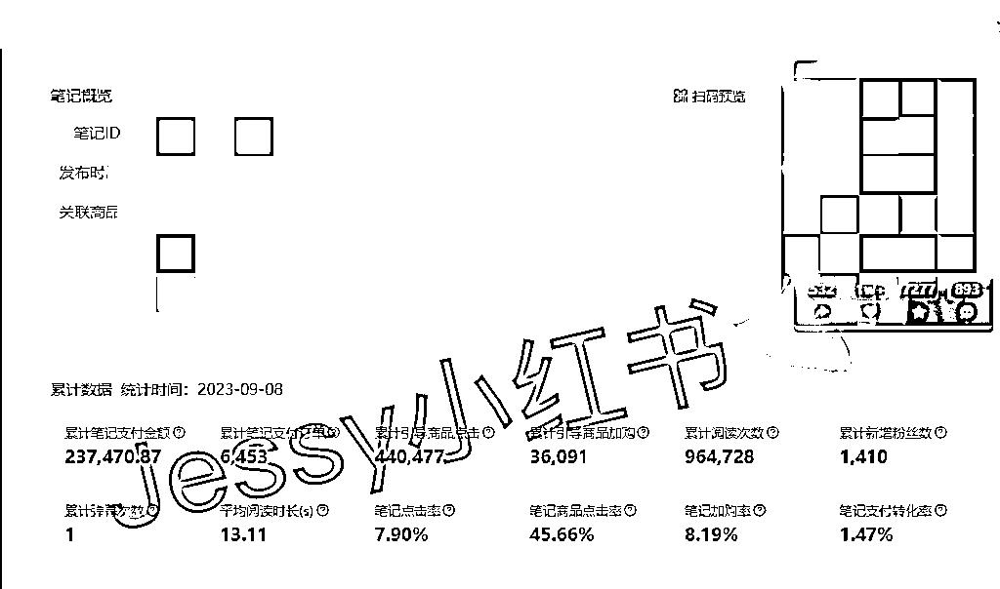
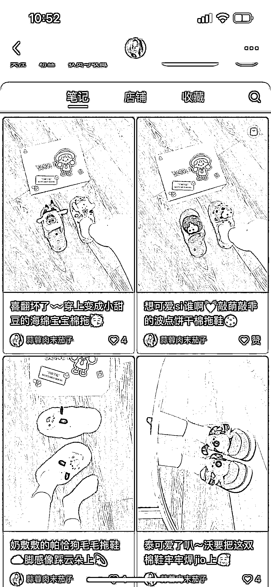
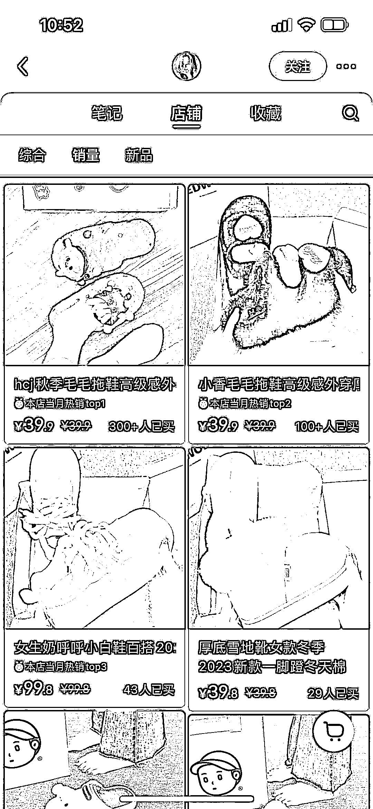
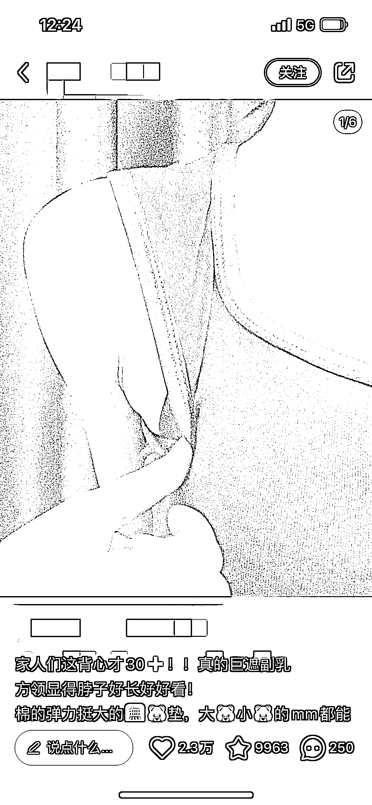

# 15 分钟每篇，单篇最高变现 23w——如何批量做出原创带货笔记？

> 原文：[`www.yuque.com/for_lazy/thfiu8/yidxic1uq9u3vn4c`](https://www.yuque.com/for_lazy/thfiu8/yidxic1uq9u3vn4c)

## (精华帖)(156 赞)15 分钟每篇，单篇最高变现 23w——如何批量做出原创带货笔记？

作者： Jessy👾

日期：2023-09-19

哈喽~生财的朋友们好，我是 Jessy，去年开始做小红书电商，目前公司在有 15+ 小红书店铺，全部笔记素材都是原创实拍，线下团队 3 人实现了月 GMV 50w+。

## 一、项目背景

先给大家看一条我们店铺后台的数据，一条 15s 的原创视频累计带来 23w+ 的变现，纯自然流，没有投任何付费。

后续我们把这条爆款笔记复制了 50 条，Top 带货榜里这些笔记加起来又带来至少 20w+ 的营收。

而这条视频，从拍摄到剪辑时间不超过 20 分钟，几乎是 0 成本带给我 40w+ 的营收。

这样的原创视频，我们每天能生产出 100 多条，分发在不同的小红书账号。

今天想给大家分享的一下，如何低成本批量在小红书做原创爆款？

也可以移步飞书观看：[‌​⁡‍‌​​‍‍​⁡⁣‌⁢​​​‍​​‌​‌‍⁡⁣⁢⁤⁣​‌⁤⁢⁡​⁤‌‍​‌‍​​​​‬​小红书电商案例复盘：15 分钟产出 1 篇原创笔记，单篇最高变现 23w！如何批量做出原创带货笔记？ - 飞书云文档 (](https://e23q9cnwec.feishu.cn/docx/VBdXda2dfobhMjxyHKyc7Yodn4g)[feishu.cn](http://feishu.cn)[)](https://e23q9cnwec.feishu.cn/docx/VBdXda2dfobhMjxyHKyc7Yodn4g)

## 二、批量做原创，就是批量捡钱

现在大部分做小红书的玩家都是搬运或者混剪，我们团队从去年 9 月份开始就一直在做原创实拍。可能大部分的人都会觉得，相比做原创，混剪搬运的成本更低，利用 RPA 一天甚至可以混剪出 1000+ 的视频。

别人笑我太疯癫，我笑别人看不穿。试问，搬运混剪的 ROI 真的比原创更高吗？

首先我们要明白，搬运混剪本身就是逆平台规则的，一旦平台算法有变化，这个玩法就失灵了，比如上个月小红书平台大规模封杀无货源店铺，其中有大批店铺也是涉及到搬运混剪的账号，而我们的原创矩阵号都丝毫不受影响。

可能会有人反驳我，但搬运混剪效率高呀， 直接拿别人素材发省时省力，趁着平台还没抓我先赚一波钱再说。那再给大家算一笔账：

我们通常发小红书的流程是怎么样的？

搬运：

1.  1、选品

2.  2、找剪辑素材，大约 30 分钟能找到 30 个符合要求的素材

3.  3、剪辑，15 分钟混剪 10 条素材

4.  4、发布

计算下来，产出 10 条笔记大概需要一个小时的时间，4 个小时大概产出 40 条笔记。

再来看看我们做原创的流程是怎么样的呢？

原创：

1.  1、选品

2.  2、找对标笔记模板，10 分钟找到 30 个对标笔记

3.  3、按照对标笔记进行拍摄，，30 分钟拍成 10 个对标模板，每个模板拍 5 条，共生产 50 条

4.  4、剪辑，剪辑一个视频模板大约 10 分钟，每个模板复制需要 10 分钟，那 10 个模板全部剪完大约 200 分钟，也就是 3 个半小时

5.  5、发布

计算下来，3 个半小时可以产出 50 条视频，

实际执行过程中的笔记生产效率可以更高，一是图文模板拍摄更快，5 分钟拍完一个模板（5 条笔记），稍微调调色可以直接发，二是很多产品同款不同色，模板场景不变，基本上就是流水线批量操作执行。

上面计算的是笔记发布前的准备时间，那笔记发布及笔记爆了会怎么样呢？

笔记阅读量大爆之后会遇到人工审核，搬运混剪的内容如果被审核出非原创，笔记流量直接截断，如果多次违规，账号被处罚会关小黑屋，发什么都没流量，最后不得不换号，能出多少单全看审核人员心情，能赚一波快钱但难以持续。

那我们发的原创笔记会怎么样呢？

首先，就不会存在被判搬运的问题，笔记流量能一直上涨。

而且小红书算法非常好玩，爆过的内容再发一遍依然有极大概率再爆一次。我们经常有一篇笔记爆了之后，这个账号能连爆一个月，单这篇爆文重复发，一个月都至少带来 10w+ 营收。

我们的做法是：矩阵号履带式推进。

同时准备多个账号，只要有一篇笔记爆了，就拿出一半账号去重复拍，重复发，然后另一半的账号去测新的爆款笔记，等到原有的爆款笔记复制到没流量了，这时候新的爆款也测试出来了，这样就可以形成持续不断有稳定的流量进来啦~

所以，当你一直仿写别人的爆款笔记后，你自己爆了一篇之后（阅读量> 5000 或者单篇带货>5 单），这时候你可以连续 3-5 天发你的这款爆款，还可以混剪自己的原创素材再发，从一条爆款裂变为多条爆款，因为爆过的一定会再爆一遍！

真正厉害的玩法，都是通过批量化的内容分发，去筛选出精准的流量，一个千粉账号也能变现上百万。

这么算下来，搬运混剪和原创的 ROI 哪个更高大家应该一目了然了吧。

## 三、坚持原创，不做混剪搬运，难而正确

很多人说，原创不会拍呀，拍得不好看，没有这种场景，不会摄影，这怎么弄？

先看下这个账号，笔记就是把化妆品斜着摆在桌子上拍，只有 3000+ 粉丝，但是店铺 Top 款 6000+ 销量，一个订单就赚 1 块钱，利润也接近 10w，这种图片半个小时拍个 30 款，没什么难度吧。

再来看看这个卖鞋子的，就是从上到下俯拍，场景就是一个鞋盒子，一个木地板，右脚穿袜子，Top 销量 300+。这个只要找准角度，手机三脚架架在那边拍，换几双鞋子而已的时间。

上面举的例子就是告诉大家，原创真的不难，难点在于有没有拆解好爆款的能力，以及 1:1 复制模仿的能力。当然最重要的还是执行力。

## 四、关键动作三步走，让你批量产出原创笔记

### 1、找到好的对标同行

什么是好的对标同行？首先看店铺数据，是否符合低粉爆款：粉丝量 2000 以下，笔记点赞 50+ 的大于 30%，有店铺的看店铺商品销量是否大于 200。

其次看内容模板的模仿难易程度，排除掉那些露脸，带个人 IP 属性，拍摄难度大，场景变化多的账号。

汇总这些账号，定期筛选记录它们的爆款笔记，形成自己的**对标模板库。**

### 2、拆解对标同行，挖掘产品卖点

拆解同行的目的从来不是为了拍出和他们一模一样甚至更好看的内容，重点是要拆解出同行这篇爆文里凸显的商品卖点，不要搞错主次。

其他的什么拍摄角度，拍摄场景都是为展现这个卖点服务的。

比如上面这 3 篇笔记都是在卖某款背心，前两张是图片，第三张是视频。

虽然笔记内容呈现形式不同，但共同点都是去凸显这款吊带的遮副乳效果，只需要拍出这个卖点即可，你就是背景在厕所也没问题。

### 3、搭建内容生产团队，批量产出内容

形成自己的对标笔记库后，每天要做的就是有计划的拍摄，将内容生产流程标准化，批量产出内容。

像我们是搭建了一个兼职内容团队，免费给他们寄衣服，他们按照要求定期提供拍好的素材供我们发布即可

小红书电商是自媒体+电商，内容是核心，要明确我们的目的是拿到稳定的高质量素材，而不是每天在为怎么找到更好的拍摄角度花费精力。

把能分发出去的事情都分发，自己聚焦于核心方法的研究，才是提效提质的关键。

## 五、经验分享

小红书店铺项目的成功，我总结了三个关键点，也适用于大家做任何项目。

第一，批量复制，完成从 1 到 100 的裂变

做项目，除了要抓住短期风口，也要有长期思维去布局，不能仅限于赚一波快钱后就换赛道。小红书前期搬运混剪红利已经逐渐消失，进入后半场拼的是选品、内容、供应链、精细化运营，不是看谁能快速跑通流程，而是看谁能把这个流程迅速做成可复制的方法论，放大 10 倍。

第二，成功其实就是重复做一件事情

在小红书拿到一篇爆款不难，难的是能持续能爆，一个月破 10w+不难，难的是月月 10w+

我经常和助理说，做内容不是天天想破脑子创新，而是学会把爆过的内容换着法子再发 100 遍。我们能持续在小红书拿到爆款，就是一直在重复一件事，那就是重复拍爆款，重复发爆款。

有时候没有出结果，其实不是质量问题，是数量问题。如果你还没有拿到结果，先问问自己数量够了吗？不要就发了 5 篇笔记数据不行，就怀疑自己，觉得小红书难做了。

第三、不要纠结，及时止损

账号是消耗品，店铺也是消耗品。

经常听大家问，这个笔记发出去数据不好怎么办？数据不好不要纠结，给自己设置一个止损标准，比如这个产品发了 10 篇小眼睛都没有破 1000，那咱们就换品，这个店铺换了 10 个产品了都没有卖超过 100 单，就及时注销换店重来。

时间成本很重要，平台流量好与坏不是我们能把控的，咱们能做的就是坚信方向正确，不断执行，迭代优化，等待爆发的那天。

以上就是今天的分享，希望大家每天打开小红书都是 99+。

* * *

评论区：

挖哈的阿抓 : 大佬厉害👍🏻
回声 : 先赞后看
joy : 说的都是干货，我之前做抖音搬运，同样道理，爆过的内容同样会爆，如何过人工审核的关键就是翻拍，这个逻辑。抖音的美食号最多，一比一复刻翻拍，因为是美食，总不能说你做红烧肉不给别人做。在小红书一样的道理
Jessy👾 : 只是分享经验交流～
Jessy👾 : 感谢捧场～
Jessy👾 : 没错👍🏻底层逻辑是一样的
小不点 : 写的很好，赞！有两个问题请教一下，1，到底什么样的算爆？每个行业的标准应该不一样，我发了一个一天时间后小眼睛 5800，不知道算不算爆？2，请问把爆过的内容持续发，是应该把素材和文案都稍微修改一下吗？哪些应该变哪些不应该变
Jessy👾 : 1、一般来说小眼睛 5000 以上都算不错的了，你这个一天就有 5800 是有爆款潜质的。
2、自己的账号的原创可以不改就一直发，但是流量不一定会一直好，所以需要重新去拍，素材大框架不变，比如视频前 5s 不动，后面进行混剪，或者拍的时候稍微换一些角度，文案稍微修改下就行

* * *