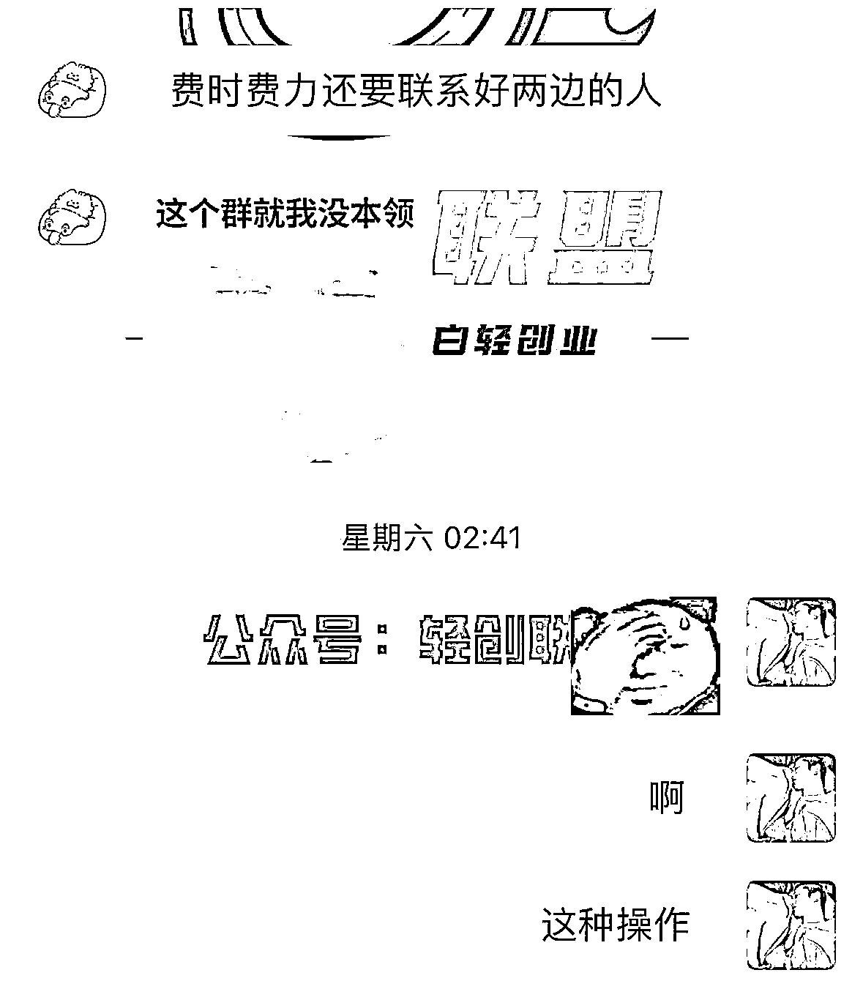

# 圈外收费大几千的货拉拉项目保姆级教程

> 原文：[`www.yuque.com/for_lazy/thfiu8/pzyewg3k7wit63d0`](https://www.yuque.com/for_lazy/thfiu8/pzyewg3k7wit63d0)

## (27 赞)圈外收费大几千的货拉拉项目保姆级教程

作者： 乔合

日期：2023-09-18

今天去外面知识付费来的项目玩法 搜了下生财没有货拉拉的项目课程。

ps：我没实操过 但是我下面的学员有去实操他和我说的如下

既然是一个项目 肯定有他赚钱的逻辑在里面只是赚多赚少的问题了 分享出来让大家少花点冤枉钱

整个项目逻辑就是从这个平台接高价单 再到另一个平台低价出，你就属于是个中介吧。

内容比较长移步飞书：[`qaigu0wmxc.feishu.cn/docx/N8mqdFdkCokYFUxTlr1cl6RhnHc?from=from_copylink`](https://qaigu0wmxc.feishu.cn/docx/N8mqdFdkCokYFUxTlr1cl6RhnHc?from=from_copylink)

* * *

评论区：

胖大魔 : 没看到。。。
胖大魔 : 懂
乔合 : 什么没看到
乔合 : 就是 一个平台低价接到 到另外一个平台 赚差价
锦川 : [困]有在做的吗？
MR. XU : 这个对于天天用运满满的人。。这种套单很累的。。不可控因素太多了

* * *