# 一个不起眼的技能，助我净资产增了三百万

> 来源：[https://wiizueiq5ks.feishu.cn/docx/A5aAdMrWTofrKgxT8nucRFdtnbd](https://wiizueiq5ks.feishu.cn/docx/A5aAdMrWTofrKgxT8nucRFdtnbd)

*   大家好，我是老吴。一个金融和互联网的双重事业从业者。原某商业股份银行的一个网点小领导。熟悉金融行业的零售产品业务。17年开始从事副业。我的第一份副业是做股票经纪人。现在也在做。之前虽然是一个金融从业人员，其实收入也就比打工的好那么一些。这些年，买房、买车、结婚。生娃、装修。真的是钱所剩无几。其实也是过着紧巴巴的。关键银行任务还一直很重。至于我现在的状态，我就不多复述了。

*   最近看到的很多的经济形势严峻的境况下，很多人收入开始下滑，或者失业，甚至断供。在这里，虽然我在创业的经验上不一定能帮上你什么忙，但其中的几个技能，可能就能缓解大部分的普通人目前所急。

*   在生财有术，有不少如何赚钱的实操干货，大部分就是利用赚钱的流量放大项目，但你当一个老板，有没有想过一个不一样的“赚钱方式”，让你对你的公司运筹帷幄。

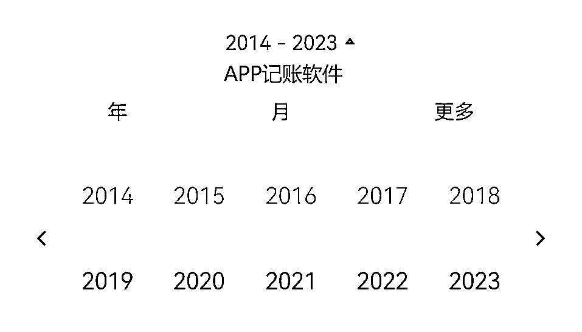

接下来，我会从六个方面和大家详细的介绍记账的逻辑和我的思考，希望能给大家带来一点帮助：

一、记账的底层逻辑

二、普通人记账的好处

三、创业者记账的好处

四、记账的本质

五、记账的思路和技巧

六、梳理正确的理财理念

## 学会记账的底层逻辑

### 为什么推荐记账

相信你们身边也有例子也看了很多例子，很多人有抓住了风口，但更多的人是凭运气赚的钱凭实力亏回去。

我举个身边的例子吧：

*   就说我之前做淘宝客的一起的人吧，当年我们一批人，一起做了淘宝客投资，到现在很多人现在都在经营，但是到现在，他们竟然身上还背着很多负债。明明一起做的时候，都是在赚钱呀。为什么他们目前还在负债呢？后面了解，他们平常其他投资完全没有一个良好的规划和筹备。导致除了淘宝客，他们的其他事业都是年年亏损。

*   我呢量入为出，我的开支主要以我额外的收入作为支出，我从我的财报里面进行分析我的收入支出比。不以我赚的多而花得多，而是延迟我的满足感。一起依靠着时代的红利，并没有因为自己赚钱到了钱而膨胀。但身边的合伙人总是有多少钱花多少钱，吃喝玩乐，毫不顾忌，他们觉得现在钱好赚，未来会更好赚。没有去建立一个他个人的资金壁垒的话，好几次的新机会到了，反倒留给他们的是犹豫，而我是勇往前进，用多余的钱建立我的项目。

*   然后就好几个可以看的到现金流的项目可以持续供应我的其他项目。而他们，到后面，每次的投资都是要靠负债来去投资，步伐自然就小心翼翼多了。往往就没那么多的空余资金让他们去试错或者放大，差距逐步就这样开始拉大。所以记账的重要性不言而喻，最主要让我看到了如何扩大我的收入和减少不必要支出。我就能更好的审时度势，评判各种机会和风险。

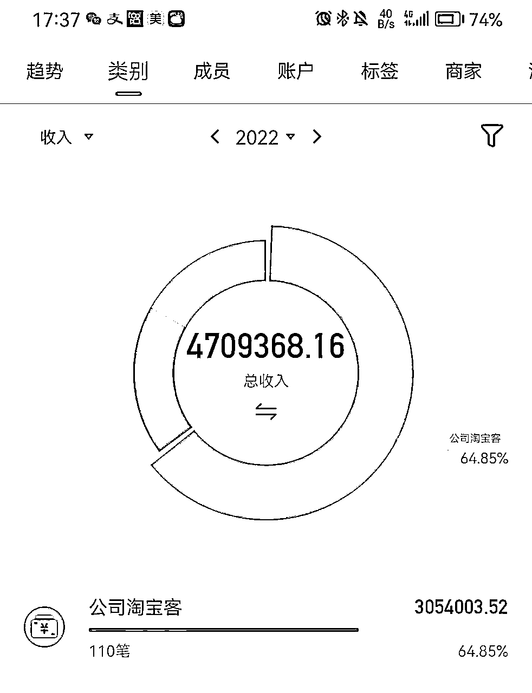

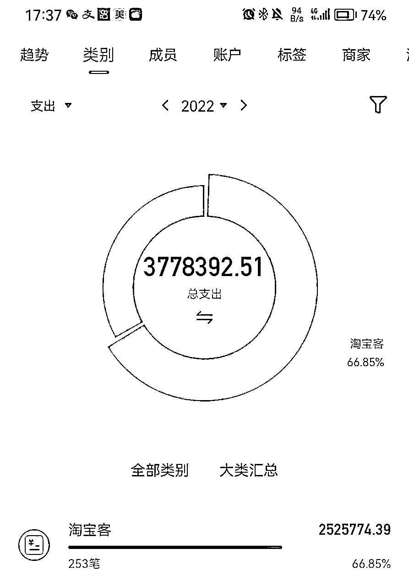

#### 1、我何时开始记账

*   因为职业的缘故，接触很多现金流比较不错的老板，会发觉他们往往比较的抠门（对别人抠门，对投资自己可不抠门），但他们就是实实在在有钱。那时候我就在思考，他们赚钱后怎么样处理他们的钱。主动找他们多聊的时候他们告诉我，你一定要熟悉自己的财务状况，不能有钱就花，有钱就投。要找准一个你熟悉的赛道，好好省钱，当钱攒到一定程度，会让你更从容。这些话我听进去了

*   而开始记账的起源是我房子要装修，预算是打算30万，当时按规划来进行装修，然后按时按序的去买装修材料款，每付一笔钱，就记账一笔。到后面，装修没超。但也学会了记账功能。

*   从开始学会记账后，我就不断的去分析和优化我的财务结构。从里面寻找我的生活习惯的优缺点，财务抗压能力，投资失败会产生最大的什么后果等等。最近的这几年，都是开始不断的避免投资坑，然后不断赚钱。截止目前，加上现金、保险、车位，不包含房子的话，现在有现金200万，其他100万，总共300万净资产了。接下去还朝着每年100万的净收益方向不断的发展。

*   不能说这个钱是记账帮我赚回来的，但这个技能功不可没。我属于个体，一个人，没有财务帮我去做账。所以可以说没这个技能，我自己的财务状况肯定一团糟。

#### 2、记账悟出赚钱的道理

*   早先的时候当时的工资，一个月其实也就几千块钱，发点奖金，也就平均万把块钱，谈不上富足，也饿不死，就是剩不下钱。装修完房子后，还负债着20万。但是那时我分析了一下我的收入，我日常的生活开支，养娃，月供，职业道路晋升等等。算完我真的有一种很无力的感觉，一年凭着单位的收入，顶多也就剩下个3-5万，我要是纯靠这个活着，我就得用人生4年的时间才能还清我的装修款。想要第一个100万，不算上通胀，我得攒20年。

*   开源：分析完了我的财务状况，可以说穷则思变，果断加入副业大军，白天上班，其他利用空余时间学习和链接优质资源，每一笔的额外入账就是我现实的正反馈，后面越做越起劲。

*   节流：控制我的开支，每周、每月，砍掉一些无效社交，比如减少同事间经常的无效应酬，控制熟悉客户间的小聚频率，扩大资源圈的投入。让自己更值钱。

*   合理算账：合理算出我副业的稳定收入情况以及投资的风险最大可承受能力。掌控自己的投资财务，投资别人10个有7个亏，但你会发现投资时自己能掌控财务状况，只要不是赌性太强，赚钱的可能性还是比较强的。所以财务状况不一定通过你的卡，但你要随时能观察和掌控。

*   同步财务情况：我每投资一个项目，一定要同步财务状况的。比如APP财务记账软件是可以同时登录的，甚至银行APP也是双人登录的，每个银行APP设置中有一个授权功能。很多人都有私心，能做到财务百分百公开的是少之又少，虽然往往这类人未来能成事，但我们很难遇到这种格局大的人，所以还是一半小人一半君子。

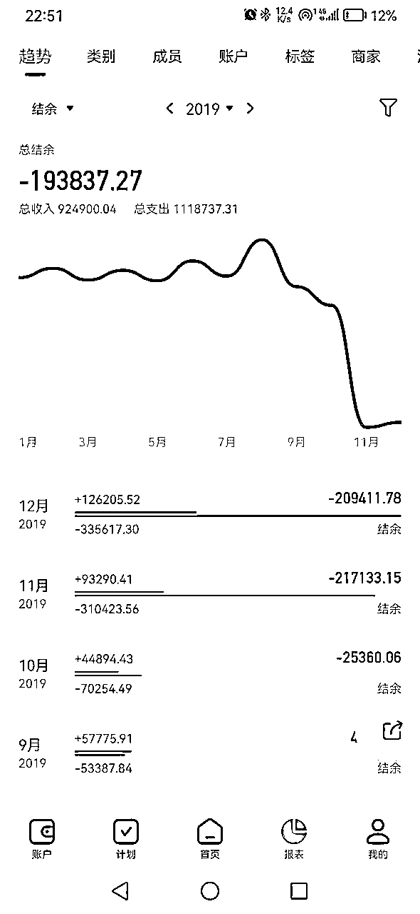

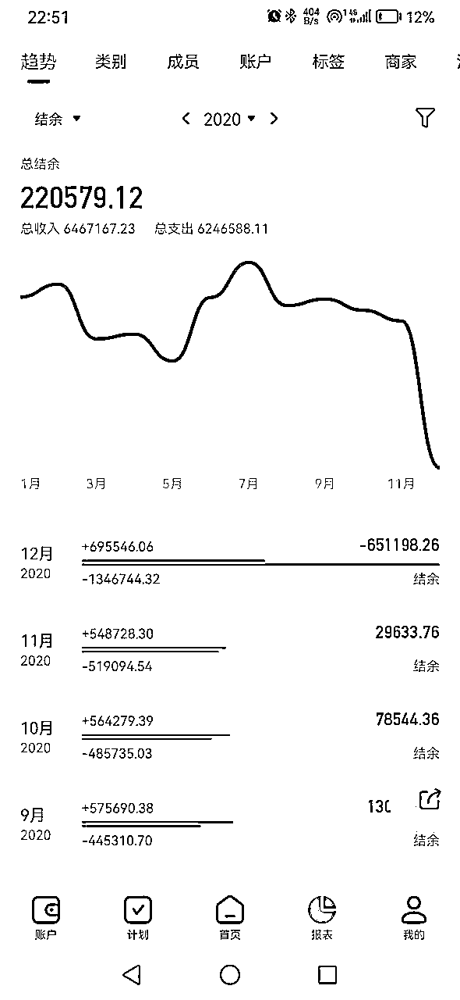

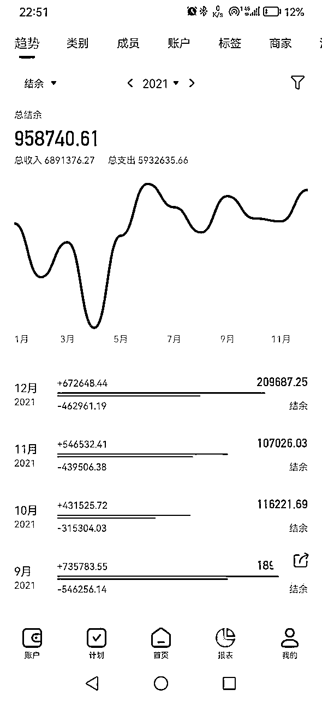

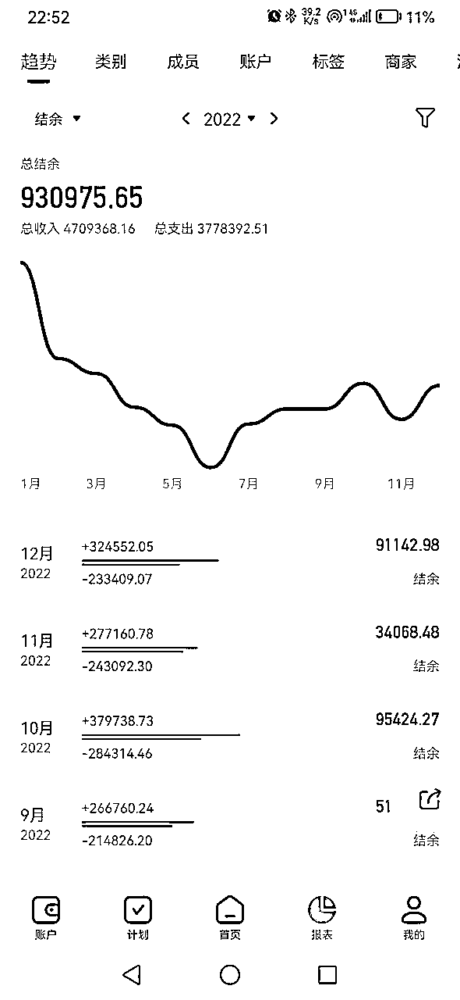

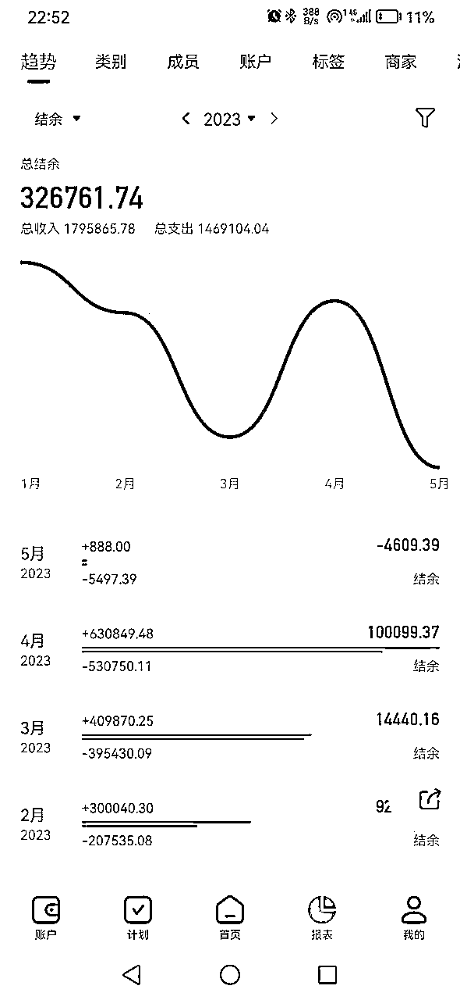

#### 3、普通人记账的好处

很多人觉得自己又没有多少钱，花也花不了多少钱，没有必要记账。

这样的想法其实是有误区的，我从以下几点和大家谈谈，普通人如何利用记账获得的实质性好处。

##### 财务掌控

理解成开源节流，就算你每天能支配的金额是固定的，但你可以完全知道自己的收入的哪些方面可以放大，支出的哪些方面可以节俭。

##### 风险控制

普通人最怕的不是收入不足，而是没有抗风险能力。学会记账，把自己的资金蓄水池做好。再苦也要让自己存钱下来。然后把自己最大的承受亏损能力测算一下，投资就按自己的承受这个标准来。不要投了项目，钱没了还背着一堆负债。

##### 回忆功能

家庭消费、学费支出、人情往来是你生活中的一个消费大项。起码你知道你钱花哪里去了。所以账务有个回忆功能，让你清晰一笔一笔账务的来龙去脉。

##### 督促功能

看着自己的收入那么多了还是少了，自身的财务状况。安不安全接下来有没有上升的空间，某某项目是放大还是亏本停止、要不要合理利用银行资金等等。

#### 4、创业者记账的好处

##### 公司财务分析

创业者经常头疼的事情，没有记账的话，跟合伙人说不清楚某些大钱花哪去了，或者我真实盈利多少钱，或者因为初创公司的费用问题，请的财务自身水平有限，拉出来账目没有完整的统计报表。哪笔钱去了哪里，老板不清楚财务状况，合伙人不知道财务状况，这样子损害的往往是未来的发展前景。所以你投资的公司为你分红多少，拿走你多少钱，你不用通过财务，自己从记账软件里面查看，你可以分析公司的盈利状况和亏损状况。

##### 预算和计划

很多人做投资或者创业死在了没有节制的预算和计划用钱上。往往你创业前期钱花得如流水，后续无力，这个项目事情到后面就容易凉凉。

##### 税务管理

很多行业的收入和支出是可以控制的，可以在分析达到某些税务临界值时的税务筹划。这块我比较没经历，但流水很多或者财务规避就可以做。

##### 资金追踪

如果你对公司以往的某些账出入问题，可以方便的通过APP来追溯之前的账务情况。

##### 业务分析

你可以分析你的某些投资业务的投产比，不用凭印象，而是凭数据来说话，让自己的最赚钱的业务不断放大。我当时就是分析了淘宝客这个业务，用投产比测算，发现他的价值，然后就进行迅速的放大。截止目前。这个业务依然还是我的盈利大头。

### 记账的本质

赚钱要武装脑袋，普通投资者也需要懂一些基础的知识，才能少走点弯道。

这些基础知识不说让你多赚多少钱，至少可以让你少损失一些，而记账就是投资理财里的基本功。

##### 1、财务目标的设定

*   根据自身的情况，你总有一定要支出的地方，也能有节省的地方。比如，今年家庭消费我们要控制在月5000或者10000以内，超出了，就要分析你的支出的合理性了。或者投资，你可以选择年投资支出控制在你收入的一定比例以内或者收入性杠杆性支出几倍的合理空间范围内。

*   目标的合理设定，人生在世，匆匆忙忙，无非为了碎银几两。所以你要掌控好自己的人生，就优先自身掌控你的财务情况。反正我是没见过有钱人不清楚他们自身的财务状况的。

##### 2、储蓄和投资的思路

我非常佩服新东方俞敏洪，守得了初心，损失60亿后，俞敏洪还捐出7万套桌椅：新东方为什么能体面退场。生意有风险，行业有兴衰，此乃市场经济的内在法则。

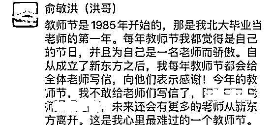

俞敏洪的难过背后，新东方的员工、消费者，比其他人“好过”太多了。

一方面，新东方有序裁员，结清了员工工资；另一方面，新东方宣布“无条件按比例退款”，要求无条件给予退费。

对于已开课学生的退费要求，按照已完成课时扣除相应学费，其余全部无条件退费。

这就是俞敏洪的魄力，也是他的现金护城河获得的作用。让他有了东山再起的能力。

所以生意再大，也要做好未雨绸缪的现金储备。业务再难，也要有一个体面退场的风险隔离。这就是储蓄和投资的平衡之术。

虽然人往往有机会厌恶，怕风口来了没赶上错过机会。但你认知以外的风口，很容易成为你倾家荡产的收割机。比如各种虚拟币、炒股、炒房，门外汉进入实体业等。

##### 3、消费观和债务管理

*   债务管理：央行数据说，7亿中国人负债，那你要去掉老人还有小孩，基本上就是全民负债，人均负债达14.7万，总数已达200万亿元。如果换做我现在，那么我也算在负债里面，原来的房产按揭还剩一点点，不急着还掉，信用卡也日常还有几万透支等等。所以说，这个数据总体还存在一定的偏差。但人均负债是差不多的。而且债务的管理一定要严格控制，不能放任不管，花钱一时爽，还债痛苦无比。

建议：适当的负债是好事，可以利用银行的资金撬动更好的生意，但也要量力而行，时刻关注负债情况，及时测算你的收入还款能力。

*   消费观：虽然中国人负债高，但储蓄高也是真的。就像我，一定会拿100万现金随时储备着，存在银行里，坚决不投资的那种。但还是会适当一点的灵活负债（包含投资性贷款、信用卡生活消费等），让我随时有动力去不断的赚钱还债+存款。可能这是我的一个小习惯或者说小技巧吧。消费控制在一定的程度，当然允许我赚的越多，花的越多，看是要学会时刻关注你的消费情况，过了度，就不好了。毕竟由俭入奢易，由奢入俭难。

##### 4、创造被动式收入

当然主动式收入，比如工资、开公司等是一个主动收入，但财富自由往往是靠被动式收入的。主动收入也能转化成被动式收入。

在创业淘宝客之初，我就是很主动的去争取的一种收入，但当收益稳定后，我只需要雇佣1个人在后台进行提现管理和朋友圈产品选择，固定好SOP流程后，我就可以当甩手掌柜不断的进行产值管理。

那么其他的被动式收入还可以很多，取决于你个人的取舍。比如房租、理财利息、我的存款冲量业务也算是一个被动式收入。当你本身资金还不到一定程度的时候，你就是可以利用有限资金做好业务放大动作。如果你觉得你的业务明显卡壳，增长缓慢，或者时代变迁，那么就开始有大资金就进行守财。

被动式收入普遍模式：如科技发明收入、书籍版权、影视版权、IP权益、包租公包租婆、证书技能交换、公司股权投资分红、理财利息（我还主动做了一个存款关键时点冲量的主动+被动收入）等，我一会详细说下可操作性的。

##### 5、很多有钱人的消费观会颠覆你的想象。

我自己有一个存款冲量的业务，我发现有钱人他们即使很有钱，也会跟你斤斤计较一两千块的收益。

比如很多有一两百万的人，根本看不上一两千块钱的额外收入。

可能是时间精力或者认知上的差异，觉得这个事情好像没什么好赚的，虽然他们知道这事很简单。

虽然一年只有几天，但是我真的发现那些赚的好的常树青一样的有钱人，是很抠门的，不会因为钱多就不多花钱，也不因为钱少就不赚。

记得有一次，一个客户拿了1000万跟我一起做存款冲量业务，就隔夜，然后他一直跟我讨论，非得让我把他的理财利息也补给他，既使我已经给了他1万元，他还是坚持看能不能给他补一下1000元的理财利息。

你看吧，你有1000万，你会不会计较这1000元？ 还真别说，有钱人会计较，所以他们成为了有钱人。

被动式收入（存款冲量），对于你来说的舒服级实操赚钱办法，具体的像素及实战手册我发在这里，大家有兴趣可以看一下:

### 记账的思路技巧

如何使用记账，这里我推荐一款记账理财的APP，利用挖财记账，一点点和大家说说记账的思路和技巧，让你更能快速的上手。

##### 1、建立分类账户

在挖财中，你可以创建不同的账户来记录不同的收入和支出。例如，你可以创建一个日常生活账户、一个娱乐账户、一个投资账户等。这样可以更好地组织你的财务信息。或者你只像我一样，建立一个账户，进行统筹也行。账户分别对应的是一个赛道。

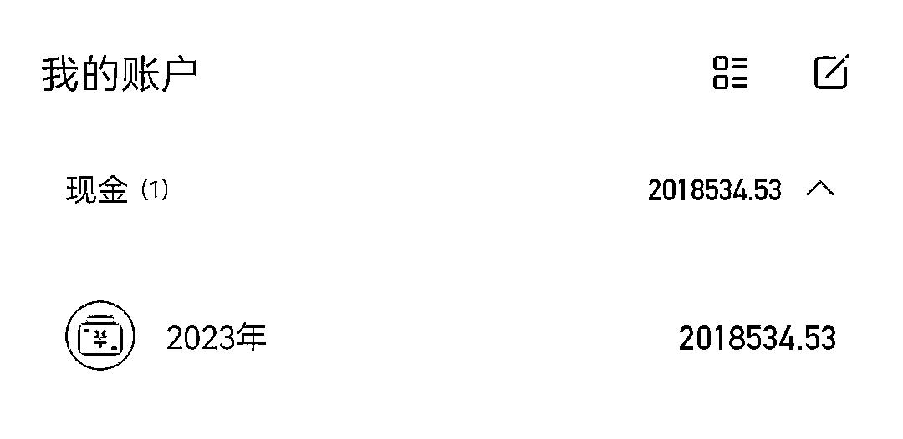

##### 2、记录每笔交易

确保每一笔收入和支出都被记录下来。

你可以手动输入信息，如金额、日期和类别，或者使用挖财的自动识别功能，它可以根据你的支付信息自动识别和填写。

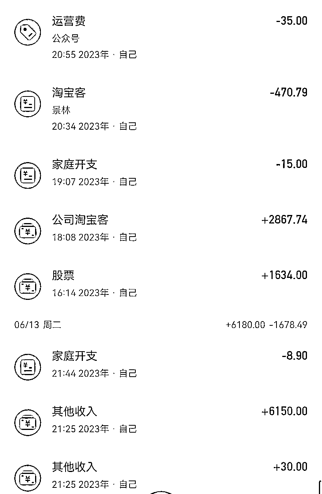

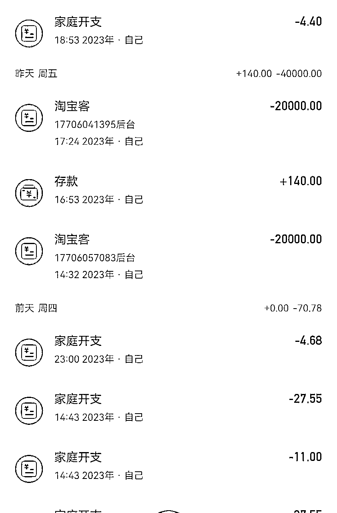

##### 3、设置预算

挖财允许你设置预算，控制不同类别的支出。你可以为每个类别设置特定的预算金额，然后挖财会提醒你是否超支。这有助于你更好地管理和控制支出。

##### 4、导入银行对账单

挖财支持导入银行对账单，这样你就可以更轻松地将银行账户的交易记录导入到挖财中，避免手动输入大量数据的繁琐。但这个功能我没有，不太适合我。

5、数据分析和报表

挖财提供了数据分析和报表功能，让你可以更好地了解自己的财务状况。

你可以查看收入和支出的趋势图表、分类别统计和年度总结等报表，帮助你更好地管理和规划财务。这个功能是我最常用的功能之一。

##### 6、设定目标

在挖财中，你可以设定财务目标，如储蓄目标、投资目标等。

挖财会跟踪你的进度并提供提醒，帮助你实现目标。

##### 7、定期备份数据

为了保护你的财务数据，定期备份挖财中的数据是很重要的。

挖财支持数据导出和云端备份，你可以选择适合自己的备份方式。

还有其他的记账工具也很好用，殊途同归，只不过之前比较早用了一下。

挖财是一个功能丰富且易于使用的记账应用，它可以帮助你更好地管理个人财务。通过合理利用挖财的分类账户、预算功能、数据分析和报表，以及设定目标，你可以更好地掌握自己的财务状况，实现财务目标。

#### 投资理念的正确性

创业或者投资，很多企业为什么前期顺风顺水，结果最终结局就是轰然倒塌。

像恒大这种巨无霸以及各种房企近些年倒塌的企业，就是过度借债扩张、不适当的风险管理、过度依赖外部融资的案例。这些案例表明，在经济好的时候扩张并不一定保证长期成功。在管理企业过程中，应谨慎评估风险、建立健全的财务规划、多元化业务，并灵活应对经济变化。最重要是储备好现金，这样，在经济衰退时，公司可以更好地抵御风险，保持稳定发展，而不至于一碰到什么黑天鹅危机，就一下子趴下了。

像新东方这类的企业，他们就是建立了足够的护城河，一个时代的政策冲击让整个行业轰然倒塌后还能东山再起。

所以投资，不要求大、求快，当你的资金、思维和管理能力跟不上你的业务速度的时候，结果往往是一种悲剧。

开源很重要，节流也是赚钱的一种方式。刚开始你做账不用特地去管进出项符不符合逻辑，你只要管你的进款出款，对的上你的流水即可。后台自动会产生报表。每当你要去计算你每个项目赚多少钱或者花多少钱时，对照每个项目的前后出入逻辑就能测算出来。

而记账能让你很适合开源节流，让你有个清晰的知道在哪个项目比较赚钱，哪个地方多花钱。不需要多复杂的技巧。

#### 结语

赚钱是一种对美好生活的向往，记账不是学怎么不花钱，是懂得如何更好的花钱、是致敬记录自己的这个成产过程中付出的努力的点点滴滴。

而看到统计数据的净收益余额，就是像秋收的果实一样，收获了五谷丰登的那种满足感和面对即将到来的寒冬的无畏感。

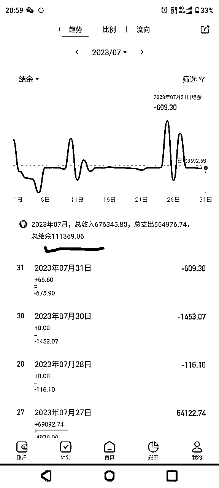

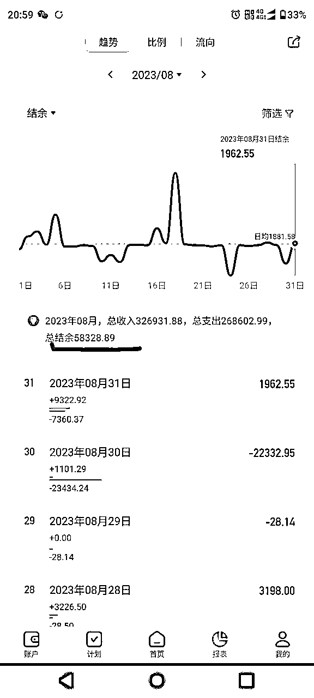

