# 生财的一句话，让我单月变现15w+，喂饭级教程怎么从0-1做一个赚钱的抖音号

> 来源：[https://lspknkwu7b.feishu.cn/docx/LEqodEtJIotV9OxwR2zcbuKXngh](https://lspknkwu7b.feishu.cn/docx/LEqodEtJIotV9OxwR2zcbuKXngh)

# 一、前言

大家好，我是行舟，一个拥有三年抖音编导经验的运营人。

从今年3月份我开始辞职做自己的抖音号，目前粉丝7.2W，在这期间我踩了很多坑。

因为没有好的收益结果，所以一直不敢再生财里分享，但是前段时间，在生财里看到了一句话（后面有介绍是什么话），我照着执行后，收入竟然立马涨了十几倍，仅仅一个月就变现15W+。

下图是8月份的收益情况：

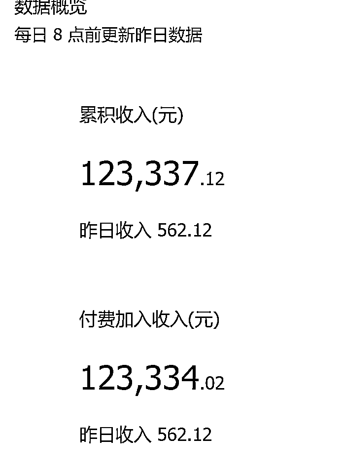

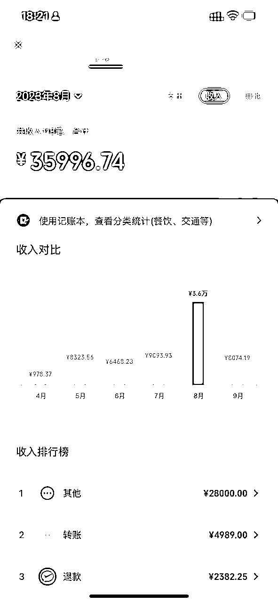

生财的宗旨是真诚利他，我因为生财有了一点小结果，所以今天也给大家分享一下我的经验——如何从0-1做一个能赚钱的抖音号，希望能给那些和我一样的普通人，带来一点希望感。

因为主题是从0-1做抖音，所以我准备用时间线的发展顺序来讲述，我会尝试着把整个项目中遇到的问题以及我的解决方法记录出来，看完后，对于怎么策划账号，怎么设计变现产品，怎么快速起号等这些大家头疼的问题，都会有一个拿来就能用的解决方案。

# 二、从0-1做号的过程

## 第一阶段：策划期

这个阶段我和大家一样，非常迷茫，没有方向，没有产品，每天不是在找项目就是在找项目的路上，今天觉得这个项目不错，想做，明天又觉得别的项目也挺好，整天在行动与不行动之间来回徘徊，当时我还裸辞了，每天焦虑的狠。

我一想这样可不行啊，再不做可就一点收入都没有了，那么怎么办呢？

### （1）先找当下流行什么

我用了一天的时间，把一些推荐项目的账号都看了个遍，发现大家竟然都在推小说推文，并且有大量的推文账号起来，并且我利用巨量算数查了下小说推文的热度，发现小说推文竟然是热度词最高，于是我觉得做小说推文挺不错的，但是我该做哪种类型的呢？

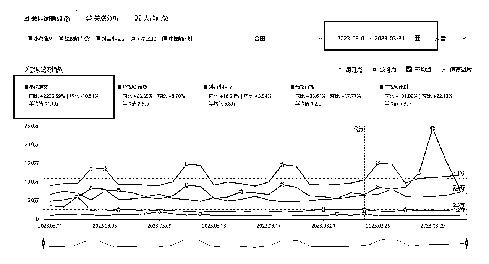

### （2）找我的差异化

靠小说推文变现的类型有很多，有做账号矩阵的，有做培训的，有卖课程的。

因为我只有自己一个人，我必须要有差异化才能快速做成账号，于是我分析了我能做的方向以及利弊情况：

*   成为工具人：做一个小说推文账号，仅靠流量变现，弊端是没法长期发展，且上限很低

*   成为卖铲人：做小说推文培训，弊端是我没有对应销售团队、售后团队。

*   成为卖铲人的合作伙伴：做小说推文机构的团长，也就是类似中介的角色，通过发展下级赚钱。

经过思考之后，我觉得第三种方向挺适合我的，试错成本低，做的人少，同时收入也不错，也可以长期发展。

那么怎么用视频呈现出来呢？

### （3）找对标账号，确定方向

新手做抖音有一个致命的缺点，那就是做原创。我现在可以确信的告诉大家，做原创有99%的失败率。我们应该站在巨人的肩膀上，用别人已经经过抖音验证的方法来做抖音，这样成功率会大很多。

那么怎么做呢？

答案是找近期涨粉比较快的账号，各个赛道都要找一遍。然后分析别人的起号方式我能不能复制，能不能改良。

于是我花了一个星期的时间，利用热点宝、巨量算数、抖查查等工具找对标账号，总结了一份起号模型。

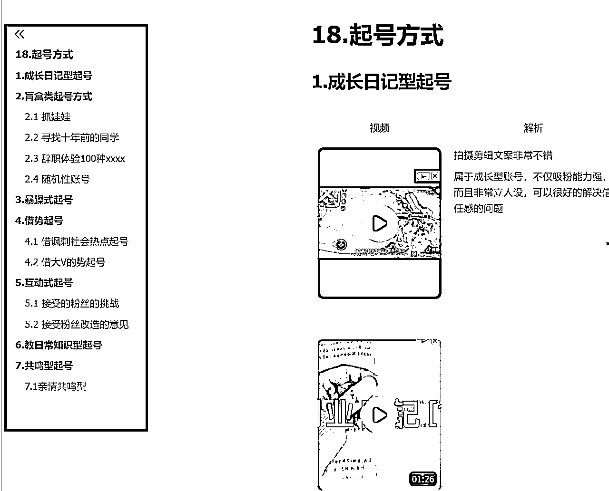

我分析了下，其中的“成长日记型”起号方式比较适合我，于是一个创意出来了：记录自己学做小说推文的第一天、第二天、第三天.......

这种成长型起号有三点好处：

①不用担心自己没有成功案例

因为人设是一个新手，记录的是自己的成长过程，大家对你的期待值没有那么高，所以即使你没做出成绩，大家也能接受。

②可以打破用户的防备心理

要想用户为你付费，首先要解决信任感的问题，成长型账号是把自己放在用户的角度，带着用户一起成长，用户对你的戒备心理很低。

③更能引起共鸣

站在新手的角度记录自己学做小说推文，一点点的展示自己学习中的困难，很能引起小白的共鸣，并且你学习的过程就是营销自己的过程，我可以在这个过程中不断展现自己的专业，比如展示怎么解决取得授权的问题，怎么配音，怎么剪辑视频的问题，这些都是立人设，吸引精准粉丝的好内容。

④不用担心没有内容可拍

因为是成长型账号，你记录的是自己的成长过程，呈现形式是第一天，第二天，第三天......所以后续的视频内容大家不用担心，把每一天的学习过程拍摄下来就行。

### （4）改编对标账号，效果显著

找好了拍摄的方向之后，就要根据这个方向寻找大量的对标账号进行改编了。

我找到当时起号比较快的一位博主，她十几条视频就涨粉20几万，同时是一个成长日记型账号，并且前三条视频就成功起号。

虽然她做的是改造类型账号，但是抖音起号的底层逻辑是相通的，模仿她我的成功率会大很多。

于是我对这个账号进行了改编，尝试把她的起号方式融入到小说推文中。

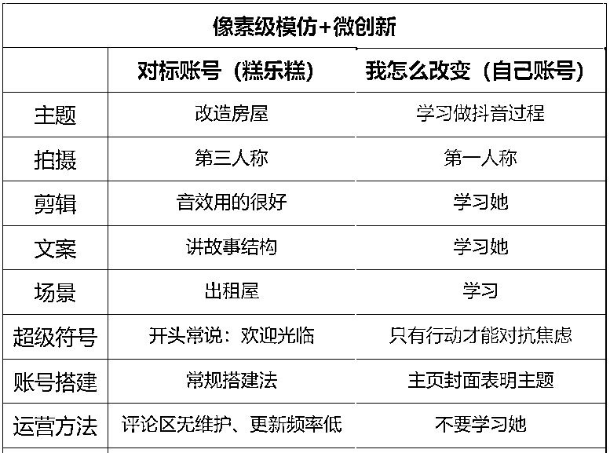

我又对她第一条视频的文案结构进行分析改编，然后拍摄制作了我的第一条视频，结果数据反馈非常好，她1.6w赞，我1.4w赞，并且当天晚上就涨粉3000，效果非常明显

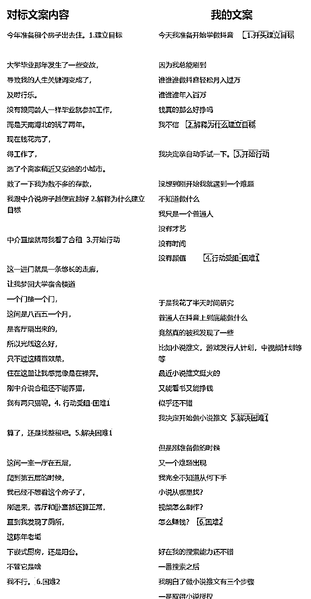

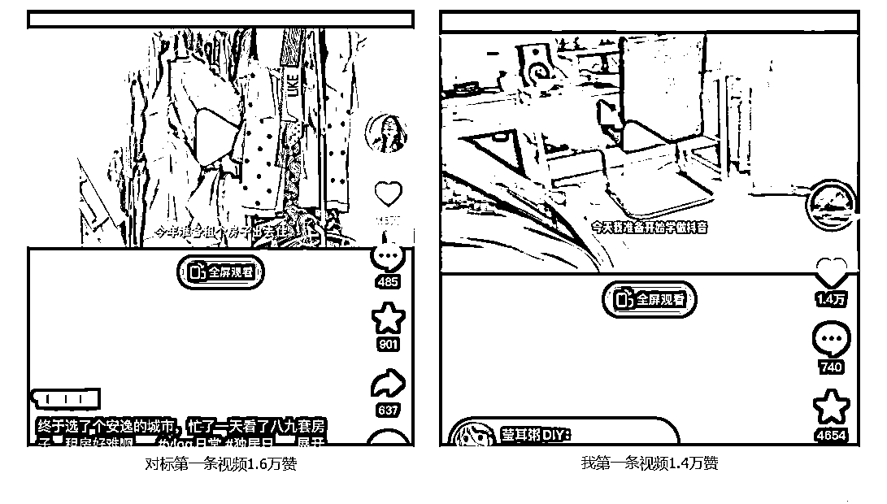

然后我后面的视频全部采用第一条视频的结构，数据反馈都很不错，当时一个星期时间就涨粉了一万多。

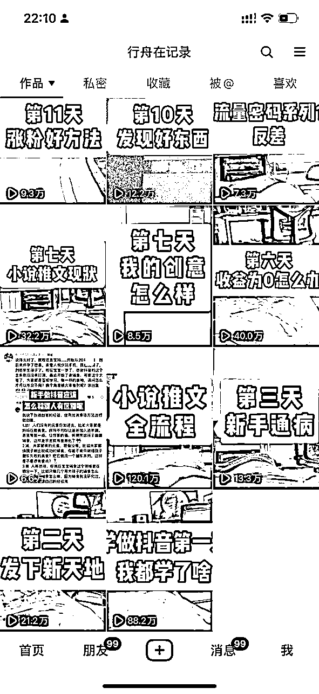

在策划阶段一定要多找对标账号，用别人已经经过抖音验证的方法来做抖音，这样成功率会大很多，要坚信：改良一定胜过创新！

## 第二阶段：转折期

### （1）10天达到预期效果

前面说过，我做这个账号的变现就是想和一些小说推文机构合作，仅仅10天时间，我的效果就达到了，当时我的后台线索很多，并且已经有一些机构加了我的微信准备合作。

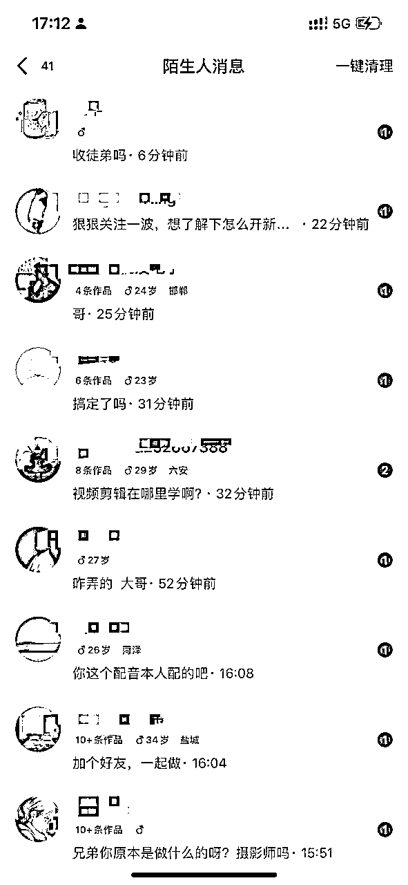

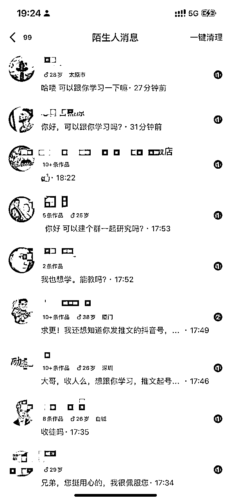

很多推文机构找我合作

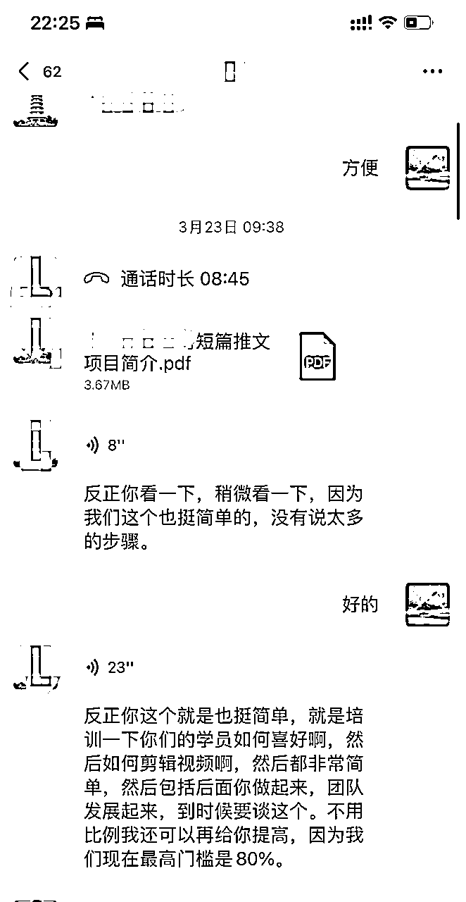

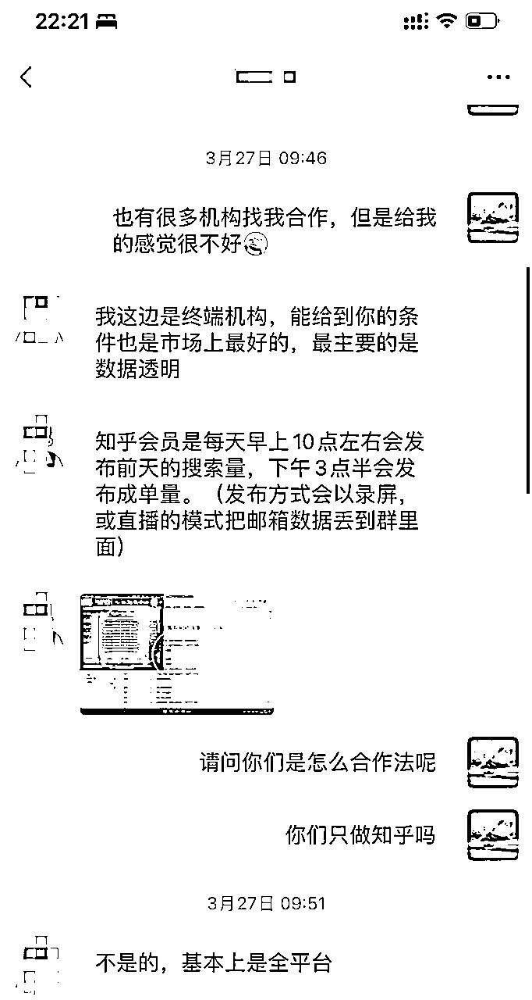

### （2）人心险恶，放弃项目

就在我信心满满准备大干一场的时候，竟然发生了一件让我很恶心的事情，让我看到了推文这个行业的人心眼是真多。当时已经和一个机构确定了合作，也开通了团长。结果没几天，我竟然发现我的学员被他们截胡了，我发现我的线索和我的下级对不上，于是就发生了下面的聊天。

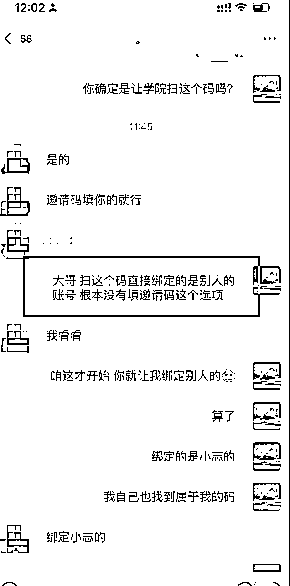

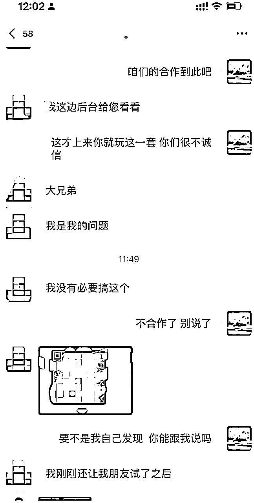

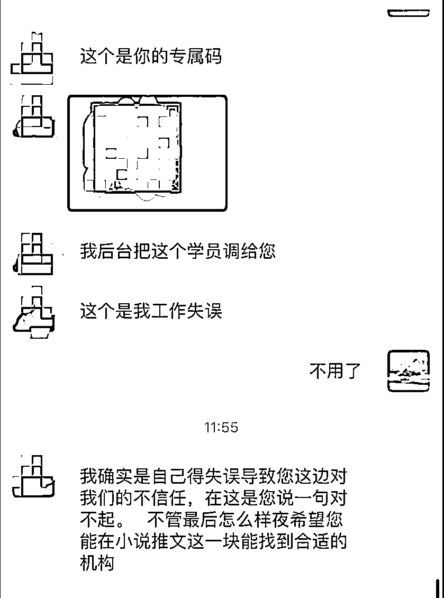

并且在我接触的过程中，我发现这些机构的人都非常圆滑，一不小心就给你设陷阱。后来又发生了一件事，坚定了我要换方向的决心。群中很多人反应提现不成功，然后没多久，这个机构就跑路了，并且跑路的还不只这一家。

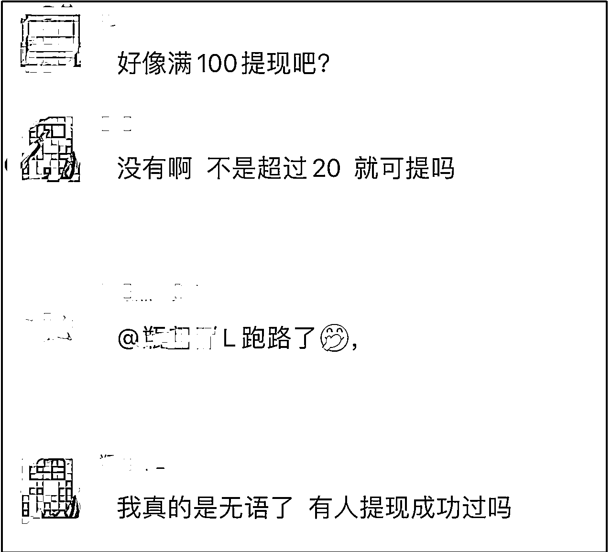

我觉得这个行业没法长期发展，大家追求的都是打一枪换一地，我必须要换方向了，可是当时我的账号标签已经打上了，粉丝也都是喜欢小说推文的群体，突然换方向账号可能就废了。

怎么合理的换方向呢？

好在我是成长型的账号，换方向风险不大。

### （3）不断试错，找出方向

我花了两天的时间，开始策划新的方向。我已经意识到了项目号是不长久的，我要做内容号，这样才能可持续发展。经过搜索，我发现中视频的热度又起来了，那么我可以以中视频为切入点，拍摄新的方向——中视频教学。

首先我以一个总结小说推文的视频作为过度，很自然的把方向转变了过来，虽然点赞变差了，但是粉丝掉的不是很多。

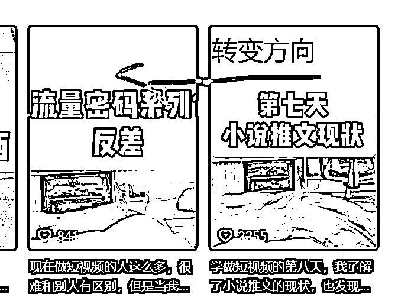

其次我急需做出一个中视频赛道的爆款视频，来快速给我打上中视频教学的标签，于是我用了改良对标的方式，再次出了一个爆款视频。

大概一个星期左右，我成功转型，账号数据也稳定了起来，但是又一个新问题出来了，我的流量还不错，但是变现很差，我的流量被我浪费了，我必须要快速进行变现。

### （4）变现很差，陷入焦虑

比没有流量更可怕的是有流量却变不了现，或者变现很少。

这期间我尝试了各种各样的变现方向：比如中视频计划、短视频带货、星图广告、直播这几种方式我都试了。变现是有的，大概三个月变现一万多，但是弊端很大，比如不能复制，没法长久发展，完全依赖流量等

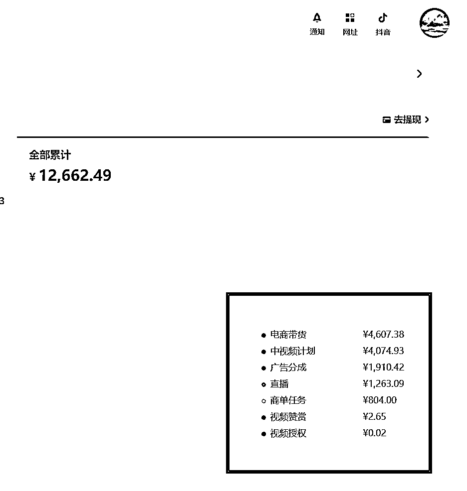

此时我已经做账号三个月了，流量开始下滑，并且抖音开始打压我这个赛道的内容了，很多同行都被封号，那段时间我经常焦虑到失眠，不知道应该往哪个方向做。

### （5）偶遇生财，救命稻草

我是今年4月份加入的生财，加入之后一直就没怎么看过，有一天晚上我焦虑到凌晨4点还没睡着，无意间打开了生财，就这么一个动作，我找到了我的指路明灯，让我接下来一个月变现了15万。

一个知识付费创业者，如果没有产品，比你想象的还要糟糕100倍。无论产品质量如何，有产品你就可以去引导用户的需求。

你要知道，很多用户是不知道自己需求是什么的，你没产品，她可能就觉得自己当前的痛点不是痛点。

你有了产品，用户就会发现，原来我还有这个需求啊，或者说之前没注意过，未来可能要吃大亏。

所以，产品必须得做，质量高低是一回事，有没有又是另外一回事。

产品是用来丈量用户需求的。

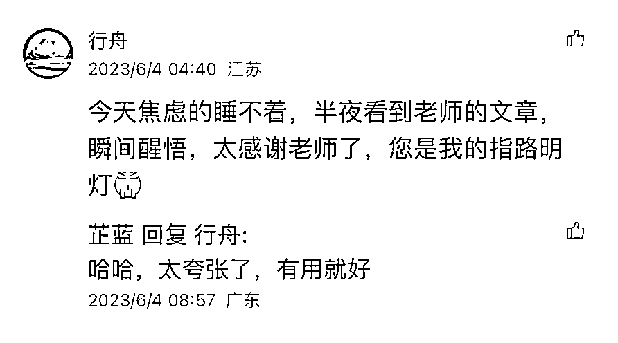

老师的这句话瞬间点醒了我，我做的也算是知识付费，但是我却没有自己任何的产品，完全依赖流量和咨询赚钱。用户根本不知道我是干啥的，也不知道我这里可以明确解决他们的什么问题。

这也是很多抖音编导的通病，我们之前的工作不用考虑设计变现产品，因为老板已经直接提供了，我们只用做好流量就行，所以潜意识没有把产品放在第一位。芷蓝老师的这些话对编导来说真是一剂良药啊。

总结起来就是我的定位不明确，用户不明确，产品不明确！

找到问题后，我更睡不着了，虽然当时已经是凌晨4点了，但是我立马打开了电脑，开始根据上面的问题策划自己的产品。

我在电脑上写了下面这四个问题：

## ①向谁提供

我把我的目标人群再次细分，做短视频不能所有的流量都要，我应该找到那些愿意为我付费的人群。

我把他们的性别，年龄，职业，生活方式、收入情况，人生阶段、喜欢什么，在意什么，他的爱，恨，贪，惧，全部罗列了出来。明白了这些，我后面可以针对性的创造他们喜欢的内容，从而吸引他们过来。

## ②提供什么

我问了下自己：能给观众带来什么好处？解决什么痛苦？

之前做抖音我一直存在一个误区，我认为只要我的内容好，观众一定喜欢，事实真是这样吗？

做抖音三年，我发现观众只会在乎自己的欲望，自己想要的目标，自己面对的困难，不会在乎你的内容。

如果你的视频能让他获得了某项好处（学会知识），满足了他某个欲望（爱恨贪怕），解决了他某个问题（实用性），他才会给你点赞，愿意为你付费

明白了这些，我把我的问题更加细化。总共有三个步骤，大家也可以参考学习下：

第一步：把我的目标用户想取得的结果以及面临的问题罗列出来

我的目标用户是谁？

1.  不会做抖音的普通人，想通过抖音赚一些钱

1.  有一些自己产品的老板，想通过抖音获客变现

1.  有一些抖音基础的人，想通过抖音做个人IP

目标用户想取得什么结果？

1.  想通过抖音挣钱/引流获客

1.  想增长粉丝

1.  想做爆款内容

1.  想扩大影响力，建立个人IP

1.  ......

目标用户面临的困难是什么？

1.  不会写文案

1.  没有方向

1.  不会差异化

1.  破不了500播放

1.  不会优化视频

1.  不懂得做抖音的底层逻辑

1.  ......

第二步：确定我主要解决的问题是什么，我主要提供的是什么

我不可能把用户所有的问题都解决，如果什么都想讲，我的账号只会像个四不像，观众也会对我没有印象，所以我一定要让观众明白我这个账号主要提供的内容是什么。

我又分析了同行做的比较好的案例，我发现确实得这样做，有人只讲文案怎么写（金枪大叔、埃德蒙等），有人只讲编导内容（志楠不难），有人只讲个人IP怎么做（林大狗个人IP孵化），有人只讲视频制作（王松傲寒），像这样细分赛道的账号你们一定也见过很多很多。

那我主要能解决什么问题呢？

我想了下，对于新手而言，最重要的是模仿，我想解决用户不会模仿复制的问题，那么我的内容方向就是教大家小白怎么通过模仿快速起号。

第三步：用一句话告诉我的用户我的账号能提供什么，为什么关注我？

给大家一个公式：我的账号是通过提供xx内容，来帮助xx用户解决xx问题，取得xx结果。

你现在能用这样一句话来总结你的账号内容吗？能说出来你的账号定位也就出来了。

## ③怎么提供

怎么提供分为两个部分，分别是怎么提供我的内容以及怎么提供我的变现产品

怎么提供我的内容？

我继续沿用成长型VLOG的方式，来做抖音教学的内容

怎么提供我的变现产品？

同行大多是课程、陪跑、或者社群，很少有人用知识星球的方式，生财给了我灵感，于是我准备用知识星球的方式来做。

## ④怎么营销

通过立专业+真诚的人设来营销，方式参考一些近期用户涨的比较快的星球。

通过上面的四个问题，我的方向越来越明确，我不再焦虑，而是浑身都是劲，如果大家也想做抖音，一定要提前想好定位的问题，如果这篇文章大家反馈不错，后面我会分析更加关于定位更多的实操步骤。

## 第三阶段：发展期

确定了要做什么之后，在抖音这座海洋中，我这个小船算是有了方向。但是也有一个阻碍的风浪存在，那就是我的教学成功案例太少。

这三年间，我在公司里做成的账号很多，但是自己会做账号不等于能教会别人做账号，会做和会教师两回事，我后面是靠教学变现，现在却没有成功教学的案例，该怎么办呢？

### （1）组建圈子，建立背书

我做了一个动作，组建一个抖音小圈子，免费带大家做号，如果我能带出一些人出来，那么这就是最好的成功案例，如果我带不出来，说明我的方法有问题，我需要继续打磨优化。

说干就干，我立马在粉丝群里招募了一些朋友，组建了一个小圈子

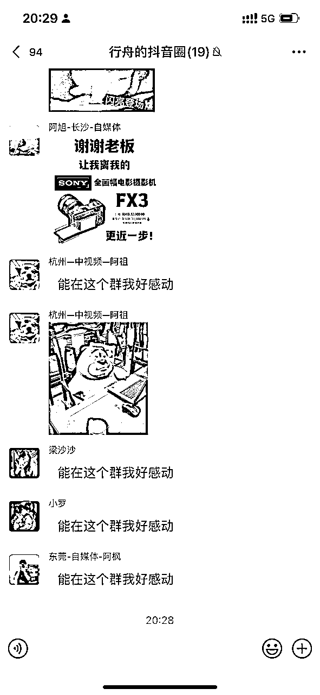

没想到仅仅一个月时间，我的教学成功案例就如同雨后春笋般多了出来，我再也不用担心背书问题

*   有人用我的方法出了三个中视频爆款

*   有人快速起了三个账号，做出多个百万播放视频

*   有人变现20万，找到了方向

*   很多抄袭我的账号都在一个月涨粉几万

*   ......

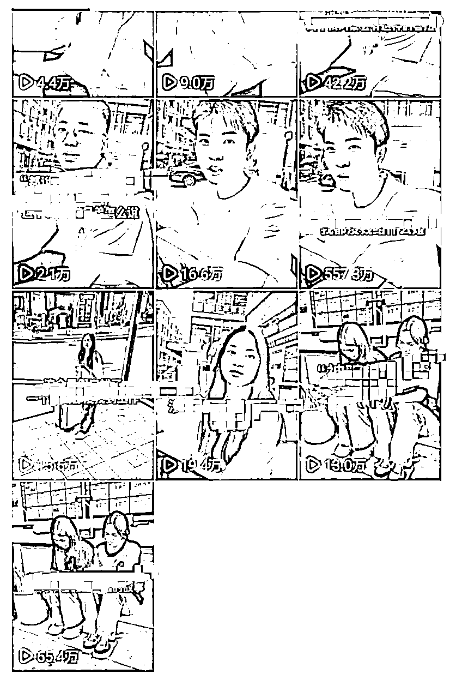

仅仅一个月时间，我的背书就多了起来，并且还在源源不断的持续增长中。

对我个人而言，这一个月的经历，我觉得可能会让我命运的齿轮开始转动起来，我通过这一个月的教学，竟然把自己的知识体系完善了，并且总结了一套核心的理论，我后期的变现方向都可以围绕这个理论展开。

当时有很多人都觉得我傻，为什么要免费带别人，现在回想起来，就是因为我的傻，才让我收获了现在这么多的隐形福利吧。所以我很喜欢生财里真诚利他的信念，我自己也会把这个信念一直坚持下去。

### （2）搭建产品，开始变现

在七月初，抖音对于记录创业类账号来了一次大清洗，我的账号也受到了影响，账号直接被限流。不过好在之前，我往私域了引了不少流，可以先通过私域进行变现。

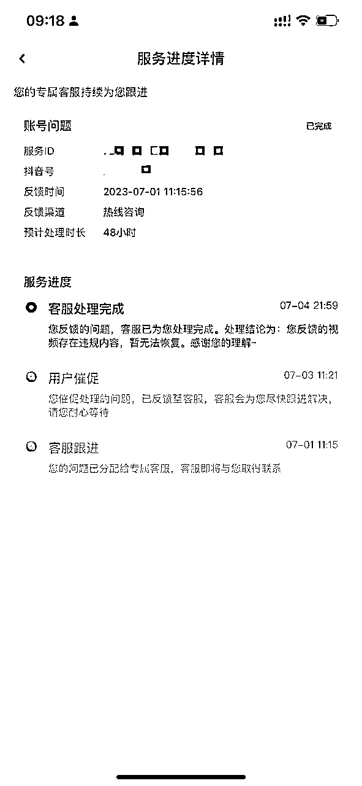

做产品的两个问题：

对于从来没有做过知识付费的我来说，做星球是一个很大的挑战。我不会营销话术，不会促活，也不知道怎么规划星球内容，并且还有一个很致命的问题，我的抖音粉丝99%都不知道知识星球是什么，这个教育成本真的太高了。

解决两个问题：

*   不会星球运营这个好办，找到一些成熟的模仿就行了，推荐大家一定要学会模仿别人，这个不仅做抖音有用，做其他行业也一样，作为一个营销小白，我模仿的一篇宣传文案，星球官方的工作人员看后竟然都想加入。

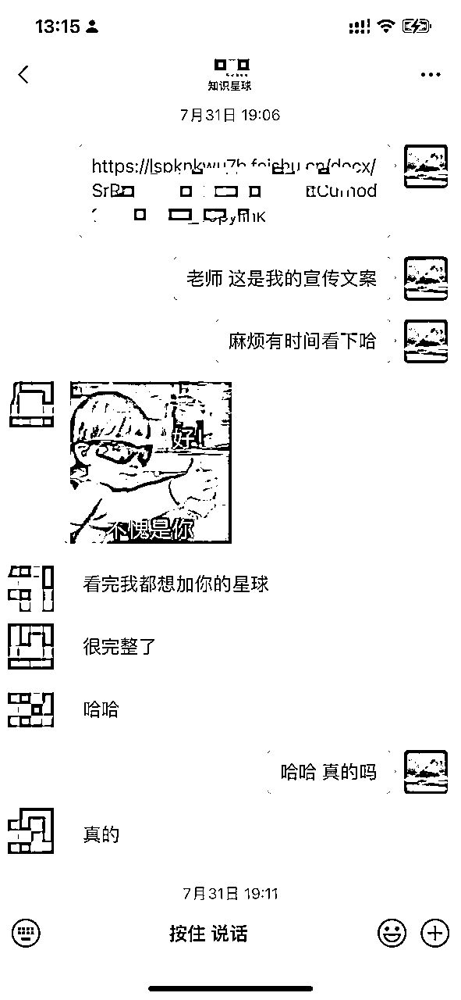

*   粉丝不知道知识星球是个大难题，我的迁移成本会很高，于是我利用这一个月的实践，开始在粉丝群里做了一些铺垫。给大家科普星球的一些功能，建立大家的期待值。

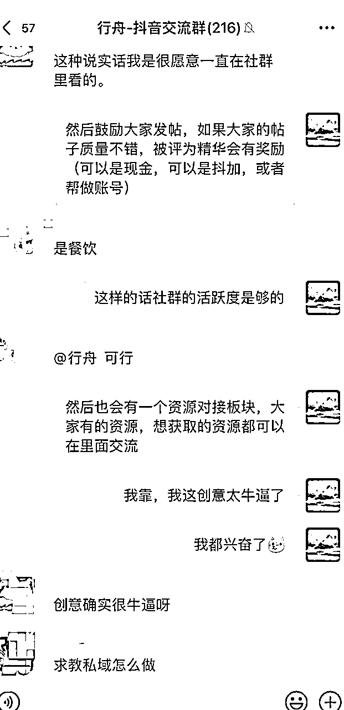

在7月末，我模仿了生财的提前预售和限时限量销售手段，当天晚上就转化了180多单，变现6w+，后面一个月陆陆续续进了200多人，最终变现15w+，同时我也模仿了生财的前三天留人手段，设置了新手闯关任务，因此活跃度非常不错，多次排名付费星球活跃榜前三的位置。

### （3）扩大圈子，加强背书

目前项目的初始SOP已经跑通了，发展期的初始目标已经完成。接下来的目标就是链接更多的圈子，扩充人脉。

其实做一个具有个人IP属性的抖音号有很多好处，虽然我只有七万多的粉丝，但是我已经可以链接很多资源了，比如担任一些社群的教练、也有很多老板找我共孵项目。

个人IP就相当于你的社交名片，可以减少很多沟通成本，被动链接很多资源。建议大家可以尝试下走下个人IP这条路。

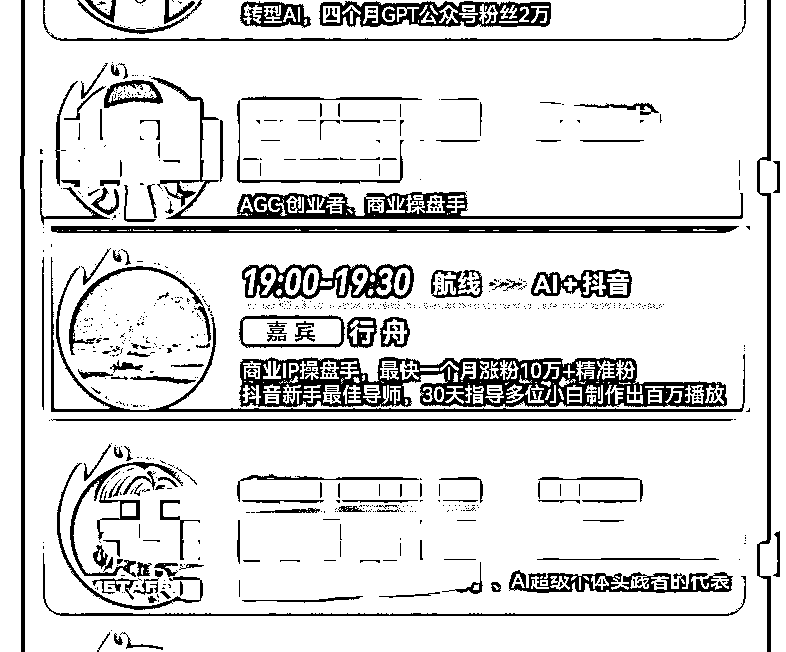

# 三、总结

本篇文章的主题是分享我是怎么从0-1做一个赚钱的抖音号的，重点介绍了每个阶段的困难以及我是怎么解决困难的，看完后大家对于怎么策划账号，怎么设计变现产品，怎么快速起号应该会有更深的理解。

非常感谢生财有术这个平台，让我看到了这么多高质量的内容，真的提高了我的认知和视野。

如果圈友们觉得这篇文章对你们有帮助的话，欢迎多多点赞和评论，这会激励我后面给大家分享更多的内容，比如怎么做人设、文案、拍摄、剪辑、投流等抖音必备的知识，都是经过验证的方法，拿来就能用。

有什么不懂的地方，也欢迎在帖子评论区提问，我看到都会回答的。