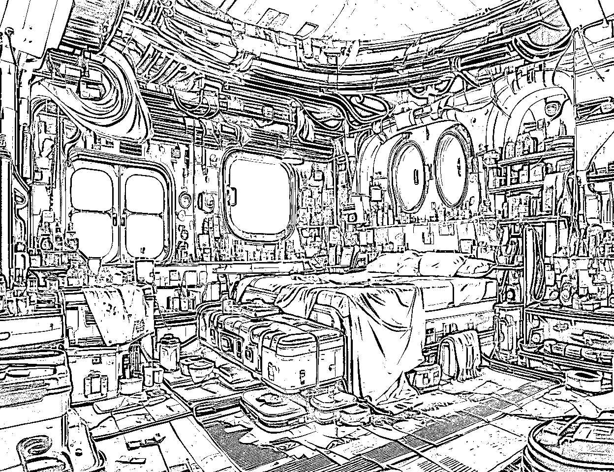

# 《AI建筑设计教程！15个万能模板，三个步骤让你成为设计师！》

> 来源：[https://ry5hwpuf7b.feishu.cn/docx/AVTDdb96Iog7gaxU05PcFrvGnBe](https://ry5hwpuf7b.feishu.cn/docx/AVTDdb96Iog7gaxU05PcFrvGnBe)

《AI建筑设计教程！15个万能模板，三个步骤让你成为设计师！》

各位好，我是吴东子

AI建筑设计，就是通过AI绘画工具给原本只有黑白线条的线稿，生成现实生活中彩色的效果图

对于建筑设计师来说，在短时间内就可生成多张意向图供客户选择，极大地提高生产力

对于我们大众玩家来说，可以根据自己的想象力，一下子就生成出十几种不同风格的建筑图

甚至是家里小孩子天马行空的画作，也能通过AI绘画变成现实

于是我把AI建筑设计的十多种风格都跑了一次，给大家整理出了一套完整的制作教程

那今天这篇文章将会分为安装模型，SD基础设置，Controlnet设置三个步骤

你只要跟着一步一步操作，也能做出同款的AI建筑设计图

1.中式庭院风

2.未来科幻风

3.城市鸟瞰图

4.线稿手绘图

5.平面设计图

另外，文中需要用到的所有模型文件，也都给大家打包好放在末尾的网盘链接里了，不需要大家再自己到处去找

花了很多时间才整理出来，希望对你有帮助

严禁抄袭搬运，势必追诉到底！

# 一，什么是AI建筑设计

AI建筑设计，就是通过AI绘画工具给原本只有黑白线条的线稿变成彩色的效果图

只需要几分钟就可以让黑白线稿变成几种甚至十几种不同风格的建筑

让建筑设计师在短时间内就可生成多张意向图供客户选择

当然我们也可以把这个功能玩起来

把一栋普通的建筑变成科幻电影里的样子

当然，如果不喜欢，也可以变成复古中国风

甚至是小孩子的一张简笔画也能通过AI绘画变成现实

我们还可以通过AI绘画工具给房间换一个风格

城市规划的鸟瞰图，也可以通过AI工具一键生成效果图

还能生成这样的室内平面设计效果图

# 二，如何利用AI工具把画作变成效果图

可以分为以下三步

1.安装模型

2.SD基础设置

3.Controlnet设置

那接下来我们就以这张线稿为例，看看具体的操作步骤

## 1.安装模型

想要生成比较满意的图片，我们需要安装两种必不可少的模型

01.大模型

02.Lora模型

大模型会直接影响出图的质量

而Lora模型则是可以帮助我们更好地控制照片的特征和风格

### 01.安装大模型

要想生成比较满意的图片，得先有一个好用的大模型

不过市面上的建筑类大模型太多了，我也是试了许多个大模型之后

才找到了一个出图比较稳定而且好用的大模型，为了不浪费大家的时间去找，已经给大家准备在网盘里了

安装方法十分简单

只需要下载网盘里面“大模型”文件夹里的模型

然后把文件夹里的模型复制到对应的文件夹

存放位置：SD文件夹\sd-webui-aki-v4.2\sd-webui-aki-v4.2\models\Stable-diffusion

### 02.安装Lora模型

这里的操作是跟安装大模型是一样的

只不过是把网盘里面的文件复制到了不同的文件夹

先下载网盘里面的Lora模型

然后再把Lora的模型复制到对应的文件夹

模型安装完后，记得重启SD

这样就可以在SD里面看到我们安装的模型了

## 2.SD基础设置

SD的基础设置包括：

01.选大模型

02.关键词

03.设置参数

### 01.选大模型

这里直接选择我们刚刚添加好的大模型

### 02.关键词

由于我们的图片风格需要用到Lora来控制

所以在写关键词之前，我们先把需要的Lora添加进去

先点击生成下面的红色按钮

然后选中Lora，在列表里面选择我们想要的Lora模型

这样我们就能看到Lora模型添加进正面关键词里了

写关键词之前要注意

有些大模型是有触发关键词的，我们要先在正面关键词里写上触发关键词，模型才会生效

比如我们用的这个大模型的触发词就是"LAOWANG"

添加完Lora和触发关键词后我们就可以开始写关键词了

由于每张线稿的建筑都不一样，所以我们要描述线稿的建筑以及你希望出现的画面

例图关键词:

<lora: architectural-6:1="">，LAOWANG,Highest quality,ultra-high definition,masterpiece, 8k quality，</lora:>

modern architecture,morden style,retro architecture, luxurious architecture, Single family villa

通用负面关键词：

(worst quality:2), (low quality:2), (normal quality:2), lowres, ((monochrome)), ((grayscale)), bad anatomy,DeepNegative, skin spots, acnes, skin blemishes,(fat:1.2),facing away, looking away,tilted head, lowres,bad anatomy,bad hands, missing fingers,extra digit, fewer digits,bad feet,poorly drawn hands,poorly drawn face,mutation,deformed,extra fingers,extra limbs,extra arms,extra legs,malformed limbs,fused fingers,too many fingers,long neck,cross-eyed,mutated hands,polar lowres,bad body,bad proportions,gross proportions,missing arms,missing legs,extra digit, extra arms, extra leg, extra foot,teethcroppe,signature, watermark, username,blurry,cropped,jpeg artifacts,text,error,

### 03.设置参数

迭代步数选择30

采样方法：DPM++2Sa karras

这个模型的推荐分辨率是在1024*768以上，所以宽度和高度我们可以适当调高一点

所有参数都设置好后，第二步就完成了

## 3.Controlnet设置

我们先把图片拉进Controlnet的框里

然后点击“启用”，“完美像素模式”，“允许预览”

控制类型选择“Scribble涂鸦”，其实选“canny硬边缘”和“Lineart线稿”也可以

每一个控制类型大家都可以试试

不过在跑了那么多张图片后我觉得“Scribble涂鸦”更适合让SD发挥

控制权重选择1-1.3之间，点击中间的小火花预览，然后点击生成

这里需要注意，由于每个线稿的不同，Controlnet的参数并不是固定的

需要根据线稿跟出图的效果不断调整

最后直接点击生成，第一张线稿图就做好啦

## 4.局部重绘

如果是对图片生成的某一部分不满意

我们还可以利用Controlnet的“局部重绘”，把不想要的部分涂黑

重新生成不满意的部分

## 5.不同类型Lora和关键词

为了能让大家能够创作各种不同的建筑风格，在尝试了许多个Lora模型，出了许多张图片后

我给大家整理了部分出图比较好看的建筑风格Lora和关键词

都已经给大家打包好放在网盘里了，直接下载就可以用

### 中式庭院风

Lora:<lora:isometric_chinese_style_architecture_v1:1></lora:isometric_chinese_style_architecture_v1:1>

关键词：

<lora:isometric_chinese_style_architecture_v1:1>,LAOWANG,Highest quality,ultra-high definition,masterpiece, 8k quality，(extremely detailed CG unity 8k wallpaper)</lora:isometric_chinese_style_architecture_v1:1>

Chinese style, Chinese courtyard, detached villa, Chinese architecture,

### 未来科幻风

Lora：architecture<lora: sci-fi_v1.0:1=""></lora:>

关键词：

architecture <lora: sci-fi_v1.0:1="">，Highest quality,ultra-high definition,masterpiece, 8k quality，(extremely detailed CG unity 8k wallpaper)</lora:>

LAOWANG,architectural photography, science fiction style, cyberpunk style, science fiction architecture,

### 魔幻月夜风

Lora:<lora:xsarchitectural-12nightmoonsci-fi:1></lora:xsarchitectural-12nightmoonsci-fi:1>

触发词：

FOREGROUND前景

MOONLIGHT REFLECTION月光倒影，SACREDNESS神圣，LANDSCAPE景观，BRIGHT明亮，FHD食物及卫生局，4K，HIGH RESOLUTION高分辨率，REALISTIC现实，HYPERREALISM超现实主义

关键词：

<lora:xsarchitectural-12nightmoonsci-fi:1>,Highest quality,ultra-high definition,masterpiece, 8k quality，(extremely detailed CG unity 8k wallpaper)，</lora:xsarchitectural-12nightmoonsci-fi:1>

LAOWANG,,retro architecture, luxurious architecture, Moonlight reflection, sacred, landscape, producing many glowing minerals,space,bright,

### 城市鸟瞰图

Lora:<lora:></lora:>

关键词：

<lora:>, LAOWANG,(extremely detailed CG unity 8k wallpaper)</lora:>

Aerial view, urban planning, modern urban design, modern style architecture, metropolis, (extremely detailed CG unit 8k wallpaper), (masterpiece), (best quality), (super detail), (best illustration), (best shadow),

### 室内平面图

Lora：<lora:lwpm-v0.1p:1></lora:lwpm-v0.1p:1>

触发词：Rendering floor plan

关键词：<lora:lwpm-v0.1p:1>,Rendering floor plan, LAOWANG, Highest quality,ultra-high definition,masterpiece, 8k quality，(extremely detailed CG unity 8k wallpaper)</lora:lwpm-v0.1p:1>

apartment floor plan rendering, interior design top view, white background, best details, complete furniture,

### 苏式园林风

Lora:<lora:suzhouyuanlinv1></lora:suzhouyuanlinv1>

触发词：

EAST_ASIAN_ARCHITECTURE东亚建筑

ARCHITECTURE建筑

BRIDGE舰桥

BUILDING建筑物

GARDEN花园

关键词：

<lora:suzhouyuanlinv1>,Highest quality,ultra-high definition,masterpiece, 8k quality，(extremely detailed CG unity 8k wallpaper)，</lora:suzhouyuanlinv1>

LAOWANG,retro architecture, luxurious architecture, Buildings, gardens, bridges, East Asian architecture, Suzhou gardens

### 水彩漫画风

Lora：<lora:jzcg021-comic building:1=""></lora:jzcg021-comic>

触发词：JZCG021

关键词：

<lora:jzcg021-comic building:1="">,JZCG021,scenery, outdoors, motor vehicle, sky, car, tree, ground vehicle, cloud, building, multiple girls, road, window, street, walking, day, lamppost, blue sky, city, sign, crosswalk, artist name, multiple boys<lora:xsarchi_113:1>, (masterpiece),(high quality), best quality, real,(realistic), super detailed, (full detail),(4k),8k,</lora:xsarchi_113:1></lora:jzcg021-comic>

### 线稿漫画风

Lora：<lora:xsarchi_113facadeofmangastylebuilding></lora:xsarchi_113facadeofmangastylebuilding>

关键词：<lora:xsarchi_113facadeofmangastylebuilding>,Highest quality,ultra-high definition,masterpiece, 8k quality，(extremely detailed CG unity 8k wallpaper)，</lora:xsarchi_113facadeofmangastylebuilding>

LAOWANG,modern architecture, modern style,retro architecture, luxurious architecture,

### 热带海岛风

Lora:Delfino _ Plaza

触发词：Delfino _ Plaza

关键词：

<lora:delfino_plaza:1>,Delfino_Plaza,Highest quality,ultra-high definition,masterpiece, 8k quality，</lora:delfino_plaza:1>

LAOWANG,modern architecture, modern style,retro architecture, luxurious architecture, Tropical, Beach

建筑模型除了以上的几种，网盘里还给大家准备了其他的Lora，触发词也已经给大家标注好了

大家看完文章可以自己按照教程试一试效果

在这里就不给大家逐一展示效果了

# 三.室内设计

如果你的家里需要装修

还可以利用Controlnet进行室内设计

不管是毛坯房，还是正在住的房间，都可以快速生成不同的风格

方法也很简单，只需要三步

1.上传房间照片

2.选择控制类型

3.写关键词

## 1.上传房间照片

方法跟上面一样，只要把照片拖进方框里即可

## 2.选择控制类型

这里有两种不同的选择

01.MLSD直线

02.seg语义分割

### 01.MLSD直线

这个控制类型只会识别出房间里面的直线框架

如果你希望在换风格的同时，把里面的物品也一并换掉的话可以选择这个控制类型

### 02.seg语义分割

这个控制类型则是会用颜色把房间里的所有物品原封不动地固定好

如果你只希望给房间换风格，而不希望把里面的物品换掉，就可以选择这个控制类型

大家可以根据自己的需求自由选择

## 3.关键词

跟上面一样，在添加了Lora和触发关键词后

就需要在正面关键词里描述你大概希望出现的物品，比如白色的沙发，咖啡色的桌子

最后点击生成就可以了

另外这里还给大家准备了一份室内设计的关键词分类表

大家在写关键词的时候可以看一下

#### 末日风：

Lora:<lora:></lora:>

Lora触发词：Future style

关键词：

<lora:>，highest quality,ultra-high definition,masterpiece, 8k quality,Many details,(extremely detailed CG unity 8k wallpaper)</lora:>

LAOWANG, one bedroom, Reasonable layout，Future style, apocalyptic style, bedroom, bed

#### 新中式风格：

Lora：<lora:></lora:>

Lora触发词：xzs

关键词：

<lora:>,highest quality,ultra-high definition,masterpiece, 8k quality，Many details，(extremely detailed CG unity 8k wallpaper)</lora:>

LAOWANG,xzs, interior design, living room, reasonable layout, Chinese style, Chinese elements, Chinese furniture, Chinese furniture

#### 赛博朋克风：

Lora:<lora:></lora:>

Lora触发词：cyberpunk style

关键词：<lora:>，highest quality,ultra-high definition,masterpiece, 8k quality，Many details，(extremely detailed CG unity 8k wallpaper)</lora:>

LAOWANG,One bedroom, Reasonable layout，cyberpunk style, futuristic style, interior design, blue and purple neon lights, dim lighting, gorgeous, detailed,

#### 室内平面图：

Lora:<lora:lwpm-v0.1p:1></lora:lwpm-v0.1p:1>

关键词：<lora:lwpm-v0.1p:1>, LAOWANG, Highest quality,ultra-high definition,masterpiece, 8k quality，(extremely detailed CG unity 8k wallpaper)</lora:lwpm-v0.1p:1>

apartment floor plan rendering, interior design top view, white background, best details, complete furniture,

## 4.毛坯房

因为毛胚房是没有任何家具的，所以当我们需要进行设计的时候，得先用上面的方法让毛坯房生成基本的雏形

先用Controlnet生成房间的大致的线条，控制类型选择“Depth深度”

然后做出一张房间雏形的图片

之后再把这张图拖进图生图的局部重绘里，涂掉没有家具的部分

然后在关键词里添加想要的家具，不断抽卡，生成满意的图片

# 四，结尾

好了，以上就是我们这篇文章的全部内容，希望能够让你做出更多有趣好玩的AI建筑设计图

如果你对AI感兴趣的话，可以持续关注，也欢迎分享给你身边想学AI技术的朋友

里面有我之前发过的所有文章，之后也会持续给大家更新实用的AI干货教程

我是吴东子，用奶奶都能听懂的方式，分享可以落地实操的干货，我们下篇文章再见！

网盘链接：https://pan.baidu.com/s/1ykkDLluXc_E9cC7_tK7Gwg?pwd=wdz6

提取码：wdz6

室内设计关键词查询：

吴东子AI账号简介：https://ry5hwpuf7b.feishu.cn/wiki/space/7283841978071072772?ccm_open_type=lark_wiki_spaceLink