# 我剪辑明星的卖货视频，发到抖音上，第一个月赚了8W，找项目一定不能错过（附操作全流程）

> 来源：[https://own4m8h9o3k.feishu.cn/docx/AhtAdpSzQoiRUCxI5cscgCSVn3b](https://own4m8h9o3k.feishu.cn/docx/AhtAdpSzQoiRUCxI5cscgCSVn3b)

我做项目已经3年多了，从最初0收入，到如今成立一个几十人的小团队；

空闲的时间做项目是很多打工人的底牌，看透了职场的“高薪套路”，很多人早就把精力放在了做项目上，但好项目根本不是那么好找的，一个不留神，就被“割韭菜”！

大家听我说句实话，靠谱的项目，真的不好找，如果你不了解下面几个关键点，你真的容易被“割”。

作为过来人，给你分享一下做项目必知的几个关键点：

1、你一定要了解兼职、做项目之间的区别

两者最大的区别是：

兼职没有积累性，用时间来赚钱的，只能赚一时，本质上还是“打工”，不建议大家做兼职；

做项目有积累性，做一天和做一年有本质上的差异，可以给自己带来长远的收益，能一直赚，建议大家做项目；

给大家举几个具体的例子，方便避坑：

体力赚钱：跑腿、发传单、插画变现、声音变现

时间赚钱：各种听小说、刷视频赚钱、兼职打字

这些兼职等同于“智商税”，根本没有人能赚到钱。

遗憾的是，大部分都以为自己是做项目，其实，他们只是做的最基础的兼职，不赚钱的同时，还要倒贴钱。

2、做项目的好处

会有以下的特点：

能增加收入：除了主业的收入外，能不断的增加收入，相当于两份收入，能存下钱；

能增加独立性：可以减少对主业的依赖性，多了一个收入来源，花钱会更淡定，生活会更从容；

能减轻工作的压力：做项目得到的收入能够转移注意力，缓解工作带来的压力和焦虑；

说到这里，我推荐你一个抖音新开发的项目，一个可以让你一直做下去的项目。

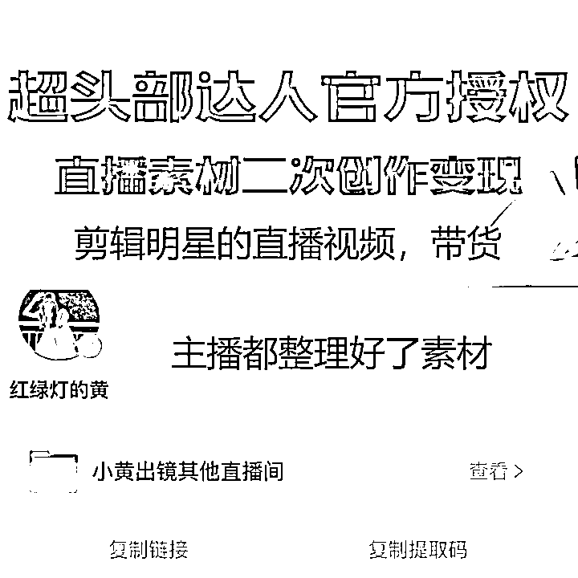

这是非常有前景的项目，剪辑明星的视频素材，把明星直播卖货的内容，剪辑成带货的视频，

不是让你做视频，而是明星官方提供好视频素材让你二次剪辑，这就比较简单了。

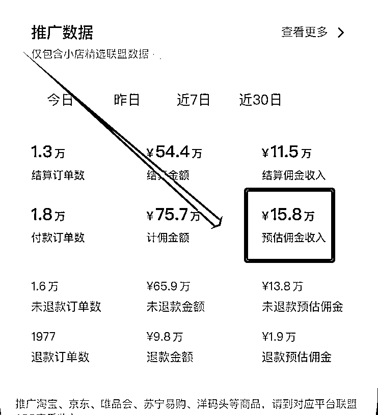

a、抖音现在疯狂的给明星的直播间导电商流量，想让越来越多的人去看明星的卖货视频，但不是所有人都有时间在晚上看明星的直播，没有办法，只能把明星的直播视频剪辑成短视频，随时随地的把卖货视频推到粉丝的手机上，让他们产生购买行为。

像下面这个视频，就是剪辑好的视频，能源源不断的出单，甚至3个月的时间内，都会出单。

只要出单，你就能拿到佣金。

b、一开始，剪辑视频是明星的工作人员来操作的，但是明星的产品太多了，而且一个产品需要上架几百甚至几千个视频，明星的工作人员根本不够用，只能把素材给大家，让大家去剪辑，明星几乎每天都会直播，不缺素材，也不缺产品，我用手机或者电脑剪辑视频就好。

拿到素材之后，按照明星的要求去剪辑视频；

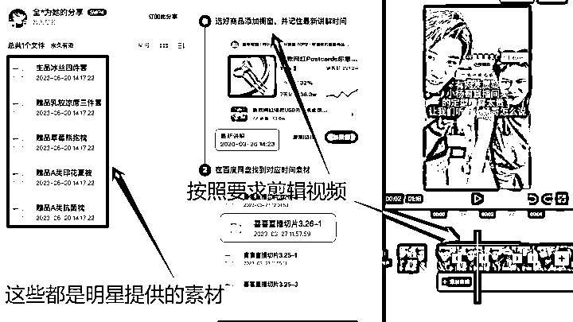

发布视频的时候，添加上明星提供的商品链接，坐等出单就可以

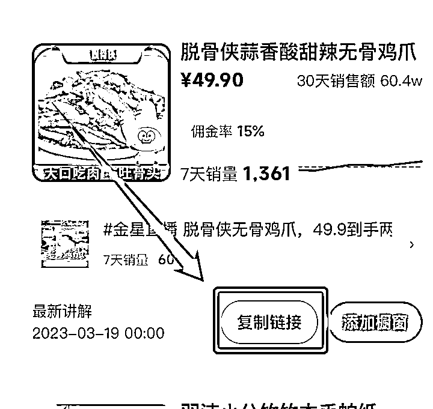

添加图片注释，不超过 140 字（可选）

明星在短视频平台都是几百万几千万的粉丝量，不缺流量，不缺产品，不缺素材，而且明星是最在意自己名声的，不存在不靠谱一说，这意味着剪辑手黄不了，你能做的长远。

这才是真正的副业，收益高，还可以长期做。

我一开始做的时候，不需要拍摄，不需要直播，只需要拿着明星给的素材，按照模板剪辑视频，每天轻松赚几百，几千，甚至几万！

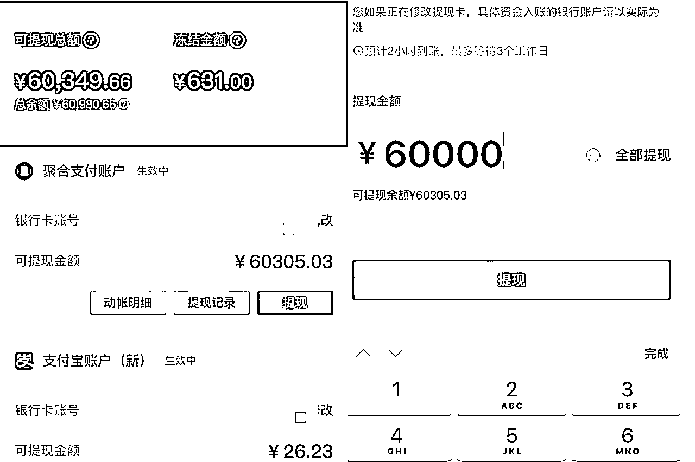

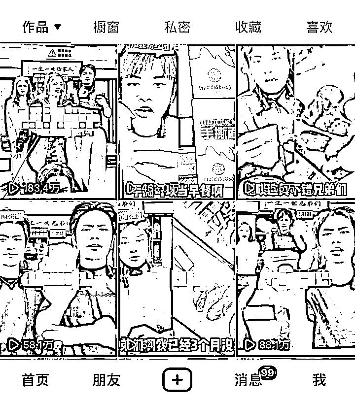

一个账号也满足不了我的野心，于是拿着积蓄开始扩了起来。

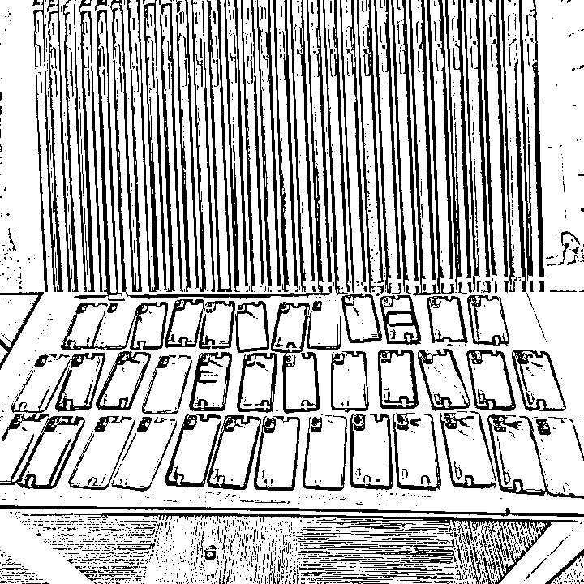

添加图片注释，不超过 140 字（可选）

马无夜草不肥，人无外财不富，通过剪辑明星的素材，我赚到了属于我的互联网第一桶金。

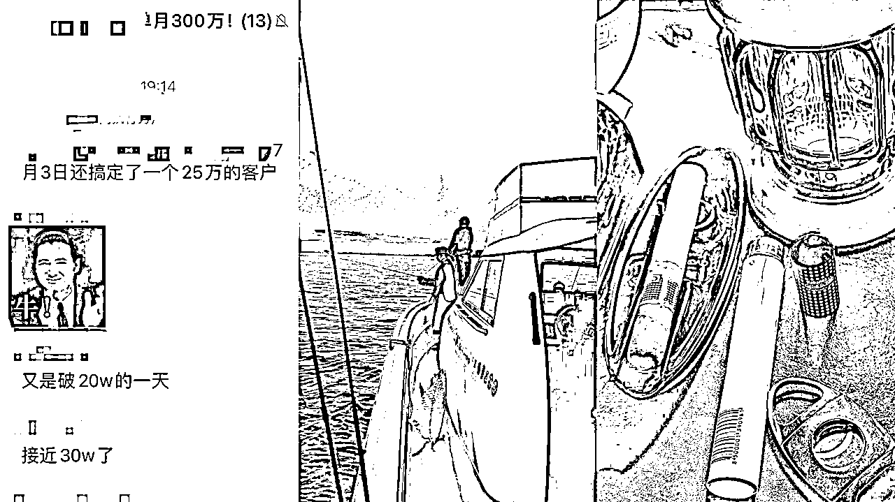

后来随着疯狂小杨哥授权的账号越来越多，剪辑明星素材就变成了一个项目，直播切片。

其他明星达人看到小杨哥赚的这么多，也开始开放授权，提供素材给大家剪辑。

一开始，我们也不断的储备账号去拿授权，剪辑，让公司尽可能多的拿到授权。

但是一个公司的力量是有限的，在多方面的思考之后，我准备调整公司的战略方向。

我们不如作为一个中端，向上承接授权，帮明星去培养剪辑手，向下开放授权，给各位有剪辑能力或者有赚钱欲望的朋友，一起去做这件事。

剪辑明星网红素材这件事，大家可以这样理解，明星网红拿到了价格低、质量好的产品，在直播间进行售卖，看到的人越多，就越赚钱，但是，不是所有人都能在晚上看明星的直播。

平台只能借助短视频，把卖货的视频，送到每一个用户的手机上，因为短视频是可以随时随地的刷到，所以，这个生意就应这个需求产生了。

明星一开始也是自己的公司找剪辑手做视频，但是市场太大了，人手不够用，只能把授权开放，让更多人的人参与剪辑。

说实话，这个项目一定要冲，这和得到一份好工作没有太大的区别，赶上抖音发力电商领域的好时候，能拿到的明星授权和明星产品链接，一定要拿，这都是白花花的银子。

## 一、如何拿到明星官方的专属授权？

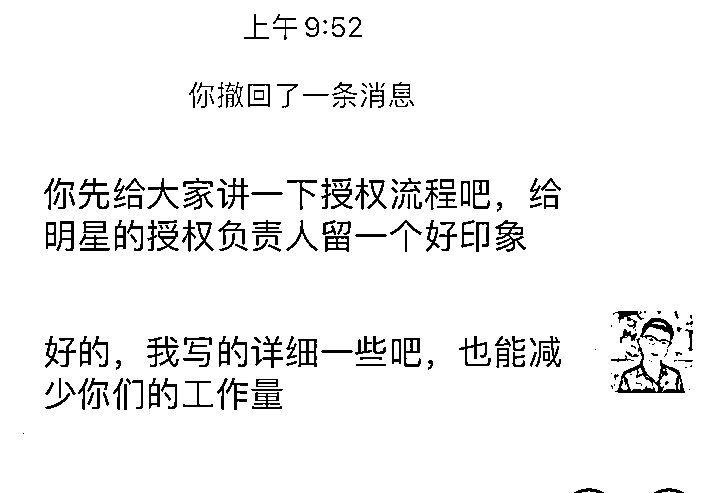

添加图片注释，不超过 140 字（可选）

更新：

刚刚工作人员让我给大家讲一下申请的流程，防止出现操作上的问题，给发放授权的负责人留下好印象。

授权的流程如下：

### 三只羊机构IP授权下载APP《众小二》

可授权网红：交个朋友直播间，郝劭文，红绿灯的黄，嘴哥、三只羊网络，疯狂小杨哥，辛吉飞，朱梓骁，陈赫，七老板、金星、圆脸妹得得、于天奇、逆袭丁姐；

目前开放授权网红：金星、圆脸妹得得、于天奇、七老板、逆袭丁姐（达人开放授权具有随机性，仅供参考）

达人开放授权都是随机的，比如非常有潜力的三只羊的嘴哥、小杨哥的徒弟红绿灯的黄，基本上是每月开放一次，大家可以先练习剪辑能力，待开放授权时，再去申请授权，只要有能力，就能拿上授权。

申请授权步骤：

注册登录众小二APP

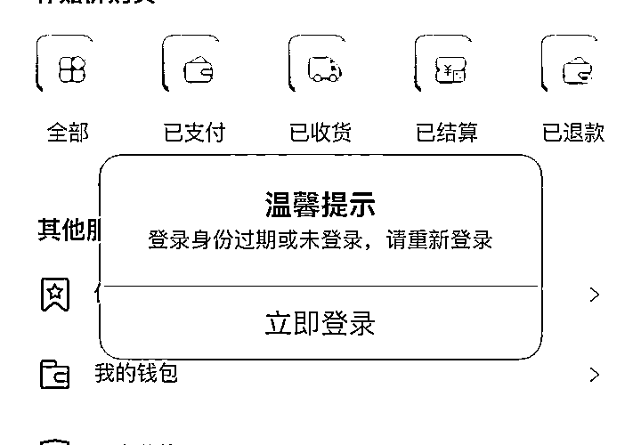

添加图片注释，不超过 140 字（可选）

点击内容分发

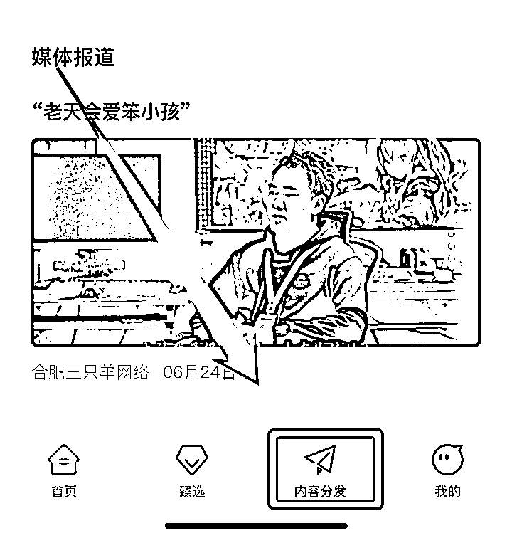

添加图片注释，不超过 140 字（可选）

学习课程（用心学习）

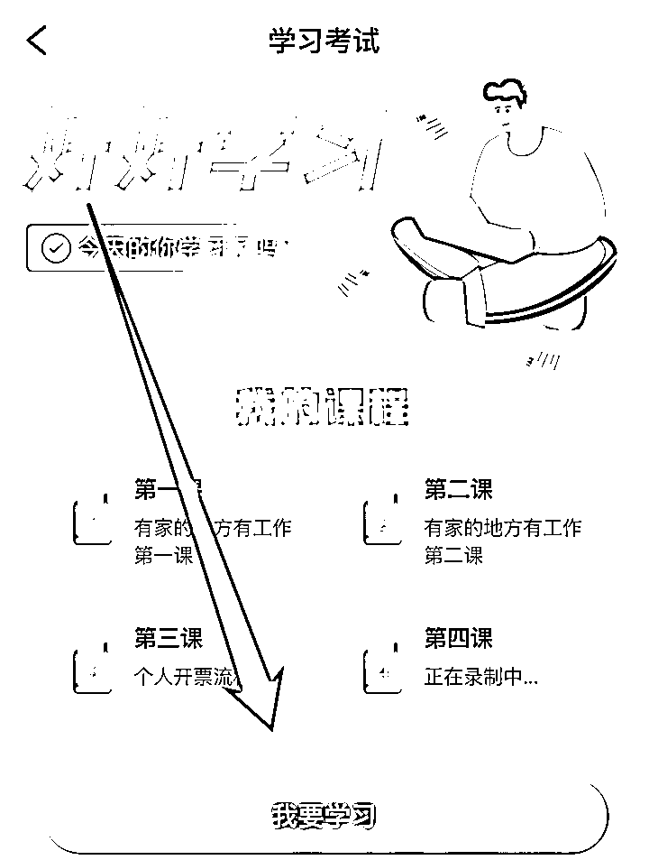

添加图片注释，不超过 140 字（可选）

完成考试（认真作答，基本都会通过）

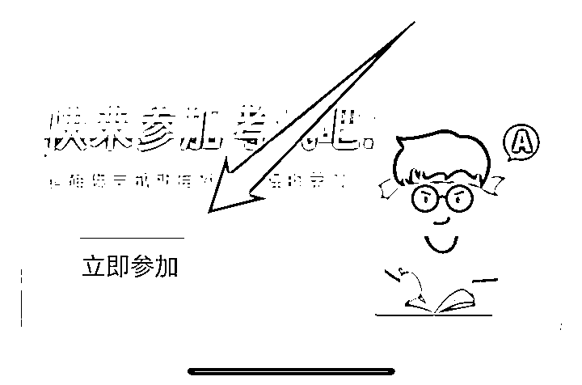

添加图片注释，不超过 140 字（可选）

点击账号管理（新增账号，选择达人）

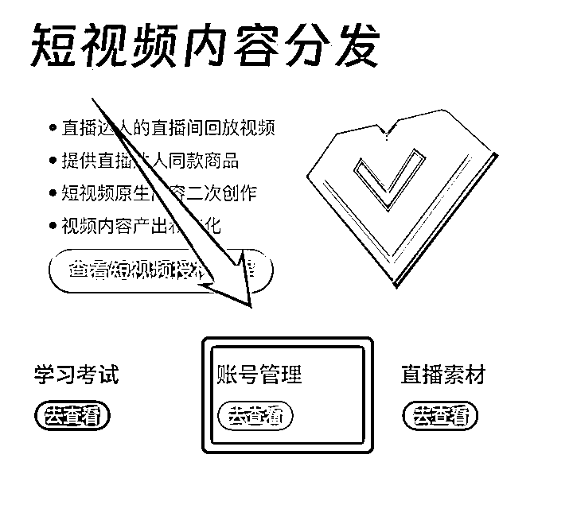

添加图片注释，不超过 140 字（可选）

剪辑直播素材

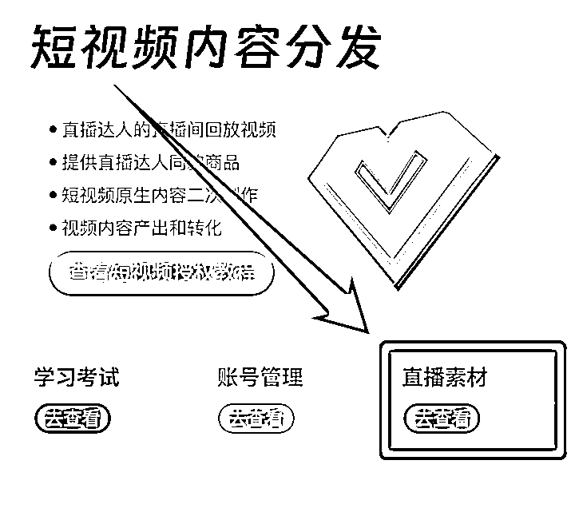

添加图片注释，不超过 140 字（可选）

完成任务，获得授权

现在开放授权的明星、网红还比较多，大家一定要把握机会，赶紧去申请授权。

添加图片注释，不超过 140 字（可选）

## 二、明星的直播视频好剪辑吗？

其实很简单，我给你示范视频怎么剪。

1、下载素材，导入剪映：在百度网盘中下载明星网红提供的素材，导入剪映，开始剪辑

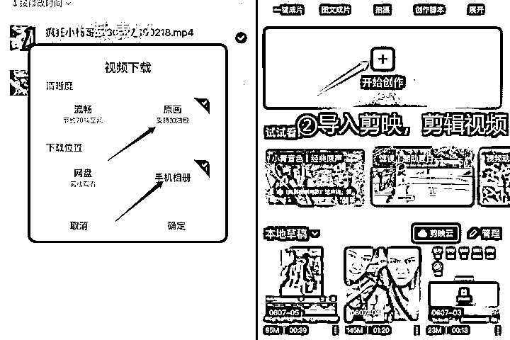

添加图片注释，不超过 140 字（可选）

2、粗剪素材：将直播片段中介绍产品的片段剪辑出来，不留一句废话，此步骤只需要熟练使用“分割”

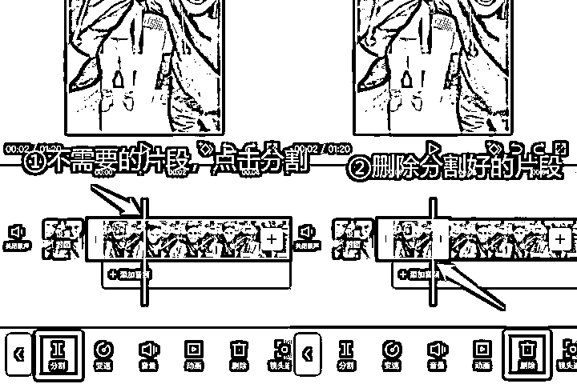

添加图片注释，不超过 140 字（可选）

3、加解说（槽点）：给整个视频加一个吸引人的槽点，提高整个作品的完播率

①找点赞高的槽点文案，利用小程序提取文案

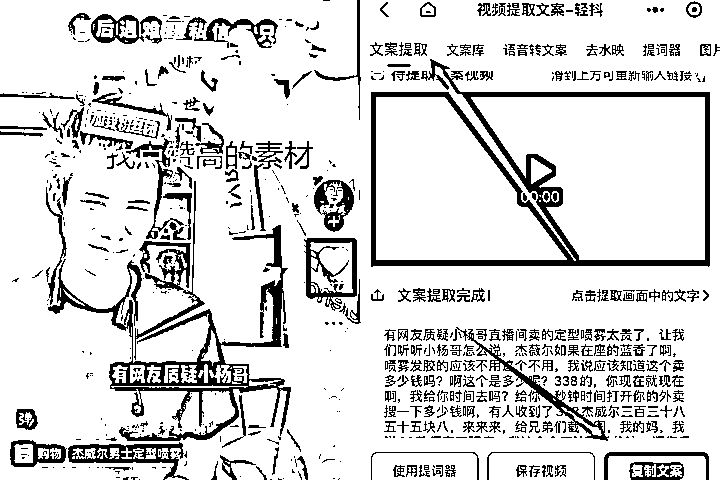

添加图片注释，不超过 140 字（可选）

②在剪映添加文本，生成解说

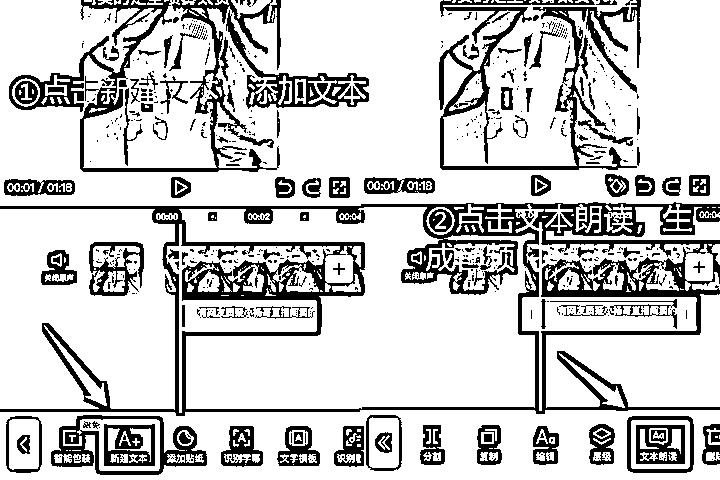

添加图片注释，不超过 140 字（可选）

③根据解说，配相应的素材，可以从抖音或者明星提供的素材中截取片段

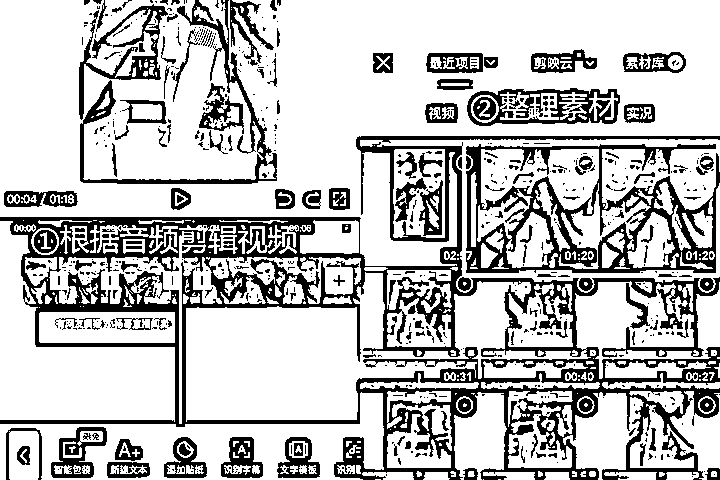

添加图片注释，不超过 140 字（可选）

4、视频添加音效：在合适的位置，添加音效能提高点赞率和互动

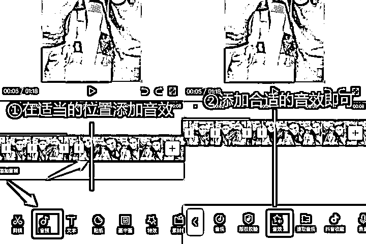

添加图片注释，不超过 140 字（可选）

5、视频添加特效：在合适的位置，添加特效可以增加视频的原创度

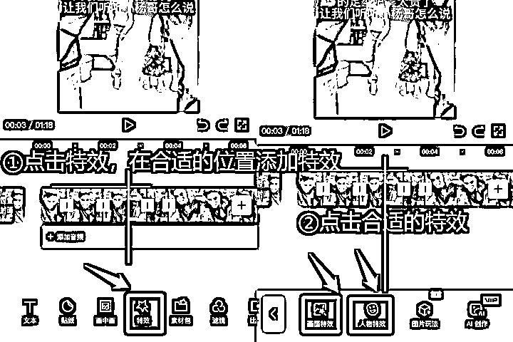

添加图片注释，不超过 140 字（可选）

6、视频添加字幕：点击文本，智能识别字幕

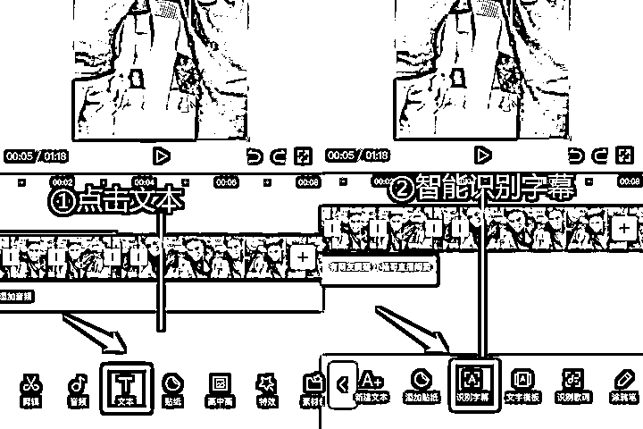

添加图片注释，不超过 140 字（可选）

7、视频添加背景音乐：添加轻柔或者有节奏感的音乐即可

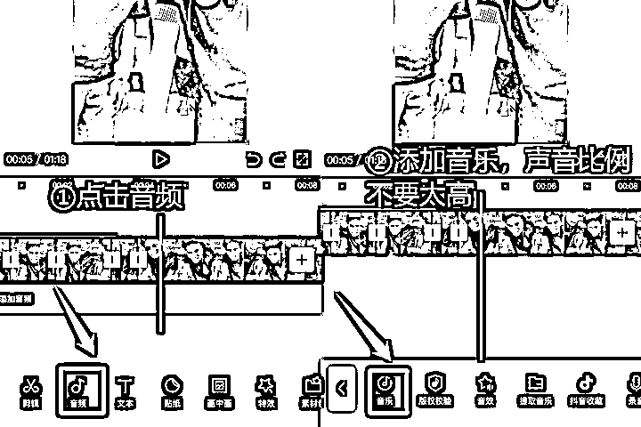

添加图片注释，不超过 140 字（可选）

这样下来，一个完整的视频就差不多制作好了，前后有不了30分钟。

也不耽误平时上班时间，只需要在家剪辑视频，发布到抖音平台上，这种副业真挺好的。

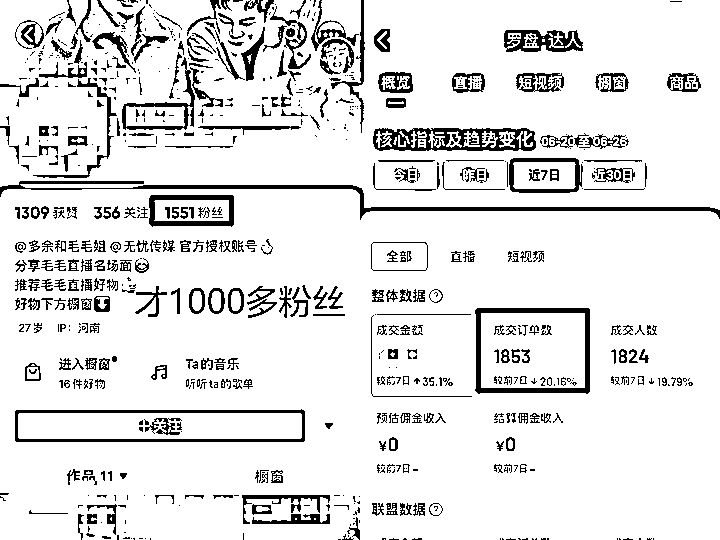

添加图片注释，不超过 140 字（可选）

如你所见，这类素材的出单量比较大，收益也很高。即使抖音账号上只有一千粉丝或者没有粉丝，也是能做的。

## 三、在抖音上买东西的人多吗？剪辑明星的视频能做多久？

这也是我见过最多的问题，我用两个案例就能给你解释清楚，看好了哈！

第一个案例：抖音明星网红的带货数据

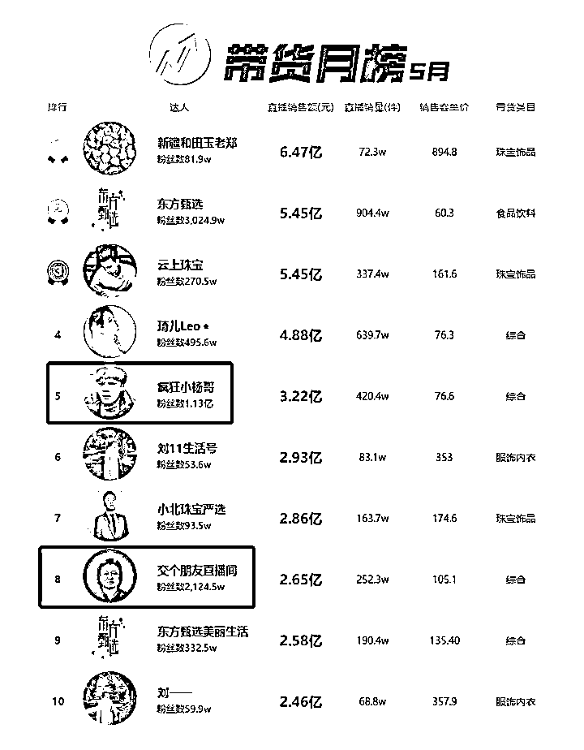

添加图片注释，不超过 140 字（可选）

大家看抖音带货前10的达人，这销售额可不是一般的高，还有哪些平台能有这么高的销售额呢？

现在在抖音上购买产品，已经成为了习惯。

而且前10 的商家中，小杨哥和交个朋友直播间开放了授权，可以让广大剪辑师去剪辑，从这里就能看到平台官方的态度，如果平台不支持，不可能有这个段位的人去放开授权的；

前10个达人中有2个开放授权，余下的市场还有很多，也能看出来剪辑明星素材的前景很好，可以这样说， 抖音能存在多久，剪辑视频的项目就能做多久。

第二个案例：

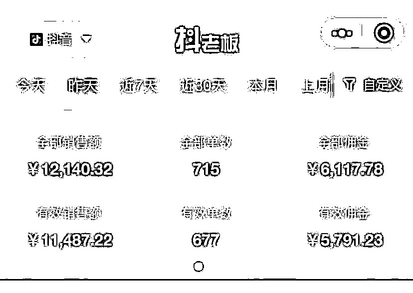

新手发了3~4个视频就能出单

大量的客户在抖音上购买产品，这个机遇将会造就一批新的富豪。

不然怎么才能发几个视频就能出单呢？

这个出单情况像不像红利期的淘宝呢？

这里给大家讲一下我对红利期的概念：

红利期项目，不需要技术、资源，普通人也能赚钱；

非红利期项目，需要技术、资源，有能力的人才能赚钱；

对于你我这样的普通人来说，做红利期的项目才能赚钱，不然就是浪费时间，浪费精力。你说你去做带货、抖店、直播，这些不是红利期的项目，能赚钱吗？

聪明人都是在红利期打磨技术，积累资本，即使过了红利期，也有“防火墙”，也能赚钱。

* * *

把剪辑明星视频当做副业也是这样的，你不但可以得到很高的佣金，渐渐地也能学会做抖音，因为视频都是你剪的。

学会做抖音有很多好处。

1、增加你的影响力

通过抖音平台，能展示你的专业知识和技能，通过这些内容可以获取流量，从而在生活或者职场中获得更多的认可和机会。

2、传播知识和经验

抖音是一个分享知识和经验的好渠道，可以把你的观点和经验分享给更多人，帮助他们解决问题，也能提高你的能力。

3、增加收入

抖音平台上，可以通过广告、带货、知识付费、平台补贴等方式，增加你的收入。

那这样，相当于有了2个副业，一边接明星的素材，剪辑视频，一边运营自己的账号，又多一条路，毕竟，明星的视频是发在自己的账号上。

回到正文上

## 不会剪辑，没有做过短视频，能做剪辑明星素材的剪辑手吗？

大多数人都认为：不会剪辑，没有做过短视频，就不能做剪辑明星素材的剪辑手，这么想不能说完全错误，但是没有必要。

而且很多人容易落入思维惯性的误区里面，总以自己现在的能力去评判能不能做！

第一，不会做可以去学，只要你有执行力，对赚钱有欲望，就能去学习，谁一生下来就会做所有事情呢？

第二，不要给自己设限，没有做过的事情，也不一定是非常难的事情，没有亲手做过，你就不知道剪辑手到底好不好做！

各位都是在想在互联网上找项目的，一定要记住：实践是检验真理的唯一标准，看到项目，啥也不要想，自己先试试，干了再说。

再说说剪辑明星素材的优势：

### 1、不用为流量而担心，明星网红不缺流量

这是剪辑明星视频的核心优势，不缺流量；

这是最牛逼的！

开放授权的小杨哥、金星、大狼狗夫妇、郝劭文、嘴哥、许华升、张柏芝等等明星

在短视频平台上，谁没有几千万的粉丝呢？

剪辑小杨哥大杨哥互黑的视频，会没有流量吗？

剪辑金星吐槽娱乐圈黑料的视频，会没有流量吗？

剪辑大狼狗夫妇直播间槽点的视频，会没有流量吗？

利用明星的流量，去卖产品，每天被动收入几十，几百稳稳的，赶上周末说不定能突破更高。

有时候一个视频爆了，连续不断的流量还能把整个账号的流量带起来

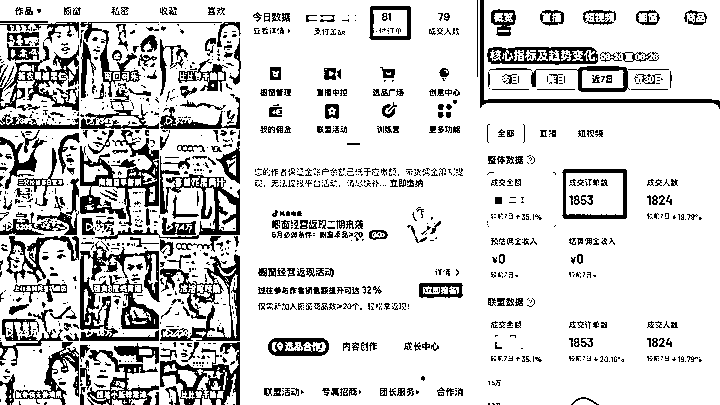

添加图片注释，不超过 140 字（可选）

一个月的时间里，每天打开手机的后台收益界面，就好像开盲盒一样刺激，你要是有多个账号剪视频会更爽。

之所以能这样，因为短视频平台在源源不断的给明星网红的带货视频导流量

举个例子。

一瓶可乐，普通商家能拿到1块钱的成本价，短视频平台上卖3块钱，有1万人购买，平台赚1万人购买产生的流水；

那换明星来拿产品，1瓶可乐，能5毛钱拿到，短视频平台上卖2.5元，再加上明星粉丝，购买的人群可能达到10万人，平台赚10万人购买产生的流水；

你觉得平台会把流量给明星呢还是给普通商家呢？

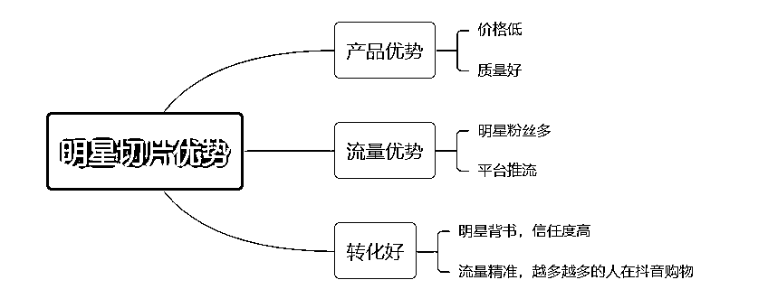

添加图片注释，不超过 140 字（可选）

### 2、自动赚钱，一个视频“吃一个月”

剪辑明星的视频做成带货视频能实现从一时赚到一直赚。

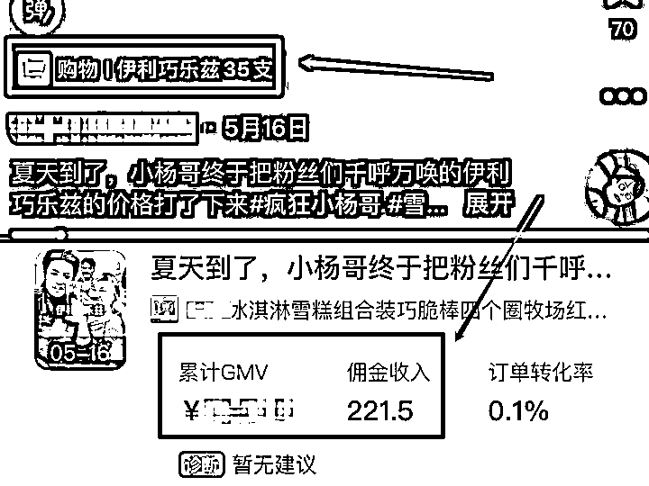

添加图片注释，不超过 140 字（可选）

大家我看5月16日发的雪糕，到6月13日，一天还能有两百多的佣金收入。

就是剪辑明星的视频素材，它每天能自动帮我赚钱，你剪辑好的视频，它会每天自动去找喜欢浏览雪糕的用户，然后你就能赚到佣金。

### 3、这么好的项目为什么推荐给你？

咱们文章都看到这里了，说明大家对剪辑手是很感兴趣的，但是我想让大家“放心”的去做项目，再给大家啰嗦两点。

a、给你推荐这个项目，是因为我能赚钱，咱们是利益捆绑的关系。

你通过我这边拿到授权，卖出去的每一个产品，我都可以拿到5~10%的后返。

比如一个产品100元，佣金比例40%，你卖出去了，可以拿到40元，商家会给我5元。

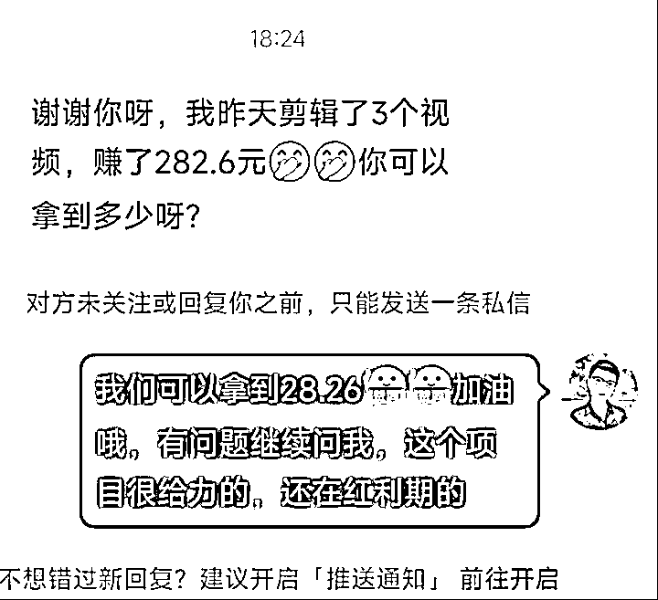

添加图片注释，不超过 140 字（可选）

如果你卖不出去产品，我也一样不赚钱。

b、这么好的项目，我有带着我的亲戚家人去做吗？

说实话，没有！

因为没有满足条件的，做剪辑手，需要有执行力，对赚钱有欲望。

即使每天上班很忙，也要回家剪视频，而我的家人朋友，没有满足这一点的。

万一给他一个授权，他不去做，那我该怎么去说呢？

* * *

### 这件事情，不可能一直有，你能看到我这篇文章，说明这是老天爷要让你赚钱了。