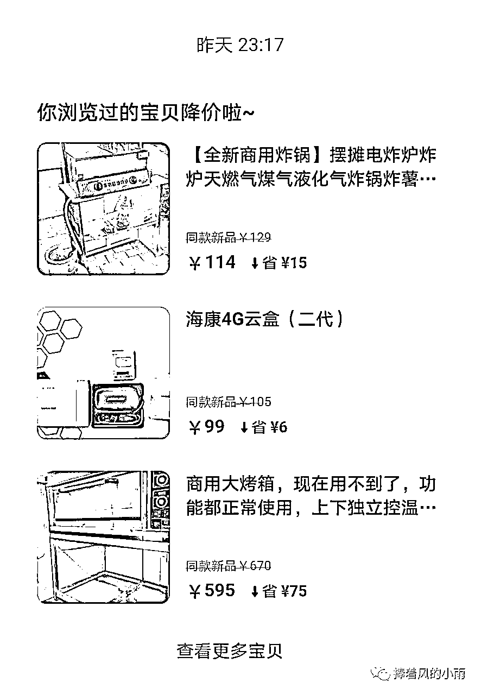

# 闲鱼卖货完整保姆级实操流程

> 来源：[https://d8ez8yi1x2.feishu.cn/docx/AtH6dAMCzoC4ZHxJZQEcjxWEnsg](https://d8ez8yi1x2.feishu.cn/docx/AtH6dAMCzoC4ZHxJZQEcjxWEnsg)

作者：小雨

大家好，我叫冯蕊，大家可以叫我小雨。一位20岁的宝妈一枚～通过互联网接触到闲鱼无货源卖货这个副业。之前虽然踩过几次坑，也被割过几次韭菜，前前后后做过十几个副业项目

但还好后来还是找到了一个能长期做下去的副业。对于我这么一个宝妈来说，有一个能长期做下去的副业真的很不错，所以也一直努力的做下去。从一开始的新手小白什么都不懂，到后来做到团队指导老师。最开始的时候卖出第一单是一个全身镜，利润23块钱，当时开心极了，我连着上了好几种全身镜的款式

慢慢的开始上架一些几百元的产品，低价和高价的都同时上，到后来发现两种都能出单。我又尝试着上了几款利润大的单子，没想到持续出了好几单，这给我了大大的信心，在五天把50个货全部上满了。后来又用家人的号注册，一共开了三个闲鱼店铺。现在做起来比之前轻松多了，总结下来就是坚持和积累

这是我卖货的其中两个闲鱼账号

首先说一个经常有伙伴问我的问题：闲鱼不是二手市场吗？去闲鱼买东西的顾客都是想低价买的，全新的东西挂上去卖会不会不占优势

先上图

这些是团队伙伴的晒单，刚刚写文章的时候去保存了一部分。接着来说，闲鱼可不可以做高利润产品？用事实来说话：我们的高价产品利润率基本都是在20%～30%之间，有少数产品利润率可以突破50%，去年团队有个伙伴走过一个目前闲鱼最大的订单是80万+，虽然利润率只有10%，但是证明了闲鱼是可以做高客单价产品的

再来做一个高价低价产品对比：闲鱼基本上有两个极端，第一种就是低价产品，订单多利润少，跑单量的模式。单量效果会很好，但是利润空间小，花费时间较多； 第二种就是客单价高利润也高的产品，单量相对于客单价低的产品来说，单量没有那么多，不过利润相当可观，一个高利润的订单可以比得上十几个甚至几十个客单价低的订单，所以花费时间相对较少

实际上低客单价的产品我们也测试过，测试结果可想而知，没有高利润产品效果好。前期我们测试一些实用的产品，例如一些挂钩、收纳箱、调料盒……基本都是9.9元，或者几十块钱的产品。产品的销量不错，有时候一天可以出近200单，一单利润5块钱，从早到晚不停发货，一天下来挣个千把块就到头了。经过几轮测试下来就把这种玩法淘汰了。总结是：不做客单价低的产品，实际上这种低价产品出单容易的想法是一个误区，客单价低的产品利润低，而且累人。

经过低价产品测试后，我们又开始在高价产品领域中摸索，反复测试后取得了很好的反馈，并且专门成立了一个高级群，定期为整个团队选高利润产品，一般3～7天内开始出单，少部分学员通过团队选品单店收益可以破万甚至3万，新人进群可以直接操作团队选品，这也就成了团队的一个特色服务

废话不多说，我接下来开始讲如何通过闲鱼赚钱，下面是文章目录，大家可以找自己感兴趣的去看，我不敢说这篇文章是最详细的，但是我想说是对得起看我文章花费的时间

# A：闲鱼平台的优势是什么？

#### 1、投资门槛低

不用囤货一件代发，一部智能手机就可以操作，而且不用发朋友圈利用平台流量就可以卖货，不用任何付费推广，都是自然搜索流量；

#### 2、不需要保证金

也不用像开淘宝或者拼多多店铺那样缴纳保证金，支付宝或者淘宝号登录即可线上开店，随时随地操作店铺

#### 3、闲鱼流量公平

都是免费的流量。不需要再花钱买流量

#### 4、闲鱼流量巨大

闲鱼是目前二手市场（但是闲鱼可以做全新产品）流量第一的App，实际上在整个中国电商平台也是排名第六，月活跃数量超过4800万，仅次于天猫活跃用户

实际上闲鱼的注册用户已经超过3.5亿人，而且数据还在持续增长中，尽管到2022年依旧存在流量红利并且可能会持续很长时间，毕竟疫情影响大家对于二手需求持续增长。

# B：闲鱼开店的要求是什么？

#### 1、一部智能手机

#### 2、一个正常使用的淘宝账号或者支付宝账号 3、一个正常使用的拼多多账号

#### 4、一个呆萌价APP（应用市场搜索呆萌价、邀请码：21EL9V）呆萌价是一款返利软件，你自己去买东西或者卖出东西通过呆萌价到拼多多或者淘宝下单，你就会有佣金，具体呆萌价的使用方式下载好以后，里面有一个商学院。有使用教程

#### 这些东西准备好了之后可以按照我接下来的流程自己去操作了

# C：闲鱼赚钱原理

实际上任何赚钱的本质都是卖产品赚差价，闲鱼也不例外，我们通过特殊的技巧和方法去淘宝或者多多拿货上架到闲鱼去卖，闲鱼出单之后我们通过呆萌价下单填写客户的收货地址赚取其中的差价和佣金。那么什么是差价和佣金，看下图例子。

#### 1.差价

差价简单来说就是比如我卖的一款产品乒乓球桌，我是去多多拿货的，进货价是437元，但是闲鱼卖的价格是760元，差价就是323元

闲鱼订单价格是760元看下图多多拿货价437元，看下图

这个产品一共的利润就是差价+佣金也就是323+32=355元

#### 2.客户为啥不直接去拼多多买而去闲鱼买呢

这个问题就像如果你习惯去京东买东西你大概率不会去淘宝买东西，每个平台或者每个商场都有他固定的消费群体，这就是为啥你会发现商场有很多不同类型的，因为人的需求和偏好是不同的，我们不可能赚所有人的钱，我们只要服务好一部分人就可以活得很好

# D：闲鱼卖货注意事项有哪些？

#### 1、违禁类目

总结来说有几个大类，虚拟类（包括课程服务等）、医疗类（口罩医疗设备等）、食品类（入口的东西都不建议卖）、成人用品类、军工类、高仿和大牌子类（容易售假违规），其他可以参考下图

强调一句话：很多人问我我看别人在卖虚拟类或者其他啥产品没事，我一句话回复：这世界上不是所有的坏人都会被抓走。

#### 2、串号问题

一个闲鱼店铺对应一个设备（手机），对应一个网络（尽量用自己流量，不要链接任何无线网）不同的闲鱼账号不要在同一个无线网下面登录，也不要不同的闲鱼店铺来回在同一个设备上面切换登录，否则你的曝光会非常低，这个已经被验证过无数次

不过这种情况可以解决，有这种问题的小伙伴可以留言我提供解决方式

#### 3.不要开通鱼小铺

为什么很多闲鱼培训团队都说要开通鱼小铺，而我说鱼小铺是个坑？不能凭空出来一个新玩法就去说它适合所有人，鱼小铺的确不适合新手小白。但鱼小铺也有优势，先来看看它的优势吧

1.开通后我们发布产品的数量由原来的50个，增长到了500个，这对于一些需求大的买家还是优势多的

2.可以设置多库存宝贝，这点对于我来说没用

3.可以设置宝贝分组，可以把卖的产品分个类，户外的，商用的，农用的都去分组，这样分组的好处就是在主页买你的产品时，可以根据分组方便找你的产品

4.可以设置宝贝专题，有些卖得好的产品，爆款产品可以设置一下

5.可以设置粉丝价、粉丝抽奖、粉丝管理，这也是增加新顾客和粉丝，稳住老顾客的一个方法

一听觉得可好，那为什么不适合新手小白开通？开通后有弊端

❶开通后流量会降低，闲鱼平台并不是你上的货越多给的流量就越多

❷开通后只能做垂直类目，百货类目的曝光和浏览会降低

#### 4.不要重复铺货

很多新手小白在闲鱼卖出第一单后，尝到了甜头，就妄想一直上架同一个产品能一直出单。例如卖出了一单桌子，就50个产品全部上架桌子了。这个情况前两天我遇到一个伙伴就是这样

他的店铺一共40个产品，三十多个都是电脑椅。这样就会导致店铺不出单还限流，这个不管你在哪个平台都一样。就像你在抖音发一条视频有几万个赞，那你可以发和那条视频相关的三四条视频。但你要是几十条视频都发一样的类型，肯定就没效果了。闲鱼也是这个道理，所以不要去重复铺货，没效果还会把你的店铺限流，就算你想把爆款产品多发几个，也要注意好差异化

#### 5.对不出单的产品进行降价

这才是最致命的！你的产品上架了没几天看着不出单，就想着是不是卖贵了。然后毫不犹豫的点进去降价

一开始红色字体的一口价可能是500，第一次降了20，看着曝光还是一样的。又去再次降价个10块钱，最后降价个四五次。你这产品也被搞废了。一定要记住，上架好产品以后，不要去修改一口价。没出单的情况(如果是一口价写错了或者其他必要必要原因)，那可以去修改一次，但是不能重复接连不断的去修改。这样子就会导致产品限流

也不要点编辑进去提高一口价，跟你降低价格是一样的

#### 6、闲鱼常见骗局

任何闲鱼上让你扫码的都是骗子 任何说支付宝没钱让你加微信的大概率也是骗子 任何给你发广告让你去点赞或者其他行为的都是骗子 任何给你说要采集你店铺去拼多多卖货的都是骗子

类似这样的扫码的都是骗子，切记不要扫码否则你闲鱼账号直接封号有可能资金有风险！

还有一些来询价，然后下单，下单后他说支付不了让你点开链接。有一种让你交保证金，闲鱼平台的保证金只是500元，并且是自愿交的。一般都不用交，有人来找你让你交保证金的都是骗子

# E：闲鱼卖货7个要素

可以点开思维导图一起看

地址：https://mubucm.com/doc/28g37fVOab

## 1.选品如何找货源（不要做低价产品）

a、实际上我们卖货的第一个遇到的问题就是如何找货源，卖什么产品，很多市面上大部分的方法都是让找低价产品比如9.9的或者几十块的容易出单，实际上这是一个误区甚至会让你以后发现你只能卖的动低价产品，上架高价产品没有反应，这是因为你前期上架的低价产品平台给你打了一个低价标签，所以只有那些喜欢低价产品的人才能搜索到你的店铺，那些高价客户搜索不到你，所以我在这里首先说明一点就是切记不要做低价产品，利润低而且累人

b 、那我们如何寻找高客单价产品，实际上有两个方式，一个是免费方式，另外一个是付费方式。因为付费大部分人可能达不到这个门槛，那我今天就讲一下免费方式，简单的免费办法就是打开比如拼多多软件，看分类，如图

根据多多分类去找各种产品，那么我们如何确定这个产品可以卖还是不可以卖呢？

第一，不要做大牌子东西，利润太低

第二，去闲鱼搜索对应产品词看看同行销量如何？一个销量都没有的不做。

第三，销量特别好的如果想做可以做好差异化，如果销量处于中档水平，比如我想要都是几百的那种，这个可以直接入局去做。

第四，不要被价格迷惑，不要认为只有你的价格有优势这个东西才能卖出去，实际上问你自己一个问题：你去买东西必然会买价格zui便宜的吗？你就会明白价格不是决定因素

付费选品可以参考一些数据网站比如生意参谋，飞瓜数据，电霸等，当然我这边也有提供选品的服务，可以找我免费送你一份

## 2、 标题（影响曝光）

有些小白可能标题是啥都不知道，那我截图红色圆圈中那些就属于标题，标题空行下面属于文案，标准的标题是包括60个字符也就是30个汉字，但是实际上闲鱼相对来说不是那么严格

标题如何如何去写？

实际上我们大部分都是参考同行标题去做，闲鱼同行或者多多淘宝同行标题，我们参考多多标题几个原则

a 不要选择销量zui高的标题，也不要选择销量低于100的标题

b 选择的标题必须和你的产品是符合的，也就是属性符合

c 标题中一般不建议带大品牌，当然有时候带上品牌有好处，但是也会有风险

## 3、发布地址（影响曝光）

发布地址几个原则

a 不要发布到小城市，尽量发布到一二线城市，这样曝光会高

b 发布地址尽量不重复，发一个或者2个产品就换个地址

c 发布地址可以参考百度指数等网站

## 4、图片标签（影响曝光）

什么是图片标签，有些小白可能还不懂，看下图，红色圈住的里面字比如：钓鱼船加厚充气船，这就是标签，标签词实际是对应产品的核心搜索词或者叫做产品长尾词，是对标题的补充，会影响产品的曝光，所以也要重视，标签也可以添加一些款式尺寸价格的描述

圈出来的这些长尾词就是标签

## 5 、文案（影响转化）

文案其实包括几个点，产品的售出原因，产品的卖点，产品的规格尺寸，以及服务售后等注意事项

这上图是我写的一个文案模板，仅供参考，这个产品曾经是我的一个小爆款，累积卖出去几百个。

## 6 、图片（影响转化）

图片从买家秀中寻找图片，切记不要用商家图，不要用商家图，有很多博主是让大家直接用商家图，实际闲鱼是二手平台，客户群体还是想要看真实的实拍图，所以尽量用实拍图几个原则：

清晰的实拍图

产品整体图和局部细节图

尽量是正方形或者3:4的比例

图片尽量9张用完

## 7、价格（影响转化）

如何定价也是一个小白比较头疼的问题，定价有几个原则

zui低价格的产品做好低价引流，可以少赚差价比如百分之10的差价和佣金

低价引流不要过分比如你一共四个价位，低价引流是99，第二个低的价格不要超过200

其他产品直接在货源的价格上加百分之30的利润

价格设置以比如99,199或者128等数字结尾，这是消费心理学决定的

# F：闲鱼到底用不用养号呢？

实际上养号就是个伪命题，理论上闲鱼不用养号，如果说非有养号的步骤的话建议每天一键擦亮曝光，还有就是首页左上角有个签到每天签到并且捞鱼兑换金币，偶尔逛逛闲鱼就行！

如果想要账号权重高的话必然要提高店铺转化率，就是来咨询你的客户尽量都让他下单转化！

# G：闲鱼如何上架产品？

看玩闲鱼7个要素后，那闲鱼怎么开始上架产品，打开闲鱼app点击中间卖闲置按钮----发闲置---选择你提前保存好的图片--复制粘贴你写好的文案---选择发布地址--选择对应属性--填写价格---右上角发布就行，看图

# H：怎么提高闲鱼客服效率？

#### 1、客服基础准备

要利用好闲鱼的自动回复功能设置，这样可以zui大可能性的留住客户，看下图，闲鱼右下角---我的--右上角设置--所有宝贝设置自动回复----编辑就行，看下图

客户的咨询要及时回复，既然要做这个事情，那有客户咨询的时候就立马回复，这样可以大大提高转化率，有事没事的时候看一眼闲鱼就行了

客户如果给你砍价，切记不要太干脆答应或者不要一下降价太多，可以适当降一点并且换一些东西，比如收藏宝贝关注店铺或者后期好评等去交换。

#### 2、 客服聊天的违禁词

在和顾客聊天过程中需要注意别发的词 微信（V,VX,WX），加我，+我，q，链接，二维码，手机号，帖子，头像，互想要，互赞，互粉，jianzhi，赚钱，这个严重会封号，会封号，所有这些类似的不要发！

阿里外的购物平台，唯品会，拼多多，网易考拉，国美，京东，58同城，转转，苏宁易购。

还有不要说脏话，否则也会违规！

#### 3 、打造私域流量

如果后期你闲鱼店铺做的是单一垂直类目，那么你可以把你的客户导入到自己的微信，后期打造微信朋友圈做成持续复购，这样的话就是真正的持续收益。

#### 4 、远离麻烦精

如果你和一个客户聊天的过程一开始就是不顺利的，感觉这个客户一直在挑刺，那么我建议你放弃这个客户，因为一般售前比较麻烦的人大概率会发生售后，这样的人就是事儿逼，无论在哪个阶段这样的人都会大大浪费你的精力，得不偿失，所以我们能做的就是不和这样的人产生任何交集！

#### 5 、关于售后问题

很多小白总是害怕卖货过程中遇到售后，这个是大可不必的，因为实际上我们做一件代发的发生售后其实很少的，就算有售后我们也可以赚运费险钱，所以这个事情基本上不存在亏本的可能性，看图

如果真的遇到一些比较难缠的客户也有办法可以解决，这个情况基本比你买彩票中大奖很要低，遇到了解决不了可以来找我哈。

# I：闲鱼如何快速破蛋出单？

#### 1 、上架产品

新人前期一周之前不要考虑曝光高低也不要考虑是不是出单的问题，快速的按照正确方法上满50个产品，这个是zui基本的，因为做闲鱼就像你开一家超市一样，你首先要进货把产品放到你的超市里面，如果你超市里面啥东西都没有自然不会吸引人进来买东西，更不要提出单，反正我们这边测试的上百个店铺基本按照这个思路绝大多数店铺会在一周内出单，有少数店铺10天以上出单！

#### 2.优化产品

其实做事情做久了你会发现只要方法 正确，能把一件事情做好的就只剩下执行力，我经常说互联网上：执行力就是财富！那些闲鱼做的好的店铺都是执行力非常好的人，基本每天上新，经常优化图片话术，每天把曝光低，流量低的删除，换新的产品重新上，不停的循环这个步骤，你就能淘汰掉绝大部分的人，所谓的“剩者为王”就是这个道理！

#### 3 .心态调整

用我经常给我徒弟们说的一段话：控制你能控制的事情（比如上架产品和学习），控制不了的事情（比如订单和曝光）交给上帝吧。

# J：结尾

这篇关于闲鱼卖货怎么赚钱的文章到此就基本结束了，也基本整体把整个闲鱼的流程讲了一遍 但是任何事情想要做好都是需要付出努力的，不要受到那些做不好事情的人的影响

你要记住有的人做啥事情都做不成，有的人做啥事情都大概率可以做成，一件事情和你会做一件事情中间有很长的路要走

我自己全职做了四年，中途坚持不下来，放弃过，后来又重拾闲鱼继续做。如果坚持不下来，那肯定没有现在的成就。