# 【AI美图爆文】日入5k+全流程拆解

> 来源：[https://uibsm1uo6r.feishu.cn/docx/D219dFMmTojc4zxLkOkcPl0EnNd](https://uibsm1uo6r.feishu.cn/docx/D219dFMmTojc4zxLkOkcPl0EnNd)

【AI美图爆文】

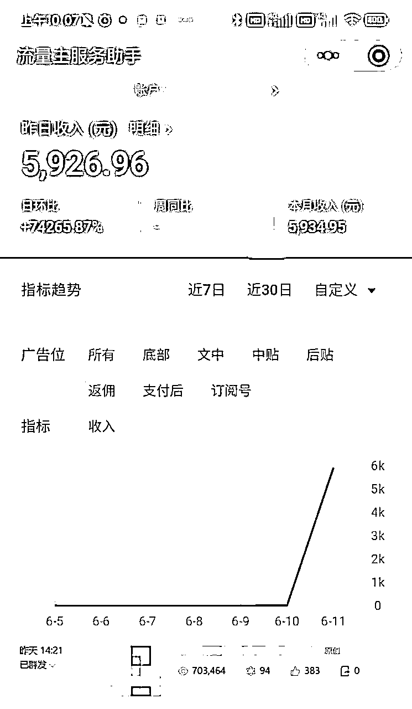

以上就是我做AI美图爆文的最高日收入！

通过以下的AI组合完成：chatGPT+stable diffusion/midjourney

# ChatGPT如何做？

## 首先需要有一个chatGPT账号，如果木有可以购买一个！

（PS：如果实在搞不定，国产的文心一言、讯飞星火也可以代替）

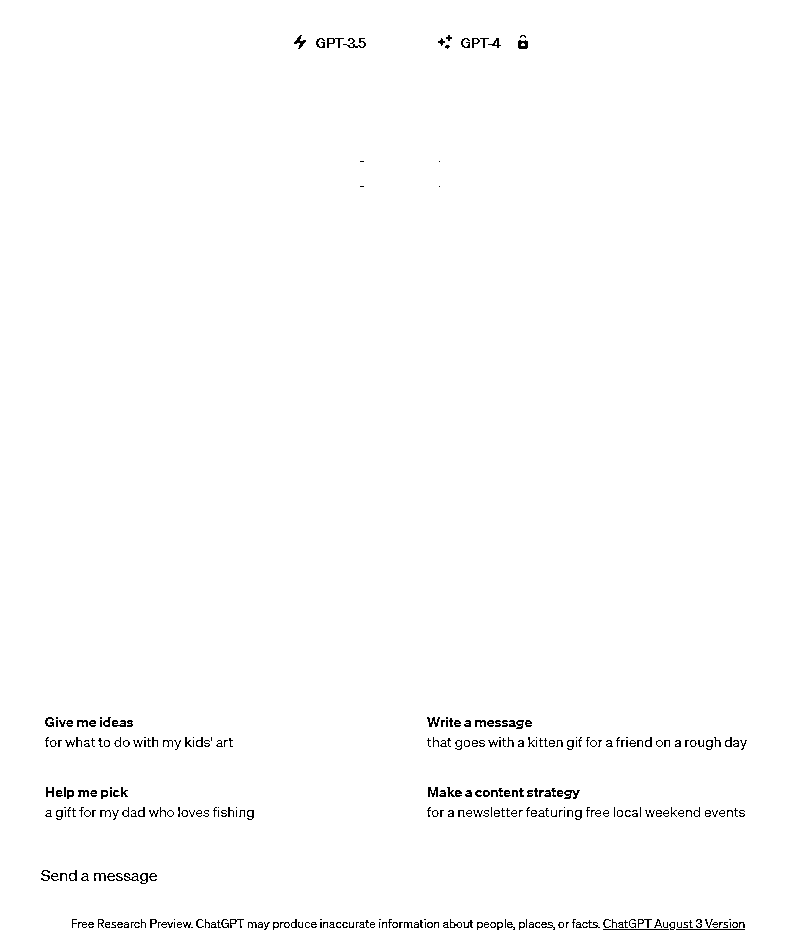

## 选择chatGPT3.5输入提示词就可以了！

（PS：提示词如下：写一个1000字的故事，故事要有悬念，让人有强烈的读下去的欲望.

要求如下：

1.采用线性叙述的方式，以时间顺序为主线。

2.带有一定的现实主义倾向，语言平实、生动，易于引起读者的共鸣。

3.让人觉得就是真实发生的事情，要让人非常感兴趣的，有强烈读下去欲望，情节要曲折，要达到”开屏雷击“效果，要贴近生活，都是和普通人生活相关的事情，家长里短、婆媳之间、家庭伦理等等。

4.用20%篇幅介绍人物描写事件开端，30%篇幅内容要引出悬念，30%篇幅描写高潮部分，最后只用20%的篇幅写出故事的转折和结局please Let's think step by step）

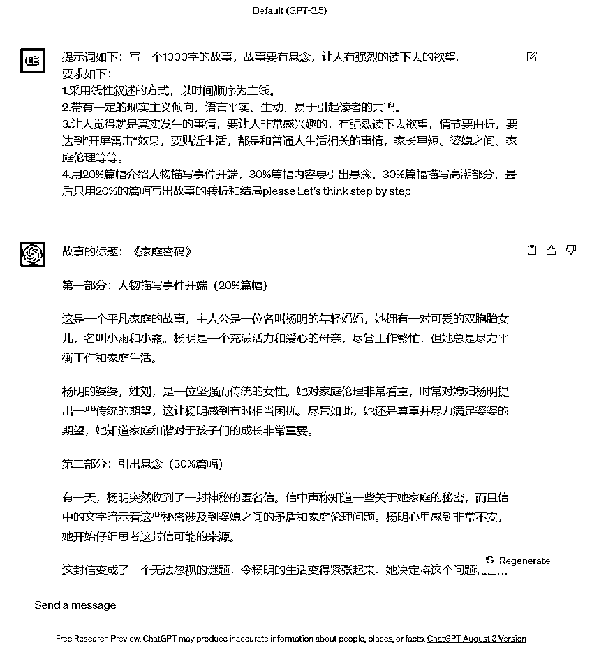

## 修改这篇chatGPT写的文章通顺即可！

（PS：记得一定要读一遍修改一下，因为AI写的文章容易词不达意）

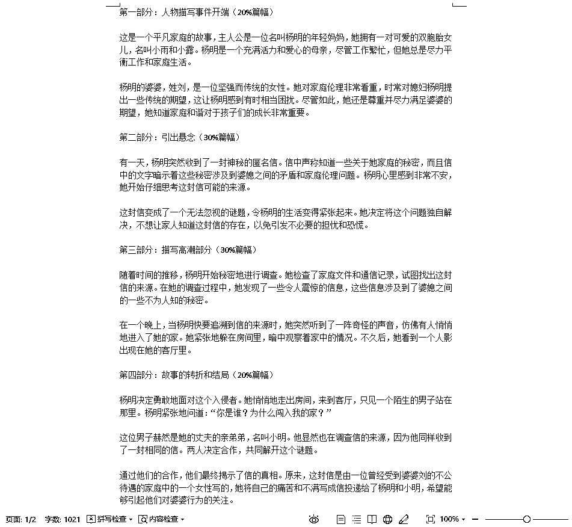

（以上就是关于chatGPT如何出文章的基础方式，新手可以直接照搬，老手可以在此基础上改进）

# stable diffusion如何做？

## 如果你电脑配置是3060（8G）以上的显卡，你可以考虑用SD出图！

（PS：因为SD是本地部署的，免费开源，而且开源自己训练模型更方便）

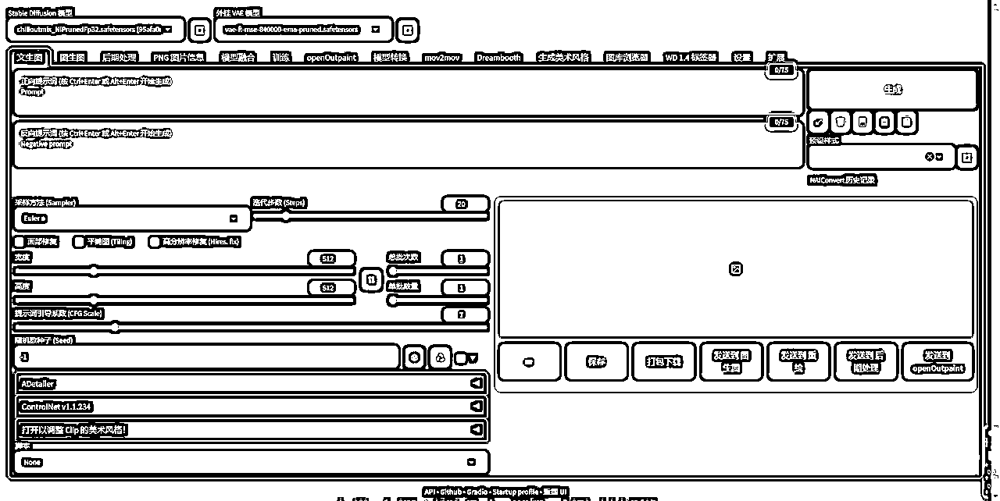

## 美女图的正面和负面关键词，以及各种参数已经设置好了，lora可以靠自己加入即可！

（PS：正面提示词：Best quality, ultra high definition, masterpiece, ultimate details, 8K, 1Girl, delicate facial features, delicate eyes and mouth, delicate facial features, long hair, black hair, fair skin, big eyes, Rich Colors, Cute, good-looking, cute and cute, (Short skirt1.2), (Shawl shirt1.2), (Exquisite clothing1.2), Half-body, long_legs, cute, beautiful, sexy, Huge breasts, (Wearing silk stockings1.2), (outdoor1.2)

负面提示词：Negative prompt: (worst quality:2), (low quality:2), (normal quality:2), lowres, ((monochrome)), ((grayscale)), bad anatomy,DeepNegative, skin spots, acnes, skin blemishes,(fat:1.2),facing away, looking away,tilted head, lowres,bad anatomy,bad hands, missing fingers,extra digit, fewer digits,bad feet,poorly drawn hands,poorly drawn face,mutation,deformed,extra fingers,extra limbs,extra arms,extra legs,malformed limbs,fused fingers,too many fingers,long neck,cross-eyed,mutated hands,polar lowres,bad body,bad proportions,gross proportions,missing arms,missing legs,extra digit, extra arms, extra leg, extra foot,teethcroppe,signature, watermark, username,blurry,cropped,jpeg artifacts,text,error

步数Steps: 25

采样方式Sampler: DPM++ SDE Karras

提示词相关性CFG scale: 8

随机种子Seed: 2355597336

宽高比Size: 512x768

大模型Model: chilloutmix_NiPrunedFp32）

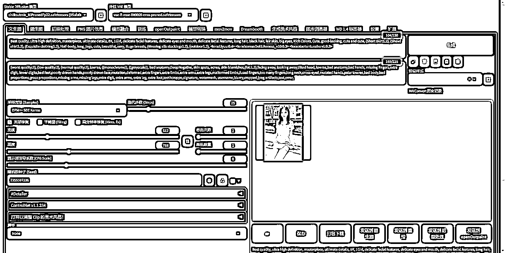

## 成品如下图，主要是做美女好看的图片为主，帅哥的也行如果你有一定基础的话！

（PS：虽然男性粉丝的价值不高，但是我们主要依靠阅读量去进行流量主的变现）

（以上就是关于stable diffusion如何出美图的基础方式，新手可以直接照搬，老手可以在此基础上改进）

# midjourney如何做？

## 如果你电脑配置不支持你SD出图的话，那么MJ也是可以考虑的！

（PS：我的建议是购买20-30元的共享账号，这样是对于小白来说最划算的）

## 美女图的关键词，以及各种参数已经设置好了，自己适当修改即可！

（PS：提示词：an advertisement for an ancient chinese shou game, in the style of romantic use of light, photo-realistic hyperbole, god rays, atey ghailan, yellow and beige, beautiful women, fujifilm eterna 500t --ar 9:16 --s 750 --v 5.2）

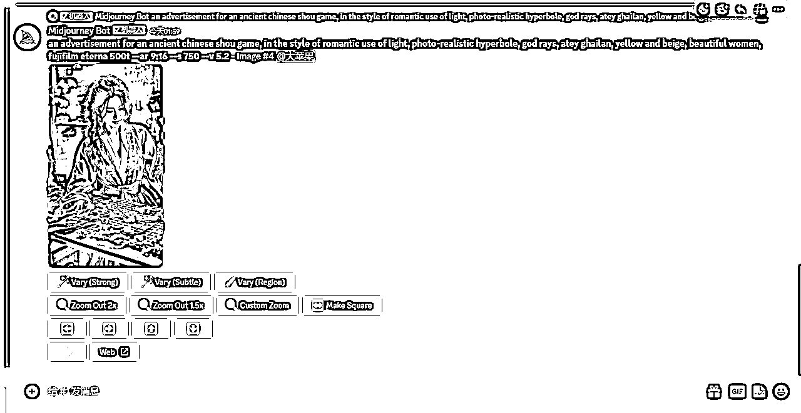

## 成品如下图，根据这样的思路和方式制作好看的美女图片，当然也不局限于美女！

（PS：MJ更适合做一些特别美，特别有创意的图，也是很适合做公众号流量主变现的）

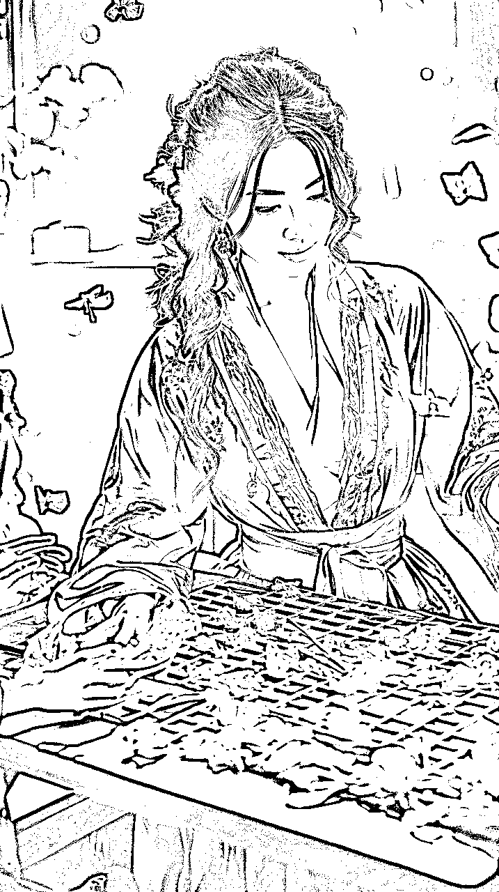

（以上就是关于midjourney如何出美图的基础方式，新手可以直接照搬，老手可以在此基础上改进）

# 公众号如何发？

## 关于公众号文章发布设置！

（PS：如果自己有想法，也可以按照自己的方法来，都是没问题的）

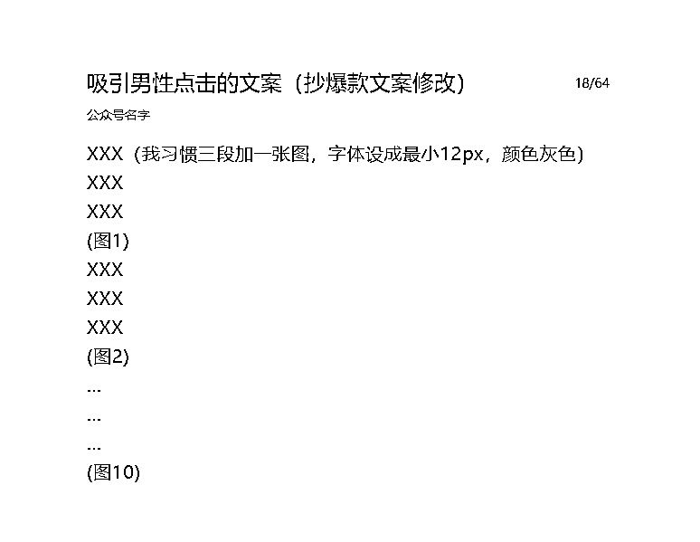

## 关于原创声明！

（PS：这个建议点上，可以提高收入，而且本身就是AI原创的）

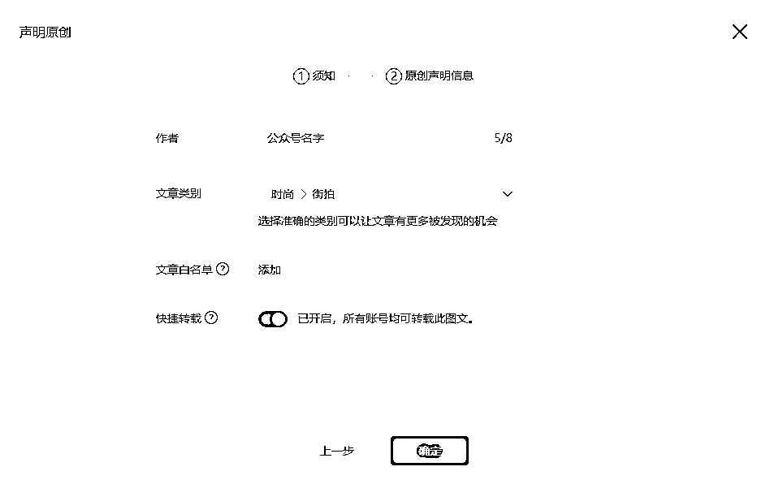

## 关于在文中广告智能植入！

（PS：这个也建议点上，然后差不多1000字左右，可以插入2条广告）

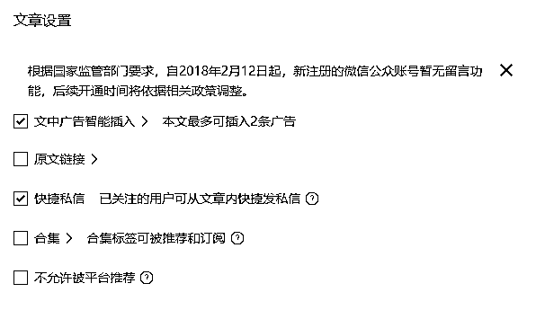

（以上就是关于公众号如何发布文章的基础方式，新手可以直接照搬，老手可以在此基础上改进）

# 项目核心是什么？

简单来说，其实公众号的核心就是标题+首图，只要你搞定了这个，你无论做什么都是可以成功的，赛道的确很重要，因为他决定了你的上限，而你写的标题和选的首图，决定了你文章的下限，这才是项目的核心中的核心！

如果想了解更多Ai项目，直接关注我的公众号【小梦Ai玩家】~

公众号回复“3”即可，找到本人微信，链接本人探索更多可能性！