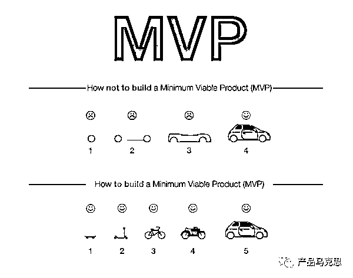

# 以AI产品为例，一文讲透产品MVP规划方法论

> 来源：[https://bqmg6drbq77.feishu.cn/docx/Ifafdu8awoS9YXxRh4ScjTw2nHc](https://bqmg6drbq77.feishu.cn/docx/Ifafdu8awoS9YXxRh4ScjTw2nHc)

生财的小伙伴们，大家好。

今年4月份加入生财大家庭后，看生财的帖子， 和圈友交流，给了我很多的触动。

对我而言，最大的触动就是圈友不论是大神，还是小白，都非常愿意真诚地分享自己的认知、知识、能力和技能。

我在生财里面学习到了很多，也一直在思考。

如何把自己的认知、知识、能力和技能反哺给圈友们。

结合一些机缘巧合，这才有了这篇文章分享。

为了文章看起来不那么艰涩难懂，我用当下比较火的AI产品方向为例，希望通过这篇文章能够让大家更清晰地明白MVP如何规划，如何思考。

为什么选择产品MVP这个话题呢？

因为，加入生财后，发现大家做的很多项目都是从0到1跑通验证，也有很多圈友在讲MVP的概念。

但是，对MVP的理解和应用，可能存在一定的误解或者是片面。

所以，结合自己做互联网产品MVP多年的经验，希望能给大家带来一些思考。

让大家更好的利用MVP这个方法，跑通从0到1，赚到想赚的钱。

# MVP的使命是什么？

什么是MVP？

MVP的英文 Minimum Viable Product，翻译过来就是最小可行产品。

如何理解？

从字面上理解，在产品前面有两个关键词，一个是最小，另外一个是可行。

最小，意味着最低投入或者最低限度。

可行，意味着可以使用或者可以验证。

所以，产品的MVP就是最低投入、最低限度可以使用或者验证的产品。

MVP的概念哪里来的？

最初，由埃里克·莱斯在《精益创业：新创企业的成长思维》中提到的。

他提出这个概念希望解决什么问题？

我们举个例子。

如果你想建造一辆汽车卖出去，这个时候该如何建造。

我相信，有的人会觉得这个问题很简单。

首先建造四个轮子，第二建造车的底架和底盘，第三建造车的车身和车架，最后组装成一辆汽车。

的确，上面四个步骤能够按部就班的建造成一辆汽车。

但是，建造过程中一直忽略了一个问题？

这样建造好的汽车会有人买吗？

如果，造出来的汽车没有人买，那所有的投入都白瞎了，过程中也无法及时止损。

当然，站在今天的人的视角觉得肯定会有人买啊。

如果，我们站在汽车诞生之前去思考这个问题，那么答案并没有像今天这样显而易见。

所以，在汽车诞生之前，如果你想造出一辆汽车，同时考虑发现问题后及时调整或停止，防止自己一条路走到黑。

抱着这样的思路，该如何建造出一辆汽车来呢。

首先，建造汽车的目的是为了让人们更快的行动和出行。

所以，先低成本制造一个滑板，因为滑板也能解决人们更快地行动和出行的问题。

推出滑板之后，看下人们的反应，是否对更快的行动和出行有明确的需求。

当然，有人会接受了滑板的方案。

同时，提了一个问题，滑板不容易操控方向，尤其是拐弯的时候很难操作。

为了解决操作难的问题，你给滑板安了一个把手，变成了滑板车。

人们可以双手随意操控方向，比滑板的方案更好了。

这时候，又有一些人提出问题，一直站着太累，能不能坐着？

滑板车还是要用脚着地，有没有其他更加便捷的方式？

你绞尽脑汁，费尽九牛二虎之力发明了自行车。

这样就可以坐着骑车了，舒服了很多。也不用脚掌着地，只需要蹬着脚踏板就行，省力。

过了一段时间，又有人觉得，骑自行车还是太费力，能不能不用自己发力。

可能，这次你翻阅古今中外宝典，最后的创造性地造出一辆摩托车。

太棒了，这样完全不用自己用力，操控也很方便。

市场引起轰动，你建造的摩托车大卖，你也成为了家喻户晓的名人。

又过了一段时间，有人给你提，摩托车好是好，但是刮风下雨的时候无法骑摩托车。

出去玩的时候，一辆摩托车都没有办法把家人一起带上。

越来越多的问题涌向你，你也敏锐地发现了，这里面有巨大的商机。

该是做一辆汽车了，能够遮风挡雨，能够带更多人一起行走和出行，发生碰撞事故的时候更安全。

这次，在你查阅无数经典著作，请教无数高人指点之后，终于在一个风雨交加的夜里，加上一点点小运气，突发灵感的你，想出了要制造汽车，你相信这样的汽车做出来后，一定会卖爆。

在这个例子中，你可以发现，其实是每一步都是有用的，有意义的。

如果其中的一步走不下去，也就也意味着后面的投入没有必要。

所以埃里克·莱斯提出MVP的概念，就是希望能够让投入变得可控。

防止最终做出来的东西没有人要，所有的投入都白瞎了，能够在过程中验证是否值得做下去。

让投入可控，及时验证，有效止损，这是MVP理念最核心的价值。

所以从MVP诞生的那一天开始，就有它自己的使命，那就是回答两个问题：

一、需求是否真实存在，用具象化的最小可行产品验证

二、解决该需求的最小可行产品客户是如何认知的，是否认同，如何迭代

这两个问题从根本上决定了产品的生死。

# 回答好决定生死的两个问题

既然能定生死，我们就要好好思考这两个问题。

MVP的规划就是设计出能回答好两个问题的产品。

第一个问题，需求是否真实存在，用具象化的最小可行产品验证。

这个是最根本性的问题。

关于需求是否真实存在，有一个类似的笑话。

一位老农接受记者采访。记者问他：“大伯，如果你有十亩地，愿意把一半献给国家吗？老农说：“愿意。”

记者又问：“大伯，如果你有两栋房子，原意把一栋献给国家吗？”老农说：“原意。”

最后，记者又问“大伯，如果你有两头牛，原意把一头牛给国家吗？”老农说：“不原意。”

记者很奇怪，问为什么，老农答：“因为我真的有两头牛啊！“

所以，你问客户，你有没有这样的需求啊？

客户说，有的。

你继续问他，你要不要买个产品满足这个需求吗？

客户说，不要。

需求单纯的问客户，很难得到真实的答案。

比较真实的答案，就是客户用钱投票。

如果客户买了你的产品或者使用了你的产品，那么大概率说明客户有你产品能满足的需求。

有时候，如果没有具象化的产品，客户可能很难理解你产品的价值。

就像早期马云创业的时候，他为了证明互联网的存在，通过拨号上网，在家里等了3个多小时，才等出来半张图片。

他用3个小时的过程和半张图片证明了互联网的存在。

如果马云只是单纯的去讲，没有具象化的东西让大家眼见为实，我相信很多人一定会觉得马云是疯了。

第二个问题，解决该需求的最小可行产品客户是如何认知的，是否认同，如何迭代。

比如说你渴了，那么你就有需要解渴的需求。

我做了一杯可乐给你。你说不要，你在控糖，担心血糖太高。

我换了一杯雪碧给你，你说不要，你在减肥，碳水不能食入太多。

知道你怎么看待前面的产品，我决定给你换成白开水。

你说白开水没有味道，喝起来不爽。

最后，我给你提供0糖0脂0卡的元气森林，你说太棒了，就是它了。

所以，做出一款叫卖的产品，从来都不是一件容易的事情。

不容易，代表着一定有大量的失败。

所以采用MVP的概念，就是为了将失败控制在有限的投入范围之内。

毕竟，企业最大的浪费，就是辛辛苦苦做了一堆没有人要的东西。

当然，要想做到这一点，首先要想清楚你的产品是什么？

# 想清楚你的产品是什么？

我们最初的问题是如何规划AI产品的MVP？

既然是AI产品，那么里面一定会涉及到AI算法模型。

为了让分析简单，我们可以将含有AI算法模型的产品都可以称为AI产品。

这时候，你可能会觉得这个问题无关重要，唯一的区别，无非是AI的应用程度不一样而已。

这个问题，就是很深刻的洞察：AI的应用程度不一样，决定了产品的本质不一样。

可以分为三类不同的AI产品。

第一类，AI算法就是产品本身。

比如妙呀相机这款产品，前段时间爆红网络。

用户通过上传20张各个角度的照片，就可以生成媲美人类摄影师拍摄的写真，而且价格很美丽。

这款产品本质上就是AI算法。

为什么？

里面也有上传照片等其他软件功能，怎么就能说这款产品本质上是AI算法呢？

我举个例子，你就明白了。

假如有十家竞争对手都要做妙呀相机，你是他们争抢的用户。

你最终选择他们其中的某一款，是因为操作方式是上传照片，还是上传视频，还是现场录制一段视频？

你只会选择生成出来的写真跟你很像，效果很美很帅，能够发朋友圈、小红书秀一波的。

按照你的标准，AI算法的好坏是评价标准，所以这个产品的本质就是AI算法。

这种对产品的认知，需要切换到用户视角去看，而不是站在产品设计者的视角。

虽然，有些产品对外宣传和竞争对手有这种、那种差异，但是在用户视角里面，可能差异根本不重要。

这是第一类的产品，AI算法就是产品本身。

第二类，AI算法是产品主业务流程重要的一个环节。

比如滴滴打车App，你是一名乘客，首先你打开App，输入好出发点和目的地。

点击叫车，等待平台给你匹配汽车。AI算法实现智能派单，目的让你更少的等待，更好的打车体验。

叫到车以后，坐车到目的地，最后结算金额和双方互评。

整个过程是滴滴打车App的主要业务流程，AI智能派单就是主要业务流程重要的一个环节。

缺少这个环节，主要业务流程就无法正常运行。

这是第二类产品，AI算法是产品主业务流程重要的一个环节。

第三类，AI算法不是产品闭环的一部分，只是提升体验或者效率。

比如输入法，原来的输入法只能通过拼音或者五笔进行打字输入。

现在的输入法，都会带有AI语音转文字的功能。

AI语音转文字只是提升打字的效率，或者提升体验，不用打字，通过语音就能转成文字。

这是第三类产品，AI算法不是产品闭环的一部分，只是提升体验或者效率。

通过将AI产品分为这三类，让我们更好地理解产品本质上是什么？

只有这样，我们可以更好地思考如何规划产品的MVP。

# 如何规划AI产品的MVP？

针对第一类产品，AI算法就是产品本身。

这种产品的MVP应该考虑的算法本身在场景下的可实现性和效果，MVP版本就应该包含算法。

MVP版本就看这种场景下，目标客户的对产品的接受程度和体验预期。

比如说妙鸭相机的MVP版本，用户可以上传不同的照片，实现写真。

可能写真的风格数量有限，不是很丰富，但是必须是通过AI算法实现不同风格的写真。

又比如会议AI语音转写产品，开会的时候将参会人员的发言实时记录下来并转写成文字。

做这样的产品，MVP就需要带有够实现AI语音转写功能模块。

只有这样才能达到回答MVP两个重要问题的效果。

实际会议场景下，存在多个人发言，存在不同人普通话标准程度不一样的问题，存在环境噪音干扰问题，存在说话交叉和打断的问题。

这些问题，只有含AI语音算法的MVP才能验证测试。

针对第二类产品，AI算法是产品主业务流程重要的一个环节，比如滴滴打车App。

是不是MVP版本一定要包含算法？

这种要分情况对待。

早期的滴滴打车App，MVP版本根本不用考虑AI算法。

即使，使用人工调度，实现乘客和司机的匹配也可以。

因为，他们的MVP回答的是整个模式的问题：

App打车的需求是否存在。App打车的方案，乘客会不会接受，司机会不会接受，他们如何看到这种方式。

不是，司机和乘客匹配快不快，准不准、体验好不好等算法相关的问题。

我相信，早期滴滴创始人程维用不到10万开发的滴滴打车App，实现乘客和司机匹配的不可能是AI算法，只能是逻辑规则。

因为，AI算法的不是10万块能够解决的。

还有一种情况，比如微信的视频号产品。

用户在视频号上通过上滑下滑观看短视频，可以点赞，评论分享。

平台通过AI算法匹配用户和内容，形成用户上滑下滑观看的视频列表。

所以视频号产品属于第二类，AI算法是产品主业务流程重要的一个环节。

视频号MVP是不是也可以像滴滴打车App一样，MVP版本不用考虑AI算法呢，用简单的逻辑规则就行？

其实两个还真不太一样。

滴滴打车App之前，没有类似的产品。

视频号之前，已经有抖音、快手等产品。

本质上，视频号和抖音、快手的产品是一样的，差别在于各自的用户群体和商业定位上。

所以视频号的MVP版本，需要考虑AI算法。

视频号MVP版本，需要验证的两个问题。

1、用户有没有需求

用户有没有需求，这个几乎不用验证。

抖音和快手的成功，已经说明了强烈的需求存在。

何况，微信是国民级应用，有着全中国最全年龄段的用户群体。

需求的强烈程度肯定是毋庸置疑的。

2、用户对视频号最小可行产品如何看待和迭代。

抛开视频内容质量和数量之外，视频号在用户视角需要回答的问题：

能不能推荐用户喜爱的视频和对用户有价值的视频？

那就考虑视频号AI算法做得怎么样了。

所以视频号MVP版本，一定含有AI算法。

实际上，视频号上线初始，我就体验了。

前期，视频号AI算法做得很差，匹配非常糟糕，要么内容重复推荐；要么推得视频推荐的大部分都我不喜欢看。

现在，视频号AI算法做得就很好了。既能满足刷到爱看的视频，也能避免信息茧房，给带来新的信息增量。

如果你经常刷视频号，就能发现AI算法从最开始到现在一直在迭代优化。

针对第三类产品，AI算法不是产品闭环的一部分，只是提升体验或者效率。

产品MVP根本不用考虑AI算法。

因为MVP要验证的两个问题：

1、客户是否有需求

2、客户如何看待最小可行产品，如何迭代

这两个问题和产品模块中提升体验和效率的AI算法没有太大关系。

只需要规划最核心的产品业务模块就行。

就像上面我们举过的例子。

做一款带AI语音转文字的输入法产品，MVP版本规划时不用考虑AI语音转文字。

除非你的输入法只是AI语音输入法，不像常规键盘输入法那样。

如果是这样的产品，那么这个产品的分类就归属第一类。

按照第一类产品MVP规划的思路进行设计，AI语音转文字就是MVP中必备的。

否则，你的产品MVP只需要考虑传统输入法功能的设计。

# 最后的话

通过上面的具体实例，我相信大家应该明白了MVP需要验证的两个问题，以及如何规划出回答这两个问题的产品。

这个最初的产品就叫做产品的MVP。

最后，关于AI多说几句。

未来一定是AI的时代。

这个趋势是不可逆的。

不管现在发展过程中，有限制，有抵制，有焦虑，有恐慌。

但是，趋势像一辆滚滚向前，永不停止的列车，任何尝试阻止它的都会被碾压的粉碎。

历史不会重复,但总是押韵——马克吐温。

农耕文明必定取代游牧文明，工业文明必定取代农耕文明。

唯一，我们应该关注的：

不是，AI是否取代我们，什么时候取代我们？

而是，如何学会AI，利用好AI。

最后，祝福生财圈友们，能够学会MVP的方法，取得更好的成绩。能够学会AI，利用好AI，在AI的时代大放异彩。