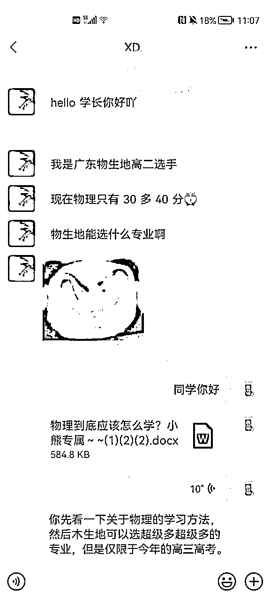

# 19 岁大一学生 如何靠生财 做抖音 K12 项目两月小赚 2 万块并获得长尾收入？

> 来源：[https://e490v1rj80.feishu.cn/docx/DZ7Ld2NqvoVO92xqZzRcBqCxn3e](https://e490v1rj80.feishu.cn/docx/DZ7Ld2NqvoVO92xqZzRcBqCxn3e)

# 本文核心主题

1.  小白如何利用抖音知识付费赚到第一桶金？

1.  教育IP如何不“割”韭菜走的更远？

# 介绍

各位圈友大家好，我是安俊，03 年，如今刚开学大二，目前在做中医粉引流项目，自家有中医产品，也有线下门店。

# 背景

大一下学期做过一个高考物理的项目，也赚到了自己的第一桶金，如今积累有一定的学生私域，私域对接项目有长尾收入。

并且自己刚高考完一年，也做过一段时间的K12项目，对教育赛道有很深的理解，今天把自己的经验毫无保留分享给大家。（因为做这个项目的时候是还在大一，所以题目取名为“大一学生”。）

（因为这是我第一次写长篇文章也是我第一次跑项目，所以认知有限，文中难免有逻辑错误，还请各位圈友给个机会，多多包涵，谢谢大家~）

（本文删删改改写了一周，全文7800多字，圈友们按需观看~）

# 目录

# 一.怎么想到做K12这个赛道？

1.  当时是闲着没事干，想赚点零花钱。

1.  高中的时候自己比较擅长高中物理，自己自带知识货源。

1.  当时也没想太多的 SOP 玩法，直接就上手发了第一个抖音视频

（没有想到第一条就爆了）

# 二.视频

## 1.爆款模板

特效模板：跳舞的小幽灵/西瓜条（只要是当下流行的模板就行，爆款模板有时效性）

核心文案：助人型

类似这种话术：

1.  大家有...问题可以分享出来

1.  各位学长学姐们有什么经验可以分享给大家

1.  一人分享一个高中学习踩坑经验～

1.  大家有啥知道学习物理/数学/英语的好方法吗？

注意：不管特效是什么无所谓，只要是当下比较火的特效就行，最核心是这个爆款文案

其实类似这种话术现在也非常火，而且各平台都有，给大家拆解一下为什么这种话术这么热门？

1.  大部分其实多多少少都有分享欲、助人欲，觉得帮助到他人有种成就感，一人问一句，一人回答一句，视频权重就上去了

1.  只要是学生刷到这种文案，基本都会打开评论区看看有没有什么好的内容，这时候视频就播放完了，完播率非常高，视频权重也上去了

1.  有点像大爷大妈在菜市场吵架，然后一群人围上来凑热闹，有的听，有的凑上来理论两句...然后整个菜市场都是他们的声音

1.  如下图，最近的笔记，而且是跨平台了，这种类型的内容，数据起的非常猛，适合新号发笔记快速起权重，打上标签；也能够吸引一波流量。

虽然赞藏不多，但是评论区是赞藏的两倍，足以见这种文案的火爆性

注意：爆款特效模板不仅仅这一个，那么如何找更多的爆款模板？刷对标，刷同行，好的视频直接模仿！先抄后超！

## 2.常用模板

上面的爆款模板适合我们给账号打标签，蹭热点去吸粉，但是不能常用。我们得挖掘一些常用的视频模板

（以下的视频模板，不管如何都要遵守一个原则：埋好你想要表达的”关键词“，方便用户搜索。）（关键词埋什么，大家可以去查看抖音SEO的航海手册～）

### A.背景视频类

这个是我看的最多关于学习类视频的模板，可以长久用，而且数据很好，特点是用了比较优美的背景视频或符合稿子的电影电视剧片段，感官上给人很好的感受。

制作方法

1.  背景找各种视频素材拼接

（以对标为例：素材可以找与文案相关的，也可以找风景类视频）（注意风景类视频镜头有快有慢，快的镜头要和念稿子语速就快点，反之慢点）

1.  提前在文本上写好文稿

1.  直接念文稿，AI识别形成字幕 【文稿偏向于方法类或者情绪类（渲染焦虑）】

1.  配上背景音乐

1.  简单剪辑

1.  关键词：高三 高考

1.  大家可以看到我截了两张图，一张是两年前的，一张是今年的，说明这种视频模板到现在还很火，还很适用。

今年高考冲刺阶段（2月份），“睡不醒的平盖尔”这个号第一条视频靠这个模板直接爆了起来，现在已经百万粉丝了

1.  这个模板小白也很容易上手。新号我建议可以用爆款模板快速起号，提升账号权重，打上高考博主的账号标签，然后后边用背景视频类模板长期更新 。

### B.课程回放类

特点

1.  制作成本低，只要是自己录制过的课程，可以直接拿上发布

1.  这种埋的关键词必须是你学习干货类相关的，比如这里面讲的是电场，你的标题也要带上#高考 #物理 #电场

### C.精美技巧总结类

特点

1.  要么是技巧类，看起来很简洁，给学生一种感觉：”这种题用这个方法就是秒杀“。符合短视频的尿性也符合大众的心里：要的就是短平快。比如”老曹“的特点就是这样，他都是打印出来一些很显眼很简单的公式结论，非常吸引学生眼球。

1.  要么是笔记看起来十分精简，手写笔记十分漂亮，吸引人的眼球，比如”勇哥“的字迹就非常的好看，非常吸引人。

1.  埋关键词：讲的相关内容相关词，离心率，其次化，双曲线黄金三角形，结论等等

### D.直播回放类

特点

1.  这个博主的视频几乎都是他的直播回放切片，再后期剪辑点特效

1.  埋关键词：家长必看、学习方法、教育。

这里重点提醒：

只要是讲学习方法、讲如何教育孩子的，都要加上家长必看等等和家长有关的词，因为抖音不少中年人有孩子的家长，他们也会刷到，他们也会有不少帮孩子买课的！！！

大家有兴趣可以搜一下下图博主（杨自豪）的评论区，很多都是家长问怎么买课？家长反映自己孩子的各种不好的习惯，寻求解决办法，可知需求还是很大。

## 3.如何找到源源不断的模板？

一个思维：“抄”

我们一定要养成一个习惯，多刷对标内容，账号养成后，利用系统自带的算法推荐给你一些数据非常好的同行，直接模仿即可。

当然也可以思维碰撞，这个模板和另一个模板结合一下，或者，把爆款对标模板稍微改动成你的模板，形成新的模板

为什么这个思维这么重要？其实我们圈友没有一个人能够把这个项目的完整SOP总结的很完整给大家，一些很细节的东西没办法用文字阐述出来，都是需要自己去观察同行，总结同行的特点，然后自己去实践。

实践后才知道这个方法可行不可行？然后完善现有的SOP。就好像高中的时候没有一个老师，没有一本书，可以把高中所有知识点呈现到，都是要自己通过刷题，刷到不会的去积累完善自己的知识体系。

# 三.引流

引流方法非常多，这里介绍几种我最常用的

## 1.个人简介留自己的v或公众号

## 2.建粉丝群去后续导流

## 3.背景图放上自己的公众号名字或vx号（如下图）

# 四.产品总结

*   虚拟资料

*   学习方法课

*   六科全程课

*   心态梳理课

*   冲刺方法课

*   学科冲刺课（适合不及格的）

*   单词训练营、早起营、全科答疑群

*   高客单的一对一陪跑答疑

*   志愿课

# 五.如何增加用户黏性？（高中赛道）

私域的玩法，朋友圈的打造，生财圈友已经给了很多了方法，这里我也不关公面前耍大刀了。

在当大家用公域平台引流了大量的学生粉后，需要在私域好好培养用户黏性，因为随着学生的长大，一路上会有很多复购的情况。

那么到底如何让教育IP走的更长远呢？

这也是本文的核心——K12赛道公众号特有的增强私域用户黏性的方法

## A.个人号玩法

### 1.朋友圈打造

### 2.卖小金额资料/赠送资料

（这个方法是我借鉴了生财的内容的，借鉴了有关私域的内容，但是我忘了是哪一位圈友找不到了，小声说句对不起~）

#### ①加好友后赠送资料

注意一个细节：加好友后可以向他赠送一份资料，并且最好带有语音（发语音更加亲切和蔼，提高成交率）

#### ②卖小金额资料

导流到个人微信的，可以先卖一波7.9 or 9.9的资料，小金额高质量资料，实现超价值交付，便于后续更高客单价的转化（图二就是因为我的9.9资料超价值交付，后边报了我的2499一对一陪跑）（不得不说生财的内容是真庞大齐全，就是这个细节的玩法，让我后边成交了不少高客单）

## B.公众号玩法

### 1.公众号要设置免费的资领取

可以是 单科学习方法、背单词方法论...

一开始进来你的公众号，得有个理由让大家关注你的公众号

### 2.公众号更新频率一周一更

周五晚或周六开始更新文章，一般高中生都是周末放假有时间看手机，特殊情况节假日放假也要更

### 3.文章内容可以参考下面的主题发

#### ①学习方法类

如何自学？如何预习？如何睡眠？

干货类文章，不要藏着掖着，得给出有价值的内容，才有助于后续提高产品的转化率

#### ②鼓励类、思维类

讲一些社会上的东西，讲一些高思维的东西，讲一些社会上的东西——如何成为一个内心强大的人？你对高考的幻想？智商陷阱。高中生最大的思维误区。

核心：

由于学校的教学制度，其实大部分初高中生一周寄宿在学校其实心里很压抑很空虚，如果这时候一篇文章能够给到他们心理安慰、鼓励和精神充电.

学生们对这个公众号会产生情感依赖，对你的IP有极大的依赖感

市面上确实存在这样的教育机构，确实帮助了很多高三学生在高三极大的压力下挺过来了，我认为这点是好的教育公众号和纯营销教育公众号的区别。

这点无论是小学、中学、考研等公众号都适用，比如：抖音博主做考研保研的 ”钠珀“ 他就是给了学生们很足的精神充电、鼓励，所以他的用户粘性很高。相比之下，其他的营销味就很重了。

（给大家两张截图看看区别）

一共四张图片，第一张是A公众号，二三四是B公众号,大家可以看看

B公众号:不仅会推他的课程训练营同时，还会实打实的分享干货，最重要的是会分享关于思维上的东西和情绪化的内容,但反观A公众号:每一篇内容都比较虚，有点夸大成绩。

这里再补充一个细节点：A公众号有个很大的弊端就是他的每篇文章即使分享了干货但是最后面依然会放上广告；而B公众号，讲方法的讲思维的文章从不打广告，而是另起一篇推文推课程。

### 4.推课程时间也有讲究

推课程的时间不是乱推的，推课程会按照几个常用的时间点去推，也是大家有需求的时候

比如高三：

*   进入高三的暑假会推出高三全年的学习方法课

*   高三上推出高三一整年的六科的全程课

*   进入高三下的寒假推出心态梳理课

*   高考还剩下100天推出高三冲刺方法课

*   高考还剩下75天推出学科冲刺课（适合不及格的）

*   期间还能穿插各种训练营（如：背单词训练营、早起训练营、全科答疑群）

### 5.定期视频号直播

在发周更公众号文章的时候，比如到了小长假，国庆，中秋，端午等，可以提前在公众号文章放出直播预告。

那么为什么要定期直播？直播要注意的地方？

1.  直播是为了能看见你这个人，是为了给大家解决各种问题的，增加用户黏性，增强学生对你的依赖感，所以不建议在直播的时候推销课程，卖课，这是给你和学生情感升温的时候，推课程推训练营留到更公众号文章的时候。

1.  直播讲的内容、起的题目一定是刚需内容，比如《即将进入高三的你，不听这场直播你一定会后悔》《一次直播，解决你的高三一年学习方法问题》，才能吸引大家的眼球，增加留存率

建议大家有能力一定要多直播露脸输出内容，这能快速养成一个教育IP，IP形成转化率会变得极高

### 6.导流到个人微信/QQ

通过公众号买过课程的学生，可以让学生加你的个人微信和QQ，产生更深的链接，通过朋友圈的打造，可以保持长期的链接。

老师与学生亦师亦友，无论后续是多次购买其他产品亦或以后产生其他的链接也方便。而且这样一次课一次课的加，不会因为加的人太多而被风控，而且加进来的都是有付费意识的精准用户，都是信任你的，不会乱搞你的微信。

# 六.高中产品发展方向

我认为现在做K12单卖课程，卖陪跑营我认为已经比较白热化很内卷了，可以考虑一下新的方向。

老师带学生一对一陪跑 高三陪跑费用4999 5999等，负责学科答疑，心态梳理，学习方法教授。

原因：其实现在学生不缺课程资源，b站上一搜不缺高质量课程，但是现在的学生最缺的就是一个懂自己的人，学生在学校遭到排挤、校园欺凌、班级非正常内卷，心态崩溃、恋爱问题、老师压迫太大、模考考差心态崩了。

上高三其实不止止是知识内容问题，还有很多很多心态、交际的问题，这些问题，试问一个青春期的孩子谁愿意和家长沟通这些？

毕竟两代人存在代沟，但是这些问题又很影响孩子的学习状态，但是一个成绩优异的学长学姐就可以解决这些问题。这么一看其实大多数家长都愿意为孩子这一年付出这个高客单，毕竟高考就一次~

# 七.教育IP如何走的更远？

## 1.一定要干私域

一个教育IP干私域是最最香的，甚至可以吃一辈子。

假设高中学生屯在了公众号里，高考完后转到大学内容，再用上述讲的增加用户黏性的方法，继续推出大学的软实力课程，甚至对接给其他人。

（比如我现在微信屯着六七百个高中生/大学生，若有圈友做大学 考研/四级六级/志愿卡/流量卡/创业粉，我只要继续保持我的IP，我只需要发个朋友圈公众号就直接收佣金就行了。）

## 2.定期视频号直播和定期的公众号文章

大学的公众号文章就更加偏向软实力的文章了。

比如：《教你如何成为大学面试的神》《如何交际》《最快脱单的方法》《上大学前，一定要看完这篇文章》

定期直播《陪大家一起查高考分》《进大学前必看的直播》

推的课程训练营《志愿课》《恋爱训练营》《自媒体训练营》《7天速过四六级》《交际训练营》《思维训练营》《一个月背完四六级单词》

所以我前面说过尽可能在高中就增加用户黏性，保证高中课程质量，多多直播，周更文章，不要太过急着营销，要善于培养感情，给足需求，后面还能吃四年。

所以建议大家一定要 多直播露脸输出内容，这能快速养成一个教育IP

## 3.挖人

可以把高中的时候培养好的苗子，高中毕业之后，直接招到自己的工作室帮你做视频，录制高中课程，运营你的高中课程内容，你只需要每周在公众号上用你的IP发文章保持人设，输出价值内容，课程内容交给学生去打理。

然后本人就可以转重心去维持你的个人IP和做大学软实力课程/职场内容，真的真的可以吃很久很久。

## 4.真心做教育的，谁不想桃李满天下呢？

应该有不少做教育都想着“割”一波就走，挣个快钱就走，但是挣完后，下一个项目做什么呢？

但是如果你是真的热爱教育这个行业，想一辈子待在教育行业，大家可以考虑一下“高中—大学—职场”的IP发展路线。

把高中粉从公域引来后，用自己的IP和高质量产品让大家一直持续关注你到大学，甚至到职场或创业，这条路真的可以让你吃一辈子。

而且这件事做起来对他人对自己都很有价值，可以考虑作为自己的长期事业，也不用自己长期追各种风口跑项目。

如果是真的能在高中和大学帮助到一个学生，他以后有多牛你完全猜不到，这笔财富是十分巨大的，所以大家以”割“的思维去教育，割能割多少呢？割不出一个亿。

但是你通过互联网培养几百个几千个思维能力提前很优秀的学生，你的收益会非常非常大，不是能用钱来衡量的，而且这些学生一定会转为在你的私域里面和你保持长期联系的，从学生转为朋友这种关系，他们成长起来后对你以后发展非常有帮助。

大家自己把学生培养上了985/211，大学教他们 沟通、交际、自媒体、创业，他们未来成功后对你的价值是非常大的，这相当于是在做一笔投资，而且给他们投资的时候，你自己还有钱赚，并且股票涨到牛市后，你还有分红。

## 5.价值观

往大学转的教育IP一定要有自己的价值观，比如下面推荐的第一个公众号：树成林，他们的学生用户的价值观就是：利他。怎么养成的统一价值观？是在大学的时候专门推出了一门大学思维课程，顺便奠定了整个IP的价值观。

为了培养这种价值观，会隔一段时间各地有代表出来组织这个城市的树成林聚会，一些思想先进、有着利他核心思维的大学生会聚在一起畅聊，认识朋友，交流资源。这就是这个IP带来的好处，大家会觉得我们聚在一起是因为这个IP的存在，对这个IP的信任感、依赖感更加强烈，这个教育IP会在历史上留下痕迹。

其实这个模式，就像生财各地的同城群聚会，每一次聚会都是有助于这个官方IP的曝光，也有利于同频学生的链接，对大家都有利。

对官方IP：足够的曝光和推广

对圈友（学生）：提供了一个可靠的圈子

## 6.推荐2个对标账号

“树成林” 和 “小万物”

这里稍微讲述一下这两个公众号的历史：（不感兴趣可跳过）

### 树成林

是在20初就创立了公众号，up主是：树林同学 长期在b站发背景模板类视频，并且定期在b站直播培养起来了独特的IP

（这时候体量已经蛮大了，这个模板是真的爆）大家对这个IP产生了依赖感（大家可以去b站搜一下 树林同学，看看评论区和弹幕大家对这个的依赖性）

大家一有学习上的困惑和负面的情绪都会去看他的视频蹲他的直播，21年的一个视频在抖音b站爆了百万赞，引流效果彻底进入疯狂，然后后边就在公众号增加用户黏性，出课程变现。

这时候这个up主个人纯利润已经是赚了1000个w了，后来因为IP足够有依赖性，大部分的粉丝继续复购大学的产品《恋爱训练营》《IP训练营》《沟通训练营》等等。

然后还会在产品中挖人挖到公司帮他们去运营高中的内容，出版高中书籍《生物知识清单》等等其他书籍

### 小万物

小万物的老板其实是树成林之前的一个合伙人（抖音up主：睡不醒的瓶盖儿）出来单干模仿了树成林两年前的玩法，现在视频又爆了，也是承接到公众号，大家可以留意一下这个公众号后边是不是会把人往大学方向去转。

这两个公众号是目前可以长存的教育IP，可以吃很久很久，而且上限很高

# 八.如何讲出人听人爱的课程？

前言：

*   为了后续IP的复购，我们得打造更好的产品，怎么讲出人听人爱的课程呢？

*   前期为了减少成本，可以用飞书录制课程

*   导图先给到大家，大家先看一下导图的内容，然后我再用文字讲述（导图可放大~）

## A.要先讲why

你要告诉学生，为什么要蛋疼学这个？这个和之前学的有什么联系？这样做的好处有：

### 1.预习

一个我也不知道啥原理的现象：

一个新事物在我之前第一次见过，然后我第二次再见到会有莫名的打起精神：哦？这个我之前在哪见过 ？

举个栗子🌰：你很喜欢很喜欢看生财的文章，有一天老师突然在课上讲到生财的创始人亦仁，就算你在钓鱼，你也一定会立马清醒，听听老师在讲啥

### 2.让学生学的内容自带知识体系与框架

让学生知道自己目前学的这个知识点是在框架的哪一部分，不会让自己学的那么懵逼。就像我在给你们讲这个内容的时候，我先把思维导图放了出来

## B.为什么要用类比和打比方的讲法？

如果是讲给刚开始学这个内容的学生（比如寒暑假第一次学的），必须要带上类比和打比方的讲法。

原理：你可以理解为，一个神经元=一个知识点，大脑想接受、理解、记住一个新的神经元，最好的办法是新的神经元与旧的神经元产生链接。

举个例子：

1.  一位生财圈友之前做过小红书电商（旧神经元），现在想做视频号（新神经元），你想让他理解视频号怎么做，该怎么说？直接说视频号带货其实就是小红书电商，都是选品 混剪 矩阵（新旧神经元链接）（类比）

1.  如果我现在想让一个学生理解圆周运动是什么（新神经元），我会直接说：游乐场里面的摩天轮（旧神经元）就是一个圆周运动（新旧神经元链接）（类比）

不知道大家有没有遇到过这样的老师（特别是大学老师！！！），上课纯念PPT和课本，然后带着答案将题目，这样子大概率学生理解不了？为什么？因为没有用类比的讲法，学生无法理解。

## C.为什么上课要带着学生视角？

读了小学、初中、高中、大一，我其实最怕一个老师上课自嗨，讲内容东讲一点，西讲一点没有一点框架性。

学生学起来会非常的懵逼，不知道这个内容到底是学的是章节的哪个部分，如果给学生这种感受，学生会对你的产品非常失望，后续的产品大概率不会再买。

所以要讲课的时候，时刻关注自己讲课的体系是否完整

原理：同理心。要想学生对你的课程满意，你要想一下学生喜欢听什么样的课？谁不想一个老师讲的内容自带体系、带我们理解知识点~

# 九.一些小技巧

## 1.收款码

收款的方式有很多种，但是容易被限制，我这里推荐我当时用的方法。

就是 用营业执照去办一个企业微信收款码，不会被限制，提现给腾讯交点手续费罢了（而且这收款码b格够高，提高转化率）

## 2.引流的时候到底是引流到个人微信还是公众号？

（个人观点）

流量大用公众号，流量小个人微信。

但是也无需纠结，如果你是流量小，引流到个人微信了，依然可以发公众号内容，然后再把公众号内容分享到朋友圈，吸引关注

如果是流量很大导到了私域，后期再用课程筛选人导到微信私域。

# 十.经验之谈

## 1.沉淀技能

大一上的时候自己其实并没有变现赚钱的想法，但是对自媒体感兴趣，就在公众号报名了一个“IP 训练营的”的课程。

搭建了对抖音平台的认知，运营方式，也是这一次积累下来的技能、基础、经验能让我在第一次发抖音视频就有了所谓的网感。

总结：其实和参与生财航海一样，不要抱着参加航海就赚钱的想法，一次次航海是给你积累技能、经验的过程，方便你日后的技能集合，开始爆发。

就比如若一个圈友去年参加过视频号带货的航海，积累了混剪、找素材、去重、选品的能力，那么今年小红书电商上手就赚钱，若不赚钱那就是老天爷不给脸了

## 2.会抄

当时是在刷着视频，刷到了一个关于高考学习的视频，数据非常的赞，而且模板非常简单。

当时我脑子就在想：别人都能发，我为啥不能？再结合自己赚零花钱的想法，想法一结合，说干就干，直接搬了别人的爆款模板，第一个视频直接就爆了。

"抄"这个字大家可能听腻了，我换个词“生产者思维”

我在高三的时候其实就买过各种各样的学习方法课程，当时我就有意无意地在以生产者的视角去思考它到底是怎么引流的我？

还让我成功付费，并让我心甘情愿关注了他公众号一两年？

所以我在大一下开始做的时候其实本身就自带浅浅的SOP，就是通过之前观察对标，生产者思维思考他的运作方式，如果我是他，这是怎么做到的？

## 3.诚恳请教

其实当时大一下做K12的时候，我自己并没有接触到这么多圈子，所以互联网思维还不够丰富，包括当时如何承接流量，如何打造产品都是比较懵逼的。

比较幸运的是当时，遇到了生财圈友：行一、一尘学长、泽豪，我诚恳向他们请教，得到了前辈对我的指导，我也从他们的指导中汲取很多经验，然后去实操，并且拿到了结果。

在这里感谢当初前辈们对我的帮助，也感谢当初自己敢于向上社交提问的我~

## 4.先干再说

有初步想法，初步的SOP，先干了再说，先完成再完美，干的过程中，再去查找生财文章内容去优化完善你的SOP和行动，在行动中改善。我就是当初有了初步的SOP，并没有思考很多细节，直接就上手模仿同行视频了。先完成再完美～

## 5.多看生财

生财的内容是真的很庞大也很齐全，但是大家要记住没有一篇文章能给你完整的SOP，大家一定要多刷生财你所做领域的文章，形成自己初步的项目体系。

然后再通过实操下场，踩坑拿经验补充完善自己的项目体系，不断下场弄脏手。我也是看圈友分享的文章，学到了很多细节，大大提高了我的转化率~

何以生财，唯有实战！

# 十一.总结

回过头看，其实我们赚第一桶金并不难，因为我们肯定在某个方面多多少少会比别人更加优秀，不需要说达到专家水平才能去教别人。

不知道大家有没有听过一句话：高考没有600分以上的不要做高考教育类，我觉得这句话真的是错误的。

从数据来看，高考能考到一本的人基本上只有10％-30％（除了北京），而且大家要坚信一个理论：80分能教70分的，70分能教60分，60分的也能教20 30 40 50分的。

（赚第一桶金可以不用管那么多600分以上的规矩，教就行了，但是想要长期做教育IP可能一个高学历会让你走的更顺畅，因为你做大了，会有人查你身份是不是985 211）。

也就是说甚至你做蛋炒饭做的比别人好吃，你都可以录个课出来卖，无非就是引流的问题。

我们每个人都有自己的过人之处，拿去知识付费，成本极低，难度不高。

此文章删删改改写了一周，也是给自己上一个项目的复盘，毫无保留分享给圈友（大家有问题欢迎评论区留言，知无不言，言无不尽~）

生财帮助了我踏出第一步，我也要回馈给生财我的复盘

最后祝圈友们一起在生财掘金，一起生财有术~