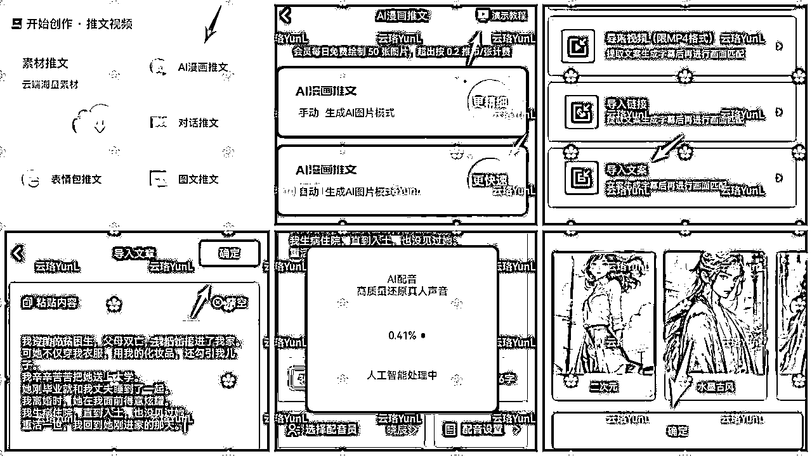
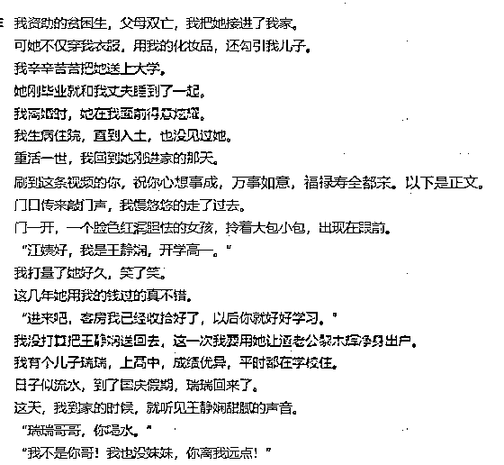

# 一文详解小说推文如何做

> 来源：[https://yf4niapxuw.feishu.cn/docx/DyYfdgNRvobFZ1xxioXcfftqnh2](https://yf4niapxuw.feishu.cn/docx/DyYfdgNRvobFZ1xxioXcfftqnh2)

你好，我是云珞。

今天我主要讲视频版小说推文如何做。

如果你想了解图文版小说推文如何做，可以看我2022年5月7日发的这篇文章:https://t.zsxq.com/12tVLCCPG

那现在小说推文行情怎么样呢？新人可以入场吗？

先上收益图。

如果你是新手，以前从来没有做过互联网项目，不建议你入手小说推文。除非你很喜欢看小说，出于热爱做小说推文。

今天我写这篇文章，主要是为了告诉通过我的邀请码注册了千顺顺的小伙伴，如果短剧做得太难，但又想继续做，可以先做小说推文当基本盘。

毕竟现在短剧小程序推广计划不太理想，又和星图一样有期限，期限结束后，后续收益不归达人。

# 一、什么是小说推文？

上次写图文版小说推文，我主要介绍了如何在小红书做图文版小说推文。

这次写视频版小说推文，我主要介绍如何在抖音做视频版小说推文。

你有没有在抖音刷到以下视频？

简单来说，小说推文分为三种模式。

第一种是关键词，在评论区引导读者在另外一个平台搜索关键词看小说。

第二种是口令，在标题或评论区引导读者在抖音搜索口令看小说。

第三种是小程序链接，引导读者点击视频左下角链接看小说。

# 二、那小说推文如何获得授权呢？

我介绍两个平台。

第一个平台是用关键词。

如果你想做知乎、us故事会、黑岩、番茄，就扫码注册小程序，获得授权。

第二个平台是用口令或链接。

如果你想做蓝鲸故事会、朵米故事会、桃子故事会、17K小说、掌文故事会等，就扫码注册小程序，获得授权。

如果不获得授权，就无法锁定收益，也有侵权风险。

# 三、那小说推文如何选文呢？

知乎平台:

点任务详情，在表格中找新文、高转化文推荐。

或者打开知乎，点击会员-盐故事-短篇-单篇-上新，找高赞的新文推荐。

千顺顺平台:

在app首页点击每日充值排行榜，点击小说，看看昨日和今日排在前面的小说。

或者看千顺顺小说爆款排行榜

除了这种方法，还可以在抖音选文。

在抖音搜索框输入小说推文、虐文、末世、悬疑、双男主、蓝鲸故事会等等，点一天内高赞，或者七天高赞。

# 四、那小说推文如何制作视频版呢？

## 第一种，游戏类视频版小说推文。

有三种获取游戏视频的方法。

第一种方法，自己下载一个游戏app，自己玩游戏，并录屏。

手残党可以下载破解版游戏。

破解版游戏链接如下：

http://m.6ll.com/k/dtpkmod/

第二种方法，在抖音输入游戏名称，点直播，进入直播间后右滑清屏，并录屏。

第三种，在小红书发帖花钱找人帮忙打游戏录屏然后让他发给你。

有了视频素材后，在微配音app生成配音和字幕，最后把游戏视频和配音、字幕、背景音乐放入剪映，一个小说推文视频就完成了。

视频教程：

## 第二种，混剪类视频版小说推文。

有二种获取混剪视频的方法。

第一种是直接用我分享的素材库，但容易和别人的重合。

链接：https://pan.baidu.com/s/1Jl3ruHqHkGMr3-oy6rHpGg?pwd=pe3p

提取码：pe3p

--来自百度网盘超级会员V4的分享

第二种是在抖音搜索关键词，主页批量下载。

批量下载工具：

链接：https://pan.baidu.com/s/1vldgV7XSM7qH7Rrf_WdW8A?pwd=bhqt

提取码：bhqt

--来自百度网盘超级会员V4的分享

但我不建议用混剪素材，一是有的素材有水印，需要快速看一遍，二是要用上视频变速1.4，滤镜、贴纸、画中画等去重手段，且要调低透明度，不能让人看出来。

如果你想要了解去重，看看短剧的去重方法，原理都一样。

## 第三种，ai绘画类视频版小说推文。

ai绘画类教程很多。

如果你想自己学习ai绘画，认真学习航海教程就行。

https://search01.shengcaiyoushu.com/docx/M1L4d7UcmoFQHixvkzEcpOo5ni7

今天我只介绍一款付费app，扫码注册即可。

然后打开APP首页，点击ai漫画推文，看完演示教程后，开始生成ai绘画小说推文视频。

ai绘画效果如下：

# 五、那如何发布小说推文呢？

如果你选的平台是知乎，当你选中了一篇小说，取一个四字关键词，在抖音等平台推广时，视频上方打上关键词，引导别人来知乎搜索关键词看小说。

如果你选的平台是千顺顺，在首页点抖音小说推文发布教程，了解如何发口令推广小说。

# 六、如何让小说推文视频脱颖而出呢？

## 1、早中晚养号，做神回复。

啥意思？

全程用流量，早中晚像正常人一样刷抖音，评论时，参考高赞评论，写一条类似的评论。

这样做，一是抖音玄学，提高权重，二是培养网感，通过刷视频，第一时间知道最新、爆火的小说推文书名、玩法。

## 2、偶尔做几条外语配音的小说推文视频。

先用百度翻译把中文翻译为英文。

fanyi.baidu.com

再用微配音生成小说配音。

最后用剪映生成视频。

英文配音小说推文视频效果如下：

除了英文小说推文视频，日语、马来语、菲律宾语，凡是微配音里有的外语配音，都可以做。

## 3、在小说推文中间插入祝福语。

比如，图片黄色标记的部分，就是我为了举例插入的祝福语，其他内容是原文。

## 4、改文。

一是在小说开头加上有吸引力的内容，比如：

万万没想到

谁也没想到

谁都没想到

注意看

你敢相信吗？

你绝对无法想象！

……

二是利用工具改正文。

第一个工具使用方法比较简单，但如果不通读一遍，修改后的文章，有语句不通顺之处。

第二个工具修改的内容比较多，我建议不改开头，只采纳一部分。

复制以下内容在微信打开即可使用。

#小程序://云端宝盒/vKIDmAFnyQaqWzq

第三个工具，需要自己不断完善提示词，且不适合长文。

先打开网页。

https://chat23.yqcloud.top/

再输入提示词。

5、加上热门梗。

感谢阅读的小伙伴，欢迎共同交流，一起进步。