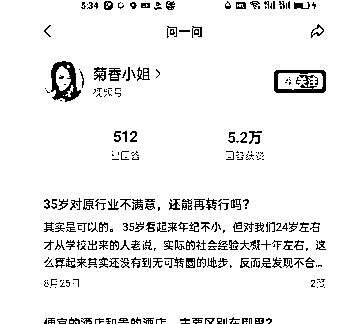

# 微信问一问学习操作手册【周彦充出版】

> 来源：[https://ii2lwcovfc.feishu.cn/docx/E3YEdYHUToAl0fxxFypcxveTnmg](https://ii2lwcovfc.feishu.cn/docx/E3YEdYHUToAl0fxxFypcxveTnmg)

微信问一问，我从2023年8月5号组建团队开始打卡启动，至今也在持续做，探索，同时我也加入了2个其他团队一起跑，真正的把问一问搞清楚了，实现了涨粉。

前提：做问一问必须要做视频号，公众号，不然不好做承接和转化，以及后续的触达和影响。

什么是问一问：微信的问答产品，对标产品有百度知道，知乎，今日头条的悟空问答等。

# 一，为什么要做微信问一问

【1】目前流量大，微信在大力推广和内测中。微信问一问这个产品是微信搜一搜团队做的，今年2023年3月28日才推出，目前依然在不断改版和优化中，微信搜一搜月活8亿，问一问绝对值得大力投入，王炸产品。

平均一个回答曝光量250左右，不要小看这个曝光量，在流量越来越贵的环境下，已经很不错了。

目前问一问的搜索权重很高，微信也在重点推广，可以用来做布局关键词做精准的搜索流量。

因为是内测产品，目前还没有完全推出，有些用户还没有回答的资格，如果没有，只能换号，或者等待开放，80%拥有视频号和公众号是有资格回答问一问的。

【2】问一问属于微信生态重要产品，微信生态的流量都值钱，流量的终点就是私域，回答问题引流到微信公众号或者视频号，再来转化销售自己的产品。

【3】有产品和业务线的可以回答精准问题直接引流变现，还有做行业个人IP的，我们可以去布局关键词，拿微信搜索流量还是非常容易的，微信问一问的内容，在微信搜索端的权重非常高，流量精准。

【4】如果你没有具体的产品和业务，那么就去回复热点问题，引流到公众号或者视频号，增加粉丝，粉丝多了，会有流量主收益，只要阅读了你的文章和视频就会有平台的广告分成，腾讯的广告收益算是比较高的。

# 二，操作手册

【1】每天至少回答1个问题，回答数量越多越好，每天最多可以回答20个视频，牛人直接拉满，涨粉非常猛，有的伙伴全职做问一问，有的上班摸鱼做。全职做的，比较猛的，平均每天稳定涨粉100个左右。

【2】利用chatgpt搜索答案，没有chatgpt用文心一言，知乎，百度，微信搜一搜等等都行，改写成自己的内容即可。有条件的可以用ChatGPT 4 PLUS去回答问题，加上自己的故事，成绩（可以吹），效果很好，效率很快。

【3】尽量不要带任何引流广告和明显的动作，因为是内测，回答的每个问题都会被很严格审核，很多人都被过关小黑屋，24小时，我也被关了2次，你内容优质，用户自然会关注你，官方会推荐你。

不要太频繁，不要全部复制，至少要改动一些，像个真人普通用户一样操作，不要做出像机器人，像营销号一样在操作。

【4】回答尽量带一张相关的图片，或者视频号可以带视频，可以用AI去做，可以用稿定设计APP，AI做图。也可以用微信小程序，MewXAI里面的MJ，AI绘画，59元一个月，自行购买，我目前用的就是这个，自掏腰包买的。觉得麻烦，也可以不用带图。

【5】不断找对标案例，找到优秀的问一问玩家，跟着他回答，回答比他优质，流量就是你的。后面会列举一些跑得好的优秀账号，10天涨1万粉很多。

【6】热门回答下面，可以评论引流，小成本大曝光。话术：晒成绩+送资料等。

# 三，百问百答

【1】问一问入口在哪？

微信——发现——搜一搜——问一问——（问题广场，去回答）——搜索行业关键词

【2】如何找行业关键词？

可以用百度指数，巨量指数，微信指数找相关的关键词，有条件的可以用各大广告投放后台的关键词工具，以词推词，做出自己的关键词库。

【3】用视频号还是公众号回答？

看个人，你重点做哪个就用哪一个。

【4】如何提高账号的关注率？

高质量回答很重要，别人看了你的回答就觉得很牛，尽量带一些信息增量，一些个人的特色内容和故事成绩效果（吸粉关键），内容有温度，有情绪情感，回答要口语化，通俗易懂。

【5】如何提高回答质量？

1，排版要优质，可以多用短句，通俗接地气带有情绪的口语化内容回答，幽默带情感，20-30个字左右，就要回车空行。

可以回答短的，50个字左右，但是情绪很饱满，有立场的，也很容易获得点赞和关注，如很多神评论，这个需要锻炼了。

2，回答尽量专业，客观，真实，靠谱，有爱心，有故事，内容控制在200-500字左右。可以全网搜集答案，参考AI回答，再来根据自己的经验来做回答，回答有信息增量。这是长的。

3，带图，可以用AI做图。或者带视频。

【6】问一问可以直接变现吗？

不能，主要通过引流到视频号，微信公众号，个微去私域变现，或者靠公众号，视频号发内容流量主变现。

【7】问一问如何快速看见效果？

没有捷径可走，大力出奇迹，堆量堆质堆时间，持续做功积累势能，持续引流量，布局关键词，然后坐收长尾精准流量。或者回答热点问题，突然爆发了。

【8】回答哪些问题效果好？

尽量回答最近热点问题，关注人数多的问题，系统首页给你推荐的问题（新），其次是垂直问题，或者跟着做得很好的对标账号去回答问题，他回答哪些，你就跟着他回答，然后内容质量比他好一点。

热点问题和专业问题的回答匹配可以是1:1，也可以2:1，热点问题引流，专业问题做转化，用专业的角度回答热点问题是最理想的状态，有些问题可能插不进去。

找关注人数/回答个数10倍的问题，比如100人关注，低于10个回答就是好问题。

【9】自问自答怎么玩？

拿小号去提问，然后大号去做回答。

【10】找人回答怎么玩？

找人2-5元一条，很多人愿意去回答，也很简单。适合有产品名称，有品牌，有业务的玩家。

【11】答题期间，视频号，公众号需不需要更新？

需要保持更新，专业垂直的内容，会影响关注的转化率。

【12】问一问可以用AI回答吗？直接复制过来

不能！要判违规，可以用AI+自己的观点来回答，要修改，优质内容+图片。

【13】评论截留怎么玩？

例子：我做得多么多么牛逼，这样来吸引流量和关注（展示效果成绩案例+送资料）

【14】有没有一些小技巧？

结合日常更新，日常思考，日常写作来做问一问，你正好在关注思考写作这个话题，就去搜索问一问，先看下其他人回答的，然后结合下AI，以及自己思考的内容，顺便就把问题回答了，可以一石二鸟，不费事儿。

也可以顺便结合短视频，和知乎等其他平台来做，这样最大化节约自己的时间，提高效率，多平台分发。

一个答案可以回复多个同类问题，稍微做一些修改即可，这样可以大大提高效率。

可以建立关键词库，比如私域，自媒体，这样的问题，问题分类，给出标题答案，长期去答，直接复制，轻微修改，看哪些答得不错的，收录进自己的问答库里面去。因为总有不断的人，重复的提出相同类似的问题，而平台会不断的给新问题推流量，这就是我们的机会。不管做任何事情，都要不断的做功，积累势能。

# 四，核心点

【1】量大出奇迹，长期项目，微信生态有肉吃，做1天1个月可能效果不大，但是做1年10年，你就吊打99%的同行，我非常非常看好问一问。长期做非常重要。

【2】回答质量越高越好，带图回答，结合AI（文心一言，免费）+自己的故事+一点点小吹牛来回答，每一个回答都是爆款，每一个回答都是王炸，才会得到推荐，才会得到关注。——【核心】

怎么提高质量，深度思考，不断的思考这个问题，不断的优化答案，不断的找同类问题，回答，直到满意为止，话题可以有标准答案，可以做一个回答库，然后通通写进去，这样会提高很高的效率，引流曝光直接起飞。

【3】长期做，至少可以玩1年以上。

【4】进阶版，投微信搜一搜广告，流量的终点是私域，和付费。一定要玩起来，非常66666！！

【5】转发多的，点赞高的，排名越靠前，越推荐，认真回答优质内容，然后一定要转发到社群，让朋友点赞，这样才有效果。敏感内容，已删，懂得都懂。

# 五，一些牛逼的案例，看多了，你就会了

【1】吹牛，但是有伙伴试了一下，有可能回答不通过。问一问审核很严，但是有效

【2】案例，前面的赞是家人朋友点的，后面读者就会主动点了。

【3】500多回答，5万赞，至少涨1万粉，人家回答了500个答案，这执行力很强

【4】800多回答，7万多赞，至少涨1-2万粉丝，这种账号很多。前提要堆量，提效率。

# 六：总结

难点核心点，有4个：

【1】长期坚持，先干1年，每天打卡（想一起玩的欢迎打入打卡营，长期招募，个人微信：zycbat）

【2】提高效率，堆量，提升质量，没有捷径，利用ChatGPT 4 PLUS 来答题，效果非常快，需要资源有问题的可以找我。

【3】点赞，互动要做

【4】回答热点问题+带专业垂直的角度，热点问题和专业问题的比例可以1:1，

问一问是一个长期引流项目，不是一个直接变现的项目，不是一个短期项目，做好了非常牛，非常值得去做。虽然在打卡期间，我没有爆，因为回答的内容太垂直了，量不够，但是也成功引流了，但是我把这个项目跑通了，我也会长期的继续去做。

幸存者偏差：无论什么项目，10个人去做最多1-2个人能拿到不错的结果，实际上做问一问项目的不止1000个人，拿到结果的就10-20个人左右，如何才能拿到结果，唯一的解法：需要长期去做，付出更多时间精力去做，找更多更优质的方法去做，不断优化精进，回答满1000个问题，基本上都能拿到结果。这一点99%的人，都做不到。