# 完全看不懂代码怎么用GPT写个GPT批量提问脚本

> 来源：[https://sm0o7z3mka.feishu.cn/docx/E3wrd3QLHoW7ohx5Iy1cv9CRnUh](https://sm0o7z3mka.feishu.cn/docx/E3wrd3QLHoW7ohx5Iy1cv9CRnUh)

大家好，我是十九，第一次分享有点小紧张，

看到有圈友分享了用GPT写爬虫，

我也来分享一个之前用GPT写的在tampermonkey运行的GPT批量提问脚本（ ）

首先感谢一下这两位圈友的分享文章@渣渣浩@梨云

起因是在用渣渣浩分享的RPA写手机器人时会占用电脑

就想着有什么有什么办法可以解放电脑

直到看到梨云姐用GPT写的脚本

就去问了一下GPT，脚本会不会用不了鼠标之类的

才有了之后慢慢捣鼓出来的脚本

话不多说开始正题

以下是刚提到的两篇文章

《全自动，真批量——ChatGPT超级写手机器人1.0》@渣渣浩

https://wx.zsxq.com/dweb2/index/topic_detail/181458258555812

《如何用GPT开发插件脚本，批量爬取小红书笔记，提升内容创作效率》@梨云

https://articles.zsxq.com/id_zbf7txfxll3i.html

# 1、向GPT提出需求

因为用过写手机器人所以先让他简单的写出一个运行框架

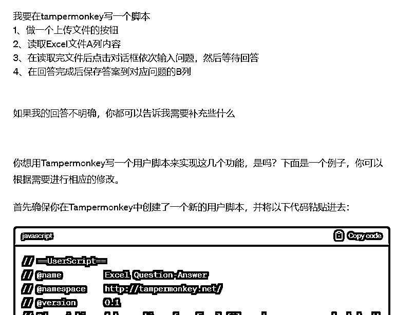

## 2、测试脚本

这个简单的框架肯定是用不了的

可以先去tampermonkey先把这代码复制进去这里试一下（里面的先全部删掉）

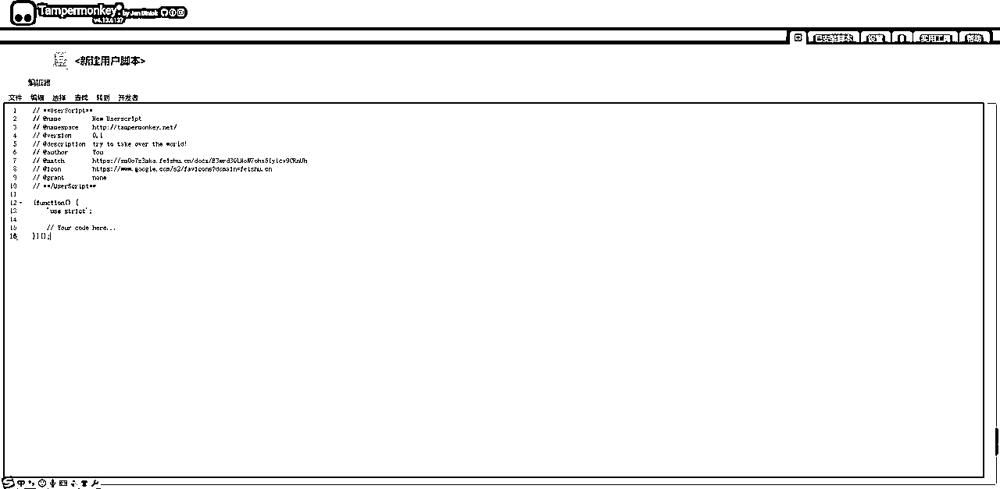

然后你就会发现点击上传的按钮没有显示在页面

对话框输入的位置页面CSS代码没有捕捉到，他不知道在哪输入

## 3、逐步修改

所以一步一步来先让他增加一个按钮（目前代码还短所以他能全部写出来，后面可以让他写出上下文方便我们寻找）

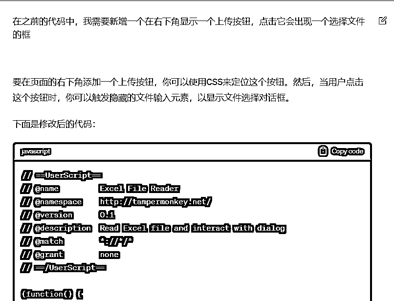

把修改后的代码复制进去就会出现一个按钮

点击上传文件选择文件后出现报错

因为这里少了一个引入XLSX.js库所以在上传文件后会出现报错

可以在浏览器按F12或者右键查看网页源代码

把报错的内容直接复制给GPT他就会修改

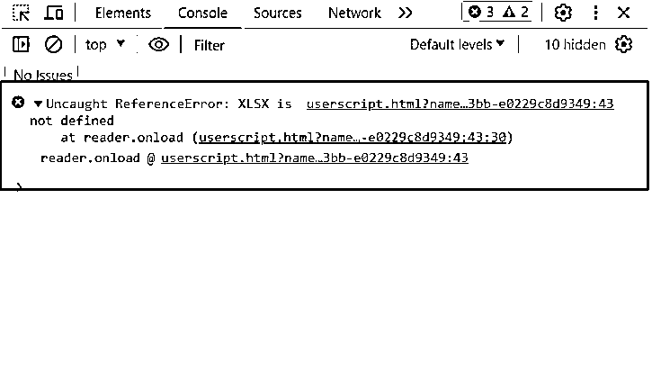

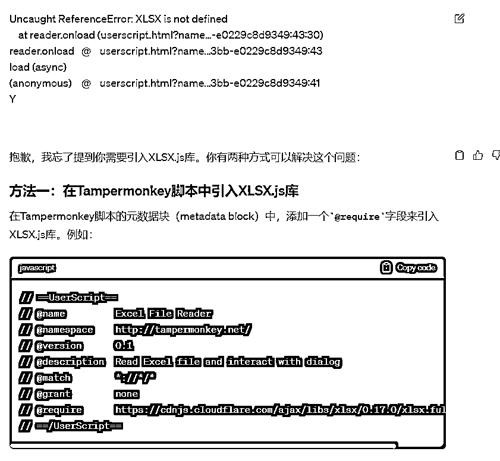

## 4、寻找页面按钮或者输入框的CSS位置（最重要）

因为需要点击对话框后输入内容

所以要先寻找输入对话框的CSS位置

在浏览器按F12或者右键查看网页源代码

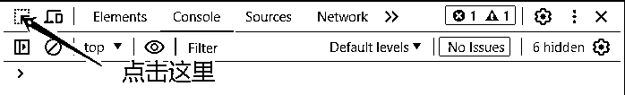

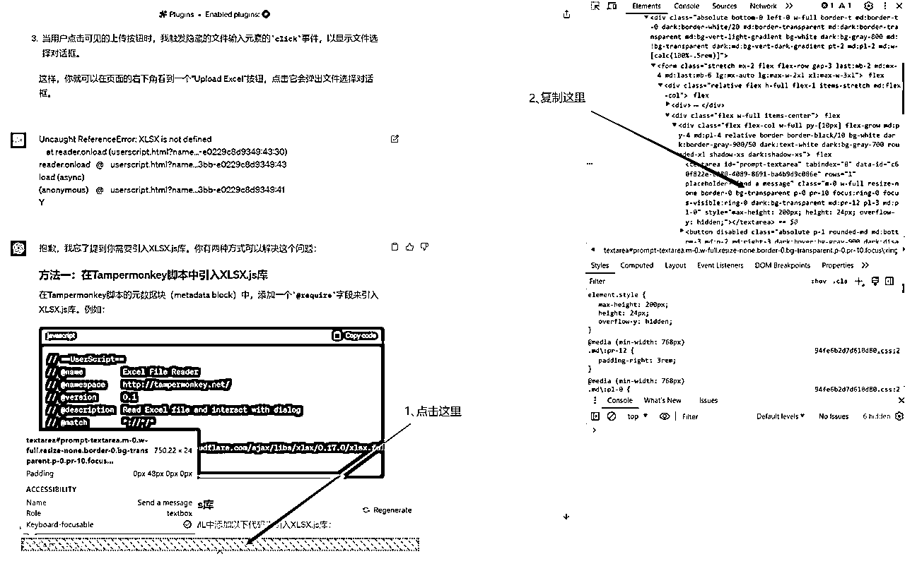

### 捕捉CSS位置，找到GPT给出的ID，在网页源代码 按ctrl+f 把ID复制进去，确保只有一个元素

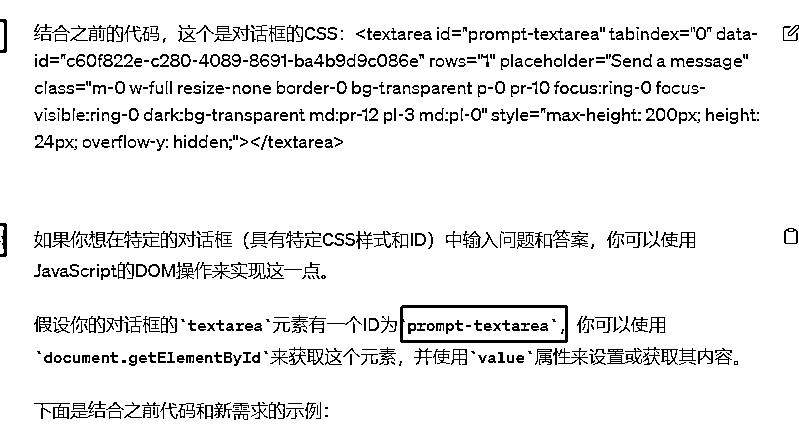

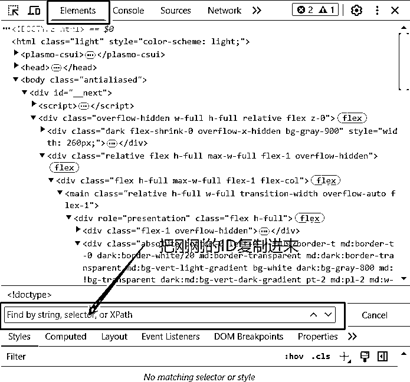

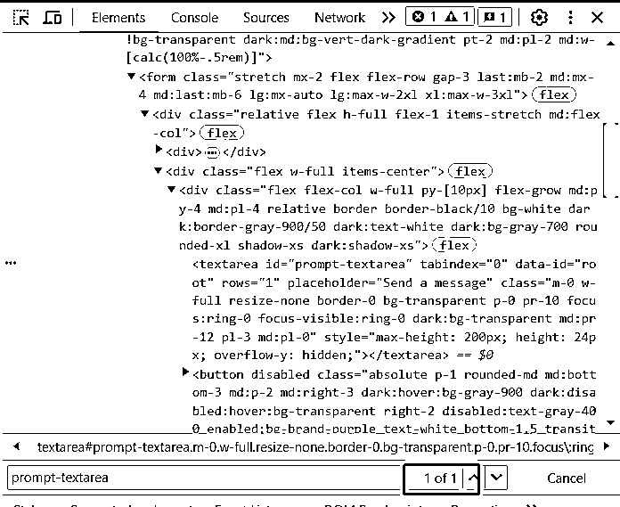

判断什么时候保存答案或者点击继续按钮也是一样，

找到这个两个按钮的CSS一起复制给GPT让写出判断后进行什么样的动作

点击按钮还是保存

## 5、最后整个弄完出来的运行逻辑是这样的

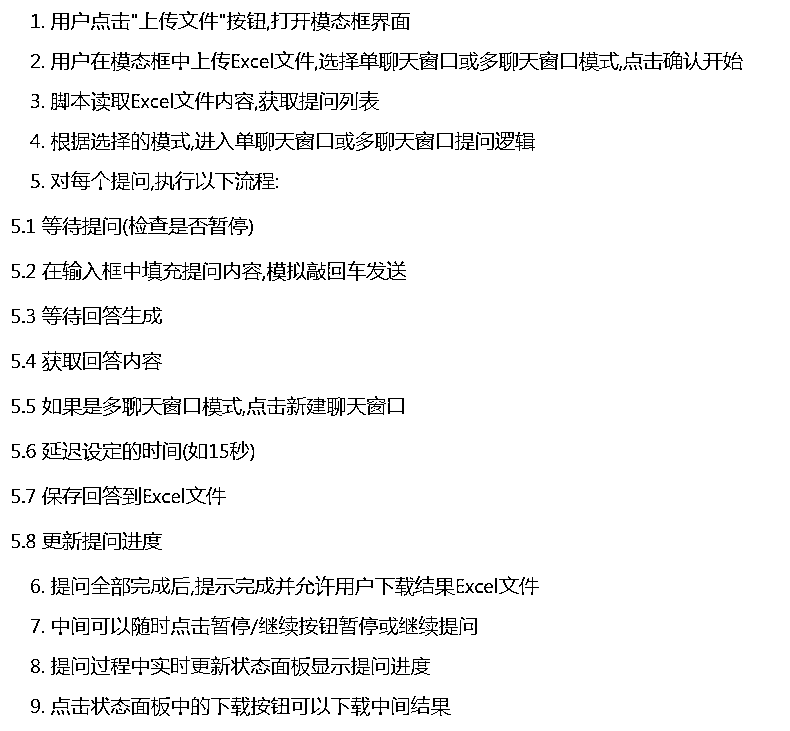

## 6、总结

首先给出你想要的需求给GPT（如果你的需求够准确那修改的地方就少），测试GPT给的代码有什么报错或者差点什么需要增加，多看网站源代码的报错，直接复制给GPT，都能知道问题。

在代码比较短的时候可以直接复制整段给GPT也能找出问题，如果太长复制给他，他重新写出了的代码有时候会自己减少一些完成了的功能

判断网页按钮位置这个很重要，如果ID不是唯一的元素，那判断就会失效或者找不到目标，最后就是慢慢优化细节了。

遇到不懂多问GPT，毕竟不懂技术，有时候你写的需求，是想解决某一个问题，但是GPT会根据你的需求给答案，就有可能会比较复杂，如果你直接告诉他你需要解决的问题，他可能会有更简单快捷的解决办法。