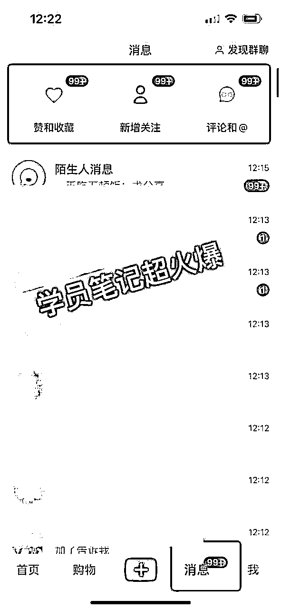

# 小学教师资料开学季活动 学员日入4000+活动实操拆解

> 来源：[https://wsk6hfxov5.feishu.cn/docx/E5zedR11doIoddxhACZcGWfmn0g](https://wsk6hfxov5.feishu.cn/docx/E5zedR11doIoddxhACZcGWfmn0g)

# 一.活动部分成果展示

新学期即将开始，我在原有的方案上进行了优化，活动依然很火爆，截止8月24日，我的学员最高收益2w+，单日变现最高4000+，最新加入的学员（微信好友300+）也能做到日入上千。

（学员活动日入4000+，实战4个月，微信好友3000+）

（ 大三学生实战第五天战绩）

（小学教师实战第五天战绩）

（小学教师实战第五天战绩）

# 二、资料引流篇

最近很多做资料赛道的小伙伴相信都有这样一个困扰，笔记动不动就被投诉，动不动就被禁言，大大减少了我们的引流效率。在平台封控资料账号如此严重的情况下，我们依然取得了一些引流成绩。

那该如何进行高效引流呢？综合我们这次活动，我总结了以下3点：

## 1.账号定位范围要小

下面这个案例是8月份训练营的学员，她是一名小学教师，并且是班主任名师工作室成员，我们马上定位做一个面向一个做班主任资料的账号，在沟通过程中，她再次抛出一个新的观点，她把目光聚焦在一个小群体上——新班主任，这个群体刚做班主任，比较迷茫，对资料的需求比较高。我们这个定位一打一个准，第一篇笔记直接爆了，接下来的笔记也跟着爆了。起号短短两周，粉丝已经达到了2000+，点赞、收藏、评论的数据都很好，浏览量最高达到了7w+，一条爆火的笔记至少给她带来了接近万元的收益。我更加深信：赛道越小越好，在小赛道中做精，很容易有所突破。

## 2.内容进行二次创作

做好定位选题以后，我们开始筹备内容，电子版的资料随处可见，同质化严重，我们把对标火的内容适当修改再打印出来，（可以把修改过程记录下来，如果后期火了之后被举报的话可以用作维权素材。）拍照后再上传，必要时写上一些字，这一招很好用。总结下来不外乎两点：场景化营销最容易触达客人；另一个方面也规避了平台笔记同质化的问题。

## 3.巧妙留钩子

相信很多宝子也发现了，平台近期频频禁言，面对这个问题，我们在评论区和群里进行了整改。

【评论区留言】

1.关注你的：不在评论区直接发群口令，因为很多人看到直接就进去了，不关注也不评论，影响你的数据。

所以先回关，拉群里，40人以下的群直接拉，40人以上的群可以发一个群邀请链接❗

❗注意不是群口令，是邀请链接❗如图👇

2.没关注你的：回复一句，没管住，没办法跟你说话。等她关注了，参考上条流程。

【只关注没没评论没私信的】

回关，然后直接拉进一个没满40人的群

【没关注没评论直接私信的】

忽略这个人的消息

然后评论群回复一句，斯你了，或者滴滴你了等等，一定要回复，不然很多人留言完就忘了，跟你发她的私信对不上号，会影响进群概率。

粉丝入群后这样留钩子

1.改群名，如“领资料”。

2.小号发信息(一般是我们的微信号）设置置顶

3.小号改昵称“如群助手”

4.分享点赞多的爆品到群里，多次刺激粉丝更有动力加到我们的微信。

5.小红书最近禁言不是短期性的，而是长期性的，非必要不要用大号留钩子，尽量让小号来完成。

回复部分:

# 三、后端素材准备

做完引流这一步，基本上到了私域转化率就很高了，我们的私域后端准备好活动推文、资料目录、海报，朋友圈素材库、销售话术等，做成一个sop流程活动打包给学员，整个销售过程整体来说成交比较容易，主要是减少了沟通成本，只要按照我们的话术流程走即可，有些学员甚至丢了海报就有成交，原因很简单，每个环节我们都设计触达点。

### 3.1活动推文

活动推文的设计主要是为了让客户对我们的整个产品体系和服务体系有一个整体感，准会员准备加入前对我们的资料有困惑的可以发给他看。

### 3.2资料库目录

目录最新更新的部分前置，且目录内容要直击客户痛点。如双减后，老师们对“论文、核心素养教案、大单元备课、作业设计”等资料需求很大，那么我们就要去更新这些资料回来，并且放在最前面的位置，客户一看到目录就很想拥有这些资料。

### 3.3 海报设计

海报设计非常关键，由于我们还没有一个稳定的美工合作，我一般都是在淘宝和闲鱼找美工，大多都是在校大学生，她们收费相对低，但是出图效果比较差，她们掌握了专业知识，但是营销意识较薄弱，所以每次指导他们做海报我都有一种想自己来的冲动。

后来我就手写海报框架， 细到字体的颜色和大小，这样整个沟通过程就很顺畅了。我们学员在实操销售截图上来后，我惊喜地发现，发完海报很多客户就自动转账了， 哈哈哈！优秀的海报设计自带下单功能。

### 3.4 朋友圈素材库

我们自己做了一个朋友圈素材库，每天主要输出观点圈、产品圈、反馈圈、招商圈~这样设计朋友圈内容架构，只要是大量复制，即便是新手，引流人到微信后也能比较快的出单，因为朋友圈看起来打造得比较专业，容易产生信任感。加上我们一系列的话术，学员用的这个方法，转化率一般在30%左右。

### 3.5 销售话术

活动话术设计好以后，结合自己的实际情况进行修改，最终确定好的话术收藏好，基本上都是标准化的动作，这样的成交是我们目前用的最高效的办法。

# 四、朋友圈打造

朋友圈这块的打造我们非常重视，整个环节也是标准化，考虑到很多学员因为都是做副业，一个方面没有时间进行这么大容量的一个输出；另一个方面他们对产品的卖点、包括人群痛点、行业当前的形势认知不够，也很难制作出容易触达客户的素材，所以我们负责制作内容，学员复制即可，他们在复制内容的过程实际上也是自我学习的一个过程、认知迭代的一个过程。

# 五、关于群发

很多人都认为群发太Lowl了，怕被客户拉黑，但是我们实操下来发现，触达率是最高就是群发，最高一天收会员100+，权衡利弊之后，我们都坚持群发。

# 六、活动总结

这次活动虽然还未结束，但是每一次做活动我都会进行复盘。

1.作为一个操盘手，顶层设计很重要，设计得越细，对问题的预见性越强，就能规避更大的风险，跟着你去做的小伙伴变现就越顺畅。

2.流程标准化，细到每句话术，敲定的话术收藏起来，流量大的时候，可以保持1-2分钟完成所有的沟通动作。

3.活动期间朋友圈10条打底，一定要制造活动氛围。

4.小红书平台接下来会大面积打击同质化内容，把赛道变小，把小赛道做精。

5.成交是由引流决定的，资料赛道如何突破重围，需要调整战略方向。

我只是一名小学教师，没有很牛的商业模式，但是作为副业，这样小而美的一个赛道已经让我获得很大的成就感。大家都知道教师的待遇捉襟见肘，这个项目的存在已经是我主业收益的10倍，更重要的是它刷新了我的认知，让我在茫茫的互联网之中不断探索，一次又一次地突破自己，我当初也没想到自己能月赚几万+，甚至给那么多人带来了帮助。更感谢这个平台，大佬的思维也一点一滴地注入我的大脑，让我成为一个更能全面看问题的人，而认知的提升必然带来财富的提升。

我愿意把自己策划的《开学季活动sop流程》可以赠送给各位圈友，最后三天是整个活动的高峰期，如果你也做小红书资料引流，私域有沉淀，可以用这个方法引爆一波。