# 手指敲麻，万字分享，简洁精准的参数流提问技巧——不懂技术的普通人玩转Claude

> 来源：[https://jx8v8j88mr6.feishu.cn/docx/Ed2cdt1i0oJAVlxPyR0cDLRIn7e](https://jx8v8j88mr6.feishu.cn/docx/Ed2cdt1i0oJAVlxPyR0cDLRIn7e)

# 写在前面

大家好，我是李拜日，作为小透明默默蹲在生财三年了，现在的身份是一只高龄待业的产品汪。第一次发帖，文笔不好请包涵。

写这篇文章之前纠结了很久，我一直很担心，自己知道的这一丁点东西，写出来能不能帮助到别人。有没有一种可能写出来的东西其实就是别人的常识。

挣扎之后，断断续续磨蹭近一周，还是写出来了。

整件事的起因是前几天看了袁六伟大佬分享的指令工程师相关的帖子。瞬间调动了我的情绪，然后就去网上检索相关的信息，发现需要懂得东西还挺多的，什么机器学习等等一大堆的知识。

作为一只没有写代码能力的产品汪，这些年工作积累的那些浅显的技术知识，并不足以支撑我去直接上手这个指令工程师的角色。

所以当时老婆站在我身边问我“难吗？”

我说“难”！

但是周末静下心来通过浏览生财的精华帖，慢慢的梳理，也发现了有了一些眉目。

把思路整理出来之后，记录在知识库中，渐渐也演变成了一份通过对话交互去调教Claude的教程雏形。

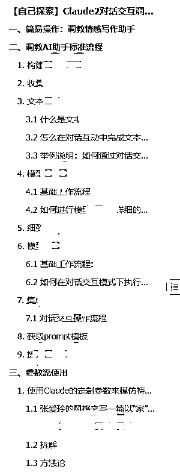

整个教程还需要去反复测试。但对于今天分享的参数流使用技巧，是我这两天验证之后可行的技巧。也是这套教程雏形里面的内容之一。

同时，也大概率是未来支撑整套教程的底层技巧之一。

# 一、什么是参数流提示词

参数流就是通过简洁的参数，代替冗长的博大精深的中文，把我们复杂的人类语言，转化成AI更容易看懂的语言，从而完成Ai提示词的提问技巧。

（名字是我自己起的， 毕竟出来玩总是要有一个方便记忆的名字。）

## 为什么会想到这么一个参数流的方式呢？

在Claude2刚上线的时候。我发了一条风向标，内容是Claude一些内置的参数

https://t.zsxq.com/11oTWXL1k

经过多次使用后，发现这种参数真的非常好用，不管是用于公众号写文，还是问一问回答，输出的结果都比较满意。

然后我就在想这种参数可不可以组合使用呢？

这时我想起了我的猿同事们。

（以下内容仅限于我困乏的知识理解，技术大佬勿喷）

一些羞耻的记忆：

作为一个不会写代码的产品经理，开发同事们在沟通的时候特别喜欢给我看他们代码，对我动之以情。

那天晚上默默观想曾经看的那些代码，我发现其实代码本质上也可以看做是一个个参数，然后通过一些条件、循环、关联等等之类的代码逻辑串联起来的。

为了方便大家顺着我的思路去思考，我来举简单一个例子来辅助理解。

比如下面这个简单的建表代码：

```
create table employee (name1 varchar(20),age int)
```

这里如果类比参数流理解的话：

参数1：创建表

参数2：主题是employee

参数2-1：一列是名字 20字符数

参数2-2：一列是年龄 int类型

接下来，再多想一个场景，假如我们想要在Claude、ChatGPT或者bing中去操作的话会是什么样的提示词呢？

我愚蠢的猜想了一下，不一定更准，但大概、可能是：

请你扮演一个编程高手，你擅长...巴拉巴拉，当我写“期待你的创作”的时候，你将进入这个角色，并开始下面的任务：

现在请你帮我创建一个表，这个表是用来管理员工的，主要有两列信息，一列是名字，限制20字符，一列是年龄，int类型

请根据我的要求创建这个员工表。

期待你的创作！

发现了什么？

对于用参数提问的方式：简洁、直给、准确，这几个词有没有蹦出来？

## 为什么会有这种表现呢？

不知道大家有没有去了解过当前的其他大语言模型的工作原理，它生成的内容是一个词一个词的拼接而成的，可以简单理解为成语接龙（接龙的规则在本篇用不到，暂且不提）。

那我们的描述，会被解析为参数，在组合之后开始接龙。

当我们描述不精准的时候，解析就会出现偏差。接龙的锚点也就出现偏差。

这时输出内容的画风就会逐渐偏离我们预期。举一个例子：

假设我们在玩成语接龙。

开始：

万众一心！（初始设定）

心？ 心心相印！ （正常解析，接的很好！）

印？ 印贼作父！ （画风逐渐混乱）

父？ 父相伤害！ （走远了……）

...

...

各自骂街，下线

## Claude背后的代码逻辑

Claude背后的代码其实也可以理解为：

通过参数化和逻辑组合来实现对自然语言提示的理解和内容生成的。

那么Claude的代码流程就可以概括为:

1.  输入处理: 将自然语言提示进行词法和句法分析,提取关键参数。

1.  参数解析: 根据参数字典,解析参数的语义含义,如情感色彩,场景等。

1.  逻辑组合: 将解析后的参数输入到逻辑组合模块,进行条件过滤、关系关联等逻辑运算。

1.  内容生成: 经过逻辑运算后的参数引导内容生成,生成符合参数要求的文本输出。

所以Claude的代码流程可以看作是:

输入参数化提示 -> 解析参数 -> 逻辑运算组合参数 -> 生成个性化内容

在这一过程中,自然语言提示被参数化,然后这些参数通过代码逻辑运算指导内容生成

## 参数流的江湖踪迹

参数流不仅在Claude中使用，ChatGPT以前就有相似的用法：

公众号爆文航海中，小女子教练分享了一个ChatGPT的指令，大家用了都说好：

根据指令生成故事： "model": "textdavinci002"，

"prompt": "写一个故事，主题为：“男子和妻子结婚7年，嫌弃妻子邋遢要离婚，妻子爽快答应，离了才1天，男子肠子都悔青了”的故事。

"temperature": 1.3，

"max tokens": 4500，

"stop": "\n"，

"n": 1，

"stream": false，

"logprobs": null，

"echo": true

见一叶而知秋，这套参数流完全可行！

不同的是：在Claude中，参数更加适合不会代码的普通人。

Claude支持的定制化参数非常多，是无穷无尽的，你可以自由发挥。

比如：

*   内容(题材、风格、视角等)

*   格式(结构、语言、语序等)

*   风格(诙谐、严肃、通俗等)

*   长度(字数、时间等要求)

*   媒介(广播、电邮、演讲等)

前面说了这么多我的推演思路，有些枯燥，接下来我们来实战！

# 二、场景模拟

#### 以下所有的模拟场景中的参数，都可以直接拿着去用。

#### 但是这只是演示所用，并不适合所有人、所有场景。

#### 一定要打磨出适合自己的参数。

这里我选择了三个实战场景，分别是：

*   参数流提示词生成公众号文章

*   参数流提示词生成公众号爆款标题

*   参数流提示词辅助midjourney的图像构建

为什么会是这三个呢？

因为Ai绘画是我第一个玩上瘾的东西，虽然没有赚到什么钱，但从去年12月到今天也玩的挺爽的，所以这个场景选择是纯爱好。

对于公众号呢，是因为在公众号爆文再续航的第二天，我分享了一个通过Claude拆解情感素材库的技巧，

最终得产出的素材库是这样的

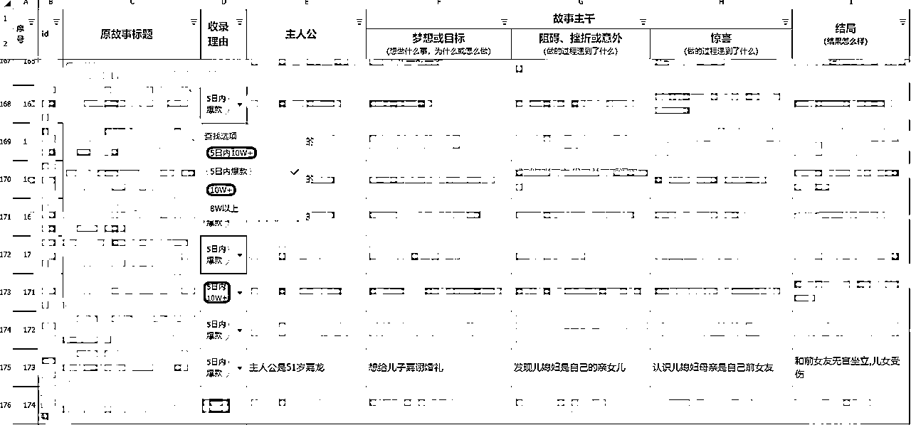

接下来我选的的实战场景是这个素材库的后续——生成文章和标题，这样算完成一个闭环。有始有终~

另外，这次还报名了公众号爆文志愿者，期待与大家相遇，也希望这个方法能帮助同船小伙伴以最短的时间产出最想要的内容，留出来更多的时间去复盘打卡，如果有一组的打卡王者，想想都壮观！

## 场景一：生成公众号文章

根据上面日常拆解整理的素材库，我们随机拼接其中一个选题（由于上面的素材库只展示了一条，我们就先以这一条为例）：

素材库第一列：主人公51岁，

素材库第二列：想要让35岁的年纪越来越大的儿子赶紧娶媳妇。

素材库第三列：可笑的是发现儿子娶的媳妇竟然是自己的亲生女儿，

素材库第四列：原来儿媳的母亲是自己的初恋女友，

素材库第五列：最终儿子的婚礼没有成功，两家都沉浸在悲伤之中

### 对于已经有了选题的情况，我曾经的笨方法是：

*   自己先把这个故事简介编出来，然后把简介给到Claude，并说一大堆限制条件。

*   一般结果并不能直接用。因为Claude会把设置在后面的情节提前说出来。

*   为了可控，我每次都不得不在上一步的基础上，分阶段给出故事简介让Claude写。每一段的提示词都要一百来字。

这样得到的文章好了很多，但代价是一篇情感文章就要花费40分钟左右，有时候遇到Claude抽风，时间会拉的更长。

每天这一套流程下来，虽然有了收入，但总觉得身体的营养跟不上。特别是一天更5篇文章时候，人都已经虚弱了。

### 使用参数流提示词的做法：

#### 整体生成

我没有训练具体的文章风格，生财里很多大佬已经分享过了，大家可以去翻看学习。

为了简单省事，达到基本的演示效果，这里我们就直接拿出名人来用。

##### 【提示词】

/theme 主人公51岁，想要让年长的儿子赶紧找个媳妇。可笑的是发现儿子找的媳妇竟然是自己的亲生女儿，原来儿媳的母亲是自己的初恋女友，最终儿子的婚礼没有成功，两家都沉浸在悲伤之中

/first_person

/style 模拟张爱玲

/genre 散文

/author 本文作者生财小透明李拜日

/gender male

/vocabulary 运用精美文学词汇

请根据以上参数，写出一篇情感故事文章

##### 【底层逻辑】

我来解释一下这套参数的逻辑：

1.  /genre 和 /theme 定义创作类型和主题范围,确保生成内容与作家代表作一致。

1.  /style 指定目标作家,让Claude明确要模仿的语言风格方向。

1.  /first_person 是为了确定文章的视角

1.  /author 并不是为了抖机灵强调这套提示词是我写的，而是为了避免Claude把自己当成张爱玲，他会有这个毛病，我要让他知道，他不是张爱玲，是另一个作家，只是为了模仿张爱玲的风格

1.  /gender male 我要给他叙事人的性别

1.  /vocabulary 词汇要美

我在前面说了Claude支持的定制化参数非常多，是无穷无尽的，你可以自由发挥。

先来解释一下这句话我们再往下说。

可能有些朋友会迷惑，我这些英文参数还是不够详细，是从哪里来的呢？ 看着是挺有意思的，但是并不知道怎么上手。

Claude的参数是支持自定义的。也就是说，我想表达什么，就用“/+这个单词“就可以了。

*   比如我想要给故事设置一个地点为天安门，那就是地点的单词“/location 天安门”。

自己去组合单词也可以，也就是说你可以造词，只要是英语就行，因为英语是训练最多的语言，更有助于Claude理解。

但是要注意的是，组合的单词尽量用“_”来连接，不要用空格。

*   比如基于某部分创作“/based_on_part”

这是因为这个参数流是为了模拟代码的形式，我们所看到的每一条信息，在数据库中，就是以类似这种形式的。

*   比如一张记录小樱减肥时期体重的表单，那她最轻的时候，在数据库中被存储的就是"min_weight",最重的时候，在数据库中存储的就是“max_weight”。

*   不知道换成中文好不好理解，我想要描述一个人的最强时刻，那就是“人生_巅峰”，我们就是在通过英文模拟这种形式。

##### 【成果展示】

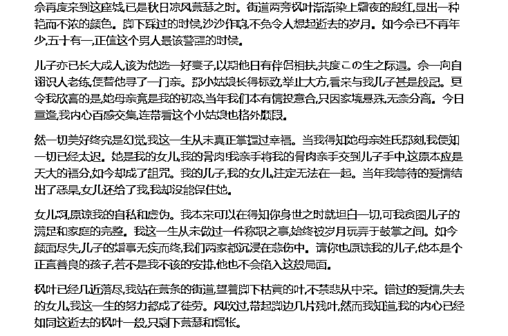

旧情凋零

作者:生财小透明李拜日

余再度来到这座城,已是秋日凉风萧瑟之时。街道两旁枫叶渐渐染上霜夜的殷红,显出一种艳而不浓的颜色。脚下踩过的时候,沙沙作响,不免令人想起逝去的岁月。如今余已不再年少,五十有一,正值这个男人最该警醒的时候。

儿子亦已长大成人,该为他选一好妻子,以期他日有伴侣相扶,共度余生之际遇。余一向自诩识人老练,便替他寻了一门亲。那小姑娘长得标致,举止大方,看来与我儿子甚是般配。更令我欣喜的是,她母亲竟是我的初恋,当年我们本有情投意合,只因家境悬殊,无奈分离。今日重逢,我内心百感交集,连带看这个小姑娘也格外顺眼。

然一切美好终究是幻觉,我这一生从未真正掌握过幸福。当我得知她母亲姓氏那刻,我便知一切已经太迟。她是我的女儿,我的骨肉!我亲手将我的骨肉亲手交到儿子手中,这原本应是天大的福分,如今却成了詛咒。我的儿子,我的女儿,注定无法在一起。当年我等待的爱情结出了恶果,女儿还给了我,我却没能保住她。

女儿啊,原谅我的自私和虚伪。我本来可以在得知你身世之时就坦白一切,可我贪图儿子的满足和家庭的完整。我这一生从未做过一件称职之事,始终被岁月玩弄于股掌之间。如今颜面尽失,儿子的婚事无疾而终,我们两家都沉浸在悲伤中。请你也原谅我的儿子,他本是个正直善良的孩子,若不是我不该的安排,他也不会陷入这般局面。

枫叶已经几近落尽,我站在萧条的街道,望着脚下枯黄的叶,不禁悲从中来。错过的爱情,失去的女儿,我这一生的努力都成了徒劳。风吹过,带起脚边几片残叶,然而我知道,我的内心已经如同这逝去的枫叶一般,只剩下萧瑟和惆怅。

我们发现，这里模仿的风格有些文言式白话，并不适合我们现在写文章，而且更重要的是字数不够。

这里可以有两种方式处理：

*   一种是直接添加字数限制的参数

*   另一种就是分批生成。

这里我们换一个方式，分批生成，来获得更灵活的操控。

#### 分段拆解

##### 开头部分

这次我们来尝试一下莫言的风格

###### 【提示词】

/theme 主人公51岁，想要让年长的儿子赶紧找个媳妇。可笑的是发现儿子找的媳妇竟然是自己的亲生女儿，原来儿媳的母亲是自己的初恋女友，最终儿子的婚礼没有成功，两家都沉浸在悲伤之中

/part1_theme 主人公51岁

/paragraph_total 2

/style 模拟莫言

/genre 散文

/author 本文作者生财小透明李拜日

/memoir

/emotion 追忆，痛苦，懊悔

/conflict

/foreshadowing

/length 200字

/output part1_theme

请根据以上参数，写出一篇200字的情感故事的第一部分开头

###### 【底层逻辑】

*   /theme 首先我要让Claude知道我要生成的文章是什么选题 ，大概是什么样的一个故事

*   /part1_theme 告诉他先来生成这个选题的第一部分，也就是素材库的第一列

*   /paragraph_total 因为我要写200字的开头，所以我试着让他给2个段落

*   /style 和/genre 这两个在上面说了定基调的

*   /memoir /conflict /emotion 和 /foreshadowing在我的设想中，我想要作者以回忆的方式来表达对于某事的懊悔，设置点儿冲突，埋下伏笔，当做小悬念，引出后面的内容

*   /length 200字 限定这部分的字数

###### 【成果展示】

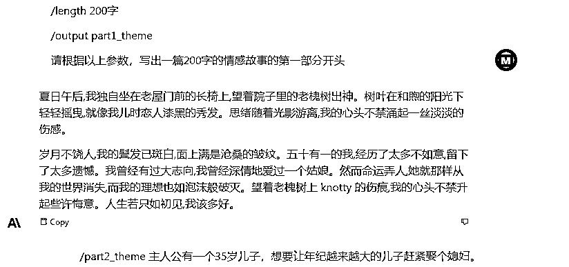

夏日午后,我独自坐在老屋门前的长椅上,望着院子里的老槐树出神。树叶在和煦的阳光下轻轻摇曳,就像儿时恋人漆黑的秀发。思绪随着光影游离,我的心头不禁涌起一丝淡淡的伤感。

岁月不饶人,我的鬓发已斑白,面上满是沧桑的皱纹。五十有一的我,经历了太多不如意,留下了太多遗憾。我曾经有过大志向,我曾经深情地爱过一个姑娘。然而命运弄人,她就那样从我的世界消失,而我的理想也如泡沫般破灭。望着老槐树上蔓延的伤痕,我的心头不禁升起些许悔意。人生若只如初见,该多好。

这个结果已经非常不错了，再根据开幕雷击技巧人工润色一下，可以拿去用了。

而且就算不改，一些10w+的文章开头还不如这个呢。

我们继续沿着这条线进行下去：

##### 第二部分

###### 【提示词】

/part2_theme 主人公有一个35岁儿子，想要让年纪越来越大的儿子赶紧娶个媳妇。

/based_on_part 1

/style 模拟莫言

/genre 散文

/author 本文作者生财小透明李拜日

/emotion 烦闷、纠结、担忧等情感

/action 争吵

/logic 段落间畅达衔接

/length 300字

/output part2_theme

请根据以上参数，写出一篇300字的情感故事的第二部分

###### 【底层逻辑】

这部分再解释一下逻辑，后面几部分就不解释了，和这部分差不多。

*   /part2_theme 告诉Claude先来生成这个选题的第二部分，也就是素材库的第二列

*   /based_on_part 因为我们已经写完了第一段，为了让他不跑题，我需要让他在第一段的基础上写下去

*   /style ，/genre ，/author ，/emotion 这几个在前面说过，不啰嗦了，不过我还想多说一句，为了避免他忘掉，这几个参数，在每个提示词中都尽量不要省略，

*   /action 我考虑这个场景，应该是一个老父亲不停的叨叨儿子，儿子顶顶嘴， 所以给它设置一个吵架的情节

*   /logic 保证衔接顺畅

*   “请根据以上参数，写出一篇300字的情感故事的第二部分”其实这句话写不写都行，我为了起强化作用，还是再次强调一遍。

###### 【成果展示】

我有个35岁的儿子,叫张山。他性格跳脱,与我年轻时的严肃刻板大相径庭。面对这么一个儿子,我烦闷得很。

张山整日无所事事,游手好闲。我催他快成家,他只是笑笑带过。我气得七窍生烟,拉他到屋里好一通说教。

“你这样糊涂虚度一生,要把你我的老脸往哪搁!”我怒气冲冲。

“爸,你这是小题大做了。我开开心心的,成家有什么好急的。”他倒是一脸悠然。

“还好意思说!你现在的样子像话吗?”我恨铁不成钢,“整天游手好闲,对生活没有半点上进心!”

“哎呀,爸,别这么激动嘛。我会有自己的打算的。”他笑吟吟地回了一句。

我气坏了,一拳砸在桌上:“别胡来!你给我立刻去给我娶媳妇!娶个媳妇摆正自己,知道吗?”

##### 第三部分

###### 【提示词】

/part3_theme 可笑的是发现儿子娶的媳妇竟然是自己的亲生女儿

/based_on_part 1,2

/style 模拟莫言

/genre 散文

/author 本文作者生财小透明李拜日

/emotion 震惊，慌乱，迷茫

/logic 段落间畅达衔接

/conflict 故事冲突

/length 500字

/output part3_theme

请根据以上参数，写出一篇500字的情感故事的第三部分

###### 【成果展示】

我正觉得心安理得,谁知一场好大的乌龙眼看就要来了。

前些日子张山终于给我带回一个小姑娘,欢天喜地地说要娶她。我还没细看那丫头就欣然同意了,觉得儿子总算开窍了。

订婚那天我好生打量那丫头,只见她穿红彤彤的喜服,显得分外漂亮可人。她抬起头来见我,我忽然吃了一惊,她怎么长得跟我儿时的恋人刘英是那么像?我瞪大眼睛定睛细看,惊出一身冷汗。

我赶紧打听她的来历,这才知她是刘英的亲生女儿!原来刘英当初怀孕被拐走之后,在外地生了女儿就不知去向。我这才明白天意弄人,竟让我的儿子要娶我的初恋给我生的女儿!

我脑中轰隆隆响成一片,手足无措起来。这要是把这桩亲事办下去,那不是要乱伦了吗?我的儿子要娶自己同父异母的妹妹!

##### 第四部分

###### 【提示词】

/part4_theme 原来儿媳的母亲是自己的初恋女友，

/based_on_part 1,2,3

/style 模拟莫言

/genre 散文

/author 本文作者生财小透明李拜日

/cliffhanger 故事高潮

/emotion 震惊，慌乱，迷茫

/logic 段落间畅达衔接

/length 500字

/output part4_theme

请根据以上参数，写出一篇500字的情感故事的第四部分

###### 【成果展示】

我整夜睡不着觉,脑子乱哄哄的。我思前想后,终于决定还是要把真相告诉张山和那丫头。

第二天我把两人叫来,艰难开口:“儿子,丫头,我有件事不得不告诉你们......她的母亲,就是我儿时的恋人刘英。”

“什么?!”两人同时惊呼。

“就是这样的。我们年少时情投意合,本要长相厮守,却因家境悬殊无奈分离。没想到今日你们要结为夫妻,这是命运弄人。”我叹了口气。

“天哪,怎会有这等巧合!”张山捂住了嘴。

我望向那丫头,眼前浮现出年少时刘英的倩影。那抹身影是那么熟悉,又是那么陌生。我心中百感交集,旧情在这一刻涌上心头。

“儿子,我理解这对你们打击很大,但血浓于水,你不能娶自己的妹妹......”我艰难地说。

“不,这不可能!”张山情绪激动。

“我们已经订婚了,怎能就此分手!”丫头也是眼圈通红。

我知他们心有不忍,但有些事注定无法违背。我望天长叹,命运啊命运,你对我究竟还有多少折磨!

##### 结局部分

###### 【提示词】

/part5_theme 最终儿子的婚礼没有成功，两家人都沉浸在悲伤之中

/based_on_part 1,2,3,4

/style 模拟莫言

/genre 散文

/author 本文作者生财小透明李拜日

/ending 故事结局

/emotion 伤感，痛苦，迷茫

/logic 段落间畅达衔接

/length 300字

/output part5_theme

请根据以上参数，写出一篇500字的情感故事的结局

###### 【成果展示】

最终,在种种无奈之下,我儿子的婚事被迫取消了。

订婚仪式已经办得热热闹闹,婚礼却在眨眼间不了了之。亲朋好友都感到十分疑惑,纷纷来问究竟。我只得含糊其辞,搪塞过去。

从那天起,张山整日郁郁寡欢,再无从前的意气风发。我知道他心中难过,却也无能为力。我心中也怅然若失,为他们未能在一起感到无尽惋惜。

我独自一人坐在湖边钓鱼,看着水面上荡漾的涟漪。一阵风吹来,吹散了湖面上的倒影。我不禁叹息,我们都成了命运轮回的牺牲品,这场感情的惨剧,注定在禁忌下无疾而终。

望着波光粼粼的湖面,我感到前所未有的倦意和失落。命运的齿轮碾压过我们所有人,我又能奈何呢?只能接受这残酷的现实,在时间长流中缅怀逝去的爱情。

到这文章就已经全写完了，整合到一起，稍微改点就能用了。 要是走量的话，不改也能用。

## 场景二：参数流提示词生成公众号爆款标题

现在文章有了，我们需要生成标题。怎么办呢？

直接去搜索一些爆款标题，拿回来让Claude拆解学习。

### 【提示词】

/reference_titles

title1：这里放爆款标题，避免误伤自己人，原内容删掉了

title2：这里放爆款标题，避免误伤自己人，原内容删掉了

title3：这里放爆款标题，避免误伤自己人，原内容删掉了

title4：这里放爆款标题，避免误伤自己人，原内容删掉了

title5：这里放爆款标题，避免误伤自己人，原内容删掉了

...

...

/source 这里放航海手册开幕雷击 ，篇幅太长，现在我在这篇文章找内容已经很费劲了，避免水字数，略

/analyze_features

/target_article 这里放上一步写好的文章，因为篇幅太长，略了

请基于以上爆款标题（reference_titles参数）样本,并根据开幕雷击技巧（/source 参数）分析结果（analyze_features参数）提取的关键特征，为目标文章（target_article参数）生成10个符合爆款逻辑的标题

### 【底层逻辑】

1.  /reference_titles 输入爆款文章标题样本，用来分析用

1.  /source 给Claude一个引用学习的资源，作为分析标题的底层知识

1.  /analyze_features 让Claude分析标题特征并输出

1.  这样Claude提供分析结果:

1.  /target_article 接着给它指定目标文章，也就是我们前面写好的文章

1.  给出触发指令

【成果展示】

我已经仔细阅读了你提供的爆款标题样例和开幕雷击技巧的分析,这里是我尝试为目标文章生成的10个标题:

1.  51岁男子为儿子相亲竟找自己女儿!结局令人泪奔

1.  男子一手促成儿子要娶自己私生女,最后婚事无疾而终

1.  男子让儿子娶了自己女儿还浑然不知,直到订婚前夕真相大白

1.  男子让儿子娶初恋前女友的女儿,订婚后才发现是自己女儿

1.  儿子新娘是父亲私生女,婚礼前知晓真相双方陷入绝望

1.  男子安排儿子娶自己私生女当儿媳,最后娶亲惨败

1.  男子让儿子娶自己失散多年女儿,两人差点乱伦

1.  男子让儿子娶了自己女儿,婚期前知道真相,全部人陷入悲痛

1.  男子让儿子娶了自己女儿,两人差点乱伦,最后婚事泡汤

1.  男子安排儿子要娶自己私生女当新娘,最后婚礼无疾而终

为了演示，我找的例子还比较少，但结果算可以，不满意的话就多滚动几次，挑出喜欢的

## 场景三：参数流提示词辅助midjourney的图像构建

关于ai绘画的辅助，我简单写了一个模板，不是很标准，还需要大家在使用过程中逐渐去总结调整。

我想说的是，这种辅助只是用用可以，或者新手不知道都应该怎么写prompt，用它来帮帮忙。

但是玩了久了你会发现，图还是要一点一点调出来，特别现在midjourney出了很多功能，比如zoom， Vary（Region）等。

不要对这个模板工具产生依赖。

当然还有一种情况非常适合用，就是你需要大量作图找不到新的灵感的时候可以用它来解决你的困扰。

之前参加了一堆薄码大佬的奥迪产品小红书宣传项目，那时候项目组只给了一些宽泛要求，那具体怎么来做他们会过审谁知道呢。

这时候Chatgpt和Claude帮我完成了很多。别人提交5组，我提交20组，别人需要在针对需要微调的作品中某条一次次调整，我直接在大量反馈作品中挑出过审的就可以了。用数量搏出了过审概率。还获得了后面单独约稿的机会。

我这里举了两个例子：

*   肖像

*   产品

来！开始！

### 举例一：肖像

#### 【提示词】

/structure 图片形式,构图,景别,主题,风格,画质,灯光,渲染

/theme 美女

/style 摄影照片

/extract_prompts

/compose_prompt

/length 50 words

/prompt_output_language English

/other_output_language 简体中文

请基于以上参数提示,定义Prompt结构（structure）,输入“美女”主题,自动提取对应Prompt要素,并组合输出完整的Midjourney图像生成Prompt。

#### 【生成结果】

A close-up portrait of a beautiful young woman outdoors. She has flawless glowing skin, rosy cheeks, and bright eyes. Her long, dark hair flows softly around her shoulders. Sunlight creates a rim light effect on her hair and delicate features. Vivid colors, intricate details, shallow depth of field.

一张近距离外拍美女写真肖像。她有晶莹光滑的肌肤,粉嫩脸颊,明亮双眸。长长的黑发柔软披散在肩上。阳光在她发间和精致脸庞上打下一圈光晕。画面色彩鲜艳,细节精致,背景虚化柔化。

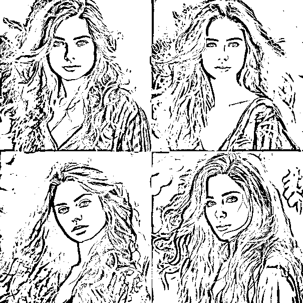

你可能发现了，对于画质并没有很好的表现出来，我们对模板的参数做一下微调

/structure 图片形式,构图,景别,主题,风格,画质（picture_quality）,灯光,渲染

/picture_quality 8k,4k,hd,uhd

/theme 美女

/style 摄影照片

/extract_prompts

/compose_prompt

/length 50 words

/prompt_output_language English

/other_output_language 简体中文

请基于以上参数提示,定义Prompt结构（structure）,输入“美女”主题,自动提取对应Prompt要素,并组合输出完整的Midjourney图像生成Prompt。

A close-up portrait of a beautiful young woman outdoors. She has flawless glowing skin, rosy cheeks, and bright eyes. Her long, dark hair flows softly around her shoulders. Sunlight creates a rim light effect on her hair and delicate features. Vivid colors, intricate details, shallow depth of field. 8K ultra-high resolution.

一张近距离外拍美女写真肖像。她有晶莹光滑的肌肤,粉嫩脸颊,明亮双眸。长长的黑发柔软披散在肩上。阳光在她发间和精致脸庞上打下一圈光晕。画面色彩鲜艳,细节精致,背景虚化柔化。图像达到8K超高分辨率。

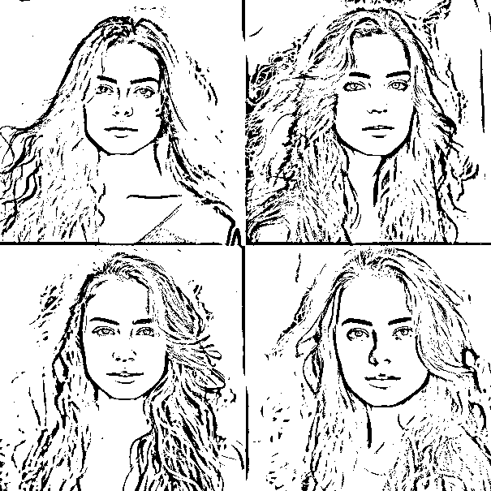

### 举例二：产品

#### 【提示词】

/structure 图片形式,构图,景别,主题,风格,画质（picture_quality）,灯光,渲染

/picture_quality 8k,4k,hd,uhd

/theme 一件浅色碎花连衣裙

/style 电商产品照片

/extract_prompts

/compose_prompt

/length 50 words

/prompt_output_language English

/other_output_language 简体中文

请基于以上参数提示,定义Prompt结构（structure）,输入“一件浅色碎花连衣裙”主题,自动提取对应Prompt要素,并组合输出完整的Midjourney图像生成Prompt

#### 【成果展示】

A light pink floral print sundress photographed hanging against a white background. The dress has thin shoulder straps, a v-neckline, and a flowy A-line skirt. Soft diffused lighting illuminates the details of the delicate floral pattern and sheer fabric. Crisp focus on the dress, blurred background. 8K ultra-high resolution product photo.

一件淡粉色碎花连衣裙悬挂在白色背景上拍摄的电商产品照片。这件裙子有细肩带,V字领口,及A字型飞扬的裙摆。柔和的散射光线照亮裙子上精致的花朵图案和薄纱质感的细节。图像聚焦凸显裙子,背景模糊柔化。达到8K超高清分辨率的商品图片。

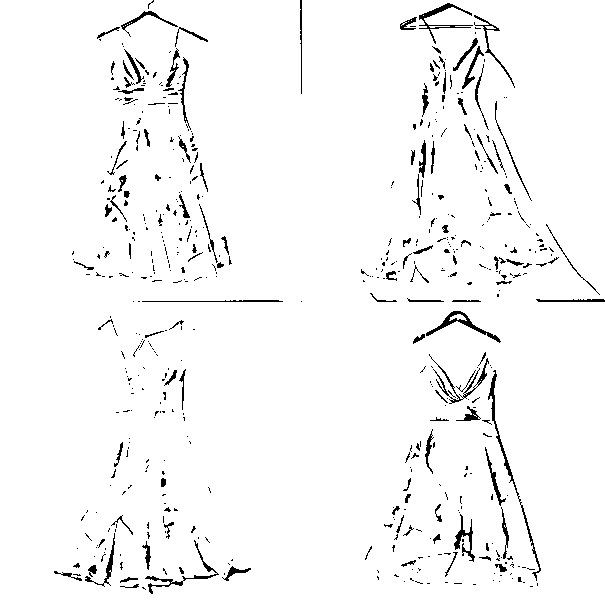

哎呀！图有点素是不是，那咱给他个模特？

### 提示词：

/structure 图片形式,构图,景别,主题,风格,画质（picture_quality）,灯光,渲染

/picture_quality 8k,4k,hd,uhd

/theme 一个18岁的韩国女孩穿着浅色碎花连衣裙

/background 公园

/style 女装产品模特摄影照片

/extract_prompts

/compose_prompt

/length 50 words

/prompt_output_language English

/other_output_language 简体中文

请基于以上参数提示,定义Prompt结构（structure）,输入“一个18岁的韩国女孩穿着浅色碎花连衣裙”主题,自动提取对应Prompt要素,并组合输出完整的Midjourney图像生成Prompt

【生成结果】

An 18 year old Korean girl modeling a light pink floral sundress in a sunny park. She has long black hair and a slender figure. The flowy dress has thin straps, a v-neckline, and an A-line skirt that sways in the breeze. Soft lighting illuminates her smiling face and the details of the floral pattern. Shallow depth of field, vivid colors, 8K resolution fashion photo.

一位18岁韩国女孩在阳光公园里试穿一件淡粉色的碎花连衣裙的女装照。她留着长长的黑发,身材窈窕匀称。这件落地的裙子有细肩带,V字领口,及A字型轻飘的裙摆在微风中飞扬。柔和的光照亮了她的笑脸和裙子上精致的花朵图案。景深浅化,色彩鲜明,8K高清女装产品照片。

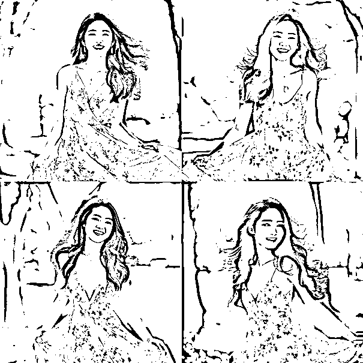

效果不错，阳光很白，很刺眼，很治愈~

# 三、对于这套参数流，我能看到什么

以下内容是我自己突发奇想的，算不得规划，只能说是一个想法。

第一阶段：也就是现在我写出来的这个阶段，属于自己刚发现这个好玩的方式，通过简单的尝试，不断打磨参数组合，尽可能多覆盖更多的使用场景，纯属于好玩

第二阶段：对于各个场景都已经熟练，开始可以针对一些需求做定制化的参数，初步展现价值。也就是我目前对于成为指令工程师这个角色定的第一个目标。 每一个对话都是一个单独的解决需求的工具，或者说我可以理解它为一个简易的APP，主要收益来源于定制部署

第三阶段：当做的定制场景足够多的时候，对于各个场景可以尝试抽象组合，对于可复用的模板拼接一个个标准化的功能。那么前面也说了，对于每一个对话可以看成一个简易的APP，通过一个账号，这些使用标准化模板的对话组合到一起，那是不是可以看做一个简易的SaaS产品，可以针对某一特定角色，甚至某一特定行业提供一套全方位的完整的解决方案，收益就来源于账号出售、定制、维护以及二次定制，虽然这样业务会看起来很重，但胜在操作简单，实际落地可能不是那么难。

但是这里要提的是：所有的设想都是基于别人的平台产生的一个美好幻想。一旦平台有一些规则变动，那么很可能一瞬间，轰~ 塌掉！ 这是致命的风险。

也许是过于理想，也许是盲目自嗨，也许是坐井观天，但这是截止到今天为止，基于我当前搜集的浅显知识和无知无畏的猜想，作为一个不会技术的普通人能够看到的、可以实现的画面~

敲到这里，我不知道这篇文章算不算干。我手指稍微回回弯，咱继续叨叨点其他的。

# 四、当前的困惑

在使用对话调教过程中，我也遇到了一些困难。

我们知道，Claude没有ChatGPT那种修改提示词的按钮，那么实际操作的时候就会发现，你的对话会不断往下拉长，当达到长度限制之后，就会和bing一样，让你开启新的对话。

这就有可能会出现一个问题：假如我们辛辛苦苦调教了一通，马上调教好一个模板，但是达到长度限制了。这时候怎么办呢？怎么样能在一个新的对话里面接着当前对话的基础继续下去呢？

我尝试了迁移学习的方法，既然我们的对话可以被存储历史记录，那么是不是可以把对话中的信息单独让Claude存起来，我在新的对话里面通过指令调用呢？

结果是我想的简单了。在新的对话里面，并不能查看到我其他对话的存储记录。

所以如果哪位大佬有好的办法，特别是对于不懂技术的普通人来说可以操作的办法，烦请告知，感谢~好人一生平安！

# 五、一个约定

在这里还想和大家做一个小小的约定，或者更准确的说是一个请求：

如果真的有大佬喜欢这种参数流方法，并去尝试实操，那么大佬们在尝试参数流的方法时，发现了什么好用的技巧，或者一些坑，希望能回来这个帖子下面留言一下，让价值无限放大，我们一起来完善~

比如说:

*   XX参数在XX场景好用，

*   xx参数怎么写效果更好。

*   XX参数用XX逻辑连接更准确。

...

...

...

期待你们的反馈，一起进步~

# 六、拓展

再多说一些基础东西，可能有些大佬并没有用过Claude，接下来可能需要注册，我来把一些简单的问题直接写出来,可能不是很全面，我能想到什么写什么吧~

## Claude注册

登录官网Claude.ai

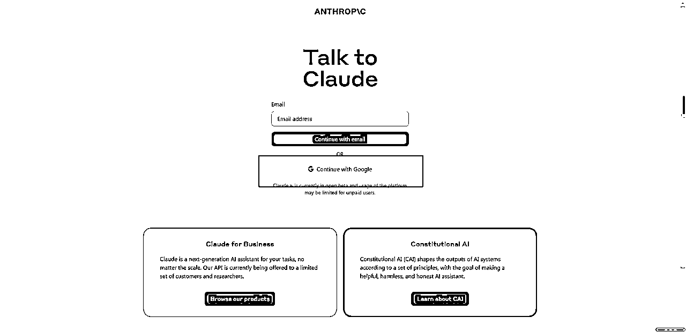

直接通过谷歌邮箱登录就可以了。

接下来会需要你来接收一下手机验证码，接码平台我使用的是sms-activate.org

进去之后，先注册登录，然后在右上角（下图标1）处充值，使用支付宝即可

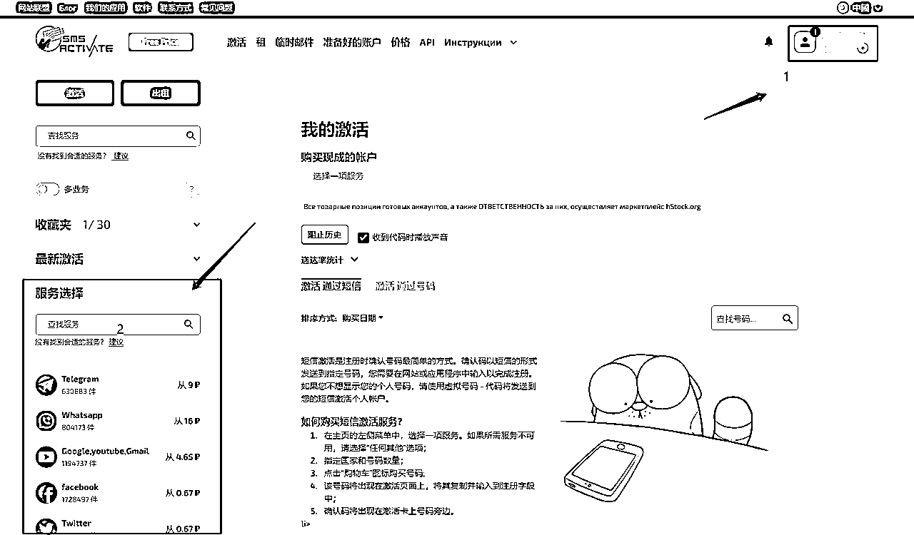

充值之后，在上图右下角找到Claude

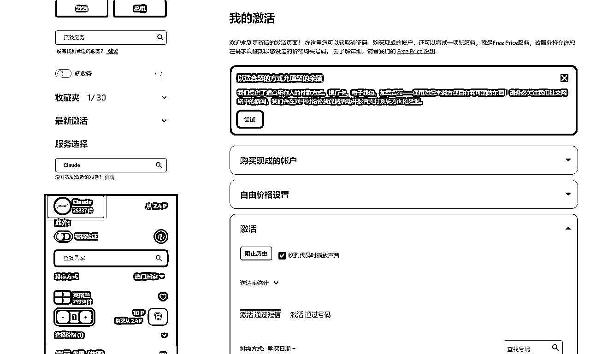

选择美国之后（现在有很多国家可以收验证码了，在Claude看一下），买一个，然后右边就会出现号码。

把号码复制之后，填到Claude 短信验证的输入框中， 等几秒之后，接码平台这边就会收到验证码。

输入验证码之后，整个注册流程就彻底完成了。

## Claude验证码问题

注册完了Claude之后，并不是说之后就不会出现短信验证这个环节了。

这几天我总是出现反复短信验证这种问题，我看到很多人在其他星球也有提问。

我来解释一下：造成频繁出现短信验证的原因是因为你的使用习惯触发了Claude的账号安全预警机制。

比如，

1.  更换常用网络：你一直在A网络下使用Claude，但是今天突然你去了别的地方，换了新的网络，这时候就会需要你来做短信验证。

1.  更换常用设备：你一直在电脑上使用Claude，但是这天你突然换成手机登录了，那就会触发短信验证

拿我这几天的使用来说，清晨我会使用手机登录，到了白天使用电脑登录，有时候出门了，还会使用移动网络登录。

所以我平均一天有时候会出现3次验证。

好的解决办法是，一直不换网络或者设备，如果真的有必要，那就多创建几个号，一个设备一个账号，一个网络一个账号。

## 唤醒，探索边界

大家在看其他大佬分享的帖子时候，会发现他们总是会在开头先询问：XXX，你知道XX吗？

这不是无用的动作。

还是拿midjourney（AI绘画工具，前面说过）的使用来举个例子吧。在使用中我们会遇到这样的场景：

在A对话里面，我们和Claude聊的很好，对于midjourney的各种知识Claude都能侃侃而谈。

然后有人就会以为，好了，它什么都懂，牛逼。

紧接着就去一个新的对话里面，直接说“Claude，请你给我十个用于midjourney的风景描述prompt”

然后Claude就会回复：对不起，我只是一个由Anthropic公司开发的AI助手，我并不知道midjourney，巴拉巴拉巴拉...

然后你就会说，靠，这什么玩意，傻逼

其实他想说的是：我只是个孩子，听不懂你在说啥

所以在与AI对话之前，一定要把双方拉到一个固定的范围内。

我们都在电商平台买过东西。都会有和客服沟通的经历。

假如：

张三想买一个卖家的辣椒面，他想知道这个辣椒面辣不辣，做烧烤好不好用。

然后他联系客服，上来直接就问：请告诉我，你家这辣椒面好用吗。

客服怎么答？

客服会想：大哥你啥意思啊？什么好不好用？你是想辣嘴呀还是辣P啊？你是想内用啊还是外敷啊？

想不明白，那最简单的方法就是...

在他们标准的话术中抽出一句给你：您好亲，我们的辣椒面是xxxx,有着XXX的优点，巴拉巴拉巴拉...

熟悉不？

* * *

以上就是我分享的内容，好用来赞！

我是李拜日，感恩读完！