# AiGC运营：小红书爆款概率预测分析（一）

> 来源：[https://txt6wm3b04b.feishu.cn/docx/F1v8drS3OoE3zyxCULmcukaPntZ](https://txt6wm3b04b.feishu.cn/docx/F1v8drS3OoE3zyxCULmcukaPntZ)

我是越越，一位AiGC工具人，一位小红书全平台6w+粉的新生博主。

我出生在世界小商品的海洋中，致力使用AiGC技术服务生活、工作。

荣幸成为生财九月航海的 GPT+自媒体 大船的志愿者，一起下海弄脏手！

AiGC运营自媒体平台的策略是可行、可落地、可提高效率的！

但是AiGC作为辅助工具，更多的是人工参与，不断调教、不断摸索才能在Ai蓝海中深耕！

本文提供思路和方向，该模型不够完善需要继续调教！

# 传统小红书运营SOP痛点

1.  获取运营数据成本过高，自身不具备数据分析能力。

1.  传统方法寻找对标账户，样本数据不够精准、科学。

1.  平台笔记风同质化加剧，内容缺乏创新体现差异化。

1.  笔记文案制作头痛不堪，主页装修千篇一律易违规。

# AiGC帮助你解决这些问题

1.  透视运营数据，调整运营策略。

1.  高效寻找对标，快速切换赛道。

1.  紧跟大盘趋势，抢流量创笔记。

1.  高效装修主页，节省时间财力。

# 测试数据获取与初步处理

## 明确需求点

根据自己的实际需求确定数据类型

【关键词】：你需要进入赛道的关键词。

【延伸关键词】：主关键词延伸的热词，可从搜索框下拉表中获取。

【带货笔记】：与你发布笔记目的相关笔记，从事带货则需要寻找带货博主为对标。

【商业笔记】：与平台合作的带货笔记，该笔记质量高通常可以对标。

【低粉爆文】：低粉爆文笔记一般有“内容”上的优势可以借鉴，是寻找对标账户最快的途径之一。

当约束条件越多时结果数越少，往往会导致样本数不够充分

导致原本优秀的博主被遗漏因此可以适当从【带货笔记】、【商业笔记】处放宽条件。

## 使用八爪鱼获取数据

数据需要具备可靠、大量、实时的特点，可以通过从第三方数据平台获取公开的实时数据

高效搜集数据，八爪鱼采集器免费使用、稳定可靠，无代码编写规则采集，适合小白操作

具体软件使用方法参考官方教程：https://www.bazhuayu.com/tutorial8/hottutorial/gnd


本文以某数据平台为例演示：此数据仅用于演示，请合法使用数据平台！！！

用户可以通过首页中“拉新领会员”获取三天的个人版体验资格，如需更进一步分析数据建议购买企业版

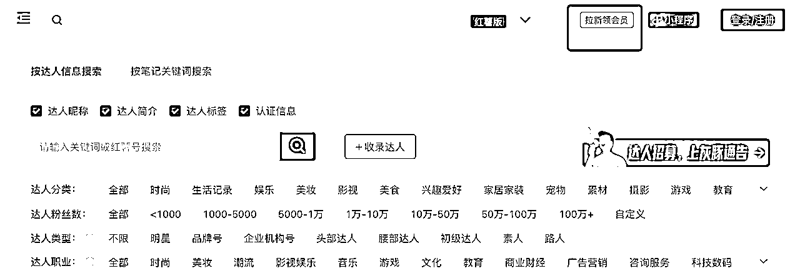

采集的字段名与GPT分析时用的字段名相关，务必做到统一，我自己使用的采集字段名文件：

采集笔记、博主数据，具体方法自己学习，我可以提供技术规则指导，生成的数据文件统一使用csv格式保存。


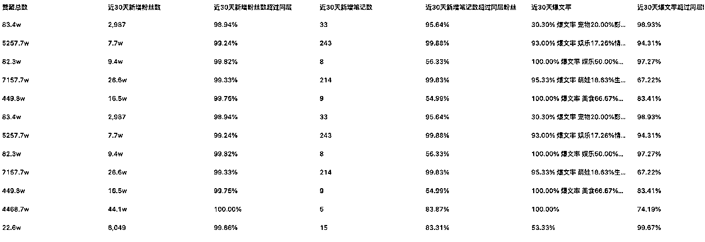


## 获取平台大盘流量数据

使用近期话题、热词数据能很好说明平台流量趋势

我们需要收集以下公开数据：选取最近四周的话题增量榜、热词增量榜、大盘流量榜进行导出。


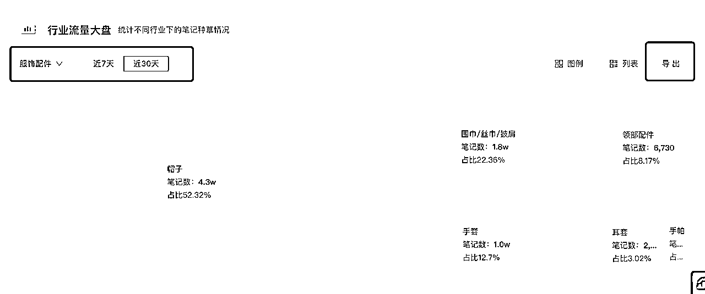

## 数据文件整理归纳

为了后续高效进行数据分析因此需要将数据文件进行编号、归纳。

1.  【话题】命名为【话题2.csv】、【话题3.csv】、【话题4.csv】、【话题5.csv】

1.  【热词】命名为【热词2.csv】、【热词3.csv】、【热词4.csv】、【热词5.csv】

【笔记博主数据集】命名为【原始数据A.csv】

为了方便导入文件因此将建立单独的文件夹存放，文件夹名称应该简单明了。

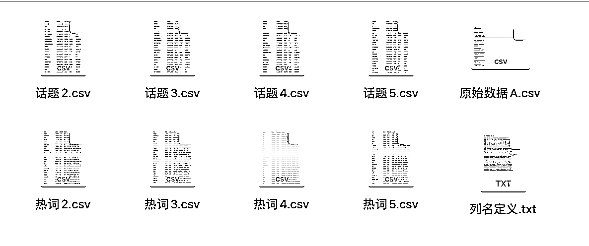

## 数据清洗

数据清洗是数据预处理的重要步骤，目的是识别并纠正（或删除）数据中的错误和不一致，以提高数据质量。

”数据清洗“可以让GPT完成，也可手动使用Excel操作，教程参考数据清洗教程，及时保存原始文件、新文件。

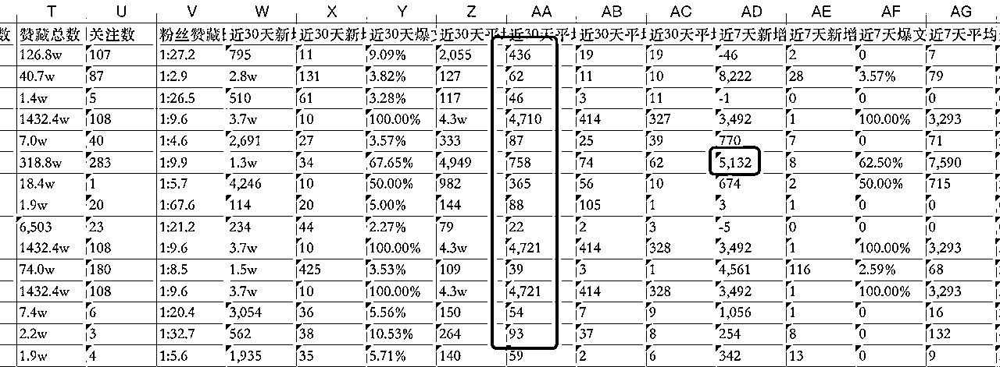

# ChatGPT介入

## ChatGPT平台初始设置

Code Inter preter基于GPT-4，帮助你做数学运算、绘制热力图、做数据分析等它生成的内容质量会非常优秀。

Chat GPT环境准备：

神奇的魔法——开启GPT PLUS模式——选择Code Inter preter（代码解释器）——上传数据集

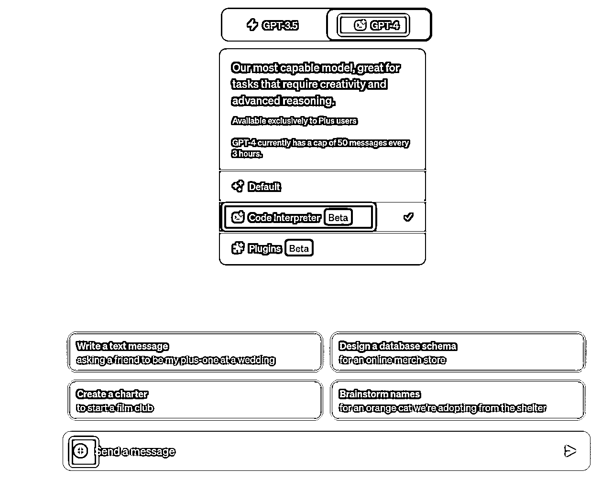

## 上传数据文件至ChatGPT平台

点击上传文件（最多十个文件，支持多数格式文件），一定要分步骤导入数据集：


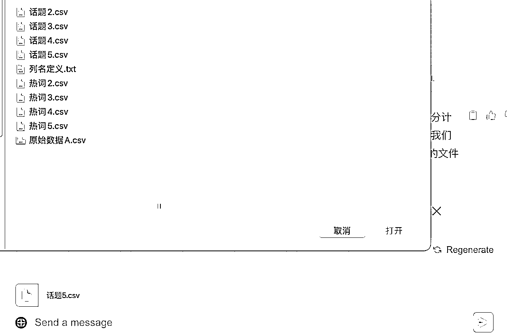

## 发送数据指令ChatGPT学习

向ChatGPT发送以下指令，学习数据集内容并进行反馈，接下来每一步都需要反馈。

```
背景：小红书平台上许多零基础的博主需要提升他们的运营质量。
角色：一位资深数据分析师，专长小红书平台数据分析。
任务：
1\. 加载并命名为【数据集A】的文件。
2\. 学习并理解该数据集的内容和结构。
3\. 完成学习后，回复“OK”以确认。
要求：在整个过程中，请确保使用中文与用户进行交互。
```


按照上述步骤继续上传【话题】、【热词】数据集：

```
任务：学习多个文件的内容及其结构。
步骤：
1\. 读取所有提供的文件，注意文件名中的数字，数字越小代表时间越早。
2\. 学习每个文件的列名定义和用途。
3\. 当接收到关键词【话题】，选择并理解【话题2】、【话题3】、【话题4】和【话题5】这四个文件。
4\. 当接收到关键词【热词】，选择并理解【热词2】、【热词3】、【热词4】和【热词5】这四个文件。
5\. 一直学习不用征求我的建议，学习完毕后只回复"OK"表示已经完成学习任务。
```

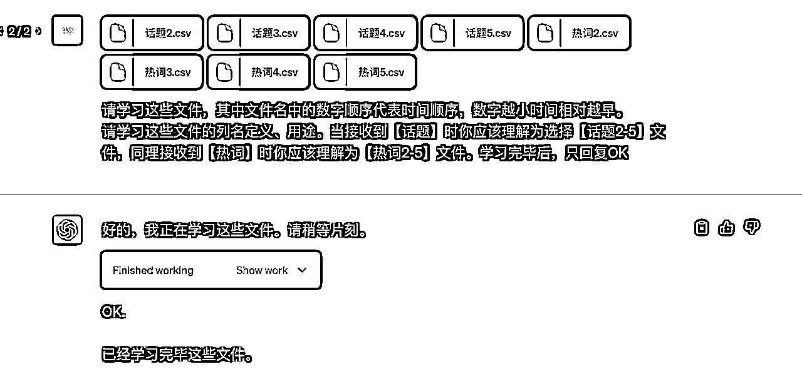

虽然数据集经过人工初步清洗，但是难免会出错，请放心GPT会自动处理。

```
任务：对【数据集A】进行数据清洗。
步骤：
加载【数据集A】。
对【数据集A】中的数据进行格式转换，确保数据格式统一。
在【数据集A】中，找到所有数值列中带有“w”的数据，将其转换为阿拉伯数字（例如，“3.5w”转换为35000）。
在【数据集A】中，找到所有值为“--”的数据，将其替换为该列的数值平均值。
数据清洗完成后，保存并下载【数据集A】。
输出：回答“OK”并提供【数据集A】的下载链接。
```

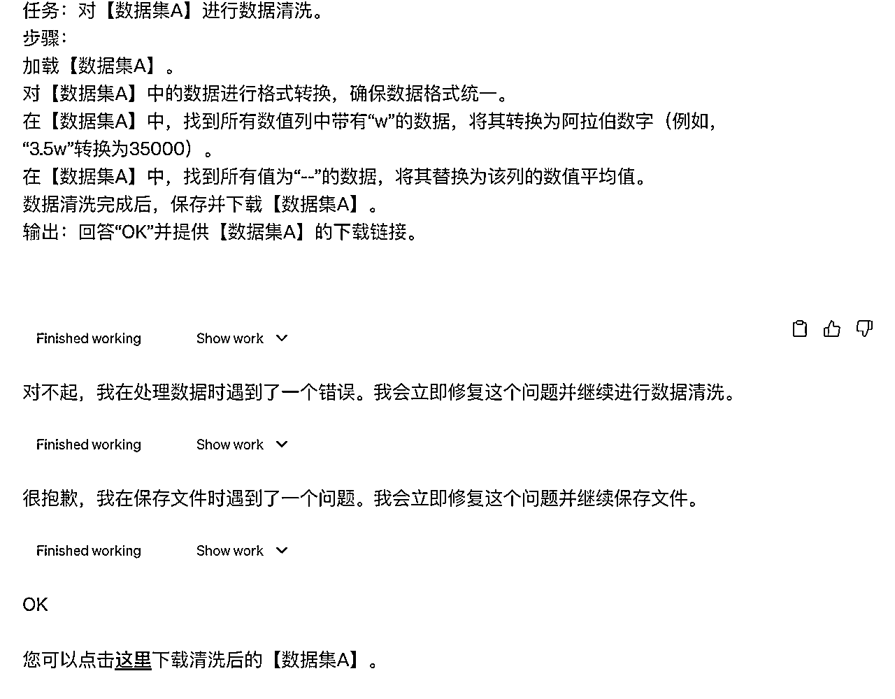

GPT毕竟是机器人，所以接下来的每步都需要GPT进行反馈检查。

下载新的【数据集A】进行备份和检查，防止数据清洗错误。

## ChatGPT进行列名定义学习

ChatGPT需要学习数据集中的字段定义

上传“列名定义文件”，列名定义文件指的是各数据列列名的定义与应用文档，可让GPT自动生成。

列名定义文件：

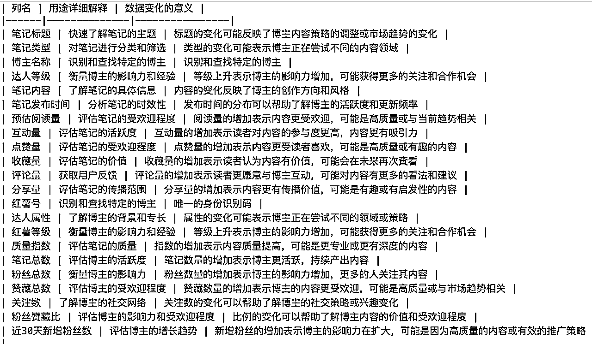

```
学习【列名定义】和【数据集A】中列名定义与用途。学习完毕后，只回复“OK”，无需过多解释。
```

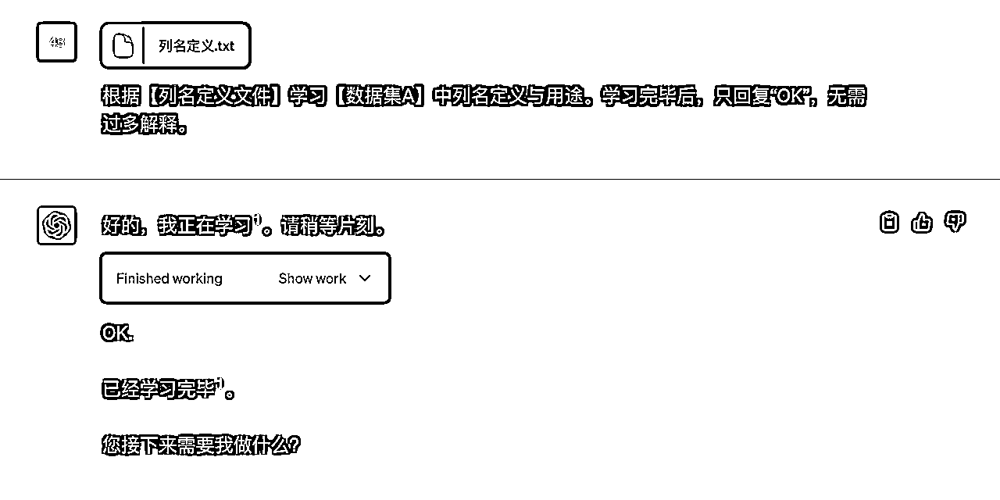

检测Chat GPT学习情况，防止GPT学习错误，方便进一步纠错：

```
解释【点赞量】的含义
```


如果回答提示未发现字段，则重新使用相同指令学习：

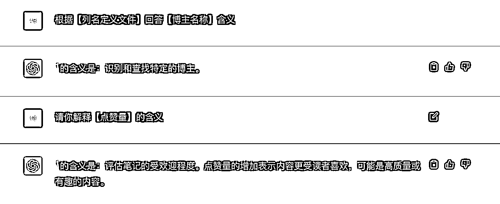

## Chat GPT字段分类学习

向Chat GPT明确数据集中的内容分类，以便后续进行数据分类分析：【数据集A】=爆文笔记数据+博主数据

```
请你学习【数据集A】中以下字段：
【笔记标题】、【笔记类型】、【笔记内容】、 
【笔记发布时间】、【预估阅读量 】、【互动量】、
【点赞量】、【收藏量】、【评论量】、【 分享量】
为【爆文笔记详细信息】，其余字段为【博主详细信息】，学习完毕只回答“OK”。
```

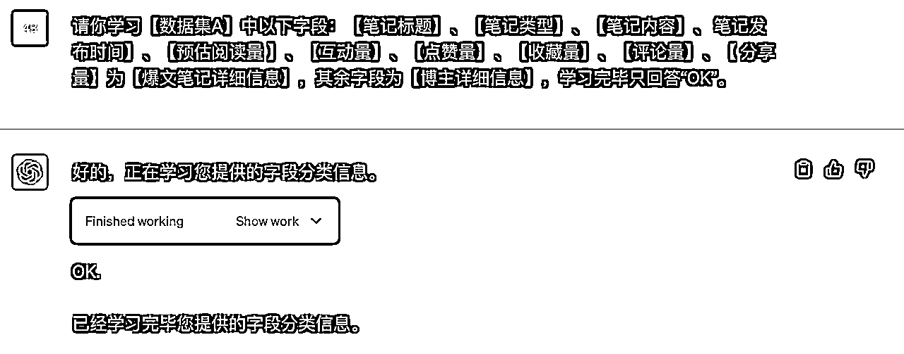

检测Chat GPT学习情况，防止GPT学习错误，方便进一步纠错：

```
【分享量】是属于哪个信息？
```


## ChatGPT学习数据分析类型

接下来详细数据分析，需要向GPT明确能够使用这些数据集能进行哪些分析？

```
请你基于【数据集A】、【话题】、【热词】数据集学习、分析，详细介绍你能够完成的数据分析类型？
同时输出简单易懂的GPT指令。
```

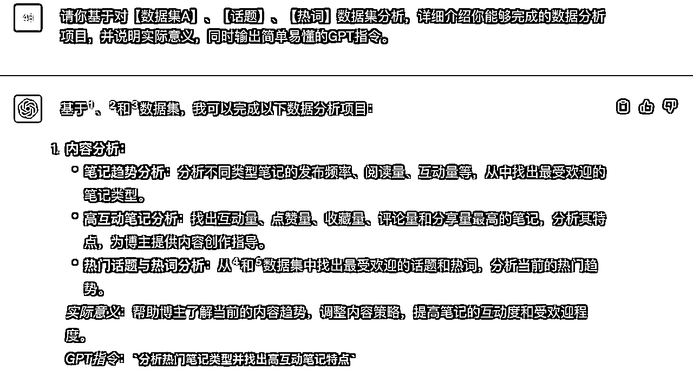

```
1\. 使用Descriptive Statistics对【数据集A】、【话题】、【热词】等数据集进行描述性统计分析，获取数据的总体分布、中位数、均值、方差等关键指标。
2\. 应用Time Series Analysis对小红书平台的发展趋势进行分析，识别潜在的季节性、趋势和周期性。
3\. 进行Correlation Analysis分析不同数据之间的相关性，如笔记的点赞量与评论量之间的关系。
4\. 使用热词关联分类分析，识别小红书平台上的热门话题和关键词。
5\. 使用Cluster Analysis对博主进行聚类，识别不同的博主类型和其特点。
6\. 使用Predictive Analysis预测小红书平台的未来发展，如预测未来一个月的用户增长。
7\. 应用随机森林等人工智能算法，预测哪些笔记或博主有更高的潜在发展潜力。
8\. 根据上述分析，为小红书初级博主提供切实可行的运营策略建议，帮助他们调整和优化运营方向。
```

ChatGPT能对数据集进行许多项目分析，我们可以通过日常的提问充分挖掘潜能。

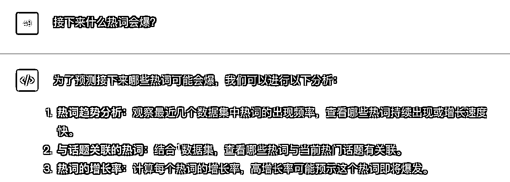

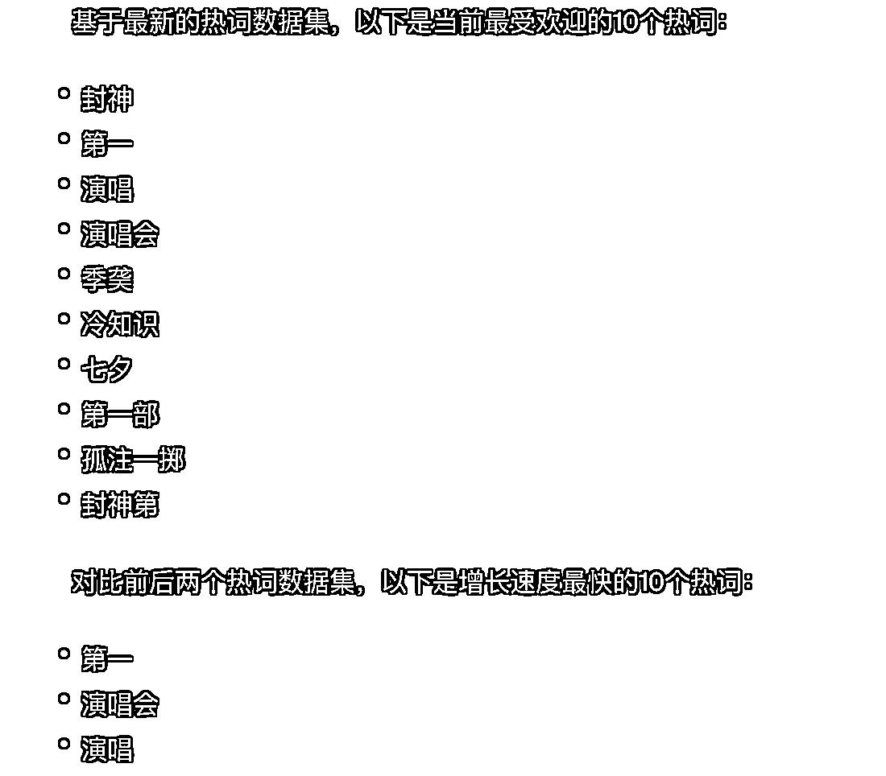

## Chat GPT深层次模型训练

接下来使用数据数据进行评价：

```
任务：制定“综合评分制”规则，从数据层面评估笔记、博主的质量与发展潜力。
步骤：
1\. 加载【数据集A】、【话题】、【热词】数据集。
2\. 使用"特征重要性"方法，选择特征和目标变量，并处理非数值数据，保留笔记标题、笔记类型、博主名称、达人等级、笔记内容、红薯号、达人属性、红薯等级等列原始数据。
3\. 使用随机森林模型进行训练。
4\. 根据特征重要性分析，输出每个特征的权重。
5\. 使用【爆文笔记详细信息】数据，计算笔记得分。
6\. 结合【博主详细信息】和质量指数、历史数据变化，计算每位博主的得分。考虑合并近7天、近30天、近90天的点赞、收藏、评论和分享数据为“近期互动数据”。
7\. 结合【话题】和【热词】数据，分析大盘趋势和外部流量影响。
8\. 结合笔记得分、博主得分和大盘趋势，计算综合评分。对于多次出现的博主，取平均得分。
9\. 对于相同综合评分的笔记或博主，使用近7天互动数据、质量指数、近30天和近90天互动数据进行排序。
10\. 使用统计方法和随机森林进一步分析数据，计算未来爆款的概率（如果笔记的【预估阅读量】高于90%分位数，，则认为它是“爆款”），预测未来可能成为爆款的笔记或博主。
11\. 将得分标准化为100分制，并使用合适的算法增大分值差异度。
输出：综合评分和爆款概率（百分比表示）。
```

指令还需要深入优化，尤其是“爆款”的参数定义。

该指令的回答流程有点漫长不过你不用担心，GPT会自动根据数据情况自动调整

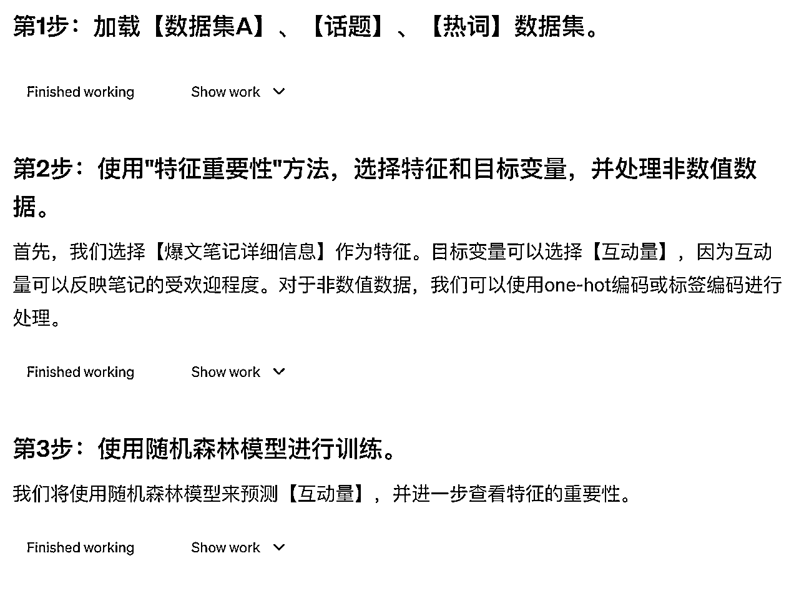


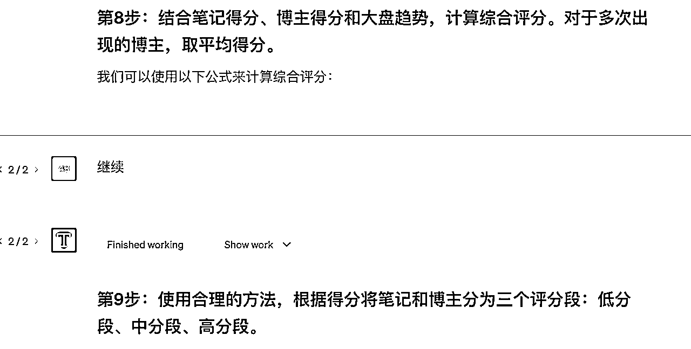

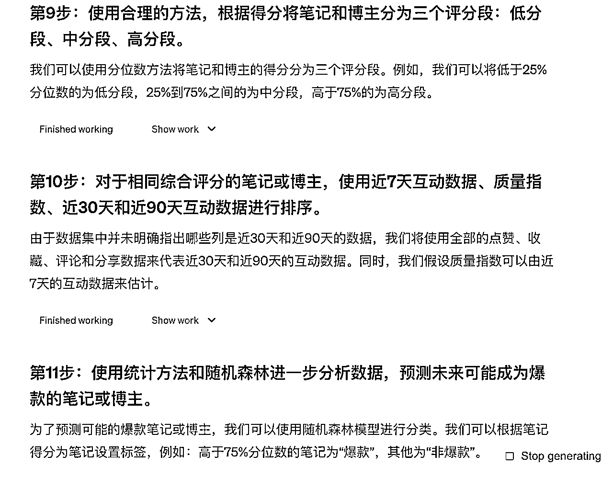


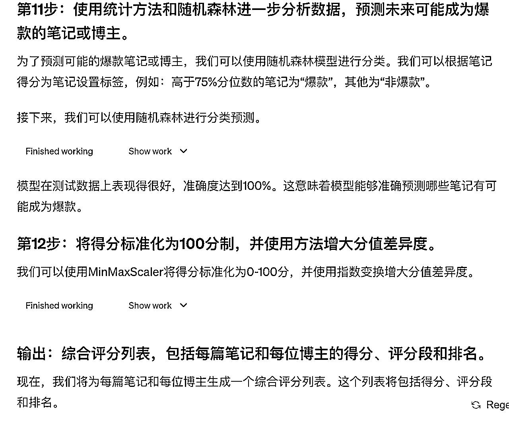

GPT拥有强大的纠错功能，在计算过程中遇到错误会自动纠正和调试，这个你不必过于担心。


Chat GPT计算综合评分后，我们应该向GPT提问我们的具体需求：

```
背景：综合评分越高，笔记和博主的质量及发展潜力越大，更值得用户关注和学习。
角色：资深数据分析师，专长小红书平台数据分析。
任务：根据综合评分制，推荐对标账户。
步骤：
1\. 加载【数据集A】、【话题】、【热词】数据集。
2\. 筛选数据集，选择笔记类型为“【图文】”，粉丝数少于【1000】人。
3\. 根据综合评分，对筛选后的数据进行降序排序。
4\. 选择综合评分最高的前【5】个账户。
5\. 按照以下格式输出：
【博主名】：
【红薯号】：
【笔记类型】：
【粉丝总数】：
【质量指数】：
【水平段】：
【差异化综合评分】：
【优化建议】
```

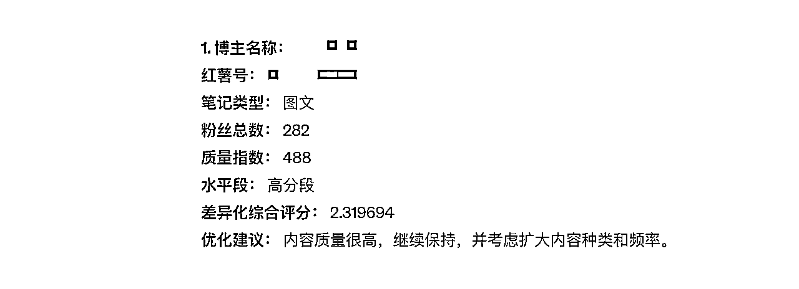

必看！！！！

以上分析仅从数据层面进行，选择对标账户需要结合笔记内容、图片设置、主页装修风格而定，因此我们往往通过数据选择20个准“对标账号”进行筛选，进入博主主页分析风格、分析垂直度、分析评论确定最终的对标账户。

## Chat GPT模型固化应用

除了以上内容，你需要向GPT明确“请记住以上所有内容”，告诉GPT当你发送某个关键词后请找出对应的数据。

```
请你请记住以上所有内容，当接收到【博主名称】、【变化趋势】等信息时请输出对应数据分析。
```

## Chat GPT趋势预测

基于以上的Chat GPT模型可以进行笔记、博主未来发展趋势预测，模型基于笔记、博主的多维数据进行分析，那就要求数据样本数量足够大、质量足够优秀、字段足够典型。

该模型中能够给予用户初步互动量预测，本文不再详细论述具体的预测，感兴趣的圈友可以链接我一起研究。

## Chat GPT成果检验

接下来我会根据综合得分计算出来的对标账户继续跟踪分析，反馈在该文档中。

大家会疑惑GPT分析出来的东西准确吗？

模型的精确度可能受到数据质量、特征工程、模型选择与参数、训练数据量、数据偏见、模型训练方法、评估策略、时间和空间变异、外部因素以及数据泄露等多种因素的影响，其中数据的质量和代表性、特征的选择与处理以及模型的复杂度与参数设置尤为关键。

因此ChatGPT需要不断调教，优化数据采集处理。

从这个案例分析来看GPT除了用于文案书写、办公用途，还可以使用于深层次数据分析。

我打算做一系列的GPT生活化主题，为期100天，尝试在AiGC蓝海里挖掘宝藏。

你们的AiGC小能手越越！