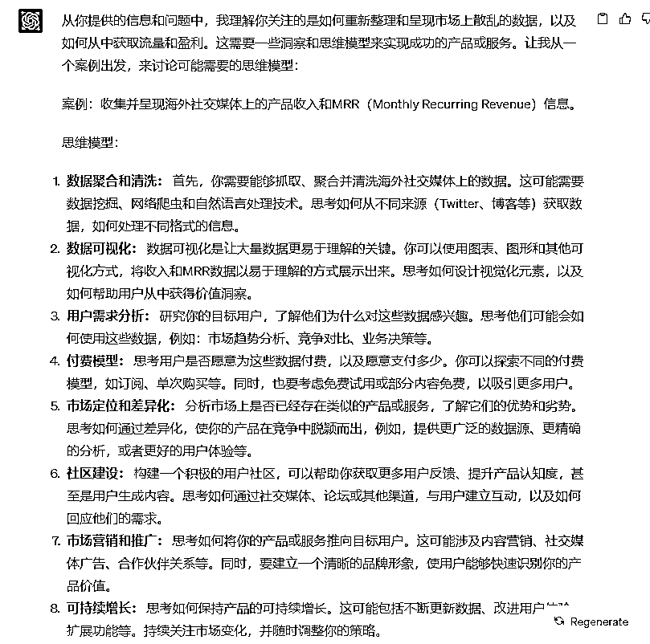
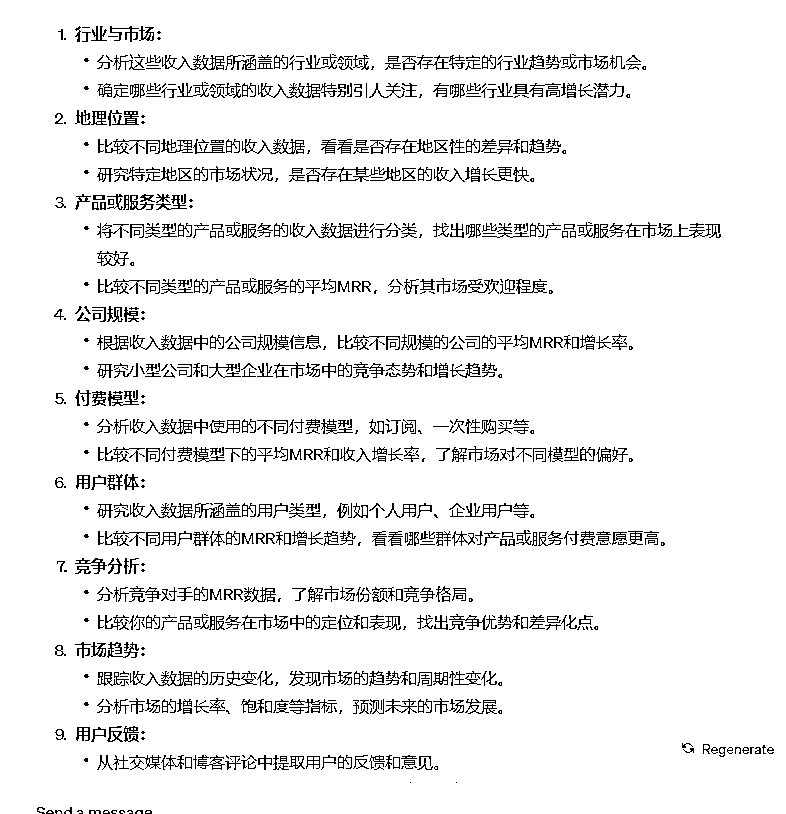

# 海外工具站的收入案例合集整理过程分享：1000个以上分享真实收入的产品和服务 [MRR in Twitter&more]

> 来源：[https://fqlleg2dnfa.feishu.cn/docx/ApJKd2AtyoKYC0xunnHccDZGnEf](https://fqlleg2dnfa.feishu.cn/docx/ApJKd2AtyoKYC0xunnHccDZGnEf)

## 开篇语

（多图+飞书表格链接预警，建议电脑查看更佳）

产品仍在制作中，欢迎提出优化思路！（文档此刻2023.08.29日 00.04.55 还在撰写中，先发表帖子占坑，答应过亦仁的今天必须发（其实晚了五分钟左右...）

本文档制作完成时间，预计2023.08.29日 05.04.55；

实际完成3.32.44，但文档的价值感需提升，如有反馈，再来优化。

真正完成网站截图和数据，04.09.49，应该可以了我去睡觉了，有需要完善的评论区见，我再按照要求优化

本MRR案例1K个，预计完成时间：2023.09.03日 24.00.00.

（更新：1K 个 MRR案例汇总表格，已在2023.09.01日14.00左右完成，，总计1230个tweet）

（但案例的进一步筛选剔除数据，以及针对案例做二次的整理，甚至最后的洞察报告，还有很多工作量，需要很长很长时间，产品最终形态待定，MVP就是案例汇总表格。）

（案例汇总，数据整理，洞察报告，算是三个产品，定价暂时为 100$，799$，200$）

卖空气是验证项目需求度的最好方法。——亦仁 https://t.zsxq.com/11hE8e4Th 《亦仁：卖空气检验真需求》

生财有术星球贴评论区有内容更新，欢迎大家先在星球评论区踊跃发言；

对MRR案例合集有建议的，可以在文档这里评论具体的段落。

海外twitter、博客上有很多人晒产品收入，晒MRR，如果能够抓取这些收入并呈现出来，让你花100刀一年，看1000个以上分享真实收入的产品和服务，你愿不愿意付费，我愿意。

——亦仁 2023-08-23 22:07 https://t.zsxq.com/11OAPrSrq

### 一，我是如何收集并整理的

##### 1.1 RPA+GPT自动判断链接内容

我最开始的思路就是用RPA上，最擅长的就是Uibot，整个逻辑很简单：

汇总谷歌搜索指定关键词的内容是用webscrapper的插件，可以先制作抓取内容模板，然后新增抓取的网页链接即可。

抓取的关键词来源于ChatGPT的推荐：

但是具体测试下来有三大问题：

于是我第二天晚上就开始手动去先整理那些互联网上公开的案例， ，当然有生财有术的鱼丸整理的一起赚美金专栏部分，不过链接的主域名都是https://search01.shengcaiyoushu.com/，这里面都需要会员的身份验证，所以公开并不会导致内容泄露和版权侵权哈，我只是做个索引目录，内容都还在生财有术里面。

当然也不可能纯人工复制啊，我就借助Easy Web Data Scraber这个插件，直接把我所打开的网页内容信息全部抓取下来。

然后我仔细咂摸了亦仁的这两句话：

如果你能将市场上散乱的数据，在某个纬度上重新整理并呈现出来，你的产品会很容易胜出，流量也会很容易获取。

当然，这个维度就需要你的洞察和思维模型了。

我自认为对海外产品暂时没有任何深刻洞察，那就直接抄吧，找到一个案例分析的网站（第二部分会分享），直接套用他们的分析模板。

但是我瞅了一眼，要想把现有案例按照这么多维度去分析，一个案例都得耗费我一整天时间去互联网上到处搜寻信息。

##### 1.2 手动整理Twitter的MRR分享案例

那我再回过头来仔细逐字阅读亦仁的这句话：

这里的重点是twitter上或者blog里晒收入的的案例，并不是独立开发者周刊那种，对人物的详尽介绍；似乎也不是starterstory那种，对产品开发的前因后果全部详细描述出来。

不如先看看twitter?

好，那就这么干。

这是我汇总的六十多个twitter上的晒MRR收入的案例部分，大部分都是2023年最近这几个月的帖子。

在这个过程中发现了一些比较有意思的小产品，比如针对MRR这个概念的，一个是shows your $MRR and $ARR on your Menubar all the time；另一个是"Create text charts from your data

With MRRArt you can create beautiful text (ascii) charts to share on Twitter, Linkedin & other social media platforms as well as your terminal or text editor."

具体内容大家可以在表格里面找，产品售价十美金，帖子曝光一两千，还真有不少人买，评论区一篇感谢。

因为手工复制太耗时，我又弄了个机器人去帮我复制，但是Twitter确实对内容抓取现在限制挺严格的，首先限制你看的内容数量，其次每个人的主页的相同内容的元素模块都不同。

目前Twitter已经限制了查看内容（大部分我所能看到的Twitter上的晒MRR收入的帖子已经都记录到表格里了）所以下一步是整理博客和其他论坛上的内容。

链接目前是根据GPT提供的关键词抓去了2K个左右，接下来会根据具体查看的不同分析MRR收入的帖子的特殊关键词，来搜索查找更多的内容。

博客晒收入是重磅，因为内容整体预估应该会比较多，但一部分twitter博主也是有写博客分享的。

以上是第一部分，我对内容搜集整理的方法，大家如有改善&批评，欢迎随时交流。

### 二，一些竞品网站的案例数据和流量&收入预估情况

##### 2.1 收入标杆Startstory，海外生财有术的弱化版，只靠案例竟收入几千万？！

先说我在评论区里面谈到的StartStory.com：

这个网站真是超牛，相当于生财有术十分之一的工作量，但是赚到了差不多同样的收入水平。

因为那是美金，换算成人民币就是四五千万了！真是一份努力，七倍收获！！！！！！！（此处七个感叹号）

针对各个网站的详细数据情况，我后面会慢慢完善和更新这个文档，放上所有网站的截图。

##### 2.2 各个网站的截图展示 （后续如有新发现网站，会在列表中继续更新）欢迎大家推荐

<h8>甲， https://www.ezindie.com/</h8>

<h9>网站流量 Monthly Visits 31.1K</h9>

<h9>变现模式：知识星球+训练营</h9>

<h9>创立时间 Domain Registered On: 2021-08-23</h9>

<h8>乙，https://founderbeats.com/</h8>

<h9>网站流量 Monthly Visits 31.0K</h9>

<h9>变现模式 Micro SaaS & Sponsor Us</h9>

<h9>创立时间 Domain Registered On: 2022-07-22</h9>

<h8>丙，https://decohack.zhubai.love/</h8>

<h9>网站流量 Monthly Visits 4.5K</h9>

<h9>变现模式 订阅制会员收入</h9>

<h9>创立时间 Domain Registered On: 域名zhubai.love是2021-07-06日创办，</h9> <h9>第一篇文章是DecoHack是什么 是·2022-02-15 发表</h9>

<h8>丁，https://www.starterstory.com/</h8>

<h9>网站流量 Monthly Visits 1.4M</h9>

<h9>变现模式 一次性订阅制 695$ & 1095$</h9>

<h9>创立时间 Domain Registered On: 2017-08-04</h9>

##### 2.3 案例收集类网站的流量与收入表格分析对比（后续如有新发现网站，会在列表中继续更新）欢迎大家推荐

这里先贴一下网站的流量和产品对比表格：

ezindie和founderbeats 几乎同等流量，都是面向创业者变现

国内中文提供知识星球+训练营培训，国外英文提供SAAS IDEA report + product sponsored服务。

decohack是搭建在竹白上的二级域名，提供年费订阅，一年多提供了六十多篇文章

starterstory是一个落地页，直接让你输入邮箱，有两种一次性付费选项，做的时间久，自然收集的案例多

<h9>新网站突破点：</h9>

1.  MRR榜单+收入线

1.  落地页直接邀请付费获取案例/进入社群

1.  需要积攒案例+社群事件

### 三，集思广益：从哪些维度去整理案例合集更好？

案例库就是数据资产，暂不免费开放了哈，有需要查看的可以付费。

##### 3.1 Starterstory的案例分析维度

首先我放一下startstory的索引具体内容，大家可以点击 的最后一个工作簿【starterstory 分类模板】查看明细，对我都抓取下来了，只不过是全英文的我也没翻译（前面的三个工作簿有中文目录翻译）。

其次是starterstory整理的每篇案例文章都有固定的目录，这个非常好以至于我很难抄袭。

##### 3.2 我目前的案例记录维度

最后是我自己整理的两部分目录（案例分析维度）

##### 3.3 GPT的建议维度

先给出我参考GPT建议的汇总和思考版本：

1.  有了1K个MRR案例合集，其实可以做1W个乃至更多（数量取胜）或者说是每年累计

1.  这么多案例糅合在一起会发生质的变化，可以统计各行业的平均MRR 然后形成一个可视化的模板来对比

1.  那么多MRR案例，肯定有重复的同一个人多个产品，我在整理的时候就已经发现了，有些人会反复地晒，不同产品，不同时期的MRR，其实就可以看到MRR的真正且实时的增长趋势

1.  果然是针对投资人，可以作为收购的案例参考，直接定价1K--1W$，因为还可以作为一个中介评估和联系的机构

1.  针对创业者：这岂不是最好的拜师学习对象，30分教20分，60分教五十分，实时看到市场最新的需求，因为可以区分时间，而且大部分案例都是最新的（最近几天刚分享，很多MRR都是新鲜出炉的第一手资料）

我询问了ChatGPT，可以增加哪些维度，以及什么样的思维模型最适合吸引人的案例整理。

太多回复就不一样截图了，点击这个链接可以查看全部聊天记录：

https://chat.openai.com/share/95c9f446-0687-4e1d-affb-915ce325423b

### 四，案例合集的下一步是社群孵化：从工具到社群

##### 4.1 阶段性发展

这个思路来源于亦仁，因为我在实操过程中确实感觉到，单纯地收集整理晒收入的twitter&blog的案例合集，其实所提供的价值相当单薄。

我阴差阳错地搜到了亦仁历史的一篇帖子，没想到我当时还反复复制了他的回复...只是可惜当时没那个执行的认知，我今天才开始去操作，用公众号批量去抓相关话题的文章再做合集。（这个优先级偏弱，等我完成海外晒收入案例合集再仔细整理）

##### 4.2 生财历史案例

《一个人如何通过搭建研报社群变现10万+》https://t.zsxq.com/115CszsSX

同时结合亦仁要做海外工具收购的帖子，那么我的理解是，先做完1K晒收入的真实案例合集，价值点还在于

##### 4.3 生财产品参考

更多的运营方法，也可以参考生财有术现有的产品机制：

社群运营是个重活，但是凝聚起来的向心力和筛选出来相同价值观的伙伴，以及一支铁打的团队，这种回报是非常长期且巨大的。

或许还更多社群玩法，且看后续的生财实验室。

国内顶尖社群，去出海卷！

Startstory只是分享赚钱案例就搞了几千万人民币，生财这套模式出海，岂不得几千万美金？！

当然话说大了容易打脸，我现在最重要的工作是完成当前这份文档，汲取各位圈友的建议，整理好1K的MRR分享案例合集，然后把它卖出去！

先卖给亦仁，（质量要达标），再卖它一千份[100$]！

（如果这个目标真的达到，那就真要捐一百份的收入到生财项目基金里面。

### 五， 项目发展要点分析

##### 5.1 案例受众

投资人 - 付费订阅，潜在收购的工具

创业者 - 产品灵感，榜单，社群

大机构 - 市场工具风向标

以下为GPT分析

1.  投资人：

*   分析关键成功指标（KPIs）： 提供针对不同行业的MRR数据，帮助投资人了解行业趋势和关键成功指标。

*   市场趋势预测： 基于历史MRR数据，预测未来市场的增长趋势，为投资决策提供依据。

*   行业对比报告： 创建行业对比报告，分析不同公司的MRR增长率、市场份额等，帮助投资人发现潜在的投资机会。

1.  创业者：

*   市场定位指南： 提供不同行业和地区的MRR数据，帮助创业者选择最有潜力的市场定位。

*   付费模型建议： 分析不同付费模型的MRR表现，为创业者制定最合适的付费计划提供建议。

*   成功案例分享： 提供成功创业者的MRR案例，分享他们的经验和策略，启发其他创业者。

1.  大机构：

*   市场洞察报告： 提供定期的MRR市场洞察报告，帮助大机构了解市场趋势和机会，指导战略决策。

*   竞争分析工具： 构建竞争分析工具，对比不同公司的MRR和增长情况，帮助大机构了解竞争格局。

*   市场拓展决策： 基于不同地理位置的MRR数据，为大机构提供市场拓展决策的依据，指导资源分配。

##### 5.2 产品质量

增加分析维度（待定，先整理案例）

吸收用户的建议，洞察真正的痛点，做出买家想要的东西 （进阶，需分析竞品模式）

生财有术圈友可以随意评论

##### 5.3 内容工具化

首先是内容的获取上，需要做个半自动化抓取和分析系统，我现在只完成了一部分也不全面，还需要优化

其次是内容输出工具化的角度，可以做出来一个实时榜单！当然是可以按周更新的内容，就是网站的流量+收入，这两块可以数据化展现，然后具体的分析是需要付费解锁的，比如做了哪些内容，形成了什么增长；或者是怎么失败的，也有一些MRR缩水的案例分享，已有总结到一个案例（我有印象）。

最后是形成一个聚合的搜索引擎，就类似于生财有术这种，但可以向外链接到twitter作者本人？还需要再思考流量的运转模型。

### 六，项目的收入前景和可能遇到的卡点

##### 6.1 starterstory的十分之一就是$70W

很容易计算，100$的客单价一年卖出去一千份，七年就做到十分之一了。

这对我来说也还行，当我达到这个层次的时候，或许才能望到下一座山。

但是这样的发展对于亦仁来说，可能有点慢，因为他非常擅长社群运营，$7KW的项目可能才是天花板。

我觉得，我先完成案例汇总，其次是售卖出去一百份就很不错了，嗯对，接下来是钻研案例合集和流量系统。

##### 6.2 发展要点就是可能意义上的卡点

整理的案例质量不行，这可能是最主要的卡点。

如果你能将市场上散乱的数据，在某个纬度上重新整理并呈现出来，你的产品会很容易胜出，流量也会很容易获取。

当然，这个维度就需要你的洞察和思维模型了。

大的比如这家 合合信息更新招股书：或成「智能文字识别第一股」，2022年净利润约3亿元

还有这家 太神奇！价值4亿元，这家公司只有创始人一个员工

小的比如生财有术，将散乱在市场中的赚钱案例集合到一起

更小的举个例子，海外twitter、博客上有很多人晒产品收入，晒MRR，如果能够抓取这些收入并呈现出来，让你花100刀一年，看1000个以上分享真实收入的产品和服务，你愿不愿意付费，我愿意。

亦仁 2023-08-23 22:07 https://t.zsxq.com/11OAPrSrq

从散乱在市场中的赚钱案例合集，到现在生财有术如此庞杂且规划有序的项目手册和知识库，这是几块钻头跟高楼大厦的区别。

从twitter的MRR案例到设想的海外工具站社区，其中的差别应该也可以相互比拟。

最后，同为生财的圈友，你是否也有想法整理出一份自己行业的1K案例文档？