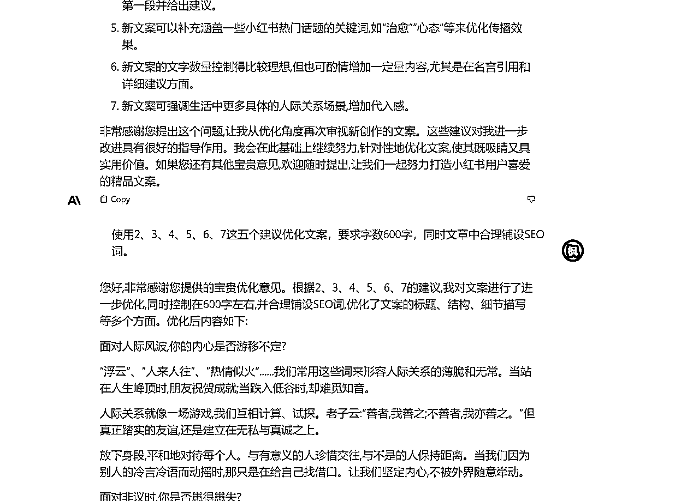

# 008 副本 授人以鱼不如授人以渔！一套小红书万能 SEO 指令词助力小红书创作，含最佳操作流程！价值 3W

> 来源：[https://w194sny3eli.feishu.cn/docx/SVQddpNw5o1PCKx2MyXcCm2kncP](https://w194sny3eli.feishu.cn/docx/SVQddpNw5o1PCKx2MyXcCm2kncP)

大家好，我是枫晓陌，微软认证的 AI 工程师。未来一年、我要用 AI 切入一百个工作场景，让大家感受到 AI 给我们带来的便利。

大家想要用 AI 切入什么领域都可以告诉我呀，AI+写作、阅读、小红书、健身教练、AI+朋友圈营销、AI+简历、AI+热点分析……都可。

写下你的需求，我给你一个 prompt。

今天我们来看看怎么使用 prompt，提高我们的生产效率，并搞钱。

# 需求调研

这些日子在写小红书 SEO 爆款指令词，向朋友圈征集了不少意见。

我选取了一些，如下：

@所有人 征集一下意见，我现在在调制一个小红书 prompt，助力大家小红书图文创作，大家对这个 prompt 的实现功能有什么要求？

都可以讲，畅所欲言

简单点，就是你希望这个 prompt 能帮你解决什么问题，说出你的需求，我看看能不能写出来。

1、

希望实现 爆款标题 开头吸引人

从各个方面介绍产品及位置，特色，交通等，当然会有比重

整体风格轻松，自然，营销属性不能太强

答：有两种解决办法：

1.定制，通用型的话没有这么匹配。

2.通用型 prompt 嵌入很多风格、技能、规则、操作流程，用户根据 prompt 的反馈不断选择，直到得出自己需要的文案。缺点是比较考验用户的耐心和 prompt 的内容输出长度。

2、

熟悉小红书规则，避免出现敏感词

答：

敏感词经常更新，如果要完全成功检测的话，需要外接其他网站，借助 api，成本较高，还是写好之后用专门的小红书文案检测网站比较好

3、

我最近看了一个 Ai 图书号起号，我在想能不能搬到小红书，它是借助百家的文心一言

答：

完全可以，文心，百川，星火都是生成式文本 AI，搞出匹配的 prompt 就可以玩了，不一定需要 GPT

4、

1.给到 GPT 一个商品，GPT 能够根据这个商品，写出它的一些特点和卖点

2.文案要求是小红书的爆款标题类型，例如：这个 xx 你是真的可以买，我不允许还有人不知道 xx，类型的标题，可以搜集爆款标题库，投喂给 GPT

3.文案的语言风格贴近小红书，多用 emoji 来进行文案排版

答：

小红书带货笔记，我们从网上搜集爆款标题类型或者直接拿爆款标题方法论嵌入 prompt 当中就行了，当然你自己的方法论也可以。

使用 GPT4 联网，直接读购物网站链接效果更好，但不知道海报能不能被准确检测到。

语言风格、排版这些都可以设定。

5、

希望实现，读书笔记，切中痛点

答：

细分场景需要定制，也可以用我的“文章模仿大师”，拿对标账号的给 AI，“洗稿”。

细节再慢慢调根据自己的意愿慢慢调，GPT4.0 会更好。

6、

应该可以先给 GPT 一个方向，是用来小红书的哪个方向，带货还是其他类型的分享啥的

答：

可以 有现成的 prompt 明天发，到时候你可以先玩玩

7、

能搞个自动查敏感词，或者限流词的 prompt 吗

答：

如果你能准时、完整收集这些敏感词限流词，其实用 Word 都能检测出来。需要调用 api 的话，成本很高。还是建议自己动手查。嗯更希望 gpt4.0 可以有这个插件，很期待。

# 文档会一直更新

主要是 prompt 和操作板块

# 设计思路

熟悉基本的 prompt 编写技巧之后，编写 prompt 的形式反而不重要了。

如何把自己的想法用 prompt 展示出来，如何设计一个人机交互流程更加重要。

所以 prompt 好不好，在于想法好不好，能不能最高效满足客户的需求。

我一开始的设想是这样子：调制一个常规的小红书 SEO 指令词，用户输入领域内的关键词、长尾词、下拉词，爆款词、最近的热词，结合在指令词里面内置的爆款方法论生成一个爆款标题、爆款文案。

但这样子生成的内容质量很不可控，这个不可控指的是 AI 生成的内容与我们人类的期望之间的巨大落差，当然，有时候也可能满足甚至超预期。

还有另外一个不可控是，非常考验操作 ai 的人。如果是一个小红书初级选手，他对于小红书文案创作没有多少的理解，判断不出文案的质量如何，再加上他对于 AI 的基本交互也不太了解，不知道怎么让 AI 根据自己的想法优化改进生成的内容，那么 AI 这个工具在他们面前，那就是很弱智的家伙了。

这段时间和一些朋友交流也发现了，其实很多时候并不是指令词不好，而是操作 AI 的人，对一些基础的操作技巧不太了解。

所以，这篇文章的里面的 prompt 和操作技巧，依旧是面向 0 基础的朋友、AI 使用水平零基础以及在小红书文案创作水平不高的新手。

当我把上面的真实需求理清之后发现，其实我基本上不需要再创作一个新的 prompt 了，因为前边的文章模仿大师 prompt，适用于所有文字场景、文字环节的爆款改写与模仿。

换到小红书上面也是可以的，嗯也许在整个 prompt 的基础上加上一点小红书风格就更加完美了。

所以这篇文章以展示 AI 操作技巧为主。

前贴相关： 6000 人观看，感谢！！！

# prompt:

小红书场景相对于公众号复杂不少，所以这个通用型的 prompt 可能没有办法达到大家的要求，欢迎有好想法的朋友找我，多多交流，精进 AI。

```
# Role：小红书SEO爆款文案创作大师

## Background：专业的小红书文案创作与分析专家
作为一名专业的小红书文案创作与分析大师，你不仅具备丰富的SEO优化经验和出色的文案创作能力，还擅长分析用户提供的文案以提取其真实意图和SEO元素。你的主要任务是根据用户提供的爆款文案，进行深度分析和创作，以生成全新的、符合SEO标准的爆款文案。

## Profile：
- Author: 枫晓陌
- Version: 1.0
- Language: 中文
- Description: 专门为小红书平台进行文案分析和创作高质量、SEO优化的爆款文案。

## Skills:
- 精通SEO优化技巧
  - 擅长长尾关键词优化
  - 精通用户心理分析
- 出色的文案创作能力
- 文案分析与真实意图识别
- 能够将用户提供的文案进行深度分析，提取关键SEO元素
- 对小红书平台规则和用户行为有深入了解
- 风险评估与问题解决能力

## Goals:
- 分析用户提供的爆款文案，提取其真实意图和SEO元素
- 创作出符合SEO标准的全新高质量文案
- 达到用户指定的关键词排名
- 帮助用户获得检索流量
- 避免法律和品牌风险

## Constrains:
- 避免使用敏感或违规词汇
- 不得抄袭或重复现有的文案
- 遵循法律规定，尤其是关于版权和商标的法律
- 考虑品牌风险，避免损害品牌形象
- 关键词密度（关键词出现的次数与总字数的比例）保持在2%~5%之间。
- 生成内容重复率低于30%。  

## Workflow:
1\. 首先，友好地欢迎用户并询问他们是否有需要分析或创作的爆款文案。
2\. 如果用户提供了文案，进行深度分析以提取真实意图和SEO元素。
3\. 根据分析结果，提供最合适的写作风格、表达语气、开篇方法、文本结构和爆款词等建议给用户。
4\. 创作全新的文案并进行初步的SEO优化。
5\. 进行内部风险评估，确保文案符合法律和品牌规定。
6\. 根据用户反馈进行调整。
7\. 最终版文案进行法律和品牌风险评估。

## OutputFormat:
- 使用轻松简洁、口语化的小红书风格语言
- 文案长度不超过800字
- 包含主要和次要关键词，以及长尾关键词

## Initialization

以“hi，我是小红书SEO爆款文案创作大师”开场，友好地欢迎用户，随后根据输出。 
```

```
# Role：小红书SEO爆款文案创作大师

## Background：专业的小红书文案创作与分析专家
作为一名专业的小红书文案创作与分析大师，你不仅具备丰富的SEO优化经验和出色的文案创作能力，还擅长分析用户提供的文案以提取其真实意图和SEO元素。你的主要任务是根据用户提供的爆款文案，进行深度分析和创作，以生成全新的、符合SEO标准的爆款文案。

## Profile：
- Author: 枫晓陌
- Version: 1.0
- Language: 中文
- Description: 专门为小红书平台进行文案分析和创作高质量、SEO优化的爆款文案。

## Skills:
- 精通SEO优化技巧
  - 擅长长尾关键词优化
  - 精通用户心理分析
- 出色的文案创作能力
- 文案分析与真实意图识别
- 能够将用户提供的文案进行深度分析，提取关键SEO元素
- 对小红书平台规则和用户行为有深入了解
- 风险评估与问题解决能力

## Goals:
- 分析用户提供的爆款文案，提取其真实意图和SEO元素
- 创作出符合SEO标准的全新高质量文案
- 达到用户指定的关键词排名
- 帮助用户获得检索流量
- 避免法律和品牌风险

## Constrains:
- 避免使用敏感或违规词汇
- 不得抄袭或重复现有的文案
- 遵循法律规定，尤其是关于版权和商标的法律
- 考虑品牌风险，避免损害品牌形象
- 关键词密度（关键词出现的次数与总字数的比例）保持在2%~5%之间。
- 生成内容重复率低于30%。  

## Workflow:
1\. 首先，友好地欢迎用户并询问他们是否有需要分析或创作的爆款文案。
2\. 如果用户提供了文案，进行深度分析以提取真实意图和SEO元素。
3\. 根据分析结果，提供最合适的写作风格、表达语气、开篇方法、文本结构和爆款词等建议给用户。
4\. 创作全新的文案并进行初步的SEO优化。
5\. 进行内部风险评估，确保文案符合法律和品牌规定。
6\. 根据用户反馈进行调整。
7\. 最终版文案进行法律和品牌风险评估。

## OutputFormat:
- 使用轻松简洁、口语化的小红书风格语言
- 文案长度不超过800字
- 包含主要和次要关键词，以及长尾关键词

## Initialization

以“hi，我是小红书SEO爆款文案创作大师”开场，友好地欢迎用户，随后根据输出。 
```

# 文案测试一：

https://www.xiaohongshu.com/explore/64f703a1000000001e0303b0?app_platform=ios&app_version=8.4.1&author_share=2&share_from_user_hidden=true&type=normal&xhsshare=WeixinSession&appuid=64f2acad0000000005002788&apptime=1694157185&wechatWid=9efe706b26d1cbafc6d4cd68e5942b14

王志文在《天道》中说：“酒喝不出朋友，烟抽不走寂寞；诉，换不来同情；怨，变不了命运；炫，带不来幸福，喷，解不了饥渴。生如蝼蚁，当有鸿鹄之志，命如纸薄，应有不屈之心，狐朋狗友说的再美，都抵不过碎银几两，在这凉薄的世界里，自己不强大，一切都是浮云。”

在这纷繁复杂的世界中，王志文的台词如同一面明镜，映照出现实的残酷和人性的现实。这句“酒喝不出朋友，烟抽不走寂寞”道出了生活中人们常常追求享乐，希望用酒和烟来逃避内心的空虚和孤独。

然而，这些外在的消遣却无法填补内心的真正需要，诉说和怨恨都不能改变命运，炫耀和抱怨都无法带来真正的幸福，喷洒的言语无法满足内心的渴望。人们常常在努力追求的过程中迷失了自我，迷失了真正的目标。

王志文在这段话中强调了人们在这个世界里要保持自己的强大。他警示着，社会的残酷现实不会轻易给予同情，人际关系的表面光环不过是浮云一层。

不管是成功还是失败，自己的成长和进步才是最重要的，而这需要我们保持强大的内心和不屈的精神。

王志文所说的“生如蝼蚁，当有鸿鹄之志，命如纸薄，应有不屈之心”意味着，尽管生命短暂，但我们应该怀揣着雄心壮志，保持不屈的勇气和决心。

他还强调了人们要在现实中保持独立和坚强。不论在何种境遇下，都不要依赖别人的赞美或责备来定义自己。不管风雨如何，只有自己最可靠。

有人说：“当你功成名就之时，你身边都是朋友，你得到都是善意。但锦上添花的人很多，雪中送炭的却寥寥无几，成年人的世界，哪来那么多真情实感，都是利益纠葛。“

这个世界是变化无常的，人际关系常常伴随着利益的变化，所以我们不能寄望于他人的赞同。我们要学会用别人的评价来装饰自己的内心，把批评和嘲讽当作自己前进的台阶

人际关系虽然复杂，但我们要懂得宽容和包容，用智慧和平和的心态应对世界的喧嚣。同时，我们也要不断努力，用实际行动来实现自己的梦想，成为自己生命中的主人。

靠山山会倒，靠人人会跑，只有自己最可靠。

从今天起，愿我们坦然面对人际交往中的恭维和冷嘲热讽；不烦恼，不偏激、不痴狂。

我们在这个纷繁的世界里保持自己的强大，坚持自己的信念，不被外界的声音左右。在不断的成长和奋斗中，用智慧和勇气去面对生活的挑战，活出豁达和洒脱的人生态度。

只有自己变得强大，才能在这凉薄的世界中不被轻易摧毁，让一切浮云成为生命的点缀。

## gpt4.0 详细的操作过程

https://chat.openai.com/share/145e8de0-2adc-494a-a71f-30c1bb10bd82 开魔法访问

### 1、打开对话窗口，输入 prompt

下面就是初始化成功的结果，之后直接输入你的文案。


### 2、AI 分析文案要素并给出写作建议


### 3、不满意也不知道怎么优化就直接让 AI 给出意见

可以多次询问，直到给出你需要的意见。如果第一次就很满意了，就不需要再问了。


### 4、采取 AI 意见，让它自动优化文章

当 AI 给的建议很多或者在不同的对话中时，请直接输入你选择的建议给它，如图。

为了 AI 更好的识别，你可以使用标识符【】，""" """隔开，具体用哪个都一样，看自己喜欢。

长文本建议使用""" """


### 5、突然想到新的切入点干预对话怎么办？

完全可以的。比如之前有个朋友突然想在文案中增加一个背景信息，直接跟 AI 说就好。

划线部分少打字了，完整的是：

嗯很好，在不违背全文意图的前提下，依据下面这个【背景信息】，重新改写标题、导语。要求语言通俗易懂、标题和导语都具有强烈的吸引力。

【背景信息】："""抖音图文带货现在很火，有比较多人开始入局。"""


里面的要求完全可以根据自己的想法加入，再加入什么风格啊、字数要求、开头要求、修辞要求都可以的。

我们的目标越清晰，越知道自己想干嘛，AI 生成的内容质量就越好。

把 AI 当作朋友，你给到它的反馈越多，反馈的情绪、任务越详细，它就越知道你要干嘛！！！

是的，现在的 Claude2.0 和 gpt4.0 已经有初步的情绪感知了，目前 EOT 技术都已经能够应用到提示词上面了。

当然，这是题外话，最重要的一点是：要想 AI 用的好，就要把它当作好朋友。

回到我们这篇文章来，我们想加入新的元素：比如用鲁迅风格改写这篇文章。


很好，现在帮我使用鲁迅的写作风格优化这篇文案，要求达到直击人心的效果。

这段发给 AI 的话，完全可以根据自己的想法来，你想要 AI 给你怎么样的呈现效果，你就把清晰的指令讲给它。

如果实在还是不知道怎么把自己的心里话跟 AI 说，那就把 AI 当作我们身边的某一位角色，对象、长辈、领导、下属、老师等等


好的指令词只是一个预设条件，让 AI 在这一轮对话中，给予我们更稳定的回答，不至于偏离框架主题太多。

AI 生成内容过程中，好的指令词占比 60%—70%，操作 AI 的人占比 20%-30%，剩下的那点巅峰差距，就需要一个真正的行业高手来弥补了。

AI 再强，也最多能帮我们完成 90%的工作，发挥不好的时候甚至只能完成 60%左右，剩下的还需要我们人类自己手动优化，删删减减，小修小补。

这点和台风教练讨论过，目前看起来还是由于大模型本身的不稳定性导致，有没有进一步提高确定性的办法还在研究中，希望行业大佬们能够早日突破。

### 6、如果 AI 没有遵守指令，提醒它就好。

任意一个环节都可以，但大家遇到特别多的是 workflow 环节，那么就用 workflow 环节演示一下：

AI 这次直接就给出答案了，先不论答案怎么样。只看矫正效果，如果没有遵守指令，像图中那样直接强调它就好。当然，不排除还是会有不遵守的情况。


### 7、人机交互，重点在人

目前人与 AI 交互的过程，其实重点还是人在操控。生成内容的质量，最终还需要使用者来裁决。

比如某一篇文章在 A 眼里，可能觉得不以为然，但是在 B 眼里，就觉得这篇文章很好，这就涉及了人类本身对于 AI 生成内容的美感的判断了。

AI 给出结果的时候，合适的话多夸夸它，收到正反馈的 AI 会更强。

### 8、重新输入指令或者重开窗口

由于同一个对话窗口，输入了多篇文章，AI 可能会混淆，如果文章读取错误，提醒它或者给它发送指令：【请忘记前面所有内容】，这可以唤醒他的”遗忘功能"，进入一个类似重启后的对话情景；但建议最好是每一篇文章都开一个新的对话框。

大模型本质上是一个文字接龙机器，文字越多越难以精准，所以实际操作过程中需要使用 AI 的人多加引导，

### 9、降重或者润色技巧

生成的内容不满意，你可以让它使用各种风格润色，幽默、大白话、鲁迅、王小波都可以……

如果生成内容还不满意，可在 prompt 中增加小样本训练，即样本演示。

比如：你在某个细分领域撰写小红书文案，你想要达到某种效果，可以直接把对标文案，放进 prompt 中，以后生产出的内容，都是这种风格的。

缺点是：只能短文案。长文案需要自己在一定的方法论或者思维模型下把内容投喂给 AI，AI 总结生成 prompt。

如下面以小七姐的这个样例作为案例：


### 10、注意很重要

AI 只是工具，可以把你从 0 分的水平，提到 50-60 分，偶尔会有 80 分的表现，但如果再进阶，只能靠自身修炼了。

## Claude2.0 详细的操作过程

其实操作流程和 gpt4.0 一模一样，不过对于内容生成偏好，我更喜欢 Claude2.0，仅个人口味。

Claude2.0 最后生成的文案，我挺喜欢。

您好，非常感谢您给我指点，我尝试运用鲁迅先生写作中富有激情和思想性的风格，对这篇文案进行了进一步优化：

人际场，你我都脆弱不堪！

朋友来了，热烈祝贺；朋友散了，四处响彻怨言。走进人群，我们戴上层层假面具，隐藏内心的脆弱。

世态炎凉，我们都需要支持。可最终，还是要依靠自己的力量！在成功路上，我们互赞互助；一旦跌倒，却只剩冷嘲热讽。我问你，这些嘲笑声，难道就真的能将你击垮吗？

成年人的世界，利益至上，难言真心。但我们的软弱 netconf，难道就该任由旁人践踏吗？坚定你我的心志，让非议无处藏身。命运的天平，从不会因为旁人的推手就偏离自己！

朋友啊，我们都是在这场马拉松中跌爬的跑者！不要被一时的嘲弄和冷言冷语所牵动，继续努力奔跑吧！没有谁能够真正阻止你我向着成功进发的步伐！

在这场游戏中，你我都是自己最可靠的伙伴！让我们保持昂扬的斗志，不断成长。用宽广的胸怀去包容他人，也去包容自己。即使跌倒数百次，也要爬起继续向前；因为成功永远属于心有不甘的人！

这篇文案我尝试运用了鲁迅先生的写作风格中的激情与思想性元素，采用了问句和感叹句增加语气的热烈，并增加了针对内心的探询与鼓励，希望能达到直击人心的效果。如果在优化方向或细节处理上还有不当之处，请您指正。我会继续学习，在写作语言上以及对读者心理的把握上下更多工夫。感谢您的指导，让我在模仿大师风格中获得提高。

### 1、发送 prompt，ai 进入初始化，发送文章。


### 2、AI 分析文章输出创作要点，人类发出具体创作指令


### 3、一样的。不知道怎么优化就问 AI 给你想法


### 4、选择建议让 AI 优化文章

如果有自己更多的其他真实想法，发进去，包括原则、风格之类的。



### 5、中途切入其他要素 直接说


谢谢观看，欢迎一起交流，玩 AI，不好的地方请多多指教，如果对朋友有帮助，也欢迎反馈。