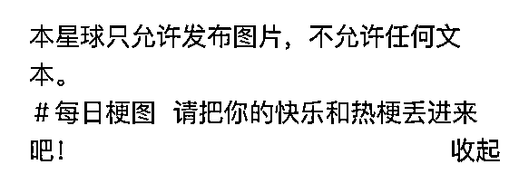

# 12小时发起一个社群，创建一个千人社群，难吗？

> 来源：[https://txt6wm3b04b.feishu.cn/docx/GBSvdoARtoiV0Uxh5Yccm8OqnLe](https://txt6wm3b04b.feishu.cn/docx/GBSvdoARtoiV0Uxh5Yccm8OqnLe)

最近参加了“社群发起人”的航海实战

既然是航海实战，总要参与实战

在航海第一阶段学基础

那么接下来就要一起下海把手弄脏

昨天，条形马教练、刀姐小助理在航海群直播中共同发起了新社群，在短短的12个小时里创建社群。

那么12小时发起一个社群，创建一个社群，难吗？

接下来我将以船员+参与者的身份复盘这次发起活动。

以下部分内容来自：《社群发起人—航海手册》

## 新社群简介

新社群主题：分享有趣的“梗图”

社群载体：知识星球沉淀、微信群聊裂变

知识星球：截至发文人数1400+，免费分享

微信群聊：截至发文人数170人

社群规则：除了普通的运营规则以外，添加了星球“只允许发布图片，不允许发布文字”的新规则。

社群成员画像：生财圈友，逐步向外吸收社群成员

## 社群发展时间线

9月12日 21:27 刀姐、条形马老师发起社群倡议，微信群里发起接龙

9月12日 21:43 开始组建微信群

9月12日 22:02 刀姐组建星球，发布第一篇帖子

9月13日 9:41 星球人数突破888人

9月13日 10:03 星球人数突破1000人

9月13日 13:30 星球人数突破1400人

截至发文，社群人数仍然在不断增长！！！

图来源于：星主黄小刀

## 社群定位

社群定位始终聚焦于“梗图”相关话题，衍生出周边产品

对于社群发起人而言制定一个明确、聚焦、实用的社群定位至关重要

社群不是杂货铺，不是什么都可以往里面塞，只有明确焦点，才不会失去焦点，才能凝聚核心力量

## 社群主题

社群文化中的社交符号：“梗”与“表情包”

本次社群的主题恰好契合了这点需求

你需要“梗”，来吧，这里有很多

你想发“梗”，来吧，这里可以发

你想造“梗”，来吧，这里可以造

图源：星球“梗”

一个社群能不能让用户记忆深刻，无非逃不过具备特色的“梗”+“表情包”，这是一种社交符号

在交流过程中不断加深印象，甚至达到看到类似的东西就能马上在脑海里浮现社群的画面

## 社群基础

航海手册里有句话：做好社群的最关键因素是“信任”，“信任”是社群发起的基础

*   解决需求：发起这个社群能够很好解决圈友的需求

*   慢以凝核：社群一开始吸收成员速度较慢，在今早才开始爆发式增长

*   明确规则：社群明确了具体规则，例如：星球只能发梗图，不允许发文字，规则简单、易于遵守

*   信任背书：社群达人的背书将会促进社群快速成长，因为达人们自带信任光环，获得潜在成员的信任

## 社群成员

社群发起的人员基础：

*   具备超强社群领导力人物（领导人）：新社群的发起人平易近人、真诚利他、充满热情、能力超强是新社群能够快速发起的重要因素之一

*   “社群发起人”的航海大群成员（群众基础）：具备一定社群影响力

*   具备社交牛逼能力的圈友（铁杆粉丝）：忠实的社群粉丝，秉承真诚、利他的原则

该社群成员特点：

*   热情响应倡议：群友们在航海群中的活跃度特别高，对于任何消息都十分敏感

*   积极参与共创：大家在航海群包括在新社群中都主动、积极参与讨论、共创、分享自己的idea

*   真诚利他分享：大家在社群里会主动出谋划策、互帮互助

*   遵守社群规则：明白哪些可以做、哪些不可以做，自觉维护社群氛围

## 社群反馈

这里指的反馈是正反馈，积极向上的反馈，正反馈是运营社群持续动力的来源

对于社群成员的正反馈：

*   在这个新社群里，新人都会被看见、重视

*   在这个新社群里，大家都是热情对待每位同志

*   在这个新社群里，大家的创造会被认可，甚至能够对接资源

*   在这个新社群里，大家的idea都会被Care，甚至被采用和表扬

*   在这个新社群里，发起人很真诚、亲切、和蔼可亲

对于社群发起人的正反馈：

*   在这个新社群里，发起人的工作、成果能够被成员看见、认可

*   在这个新社群里，发起人的相处模式、互动状态可被成员接受

*   在这个新社群里，发起人的发言会被整理成金句

*   在这个新社群里，其他成员也是社群的主人

## 社群推广

*   第一阶段（价值吸引、内部引流）：

航海大群里通过接龙的形式，汇集了第一批成员，由铁杆粉丝进行拉群，组成基础成员团

*   第二阶段（自然推动、外部裂变）：

成员不断向外裂变，引进除船员以外的其他圈友，甚至是非生财圈友进入社群

## 发起时刻

该社群的发起时间在9月12日 21:20，在“生财有术—社群发起人”直播分享中发起

*   9月12日 21:20为用户放松娱乐的时间（在用户愿意接受的时刻）

*   “社群发起人”航海分享直播时刻，符合分享主题（用户融入场景的时刻）

社群发起人使用了正确的时间节点，操作了正确的事情，自然也会推动社群顺利发起

## 社群价值

*   有趣的事：分享“梗图”是一件有趣的事情，用户通过不断发“梗图”，释放内心的狂野，解放天性

*   解决痛点：能够解决用户在特定的社交平台不能随意发布”梗图“的痛点，同时也能建立“梗图”资源库，完善“梗图”周边产品供应链

*   记忆锚点：单个“微小”的主题更容易被用户所记忆，市场上采用此主题的社群不多

*   氛围轻松：社群社群氛围轻松自在，在其中感觉不到哪个是发起人、哪个是普通成员，人人都是社群主人

## 发起流程

社群核心：社群中的成员都可以参与社群活动

第一步：定位用户需求，人人都可参与

在直播分享中以“梗图”的话题发起社群，该话题简单、有趣，特别是入门门槛特别低，适合小白操作

第二步：通过接龙，摸清用户意愿

在航海大群里，通过接龙的方式探测种子用户，根据种子用户的反馈调整策略

第三步：吸引铁杆粉丝参与社群发起

此次社群的发起活动中有铁杆粉丝主动参与社群发起与管理、成员汇集的工作

第四步：从内部人员开始进行内测

此次社群发起活动首先在“社群发起人”内部航海船员开始内测，根据反馈进行调整，而不是直接进行大规模扩张

第五步：取一个“有趣、简单、易懂”的社群名称

从社群名称中我们可以知道社群的核心规则是“只允许在星球发送梗图，不允许发送文字”，契合社群文化，打上了“差异化”标签

第六步：结合用户分享，建立变现渠道

此次社群通过建立星球，用户分享梗图，衍生出“梗图”周边产品变现逻辑，大家共同参与变现

图源：黄小刀

第七步：用户分享社群有趣的事

用户主动向外分享新社群中有趣的事，甚至帮忙推广新社群，这种现象在本社群中尤为明显，这也是新社群发展之快的原因之一

## 思考

虽然我作为参与者之一，但是经过这次航海我有自己的思考：

*   社群发起不是简单的建群、圈人，通过各种手段强制用户形成依赖

*   社群更多是属于用户自发形成粘性，用户更愿意参加能够解决痛点、得到价值的社群

*   社群属于共创群体，人人都能是社群主人，心往一处拧，力往一处使

*   社群的力量很强大，在发起的过程中发现用户更愿意参与高价值的社群

*   社群的主题可以以“微小”为单位，人人都能参与其中的那种，用户才有参与感

*   社群发起人在发起过程中起到开篇的作用，更多得是用户自身参与其中，形成裂变

*   社群需要得到正反馈，无论是用户还是发起人，哪怕一点正反馈都要广而告之，这是持续经营的动力

*   社群中需要遵守规则，除了正反馈要广而告之，那违反规则的负反馈也要公之于众，这是表明社群的边界