# 万字解析妙鸭相机—FaceChain 的技术原理及AI产品运营

> 来源：[https://krn426yw69.feishu.cn/docx/GN7QdxsPzo9UBuxQ2k1cPYUHnoh](https://krn426yw69.feishu.cn/docx/GN7QdxsPzo9UBuxQ2k1cPYUHnoh)

大家好，我是墨文，灵创 AI 创始人，已经深耕图像 AI 方向一年时间，灵创 AI 也在 2023 年的 9 月 3 日突破百万用户，社群人数超过 3 万，我们也算是第一波吃到了 AIGC 红利的人。

这是我第一次写文章，之所以没有讲自己的项目，是因为灵创 AI 目前还不算特别火爆，还有很多不足之处。从最开始作为一个从非专业、不懂技术的 AI 创业者，到现在勉强可以担任 AI 产品经理的角色，我认为国内在 AIGC 图像领域应用中，妙鸭相机是做得最成功的，也为我们这些选择了 AIGC 图像领域赛道的人提供了很多先驱经验。在本文中，我将妙鸭相机进行了整体逻辑拆解，从技术原理到产品设计到市场运营，希望能对所有打算加入 AIGC 赛道和已经在从事 AIGC 相关项目的人有所帮助。

# 一、妙鸭相机技术原理分析

自从妙鸭相机的爆火开始整个 AIGC 的圈子里出现了大量的”专业人士”分析妙鸭相机的技术逻辑

“妙鸭相机的技术逻辑很简单，就是训练个 loRA 而已，有手就行”

“这个项目技术门槛太低了，很容易复刻”

“我要是有算力我也能复刻一个妙鸭相机，他们只是市场做的好”

我只能说，某些人的认知确实存在局限性。关于妙鸭相机的产研团队，我想为他们说两句。如果实现这么容易，为什么没有水平相当的竞品出现？那些只知道在 WebUI 上使用 SD 模型的人，又怎敢说自己一个人的能力能媲美阿里系的整个技术团队？每一个新时代的来临，似乎总有人为了赚钱而向大众传递错误信息，他们为了蹭流量而毫无底线。而作为 AIGC 时代真正想搞点事情的人，我们要做的就是承认别人的优秀并学习进步，AlGC 时代才刚刚开始。

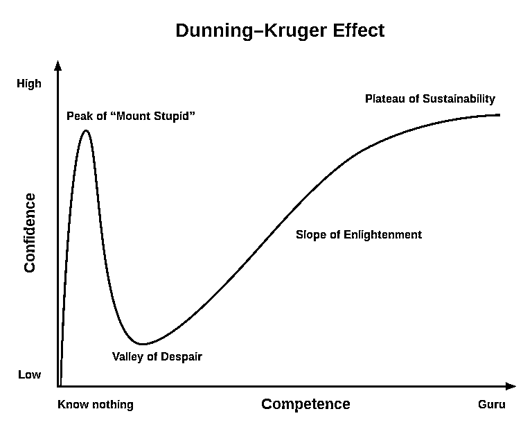

接下来我们根据 8 月 12 日在阿里系的 modelscope 社区开源的 FaceChain 项目，

了解与妙鸭相机技术逻辑高度相似的 FaceChain 的技术原理来进行分析学习。

## FaceChain 介绍

FaceChain 是一个个性化的肖像生成框架，通过结合定制化的图像生成模型和丰富的面部相关模型，以少量肖像图像作为输入，生成真实的个性化肖像。它同时是一个可插拔的框架，可以根据不同的个性化需求进行调整。

妙鸭相机的整套 AIGC 工作流实现并不简单，有一定经验的 Stable Diffusion 使用者都知道，loRA 或者 lyCORIS 的实际训练效果并没有那么好，而且自动化的训练方式更是难上加难，整套自动化工作流的实现也是多种算法模态的结合达成。

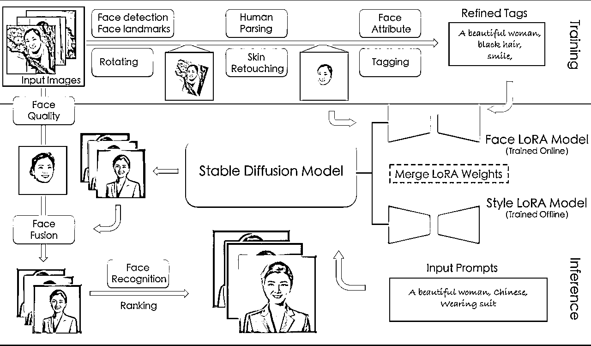

（整个项目的算法串联流程）

## FaceChain 原理解析

FaceChain 使用了一系列达摩院开发的面部相关模型，对用户上传的质量不一的数据集进行流程化的清洗工作，并开始自动化训练。

它的数据处理流程大致如下：

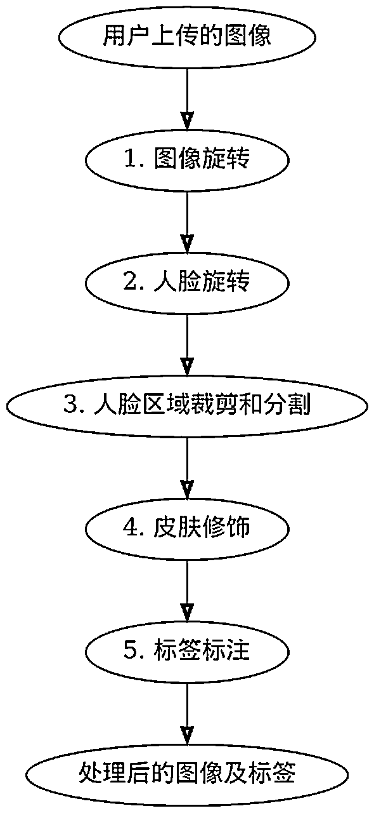

##### 图像旋转

首先，对用户上传的图像进行旋转。使用一个旋转角度判断模型来预测图像的旋转角度，然后根据预测结果对图像进行旋转，使得人脸在图像中的方向正确。

https://modelscope.cn/models/Cherrytest/rot_bgr

##### 人脸旋转

在图像旋转后可能仍然存在人脸方向不正确的情况。为了解决这个问题，FaceChain 使用一个更准确的人脸旋转模块，根据检测到的人脸关键点的位置进行旋转。通过人脸检测模型（DamoFD）获取人脸关键点的检测结果，然后计算旋转矩阵，将检测到的人脸关键点旋转到标准的人脸模板上。https://modelscope.cn/models/damo/cv_ddsar_face-detection_iclr23-damofd

##### 人脸区域裁剪和分割

在图像和人脸旋转后，使用人脸检测模型（DamoFD）确定人脸的边界框，然后裁剪出人脸区域，并根据人脸区域的大小和位置进行调整。接下来，使用人体分割模型（M2FP）生成头部区域的掩码，并根据掩码对人脸进行分割。这一步骤就是将头部从图像中分离出来。

https://modelscope.cn/models/damo/cv_resnet101_image-multiple-human-parsing

##### 皮肤修饰

由于用户上传的图像中的皮肤质量可能不理想，使用皮肤修饰模块（ABPN）来改善人脸图像的皮肤质量。该模块使用自适应融合金字塔网络对人脸图像进行实时的局部修饰。简单来说，就是对数据集进行美颜操作。https://modelscope.cn/models/damo/cv_unet_skin-retouching

##### 标签标注

使用 Tagger（DeepDanbooru）对处理后的人脸图像进行标签标注。首先，使用 DeepDanbooru 模型对人脸图像进行文本注释，得到初步的标签。然后，对标签进行后处理，选择与人物身份相关的标签，并移除与人物身份无关的标签。最后，使用面部属性模型（FairFace）预测人物的性别和年龄属性，并根据预测结果选择适当的触发词。https://github.com/KichangKim/DeepDanbooru/ https://modelscope.cn/models/damo/cv_resnet34_face-attribute-recognition_fairface

#### 穿插下个人见解

事实上，Tagger 的选择上存在更优解，例如 SwinV2、Vit、ConvNextv2、MOAT 等。这里以 MOAT 为例，它是一种简单而有效的卷积-Transformer 混合模型，通过移动卷积和自注意力模块的微观设计与宏观结构设计，在图像分类及下游任务上都有很优秀的表现。

DeepDanbooru 于 2019 年提出，它采用的是 ResNet 等传统 CNN 模型作为架构，而且它是一个专注于二次元图像理解的模型，而非通用任务。而 MOAT 提出了一个新的混合模块，融合了卷积和自我注意力机制，在通用视觉上表现更优。在 FaceChain 的任务中，数据并非二次元图像，DeepDan 或许在逻辑上不是最优解，但实际上，由于数据样本量太少，Tagger 带来的影响非常小，几乎可以忽略不计，所以哪个方便用哪个也是没有问题的。

FaceChain 在 LDM 本体上并没有特殊操作，但它使用了 Huggingface 的 Diffusers 库而不是 SD-WebUI 来进行推理。Diffusers 是一个基于 CLIP 理解语义运用扩散模型生成图像的强大开源库。它支持多种模型和 pipeline，只需要极少的代码就可以进行训练和推理。但 Diffusers 的运行方式与 WebUI 不同，它们使用的模型不能直接互换，需要进行转换后才能通用。推理前将训练好的人脸 loRA 模型和风格 loRA 模型按 multiplier 先 merge 进 SD 模型里，再使用合并后的模型进行推理，实际上，这也是 loRA 最初的使用方式，merge 进模型本体再推理，而不是像大家现在使用 WebUI 那样可以方便的热插拔。

这种合并模型的方式可以让我们在推理时同时使用多种风格的 loRA 模型，从而获得更加丰富的图像生成效果。同时，由于 Diffusers 支持多种模型和 pipeline，我们可以根据需要灵活地调整和优化推理过程，以获得更好的性能和效果。

但有意思的点在 FaceChain 的后处理上，FaceChain 在推理结束后会使用一个质量评估模型来给之前用户上传的数据集打分，然后选择分数最高的当作接下来的融合模板，然后使用一个人脸融合模型，将选出来的真实数据再次融合到生成后的图像上，这样一来，就解决了以前单纯使用人脸 loRA 模型出图不能保证脸一定像的问题，生成图像的脸就能非常接近训练集本身了。最后，FaceChain 还使用模型计算了面部相似性，即生成后的模型与模板图像的面部相似度，最后输出面部相似度最高的图像作为结果。

完整的推理流程如下：

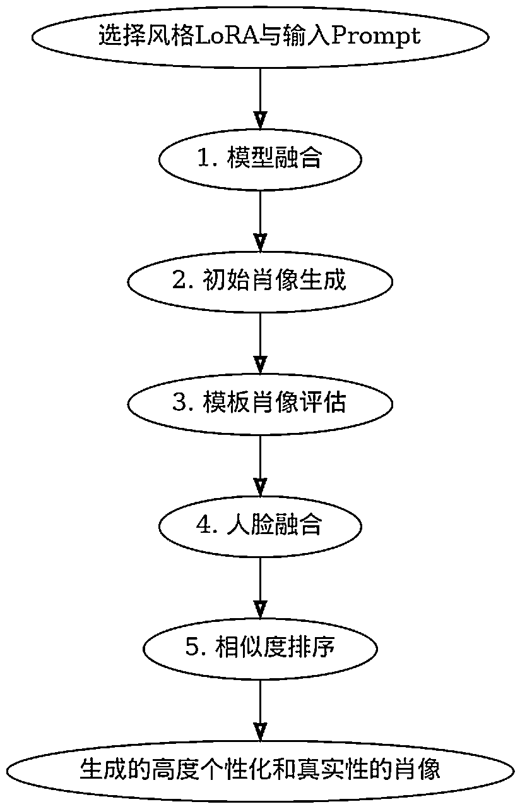

##### 模型融合

在推理阶段，将面部相关模型（face-loRA model）和风格相关模型（style-loRA model）的权重融合到基础的 Stable Diffusion 模型中。融合的权重可以根据需要进行调整，以平衡风格和面部特征的生成。

##### 初始肖像生成

使用融合后的模型，根据预设的输入提示词，通过 Stable Diffusion 的文本到图像生成流程生成初始的个性化肖像。这些肖像可能具有与输入提示词相对应的风格和面部特征。

##### 模板肖像评估

使用面部质量评估模型（Face Quality Assessment，FQA）对用户上传的所有人脸图像进行质量评分。评分最高的人脸被选作模板肖像。FQA 模型用于评估人脸图像的质量，可用于选择质量最好的人脸作为模板。https://www.modelscope.cn/models/damo/cv_manual_face-quality-assessment_fqa

##### 人脸融合

通过一个人脸融合模型，进一步改善生成肖像的面部细节和与输入肖像的相似性。融合模型使用从训练图像中选择的模板人脸进行融合，以保留主要的外观特征，并展示更精细的面部细节。https://www.modelscope.cn/models/damo/cv_unet-image-face-fusion_damo

##### 相似度排序

使用一个人脸识别模型，计算生成肖像与模板人脸之间的相似度。通过比较相似度，对生成的肖像进行排序，选择与模板人脸相似度较高的肖像作为最终输出。https://www.modelscope.cn/models/damo/cv_ir_face-recognition-ood_rts

通过以上的推理流程，FaceChain 能够生成具有高度个性化和真实性的肖像，并根据与输入肖像的相似度进行排序，以提供最优的输出结果。

# 二、妙鸭相机产品定位及设计：

## （一）创始团队介绍

妙鸭相机创始人张月光是产品经理出身，2016 年加入字节，担任时光相册产品负责人等职务，在职期间带领团队完成了数亿元的营收。2018 年，张月光离开字节，成立北京比特星光科技有限公司并担任 CEO，先后获得阿里、零一资本、险峰华兴三轮数百万美金投资，旗下二次元换装社交产品“元音”DAU 近 5 万，营收过百万。2020 年 7 月，张月光加入阿里巴巴，担任资深产品专家，先后负责优酷的短视频、直播等业务团队以及产品、设计团队。不过，据 36 氪了解到的业内信息，妙鸭如今还是归属于阿里大文娱体系下，并非独立公司。企查查信息显示，妙鸭相机背后主体为未序网络科技，为土豆网背后主体公司，而土豆在和优酷合并后，早已被阿里大文娱收购。未序公司法人代表张龙同时是优酷视频（西安）传媒科技有限公司的执行董事兼总经理，监事冯云乐则担任阿里巴巴监事。

根据妙鸭相机产品负责人张月光向财经 E 法介绍，团队在 2023 年 2 月初组建，起初只是五六个人组成的兴趣小组，研讨图像 AI 的新技术，一开始并没有非常清晰的商业目标。

进入 3 月，妙鸭相机团队觉得产品的关键技术已相对成熟，才定下图像 AI 中“写实人像”的垂直细分方向。

## （二）确定做一款娱乐兼社交的 AIGC 应用

#### 需求和趋势分析

首先，肯定要先仔细研究市场，了解当前和未来的需求趋势。观察用户行为，调查竞争对手，以确定图像 AI 写实人像在当前市场中是否有增长潜力，AI 头像的概念已经在 17 年就有提出，如果做头像那么会导致即使效果好，很多人会觉得还是用的换脸而已无吸引力，而写真的概念更匹配目前的要做的 AI 产品逻辑，同时写真在人们的印象里是可以接受先付费的概念。而从趋势上来讲，目前市面上的 AI 工具及应用多如牛毛，而 prompt 的输入是做为应用最大的弊处，在当前时代，人们看电影都懒得看完会选择直接去看一个抖音的电影解说视频，复杂的用户操作是无法裂变和快速传播的，那么最好的方式就是用户无需输入 prompt，傻瓜操作且出图效果惊人。

#### 用户受众分析

明确定义产品的目标用户群体。在这种情况下，娱乐性应用可能吸引年轻人和社交媒体用户，深入了解他们的兴趣、需求和行为习惯。既然是做写实人像，哪个方向最赚钱不用我说了把，可以说男性市场狗都不做，而在颜值经济的带动下，瞄准女性市场只要出图美观且与本人相似度高，传播度和付费情况基本无需担心。

#### 核心竞争力

确定妙鸭相机在图像 AI 写实人像领域的核心竞争力。这可能包括技术上的创新、用户界面设计、独特的模版设计等。如果简单的 loRA 训练即可做到自动化与效果兼备，何来的核心竞争力，所以技术壁垒是一定有的，目前简单的 loRA 训练无法做到自动化与效果兼备但多模态的结合是可以达到的。

#### 功能开发

根据市场需求和用户反馈，我会开发具有娱乐性质的功能，例如个性化的模版和社交分享功能。这些功能应该让用户感到有可玩性和传播性且具有可持续输出的内容。

#### 社交整合

考虑将产品与社交媒体平台整合，以便用户能够轻松分享他们的创意作品。社交分享可以增加产品的曝光度和用户粘性，首先上到微信小程序并以爱美女性的用户画像为基础，选择小红书作为媒介进行裂变。

#### 用户参与和反馈

建立用户反馈渠道，积极倾听用户的意见和建议。娱乐应用的成功通常取决于用户的积极参与，因此持续改进和更新至关重要，内测期间根据产品特性开展内测让用户感受并反馈改进。

#### 品牌营销和宣传

进行有针对性的品牌营销和宣传活动，以提高产品的知名度和吸引力。在娱乐社交类 app 市场中，品牌形象和营销策略通常与产品的成功密切相关。

#### 风险管理

考虑到涉及到用户生成的内容和隐私问题，确保产品在法律和道德上合规，采取必要的措施来保护用户数据和隐私，这块确实是妙鸭相机的一个没有处理好的地方，即便是中立性的技术，如果使用不当或者滥用，将衍生出隐私泄露、金融诈骗、虚假信息等诸多问题，随着算法备案和法律监管的越来越完善，未来，AI 技术的监管也将变得更加规范和严格。

## （三）产品效果才是本质

AI 应用与目前的互联网应用考虑的出发点角度不同，更像是互联网的早期阶段，我能做的产品不是我想做什么，而是目前 AI 能实现什么，基于目前的条件下，如果做写实人像的领域，我已知的做法是通过 Stable Diffusion 的 loRA 来实现，这个大部分人都知道，也是让大部分人觉得“我上我也行”的关键点，而在确定最终的展现形式为应用而不是工具的点上，一定要保证效果达到自己团队的人用了都会有“哇”的感觉才可以作为产品输出到市场。

那么如果要实现完美的效果且兼备自动化工作流及用户简便操作都需要解决哪些问题呢？

#### 到底需要取多少张照片做训练集？

这个我们团队也有做过测试，如果做单纯的 SD-WebUI 的 loRA 训练要保证训练的效果稳定且还原度高，那么训练集的张数如果少于 30 张，训练的效果就会有明显的下降，而且作为一款应用来讲，用户上传的图片和可作为训练集样本的图片是肯定会有出入的，也就是说如果想要保证质量的情况下，需要用户上传 50-60 张图片且大部分都是半身照有清晰的面部信息，才能保证效果的稳定出图，而且如果做成自动化工作流的话是没有手动调参的，这无疑对即像本人又好看的效果难度有进一步的加大。妙鸭相机团队的处理方式可能是在算法结合上增加了人脸识别模型，计算生成肖像与模板人脸之间的相似度，将相似度高的进行输出，而如果按照这套逻辑就可以减少用户上传的本人照片做训练集的张数，并且保证了输出结果的质量。

#### 如何才能保证训练的数字分身形象更像真人

首先FaceChain的逻辑是使用了 Diffusers 进行推理。在推理之前，将训练好的人脸 loRA 模型和线下找的风格化 loRA 模型按 Multiplier 先合并进 SD 模型里，再使用这个模型进行推理。即使采用这种方式训练，为了节省算力和保证效果，仍然可能会出现不像本人或者无法将 Steps 的值拉到太大的情况。为了避免过拟合，他们采用了一个巧妙的方式：我有你本人的照片呀，我直接进行人脸融合不就好了？这样至少可以从相似度上得到本质上的提升，而且即使训练的 loRA 因训练集不稳定（用户上传什么图无法保证）等各种因素影响导致效果比较差，也可以对效果上相似这一点有了稳定性控制。

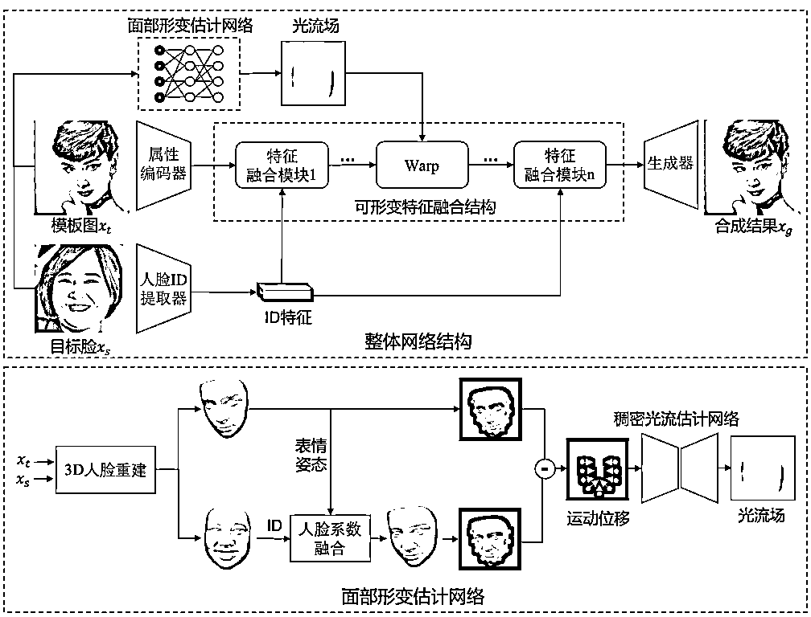

其实这是一个很简单的逻辑性问题，全网分析秒鸭的文章多如牛毛，但这个简单的处理方式却完全没有人提出过。如果说现在的 AI 产品经理懂很多算法的比较少，但至少应该知道人脸融合模型，可是没人想过将这两个算法结合起来来保证人像的相似性。AIGC 多模态的体系很多人都有在讲、很多人都在提，可是实际应用的时候却没有人想到。我认为这为未来多模态应用提供了一个值得思考的方向：到底多模态的效果结合要做到什么，我要实现的 AI 工作流效果是什么，在清晰所需效果的情况下去反推多模态的结合需要哪些算法和模型，而兼容性和稳定性就需要大量的测试了。

#### 用户上传的照片质量无法保证怎么办？

商用和自训练的本质差异在于自训练你是知道自己要训练的模型效果是什么样子，所以你可以尽量去寻找匹配效果的优质训练集，而商用则不同，用户付费后因为我上传的照片质量不过关所以导致我做出来的数字分身形象丑，这个理由是不会被用户所接受的，如果蕴含了大量市场教育成本在的应用是很难裂变和推广的，所以在确立用户无需输入 prompt 的前提下，该怎样保证用户上传的照片做训练集效果尽量优质呢，这里妙鸭相机的处理方式在前端的处理上将训练集分为两步进行采集（其实按照 FaceChain 的技术逻辑是通过算法取所有上传上来的照片的质量评分最高的当做模版，而妙鸭相机这里分为了两步执行，我推测有两种可能：1。考虑到用户使用感受，如果一次性上传 20 张可能很多人相册里都没有二十张照片会直接放弃，而先上传一张确保有质量的照片再补充 20 张照片，而很多用户会觉得已经上传一张了就再拍几张照片吧。2.这块妙鸭相机没有做质量检测评分，直接默认用户上传的第一张照片作为模版照片，节省计算力。）第一步上传人脸正面照，同时通过人脸检测算法判断是否有清晰的五官信息，并添加了照片样例指引，第二步添加 20 张照片，同样通过人脸检测算法来识别是否为与第一张照片相同的人脸和是否具有清晰的五官信息，为了保证数据集的效果在算法上应用了图像旋转，人脸旋转，人脸区域裁剪和分割，皮肤修饰等算法来保证训练集的质量。

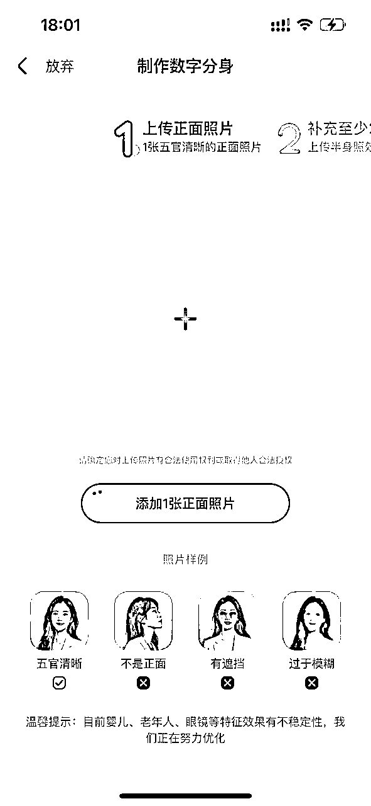

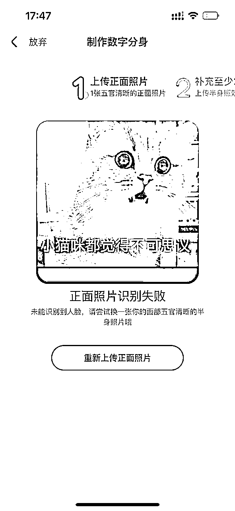

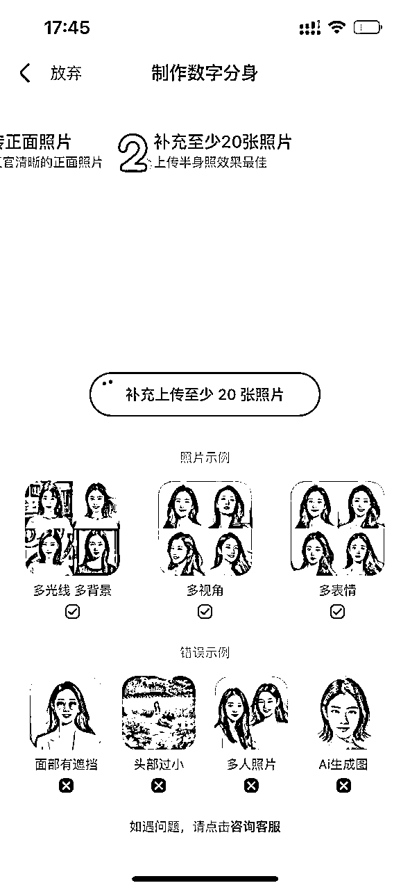

#### 美观 or 真实的如何平衡？

保证图片美观还是保证出图真实的还原度，还是要从妙鸭相机的概念讲起，很成功的营销实例是妙鸭相机的定义为“写真”而不是头像，首先 AI 生成头像或者换脸的玩法早在 17 年就有过，颜值经济已经是社交市场的必然逻辑，真实度的还原没有那么重要，作为市场运营或者产品的角色对于任何一项技术要考虑从用户角度出发这个技术的推出到底有怎样的作用，而不是技术思维。海马体，天真蓝等等拍的照片精修后的人像还原度也没有很高，个人感觉也挺抽象的，而且不管是线下写真还是数字写真，我为什么要拍或者为什么要做，是为了展示更美的自己还是为了看看自己穿那套衣服是什么样子呢？所以在保证一定的真实度还原的基础上，美观才是最重要的，所以在数据集的处理上直接用了皮肤修饰相当于给训练集加了一层美颜效果，而前端也可以根据模版的不同去直接增加一些滤镜效果来保证出图的美观性。

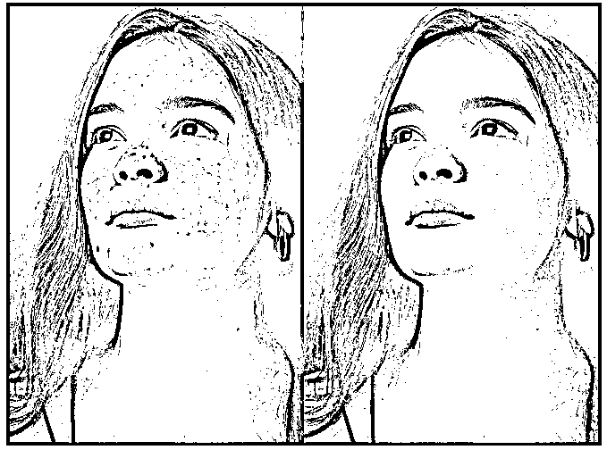

### （四）设计怎样的前端和 UI 才能给予用户更好的操作体验？

#### 1.简单易用

妙鸭相机与传统的 AI 绘画小程序不同，它能够让完全没接触过 AI 绘画（AI 生成）的用户在进入主页之后第一时间指到自己应该做什么以及要做几步。而以灵创 AI 为代表的 AI 绘画小程序功能过于繁多。普通用户进入小程序后不知道自己该做什么，该如何操作。虽然作为小程序已经做了简化，但是对于普通用户而言仍然门槛过高。

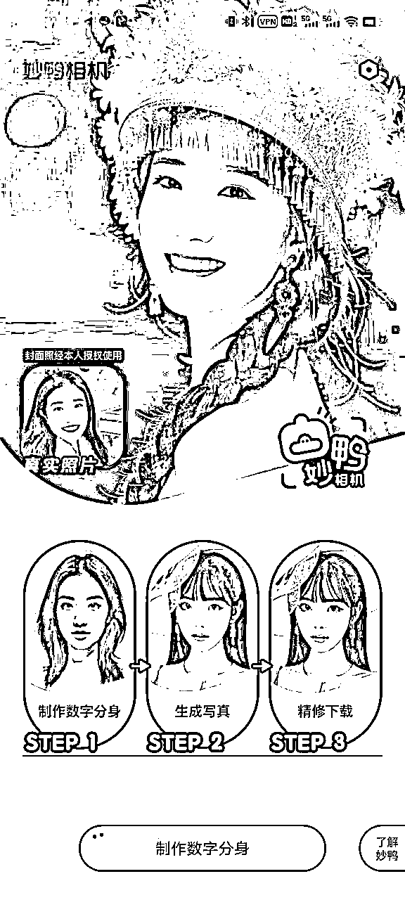

（妙鸭相机） （灵创 AI） （艺马）

#### 2.青春美观

UI 设计风格比较清新和简洁。在色彩上，使用了淡雅的色调，给人一种舒适和宜人的感觉。由于采用了先付费的商业逻辑，选择在首页增加了超过一半屏幕的真人效果演示，同时，图标和按钮的设计也很简洁明了，个性化模板页面也非常简洁。相比其他的 AI 应用，由于受到技术更新迭代的影响，老模型因为有用户在使用无法更换，又要不断增加新的模型导致用户界面越来越复杂，秒鸭的整体用户界面看起来更容易让用户理解并操作。整体来说，妙鸭相机的 UI 设计注重用户体验，让用户在使用过程中感到轻松愉悦。

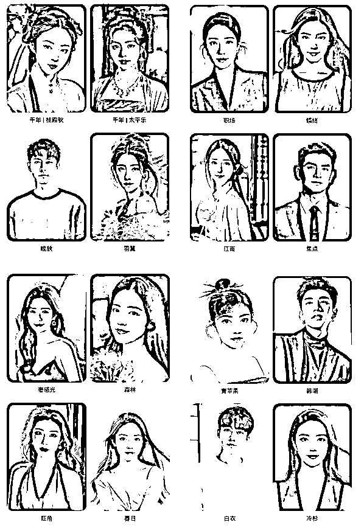

### （五）核心绕不开算力，商业模式的设计如何合理？

AI 的产品和传统互联网产品不同，有很多东西是无法优化和避开的，例如高昂的算力成本，训练的等待时间，模型的现有缺陷，多模态结合后效果稳定性等等，而无法解决就要去找到一个平衡点，训练时间=效果，只要选择训练来提高出图质量那么一定会有训练这个无法避免，所以只能尽量的去提升效果。而似乎大家讨论最多的话题就是妙鸭相机的先付费设定，那么我们通过流程图的方式来看下先付费和后付费两种方式的优劣。

（图 1）

#### 1.“AIGC1.0 时代，用户先付费”

按图 1 如果不是 AIGC 的产品，我肯定也会觉得这个产品经理绝对是疯了，用户一共需要上传 21 张照片，而且传完照片后就要立刻付费，没有给用户任何体验。更过分的是我付费后还需要排队等着，高峰期要等 8～10 个小时才能继完成数字分身，数字分身完成后我选择模板还要再等 2 分钟左右才能出一组图片，这种产品设计显然是不合理的，也不符合用户的使用逻辑。但然而，考虑到无法避免算力成本和训练时间的存在，妙鸭团队的产品定位非常明确。如果整套逻辑的实现一定要有训练时间，那么我就要主打数字分身，写真的概念，相当于你训练一次之后可以无限再我的产品里制作风格模板，我不是在给你出照片或者 AI 画画，我是在给你出写真一个你的数字形象分身，如果整套逻辑的实现一定算力成本很高，那么我就主打小红书等女性用户市场保证出图的效果，商业化前置，保证用户第一次进来就要付费，提高一次转化，AIGC 时代如果用户第一次不付费后面也很难付费了。

#### 2.“互联网时代，免费应用扩大规模”

在移动互联网时代，所有的应用都是免费的，并愿意为了扩大用户规模，不惜进行各种补贴。那是因为，从创业者到投资人都相信，只要做大用户规模，就可以通过游戏、电商、广告等方式实现流量变现。

而如果按照这套流程去走肯定更符合用户的行为逻辑，等待时间跟效果挂钩，这个无法改变，让用户先看到效果图，就意味着每一个进来的用户都可以去训练一个 loRA 形象，我们来简单计算下成本：

以目前国内租赁算力最便宜的 AutoDL 举例，一张 A100 （80G） 的显卡是 4400 元/月。

满负荷状态下同时 4 个训练任务，15～20 分钟的时间可以完成数据清洗加训练加推理的过程，24 小时不间断训练的情况下，可以出 384 个 loRA，平均每个 loRA 0.4 元的训练成本。平均 20 个用户体验就要有 1 位用户付费才能收回成本。

如果按照阿里云的价格计算，平均一个 loRA 的训练成本就要 2 元。平均 5 个用户体验就要有 1 位用户付费才能收回成本。

以上还不包括存储成本，CDN 成本，技术成本等等。

而如果每一个用户进来都可以先训练一个自己的 loRA 形象无需付费的话，假设一个小时之内进来 1000 个用户，需要准备至少 60 台 A100 才能满足训练需求，而妙鸭相机的高峰日新增用户量高达 127w，如果不需付费即可体验的话，人数只会更多，AIGC 应用的算力成本相对移动互联网应用更高，因此如果采用免费模式，长期来看可能难以为继。

# 三、妙鸭相机的市场运营

从运营角度到底比其他的 AIGC 应用强在哪里？为何妙鸭相机可以快速破圈成为现象级应用？

我们接下来从行业切入，软件定位，经济设定，热点营销，用户评价几个角度来深度解析。

### （一）行业切入

##### 确定行业，准确切入摄影蓝海

妙鸭相机的成功可以追溯到其准确把握了用户需求。现代社会中，人们对高质量的证件照、形象照和写真照有着刚性需求。传统摄影行业价格高昂，而成片质量难以保障，导致消费者在选择摄影服务时常常感到困扰。妙鸭相机以低成本试错的方式填补了这一市场空白，满足了用户需求。

##### 瞄准痛点，识别市场需求

首先，妙鸭相机识别了市场中的痛点。海马体是国内知名的形象照、写真照、证件照实体门店，其广泛的覆盖面积证明了这一市场领域的需求巨大。妙鸭相机正是通过分析海马体的成功模式，找到了市场的空白：高质量的照片需求与传统摄影行业价格高昂和质量难以保障之间的矛盾。这个痛点为妙鸭相机提供了发展机会。

##### 对标竞争对手，借鉴成功经验

通过对标海马体，妙鸭相机获得了宝贵的市场经验和成功模式。海马体以其高质量的形象照和写真照服务而闻名，妙鸭相机借鉴了这一经验，并在数字领域寻找了类似的机会。妙鸭相机通过将 AI 技术应用于照片生成，降低了成本，提高了效率，并试图解决了传统摄影行业的问题，如价格高昂和质量不一致。

##### 利用市场认知，建立品牌关联

海马体在国内拥有广泛的市场认知度，许多人将其视为形象照、写真照、证件照的首选。妙鸭相机意识到了这一点，并试图建立与海马体的品牌关联。这种关联有助于妙鸭相机在市场上建立信任，吸引那些已经熟悉并信任海马体的用户，和消费不起高额线下写真费用的用户

##### 创新与差异化，突出优势

尽管对标海马体，妙鸭相机仍然通过创新和差异化来突出其优势。妙鸭相机利用 AI 技术提供了独特的卖点，使用户能够自动生成高质量的形象照和写真照，而无需付出传统摄影行业高昂的费用。这种差异化帮助妙鸭相机在市场中脱颖而出。

##### 满足用户需求，强调成本效益

通过对标海马体，妙鸭相机了解到用户对高质量照片的需求。妙鸭相机通过以相对较低的价格提供高质量的 AI 生成照片，满足了用户的需求，并提供了成本效益。这一策略吸引了那些寻求高质量照片但又不愿支付传统摄影服务高费用的用户。

总的来说，妙鸭相机采用对标海马体的营销策略，通过识别市场需求、借鉴竞争对手的成功经验、建立品牌关联、创新与差异化以及满足用户需求，成功填补了市场空白，吸引了广泛的用户群体。这一策略为妙鸭相机的崛起提供了坚实的基础，同时也反映了其对市场机会的敏锐洞察和灵活应变能力。

### （二）软件定位

##### 快速裂变用户的微信小程序战略

妙鸭相机最初选择微信小程序的形式，这是一个明智的策略。微信拥有庞大的用户基础，小程序可以在不离开微信平台的情况下提供功能，这有助于用户快速了解和使用妙鸭相机。此举还能够在微信社交圈内进行传播，实现用户快速裂变。这种策略帮助妙鸭相机在竞争激烈的市场中脱颖而出。

##### 精准切入女性市场

妙鸭相机在产品定位上选择精准切入女性市场，这是一步明智之举。AI 写真的功能吸引了众多女性用户，因为它能够满足她们对于美丽和形象的需求。在小红书等女性用户聚集的平台上进行内测和营销，有助于更精确地吸引潜在女性用户，建立口碑和信任度。这种定位让妙鸭相机在特定用户群体中建立了强大的市场地位。

##### 抓住小而美的生活痛点

妙鸭相机的核心在于抓住了小而美的生活痛点。用户常常需要高质量的照片，但传统摄影服务昂贵且繁琐。妙鸭相机通过提供 AI 生成照片的便捷方式，满足了用户对美丽形象的需求。这种关注用户的实际需求，解决生活中的痛点，是妙鸭相机成功的关键因素之一。

##### 触及下沉市场和欠发达地区：

妙鸭相机的软件定位策略的另一个重要方面是其能够触及下沉市场或欠发达地区的用户。在中国，城市和发达地区的用户通常更容易获得高质量的服务。妙鸭相机的 C 端场景覆盖了许多较小城市和农村地区，为这些地区的用户提供了便捷的 AI 写真服务，使其也能够享受到高质量的照片。这不仅有助于覆盖更广泛的用户群体，还有助于推动数字化服务的下沉。

总的来说，妙鸭相机的软件定位策略是非常成功和富有远见的。它充分利用了微信小程序的裂变潜力，通过精准切入女性市场，抓住了用户的生活痛点，同时也触及了下沉市场和欠发达地区的用户。这一定位策略有助于妙鸭相机在竞争激烈的市场中脱颖而出，并为其未来的增长提供了坚实的基础。

### （三）经济设定

妙鸭相机的经济体系在其成功中起到了关键作用。这一体系包括了其特殊的商业模式、价格定位以及对 AIGC（人工智能生成内容）市场的深刻理解。以下是对妙鸭相机经济体系成功因素的深度分析：

##### 价格定位与用户付费意愿

妙鸭相机选择采用付费服务的模式，并定价为 9.9 元的权益服务。这个价格定位是经过深思熟虑的，不仅考虑了算力成本，还考虑了用户的付费意愿。在 AIGC 领域，用户通常愿意为高质量的内容和服务付费，特别是当这些内容满足了他们的个性化需求。价格相对亲民，同时也降低了用户试用的门槛，这一因素有助于吸引更多用户尝试妙鸭相机的服务。

##### 商业化前置

与传统的互联网时代商业模式不同，妙鸭相机采用了商业化前置的策略。这意味着从产品诞生的第一天起，就向用户收费。这一策略消除了后续变现的压力，因为用户在使用产品时已经支付了费用。这对于 AIGC 产品来说尤为重要，因为这些产品通常需要投入大量的计算资源来生成内容，如果不能在一开始就收回成本，后续的可持续经营将变得困难。

##### AIGC 时代商业逻辑的理解

妙鸭相机团队深刻理解 AIGC 时代与互联网时代商业逻辑的根本性差异。在互联网时代，业务通常侧重于信息流通和渠道生意，先提供免费渠道，然后逐渐增加变现的模式。然而，在 AIGC 时代，相关应用软件更像是“AI 工厂”，生产内容需要大量算力。因此，向用户收费从产品诞生的第一天开始就是理所当然的，而不需要依赖后续的变现模式。这一理念有助于确保商业可持续性，同时也可以更好地把控算力成本。

##### 早期商业化的优势

妙鸭相机采用了早期商业化的策略，这使得它在 AIGC 领域中能够更早地建立品牌和盈利能力。这与互联网时代中的先攫取大量流量再变现的路径不同，因为在 AIGC 时代，产品迭代速度加快，其他产品可能很快涌现并取代原有产品。通过早期商业化，妙鸭相机能够获得稳定的收入来源，而不必依赖大规模用户获取流量。

综上所述，妙鸭相机的经济体系成功因素在于其独特的商业模式、合理的价格定位、对 AIGC 时代商业逻辑的深刻理解以及对用户需求和市场潜力的准确把握。这些因素共同推动了妙鸭相机的成功，并使其在竞争激烈的市场中脱颖而出，成为 AIGC 领域的重要参与者。随着中国摄影市场的不断增长，妙鸭相机有望继续取得长期稳定的成功。

### （四）热点营销

##### 社群内测的智慧选择

妙鸭相机在最初采用了社群内测的策略，通过在小范围内测验产品，妙鸭相机能够快速获取用户反馈，解决问题，并改进其产品。这不仅有助于提高产品质量，还在社交媒体上引起了关注，激发了好奇心，为正式发布积累了期待。

##### AI 与摄像的大众对立角度

妙鸭相机通过将 AI 与传统摄像进行对比，成功引发了大众的兴趣。这种对立角度使人们开始思考传统摄像和 AI 生成内容之间的区别和优劣，从而引发了更多的对话和讨论。这种对立性的角度也在社交媒体上产生了更多的话题，增加了产品的曝光度。

##### 制造分享的心理门槛降低

妙鸭相机与其他美颜相机不同，用户照片的美化结果并非用户主观修改，而是被动的由AI修改，从而降低了用户分享美照的心理门槛。很多人渴望与他人分享自己的美丽形象，但担心会引起他人的议论和嫉妒。并且，用户也可以借着宣传AI生成的科技成果，用户更容易将照片分享到自己的社交圈，同样降低了分享的社交风险。

##### 付费先使用的机制设计

采用先付费后使用的机制，妙鸭相机使消费者在使用产品之前就支付费用。这种机制激励用户积极尝试产品，因为他们已经花费了一定的费用。使得消费者无论满意与否，都会有“钱都花了，得分享分享”。

# 四、延展思考与总结

##### （一）作为 AI 模型技术人员学习算法应用和技术集成

1.  模型集成和迁移： FaceChain 使用了多个不同的深度学习模型，包括人脸检测、关键点检测、图像旋转、人脸属性预测、人像美肤等。你可以学习如何将这些不同的模型集成到一个统一的工作流程中，以解决复杂的计算机视觉任务。

1.  Stable Diffusion 模型应用： FaceChain 使用 Stable Diffusion 模型来生成个人数字形象。你可以学习如何使用这种强大的生成模型来实现文本到图像的生成任务，以及如何微调和应用这种模型。

1.  数据预处理和增强： 数据预处理是深度学习任务中至关重要的一步。在 FaceChain 中，你可以学到如何对用户提供的图像进行旋转、关键点标定、人体解析和美肤等预处理步骤，以提高输入数据的质量。

1.  模型微调： FaceChain 使用 loRA 训练的人脸模型微调。你可以学习如何使用已有数据对模型进行微调，以适应特定任务的需求。

1.  用户界面开发： FaceChain 提供了 Gradio 界面，使用户能够与模型进行交互。你可以学习如何开发用户友好的界面，以便用户能够轻松地使用你的 AI 模型。

1.  模型评估和优化： FaceChain 使用人脸质量评估和相似度计算等技术来评估生成的图像质量。你可以学习如何评估和优化生成模型的性能，以提供更高质量的输出。

1.  创新和应用领域： FaceChain 探索了个人数字形象生成的创新应用领域，如数字身份认证和虚拟形象创建。你可以学习如何将深度学习技术应用于新兴领域，推动创新和研究。

##### （二）作为 AI 产品经理学习产品思路和思维

1.  技术应用和集成：了解如何将不同的 AI 技术集成到产品中，以提供更丰富的功能和用户体验。妙鸭相机的成功部分在于它能够整合多个 AI 算法来实现照片美化功能。你可以从 FaceChain 中学到很多关于深度学习技术应用于产品开发的经验。你可以关注模型选择、集成、用户界面设计、隐私保护等方面，以提高产品的质量和用户满意度。也需要深度思考下当前 AI 热潮下什么才算是真正的应用，而如何设计这样的产品以及除去熟知的 Stable Diffusion，chatgpt，midjourney 等产品外，其他的算法及产品的结合，及必须结合具体场景，回归自己擅长的领域，思考能不能用 AI 解决所在领域的问题。

1.  用户体验设计：重视用户界面和用户体验的设计。确保产品易于使用，符合用户期望，并提供愉悦的使用体验。妙鸭相机的用户界面设计在吸引用户和提高留存率方面发挥了关键作用，当前市场的消费人群更喜欢直接简单的界面，快速可具有传播度的效果。

1.  不断创新：在 AI 领域，不断创新是至关重要的。了解最新的 AI 技术和趋势，思考如何将其应用到你的产品中，以保持竞争力。

1.  市场定位和目标受众：了解你的产品的目标市场和受众。妙鸭相机成功地定位在女性用户市场，并根据这一市场需求进行了产品优化和营销。

##### （三）作为市场运营学习用户导向和营销

1.  产品了解：深入了解所在行业和产品的本质非常重要。了解产品的算法、技术应用和核心优势将帮助你更好地传递产品的价值，制定相关的市场策略。

1.  用户导向：妙鸭相机的成功突出了用户体验的重要性。用户界面的简洁性、易用性和解决用户生活痛点的功能是吸引用户的关键因素。在市场运营中，你可以强调产品的这些方面，制定相关的宣传策略。

1.  商业模式理解：了解不同商业模式的优势和劣势对于制定市场策略至关重要。妙鸭相机选择了先付费后使用的模式，这种商业逻辑的理解有助于你更好地传达产品的价值，以吸引潜在用户。

1.  定价策略：学习如何制定有效的定价策略是市场运营的一项关键技能。妙鸭相机的定价策略考虑了多重因素，包括市场需求、竞争情况和产品成本。你可以借鉴这种方法，确保你的产品或服务的价格合理且有吸引力。

1.  竞争优势：了解如何建立竞争优势对于市场运营至关重要。妙鸭相机通过采用不同的商业模式，在竞争激烈的市场中脱颖而出。你可以思考如何突出你的产品或服务的独特之处，并将其传达给目标受众。

1.  社群和热点营销：了解社群和热点营销的概念以及如何利用它们来推广产品或服务。妙鸭相机通过在社交媒体上激发用户分享和讨论，增加了产品的曝光度。你可以考虑采用类似的策略，建立用户社群，增加用户互动，提高品牌知名度。

1.  持续学习：了解新技术和市场趋势对于市场运营人员至关重要。保持对行业的持续学习，了解最新的市场动态和竞争情况，以便制定相应的策略。

##### （四）作为 AI 行业创业者学习商业模式和市场定位。

1.  技术核心与应用：妙鸭相机的成功强调了技术的核心性和如何将 AI 技术应用于实际产品中。了解不同 AI 算法和技术，以及如何将它们整合到产品中，对于在 AI 行业创业至关重要。确保你的技术解决方案能够解决真实世界的问题，满足用户需求。

1.  用户体验至上：妙鸭相机的成功部分在于它强调用户体验。在 AI 行业，用户界面的设计、产品易用性和解决用户痛点的能力非常重要。确保你的产品不仅在技术上出色，还要让用户感到愉悦和满意。

1.  商业模式选择：了解不同的商业模式以及它们的优势和劣势。妙鸭相机选择了一种先付费后使用的商业模式，这种模式可以在一开始就为公司带来收入。根据你的产品和市场，选择适合的商业模式，并深思熟虑如何将其实施。

1.  市场定位：妙鸭相机通过精准的市场定位，针对女性用户并在社交媒体上建立了强大的社群。了解你的目标受众，制定相应的市场定位和营销策略，以吸引潜在用户。

1.  定价策略：学习如何制定有效的定价策略。妙鸭相机的定价策略考虑了多个因素，包括成本和市场需求。根据你的产品和目标市场，制定合理的价格，并确保它能够覆盖成本并为公司带来盈利。

1.  社群和热点营销：利用社交媒体和热点话题来推广你的产品。妙鸭相机通过激发用户分享和讨论，扩大了产品的知名度。建立用户社群，鼓励用户互动，可以有效增加品牌曝光度。

1.  不断创新：AI 行业变化迅速，要不断关注最新的技术和市场趋势。思考如何将新技术应用到你的产品中，以保持竞争优势。同时，不断改进你的产品，以满足不断变化的用户需求。

1.  风险管理：在 AI 行业，技术和隐私风险是不可忽视的因素。确保你的产品符合法规，关注数据隐私和安全问题，并采取适当的措施来减轻潜在风险。

# 五 结尾

终于完成了人生中第一篇万字长文，你能看到这就已经是对我莫大的鼓舞。

希望本文能对所有 AIGC 的从业者和爱好者有一些帮助！

也欢迎大家跟我一起探讨 AIGC 的火爆项目及技术工具！

当然以上内容或许存在一些问题或者不完善的地方，欢迎大家提出宝贵的意见和建议。vx：maochunshen