# 万字解读ChatGPT提示词最佳实践

> 来源：[https://sif8f6uboze.feishu.cn/docx/H2C2devTSoZBRUx1m6YcOoFynuh](https://sif8f6uboze.feishu.cn/docx/H2C2devTSoZBRUx1m6YcOoFynuh)

*   作者: 熊猫Jay

*   公众号：熊猫Jay字节之旅

*   原文:

*   https://mp.weixin.qq.com/s/Ghtm_7jSRhWNcIoi914U0g

*   https://mp.weixin.qq.com/s/jkLuQKLZAiKBPs2u_hFlrA

*   https://mp.weixin.qq.com/s/nB8kDNzXBypQHAUaODRAVQ

## 一、介绍

大家好，我是熊猫Jay，许多小伙伴向我反馈，虽然知道很多提示词模版，但关于提示词的基本最佳实践仍然不够清晰。

令人惊讶的是，即使有一些小伙伴 使用GPT近半年，在与我交流后，我发现他们实际上并没有深入研究这些最佳实践，导致他们在提出问题和优化提示词的时候还是摸不着头脑。

这篇文章是写给对于提示词最佳实践了解一般的新手小伙伴们，大佬们可以忽略啦。

觉得文章有用的小伙伴, 帮忙在文章上点个赞! 之前写文章都是熬夜码字!

文章也被多位大佬们所鼓励和推荐，非常感谢他们：


其次，我会针对 不同的策略实际测试一些案例，帮助大家更快地理解这些最佳实践。

大家不用担心自己无法理解官方的术语，或者长篇大论的内容，针对比较 难以理解的最佳实践，我会进行 解读和案例的说明。并且，我在每个最佳实践下，我都备注了 适用人群，大家可以看看自己是否适合，这样有助于节省大家的阅读时间。

那话不多说，我们开始吧。

## 二、角色

在每项最佳实践的案例中，会涉及到不同的三种角色 USER、ASSISTANT、SYSTEM，这边我先统一介绍下。我们来问下ChatGPT：

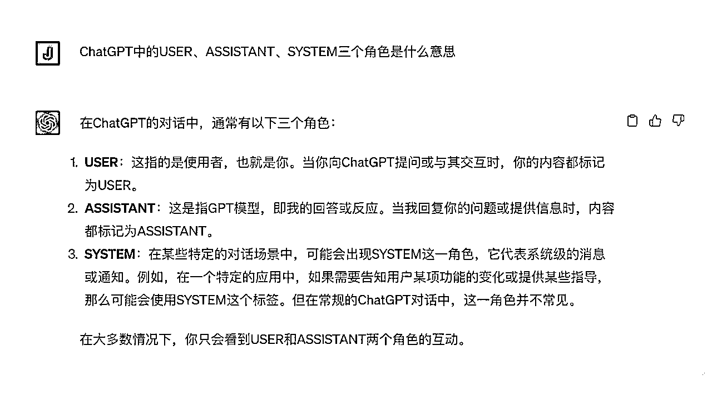

SYSTEM 这个角色在ChatGPT官方页面的对话中，基本上是不会出现的，因为ChatGPT主要是为了与用户进行直接的交互。但是如果我们 利用ChatGPT的API开发 来自己的应用，那么 SYSTEM 角色是可以在一些场景中发挥作用的。

如下是一个在 音乐小助手 应用程序的对话场景，我们可以看到，SYSTEM 角色充当了后台角色的作用：

```
 SYSTEM: 提示：您可以问我任何与音乐相关的问题。
 USER: 什么是贝多芬的第五交响乐？
 ASSISTANT: 贝多芬的第五交响乐是......（详细描述）。
```

此外，如果有小伙伴不了解编程方式，但是想要在ChatGPT上尝试SYSTEM角色，则可以直接使用即可。

这里"当我请求帮助写东西时，你将在每个段落中至少加入一个笑话或俏皮话。" 在案例中虽然就是 SYSTEM 角色。也就是在开发时利用 API 才可以使用的 系统管理员角色。

但是这里，为了方便在ChatGPT窗口上测试，在下面的 所有案例 中，我们都在聊天窗口用 USER 的角色来替代SYSTEM 角色。

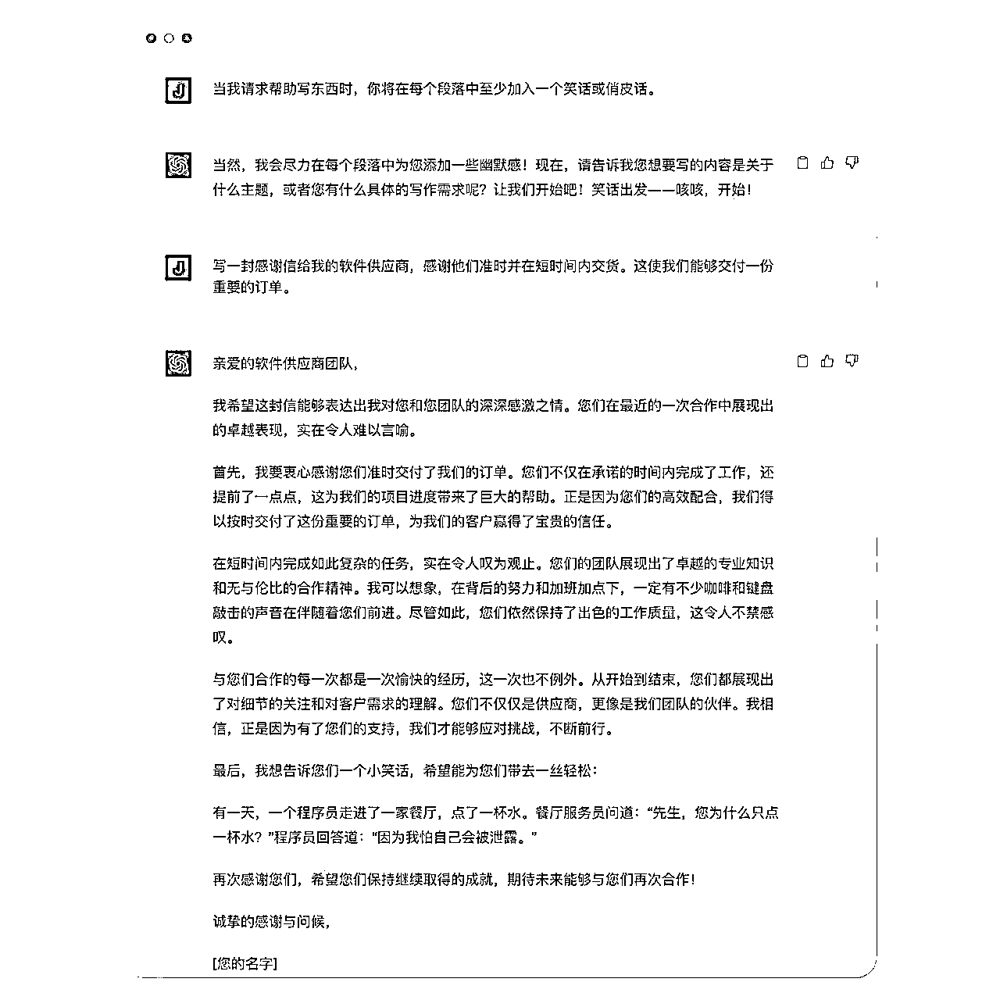

当我们对角色具备清晰的了解后，看下面官方提供的案例就不会迷惑啦。

## 三、最佳实践1 - 编写清晰的指令

GPT 无法读取您的思想。如果它们的输出过长，请要求简洁回复。如果它们的输出过于简单，请要求专业水平的写作。如果您不喜欢某种格式，请展示您想要看到的格式。GPT 越少猜测您想要的内容，您获得的可能性就越大。

策略：

*   在查询中包含详细信息，以获得更相关的答案。

*   要求模型扮演某个角色。

*   使用分隔符清晰地表示输入的不同部分。

*   指定完成任务所需的步骤。

*   提供示例。

*   指定输出的期望长度。

*   提供参考文本。

### 一）策略1：在查询中包含细节以获得更相关的回答

适用人群：新手

难度：🌟

为了获得高度相关的回复，请确保请求提供任何重要的细节或上下文。否则，这会让模型进行猜测您的意思，结果也会不尽人意。

#### 解读

这个策略的价值在于，通过提供更多的详细信息，用户可以获得更准确、更具体的答案。这样可以减少模型的猜测和误解，从而提高交互的效率和满意度。GPT模型就像是您的男朋友，但它有时候是真的猜不出来呀(手动 狗头)。

### 二）策略2：要求模型扮演角色

适用人群：新手

难度：🌟

系统消息可以用于指定模型在回复中扮演的角色。

```
 USER
 写一封感谢信给我的软件供应商，感谢他们准时并在短时间内交货。这使我们能够交付一份重要的订单。

 SYSTEM
 当我请求帮助写东西时，你将在每个段落中至少加入一个笑话或俏皮话。
```

#### 解读

当我们指定一个角色，这样，模型的回答将会根据所采纳的角色特性来进行，使得回答更具特色和针对性。那么输出的质量也会随之提升。

### 三）策略3：使用分隔符清晰标示输入的不同部分

适用人群：新手

难度：🌟

像三重引号、XML标记、节标题等分隔符可以帮助标示需要以不同方式处理的文本部分。

```
 USER
 使用三重引号中的文本撰写一首诗。

 """在这里插入文本"""
```

```
 SYSTEM
 你将获得一对关于同一主题的文章（用XML标记分隔）。首先总结每篇文章的论点。然后指出哪篇文章提出了更好的论点，并解释为什么。

 USER
 在这里插入第一篇文章

 在这里插入第二篇文章
```

```
 SYSTEM
 你将获得一份论文摘要和一个建议的标题。论文标题应该给读者一个很好的论文主题概念，同时也要引人注目。如果标题不符合这些标准，请提出5个备选方案。

 USER
 摘要：在这里插入摘要

 标题：在这里插入标题
```

对于像这样的简单任务，使用分隔符可能不会对输出质量产生影响。然而，任务越复杂，将任务细节澄清变得越重要。不要让 GPT 努力理解您究竟在要求什么。

#### 解读

想象一下，您正在组装一款复杂的玩具，但所有的零件都混在一起，没有任何标签或说明。这会让组装过程变得非常困难，对吧？

同样，当模型处理一个复杂的输入时，如果没有清晰的分隔符来区分不同的部分，模型可能会混淆或误解某些内容。使用分隔符就像给玩具零件加上标签和说明，使组装过程变得更加流畅和准确。

### 四）策略4：指定完成任务所需的步骤

适用人群：新手

难度：🌟

某些任务最好指定为一系列步骤。明确写出这些步骤可以让模型更容易跟随。

```
 SYSTEM
 使用以下逐步说明来回应用户输入。

 步骤1 - 用户将用三重引号提供给您文本。用前缀"Summary: "对这段文本进行一句总结。

 步骤2 - 将步骤1中的总结翻译成西班牙语，并使用前缀"Translation: "。
```

#### 解读

当我们提供固定的步骤，要求模型提供输出，这样模型可以参考步骤更好地输出内容。如下为测试案例：

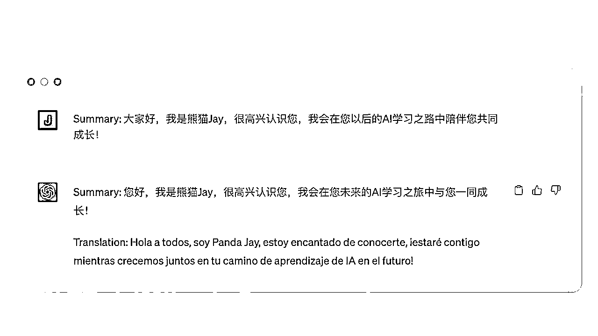

### 五）策略5：提供示例

适用人群：新手

难度：🌟

通常情况下，提供适用于所有示例的一般说明比通过示例演示任务的所有变体更高效，但在某些情况下，提供示例可能更容易。例如，如果您打算让模型复制一种难以明确描述的用户查询响应风格。这被称为 "few-shot" 提示。

```
 SYSTEM
 用一致的风格回答。

 USER
 教我什么是耐心。

 ASSISTANT
 刻出最深峡谷的河流起源于一处平凡的泉眼；最壮丽的交响乐源于一颗单独的音符；最复杂的挂毯始于一根孤立的线缕。

 USER
 教我关于海洋。
```

### 六）策略6：指定所需的输出长度

适用人群：新手

难度：🌟

您可以要求模型生成指定长度的输出。目标输出长度可以根据词数、句子数、段落数、项目符号数等来指定。但请注意，指示模型生成特定数量的单词并不具有高精确度。模型更可靠地生成具有特定段落或项目符号数量的输出。

```
 USER
 用大约50个词总结由三重引号分隔的文本。

 """在这里插入文本"""

 USER
 用2个段落总结由三重引号分隔的文本。

 """在这里插入文本"""

 USER
 用3个项目符号总结由三重引号分隔的文本。

 """在这里插入文本"""
```

#### 解读

这里就不过多解读了，相信大家都能理解不同时间内(字段长度相当于一个人说话的时间)，一个人思考的时间和回答的内容长度也是不一样。

额外需要注意的是，有些小伙伴反馈，明明指定了让GPT输出70字，但是很多时候并不是70个字。我们来看下模型的回复。

这里的思路和提问方式，源自小七姐的在线答疑，在此感谢小七姐。

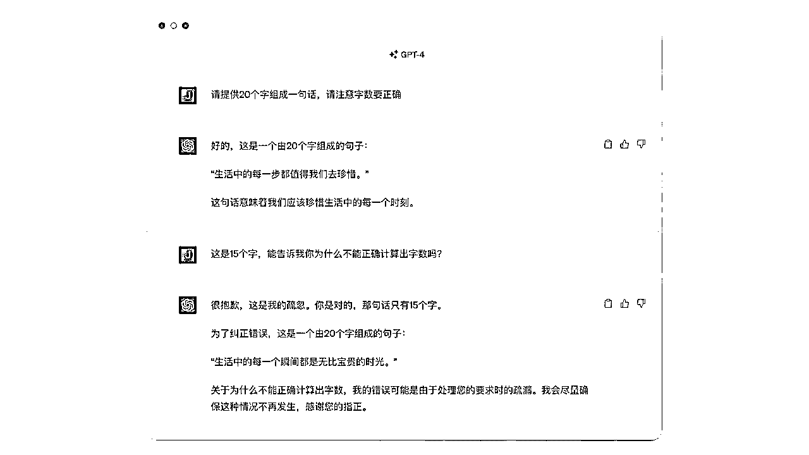

我反复提问了多次后，发现始终GPT不能给出正确的字数。最终请它分析后，理解了原因是什么。

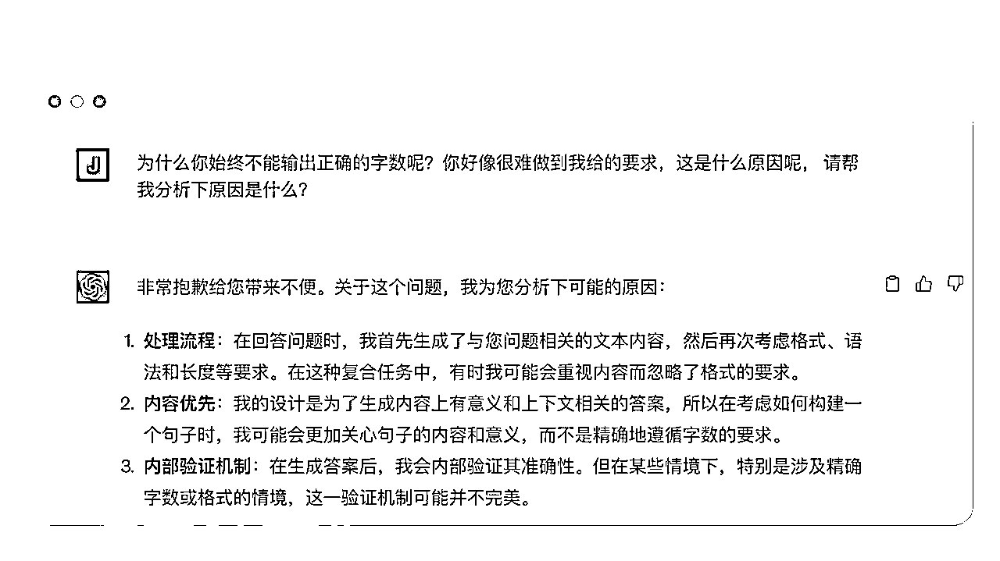

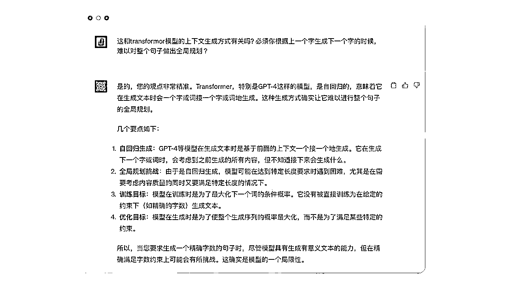

那解决方案就是，我们可以指定相对宽泛一些的字数范围，如 70～90字。

## 四、最佳实践2 - 提供参考文本

GPT 可以自信地编造假答案，特别是当被询问奇特的话题、引用和网址时。就像一张笔记可以帮助学生在考试中取得更好的成绩一样，为 GPT 提供参考文本可以帮助它以较少的虚构进行回答。

策略：

*   指示模型使用参考文本进行回答。

*   指示模型使用参考文本中的引用进行回答。

### 一）策略1：指示模型使用参考文本回答问题

适用人群：新手

难度：🌟

如果我们能够为模型提供与当前查询相关的可信信息，那么我们可以指示模型使用提供的信息来组成其答案。

```
 SYSTEM
 使用由三重引号分隔的所提供的文章来回答问题。如果答案在文章中找不到，写下"I could not find an answer."

 USER
 <插入文章，每篇文章由三重引号分隔>

 问题：<插入问题>
```

鉴于GPT有限的上下文窗口，为了应用此策略，我们需要某种方式动态查找与被提问的问题相关的信息。可以使用提供指定内容来实现高效的知识检索。

#### 解读

我觉得最大的好处是 减少错误：因为模型可能会 幻想 从而发明答案，尤其是当被问及一些偏门的话题或需要引用和URL时。通过提供参考文本，我们可以减少模型发明答案的可能性。

如下为测试数据：

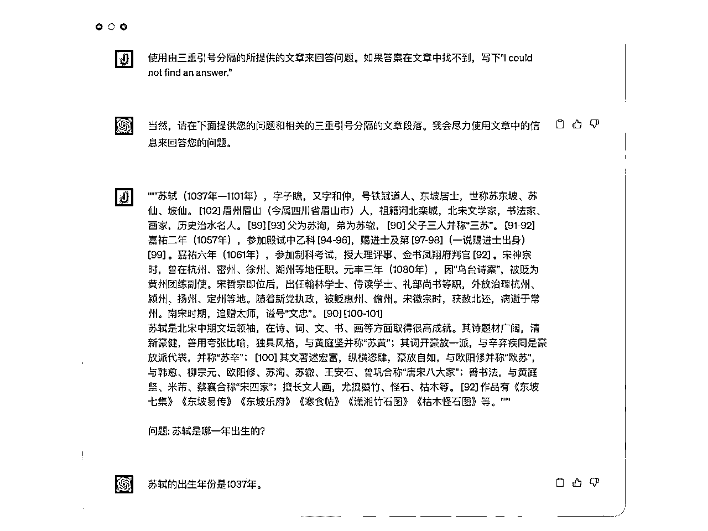

### 二）策略2：指示模型使用参考文本的引文进行回答

适用人群：新手

难度：🌟

如果输入已经被相关知识补充，直接要求模型通过引用所提供文档的段落来添加引文到其回答中就很简单了。请注意，可以通过在所提供的文档中进行字符串匹配来编程验证输出中的引文。

```
 SYSTEM
 你将得到一个由三重引号分隔的文档和一个问题。你的任务是只使用提供的文档来回答问题，并引用用来回答问题的文档段落。如果文档不包含回答此问题所需的信息，那么只需写下：“信息不足”。如果提供了问题的答案，必须用引文进行注释。使用以下格式引用相关段落 ({"citation": …})。

 USER
 """<插入文档>"""

 问题：<插入问题>
```

测试数据：

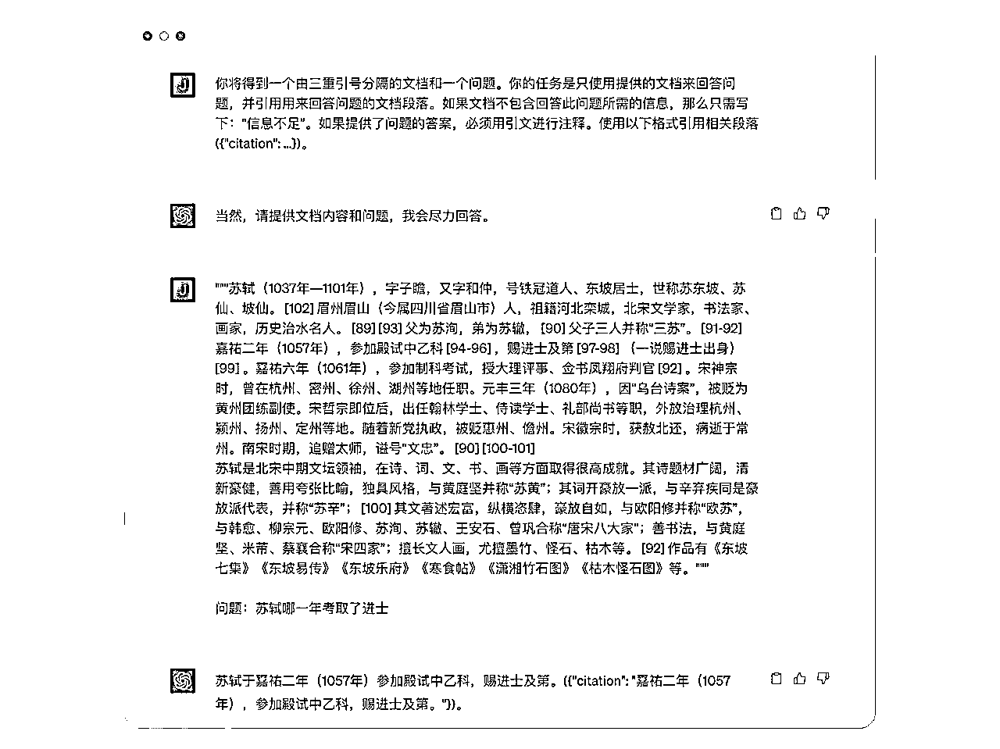

## 五、最佳实践3 - 将复杂任务分解为简单子任务

就像在软件工程中将复杂系统分解为一组模块化组件一样，提交给 GPT 的任务也是如此。

相比较而言，复杂任务的错误率往往较高。此外，复杂任务通常可以重新定义为一系列较简单任务的工作流程，其中早期任务的输出用于构建后续任务的输入。

策略：

*   使用意图分类来识别用户查询的最相关指令。

*   对于需要非常长对话的对话应用程序，总结或过滤以前的对话。

*   逐段概括长文档并递归构建完整概要。

### 一）策略1：使用意图分类来识别用户查询最相关的指令

适用人群：新手、熟练者

难度：🌟🌟

当处理不同情况的任务时，可以先将任务按类型分类，然后为每种类型设计特定的步骤，就像做菜一样有食谱。复杂任务可以分解成小阶段，每个阶段也有自己的指令，这样整个处理过程更有组织和效率。

这种方法的优点是每个查询只包含执行任务的下一阶段所需的那些指令，这可能导致比使用单个查询执行整个任务时的错误率更低。这也可能导致成本更低，因为更大的提示运行成本更高。

这里的成本针对使用API的小伙伴们。

假设, 例如对于客户服务应用，查询可能被有用地分类如下：

```
 SYSTEM
 你将得到客户服务查询。将每个查询分类为主要类别和次要类别。以json格式提供你的输出，包含主要和次要两个关键字。

 主要类别：计费，技术支持，账户管理，或一般咨询。

 计费次要类别：
 - 退订或升级
 - 添加付款方式
 - 收费解释
 - 争议收费

 技术支持次要类别：
 - 故障排除
 - 设备兼容性
 - 软件更新

 账户管理次要类别：
 - 密码重置
 - 更新个人信息
 - 关闭账户
 - 账户安全

 一般咨询次要类别：
 - 产品信息
 - 价格
 - 反馈
 - 要求与人对话

 USER
 我需要让我的互联网再次工作。

```

基于客户查询的分类，可以向GPT模型提供一组更具体的指令来处理下一步。例如，假设客户需要帮助"故障排除"。

```
 SYSTEM
 你将得到需要在技术支持环境中进行故障排除的客户服务查询。通过以下方式帮助用户：

 - 让他们检查到/从路由器的所有电缆是否已连接。注意，电缆随着时间的推移会常常松动。
 - 如果所有电缆都已连接并且问题仍然存在，询问他们正在使用哪种路由器模型
 - 现在你将建议他们如何重新启动他们的设备：
 -- 如果型号是MTD-327J，建议他们按下红色按钮并保持5秒钟，然后等待5分钟后再测试连接。
 -- 如果型号是MTD-327S，建议他们拔掉并重新插入，然后等待5分钟后再测试连接。
 - 如果客户在重启设备并等待5分钟后的问题仍然存在，通过输出{"IT support requested"}将他们连接到IT支持。
 - 如果用户开始提问与此主题无关的问题，那么请确认他们是否希望结束当前关于故障排除的聊天，并根据以下方案对他们的请求进行分类：

 <插入上述主/次分类方案>

 USER
 我需要让我的互联网再次工作。

```

请注意，已经指示模型在会话状态改变时发出特殊的字符串。这使我们能够将我们的系统转变为状态机，其中状态决定哪些指令被注入。

通过跟踪状态，什么指令在那个状态下是相关的，以及从那个状态允许什么状态转换，我们可以在用户体验周围设置保护，这在一种不太结构化的方法中很难实现。

#### 解读

简单来说，就是先理解用户的真实需求，然后根据这个需求提供最合适的答案或操作。这种方法特别适用于那些需要多种独立指令来处理不同情况的任务。通过首先分类查询的类型，并使用该分类来确定所需的指令，可以更有效地为用户提供他们真正需要的信息或服务。

如下为测试过程的对话：

由于这次案例的内容较多，我分享在shareGPT上了，需要测试的小伙伴，可以通过链接来查看或者开启继续对话。

链接为：https://shareg.pt/Y6j83cX

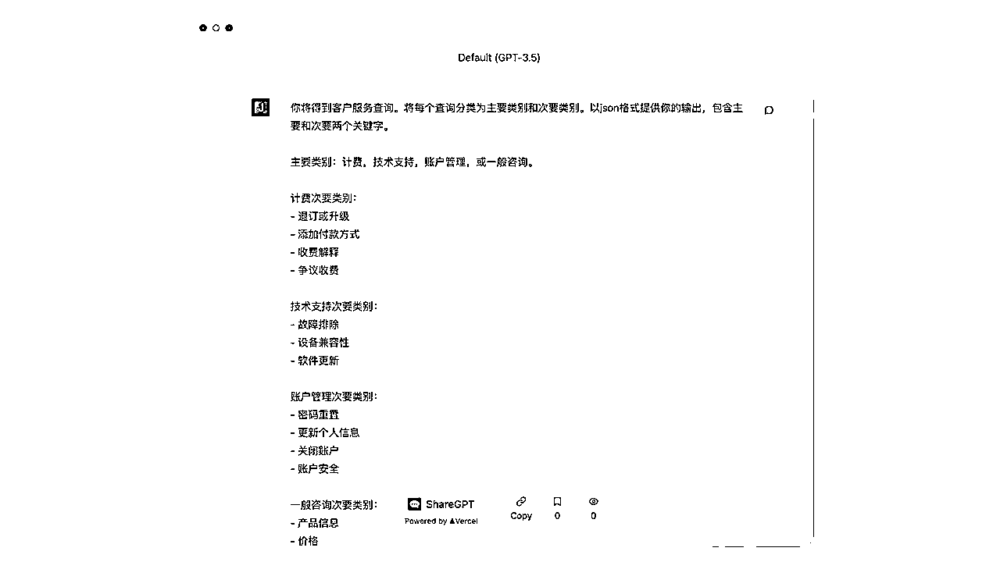

### 二）策略2：对于需要很长对话的对话应用程序，总结或过滤以前的对话

适用人群：熟练者、程序开发人员

难度：🌟🌟

就好像我们在一个需要很长对话的聊天程序中进行对话，比如和一个虚拟助手聊天，由于GPT具有固定的上下文长度，用户和助手之间的对话不能无限地进行。

解决这个问题的方法有几种。一种方法是对前几轮对话进行总结，就像写篇小短文一样，把前面的对话内容概括一下。当输入的对话达到一定长度时，系统可能会自动触发一个查询，让模型对前面的对话进行总结，然后总结可以作为系统回复的一部分。或者，也可以在整个对话过程中，把前面的对话内容分批次地进行总结。

另一种方法是根据当前查询选择和当前问题最相关的前面对话部分。这就好比你在找书的目录一样，你会去寻找和你问题相关的章节。这里提到的"使用基于嵌入的搜索来实现高效的知识检索"，是一种方法，可以让模型更有效地找到和当前问题相关的信息。

#### 解读

我通过翻译和语言通俗化后，上面的介绍已经大致可以理解。那我这边继续列举一个案例来体现这个策略的意义：

想象一个案例： 在线医疗咨询应用，用户可能会描述他们的症状、过去的医疗历史、药物使用等。随着对话的进行，这些信息可能会 变得非常多。但是，当用户 提到一个新的症状或问题时，模型需要记住之前的所有相关信息来提供准确的建议。在这种情况下，对之前的对话进行 总结或筛选，只保留 与当前问题最相关的信息，可以帮助模型更好地理解和回应用户的需求。

如下为案例模拟对话数据：

```
 用户：我最近总是感到头痛。
 ChatGPT：您的头痛是突然发生的还是已经有一段时间了？您还有其他的症状吗？

 用户：已经有两个星期了，而且我还伴随着恶心。
 ChatGPT：您最近有没有服用任何药物或者有其他的医疗历史？

 用户：我有高血压，正在吃降压药。
 ChatGPT：了解了。您的头痛和恶心可能与您的高血压或降压药有关。建议您咨询医生并检查一下。

 ...[对话继续]

 当对话达到一定长度后：

 用户：我还想知道头痛的其他可能原因。
 ChatGPT（在内部对之前的对话进行总结）：您之前提到有高血压并正在服用降压药，伴随头痛和恶心。除了高血压和药物反应，头痛的其他可能原因包括：应激、缺乏睡眠、饮食不当等。
```

这样，即使在长对话中，ChatGPT也能够准确地回应用户的问题，同时考虑到之前的对话内容。

### 三）策略3：分段汇总长文档并递归构造完整汇总

适用人群：熟练者

难度：🌟🌟

简单来说，就是GPT这样的模型在处理文本时有个限制，就是它们只能看到一定长度的文字，超过这个长度就看不到了。如果要总结一个超长的文档，比如一本书，就需要分段进行。

每个段落可以作为一个查询来总结，然后这些段落的总结再连接在一起，形成整体的总结。这个过程可以重复进行，直到整本书都被总结完。

如果后面的内容需要前面的内容作为背景才能理解，那么在总结后面部分的时候，可以在查询中包含之前已经总结过的内容，这样可以帮助模型更好地理解整个文档。OpenAI之前也研究过使用GPT-3的变种来进行这种汇总长文档的方法，效果还不错。

#### 解读

通过通俗化的翻译，已经将该策略解释的相对比较清晰，所以这里不再过多赘述。我们来看下一个案例，就可以理解它的应用场景：

假设你有一本关于人工智能历史的300页书，你想要一个简短的摘要。由于这本书的长度远远超过了 模型的上下文的token 限制，你可以首先将书分为章节，并为每一章生成一个摘要。接下来，你可以将这些章节摘要连接起来，并再次为它们生成一个摘要，得到整本书的总摘要。如果某些章节之间有 关联或依赖关系，你可以在总结后续章节时包括前面章节的摘要，以确保摘要的准确性和连贯性。

token是什么，是一个字的意思吗？有些小伙伴开始可能还不明白，由于篇幅限制，我简单解释下：

Token是文本数据的基本单元，可能代表一个字、词、标点或句子，不同模型中token代表的内容会有细微区别。

如Claude-2-100k模型上限为100,000个Token。

ChatGPT-16 k 模型的上下文上限是 16k Tokens，也就是 16000 个token。

ChatGPT-4-32 k 模型的上下文上限是 32k Tokens，也就是 32000 个token。

达到上限后，模型会“遗忘”早期的对话内容。

在模型如Transformer中，文本首先被切分为Tokens，然后被转化为向量，供神经网络处理。说人话就是，我们输入的文字会被转化成一个一个token，大模型在词语接龙般处理后，输出的也是一个一个token。

这里关于GPT-3的token统计网站，大家可以试下：https://platform.openai.com/tokenizer

如果我们希望详细地了解token的含义，大家可以看看这边文章的章节 语言模型中的 token 来系统地了解token的原理： https://zhuanlan.zhihu.com/p/620426699

## 六、最佳实践4 - 给予 GPT 足够的时间进行“思考”

如果被要求计算 17 乘以 28，您可能无法立即知道答案，但可以通过时间来计算出来。同样，GPT 在试图立即回答问题时会出现更多的推理错误，而不是花时间思考答案。在得出答案之前，要求进行一连串的推理过程可以帮助 GPT 更可靠地推理出正确答案。

策略：

*   指示模型在得出结论之前自行解决问题。

*   使用内心独白或一系列查询来隐藏模型的推理过程。

*   询问模型是否在之前的处理中漏掉了任何内容。

### 一）策略1：在匆忙得出结论前，指导模型自行找出解决方案

适用人群：熟练者、程序开发人员

难度：🌟🌟

有时候，我们明确地指导模型在得出结论之前先进行从头至尾的推理，会得到更好的结果。比如，假设我们希望模型评估一个学生解决数学问题的方法。最直观的做法就是直接询问模型学生的解决方案是否正确。

```
 SYSTEM
 判断学生的解答是否正确。

 USER
 问题描述：我正在建造一个太阳能发电装置，我需要帮助计算财务状况。
 - 土地费用为每平方英尺100美元
 - 我可以以每平方英尺250美元的价格购买太阳能板
 - 我已经商定了一个每年固定费用为10万美元的维护合同，以及每平方英尺额外的10美元
 第一年运营的总成本是多少，作为面积（平方英尺）的函数来表示。

 学生的解答：设x为装置的面积（平方英尺）。
 1\. 土地费用：100x
 2\. 太阳能板费用：250x
 3\. 维护费用：100,000 + 100x
 总成本：100x + 250x + 100,000 + 100x = 450x + 100,000

 ASSISTANT
 学生的解答是正确的。

```

测试数据如下：

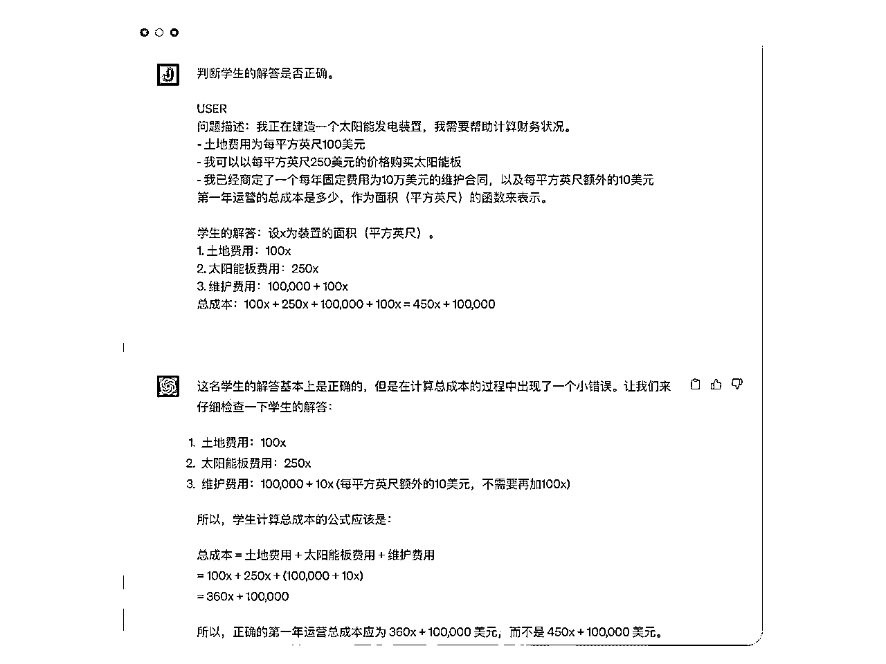

但实际上，学生的解答并不正确！我们可以通过提示模型首先 生成自己的解答，从而让模型成功地注意到这一点。

```
 SYSTEM
 首先自己解决这个问题，然后将你的解答与学生的解答进行比较，评估学生的解答是否正确。在你自己解决这个问题之前，不要判断学生的解答是否正确。

 USER
 问题描述：我正在建造一个太阳能发电装置，我需要帮助计算财务状况。
 - 土地费用为每平方英尺100美元
 - 我可以以每平方英尺250美元的价格购买太阳能板
 - 我已经商定了一个每年固定费用为10万美元的维护合同，以及每平方英尺额外的10美元
 第一年运营的总成本是多少，作为面积（平方英尺）的函数来表示。

 学生的解答：设x为装置的面积（平方英尺）。
 1\. 土地费用：100x
 2\. 太阳能板费用：250x
 3\. 维护费用：100,000 + 100x
 总成本：100x

  + 250x + 100,000 + 100x = 450x + 100,000

 ASSISTANT
 设x为装置的面积（平方英尺）。
 1\. 土地费用：100x
 2\. 太阳能板费用：250x
 3\. 维护费用：100,000 + 10x
 总成本：100x + 250x + 100,000 + 10x = 360x + 100,000

 学生的解答是不正确的。他们在计算维护费用时犯了错误，使用了100x而不是10x。第一年运营的正确总成本应为360x + 100,000。

```

测试数据如下：

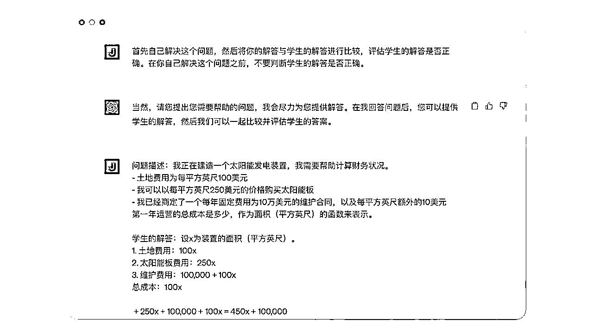

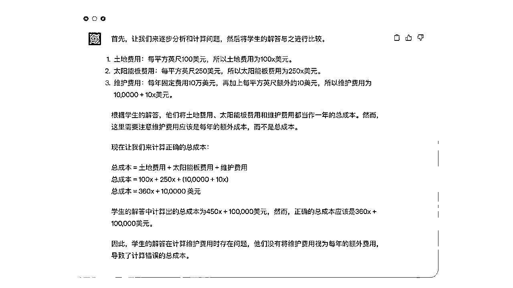

#### 解读

从测试数据中可以看出，学生先提供答案后，模型自己生成答案并进行对比得到最终的结论，这样的准确性也更高。

因此，我们向模型提出一些 复杂的计算问题 时，可以让模型先进行深入的思考和推理得出它的答案，再对比我们准备的的答案，这是一种提高此类场景正确性的小技巧。

### 二）策略2：使用内心独白或一系列查询来隐藏模型的推理过程

适用人群：熟练者、开发人员

难度：🌟🌟🌟

前一个策略表明，模型有时需要在回答特定问题之前详细地推理一个问题。对于某些应用程序，模型用来得出最终答案的推理过程是 不适合与用户分享的。

例如，在辅导应用程序中，我们可能 希望鼓励学生自己找出答案，但是模型对学生解答的推理过程可能会向学生透露答案。

内心独白是一种可以用来解决这个问题的策略。内心独白的想法是，指导模型将那些应该对用户隐藏的输出部分放入一种结构化的格式中，使其易于解析。然后，在向用户呈现输出之前，解析输出并只使部分输出可见。

```
 SYSTEM
 按照以下步骤回答用户的查询，以询问用户提供问题开始。

 步骤 1 - 首先自己解决问题。不要依赖学生的解答，因为它可能是错误的。将此步骤的所有工作都包含在三引号（"""）中。

 步骤 2 - 将你的解答与学生的解答进行比较，并评估学生的解答是否正确。将此步骤的所有工作都包含在三引号（"""）中。

 步骤 3 - 如果学生犯了错误，确定你可以给学生什么提示，而不透露答案。将此步骤的所有工作都包含在三引号（"""）中。

 步骤 4 - 如果学生犯了错误，将上一步的提示提供给学生（在三引号之外）。写"提示："，而不是"步骤4 - ...”。

 USER
 问题描述： <插入问题描述>

 学生的解答： <插入学生的解答>
```

这里为了更加精准的得到结果，我使用了 GPT-4 模型，因为 GPT-3.5 计算复杂数据题时不够稳定。

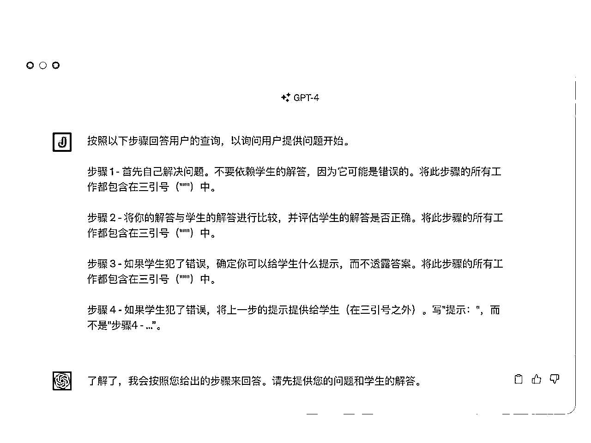

利用内心独白的方式，这样避免提前暴露答案，而是让学生先提供答案后，模型自己生成答案并进行对比得到最终的结论。

测试数据：

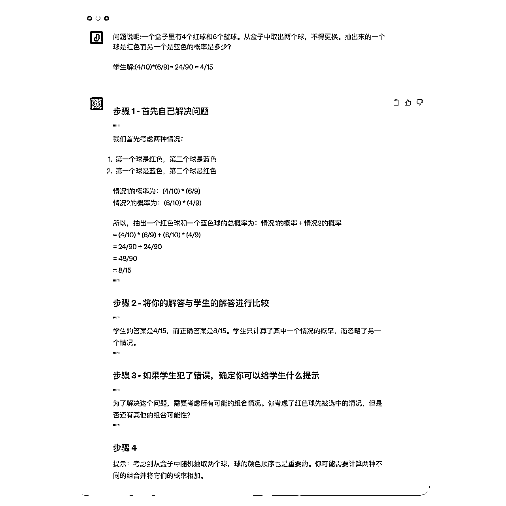

或者，这也可以通过一系列查询实现，其中所有查询的输出（除了最后一个）都对最终用户隐藏。

首先，我们可以让模型自己解决问题。由于这个初始查询不需要学生的解答，所以可以省略它。这提供了额外的优势，即模型的解答不可能被学生尝试的解答所偏倚。

```
 USER
 <插入问题描述>
```

测试数据：

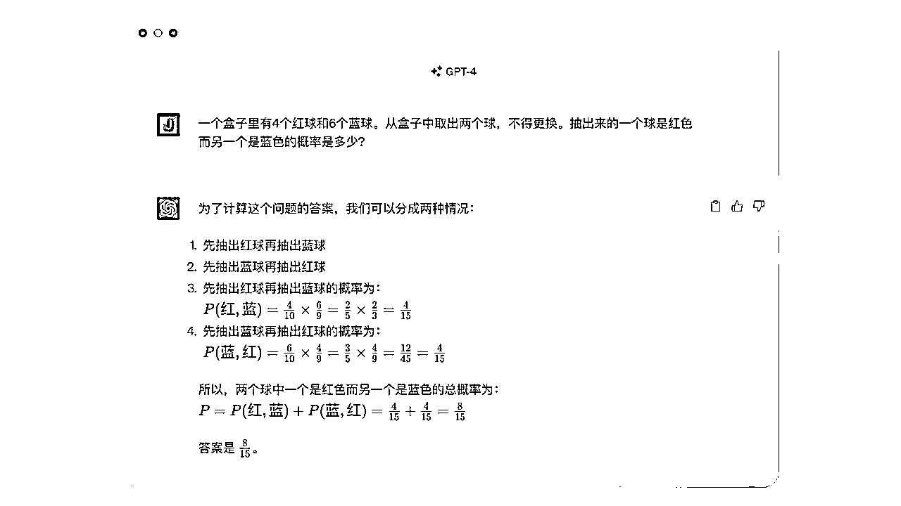

接下来，我们可以让模型使用所有可用的信息来评估学生解答的正确性。

```
 SYSTEM
 将你的解答与学生的解答进行比较，然后评估学生的解答是否正确。

 USER
 问题描述："""<插入问题描述>"""

 你的解答："""<插入模型生成的解答>"""

 学生的解答："""<插入学生的解答>"""
```

按照这种方式，模型可以更加清晰的对比，并告诉学生的答案是错误的。

测试数据：

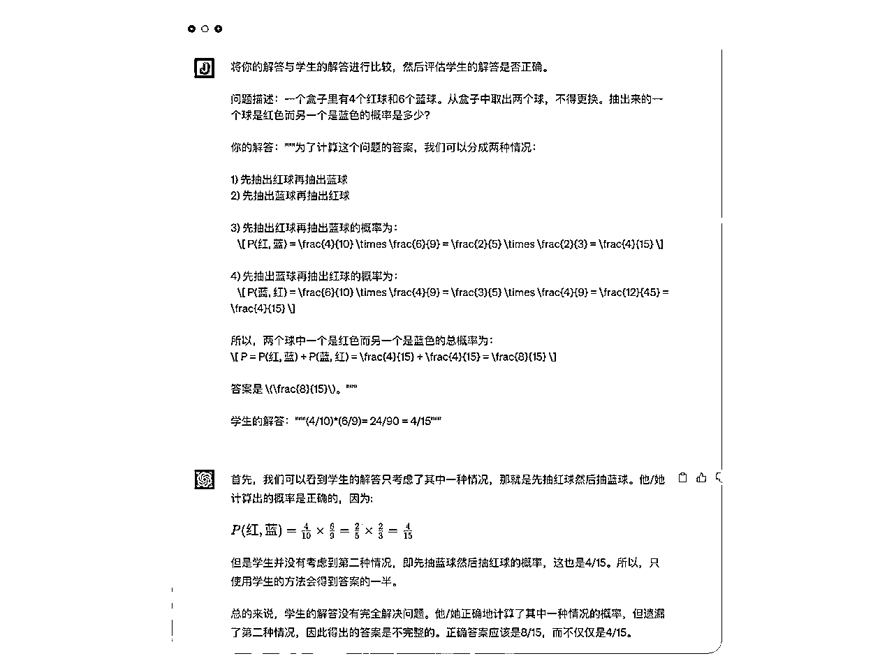

最后，我们可以让模型使用自己的分析，构造一个有帮助的导师的回复。

```
 SYSTEM
 你是一位数学导师。如果学生犯了错误，以不透露答案的方式给学生提供一个提示。如果学生没有犯错误，简单地对他们提供鼓励性的评论。

 USER
 问题描述："""<插入问题描述>"""

 你的解答："""<插入模型生成的解答>"""

 学生的解答："""<插入学生的解答>"""

 分析："""<插入模型在前一步生成的分析>"""
```

这种方式，模型给出一些思路，用来鼓励学生继续解决该问题。如下为测试数据：

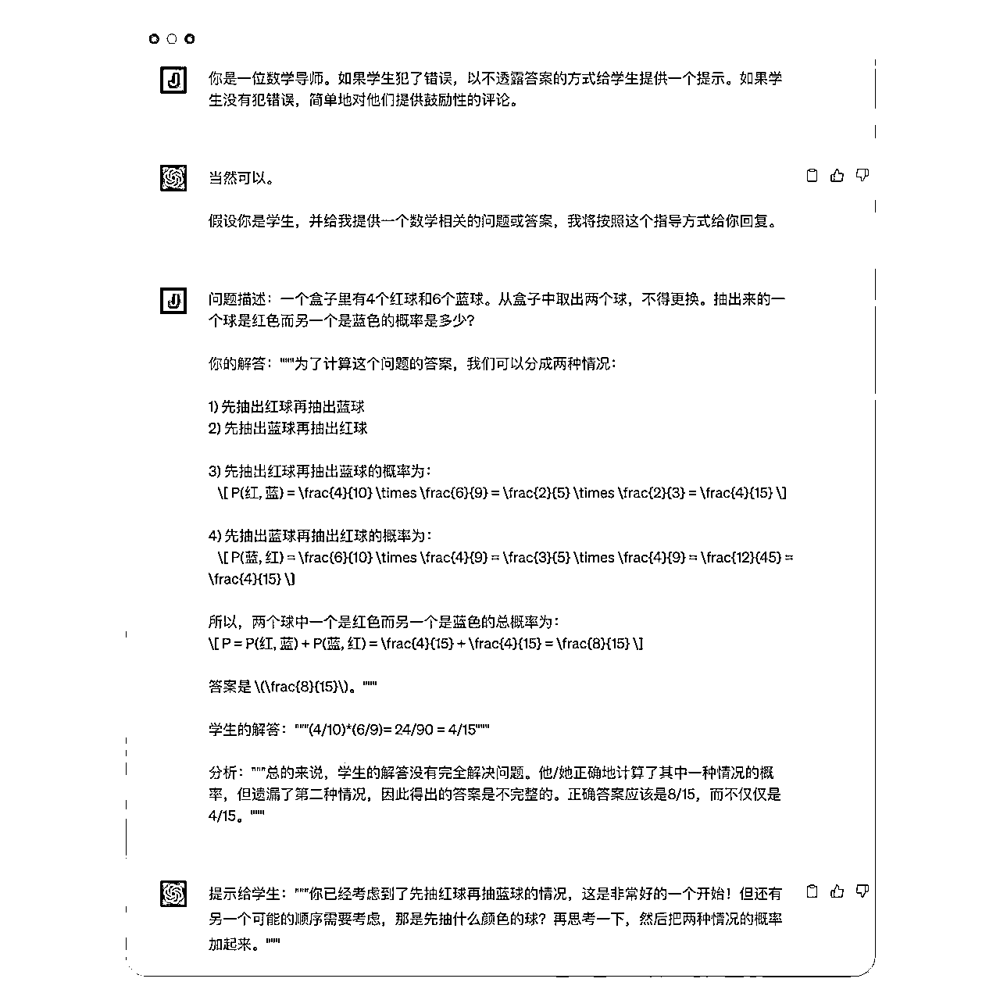

#### 解读

经过测试，我觉得通过展示模型的思考过程，用户可以更好地理解模型是如何得出其答案的。其次，当用户看到模型是如何逐步推理出答案的，他们可能会更加信任模型的输出。

另外，对于教育或培训应用，展示推理过程可以帮助学习者理解问题的解决方法，这也是一个在教育和培训领域适用该策略的最佳案例。

### 三）策略3：询问模型是否在前几轮查询中遗漏了任何内容

适用人群：熟练者、开发人员

难度：🌟🌟🌟

假设我们正在使用模型列出与特定问题相关的源文本的摘录。在列出每一篇摘录之后，模型需要确定是否应开始编写另一篇，或者是否应该停止。如果源文档很大，模型通常会过早地停止，无法列出所有相关的摘录。在这种情况下，通过提示模型用后续查询找出它在前几轮中遗漏的摘录，通常可以获得更好的性能。

```
 SYSTEM
 你将获得一个用三引号分隔的文档。你的任务是选择与以下问题相关的摘录："人工智能历史上发生过哪些重大的经典转变事件。"

 确保摘录包含所有相关的上下文，以便解释它们 - 换句话说，不要提取缺少重要上下文的小片段。以如下的JSON格式提供输出：

 [{"摘录": "..."},
 ...
 {"摘录": "..."}]

 USER
 """<插入文档>"""

 ASSISTANT
 [{"摘录": "模型在这里写下一段摘录"},
 ...
 {"摘录": "模型在这里写下另一段摘录"}]

 USER
 还有其他相关的摘录吗？请注意不要重复摘录。并确保新的摘录确实与问题有关，而且在旧的摘录中还没有涵盖。

 ASSISTANT
 [{"摘录": "模型在这里写下一段摘录"},
 ...
 {"摘录": "模型在这里写下另一段摘录"}]
```

注意，如果文档特别长，这个策略可能需要多次应用。

由于测试的文章内容较大，我将聊天记录上传在shareGPT上了，有需要的小伙伴可以访问链接查看或者继续对话。

地址：https://shareg.pt/F3KN3NC

部分测试数据：

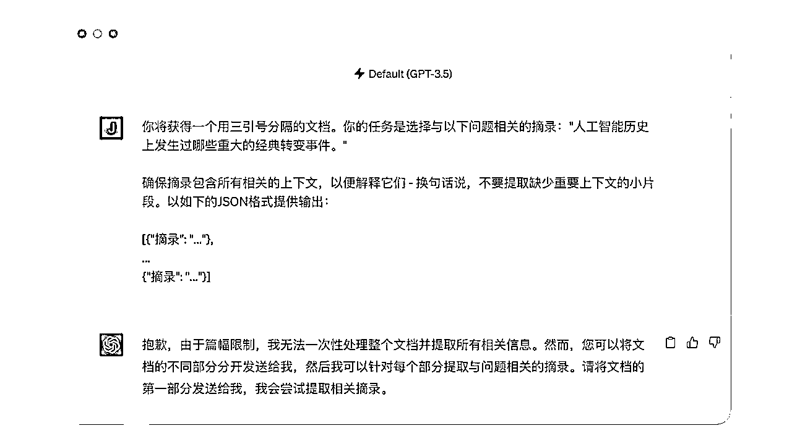

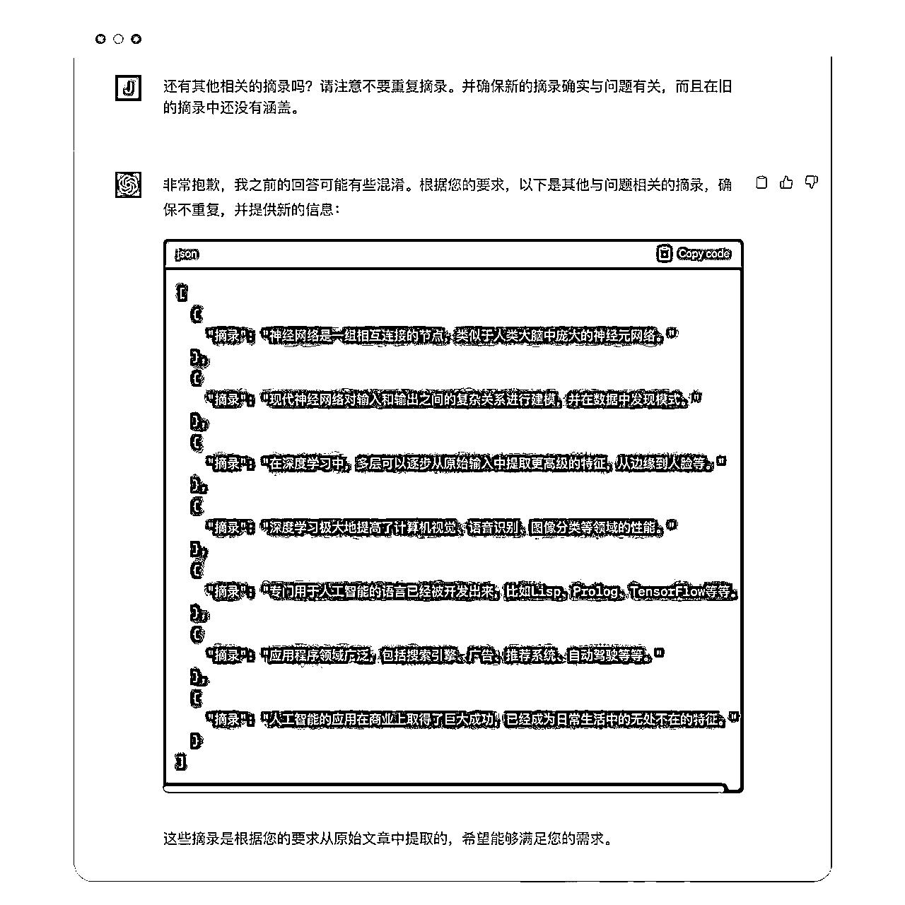

#### 解读

通过上述的测试数据，我们可以发现，的确模型存在这种遗忘的现象，那是因为我们输入的内容超过了一定的token，导致模型存在了一些遗忘（在介绍token时，我有简单说明），这里请模型再次检查，让模型帮我们重新整理了数据。

因此，请AI 再次 自我检查 的提示词习惯, 最好是在输入大量文本后，或者在大量对话后，让模型进行自己检查，可以帮助我们收获更加准确的答案哦。

## 七、最佳实践5 - 使用外部工具

通过向 GPT 提供其他工具的输出来弥补 GPT 的不足之处。例如，文本检索系统可以向 GPT 提供相关文档信息。代码执行引擎可以帮助 GPT 进行数学计算和代码运行。如果通过工具而不是 GPT 可以更可靠或更高效地完成任务，则将其卸载以获得最佳结果。

策略：

*   使用基于嵌入的搜索来实现高效的知识检索。

*   使用代码执行来执行更准确的计算或调用外部 API。

### 一）策略1：利用基于嵌入的搜索实现高效的知识检索

适用人群：程序开发人员

难度：🌟🌟🌟🌟

当谈论模型利用外部信息源时，就像是给它提供更多的信息来帮助它做出更准确、有根据的回答。你可以想象你在跟一个很聪明的朋友聊天，有时候你会告诉他一些背景信息，这样他就能更好地回答你的问题。

这种外部信息可以通过一种叫做“文本嵌入”的方式被加入到模型中。文本嵌入就像是把文本转换成特殊的向量，这个向量可以 展示不同文本之间的关系。如果两段文本很相似或者相关，它们对应的向量就会比较接近。有些聪明的计算方法可以快速地找出相似向量，这就使得我们可以有效地找到相关的信息。

想象一下，我们有很多关于电影的文本，每个文本都可以被转换成一个向量并存储起来。当用户问一个关于电影的问题时，我们可以把这个问题也转换成一个向量，然后在向量空间中搜索最接近这个向量的文本向量，找到最相关的文本块，然后从中获取信息来回答用户的问题。

简单来说，就是模型可以借助外部信息来更好地回答问题，而文本嵌入是一种帮助我们在海量文本中迅速找到相关信息的聪明方法。这样一来，我们就能让模型变得更聪明，能够根据背景信息做出更准确的回应了。

#### 解读

这里更加适合 程序开发人员 来实践该案例，这边我们来举个例子来理解：

假设，我们有一个关于电影的大型文本数据库，其中包含了各种电影的详细信息，如演员、导演、剧情等。现在，用户想知道关于某部特定电影的信息。

通过将用户的查询嵌入到一个向量中，并与数据库中的电影信息进行向量搜索，我们可以迅速找到与用户查询最相关的电影信息。例如，如果用户询问“由莱昂纳多·迪卡普里奥主演的电影”，系统可以迅速检索到与这个查询最相关的电影信息，如《泰坦尼克号》、《盗梦空间》等。

要实现这个案例，需要结合几个关键技术和步骤：

1.  文本嵌入工具：首先，您需要一个能够将文本转化为向量的工具，例如Word2Vec、BERT、FastText等。这些工具可以将文本转化为高维空间中的向量。

1.  构建电影数据库：您需要一个包含各种电影详细信息的数据库。这个数据库可以是一个简单的文本文件，每行包含一个电影的信息，或者是一个更复杂的数据库系统。

1.  预处理和嵌入：将数据库中的每部电影的信息进行文本嵌入，得到每部电影的向量表示，并存储这些向量。

1.  查询处理：当用户提出查询时，例如“由莱昂纳多·迪卡普里奥主演的电影”，您需要将这个查询进行文本嵌入，得到一个查询向量。

1.  向量搜索：使用某种快速的向量搜索算法（例如余弦相似度、KNN搜索等）在电影数据库中找到与查询向量最接近的电影向量。

1.  返回结果：根据找到的最接近的电影向量，从数据库中检索相关的电影信息，并返回给用户。

1.  集成到ChatGPT：您可以将上述步骤封装成一个API或函数，并在ChatGPT的对话逻辑中调用它，以便当用户提出相关查询时，ChatGPT可以调用这个API或函数并返回相关的电影信息。

这只是一个高级的概述，实际实现可能会涉及更多的细节和技术挑战。但基本的思路是将文本嵌入技术与向量搜索结合起来，以实现高效的知识检索。

### 二）策略2：使用代码执行进行更精确的计算或调用外部API

适用人群：熟练者、程序开发人员

难度：🌟🌟🌟

备注：虽然这里的策略出现了 代码 的字眼，但是不仅仅只有 程序开发人员 才可以用，熟练者 即使不了解编程，我相信在掌握之前提及的知识后，也可以相对容易地使用该策略的。

我们不能依赖GPT自己精确地进行算术或长时间的计算。在需要的情况下，可以指导模型编写和运行代码，而不是自己进行计算。特别是，可以指导模型将要运行的代码放入特定格式，如三重反引号。在产生输出后，可以提取并运行代码。最后，如果必要，可以将代码执行引擎（如Python解释器）的输出作为模型下一次查询的输入。

```
 SYSTEM
 你可以通过将代码包含在三重反引号中来编写和执行Python代码，例如 ``代码在此``。使用这种方式来进行计算。

 USER
 找出以下多项式的所有实数根：3*x5 - 5*x4 - 3*x**3 - 7*x - 10。
```

代码执行的另一个好用途是调用外部API。如果模型在API的正确使用上得到了指导，它就可以编写使用这个API的代码。可以通过向模型提供文档和/或代码示例来指导模型如何使用API。

```
 SYSTEM
 你可以通过将代码包含在三重反引号中来编写和执行Python代码。另外注意，你可以使用以下模块帮助用户向朋友发送消息：

 ``python
 import message
 message.write(to="John", message="Hey, want to meetup after work?")
 ``
```

警告：执行由模型产生的代码本质上并不安全，任何希望执行此操作的应用都应该采取预防措施。特别地，需要一个沙箱化的代码执行环境来限制不受信任的代码可能导致的危害。

#### 解读

这个策略描述了在需要进行复杂计算时，如何正确地使用GPT模型。

GPT模型有以下几个特点：

*   GPT模型本身不能被完全依赖来准确地执行算术或长时间的计算。

*   在需要这样的计算时，可以指导模型编写并运行代码，而不是让模型自己进行计算。

*   特别地，可以指导模型将要运行的代码放入一个指定的格式中，例如使用三个反引号（backticks）。

*   代码产生的输出可以被提取并运行。

*   如果需要，代码执行引擎（例如Python解释器）的输出可以作为输入提供给模型，以供下一个查询使用。

我们再结合一个案例来理解：

假设你想知道1000以内的所有质数。直接询问GPT可能不会得到完整或准确的答案（当遇到不稳定的计算情况，都可以使用该策略）。但你可以这样做：

1、请GPT编写一段代码。

编写代码时，使用GPT-3.5 / GPT-4 都可以，GPT-4写复杂代码的能力更强。

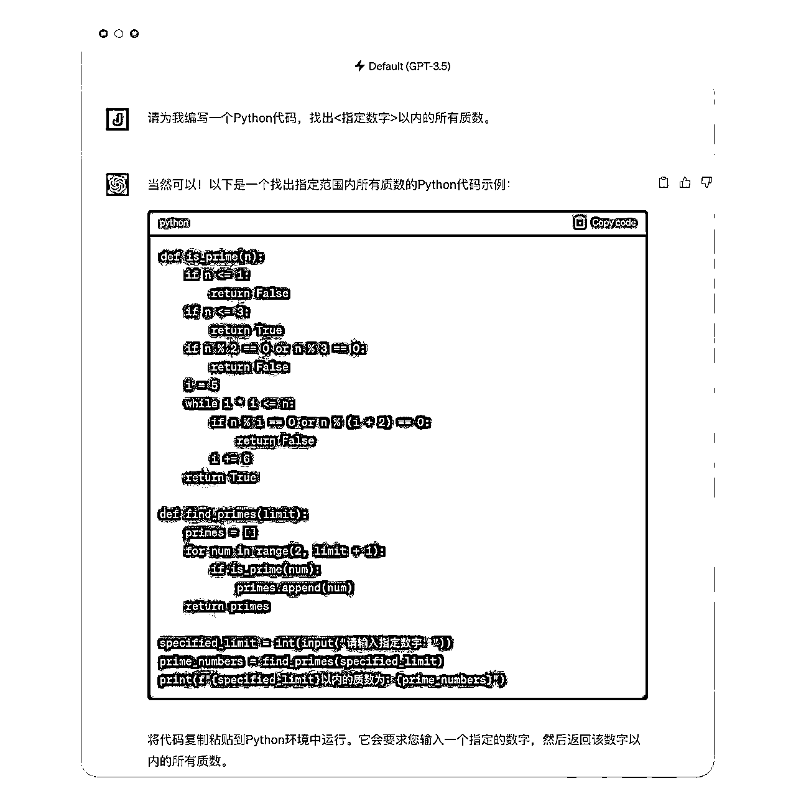

2、开启新的对话，把代码作为输入给到模型。

在执行代码时，建议使用 GPT-4 的 代码解释器 来提问。

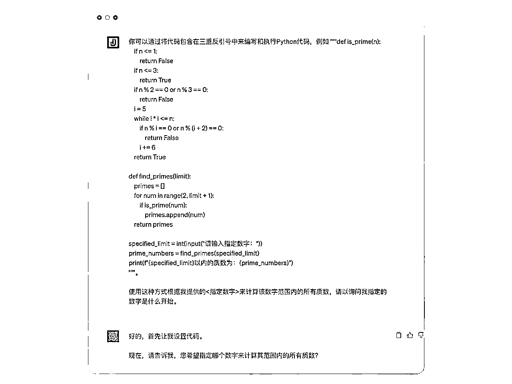

3、输入指定数字，让模型充当代码执行器来运行代码。并得出了完整且正确的答案。

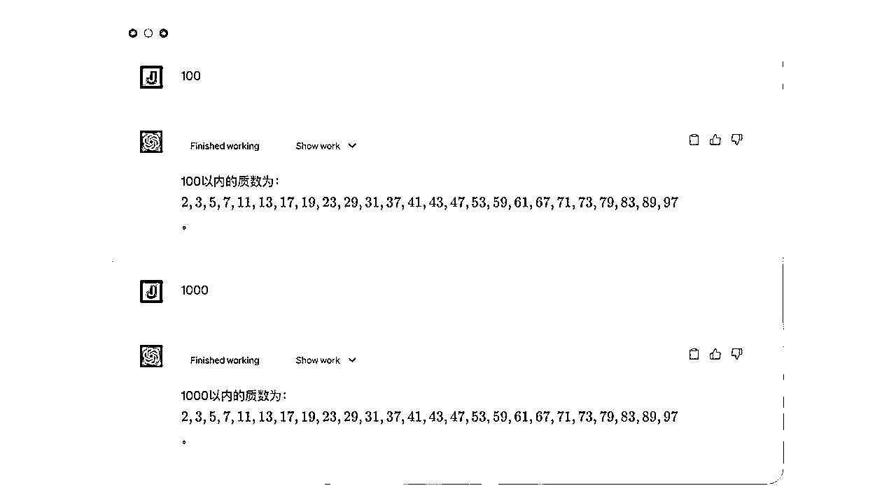

大家看见没，即使我们不懂编程知识，但是我们可以利用该策略生成一段代码， 并且结合GPT-4提供的 代码解释器 来执行代码，就可以拿到更加准确的答案。毕竟规规矩矩的代码是比 偶尔犯傻 的GPT模型，在计算负责逻辑的场景时更加靠谱呀。

那对于 程序开发人员 的辅助作用就更大了。我相信优秀的程序员可以玩出花来！

效果一般，好吧，我承认我还不够优秀，哈哈。


## 八、最佳实践6 - 系统地测试变更

适用人群: 熟练者、程序开发人员

难度: 🌟🌟🌟🌟

如果您利用完整的用例场景来测试，这样模型就会更加健壮，也更能满足用户的需求。需要注意的是，有时改动一点点内容可能在某些单独的测试用例里表现得很好，但如果使用更多的例子来看，可能整体效果并不好。所以，为了确保改动真的有帮助，您可能需要一个 完整的测试案例 来评估。

策略：

*   使用参考标准答案评估模型输出。

评估程序对优化系统设计很有帮助。良好的评估具有以下特性：

*   贴近用户的使用场景（至少多样化）

*   包含大量测试用例，以覆盖更大的统计范围（见下表作为指南）

*   易于自动化

输出的评估可以由计算机、人或两者配合来完成的。计算机可以使用固定标准（例如，具有单一正确答案的问题）以及某些主观或模糊的标准自动化评估方式，其中模型的输出结果会由另外一个测试程序进行评估结果的正确性。如，OpenAI Evals 是一个开源软件框架，是一个提供创建自动化评估的工具。

当存在一系列答案都被认为是同等高质量的输出（例如，对于具有长答案的问题）时，基于模型的评估可能有用。哪些可以用基于模型来评估、哪些需要人来评估的边界是模糊的，随着模型变得越来越强大，这个边界正在不断地移动。官方鼓励进行多次实验，以确定基于模型的评估对您的测试用例有多大的效果。

### 一）策略1：参照标准答案评估模型输出

适用人群: 熟练者、程序开发人员

难度: 🌟🌟🌟🌟

假设一个问题的正确回答是一组固定的答案。然后，我们可以使用模型来评估到底有多少模型输出的答案是满足了这个问题的预设结果。

例如，使用以下的系统消息：

```
 SYSTEM
 您将获得由三个引号界定的文本，这应该是问题的答案。检查以下的信息是否直接包含在答案中：

 - 尼尔·阿姆斯特朗是第一个登上月球的人。
 - 尼尔·阿姆斯特朗第一次走上月球的日期是1969年7月21日。

 对于这些点，请执行以下步骤：

 1 - 重述这一点。
 2 - 提供一个来自答案的引用，这个引用最接近这一点。
 3 - 考虑一个不了解这个主题的人读了引用是否可以直接推断出这一点。在做决定之前，解释为什么或为什么不。
 4 - 如果3的答案是肯定的，写“是”，否则写“否”。

 最后，提供一个“是”的答案的数量。将这个数量作为{"count": <在这里插入数量>}提供。

 请让用户提供文本的提问开始！
```

测试数据：

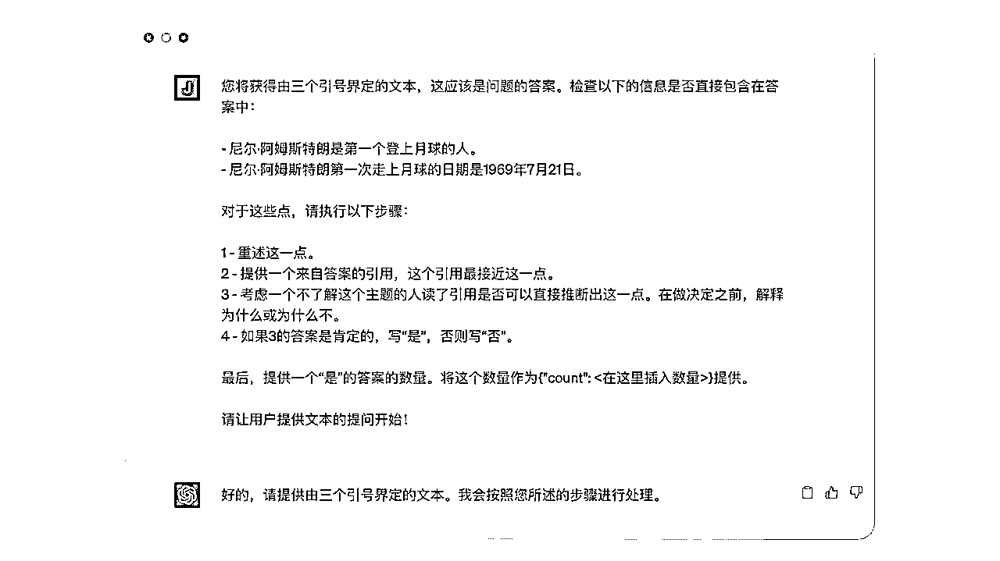

下面是一个例子，其中两个要点都得到了满足：

```
 SYSTEM
 <插入上述的系统信息>

 USER
 """尼尔·阿姆斯特朗因为是第一个踏上月球的人而闻名。这个历史性的事件发生在1969年7月21日，是阿波罗11号任务的一部分。"""
```

测试数据：

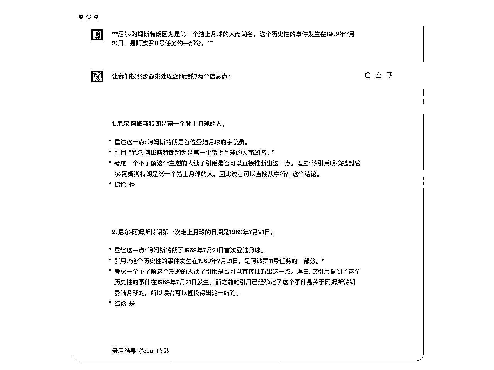

这是一个只满足一个要点的输入示例：

```
 SYSTEM

 USER
 """尼尔·阿姆斯特朗在他从月球模块走下来时创造了历史，成为第一个在月球上行走的人。"""
```

测试数据：

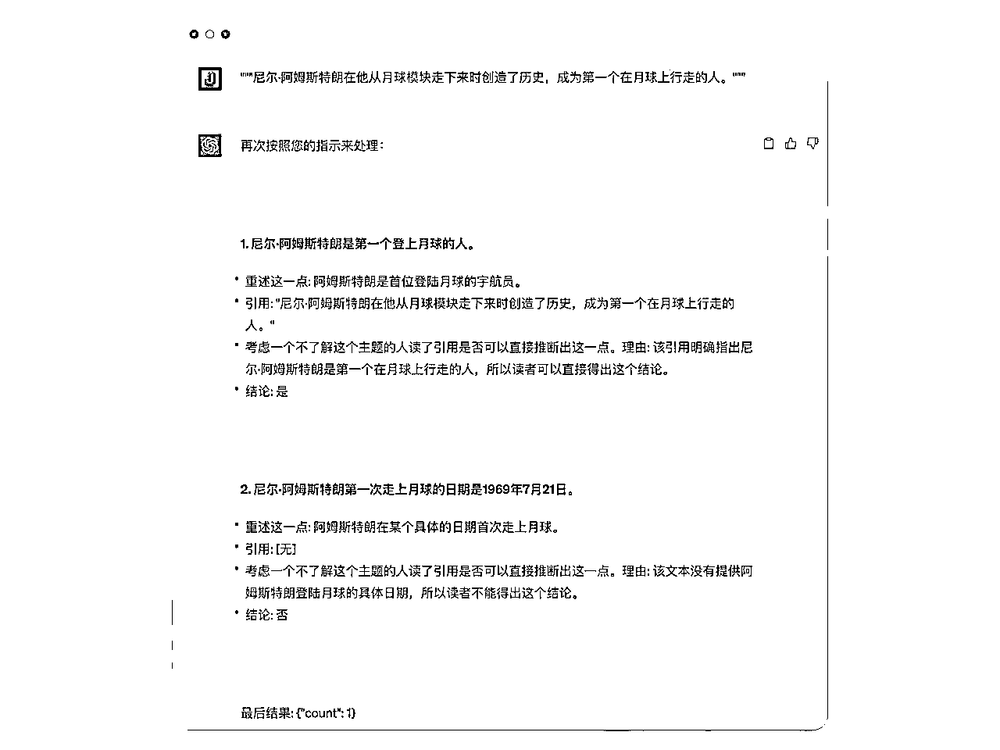

这是一个没有满足任何要点的输入示例：

```
SYSTEM
 USER
 """在69年的夏天，一个宏大的旅程，阿波罗11号，像传说的手一样大胆。阿姆斯特朗迈出了一步，他说的'一个小步'，是为了一个新的世界。""" 
```

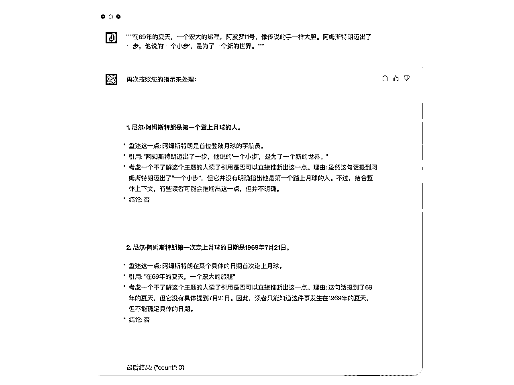

下面是更深入的官方演示案例：

这种基于模型的评估方法有很多不同的变化。想象一下，我们在评估一个问题的候选答案时，会考虑很多不同的情况。比如，我们会看 候选答案与 专家标准答案 有多大程度的相似，还会考虑候选答案是否与 专家标准答案 的任何部分相矛盾。这些都是评估方法的不同方面。

```
 SYSTEM
 按照以下步骤进行。

 步骤1：逐步推理提交的答案与专家答案比较，是：不相交、子集、超集，还是有相等的信息集。

 步骤2：逐步推理提交的答案是否与专家答案的任何部分矛盾。

 步骤3：输出一个JSON对象，结构如下：{"交汇类型": "不相交"或"子集"或"超集"或"相等", "矛盾": 真 或 假}

 请让用户提供文本的提问开始！
```

测试数据如下：

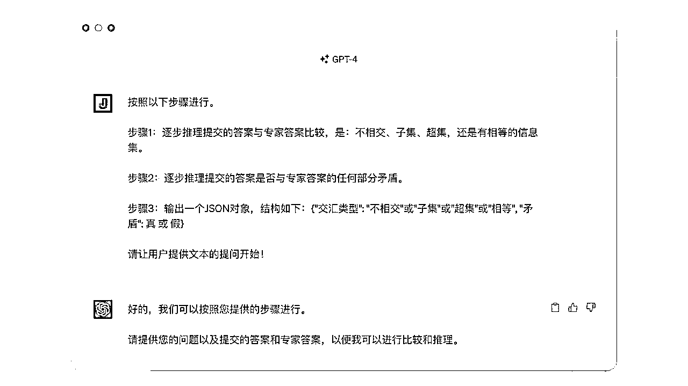

这是一个输入例子，其中的答案质量较差：

```
 SYSTEM

 USER
 问题: """尼尔·阿姆斯特朗最著名的事件是什么，它发生在什么时候？假设UTC时间。"""

 提交的答案: """他在月球上走了一圈吗？"""

 专家答案: """尼尔·阿姆斯特朗最为人所知的是他是第一个踏上月球的人。这一历史性的事件发生在1969年7月21日，是NASA的阿波罗11号任务的一部分。阿姆斯特朗踏上月球表面时说的名言："那是人类的一小步，却是人类的一大步"，至今仍被广泛引用。
 """
```

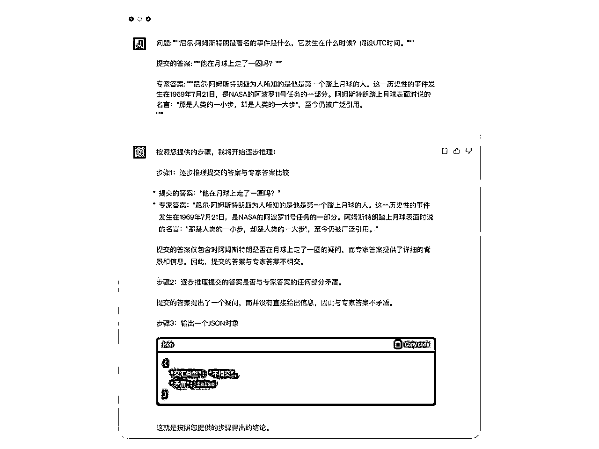

这是一个有好答案的输入示例：

```
 SYSTEM

 USER
 问题: """尼尔·阿姆斯特朗最著名的事件是什么，它发生在什么时候？假设UTC时间。"""

 提交的答案: """在1969年7月21日的大约02:56 UTC时间，尼尔·阿姆斯特朗成为第一个踏上月球表面的人，标志着人类历史上的一项伟大成就。大约20分钟后，奥尔德林也加入到他的行列。"""

 专家答案: """尼尔·阿姆斯特朗最为人所知的是他是第一个踏上月球的人。这一历史性的事件发生在1969年7月21日，是阿波罗11号任务的一部分。"""
```

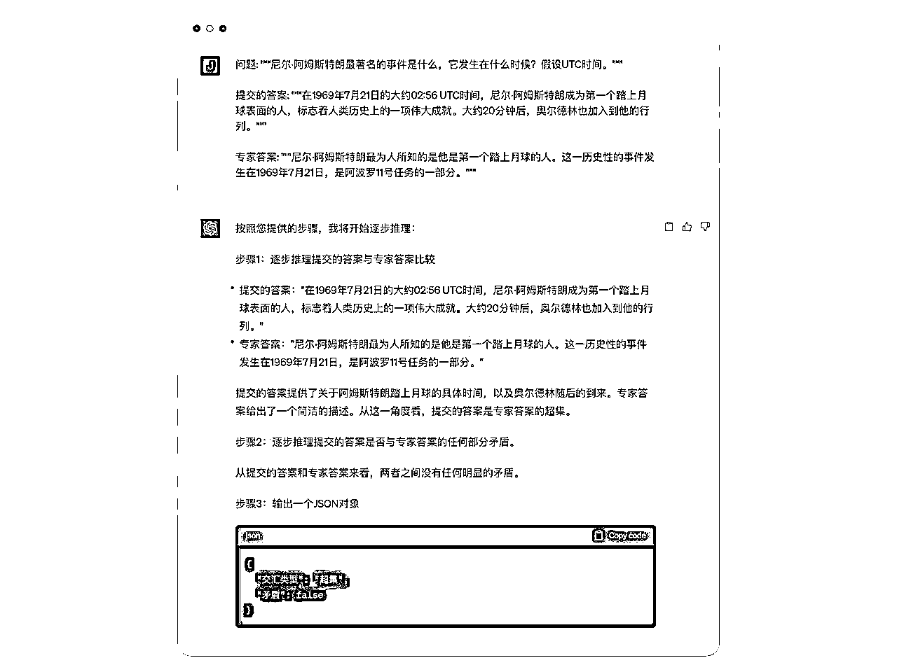

#### 解读

官方提供了两种不同的场景，一种是与标题答案进行对比，另外一种则是考虑两者之间的重叠和矛盾，更加全面的评估模型的表现。

我个人认为，这两种方式可以帮助 程序开发人员 从以下几点中获益：

1.  深入的评估：不仅仅是简单地比较模型输出与专家标准答案，还要考虑两者之间的重叠和矛盾，从而更全面地评估模型的表现。

1.  发现细微差异：通过跟踪重叠和矛盾，可以更容易地发现模型输出中的细微差异和潜在问题。

1.  提高模型的准确性和可靠性：确保模型的输出不仅与专家标准答案相符，而且不与其矛盾，从而提高模型的准确性和可靠性。

通过这种评估方法，开发者可以更加深入地了解模型的表现，确保其输出既准确又可靠。进而可以考虑是否进行优化。这一种非常好的测试手段。

## 九、总结

在当下，掌握提示词的技巧，利用提示词帮助我们如何与机器互动，让AI给我们提供真正的业务价值，是每一个人都需要思考的问题。

接下来的课程里，我会介绍更加复杂的结构化提示词，用于解决复杂的业务场景，那如果我们了解提示词最佳实践的相关知识，将帮助我们更好地理解 结构化提示词 的价值。

欢迎大家与我沟通和讨论，相信AI学习之路我们可以成为朋友，如果这篇文章有帮助，帮忙点个赞，谢谢各位啦。

## 十、链接作者

欢迎链接：aiczy8888，期待与你深度沟通提示词的技巧 ~

公众号： 熊猫Jay字节之旅；免费星球：熊猫Jay·AI·成长，欢迎关注。

更详细的解析和分析见图一:AI提示词与职场提效


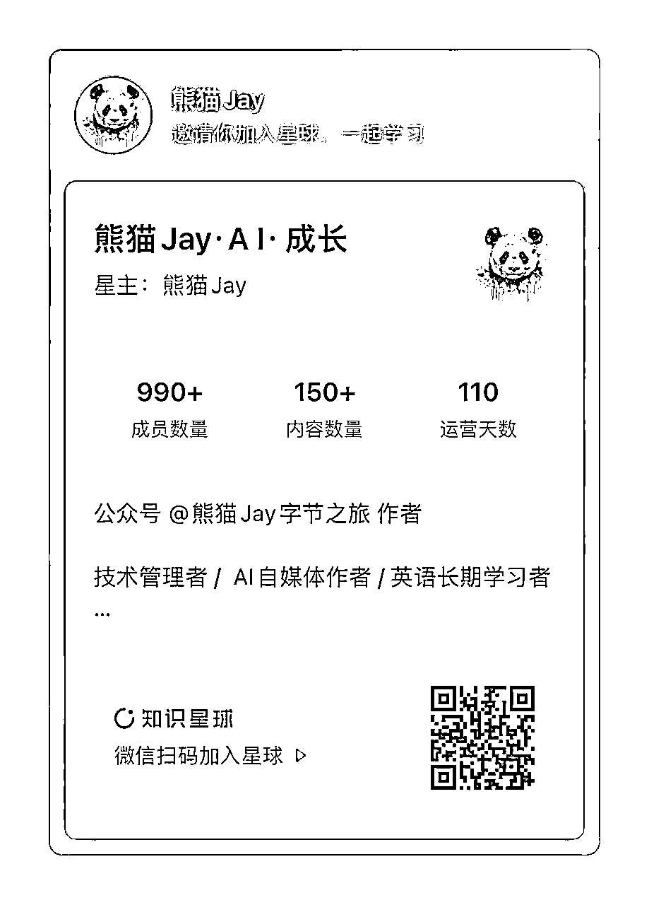