# 抖音“知识付费直播”0 粉起号1w人在线，我是怎么做到的？

> 来源：[https://gh4k4zb2wt.feishu.cn/docx/H6XRdcXV2ow5JexGeYpc0XYunZb](https://gh4k4zb2wt.feishu.cn/docx/H6XRdcXV2ow5JexGeYpc0XYunZb)

大家好，我叫智豪。从21年4月份离开互联网大厂自己创业，一眨眼已经2年多的时间。过去的这2年里，不可避免地也踩了一些坑，当然也拿到了一些结果。

今天跟大家分享的是我过去 2 年所做的知识付费项目，第一个抖音电商知识付费项目，累计变现 500w+，个人直播峰值在线人数最高 1w+ ，单场变现 4w+。

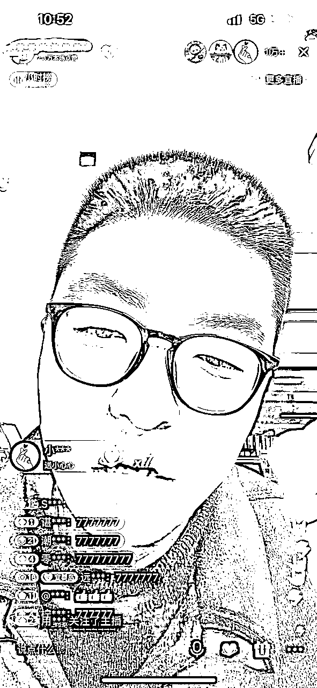

在我率先跑通了模式之后，陆续我也培养出来了多名千人在线主播，其中不乏 0 经验的行业新人。我相信你们去年只要刷过讲抖音小店的直播间，一定刷到过我们“抖客联盟”的主播。

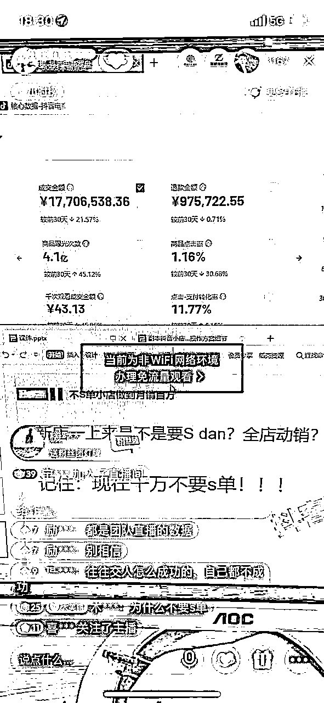

去年下半年，由于抖店市场更新迭代，抖音电商风口已过，所以我们转做了第二个项目：小红书电商，目前项目跑了 8个月，累计变现 800w 左右。个人直播最高在线人数3000+。

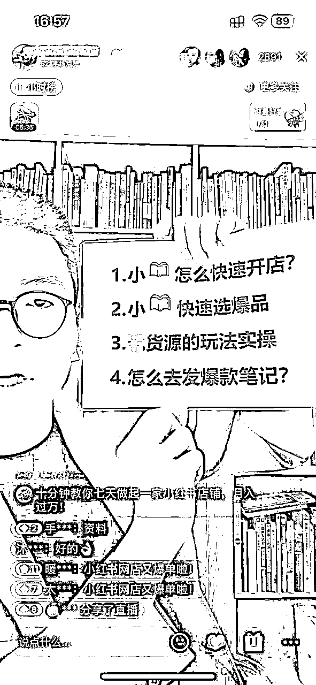

同样的，我作为操盘手也复制了多个千人在线直播间。小红书电商赛道的行业头部，也全部是我们“红商学院”！

今年只要是在抖音里关注过小红书电商的，大概率刷到过我或者我们团队的主播。

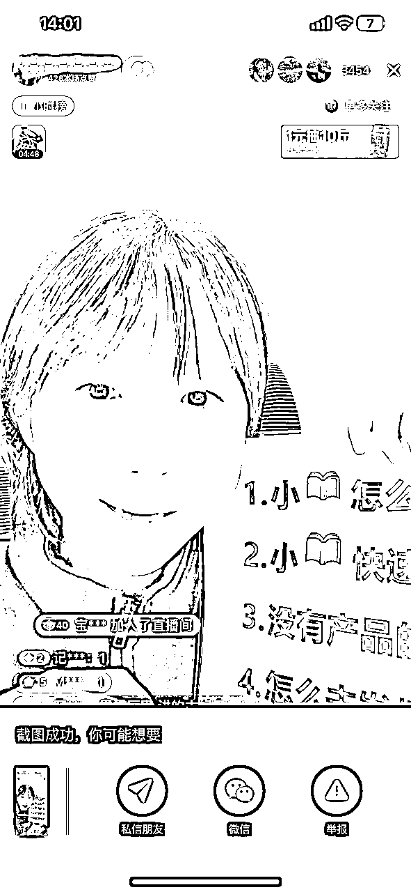

严格来说，这两个赛道虽然都是电商知识付费赛道下的一个细分领域，但是目标人群完全不一样。

抖音电商的目标人群以男性为主，并且核心诉求是创业，而小红书电商的目标人群 90% 以上是女性，核心诉求是副业。外加上男性的思维方式偏理性，女性偏感性，因此这两个领域的直播内容，展现形式，课程销售方式，是有很大差别的。

能够在这2个赛道里都拿到结果，我对于直播的底层逻辑，思维方式，直播能力，都经过了市场充分的考验和证明。

对于知识付费直播项目，我个人有三重角色，主播 + 操盘手 + 项目发起人，从项目立项到项目一线实操的全流程我都是全程深度参与，还是有一些发言权的，今天我就依次从主播，操盘手，项目发起人的角度，简单跟大家分享几个点，向大家真实还原一下，抖音知识付费直播的底层逻辑，以及我个人 2 次成为行业头部的全过程。

内容大纲：

1.  985 理工科 钢铁直男，如何同时拿捏男性和女性群体？（主播）

1.  万人在线的直播间是如何迭代出来的？

1.  标准化的直播流程如何打造，如何横向复制？

1.  顶级主播，就是顶级演员/运动员，必须拥有顶级心态！

1.  没有电商经验和主播经验的萌新，如何 7 天从 0 突破到 3 千人知识付费直播间？（操盘手）

1.  什么人值得培养？

1.  啥都不懂的时候，怎么办？

1.  什么是一比一抄？

1.  什么是知识付费的蓝海战略？（项目决策者）

1.  什么是知识付费的蓝海？

1.  知识付费行业的未来趋势？

# 985 理工科钢铁直男，如何同时拿捏男性和女性群体？

## 1.1 一万人在线的直播内容是如何迭代出来的？

时间回到 2022 年1月份，那段时间是我直播生涯的第一个低谷，在那之前，我每天稳定直播2小时，场均变现 1w+，后来由于视频内容违规的原因，账号直接被封，我不得不重新启动一个新账号，为了防止视频违规的情况再次出现，这次我直接选择 0 粉丝 0 作品的方式开播起号。

这对于当时的我来说，是一个不小的挑战。因为从来没有尝试过这样的起号方式，于是我花了整整 1 个月的时间，打磨直播内容，调整直播方式，慢慢的，从场观 80 持续迭代到场观 10w+。

先给大家看下我这1个月的直播数据。100% 真实，没有一丝水分，因为这个是我自己用于直播复盘的数据。并且，整个过程完全没有短视频流量的加持！也没有投一毛钱流量（讲电商的大部分直播间带有明显的营销导向，无法投流）

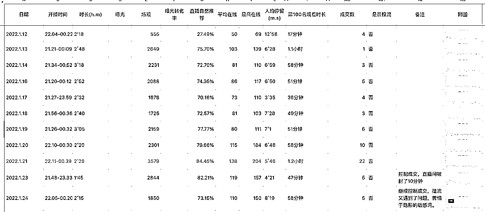

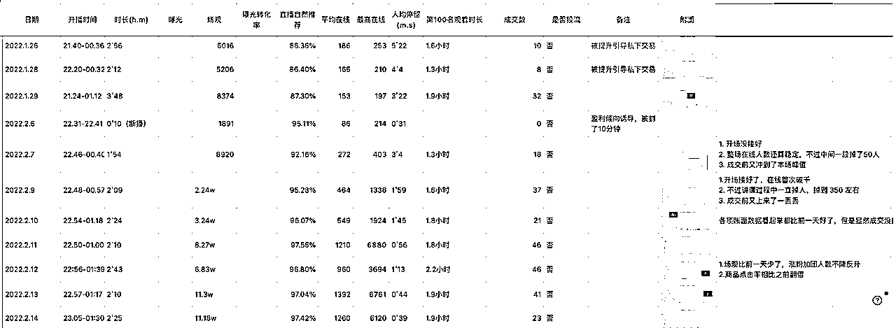

那么，我是如何做到的呢？

接下来，我就从直播间场货人 3 个角度，去给大家一一阐述。

注意，顺序是场/货/人，而不是人货场。

因为当一个新用户刷进你的直播间，他既不认识你，也不了解你正在讲什么话题，第一印象是映入眼帘的场景，场景如果好，那么就能留住精准的目标用户，场景不好，直播间效果会大打折扣。

直播间，最重要的，是场景。

场景的核心，是要做出差异化，制造反差。

### 1.1.1 场

人眼接受信息的效率要远远高过声音，所以直播间画面的布局上，一定要充分利用屏幕空间，布置能够留住目标人群的信息点。

不仅要突出直播间的主题，同时还要抛出足够吸引目标用户的“钩子”，让用户能够快速代入进你的内容框架。

给大家看下我的画面场景迭代过程，最初起号阶段，几乎每天都要结合自己的实战体感，一点点去优化画面场景。

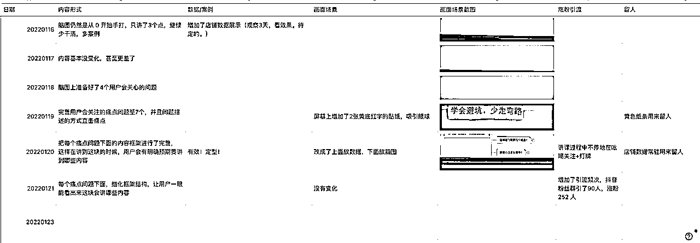

最初，我的直播场景是，用手机对着电脑屏幕，屏幕上呈现的是，纯粹的内容框架。当时这种直播形式是电商直播间的主流形式，大家都大差不差，毫无差异化。

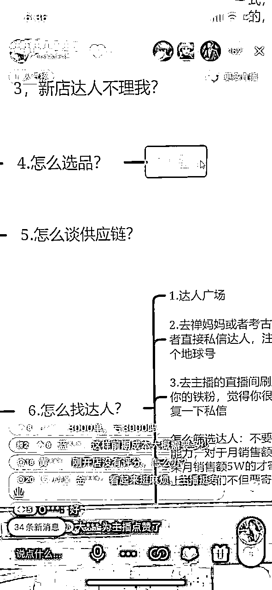

于是我做了一个调整，这个调整回过头去看，带来的回报超级大，迅速就拉开了和其他电商直播间的差距。

这个形式即，上面展示店铺的实时成交数据，且数据一定要真实，要夸张！！然后下半部分展示脑图知识点，这个调整当即就见效。按这个模式大概持续播了半个月，直播间数据不断突破流量层级，直到万人在线。

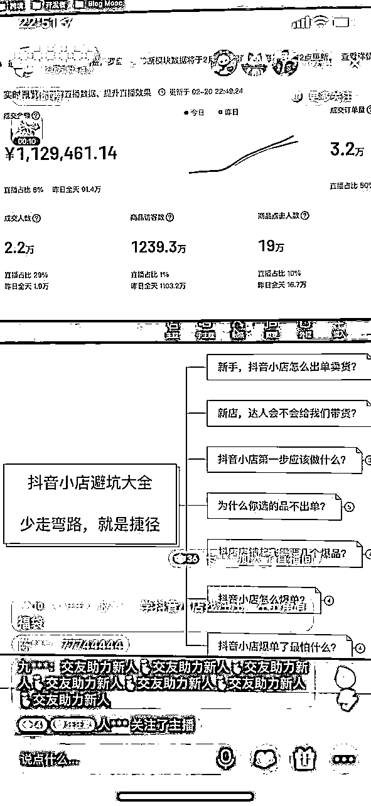

最后，最终场景调整成了第3阶段，顶部是主题横幅，中间是店铺实时数据，下面是脑图或 ppt。

后来，几乎所有的电商干货直播间都在模仿我们的形式，直到现在大家去抖音上看各种电商直播间，还能看到我们这种场景的影子。最早的出处就是我。

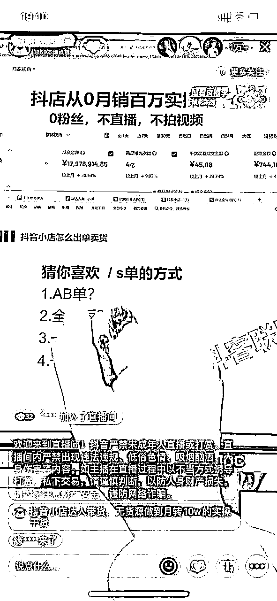

### 1.1.2 货

电商直播间的货，是主播拿在手里展示的产品。

知识付费直播间的货，则是主播说出去的每一句话，包括你输出的干货，你的观点等等。当然也包括你说话时的情绪，说每一句话的，抑扬顿挫。

这里，我把“货”大致分为以下3类。

干货：给观众提供实用价值。

这个是最核心的，占了80% 的部分，要知道你的客户痛点是什么。

哪些问题最容易引起他们的好奇，哪些环节他们实操过程中最容易卡住。

针对他们的痛点，你需要不断地打磨你的直播内容，最终形成一个标准化的内容框架。

给大家看下我起号阶段，是如何迭代我的内容和场景的。

观点：给观众提供认同，亦或是打破认知。

就是要给听众植入的。是非观，什么是对什么是错。观点往往能起来画龙点睛的作用，让观众一下感受到你是一个活生生的人，像他的朋友，而不只是一个讲课的专业老师。

你不需要不断地通过案例，去向听众的心智中，植入你的观点。

并且不断地向他们强化，你说的一定是对的，那么观众才会自愿跟着你的节奏，被你带领着往下走。

情绪：给观众提供情绪价值。

跌宕起伏的情绪代入感越强，他们更容易被引导入你的框架

光有内容是不够的，内容相当于是一个剧本，主播就是一个演员，主播需要代入角色，讲好内容里编排好的干货，故事，案例等等，如果太生硬，或者讲话没有起伏，那么听众的视角下，是非常的枯燥乏味，大家刷抖音的目的其实都是为了娱乐消遣，所以不能提供情绪波动的直播间，很难做起来大场观。

好的剧本 + 适合的演员，就是一个成型的知识付费直播间。

主播只需要固定时间，一边又一边地讲同样一个剧本，做出好的效果呈现，就能保证结果。

### 1.1.3 人

对于我这种不靠短视频包装人设的主播来说，我在粉丝的心目当中，是缺少一个立体的 IP 印象的。

因此直播间如果是靠脸，纯聊天的形式，是大概率留不住人，必须靠场景和内容输出。但不代表人这个因素就不重要。

主播的个人发挥空间，主要在于2个方面。

首先，是主播对于内容的理解和演绎。前面提到，我们的直播内容，是一套打磨好标准化的脚本。

我个人是有电商店铺操盘经验的，对于电商的玩法有自己的理解，而我们招的主播不一定做过电商运营。所以，首先主播对自己要讲的内容，一定要有清晰的理解。这样子讲解的时候，才能够条理清晰，框架明确。细节也能够讲解到位。

另一方面，主播过了基础的能力关之后，影响结果的核心因素，就是在于直播时候的情绪和状态。

这两个因素的微妙之处说不清道不明，但是对于直播间成交结果的影响是非常大。因此，主播每次开播前，必须调整好自己的情绪和状态。这两者的源头，在我看来，其实是发心。

当你的发心是卖课赚钱，“割韭菜”的时候，你的嘴脸就会变丑陋，说话表达时给人感觉就会带营销，推销的感觉。人也缺乏吸引力，缺少人格魅力。大家不会发自内心地信任你，为你买单。

当你的项目的确靠谱，你分享的内容也确确实实有用时，你抱着一刻分享的心态去直播，那么你会卸下心里的压力和包袱，轻松上阵。给粉丝的感觉会舒服不少，成交就是自然而然的事情。

## 1.2 标准化的直播流程如何打造

标准化的直播流程包含3个环节：

*   直播前准备

*   直播中注意事项

*   直播后的复盘

具体给大家看一下，我们的主播行为规范，详细描写了播前播中播后的各项内容。

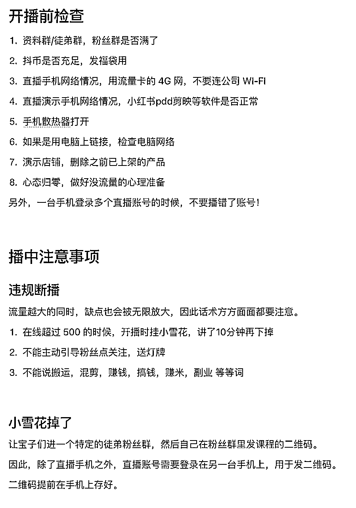

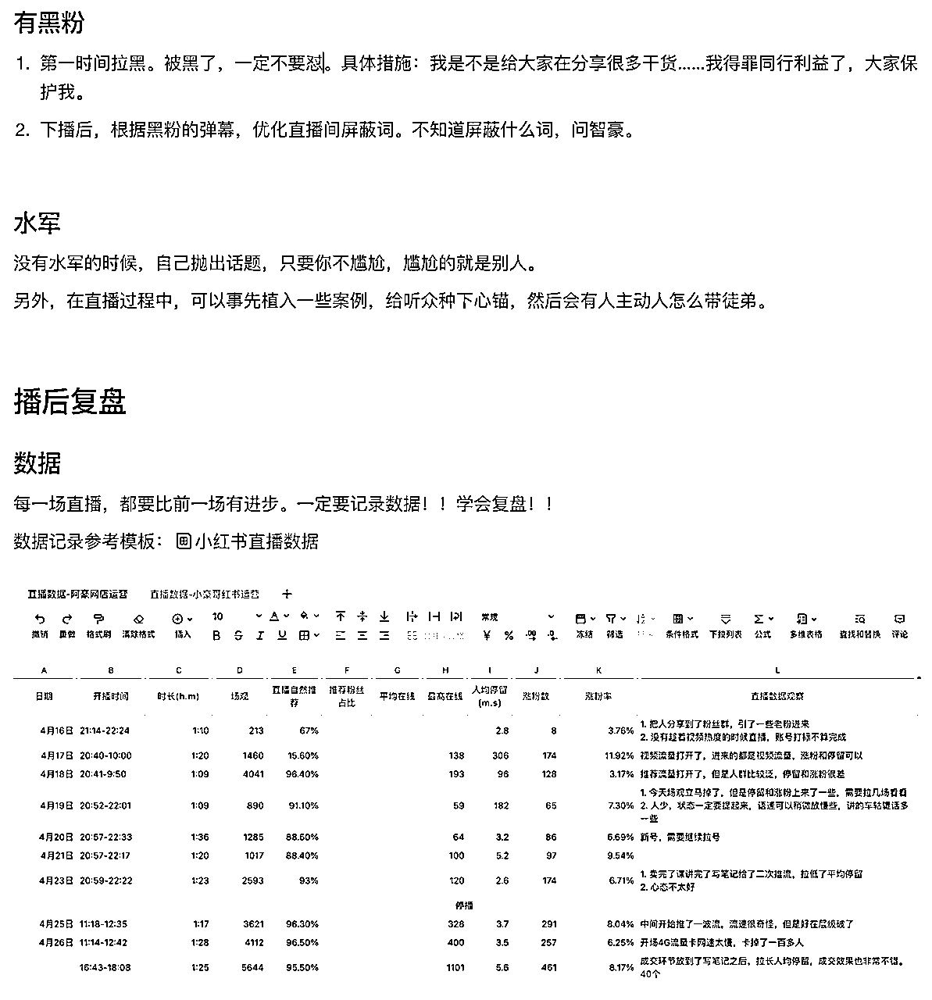

可以说，通过这一系列的措施，我们将一次直播，就打造成了一台小的话剧，主播就是那个演员，话术就是主播拿到的一个剧本。每次开播，就是负责把同样的戏码，给演绎一遍。

## 1.3 顶级主播必须拥有顶级心态！

抖音是一个放大镜，放大你的优点的同时，也会无限放大你的缺点。

当你的直播间得到了更多的曝光，那么会有无数双眼睛盯着你，举报你，平台也会以更加严格的标准监管你。

没有被举报断播过的主播，一定不是大主播。

直播间被断播，对我们这种自然流直播间的影响非常非常大，大到超出你的想象。

有可能前一天你是 8000 人在线，但是被举报断播了，第 2 天可能只能做到 3000 人在线，第 3 天峰值只有 1000 人在线了，这时候，就非常考验主播心态了。

作为主播，心态一旦崩了，那么必然会播不好，本来流量就不好的情况下，外加心态的影响的影响，直播间流量只会持续地断崖式下滑。

抖音是一个非常现实的系统，它不会给你过多的机会。你今天不好，明天一定会更差。

所以，主播一定要有一个强大的心态。每当你播不下去了，要告诉自己：一定要坚持，如果你今天播不好，明天的流量只会更差，明天你会更难播好。

抖音主播，永远是为了明天的数据，在直播。

# 没有电商经验和主播经验的萌新，如何 7 天从 0 突破到 3 千人知识付费直播间？

很多人主张人才无法培养只能筛选，这个其实不是绝对的，人与人之间，能力的差距其实也没那么大，或者说，如果公司有一套完善的 sop 流程，那么人才在这个体系里训练出来的概率会特别高。所以有时候更重要的，是平台和机遇。

即使是一个新人小白，经过正确的学习和训练，也能月入 10w+。

我们有一个男生主播，之前上班做的是直播间的运营，从来没有开播过，经过我们不到半个月的集中培训，在项目红利期，也稳定做到直播间千人在线，连续 2 个月月入 10w+。

## 2.1 什么人值得培养？

一个纯纯的行业新人，想做起来一个知识付费的直播间，一般会经历几个阶段：

1.  纯学习期：一般是 3-5 天，这个阶段里，需要去反复观摩其他成熟主播的直播录屏，然后去理解并拆解其中的内容框架，将其印刻在自己的脑子里。

1.  练习期：这个阶段我一般给 5 天左右的时间，让主播去试播，看他能否完整串联起来整段的直播内容，讲的生动且有亲和力。这个环节，没有固定的标准，主要凭操盘手个人的经验感觉去判断，是否值得留下。

1.  成熟期：主播熟练标准直播内容之后，只要按照起号的流程和节奏去播，基本上半个月左右的时间，都能把账号从一个纯新号，起到有稳定自然推流的水平。慢慢的，面对直播间出现的各种状况，学习相应的应对方式，并逐渐形成自己的风格，这才是一个成熟主播所需要具备的。

我们公司目前招聘的主播流程就是如此，总共10天的学习期，学习期补助 150/天.前三天要把逐字稿以及直播框架熟悉，3 天后自己开始串播并录屏。我会根据录屏，指出其中的问题，点对点帮助新人主播优化他们的问题，学习期过后，由公司提供手机和账号正式上播，一个礼拜左右基本就可以判定这个主播能不能行，目前我们公司测了将近几十个主播，留下来了10个。

总结一下，能够留下来的主播的共同表征：

*   性格开朗。一个性格孤僻，平时闷声不咋说话的人，丢到直播间里，即使能够流畅把内容讲完，但就是不吸引人。不用问为什么，事实如此。

*   心思细腻。主播虽然是讲着话术，但对直播间里的观众，一定要有准确的同理心，知道自己说出去这句话之后，作为听众，会起什么样的反应，什么样的想法，这样才能准确把握住话术里的重点，

*   之前有成功起号的经历。成功的人，再次成功的概率，要比完全没经验的纯小白，成功概率要高一丢丢。即使之前经历的行业不一样，但是对于直播的理解，底层逻辑是通用的。不过这点，也没有那么重要，所以放在最后一点说。

## 2.2 如何做到像素级模仿？

先给大家看下我们其中一个主播的数据统计，纯新号，7天时间就拉到1000+人在线。

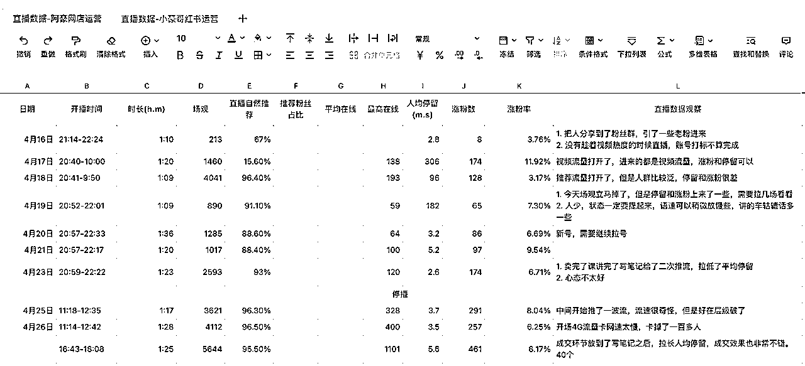

在有了标杆案例之后，所有新人主播，只需要做一件事情。就是去拆解标杆的直播内容，并尽力去做到 1:1 模仿。

那么，需要从以下 4 个角度，先去拆解直播，只要拆解到位了，模仿就是做刻意练习。很多人，1:1 模仿都做不好，核心是拆解的时候不够细心。

我们会从如下 4 个角度拆解直播。

*   画面呈现。这个是最简单的一环，主要是要足够细心。比如，不要露出

*   话术。不同的人表达的内容是不完全一样的，因为学识习惯性格等等，但是我们场控会根据每个人的特性，找出一些主播不经意间说出来的金句，基本上每次直播复盘就会让主播以后每次直播都要讲。以及在主播对内容还不熟的情况下，犯错是很正常的，这里其实有两个方案，一个是如果主播犯错能在自圆其说，我们基本不会干涉，因为她是按自己的逻辑解释的，就基本没问题，如果不能，我们会给她一些固定的标准答案

*   场控配合。每一次直播，来的观众 90% 以上都是不重叠的，为了保证同样的直播效果，在适合的时机顺利地抛出同样的话题，那么就需要场控，在同样的时机节点，做好捧哏的角色，抛出话题，让主播能够顺利地接茬，延续话题。同时，当有负面的生意出现的时候，场控要及时承担好直播间管理员的角色，并且，通过带节奏的方式，维护主播。将直播间氛围扭转回来。

*   直播间数据。自然流的直播间，核心就看中几个数据，人均停留，涨粉比率，这个点在我们直播复盘数据表中也有提现。所以，当一个直播拉不起来流量的时候，通过数据之间的对比，也能清晰地看出来，差距到底体现在哪个方面，从而在自己的直播间话术里面，针对性地加强某个部分。

## 2.3 内容迭代（核心）

前面说到，知识付费直播间核心中的核心，就是话术。

而一整个能产生如此大杀伤力的话术，也不是一开始就苦思冥想，像编剧写剧本一样，憋个大招一下憋出来的。

直播内容一般会经历几个阶段。

1.  广泛去看市面上的同行，都在讲什么，收集选题。

1.  根据自己对行业，对目标用户的理解，提出用户最关心的几个选题。

1.  将选题汇总，从中选出 3-5 个典型问题，开始构思话术结构。

1.  试播，根据直播的数据反馈，用户评论的反馈，不断调整选题，调整选题所阐述的内容，阐述的方式。

1.  稿件成熟，大的框架固定，即选题固定，每次只是做微调，调整其中的案例，增加互动性，趣味性等等。

关键是第 4 步，这个过程可能会持续比较久，一个成熟的稿子，在成熟之前，可能经过数十次的调整和打磨，最终才定稿。

那么在这个打磨的过程中，根据什么作为反馈来调整内容呢？我简单说几个通用的点：

*   录屏。一定要把每次直播录屏下来，特别是前期，然后不定期把弹幕全部下载下来分析，作为内容迭代的方向，毕竟直播间的问题体现的是目标用户最直接的诉求，也能侧面反映出来直播间人群属性.

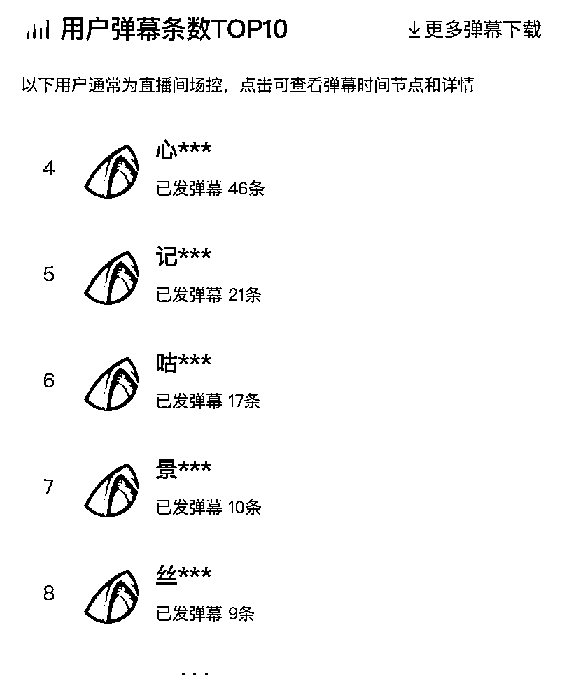

*   记录直播过程中，讲到每一个选题时，在线人数的变化趋势。在线人数的变化，是最终直接反馈观众反应的指标。如果这个话题不吸引人，直播间观众的反馈，并不是给你评论，而是直接走人。反之，如果当前话题吸引人，之前在线的观众，不仅会被你留住，同时新进的人，也会被你迅速吸引到，所以在线人数会持续攀升，至少不会掉。

大致方法如此，总之，一定要对直播间内容，对多个唯独细分，把时间切块进行研究。凡有结果，必有路径！

# 什么是知识付费的蓝海战略？

这个话题相信很多正在选项目的老板或者操盘手很感兴趣。不过不同级别的老板，对于项目是否蓝海的标准是不一样的，我仅从我个人经历出发，简单说下我自己的观点，欢迎一起探讨。

## 3.1 什么是知识付费的蓝海？

知识付费这几年，一直伴随着“割韭菜”的标签。对此我的个人观点是，不管交付做的好与否，任何知识付费的项目都只能保证一部分的人的成功率，而抛开成功率本身，是否是“割韭菜”行为，主要取决于 3 个方面，产品营销方式，目标人群层次，以及实际交付效果。

如果对效果过分夸大宣传，不管培训的目标用户是针对小白，还是老鸟，必然是割韭菜。在不夸大宣传的情况下，提供这个市场价格下该有的产品和服务，甚至利用自己的核心竞争力提供独家的资源和服务，就不是割韭菜。再有人说，就随他去吧。

当然行业里，有非常非常多靠知识付费做的很大的公司，项目本身成功率极低，主要靠各种包装，流量也主要靠投放，只要投不死，就往死里投。这个不去评价，和个人价值观有关系，就看你怎么去选择。

我们在立项之前，会先从以下几个角度，先评估项目本身。

*   成功率。有一定的成功率项目才不至于崩盘，在公域里做直播和成交，流量是把双刃剑。同时，项目有成功率，才有后续升单的可能性。

*   投入产出比。我之前的抖音小店学员里，有位学员一年到手净利润超过 400w，其他变现过万的，更是一抓一大把。选项目选择投入产出比的天花板比较高的，各类案例层出不穷，对前端做流量和做转化，提供转化的弹药支持。

*   是否适合普通人。这个字面意思。适合普通人，目标人群才广，如果上手难度高，人群小众，获取流量的难度和成本，也会非常高。

如果成功率还可以，投入产出比合适，以及普通人好上手。那么就可以说，这个项目本身是个可以挖掘（注意只是挖掘）的项目。

具体能不能测，要不要去测，还取决于非常关键的一环，就是这个项目本身具体的话题度，热度，接下来呈上升的趋势的概率，有多大。

雷总说，要“顺势而为”。这个项目的热度接下来是否上升，我理解也是一种势。

比如，时间回到21 年，抖音在大力发展，平台缺商家，你去做商家的培训，这种就是在顺应趋势。

而现在，不管是抖音，小红书，还是更早的淘宝等传统电商平台，都在打击无货源电商行为，再去做这类电商培训，不是说一定跑不出来，而是这个项目本身就不符合平台趋势，时代趋势，难度一定是越来越大！投入不划算！

## 3.2 知识付费行业的未来趋势？

过去几年，知识付费行业伴随着抖音、小红书等自媒体平台的崛起，经历了几年的野蛮生长，一本万利的行业特性，造富了一批批又一又胆子大的人，成就了一个个白手起家的神话。

如今，这个行业也走到了一个转折的关键时期，正在大洗牌。这里面的原因很多，行内人懂得都懂。当前的知识付费行业，也呈现出以下几个特点：

*   行业鱼龙混杂，消费者自我保护意识不断加强，决策成本、决策周期越来越长。

*   太多负面案例，平台面临舆论压力，必须出手对相关内容进行管控，打击。

*   响应 Zc 各项需要，保护弱势群体，保护家长减轻育儿负担等等，各种内容不得出现。

从另一个角度来说，整个行业也在迎来良币驱逐劣币的关键阶段。因为慢慢的大家会发现，现在这个内容大环境下，还能活下来的，大部分还是靠谱的。

并且做培训的 IP 为了活下来，也会越来越注重培训的质量，包括产品的质量，服务的质量。知识付费，已经基本过了那个纯靠信息差，纯靠销售体系赚钱的日子了。那些提供空气服务的培训公司，最多就是打一枪换一个地方的游击队，成不了大气候。

社群其实也是类似的，前几年，市面上出现了各种各样的社群，私董会，慢慢的大浪淘沙，现在还能活着的社群，有稳定续费的社群，已经是行业天花板了。

所以，对照社群这个模式，分析下知识付费行业的未来趋势在哪里？

就两个立足点：

提供真正的产品价值；

提供和价格匹配甚至超出这个价格的服务；

除此之外，都是辅助手段。知识付费，正像其他传统行业一样，回归产品和服务。