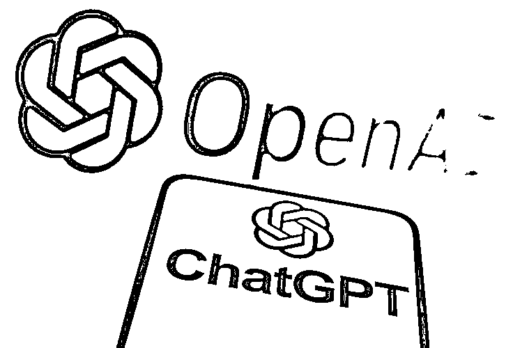
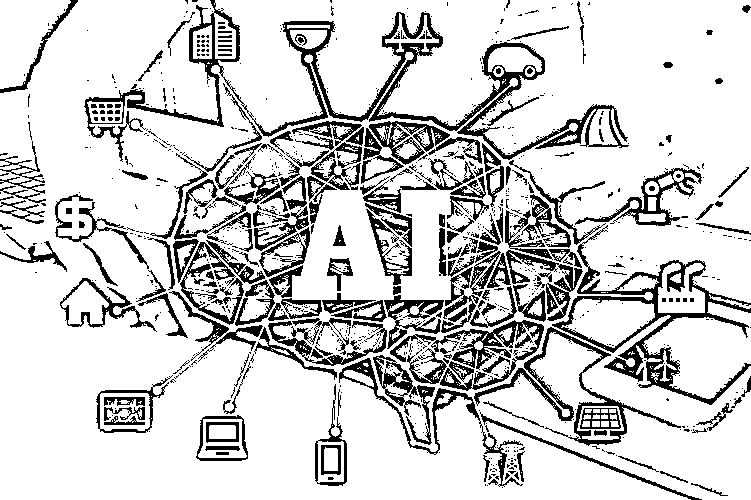
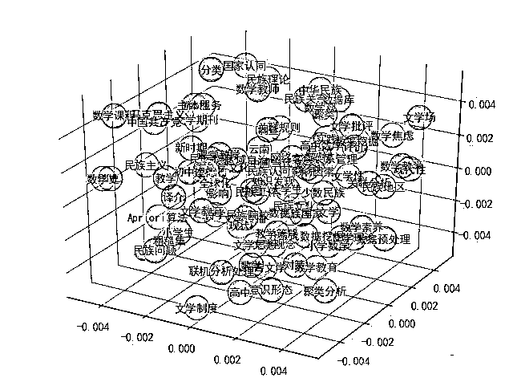
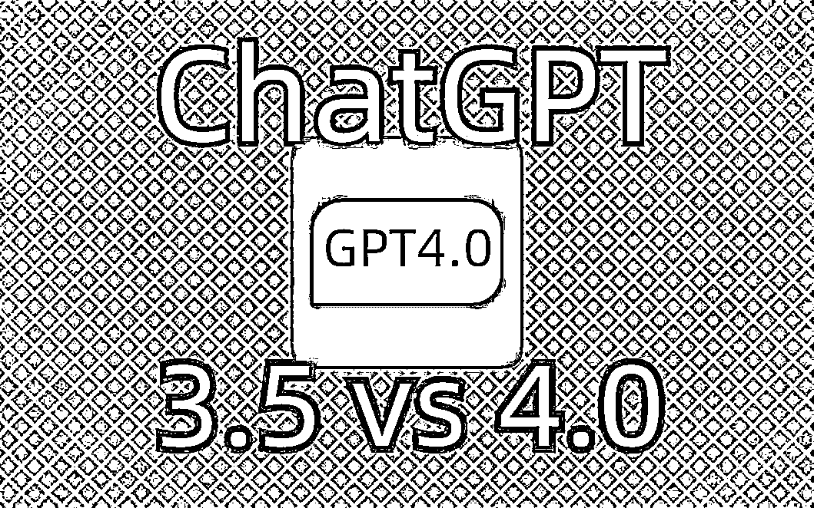

# 【基础】通俗化理解ChatGPT如何做到词语接龙？

> 来源：[https://sif8f6uboze.feishu.cn/docx/H9L4d5rXdoDxJExX1HjcyxEhnNe](https://sif8f6uboze.feishu.cn/docx/H9L4d5rXdoDxJExX1HjcyxEhnNe)

## 介绍

我们都知道ChatGPT是AIGC工具，其实就是生成式人工智能。大家有没有想过这些问题🤔️：

*   我们输入一段话，就可以看见它噼里啪啦的一顿输出，那么它的原理到底是什么？

*   到底它是怎么锁定这些文字，然后把相应的答案输出给我们的？

当我第一次面对这些问题时，我最开始并没有多想，就觉得它很牛就对了 🐮！

带着这些疑问，我们一起开始今天的分享。

## 原理

在分享之前，我就了解到最开始学习提示词的那一波人真的太辛苦了，资料很稀缺，不像今天一抓一大把，我和一位提示词大佬沟通过，了解到，他们最开始都是从学习原理和概念开始，一句一句提问，一点一滴地探索，时常带着疑问思考它是怎么做到。

其实这也是最好的途径，这样有助于我们了解原理，而不会在遇到各色各样的问题时手足无措。也可以在后期，帮助我们去理解，去编写更加结构化的提示词，来应对复杂的任务！

通过这次学习，我们基本上可以了解到以下几点：

*   ChatGPT是怎么理解我们输入内容的含义的？

*   ChatGPT回答的时候，它是怎么做到词语接龙式的涌现？

我这边通过观看视频和资料，总结并通俗化的理解了一下，希望对大家有所帮助：

首先，计算机如何可以理解我们提供文字的意思？是需要经历两步。第一步叫做向量化，第二步叫做信息压缩与特征提取。

向量化是什么？看起来有点蒙圈，其实向量化就是将文字、图像或其他数据类型转化为数值形式的一种方法，通常是转化为一串数字，即向量。这个向量可以代表数据的某种特性或信息。

如例：你有一个水果清单：苹果，香蕉和橙子。要让计算机理解这些水果，你可以给每种水果分配一个数字。例如，苹果是[1,0,0]，香蕉是[0,1,0]，橙子是[0,0,1]。这样，当你告诉计算机“苹果”，它会知道你是指[1,0,0]这个向量。这就是一种简单的向量化。

另外苹果是大的，小的，还是熟的，烂的，这些描述形状，成熟度各个维度的特征词，都会影响向量的长度和不同。说白了，维度越多，转化的向量对于这个事物表述的准确性越高。

为什么要向量化呢？向量化的目的不仅为了电脑方便识别（数字更容易识别）。另外，向量化通过机器的不断的试错再试错地训练(术语叫 “信息压缩与特征提取”), 这样它可以结合大量的语料库将不同的词语放在巨大向量空间中合适的坐标上，特征越相似，坐标的距离越近。

那是怎么不断试错的呢？这样说，现在我们要训练10000个字的数据集（书籍、新闻等等数据集），那如何让这个10000个字放在合适的坐标中呢，那就是结合每个词与词进行向量的计算，术语叫损失函数，来判断这个词是否比较合适的放在一起。这样不断计算，不断试错，和不断纠正，最终10000个字就放在了合适的位置。

有案例吗？有，比如“苹”和“果”， 按照常识应该是放在一起的，那是因为结合了这个10000个数据集进行计算，"苹"和"果"经常出现在一起，所以他们应该放在一起。而"苹"和 “名” 在这个数据集中几乎不存在靠近的机会，所以不适合在向量空间中存在相近的位置。其实，这个巨大的向量空间中，我们也看到了现实生活中的一些规律，俗话说 “物以类聚，人以群分”，这句话则是对这个规则的一种很好的诠释。

换个例子，因为我们都是追逐时代潮流，想要学习AI来赋能工作、自媒体、等等赛道的弄潮儿，所以你们在看我的文章！从某个角度，我们在大千世界的向量空间中，因为学习AI这个共同目标出发，基于这个维度，我们的坐标值是比较接近的。

现在词都在正确的位置了，那怎么词语接龙呢？这时候就需要请出 Google TransFormer的 “自注意力机制”，它是现在通用大模型的鼻祖，这边不过多解释，感兴趣的朋友可以了解下。回到正题，到底怎么词语接龙，举个例子，前半句的提问是“苹果的创始人是乔布斯，那么苹果指的是？” ，现在答案有两种，一种是“美国科技巨头公司”。另外一种是“水果”。

到底是哪种？这时，机器提取句子里的关键词"苹果"、“创始人”、“乔布斯”后，先在整个向量空间中进行分析拿到可能相近的两个结果："苹果"、“美国科技巨头公司”，与可能的结果进行向量相乘并再次训练，得出哪个答案的权重更高，通过不断试错，最终答案就得出了“美国科技巨头公司”。

所以到底什么是词语接龙式涌现的原因呢？总结一句话，就是结合已经出现的字，把接下来可能的答案不断进行计算、训练、试错和自我纠正，得出概率最高的那个词后，再次拼起来后，按照同样的方式再继续寻找下一次词。

另外，在学习过程中有一句话让我影响很深刻，ChatGPT本身就是一个基于 Transformer 为基础的语言模型，被制作出来，并不是为了解决实际问题，而是为了把话说漂亮，而怎么把话说漂亮，就是基于它看了多少本书了。

我们都知道GPT3.5看了 1750亿数据量 的书籍，所以用GPT3.5时，细心的小伙伴会发现，有些场景虽然说的很有道理，但实际结果是不对的。但是用GPT4.0的时候，发现说的又对了，那是因为GPT4.0是 1.8万亿 的数据量。所以大家知道为啥有时候GPT4.0的回答更实用了吧？那是因为他们脑袋瓜子不一样。

我平时经常分享AI资讯时，看到未来GPT5 的数据集将会是 GPT4.0的100倍，真的不敢想象到底它的天花板在哪里！！！学会ChatGPT，已经势在必行。

## 总结

最后，我想说一句话也算是自我勉励，“学习新知识，系统学习的方式才是正确法则，如何系统学习，了解基础是第一步，切记不要浮躁”。

小小分享，希望借助自己微不足道的力量帮助到大家！💪

原视频地址（视频更生动哦）：https://www.bilibili.com/video/BV1yV4y1k7Tc/?spm_id_from=333.337.search-card.all.click&vd_source=da75b8139ed7919da366ae88ca2ca8a4