# ChatGPT低成本、可视化、高效性分析小红书爆款

> 来源：[https://txt6wm3b04b.feishu.cn/docx/HAsodbgp5o3LluxonoecMibpnqh](https://txt6wm3b04b.feishu.cn/docx/HAsodbgp5o3LluxonoecMibpnqh)

我是越越，一位AiGC工具人，一位小红书全平台6w+粉的新生博主

AiGC助力设计行业变现20W+，跑通AiGC生活化应用SOP，持续赋能IP运营

985大数据分析专业硕士

AiGC深度开发者

“AiGC生活化”创始人

AiGC指令调教师

大学生AiGC竞赛应用

C9大学人工智能联合培养

以往文章：

AiGC运营自媒体平台的策略是可行、可落地、可提高效率的！

但是AiGC作为辅助工具，更多的是人工参与，不断调教、不断摸索才能在Ai蓝海中深耕！

本文提供思路和方向，该思路和方向亦可用于其他自媒体平台，现已跑通有需要的圈友可以链接！

## 本文概要

本文主要讲述如何使用ChatGPT+Noteable插件应用于小红书平台运营简单数据分析

文章讲解了数据分析的基本流程，影响数据分析精准度的因素有很多，圈友勿喷！

各位感兴趣的圈友可以在此基础上进行深入优化

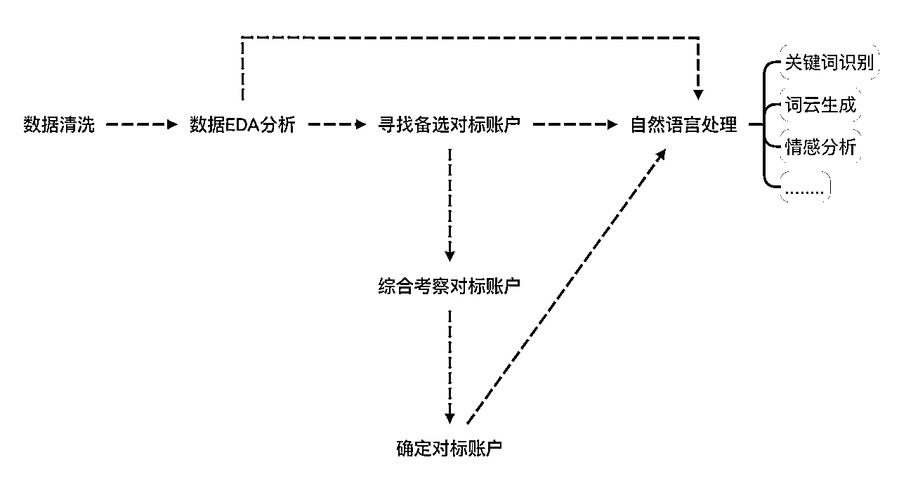

## 本文指令合集

```
#背景介绍
[Task introduction]
[Tool]:使用ChatGPT中Noteable插件进行数据分析
[Role]:资深的数据分析师
[Ability]:熟练使用多种数据分析流程、算法、模型，尤其擅长[小红书]数据分析

#任务合集
[Task set]:
1.使用专业能力进行多任务数据分析，每个任务中均已可视化图表+文字解读形式呈现
2.请使用多样化、美观、主流的可视化图表稳定、高效输出，图表需要使用数字进行标注
3.请使用通俗易懂的语言，提出切实可行的图表解读

Task 1 :#创建项目
创建一个名为[数据分析A]的新项目并将其设置为我的默认项目。

Task 2 :#创建笔记本
在[数据分析A]中创建Noteable笔记本

Task 3 :#数据验证
读取Noteable中[数据分析A]项目中的数据文件，随机展示1名博主数据

Task 4 :#数据清洗
请执行数据清洗标准流程，对[数据分析A]项目中[数据集]进行数据清洗。
[数据格式转换]：检测[数据集]中的数据格式，检查数值列中带有“w”的数据替换成阿拉伯数字，将'--'替换为NaN，将数值列中的NaN替换为该列的平均值，将笔记发布时间转化为时间戳。

Task 5 :#数据EDA分析
请对NoteAble[数据分析A]项目中已清洗完毕的数据进行EDA数据分析
请依照[数据概览]、[缺失值分析]、[数值特征分析]、[类别特征分析]、[相关性分析]顺序分析
请使用多样化、美观、主流的可视化图表稳定、高效输出，图表需要使用数字进行标注
请使用通俗易懂的语言，依照EDA分析结果，提出切实可行的图表解读
请根据EDA分析结果对小红书运营提出初步切实可行的建议

Task 6 :#数据EDA分析应用
[哪些博主的互动效率最高？]+[多样化可视化图表呈现]+[提供解读]+[输出建议]

Task 7 :#寻找对标账户
在Noteable中[数据分析B]项目数据文件中选择符合条件的对标账号
请为我找出与[博主名称]最相似的5个对标账户，基于[点赞数、收藏数、评论数、分享数、笔记标签1、笔记标签2]特征，使用余弦相似度计算。对于类别特征[笔记标签1、笔记标签2]，请使用独热编码。筛选条件为达人等级为[素人]。输出格式为：博主名称、相似度、笔记链接。

Task 8 :#自然语言处理
我想知道哪些话题或标签最受用户喜欢
请统计互动量高的博主标题设置特点
......
```

## Notable是什么？

只需要知道一款免费的、在线编程、运行代码的在线平台

## GPT4.5 Notable数据分析原理


## 原始数据采集

### 小红书相关数据直接采集

本文样本数据属于公开数据，现提供下载链接： 欢迎大家进行测试

数据平台直接导出数据，但是数据量小、类型小，用户可以通过首页中“拉新领会员”获取三天的个人版体验资格，如需更进一步分析数据建议购买企业版


本次样本数据采集标准

1.  7天内的低粉爆文（1000<粉丝数<10000）

1.  图文笔记

1.  涵盖带货笔记、商业笔记

1.  笔记基本数据、互动数据

1.  生活记录——穿戴——配饰类

样本数据内容类型：

笔记标题、笔记链接、博主名称、达人等级、笔记发布时间、

笔记标签、互动量、点赞数、收藏数、评论数、分享数

样本数据说明：

1.  样本数据只提供简单的运营数据，深入分析需要更丰富的数据类型

1.  样本数据数量为1000条仅供演示使用，深入分析需要数量更多的数据

1.  样本数据获取方式具备低成本、高效率、时效性强特点


### 通过八爪鱼采集数据

数据需要具备可靠、大量、实时的特点，可以通过从第三方数据平台获取公开的实时数据

高效搜集数据，八爪鱼采集器免费使用、稳定可靠，无代码编写规则采集，适合小白操作

具体软件使用方法参考官方教程：https://www.bazhuayu.com/tutorial8/hottutorial/gnd

现提供本次样本数据八爪鱼采集规则 （仅供学习使用，勿做商用，请合法使用！）

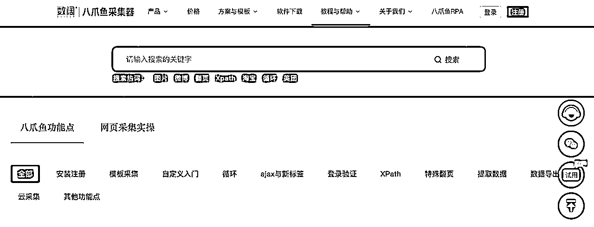

## Notable插件工具

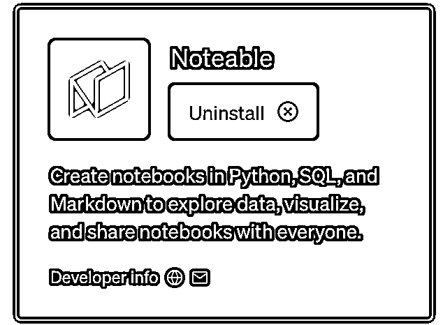

## Notable插件安装

1.  进入Plugin模式，点Plugin商店

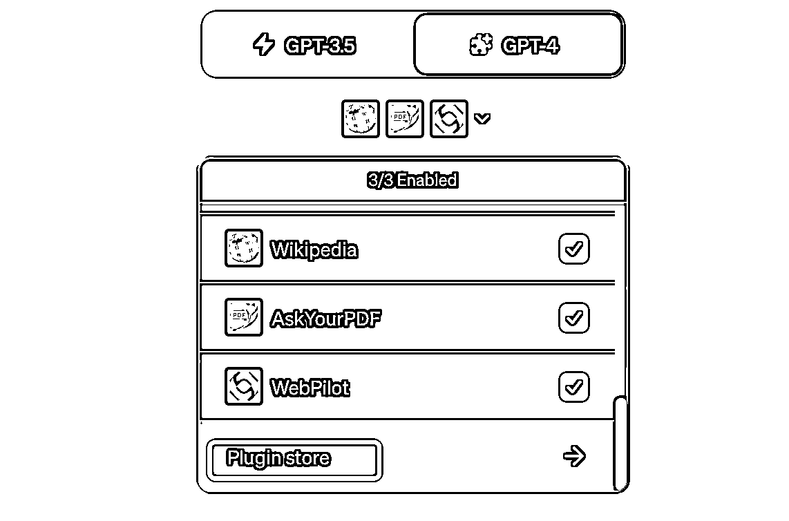

1.  搜索Noteable插件并安装,登录谷歌账号完成安装。

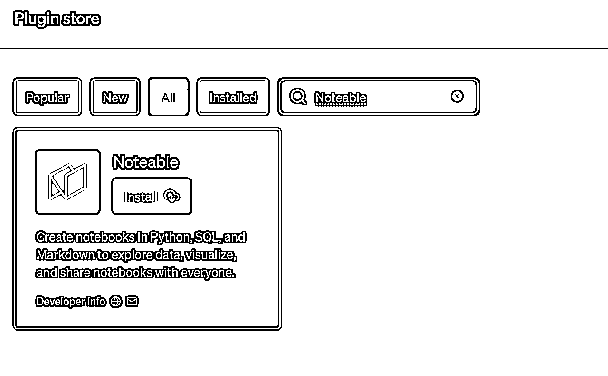

1.  选择Noteable插件

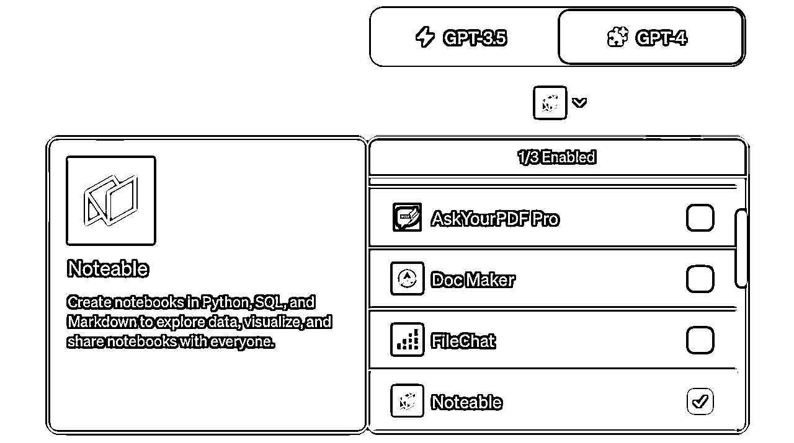

## Notable插件使用

### 项目背景介绍

```
[Task introduction]
[Tool]:使用ChatGPT中Noteable插件进行数据分析
[Role]:资深的数据分析师
[Ability]:熟练使用多种数据分析流程、算法、模型，尤其擅长[小红书]数据分析
[Task set]:使用专业能力进行多任务数据分析，每个任务中均已可视化图表+文字解读形式呈现
           请使用多样化、美观、主流的可视化图表稳定、高效输出，图表需要使用数字进行标注
           请使用通俗易懂的语言，提出切实可行的图表解读
```

打开插件Noteable、WebPilot：


输入中文Prompt：


### 创建Noteable项目

```
Task 1 :
创建一个名为[数据分析A]的新项目并将其设置为我的默认项目。
```


点击[数据分析项目链接]，进入平台验证是否创建完成：

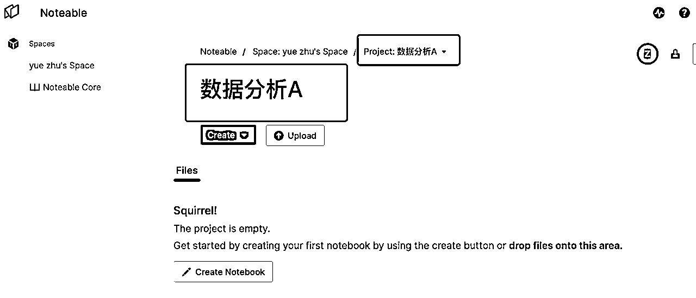

### 创建Noteable笔记本

```
Task 2 :
在[数据分析A]中创建Noteable笔记本
```


点击[小红书数据分析笔记本链接]进行验证：

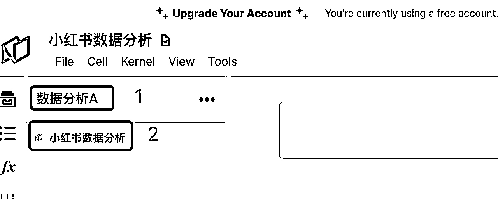

### 上传Noteable数据集

点击[Upload from computer]上传数据文件，上传的文件格式为Excel、Csv等数据文件类型，单次上传文件数不超过20个，单个文件大小不得高于80M


确认数据集是否上传完毕：

```
读取Noteable中[数据分析A]项目中的数据文件，随机展示1名博主数据
```

成功读取，可以进行下一步操作：

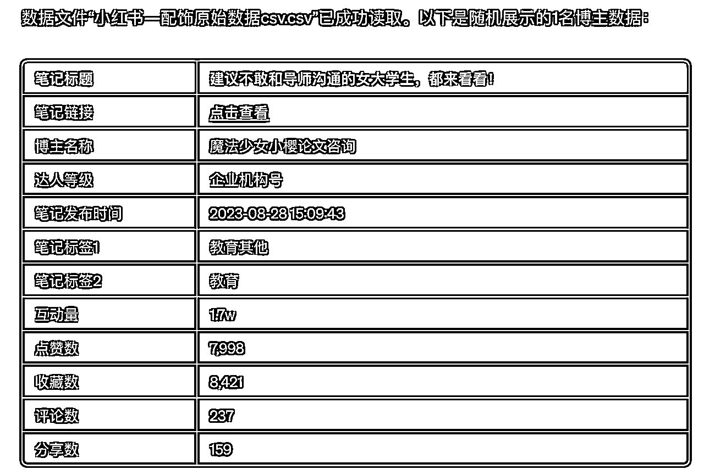

### Noteable数据清洗

```
Task 4 :
请执行数据清洗标准流程，对[数据分析A]项目中[数据集]进行数据清洗。
[数据格式转换]：检测[数据集]中的数据格式，检查数值列中带有“w”的数据替换成阿拉伯数字，将'--'替换为NaN，将数值列中的NaN替换为该列的平均值，将笔记发布时间转化为时间戳。
```

随机抽查数据清洗结果：

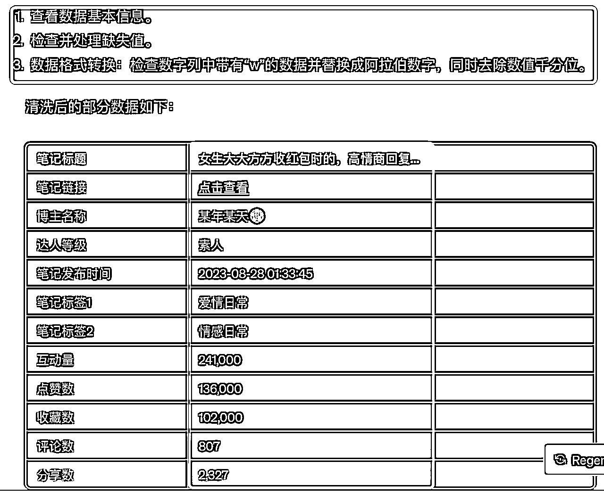

### Noteable探索数据EDA分析

```
Task 5 :
请对NoteAble[数据分析A]项目中已清洗完毕的数据进行EDA数据分析
请依照[数据概览]、[缺失值分析]、[数值特征分析]、[类别特征分析]、[相关性分析]顺序分析
请使用多样化、美观、主流的可视化图表稳定、高效输出，图表需要使用数字进行标注
请使用通俗易懂的语言，依照EDA分析结果，提出切实可行的图表解读
请根据EDA分析结果对小红书运营提出初步切实可行的建议
```

Noteable中的代码联动，生成如下成果：

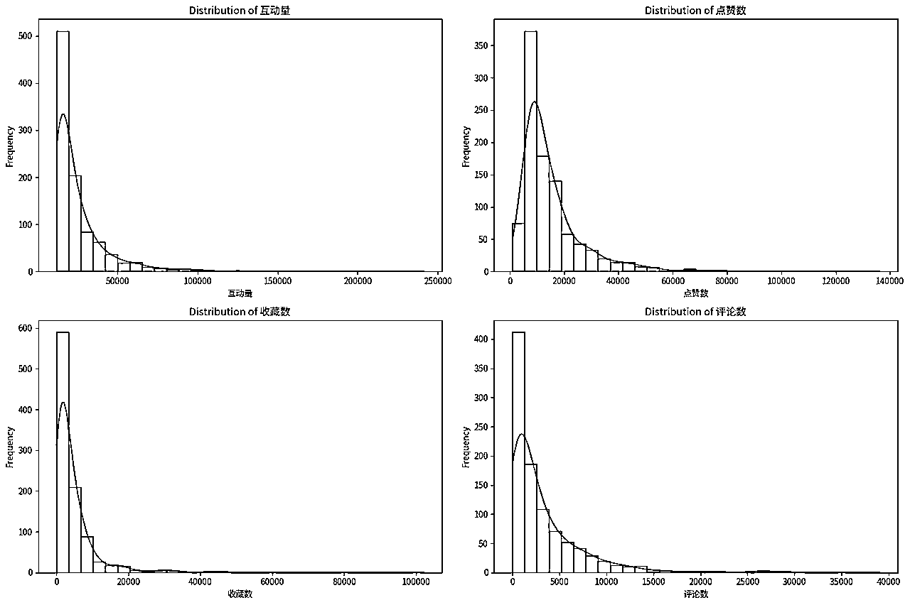

*   互动量、点赞数、收藏数和评论数都呈现右偏分布，表示大部分博主的互动量、点赞数、收藏数和评论数都集中在较低的范围内，但也有少数博主的这些数值非常高。

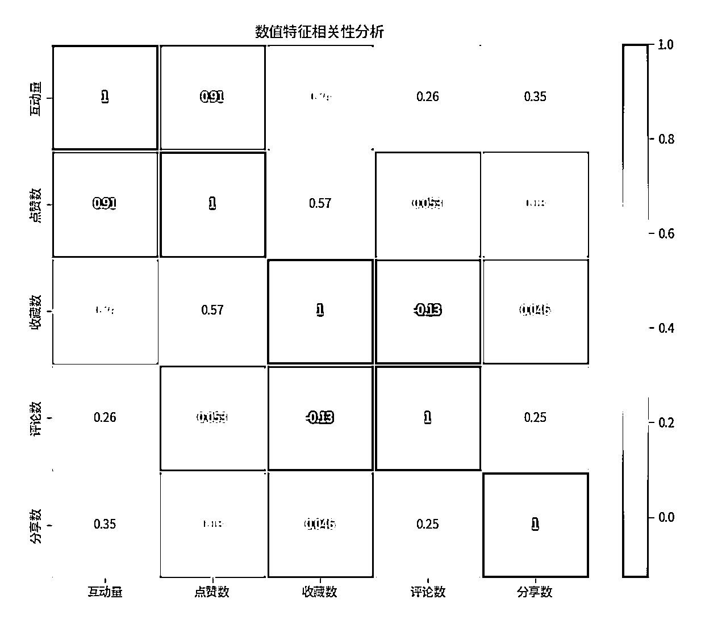

*   从热力图中可以看出，互动量与点赞数、收藏数、评论数和分享数都有较高的正相关性。

*   点赞数与收藏数也有较高的正相关性

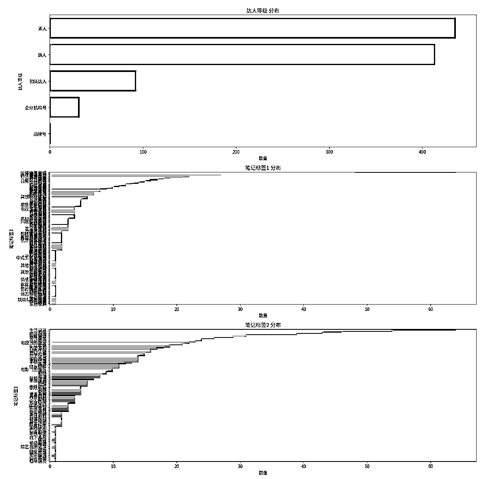

*   达人等级中，大部分博主为素人。

*   笔记标签1和笔记标签2展示了各个标签的分布情况。

基于EDA分析分析你还可以继续向ChatGPT提问：

```
[哪些博主的互动效率最高？]+[多样化可视化图表呈现]+[提供解读]+[输出建议]
```

你通过EDA数据分析，可以向ChatGPT提问以下问题：

提问模板：[输入问题]+[可视化图表呈现]+[提供解读]+[输出建议]

例如：[哪位博主的笔记内容最受欢迎？]+[可视化图表呈现]+[提供解读]+[输出建议]

Noteable中生成可视化图表，ChatGPT生成文字解读、建议：

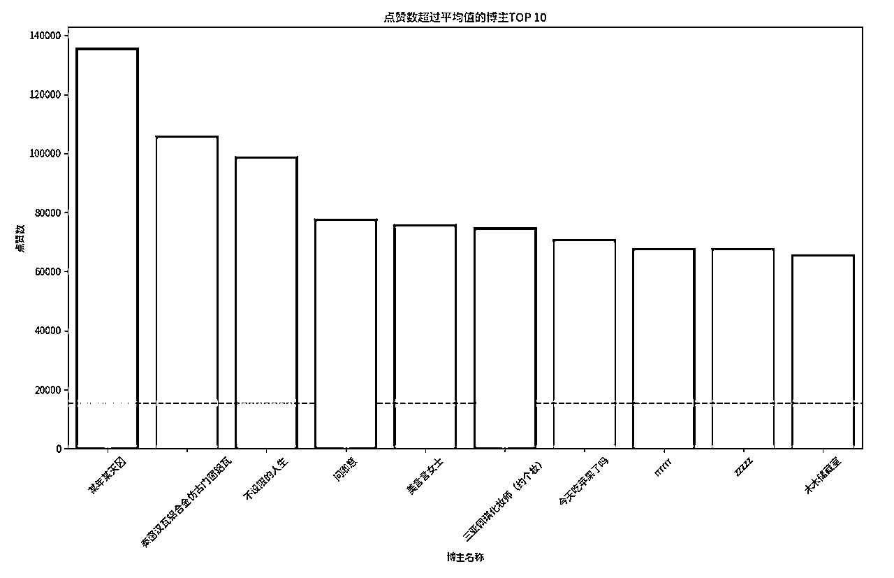

1.  解读:

*   上图展示了点赞数超过平均值的博主TOP 10。

*   红色虚线表示点赞数的平均值。

*   可以看到，这10位博主的点赞数远超过了平均值，表明他们的内容受到了大量用户的喜爱。

1.  输出建议:

*   对于品牌或广告商来说，可以考虑与这些高点赞数的博主进行合作，因为他们具有较高的用户影响力。

*   对于其他博主来说，可以研究这些高点赞数博主的内容风格和发布策略，从中学习和借鉴，提高自己的内容质量和受众吸引力。

你还可以将上述成果导出为图片：

```
将上述所有成果按照以下要求输出图片，提供下载链接：
[字体要求]：宋体、加粗、30号字体
[排版要求]：
版面A4大小、页边距（上下左右分别为2.54cm、2.54cm、3.18cm、3.18cm）
文字段落单倍行距、两端对齐，可视化图表居中显示位于文字底部
```


EDA数据分析作用不仅仅在此，还在于对数据精细化分析

通常可以向Chat GPT提问以获取对运营数据更深层次的透视和了解。

```
[哪些博主的互动效率最高？]+[多样化可视化图表呈现]+[提供解读]+[输出建议]
```

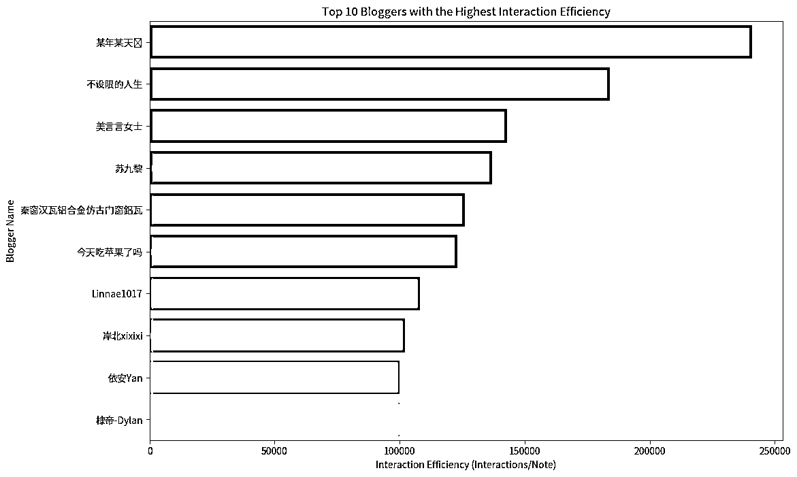

### Noteable寻找备选对标账户

```
Task 7 :
在Noteable中[数据分析B]项目数据文件中选择符合条件的对标账号
请为我找出与[西卡吃不饱]最相似的5个对标账户，基于[点赞数、收藏数、评论数、分享数、笔记标签1、笔记标签2]特征，使用余弦相似度计算。对于类别特征[笔记标签1、笔记标签2]，请使用独热编码。筛选条件为达人等级为"素人"。输出格式为：博主名称、相似度、笔记链接。
```

Noteable可视化图表输出：

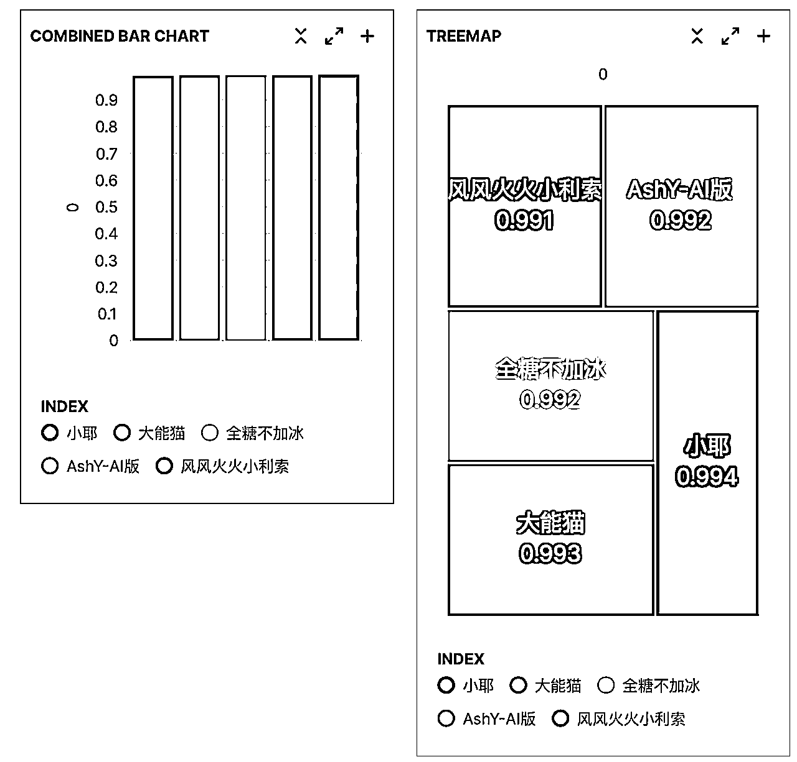


点击红框中的网址便可以进入笔记页面

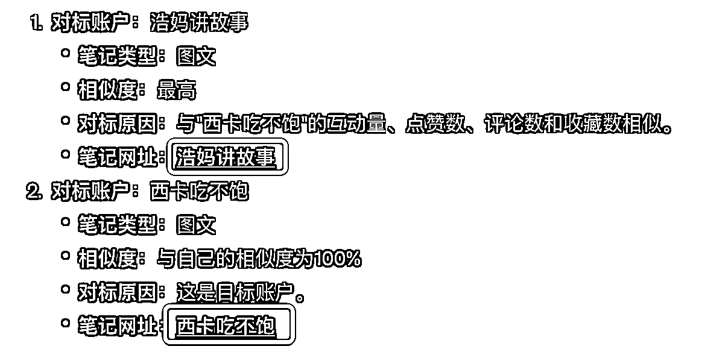

注意：

小红书对标账户的选择需要结合博主风格而定，因此选择完备选对标账户后应该对博主实际调性进行分析以达到更为精准匹配目的。

### Noteable自然语言处理 (NLP)

Noteable自然语言处理 (NLP)可以实现以下功能，可以根据实际需求向ChatGPT提问

1.  内容生成与优化：使用 NLP 模型+GPT4.0，自动生成文章、标题或摘要，或者优化现有内容的质量。

1.  内容推荐：基于用户的阅读历史和偏好，使用 NLP 技术为用户推荐相关的文章或内容。

1.  情感分析：分析用户评论或反馈，了解读者对某篇文章或某个话题的情感倾向，如正面、负面或中性。

1.  关键词提取：自动从文章中提取关键词或短语，帮助自媒体优化 SEO 或进行内容标签化。

1.  自动分类：使用 NLP 技术自动将文章分类到不同的主题或类别中。

1.  语言翻译：为多语言读者提供内容翻译，扩大内容的受众范围。

1.  语音转文本：将音频或视频内容转化为文字，方便读者阅读和搜索。

1.  文本转语音：将文章内容转化为音频，为读者提供听书或播客体验。

1.  交互式内容：使用 Jupyter Notebook 创建交互式的内容，如数据可视化、模型演示等，增加用户参与度。

1.  数据分析：结合 NLP 和其他数据分析工具，对自媒体的用户数据、阅读数据等进行深入分析。

分析爆款笔记话题、标签设置：

```
我想知道哪些话题或标签最受用户喜欢。
```

Noteable可视化图表输出：

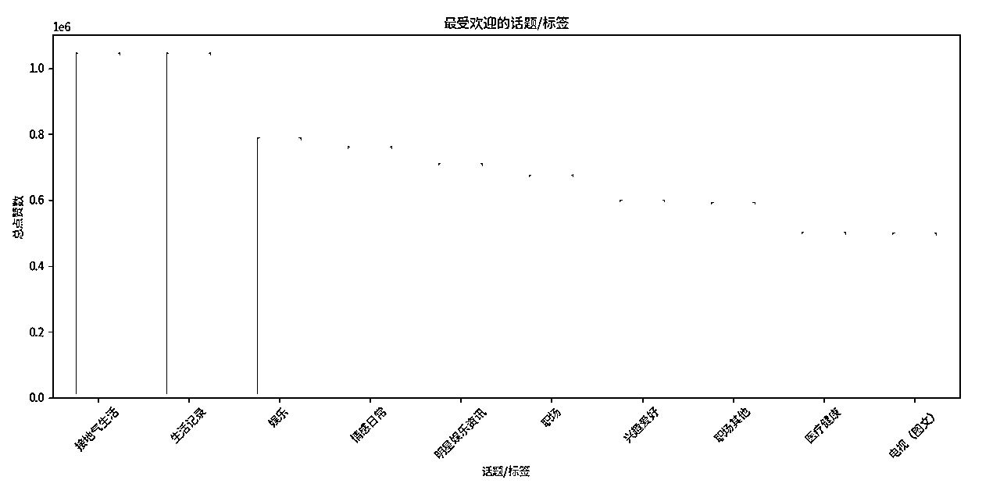

ChatGPT文字输出：

解读:

*   "爱情日常" 是最受欢迎的话题，获得的点赞数最多。

*   "摄影技巧" 和 "情感日常" 也是相对受欢迎的话题，点赞数位列第二和第三。

*   其他如 "拍照技巧"、"历史" 和 "社科" 等话题也有不错的点赞数。

建议:

*   运营团队可以考虑加大对 "爱情日常"、"摄影技巧" 和 "情感日常" 这几个话题的推广力度，鼓励博主产出更多相关内容。

*   对于点赞数稍低的话题，可以考虑进行一些创新活动或合作，提高其在平台上的曝光度和受欢迎程度。

```
我想看看哪些博主的标题长度普遍较长
```

Noteable可视化图表输出：

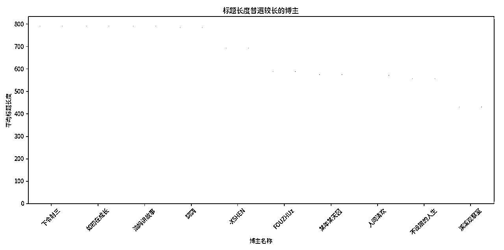

分析爆款笔记的标题风格、SEO布置特点：

```
请统计互动量高的博主标题设置特点
```

Noteable可视化图表输出：

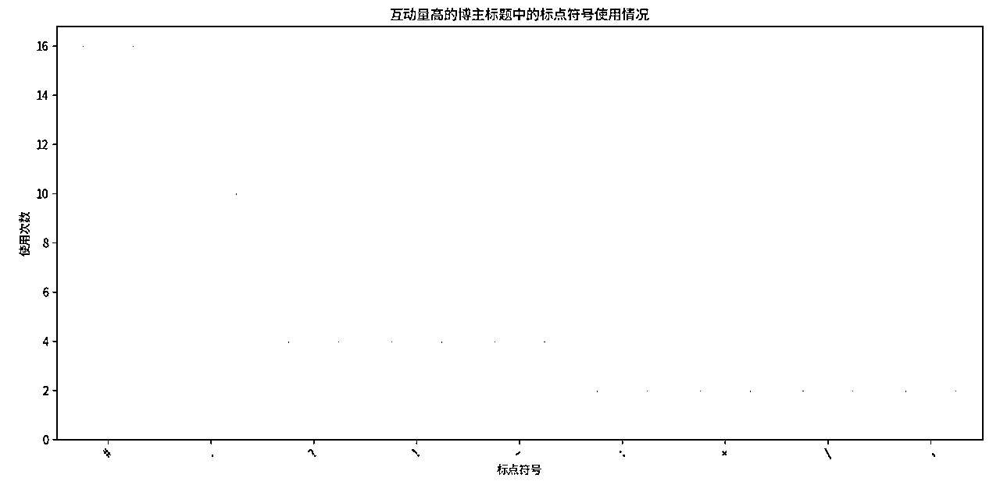

ChatGPT文字输出：

1.  标题长度：我们发现互动量高的博主的标题平均长度为约122.6个字符。这意味着用户可能更喜欢具有一定描述性的标题，而不是过于简短的标题。建议博主在保持标题简洁的同时，确保其能够准确描述内容，吸引用户点击。

1.  使用标点符号：标点符号在标题中起到了重要的作用，可以增加标题的可读性和吸引力。例如，"#" 符号可能表示热门话题或标签，"." 可以用来分隔不同的信息，而 "?" 可以引起用户的好奇心。建议博主合理使用标点符号，使标题更具吸引力。

1.  关键词和热门话题：可以进一步分析标题中的关键词，找出哪些词汇或短语更受用户喜欢。这可以帮助博主了解当前的热门话题或趋势，从而制定更有效的内容策略。

1.  A/B测试：为了验证哪种标题策略更有效，可以进行A/B测试。例如，对于同一篇文章，可以设置两种不同的标题，然后观察哪种标题获得更高的点击率和互动量。

1.  用户反馈：可以定期收集用户对标题的反馈，了解他们更喜欢哪种类型的标题，以及哪些标题能够引起他们的兴趣。

1.  持续学习和优化：标题策略不应该是一成不变的。随着时间的推移，用户的喜好和趋势可能会发生变化。建议博主定期分析数据，了解哪些策略更有效，并根据分析结果进行调整。

## 结语

模型的精确度可能受到数据质量、特征工程、模型选择与参数、训练数据量、数据偏见、模型训练方法、评估策略、时间和空间变异、外部因素以及数据泄露等多种因素的影响，其中数据的质量和代表性、特征的选择与处理以及模型的复杂度与参数设置尤为关键。

因此ChatGPT需要不断调教，优化数据采集处理。