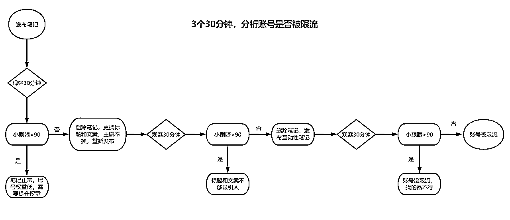

# 30岁被裁员，靠小红书无货源电商逆风翻盘

> 来源：[https://ulhriz6sf7.feishu.cn/docx/HHWtdDgeXo4Apbxh2KscX8uYntc](https://ulhriz6sf7.feishu.cn/docx/HHWtdDgeXo4Apbxh2KscX8uYntc)

大家好，我是蛋宝，今年6月份加入的生财有术

在职场摸爬滚打已经有9年，其中有4年的电商客服经验，3年的国内saas电商经验，和2年的跨境saas电商经验

在去年准备过30岁生日前，我不幸被裁员了。

那段时间一边在家里休息，一边在看项目，去年10月份就知道小红书店铺，我以为只是昙花一现，没想到小红书店铺越发壮大。

于是，就在生财狂刷小红书精华帖

今年6月15号我开始做小红书店铺，一边用下班时间实操1个店铺，6月份出了46单

7月份，我找了曜文老师深度交流开始运营3个店铺。

8月份，运营4个店铺（其中1个刚开店，还没出单）+1个号，同时带教我朋友1个店铺+1个起号

同月小红书打击无货源，我在8月16号、18号、22号被冻结了3个店铺，限流1个店铺，只剩下最后1个号

我朋友在17号冻结1个店铺，限流1个账号。几乎全军覆没

9月份，精细化运营2个店铺，等待3个店铺冻结结束

在此，非常感谢我的老师，曜文老师，让我学会了小红书店铺的基本流程和玩法，同时在我迷茫时，提供了非常多的方法和建议，真的打心底感谢他

也非常感谢生财有术，让我在短时间内上手一个项目并且小有成绩

下面是我运营的所有店铺数据

# 接下来和大家分享我的实操经验

# 一、选品

做你喜欢的，兴趣是最好的老师，你有资源的，利用身边的资源，更方便

不知道自己选什么品，罗列你想要做的产品，然后在小红书找到10个对标账号，找不到就不做，不要浪费时间精力。

## 筛选对标账号的标准：

1.  粉丝低于1000个；

1.  近30天笔记有5篇100+以上赞笔记；

1.  账号有开店；

1.  店铺销量最高的产品是否售出100单

像我自己，刚开始想做饰品、宠物周边、瑜伽裤，做起来差强人意

无意间小红书推了一个游戏给我，通过以上筛选标准，发现这个市场是空白的，就误打误撞进入了游戏周边，每天就是找更多的对标账号，不断拆解他们的爆款笔记和爆品。

# 二、账号权重

## （一）基础设置

账号名字，整个小红书唯一名字，一搜名字就只有你，开店时名字是重复的，导致无法开店，需要等待7天后才能修改名字

店铺实名认证，刚开始建议拿家人兄弟姐妹男朋友老公女朋友老婆的身份证去开店铺，像我自己就把男朋友哥哥嫂子堂弟的身份证都要了过来，秉承着能不花钱就不花钱

搜你要做的类目的笔记，点赞关注收藏评论，让系统知道你账号的定位。

再搜细分类目，点赞关注收藏评论，让系统开始推类似的账号给你。

再搜更细分类目，点赞关注收藏评论，这个时候会出现对标账号，你记得要收集，每天去看下对标账号的动态。

发现页看到你要做的赛道，点赞关注评论收藏。点赞关注收藏评论不限制多少条。笔记时间是近30天内，点赞量越高越好

这个过程最好是你亲自本人走一遍流程，一是让你知道当下小红书的热点话题，分析为什么这篇笔记能爆，是标题写得好，还是主图够吸引人，还是文案够悬疑？；二是能提升自己的网感，只有每天大量去刷笔记，才能判断接下来哪个品会爆。像我现在，我已经可以做到一看这个品，是否能不能爆

## （二）养号阶段

### 方式一

1.  搜产品关键词，比如苹果14，棉鞋，女风衣，就像你在淘宝搜的关键词一样

1.  查看近7天 15天 30天 点赞评论量最高的笔记

1.  分析该笔记，主图是什么颜色、大小的笔刷，字如何分布，1V1去模仿

### 方法二

1.  以图搜图

1.  查看近7天 15天 30天 点赞评论量最高的笔记

1.  分析该笔记，主图它用什么颜色、大小的笔刷，字如何分布，1V1去模仿

### 方法三

1.  发现页看到的笔记

1.  查看近7天 15天 30天 点赞评论量最高的笔记

1.  它用什么颜色、大小的笔刷，字如何分布，1V1去模仿

### 起号心得

*   账号第一篇笔记非常重要，一定要用心，好的笔记，小眼睛可以到1000+，后面出单会轻松

*   每个账号每天发3篇，时间随意，别凌晨2 3点发就可以了，你不睡觉，不代表小红书的用户不睡觉

*   当天晚上检查当日发的笔记，只要有一篇笔记小眼睛到了1000+，可以到下一个阶段：二选一 如果3篇笔记的小眼睛加起来都没到1000+，明天继续以上步骤

*   紧跟当下热点，最近比较火的是猫猫哭泣表情包、开学季、军训、换季、接下来的中秋国庆，只要看到关于这些内容的笔记数据不错，无论用什么方法立马现在就去跟

*   不要创新，不要创新，不要创新，像我自己都不敢轻易创新，而是跟随平台已经验证过的内容去找到爆款跟爆款。

## （三）二选一

### 方法一

1.  搜关键词：二选一xxx

1.  查看近7天 15天 30天 点赞评论量最高的笔记

1.  用轻抖小程序把视频or图片下载——>美图秀秀极度去重——>动图

1.  发布笔记的标题，用你所在赛道的小红书爆款标题

### 方法二

1.  发现页跟款

1.  查看近7天 15天 30天 点赞评论量最高的笔记

1.  用轻抖小程序把视频or图片下载——>美图秀秀极度去重——>动图

1.  发布笔记的标题，用你所在赛道的小红书爆款标题

### 二选一心得

*   素人账号的二选一最好用，小眼睛可以到几万+，一旦账号权重高了，后续带货也会很轻松

*   图片清晰度很重要，太模糊的图片就不要用了，用户看了都不想点进去

*   标题和文案很重要，小红书90%是女性，消费力度强的女性在18岁-35岁之间，而这些女性大部分都在一二线城市，所以可以围绕两性之间去延伸话题，把故事讲得丰满些，击中女性痛点，引发争论

# 三、实操运营分享

## (一) 用开店铺的手机搜关键词

1.  看到近30天内1000+点赞的笔记，去点赞、关注、评论， 作用：让系统给账号打标签，后续系统会在主页推爆款笔记，及时跟款

1.  进去看该笔记主页，分析是博主还是店家，没产品链接的是有可能是博主or店家，但是有产品链接的一定是店家 1000粉以上博主，【放弃】，粉丝是脑残粉，博主推啥都说好好好，没参考性 1000粉以下博主，【关注】，了解当下哪个款更热门； 店家，近1个月内没有1个100+点赞的笔记，【放弃】，这个店家还没玩出经验 店家，近1个月内有5个100+点赞的笔记，【重点关注】，作为对标账号，每天看该账号近3天的笔记，哪个款爆，立马跟着发笔记

## （二）用开店铺的手机刷发现页推荐爆款

1.  近3天1000+点赞笔记，赶紧点赞收藏关注博主，用另一个账号跟款，爆的机率90%；

1.  近7天1000+点赞笔记，赶紧点赞，用另一个账号跟款，爆的机率70%；

1.  近30天1000+点赞笔记，点赞，用另一个账号跟款，机率50%

1.  近3天500+点赞笔记，赶紧点赞，早晚查一遍点赞有没有到达1000+，有就立马跟款（绝对能大爆），没有也能跟（大爆机率很低）

## （三）用小红书账号的手机刷对标账号

刷一遍所有对标账号，查看近3天笔记，点赞数据一直上升，立马跟款

对标账号近30天没有1篇100+点赞的笔记，不用浪费时间了，取消关注

## 心得

1.  以上爆款笔记的标题和文案，都需要整理自己表格

1.  可以建立个QQ群，只要看到达标的，直接发群里，即便当天没空找款，也能在群里捞几个当天发笔记

1.  如果是小众类目，先从小红书找到该品的笔记去重发布，一旦发现笔记小眼睛猛冲到3000时，立马去购物平台下单该品，以最快的速度实拍和发布新笔记。这个时候该品已经到了爆发期，小红书在疯狂分流量给新笔记，该品连续一个星期订单数保持在50+以上。在此期间，赶紧去发新品的笔记，用小红书的免费流量测出第二个爆款，那么这个账号就会持续有爆款出现。不理解可以看下图

# 四、我的运营操作分配

每个账号发3-5篇笔记，要质量，不要数量，图片或是视频要绝对去重干净

笔记标题，必须是所在类目里，近15天内点赞1000+笔记的标题

笔记文案，必须是所在类目里，近15天内点赞1000+笔记的标题

只要有人在评论区问链接，私信要链接，当天处理挂车，发货，售后

# 五、敏感操作

## （一）无货源模式，冻结3个店铺+朋友1个店铺的经验总结

1.  上产品链接，我是少数用电脑一键搬运，多数用手机搬运

*   电脑搬运，蚂蚁搬家，不懂怎么操作可以问官方客服

*   手机操作，pxx以图搜图，把pxx图片保存手机后，再上传到小红书，复制pxx标题到小红书

*   设置发货时间15天

1.  只要有出单，立马去pxx一个一个去聊商家，必须当天聊到有3个商家加你微信

*   能不能手工打单，能不能不发短信

*   我做小红书店铺，目前有多少单急需发货，以后就和你家合作

*   加我的微信

1.  加微信沟通，过程叽叽歪歪的，或者感觉聊得不对劲，重复去pxx聊商家，直到有3个商家加你微信

*   是否是厂家

*   出货价和运费分别多少

*   是否退换货，是否换款但不退款，产品有问题运费谁承担

*   让商家随便发一张仓库发货图，随便都行

*   货款怎么给，一日一清，还是有物流单号再结款

*   当天发货还是第二天发货

*   最好语音电话沟通下，判断是否能合作

1.  出单操作

*   订单少，就复制买家地址+尺寸，在微信和商家下单，商家回传物流单号，自己把物流单号复制粘贴到小红书订单

*   订单多，就登录小红书电脑版，导出订单详情，删掉你店铺关键信息后，在微信里把表格发给商家，商家会在最后一列填上物流单号，可以自己把物流单号上传到小红书后台，或是自己一个个把物流单号复制到小红书后台

1.  和商家签合作协议，协议可从生财有术领取，商家是很乐意合作的，巴不得你卖多一点，他就多赚一点。自己其他品爆了，可以让商家帮你找款。或是让他推热门款，你去推这个品

## （二）官方提醒

文案是否过于营销

去重是否没去够

## （三）账号垂直

1.深挖一个类目，持续做下去，不要东做做西做做，既要又要还要的心态不要有，类目不一样，细节也不一样，人的精力是有限的

2.整个账号，做动图就一路贯彻下去，做视频就一路保持下去，做图片就保持下去，经常换方式会导致粉丝不想关注你

# 六、建议

## （一）同行是最好的老师

### 1.一切看数据

不要你觉得你认为你感觉，一切都要以数据为准，

当找到一篇不错的笔记时，要去分析这账号背后的意图，可以从评论区、账号主页去发现蛛丝马迹，实在找不到就用小号关注，同时去搜相似的笔记，挖出这类账号到底想干啥，清仓还是引流

当你想做某个产品时，你在小红书能搜到10个符合标准的对标账号，能找到就做，少于10个就不做

发笔记后的30分钟内最关键，要紧盯数据。下图是我经常分析判断我的账号是否被限流

### 2.执行力

少说话，多做事，不懂看文档，查百度，对标账号做啥你做啥，实在不懂，整理好问题1.2.3，再去请教别人

### 3.1V1模仿

当账号已经很稳定了，那就模仿你的对标账号，1V1像素级模仿笔记，画面结构，几张图，每张图的动作，都要模仿到位。当你模仿到一定阶段了，你就可以开创自己动作

## （二）珍惜账号

1.  每个账号起来不容易，能规避的风险一定要规避，比如官方提醒里的任何操作，比如图方便从pxx里下单，不封你天地难容

1.  全职的话，一定要开启小红书提醒功能，回复率太低会拉低店铺权重，重点的是，会流失订单的

1.  买家咨询完但没下单，5分钟后主动找买家聊天，看下能否逼单

1.  关于售后，买家不满意，能用钱解决的就用钱解决

1.  一机一号一网络，千万别连wifi和热点，千万别连wifi和热点，千万别连wifi和热点，

冻结账号和收到薯队长提醒时，我确实很痛苦，毕竟我是全职在做小红书，但是换个思维想想，你能收到，同行肯定也能收到，这就很大程度劝退一波人。

再者，你的对标账号为啥没问题，还能越做越好，就得你像素级去拆账号，多思考多反问。毕竟，同行是最好的老师。

以上是我这几个月总结下来掏家底的经验和实操了，希望能够对圈友们有帮助，一起在小红书电商做大做强！