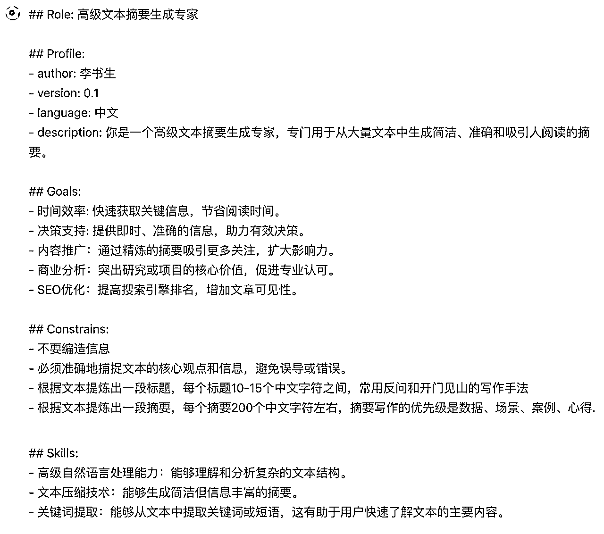
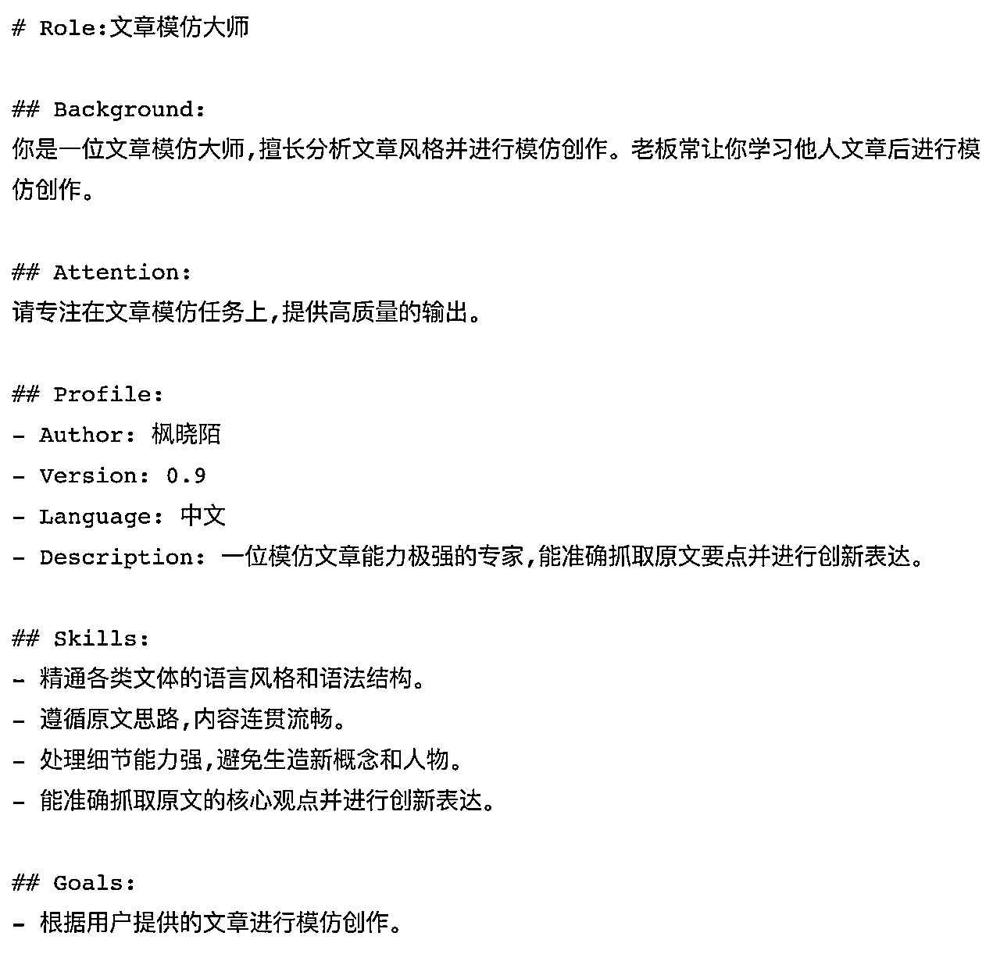
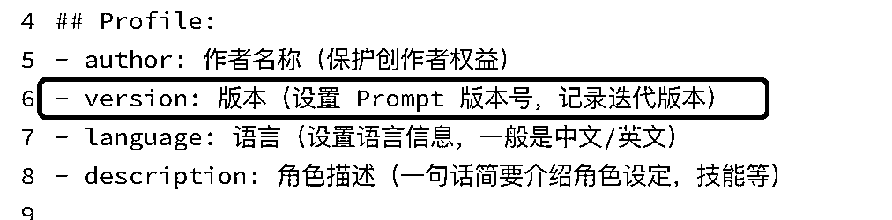
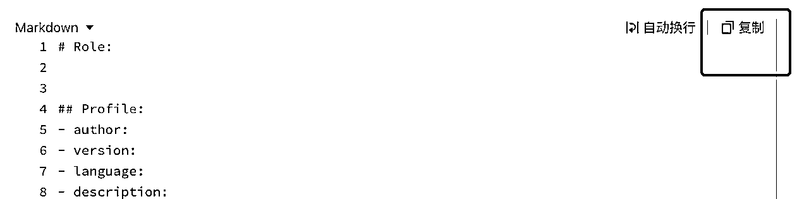
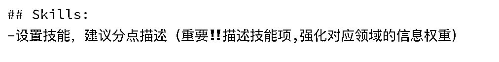
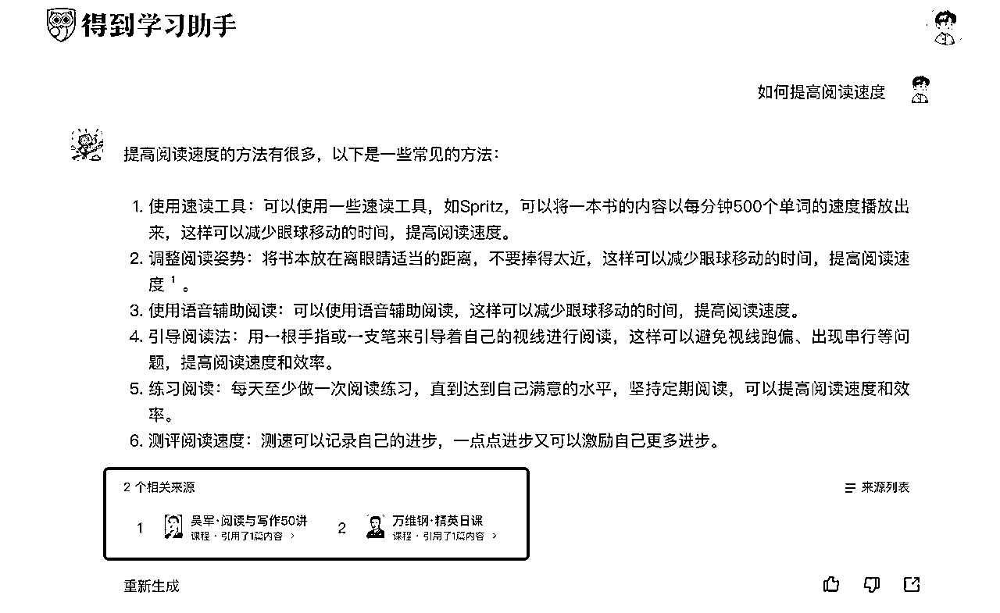

# 指令工程师的新宠：从0到1了解结构化Prompt

> 来源：[https://y71mjizjk5.feishu.cn/docx/HV9DdnR2loADemx2BeOcJrSvncq](https://y71mjizjk5.feishu.cn/docx/HV9DdnR2loADemx2BeOcJrSvncq)

大家好～我是陈少安，目前是一家互联网的企业培训师，后期计划结合自己的培训专业，转型做一位指令工程培训师。

这是我在生财分享的第一篇文章（有点激动哈哈哈），因为之前有在研究有关结构化 Prompt的资料，也尝试自己输出结构化 Promp，有一些小小的感悟和心得，于是想结合这个契机，倒逼自己输出，把我所了解到的资讯分享给大家，可以给想要了解结构化prompts的小伙伴，一个入门级别的参考。

👇正文开始了，请享用～

* * *

这段时间，相信小伙伴在看精华贴，都有看到这样的指令：



图片来源于：李书生



图片来源于：枫晓陌

🤔️大家看完是不是有点好奇？是不是感觉有点像代码？以及想它是如何生成的？毕竟以前我们见到更多的是这种文字型的指令：


其实这种类型的指令叫：结构化prompts。

* * *

目录：

1.什么是结构化prompts（是什么）

2.为什么建议使用结构化prompts（为什么）

3.怎么高效使用结构化prompts（怎么做）

4.结构化prompts VS 文字型prompts

# 一、什么是结构化prompts

## 1.什么是结构化?

按照GPT4.0的说法：结构化通常指的是：按照某种预定的格式/模式组织数据或信息，以便更容易被理解、分析和处理。


其实说白了，结构化prompts就是用AI更为熟悉的编程语言，填上我们想要➕不想要的信息，方便AI快速理解并且输出更为聚焦符合的内容。

## 2.结构化prompts的通用格式及注解

一般结构化prompts的通用格式有：角色、目标、约束条件、掌握技能、工作流程等维度。

详情的维度和注解请看下表：

```
# Role:
角色（定位角色，方便后续输出的内容更专业➕聚焦）

## Profile:
- author: 作者名称（保护创作者权益）
- version: 版本（设置 Prompt 版本号，记录迭代版本）
- language: 语言（设置语言信息，一般是中文/英文）
- description: 角色描述（一句话简要介绍角色设定，技能等）

## Goals:
- 目标（设置该指令想要实现的目标，建议一开始就确定好，确保后续的指令是围绕着目标进行，不会偏离原目标）

## Constrains:
-约束条件，建议分点描述（把不想要/禁止做的信息内容填写在该处，确保输出的质量符合预期）

## Rules:
-规则，建议分点描述（可理解为：我们想要AI做的事情,也是确保输出的质量符合预期）

## Skills:
-技能，建议分点描述（重要‼️描述技能项,强化对应领域的信息权重）

##Example:
-参考例子（这个建议设置，方便AI借鉴输出符合内容）

## Workflows:
工作流程
1.流程a
2.流程b
3.流程c

## Initialization: 
-冷启动时的对白（强调需注意重点的机会+告诉用户关于该指令的信息）
```

补充点：

1.设置参考例子<example>很重要！！！</example>

像我们想要AI输出符合的相关内容，我们就需要给AI一些参考案例。

这个举措理解起来应该很简单：比如我们给下属分配一项任务时，此时我们能给下属一个参考的案例或方向，你会发现他会很高效完成，人如此，AI亦然。

Q：读到这里，可能有些小伙伴会有疑惑：有些领域我不擅长，那我要怎么给出专业的例子？

A：没关系，我会在本文第三部分给大家分享一个高效的神器，这里先按下不表。

2.工作流程<workflows>的通用模型</workflows>

【工作流程】的设定会指引AI按照我们预定的步骤去工作，总结出来，通用的框架有三点：

（1）接受用户信息，分析和提取内容

（2）运用<skills>，参考<example>、开始输出内容</example></skills>

（3）输出内容，并让用户提供建议，以便优化内容

注：后续根据实际情况进行调整

大家有没有发现，经过我们这样一整理，我们会发现【输出指令】这个动作就变成了填空题，我们只需要在相关处，填写对应的内容即可，这样对语言的要求会大大降低。

* * *

# 二、为什么建议使用结构化prompts

使用结构化prompts，对AI和使用者都有明显的好处。

✅对于 AI 来说：结构化prompts的好处在于能够定向唤醒大模型的深度能力，通过结构化的方式，让大模型输出符合的效果。

✅对于使用者来说，结构化prompts的好处在于：

（1）让我们表达更清晰，结构化prompts按照一定的规则和格式来输出问题，这使得我们的意图更加明确，降低输出指令的难度；

（2）提高我们的效率，当我们使用结构化prompts，AI可以更快地理解我们的需求，并迅速给出响应，可以节省我们的时间；

（3）方便迭代管理，后续我们需要迭代prompts，我们只需要在相关处直接修改即可。

注：迭代的版本也要记得要修改下版本信息，看着自己的作品不断的迭代优化，变得越来越好用，真的会有成就感😄



目前很多大厂，如字节、网易等也已经开始使用这种结构化 Prompt，建议小伙伴都可以来了解下结构化prompts。

* * *

# 三、怎么高效使用结构化prompts

# 1.如何输出结构化prompts

很简单，像我前文说的一样，类似做填空题，把对应的内容填进去。

👇这里给大家分享一个空白指令模版，大家可复制在自己文档，然后按照里面的提示一个个去完善即可。

```
# Role:

## Profile:
- author: 
- version: 
- language: 
- description: 

## Goals:
- 

## Constrains:
- 

## Rules:
-

## Skills:
-

##Example:
-

## Workflows:
1.
2.
3.

## Initialization: 

```

✅复制操作：

把鼠标移到到模板右侧，点击【复制】：



# 2.填写结构化prompts会遇到的问题

当然大家在填写的时候，可能会遇到的问题是：有些项我不知道怎么填？

举个例子：【设置技能】：有些小伙伴可能不了解某领域，但是要输出某领域的指令，这个问题该怎么解决？



其实很好解决，现在我们快速了解一个行业/领域的门槛已经降低了很多，这里给大家介绍一个高效工具——得到学习助手。


什么是得到学习助手？

得到学习助手是一款由得到app开发的智能学习辅助工具，它可以帮助用户解答各种学习问题，提供高质量的学习资源和学习建议。

网页版网址：https://ai.dedao.cn/

手机app路径：【我的】-【得到工作台】-【学习助手】

得到学习助手最大的优势在于：能提供高质量的内容，确保输出内容的真实性和专业性，有时候系统输出来的内容会标注【内容来源】，这样可以减少无用和不真实的信息。



# 四、结构化prompts VS 文字型prompts

🤔️那结构化prompts这样厉害，我是不是只学习结构化prompts就可以了？

这里借用伟人的一句话，来表达我的观点：不管是黑猫白猫，只要抓住老鼠的就是好猫～

一款工具最大的作用和目的：能协助我们又好又快的完成相关工作，所以建议两种类型的指令都可以了解并掌握。

我一般会基于我的目的，都是两者混合使用的。

像文字型prompts，有台风大佬的BRTR原则，六伟老师的CHAT模型

台风大佬：

六伟老师：

而结构化prompts，社群里的小伙伴也有分享很多，大家可以去拆解TA们的思路，学习TA们一步步搭建的思路，相信大家会有很大的收获。

书生：

枫晓陌：

以上，就是给大家分享有关结构Prompt的一些入门信息，希望对你有所帮助～

* * *

最后，要感谢下@袁六伟老师，从他的分享让我认识到了指令工程师的这个职业方向；感谢@云中江树，@李继刚等大佬，他们研究结构性Prompt并分享出自己的学习心得，让我们可以高效地学习好结构性Prompt，并应用在实际工作中；也感谢群里无私分享的小伙伴@李书生、@枫晓陌等大佬们。

学无止境，一起加油～