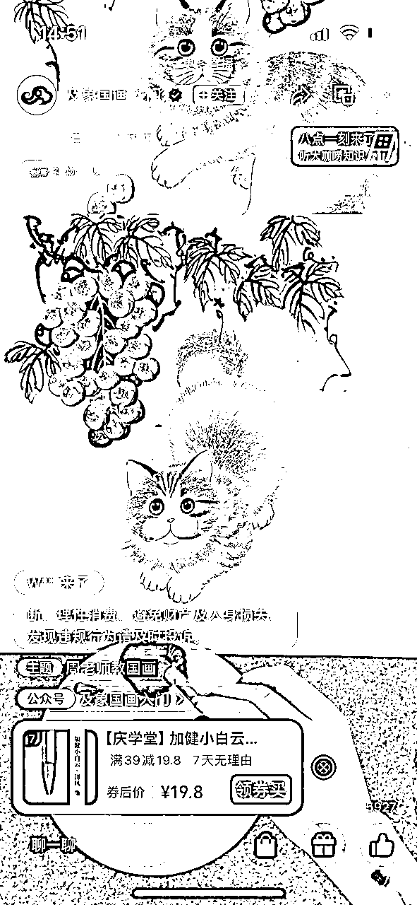

# 如何从0-1起号1年变现800万，知识博主流量➡变现闭环系统

> 来源：[https://b16xnqwk20.feishu.cn/docx/Hge9dTZsTour1Txz7eJcy749nsg](https://b16xnqwk20.feishu.cn/docx/Hge9dTZsTour1Txz7eJcy749nsg)

全文4200字

推荐用时：4min

首先很感谢大家支持，有机会能在生财分享，我是宋老师（账号：宋老师帮你做课）

目前是全网做课卖课赛道头部，年变现800万+，5000多学员中200多位变现100万+。

而这一年我所做出的成绩，其实都是靠一套我跑通的知识博主流量➡变现闭环系统。

这套系统的打法，也是我今天要分享的主要内容。

很多抖音、小红书做知识付费的小伙伴可能知道我，再简短的自我介绍一下，便于大家快速知道我的价值：

我的四个标签：

1.目前自媒体头部的做课&卖课博主→流量能力

2.原来的新东方总监，最高记录同步管理80w学生社群→教学能力

3.6000多位知识博主的老师→成绩

4.很多百万博主背后做课的男人

今天我想要分享的这套知识博主流量➡变现闭环系统有几个优点：

1.IP工作轻。

不直播，批量产出视频，解放IP。IP有更多时间研究内容，开拓新市场；

2.变现标准化、自动化。

流量、转化、社群运营、私域运营全套SOP，打造自动化高卖课高复购变现系统；

3.全套系统可复制。

这点最重要。就是这套打法，我们也成功在几千位学员身上做到了复制，并且帮他们拿到了很好的结果。

今天的分享本来是我线下闭门会的付费内容。

不过作为曾经的新东方教育人，让更多老师的知识更值钱，也一直是我的执念。

加上自己也在生财学到太多干货，结交太多大佬。

所以今天，还是毅然决定把这些真正有价值的干货分享出来，希望能帮助更多老师。

时间关系，今天先和大家分享几个拿到就能直接用的实操关键点。

以后我会逐步更新，分环节把整个系统和大家分享。需要的老师可以持续关注

今天的分享分为以下几个板块：

#### 1.低粉爆款+AI 3天起号

（大数据爆款爬取+AI批量输出文案+如何用8000抖加撬动800万收入）

#### 2.钩子打法100个粉丝开始变现

（导流钩子+30%高转化率sop拆解）

#### 3.23年几个不起眼但能卖100万的赛道

# 一、低粉爆款+AI批量输出文案 3天起号

不管是还没起号的新手老师或者已经拿到结果的知识博主，流量焦虑都是永远的心魔

尤其是在抖音平台已经进入流量平台的今天，很多头部博主的流量都已经有了下滑趋势

而就在这一片红海中

我自己的新账号，7月26日起号，第3天开始卖课变现，目前每天稳定卖课2000＋

同样打法复制的十几个账号，变相周期最长10天

为什么我能这么快跑通流量➡变现的闭环？

其实就是靠一套低粉爆款选题+AI文案矩阵打法

先说下这套打法原理：

抖音目前8亿日活，其中近一半的创作者

小红书也有2亿创作者

可以说目前所有能爆的选题，都已经有人拍过了

那我们不管是想要从新起号或者想要实现流量突破，

最简单最省力的方法就是批量输出这些爆款选题内容

尤其是低粉爆款选题

用被数据验证过的低粉爆款选题保证高爆款概率，在高爆款概率基础上AI批量输出文案，打破流量层级

比如天耀老师，小红书1.2万粉丝。关于AI神器的选题，接连出两个大爆款

我写的知识博主AI神器的选题，同样也成了5700赞的爆款

那首先到底什么是低粉爆款？

### a.什么是低粉爆款选题？

现在各位老师都已经被各种抖音培训课洗过不止一遍

可如果较真说概念，到底什么是低粉爆款选题，真的没几个人能说对

有的甚至认为点赞最少也得1000以上才算是爆款

这在泛娱乐赛道是对的

但在知识付费赛道真的大错特错

对很多知识付费赛道，200赞已经可以算是爆款选题

而一条200赞的视频，就能给你带来上万的收入

#### 两类低粉爆款选题

第一类：博主低粉丝量，某选题视频数据远超同量级博主

第二类：某选题视频数据远好于博主其他视频

举例1：5000粉丝，小红书一般视频数据20点赞左右。

但成斌老师三条身心灵选题视频连爆破百赞⬇

举例2：鹿大米老师视频一般几十赞

读书博主选题的视频大爆9600个赞，而且多矩阵号都爆，典型的低粉爆款选题

这样的选题如果你写不爆，大概率是你的文案、封面、剪辑有各种各样的问题

一定像素级拆解学习

### b.一分钟找100个低粉爆款选题

知道了到底什么是低粉爆款选题,

那怎么批量找出大量低粉爆款选题？

你当然可以人工花几天刷遍同行几千个视频

不过今天介绍一个数据爬取神器和数据处理黑科技

教你一分钟找100个低粉爆款选题

直接上实操，以小红书为例：

#### 下载安装数据采集神器

（下载链接：https://www.houyicaiji.com/）

安装好后如图：

#### 数据采集

打开手机端小红书，搜索赛道关键词，

在视频最下方tag里找到关键词

比如#知识付费

复制链接

粘贴到采集器采集数据

结果可以看到有该选题下所有视频的标题、链接、封面、点赞等数据

结果展示

#### 深度采集

如果使用深度采集功能

还可以直接采集到博主粉丝数和视频的发布日期

不过这个有点复杂，全写出来太长了

想深入学的可以自己搜一下教学或者找我拿个教学视频

#### 数据处理

最后进行数据处理，就能轻松看到某个选题下所有近期低粉爆款选题

详细操作看图

我自己用这套方法，就是一天集中完成10个账号一周的内容，彻底把自己解放出来。

### c.AI批量输出文案

有了选题怎么批量输出文案

再好的写手也有枯竭的时候，但是AI却能做到随时输出，而且永久持续输出

不管你是要直接让AI按选题输出文案，还是仿写爆款文案，或者按你的文案风格改写爆款

几个指令就能解决你所有文案问题

具体的各位老师可以看我写的《AI文案爆款宝典》，有详细的教学

使用的时候直接复制里面的指令即可

#### 自动仿写爆款文案

选定爆款文案后直接让gpt仿写文案

#### 爆款文案改写本人风格

将别人的爆款文案按照自己的文案风格改写

#### 矩阵文案批量改写

### d.实战抖加投放教学

我大号10万粉丝，只投了不到8000块，撬动了800万的收入

正确的投放能给你带来1000倍收益

怎么正确的投放

我用的是一套30-100-500投放法则

每天自然+投放

保底80+精准微信线索

那具体怎么投

按照我们的经验，抖音真不用养号，发视频直接投就行

每个视频投放100，选择对标，点赞评

之后需要进行实时数据监测

投放跑完30元后，如果投放数据可以达到粉丝转化1:1,点赞转化1：2-3（对应数据要看赛道）

也就是视频既有流量能力又有转粉能力，则可以继续跑完剩下的70

如果数据依然在标准线，则可以再次投放100，对标，点赞评

如果转粉、点赞还能达到之前80%的标准线，

直接追投500粉丝

有了这一个爆款的撬动，你的账号基本就可以成功起号了

由于我们的内容都是有爆款潜力

5-7条视频应该可以起一条爆款

测算综合成本，用这套投放逻辑，单账号起号花费会在1300-1700

而知识付费赛道一条百万播放视频带来的短期收益，最少也在2-3万

正确投放真的可以让你百倍收益

# 二、钩子打法100个粉丝开始变现

我从第66个粉丝开始卖课变现

不开直播只用短视频，一年变现近8位数，就是用这套钩子打法

这套打法分两部分：

钩子引流+高转化SOP变现

### a.导流钩子自动加好友

我每天早上一醒，第一件事就是先通过微信好友申请

同时抖音后台每天也还有至少120个微信等我去添加

就是靠导流钩子

【线索版图片】

#### 什么是钩子？

说穿了很简单，能把粉丝勾到私域的利益点就是钩子

你的资料、入门课、10分钟的小咨询，都可以变成钩子

比如我就有一个钩子库，里面几十个钩子文件

就靠这些资料钩子我才能卖课800万

#### 怎么下钩子？

下钩子要全方位的下

主页介绍、文案、评论区

所有能埋钩子的地方都要放

但注意最近平台对导流行为审核越来越严格

所以下钩子一定也要隐晦一些

分享几个我一直在用的文案钩子：

还有不会的，可以看我的AI闪电做课秘籍

找不到的老师吱个声，直接拿就行

不会操作的老师，可以看这个详细教程

……

总之文案里下钩子一定要隐晦一些

另外钩子要下在文案的中间部分

因为首尾都容易被审核员发现，而被判违规

#### 怎么做钩子？

简单说几个做钩子的小技巧：

1.要有核心钩子，体现价值

你每个课程要有对应的核心钩子

内容应该是课程内容的40%，其中有10%的核心内容

比如我的闪电做课营的钩子

就透露了一些核心的AI做课指令，才能体现你内容的价值

2.做好导流内容

微信水印、二维码、导流话术，文件里面该安排的全安排上

3.做好防盗

不止课程有盗版，偷你钩子的人也很多

钩子一定做pdf格式

文件密码、编辑密码、水印也都安排上

4.非核心钩子不要提前做

做钩子其实还是要花一些时间的

所以先写文案、发视频

来要钩子的人多，再做资料也来的及

钩子的部分，不做过多赘述了，详细制作流程可以参考这篇分享

《用【钩子打法】1年引流30000私域粉，卖课300w是什么体验！（附钩子制作全流程）》

### b.30%高转化率SOP

流量有了，私域人也加了

终于到了最关键的转化变现的环节

加了粉丝不会聊，要不人家根本不回，要不就是几句话就把天聊死

这是很多老师的核心痛点

我们能做到30%的转化率。核心就是靠一套标准转化SOP

从第一句说什么到1分钟判断需求、如何5分钟内成交

每句话每个问题怎么回答，我们都有标准答案

#### 加粉第一句话说什么能卖课

做转化，第一句话是关键

他决定你们后续对话能不能顺利进行

所以破冰话术一定要打磨

我们的破冰现在有一整套逻辑：

第一步--建立信任

简短一些，说明白自己核心标签，少就是多

他们都是从各个平台加到你，可能看的是大号，也可能是几千粉丝的小号

所以人设还是要包装

“我是宋老师，全网做大知识付费做课卖课博主，头部教育公司总监”

第二部--给福利

这里福利其实就是刚才钩子部分

注意这里钩子可以设置一个密码

想看的人自然会和你要密码，密码都不要，意向不会太高

这是第一次意向筛选

而且“拿人手短”，拿了你的资料，自然好继续对话

第三--跟进回复

这里要是一个很简单的小问题

用问句打开回复，这里是你们对话的开始

比如我最常问的就是：你是做什么课程

这里注意能用语音就用语音，更有利于信任建立和亲切感塑造

那破冰之后怎么5分钟卖课

我之前有详细的做过私域内容的分享

大家可以移步精华帖：

《30天私域卖课60w是什么样的体验？》

这里就不赘述了

# 三、23年几个不起眼但能卖100万的赛道

最后流量和变现已经全部跑通

但赛道才是真正决定你变现的天花板

这一年我最大的感受就是选择真的大于努力

所以最后和大家分享几个不起眼但是卖课轻松超百万的案例

所有的案例都是我营里的学员

希望他们能对大家有所启发

#### 实体小微店铺运营教学

这类赛道人群小而精

做的多是“老板粉”，优势是相对于一般人群有着更好的付费能力

同时结合本地团购直播开展，双线并行

不但可以引流到店服务，还能通过知识付费课程引流同行，赋能同业

#### 生活经验类课程

这类课程永远是最适合普通人做的赛道

优点是课程制作简单没有门槛

但同样变现能力相对较低、天花板低

尤其适合作为副业操作

#### 视频号银发赛道

视频号作为今年的流量风口

银发赛道一定是今年最有变现潜力的赛道

目前引发赛道的视频号打法普遍是素材混剪+矩阵分发+多账号直播导流+群转

基本单账号产出目前可以到达五位数

这里就不方便讲太多了，大家有兴趣可以研究下

绝对是今年的黄金赛道

# 写在最后

好了，今天的分享就到这，无论你是企业老板还是个人博主，

其实我觉得知识付费都是一门极低成本，极高收入的好事

这个行业的利润在75%以上

老板可以做课程，输出你的产品或者管理思维，用课来征服合作伙伴

个人博主可以做课程增加收入，提高粉丝粘性和后端合作

每一个有长远发展的IP，一定离不开一个自动赚钱的【知识博主流量➡变现闭环系统】

未来写书的人会越来越少，做课的人会越来越多，同样是社交名片，动态的会比静态的前景更大。

希望大家，2023，做课生财，感谢各位老师。

我是宋老师，23年帮助500位老师卖课50w，欢迎和我一起做课生财！