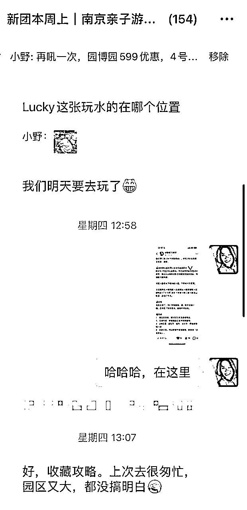
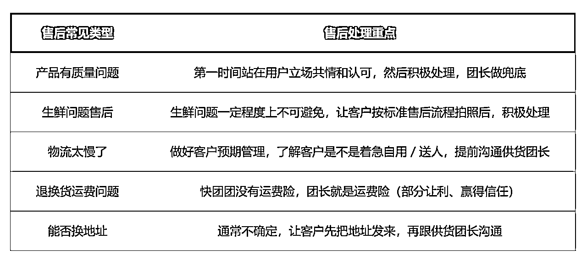

# 150 万 GMV 职场宝妈团长悟到的，新手做团购最重要的5件事

> 来源：[https://mx7hw2ql0k9.feishu.cn/docx/IQyfdJ47yogHqoxA2dPcau7BnNe](https://mx7hw2ql0k9.feishu.cn/docx/IQyfdJ47yogHqoxA2dPcau7BnNe)

我是小野，一个靠卖包浆豆腐做团购做到 150w GMV的职场宝妈团长。

今年3月和7月分别在生财有术里发过2次文章，详细分享过我的团购成长经历：

https://articles.zsxq.com/id_0ojpkedc4w0c.html

https://articles.zsxq.com/id_2thgald6oees.html

这一次，我想要分享下，在我做到150w GMV并且踩了很多坑和弯路后才悟到的，新手做团购最重要的5件事。

# 一、底层逻辑：好物分享，一声姐妹走天下

很多人有个误区，简单地认为，团购只要在社群里给用户发链接，就可以赚钱。

当下这个越来越卷的时代里，发链接和图文素材当然是远远不够的。

作为新手启动团购，要知道团购赚钱的底层逻辑是，做一个私域里的好物分享者，然后一边分享、一边赚钱。分享欲，是最高级的浪漫，也是最好的赚钱方式之一。

举个例子。可能你在电商平台或电视广告看到一个防晒霜的广告，它可能会这样跟你描述：三大防晒黑科技，三重防护、高倍晒、SPF50、无惧黑势力。

你一看就觉得是非常机械的卖点输出，对吧？强烈跟我推销这个东西，告诉我产品很好。但如果是你的好朋友/闺蜜给你推荐这款防晒霜，她会这样跟你说：亲爱的，我最近发现一款防晒霜特别好用，很水润，一点都不油腻，防晒指数还有50，而且啊，重点是它涂出来不会假白，你不是上次问我有没有好用的防晒吗，你试试看这个。

当听到你闺蜜这样介绍，你可能会想说，她用过都说好，要不我去下单试试？

发现了吗？这就是一个自用并且去分享的一个力量，作为用户的「闺蜜」，从让她从了解到心动，从被种草到去下单。这也正是星宇教练曾在航海里说的，「女性在私域有天然的优势，一声姐妹走天下」。

这个时代是表达者和分享者的红利。开始启动你在私域的自用分享、种草和表达吧，去占领你微信好友的种草生态位。

# 二、团长角色：打造定位清晰的个人 IP

团长是一个人，不是一个链接转发机器，因此团长要有清晰定位和个人IP。

当你做好一个团长IP，有了明确定位和个人IP，就可以根据定位来选品、来提供服务和价值（正所谓内容），用选品和附加价值来吸引人，选对了品，换来的流量也就是精准的。

那么，怎么做好团长IP呢？

## 1、做好团购定位

我用同一个微信号，同时运营了2个快团团购主页，因为面向的目标人群不同，所以我是分开运营的。

美食团的定位是，一个爱吃和会吃的团长，给中产家庭提供有品质、中高端的云南及全国特色美食。

美食团我主要通过社群和朋友圈运营，毕竟属于吃货的群体更广泛，需求更大众，所以我是会发朋友圈的。

母婴团的定位是，一个要给孩子严选好物的新手妈妈，给同样想给宝宝最好、但也要追求性价比省钱的妈妈们，提供 0 ～ 3 岁关于宝宝的一切好物选品。

这个团通过社群运营，平时几乎不发朋友圈。因为宝妈好友在我微信好友里占比不是全部，并不精准，所以我从来不发，而是把用户放在社群里，有针对地运营。

所以在开团之前，先做好定位。筛选大于教育，所有行业品牌营销的第一步都离不开定位，可以说定位定生死。

什么是定位？定位就是可以让别人能够第一时间记住你，信任你，想起来想要某样东西的时候，就知道可以找你的一句话。

我总结了一个定位公式，你的身份或者你的成绩是什么，你能够为谁解决什么样的问题，或者是提供什么样的价值。

只要你把这句话给描述清楚了，那么你的定位基本就清楚了。

## 2、私域里全方位展示自己 IP

不仅仅做公域账号需要个人IP，做私域也是。

作为团长，是需要在微信私域里全方位展示自己的，通过平时朋友圈和社群运营，你要让用户知道你是谁、你有什么擅长的背景/经验/技能、你有什么兴趣爱好、你的价值观是什么、你每天在用的团品有哪些……

这样做的好处是降低用户了解你的成本，让用户喜欢你，然后愿意为你付费。你展示自己维度越多、越丰富、越有趣，客户了解你的成本才会越低，对你的信任也就会更高。

借用生财拉新第一名梁靠谱的话来说，就是：如果你连自己都不能拿出来卖，还能卖什么呢。

# 三、快速起盘：单品快闪

回顾过去2年，我运营了3个不同定位的团购社群，每次起盘，其实都是靠几个单品快闪实现的。

## 1、吃货群：开团云南名小吃包浆豆腐，1个月卖200单，迈出团长第一步

最早我是从包浆豆腐开始做团购，这个单品1个月不到团了200多单，后来也成为我团里的小爆品。具体历程7月发帖讲过《作为职场宝妈兼团购团长，我是如何从卖小小的包浆豆腐开始，做到团购营业额100w+的？》https://wx.zsxq.com/dweb2/index/topic_detail/214444582428841，这篇帖子里就不再重复了。

## 2、母婴好物群：开团布书、奶嘴等刚需玩具，成为妈妈们的好物选品官

母婴好物团购群建立后，我看准了当时群里宝妈们孩子都还在2个月左右，我开了布书、奶嘴等玩具刚需团，作为最早母婴团购群的起盘。

刚开始我没有直接发链接。首先，我先分享了自用感受，然后，告诉宝妈们这个月龄孩子必入这几个玩具，布书对于孩子对颜色、触感、练习抬头等发育都很有好处，再给到一个相对有竞争力的价格。接着，以群内接龙的方式开团，每个人都接龙，其他看到更有从众效应，于是也纷纷接龙（太早了，截图找不到了）。

这时候，宝妈们就继续问我有没有其他玩具，同时也会拉其他人进群。宝妈们在群里表达她们的购物需求，我就负责去找选品满足她们，慢慢地，这个群就做起来了。

## 3、亲子游群：亲子酒店团购 7 天快闪 6万 GMV、利润 8000

我通过一个酒店单品快闪团，第一次开团3天、第二次开团4天，利润近8000，还拉起了一个200人+的亲子游团购群。

这是最近的一次实践，我来详细说说。

我之前从小红书上发了亲子游笔记，就有第三方平台找到我，有个南京园博园酒店的优惠折扣团长活动，我发了一篇相关小红书笔记，可是发了一个月都没火哈哈哈，于是我就没开团。

8月有一天，突然有人在小红书上咨询我，这个酒店优惠怎么买？于是我就开了个团，拉了个闪购群，发了圈。

因为这款团购产品价格政策非常给力，算是3岁左右这个年龄段家庭遛娃的刚需，所以3天时间拉了个80多人的群，第一次开团成交了80单。

活动结束后，我想着不能浪费这个流量呀！对不对。于是把群升级成了「南京亲子游优惠群」，未来可能还会有其他的优惠酒店、项目或者儿童话剧出来，就可以去满足这群人的带娃出行需求。

发了这条朋友圈以后，这个群从88人，到111人。

后来这个团快要结束下架了，还有很多人来问，这个团还有没有？正好配合品牌方政策，100单以后有额外的佣金奖励，于是我就想说再开一次团吧。

最后，这次酒店亲子游团，以 104 单收官，累计 7 天时间，6万 GMV、利润 8000。

通过几次团购群的起盘，我意识到，这样的玩法应该挺适合大多数普通人。

用一款契合用户需求的刚需产品，直接做单品秒杀群，秒杀结束后直接升级为你的团购群，这样就可以实现从零开始破冰，快速拉起一个属于你自己的群。你只要在其中扮演好一个尽心、负责的团长角色就可以，还可以提高你在好友里的信任、口碑和个人势能。

那么如何选择适合快闪的单品？我总结了这几个特点：

（1）品类稀缺：有地域或产品渠道稀缺性的品类，比如云南包浆豆腐，无论是2021年、还是放在现在，我认为都是一个相对比较小众的品类，口碑足够好、也很有猎奇性，是会吸引到很多用户群体的。

（2）价格稀缺：应季且受大众欢迎的生鲜水果，例如猕猴桃/大闸蟹/梭子蟹/松茸等，这些应季产品用户都想吃，在产品品质保证的前提下，给出有市场竞争力的价格，是可以快速吸引到用户的。

（3）价值稀缺：产品提供给用户的价值是独一无二的，产品本身就足够筛选和吸引到精准用户，比如，我这次开团的洲际温泉亲子酒店，是南京园博园仅有7个酒店里的其中1个，如果要去园博园玩，选择本来就不多，产品本身足够有价值、加上给力的价格政策，非常有吸引力。

单品快闪团这个玩法真的无敌好用，非常值得你们试试，快用起来～

# 四、流量来源：微信私域

不管做什么业务，引流永远是不可或缺的部分。而团购社群的流量，我认为是可以循序渐进的。先从现有微信好友里招募进群，再让源源不断的更多人，来到你的微信私域里。

## 1、泛流量

由于团购品类主打生活、美食比较多，如果你刚开始没有精准流量，泛流量也不错啊，大家都需要吃喝玩乐、都需要生活买买买（当然具体选品可以再垂直定位）。

其实2021年正式开始做微信私域变现之前，我有4000左右微信好友，也是过去几年累积的。我一直清醒地知道，未来微信私域是一定可以变现的，虽然不知道是什么时候，但我一定要持续地加很多很多微信好友，不放过任何一个增加好友的机会。

后来，给我卖衣服的小姐姐成了我美食群里的常客、给我办居住证的派出所大哥也进了我的亲子游群、我过去工作上认识的医药同行大佬成了我vip客户和转介绍中心。

总之，要充分利用生活里各种场景，让更多人成为你的好友。

## 2、精准引流

如果你的定位比较垂直和细分，那一定要去公域平台、社群或者线下人群聚集的圈子精准引流。

比如母婴群，是基于我从小红书和妈妈交流社群引流来的宝妈群体拉起来的，妈妈们也可以去线下宝妈聚集的地方引流，比如月子中心、瑜伽馆、健身房、孩子学校等，以认识交流为由，先加到微信里来。

比如做大学生生意，你微信里不能一个大学生都没有对吧，你如果也是学生，可以加校友、从学校论坛/群或者学校线下活动等去引流，甚至自己做一个为同学服务的公众号或社群。

具体从公域平台（小红书、公众号）、从社群（无论自建主题群还是混群）引流，最近正在进行的快团团航海手册里有非常详细的操作步骤，直达链接：https://search01.shengcaiyoushu.com/docx/BZU8dQYYTobYewxPZWZcOs9cncf

## 3、邀请好友进群

通过上述方法，把好友加到微信后，你才有机会去转化他们，可以通过朋友圈或初次认识时就邀请进群。我总结了几种邀请好友进群的玩法：

（1）社群招募

刚开始建立社群时，一定要通过发朋友圈及社群运营来招募，不要害怕没人来，你发了试试就知道了。具体社群招募可以分为这几种：

A.建群前的好友标签准备（精准分组可见）-写群公告-群介绍-发朋友圈

B.精准人群一对一私聊邀请

C.自建主题交流的联动转化

D.用户群裂变

E.评论区运营

这里要特别补充说明的是，社群二维码发朋友圈的招募，千万不要只发一次，因为只发一次，很多人会看不到的。你们想，线下实体店开业，还要放上花篮好几天来吸引客户呢，对吧。

另外，如果只发一次朋友圈，刚开始很多人会观望，他并不知道进群可以获得什么。所以，社群招募二维码是可以多发几次，不过每次发内容可以不同，把后续群里的获得感截图展现出来，吸引更多人进群。

（2）单品/限时秒杀招募

配合前面说到的单品秒杀活动，可以在快闪期间内连续发朋友圈，吸引精准人群进群。

这里举个例子：

（3）自我介绍时邀请进群

当你有了公域平台的流量来源，加好友时可以做自我介绍，这时候就是一个非常好的邀请好友进群的契机和触点。不用担心别人会拒绝你，这也是一个筛选的过程，我在发了很多自我介绍后，也有不少转化进群的人。

进群后，还可以设置一个限时新人券，就可以促进他在最感兴趣的时候，使用优惠券下单。

# 五、高复购秘诀：找到500～1000个铁杆粉丝

这是一个做私域永远有效的公式，找到你的500～1000个铁杆粉丝。

团购业务里，如果你有500个铁杆粉丝，假设每个月有 20% 用户下单跟团，客单价在100元，人均每月复购5次，营业额就是5万，按20%利润率计算，你每月就有1w元收入了。

这时候，你的运营目标就是如何提高用户量、每月下单人数、客单价以及人均复购次数，以此获得更高收入。而在这几个关键数据中，复购次数是最容易提高的指标之一。

那么如何提高用户复购？

## 1、做好售后

（1）道歉是沟通的开始。

当遇到客户有售后需求、要退货或者换货时，最重要的就是态度。

黄执中说过，道歉是沟通的开始。

我们一定要跟客户站在一起共情，优先道歉、不推诿。一个小技巧是，可以给每个客户建一个专属服务群（如果用2个微信号的话），以此增加客户服务的专属感。

（2）处理售后，做到专业

当客户提出售后，我们道歉以后，先不要慌，先确认这个团品是否可以退款。

通常来说，所有团品的退改逻辑和规则都是写在团购里面的，虽然但是，即使团文里有，客户是基本不会看的。这时候需要团长费心和专业地确认团品退改规则，然后耐心跟客户沟通。

除此之外，生鲜食品水果的售后规则和售后所需要的资料，是可以提前告知客户，有完整的材料，才能为客户争取更快速的售后处理结果。

（3）熟悉常见的售后类型

我总结了 5 个常见的售后类型以及售后处理重点，这张图可以保存，需要时查看，知道售后的重点与思路，这样就可以沉着应对啦！

售后保障好了，才可以让客户死心塌地在你社群里一直买买买，买得开心、也买得放心。

## 2、洞察用户需求

销售的本质是产品满足需求，团购也不例外。

以做母婴团购为例，我会通过平时跟宝妈闲聊，来了解她们小孩的性别、出生年月，然后在微信里备注好。

未来如果对方在群里问你有没有团品时，你才能够有针对性的给她推荐，而且也能体现出你的用心，毕竟你还记得孩子的这些信息，这一点是很给信任度加分的。

平时可以主动帮客户跟进团购订单信息，然后通过订单沟通多跟客户闲聊，以此了解他们的经济情况、家庭情况、工作情况，然后根据目标用户的需求和特点，做好相应备注信息记录，把用户需求融入到平时团购的选品中。

像我另外在做减脂，我会给每个咨询过的用户记录身高体重、饮食习惯、减肥史等信息，这是最基础的用户需求信息，也是未来定制化减脂方案的重要依据之一。

洞察用户需求这件事很有意思，跟孩子成长有关、跟四季节气变化有关、跟人性有关、跟感情有关……值得我们长期的反复刻意练习。

## 3、设置高复购福利

对于团购来说，我认为高复购客户的维护跟拓新客是同等重要的事，我总结了2个高复购福利客户的运营方法：

（1）利用快团团设置vip会员等级，让用户越团越省钱

（2）根据每月团购金额/次数，给予一定激励

当然，除了这些运营技巧外，做团购，最最最重要的就是真诚。每年年底可以给客户寄个小礼物或手写卡，也可以在自己测评到不好的团品时及时劝退团员。

总之，真诚是最大的套路，要凡事为客户考虑、跟客户站在一边。

# 写在最后

我一直认为，做团购不难，尤其对新手友好，品类很多，满足不同赛道的定位。

选品单价不高，可以最小程度试错，拿低客单价产品练手，起盘你的副业。几千元、上万元产品不好卖出去，几十几百元产品总能卖吧，让你面对不敢拉群、不敢发圈、不敢做生意等心魔，跨出第一步。

很多人觉得做团购最难的是引流，认为成本高、过于繁琐，甚至看不上团购低客单和低利润，但事实上，如果你可以把团购做好、1000个铁杆粉丝维护好，哪怕未来有一天你不做团购了，你也可以在私域里提供其他产品的服务和价值，这1000个铁杆粉丝会给你持续带来终身的价值。做好你的私域，未来价值百万。

其实做团购也并不简单。如何引流、如何定位、如何洞察用户需求痛点、如何运营社群、如何经营朋友圈、甚至如何销售，在生财里你随时可以找到方法、有技巧可以学习，只要你跟紧生财有术的船、跟上航海的航线，就可以赚到钱。愿你们出航无所畏惧、靠岸满载而归！