# 万物皆可剧本，快速复刻竞品优质直播间的复盘

> 来源：[https://kkehvdiodf.feishu.cn/docx/IvRMdAOWmoQzO3x1SD4ct8t5n5b](https://kkehvdiodf.feishu.cn/docx/IvRMdAOWmoQzO3x1SD4ct8t5n5b)

# 手播直播间快速复刻的复盘

## 复刻什么样的直播？

##### 跳过一应的繁琐操作，磁力智投推流直接拿结果，拿线索做私域，简单明了，说白了就是买流量，只要线索价格合理，就可以大量获客。

##### 而直播间投流本质上是属于内容投流，打造好最合适的内容（可以钩的住目标客户的直播脚本），然后拿买相对的人群包流量去过就好，内容适合人群包了，留下的人（转化率）自然就高了。

对，逻辑就是这么简单，下面我们讲细节怎么做。

#### 我们先讲讲快手投流的特殊性。

先讲一个知识点：

我们一直都忽略了快手这个磁力智投平台，可能是业绩压力，也可能其他原因，快手平台对付费流量相当的来者不拒，很多平台不能播的，快手可以播，很多平台不能投的快手可以投。

比如我们做的负债行业，比如异地社保，比如退税，甚至去年有播竞彩足球的，而且直接可以跳转加微。

今年很多行业不能直接跳转微信，就换成了留线索。

这些你在抖音的监管下，是不能想象的。

所以磁力智投近几年的特性，个人感觉更趋向于卖客户变现，平台压力也很大呀，你给钱，就可以来用你的方式来换获客。

下沉人群的刚需类或者伪刚需类，高客单低成本的咨询行业，或者高复购行业都有机会在快手做。

主打一个信息差+可包装类行业。

#### 如何搭建投流直播间。

##### 账号认证蓝V

首先是账号认证，在快手直播，很多行业是需要认证的，也算变相保护费。

这点和小红书很像，没有认证过的账号那是举步维艰啊，任何的违规，哪怕写错个字都不行。

认证过的账号只要不过分，平台都默许了，这点很重要。

##### 挂靠资质，挂上小铃铛，获得广告后台

<h8>PS：小铃铛类似抖音的小风车，可以挂上小程序组建，实现跳转微信，留电话线索，在线咨询等功能。</h8>

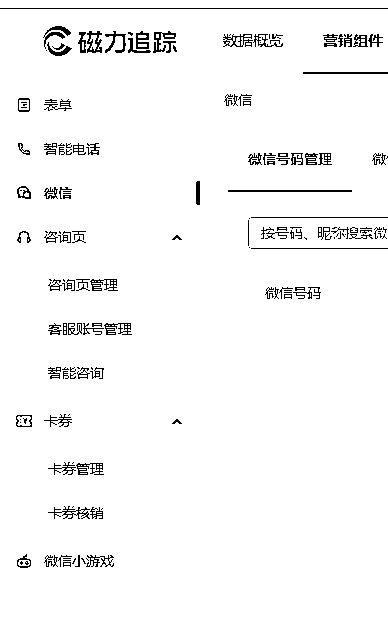

##### 新号0粉，想要挂上小铃铛组建，只能挂靠有资质的公司，然后他们给你开后台，你充值就可以了，这里就不细讲了，外面有很多服务商做这个，快手这块的服务商基本上都是河北的。

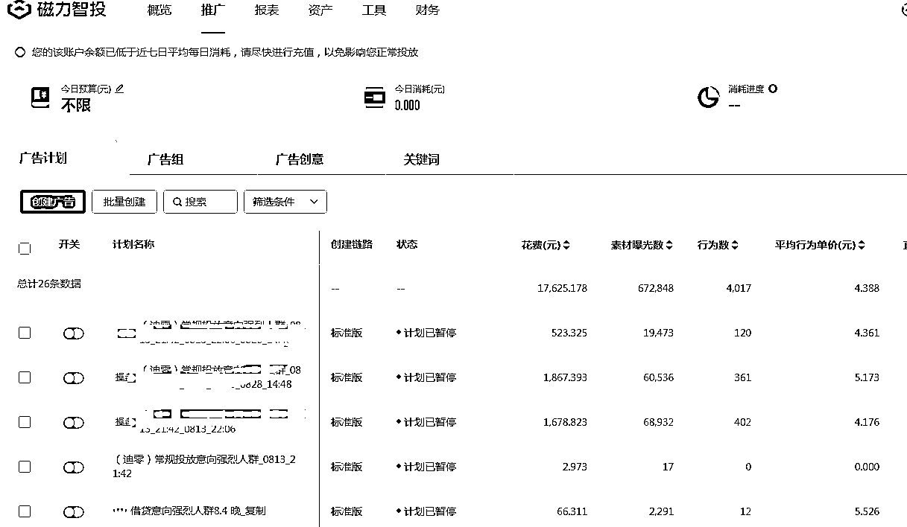

##### 小铃铛绑定，制作落地页对接运营等市场规则

拿到后台以后服务商会协助你做好小铃铛跳转，落地页等，如果你不会运营他们也会给你安排运营。

因为你冲值他们都有赚返点的，服务什么的都还好，跟小红书聚光一样，现在所有平台的代运营，都会给到你市场最新的投放方案，以及人群包搭建计划等。

不过运营要尽量自己跟，一味交给运营是会踩坑的。

我们可以通过他们尽快的了解行业信息，行业玩法和行业平均成本，毕竟他们可以最快拿到行业的基础信息。

具体广告计划搭建和运营，我后面会讲一些，不过，一个是我们这套做法对投放能力要求不高，还有就是咱们这篇核心讲的是复刻，关于广告投放方面内容，尽量不增加篇幅的前提下，讲到哪里是哪里。

市场价的话，如果是广告户，小铃铛是免费的，要求是5000起充（但是可以谈到2000），同时如果消耗不掉可以要求退款。

虽然可以要求2000起冲，但是如果确定自己可以消耗的掉，又没有资金压力的话，建议直接冲5000，这样你服务的对接的人提成拿到了，服务也就会上心了，咱们也没多花钱。

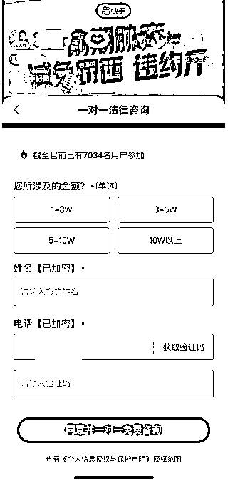

这样，一个用户点击小铃铛，就可以留微信或者电话的直播间就搭建好了。

流程也很简单，新账号直接蓝认证V600，挂靠资质，磁力智投，广告充值2000-5000起。

#### 这篇文章的重点，直播内容的制作 ，如何高效的复刻一套直播内容

其实所有想要去做直播获客的朋友，并不是因为不知道怎么投放，或者怎么花钱，而不去做，毕竟是花钱嘛，大把人等着教你。

最大的问题其实是，不知道怎么直播，怎么播才有效果，怎么播才能拿到结果。

这套方法是我摸索了几个月的经验总结，可以帮助很多懂行业，但是不懂这个行业怎么直播的老板们快速打造出一套属于自己的直播体系，和直播人才培养体系。

##### 找到对标竞对的“内容超级价值点”，扒拉有效素材

想办法提炼出对标同行直播过程中的“超级价值点”，可以是话术，也可以是问答，也可以是动作或者场景，更好的是以上这些的配合做出来的“内容”。

哪些内容可以抓住你多看一会？

哪些内容可以让目标属性的用户感兴趣？

哪些内容可以一起我也问一下的欲望？

哪些内容可以让观众按照你的意愿去操作直播间高价值动作，让直播数据飞起？

这些内容，没有一线做过直播的朋友一定都不知道怎么做，就算知道怎么做，也需要耗费大量的时间精力做试错。（凭什么你一下就能做出超级内容？）

而只要你对行业有基础的理解，知道什么内容好，什么内容不好，了解这个内容是在gat的用户的哪一个点。

然后用复刻的方式就能快速做出一场直播脚本。

我现在重新做一套完整脚本，大概只需要三天的时间，大概十几个小时的工作时间。

##### 物理复刻直播内容的细节流程操作。

如何物理复刻同行直播内容？

很多人去做学习别人直播间就是去死命看，一蹲俩小时，我开始也是这样，在同行直播间玩命看，奈何自己不是天才，没有过目忘的本事，看的时间觉得了然，关了直播又忘记了。

然后我想了一个办法，录下来，想暂停暂停，想倒退倒退，想怎么看就怎么看，按照这个方法，效率不止翻三倍。

准备工具：

录屏工具，我这里用EV录屏。

剪辑工具，推荐剪映。

闲置电脑一台。

第一步: 超级简单。

找到你认为播的最好的竞对直播间，分享直播间到微信，然后电脑打开链接，开始录屏就好，2-3个小时回来看看下播没就好。

这里要注意分享后很多时间是默认静音的，记得调整，不要问我为什么知道。

另外还有一个小技巧，分享后看到的是竞对这场直播到现在的观看人数，这里可以推测出很多数据。

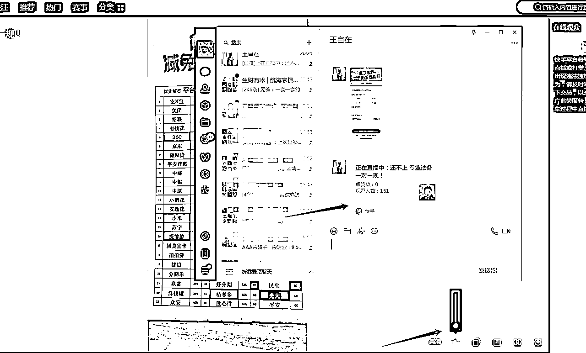

第二步：剪辑，分离字幕和视频，拿到完整的直播稿。

把录好的视频导入剪映剪辑。

录屏一般都比较长，分割成一小时左右一个，不然比较卡，然后识别字幕导出，导出这里记得两点。

一个是记得要连字幕文本一起导出。

一个是导出的时间选最小的清晰度，不然一个视频稿一个小时,很浪费时间。

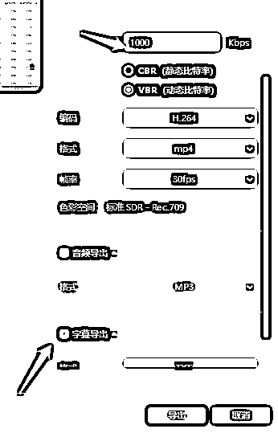

最终获得一个有字幕录像视频+一套文字字幕。

这里开始准备工作完成，下面开始是重点。

##### 如何用可复制的办法提炼出高价值的话术，撑起整场直播？

提炼多套话术，作为自己的填充自己直播的直播素材的流程

###### 先看一遍，把整场直播有价值的地方全部提炼出来。

我的方法是，第一遍只看，为了节省升价我开1.5倍速，感觉这段是有用话术就对照文字，并且做好记录，然后跳过这一段，然后继续看，继续备注。

下面这是我一遍看，一边整理做记录，找到价值点，一分钟左右标记下来，然后直接跳过这段话术，继续找价值点，废话就1.5倍过。

这样的方式2小时的视频我用30分钟就可以标记完，把同行的视频全部都整理出来，也就最多20个小时的内容。

全部整理成草稿出来，去下重也没有用多少时间。

如果用看的，起码要看80个小时也不一定都记得住。

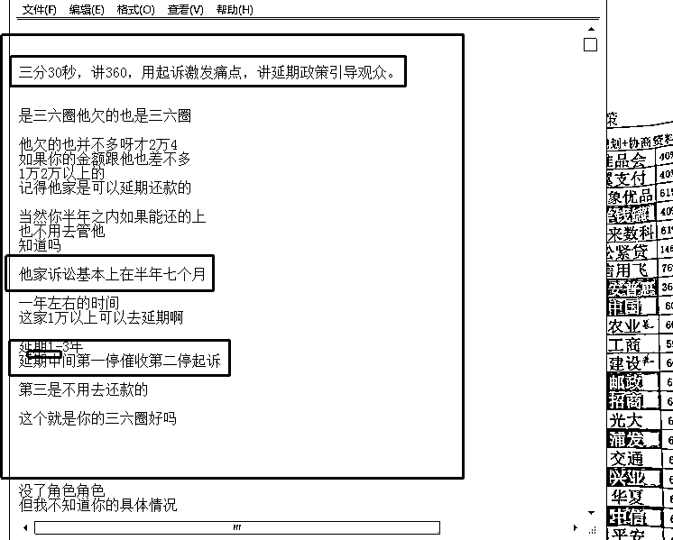

最后把标记的内容话术全部整理出来，确定话术的目的，重点，表达形式并备注，然后把这个话术改成适合我的话术。（这个过程中可以尝试自己优化）

OK，一套针对行业问题，大约5-10分钟的话术很快就完成了。

一般情况下一场直播需要20套话术左右，大概从50套话术里面筛选。

换句话说，最复杂的课程直播，打造专家IP的直播，也只需要直播小白用以上的方式做50套话术而已。

然后就是练习和琢磨，这套话术如何使用可以发挥最大的效果。

是不是很简单？为什么？

###### 制作整理直播话术素材的万能公式。

制作直播脚本的过程中我发现了一个做素材的万能公式，很多行业都可以用这一套公式做素材，非常好用。

脚本素材的万能公式：

1个词+10个字一句话+100个字案例+1000个字的故事+一个清晰展示客户痛点问题的问答=直播超级价值点。

就可以达成吸引感兴趣目标观看，留存，互动，提问，转化等目的，提高直播间价值。

一个词：好的直播间一定会提炼出多个特别能吸引目标用户的词，然后重复强调，这个在心理学上叫重复效应。

比如创业的“月入过万”，比如GPT的“未来已来”，比如“不懂蓝海，别做电商”，负债行业的“减免” “延期，分期”，“只还本金结清”。

对应一个10个字的一句话：一个词一定不能表达出完整的意思，那就要根据这个词延伸出一句能解释清楚，且极具吸引力的套话。

比如，延期政策延伸出的就是: 延期期间,一毛钱不用还，不会被催收，不会被诉。

再或者，很多平台都是可以减免结清的，有些平台还有打折结清的政策，就是只需要还本金的0-7折。

哪怕在做的不懂这个行业，是不是这个可以抓住你不要走，听一听？

每个词对应一句套话。

对应一个100个字的案例：根据这句话，要有相对应的案例和材料作为佐证，这样才能让观众信服。

几分钟可以讲完，且有道理，后面用户才愿意继续听。

下面是顺手找的材料。

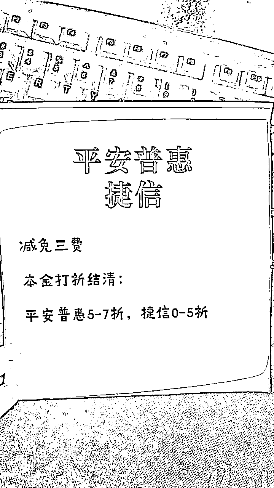

对应一个1000个字的故事：

每一个佐证都会备用一个或多个故事，增加直播的故事性，同时还能丰富更多内容，让用户认可主播，主动留下联系方式。

手头没有其他行业案例，就用负债行业举例：某某某，欠了4W多，平台给他打三折，还吓他，得亏他有我微信号，先问了我下，我给他出方案，1折不到就能结清，省了一W多。

当然，这个故事本身很长，很生动。

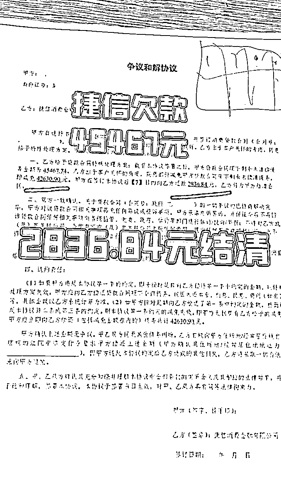

最后，对应一个清晰展示客户痛点问题的问答：

说直白点就是，如果你希望教育你的客户养成问问题的习惯，就要自己问自己答，来带动他们，这点任何行业任何平台屡试不爽。

自问自答还有一个好处就是，你可以控制问题，甚至可以达到，问了问题，就展示了营销答案的结果。

这也算是一种境界。

正常人会问：老师，跨境电商怎么做？

高级问题是：老师，他们说跨境电商也可以一件代发，而且平台负责帮你把货运到国外，不用什么成本就能做，能讲讲细节吗？

正常人会问：老师，讲讲建行呗。

高级问题是：老师我建行卡4W，逾期5个月了，希望协商分60期还，减免掉以后得利息，可以协商的到吗？

问题即是答案。。 。。。。

以上方案做出20套，哪怕全程自问自答都能撑起来一场高价值的直播。

然后每天反过来倒过去，在合适的时间，穿插着使用就是，哪怕你直播间就五个人，也绝对不会冷场。

总结：

行业痛点的一个核心词（标签），一句话（具有吸引力解释），一个案例（图文讲解），一个故事（故事性和埋钩子）。 一套问答话术（问题即是答案） *20 +高效的引流话术*10=一场直播用不完的直播素材。

而做出以上这些所有这些内容，也只需要从20个小时左右的竞品视频中去，

提炼，学习，模仿，抄袭，复制粘贴，

大家觉得哪个词顺眼就用哪个词，总之足够简单，大家都能学会。

整理出这套逻辑以后我发现我看直播的视角都变了。

我发现直播间万事皆可剧本，剧本皆可复制。

所有问答型的直播间必然有拖，这就跟淘宝测评一样，是基操。

比如振振有词那个直播间，大家一定会奇怪为什么主播这里这么多有趣的段子，主播还临场反应高效从不翻车？

如果再带入我上面讲的思考的话，是不是就通顺了？

同时这也就是教育粉丝的一个过程，等粉丝的互动都往这个方向走了，问的熟练了，答的也就熟练了。

#### 直播的时的重点是什么？ 站在主播的角度如何做好一场推流直播。

好，有了素材以后，最后的问题来了。

直播过程怎么使用这些素材最高效？

如何把这些高效的方案复制到新主播身上？

要做好场控，尽可能的达成直播目标。

达成那些目标？

大家看下一个直播间基本数据判断标准。

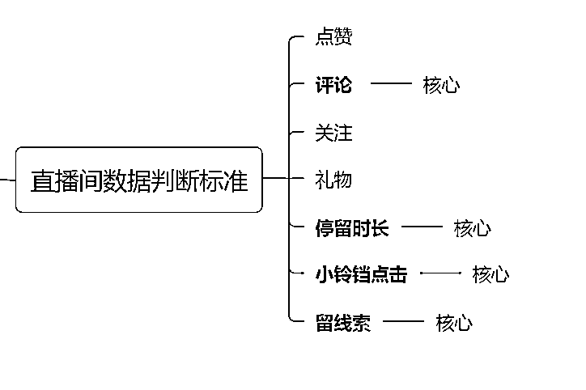

因为是付费推流，说白了就是花钱买客户，所以会简单很多，我们不需要关注太多点，只要拉好几个核心指标，这场直播就会有不错的效果。

我们可以把留人和互动做为重点 。

所以，第一目标就是，留下潜在客户→然后才是互动→引导留线索。

转换成我们的直播脚本就是，主播只要熟记我们的多套脚本，然后判断好，什么时间讲留人的脚本，什么时间讲互动的脚本，什么时间讲引流脚本。

行业的不同，脚本的内容肯定就不一样，大家理解逻辑就好。

展开篇幅太长，这里我们讲一个场控的小方案。

比如回答同一个问题，在不同的直播间人数的情况下，回答问题的思路是不一样的。

如果现在直播间人少，个位数，那么你回答问题应该是一对一的，抓住这个用户，互动出他最大的价值，最好能成交或者是留线索，这样哪怕个位数的直播间，在做好了数个这样的观众的数据以后，也会很快起量的。

如果现在直播间几十个人，那你回答问题的方向就要把针对性去掉，加一些引导类的问题，吸引其他人的兴趣和提问，看似讲给一个人的其实是让相关的所有人听的。

如果直播间几百个人，回答问题的方向就要再扩大了，甚至问题问题的人都会有点感觉答非所问，但是成功的把问题带到了一个广泛性的，适合大众的问题去了，并且引出更多的共鸣。

举这个小例子，我想表达的意思是：

虽然我们做了优秀的直播脚本，但是也不要盲目照搬直播脚本，这样的直播效果会更好。

直播是一个现实场景，很难一个公式用到底，但是搞清楚以上的逻辑，大家直播中就可以举一反三了。

最后再分享一个培养新主播培养的小窍门：

把方以上法给他们，让他们自己去做素材，亲测自己的做一遍素材比背三遍还要效果好。

我招聘主播都会给一套基础的话术去背，然后复盘的时间要求和协助他找出自己缺少的素材，或者不合理的素材，自己去做一套出来，往往自己做出来的，都是讲的最好的。

#### 快手磁力智投广告投放的讲解。

刚才讲到了后台，但是一直没有讲投放。

原因是如果你要做投放，大部分问题你开户的运营都能帮你解决，真的展开讲估计要再开一篇了。

这里我尽量简单接一些我认为需要注意的点。

很多圈友对广告投放会有莫名的敬畏，也确实，毕竟花钱如流水，产生敬畏是应该的，但是没有必要过于敬畏，了解好以下几点，很多平台的推流都是可以试试的，毕竟现在广告推流属于各行业的泛应用了，基础且免费的信息有很多的。

##### 了解平台的广告特性和价值。

你的行业在这个平台一般以什么形式推广告最有效？

这点去看竞对，然后再去找服务商的运营或者销售白嫖。

你的行业最有效的模式市场平均获客成本是多少？市场最优成本是多少？

平均获客成本，找服务商给你他们平均和最低数据，结合这个数据观察同行的直播间，可以算出一个大概的最优成本。

如果平均和最低成本差异很大，说明同行有特殊技巧，找到或者部分找到这些技巧你就一定能玩的比较舒服。

比如人群包的定位，比如关键词的筛选，比如主播能力和直播间权重。

如果差异不大说明大家玩法都差不多，可以判断未来市场必然会很卷。

任何平台都可以用以上方式做一个初步的调研。

##### 了解广告后台，简单做一个定位。

首先，任何广告平台都不要盲目的交给服务商代运营。

我的方法是通过与他们和合作运营账号，然后学习该平台的广告知识。

一边让运营帮助/协助你工作，一边学习的同时了解和把控运营节奏。

这个文章里不好细讲，讲起来又是一堂课，我简单讲几个我接触新平台广告后台会先关注了解什么。

很多广告后台内容超多，前期关注几个重点其实就可以了。

(这些我包括小红书聚光等其他平台也都是这样做的)

###### 学习广告计划搭建

先去了解下你要在这个平台搭建广告计划的主要模式，甚至是唯一模式，先研究好这个，不要分心其他。

这里运营会给你推荐的。

比如我们投磁力智投就是，直播间/粉丝推广+大人群包的固定方式（一个类型的通投）

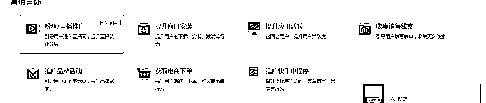

确定搭建计划中的设置，哪些是固定的，那些是需要调整的，这些记下来就好。

很快就能学会的，至于可调整的选项，后面了解了其他就可以判断了。

###### 学习看广告计划数据

学广告要先学习看数据，还是那句话，要知道好坏，才能挑出好的东西吸收。

大部分平台广告数据展示这里选项都很多，正常情况我就只看几个核心数据做判断就好，几个主要数据达标，一般目标数据就不会太差。

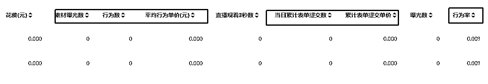

我们的行业，我自己看后台的话，只关注曝光和行为数比，和平均行为单价（理解为有效点击）。

比如：一般平均行为单价较高的话（6块以上），目标结果表单单价大概也不会太好，如果平均行为单价较低的话（5块以下），哪怕表达提交很高，我也会再跑几百块钱看看。

###### 时刻学习了解行业在该平台最新的玩法

多留意后台更新，改版，业内玩法变化，这些都是必须，不要等运营给你讲，主动去问，去打听，同时多联系几个，毕竟他们团队天天都在做这个。

多去看看竞品直播间的新玩法，有问题就记录下来，去问运营，不问白不用啊，不知道就去给我打听啊。

记得你是老板，多做点老板该做的事情。

比如：

别人家的落地页为什么可以留微信，我们的只能客户留电话？

你看看这家，他们算不算我们业内做的比较好的？

我们怎么做才能尽可能的追上他们？

这几天获客成本有点高，你什么时间有空咱们约个时间电话聊一会？到时间给我一些建议，嗯，就是这个问题，聊之前你提前准备准备。

如果要讲广告投放，这要讲的多了去，甚至我的这方面的知识储备都还不足以教别人。

但是现在大环境下，各个平台的直客，代理商，服务商都是基操标配，那相当于免费给你招一个运营，只要你投，不用管都行，所以其实本质上是不需要我们对广告做太多研究，只要有行业红利，怼就是了。

但是也强调一下，一定不能完全撒开手，毕竟免费给你的运营都是60分的，我们要做的就是在他们知识基础上做加分，做把控，做选择。

我们的方法其实很简前面也说过：

直播间/粉丝推广+大人群包的固定方式（一个类型的通投）解释下就是。

做一套最大化留人的脚本：复刻多个同行，挑选高价值内容。

一个讲话不念经，有情绪，可以有一定场控的主播：最基本的要求，能应聘一般都做得到。

直接投相对准确的人群包：比如负债行业，我就是把金融风险人群，借贷需求人群，等等打了一个大几千万的人群包，几乎属于行业通投了。

可以说非常简单就可以直播拿流量了，而且是很多行业（接受获客成本100+左右的行业）都可以这样做。

##### 关于广告出价

如果你刚刚接触，对代运营推的运营又不是太熟悉的话，可以借鉴一下这个经验。

首先讲下我对如何出价的理解：

包括电商平台在内的任何平台，你去推广告的时间，一定是带着运营目的去推广告的，这个目的大概率不能直接是成交或者卖产品。

这里借用我之前课程里的一个逻辑，广告≠成交。

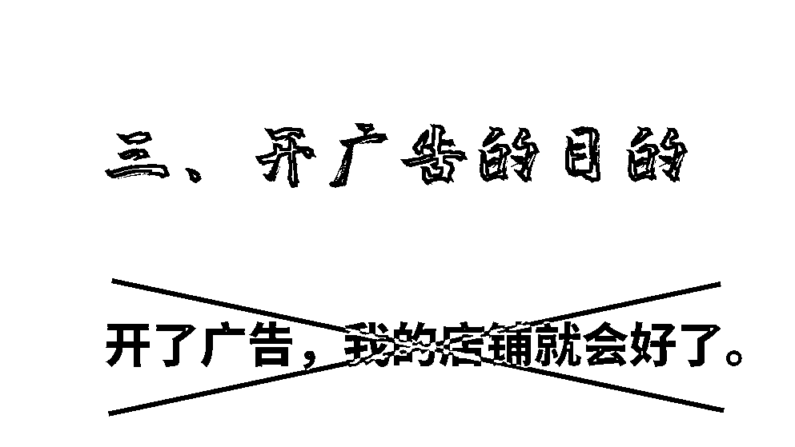

清晰你现阶段的目的，再去去判断广告的出价。

如果你的目的是破冰刷人群标签：哪怕亏点不重要，跑到2-5倍的预期获客成本也能接受。

如果你的目的是起量：1.5倍以上的预期获客成本肯定就要叫停。

如果你的目的是低成本测大量不同人群计划：1倍以上的计划，基本上都不留了。

然后根据你的目的，你的可选广告出价方式最终也只有两个方向。

我叫做，高开低走，和低开高走，下图用的以前课程中的素材，不过逻辑是一样的。

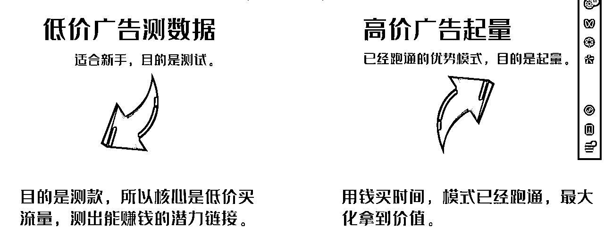

这些逻辑实际应用到跟运营打交道的时候，我会先跟运营约开一个沟通会。

首先我会强调对新平台不了解，要求前期不要太猛，能不能才用低开高走的方式跑广告，就是先用低价去走做测试，拿到想要的结果后，再根据效果然后慢慢加量。

很多运营会讲咱们现在已经是成熟的模式了，不需要测试了。

这时我会要求运营给我讲清楚现在模式的逻辑，以及预期结果，和起量时间，前期消耗的阈值，每个消耗节点的阈值，大致的获客成本区间。

如果运营这些都给你讲的都比较满意清晰，那就可以放开给他们去跑。

我们只需要关注跑出的结果是否符合运营之前会上所讲的即可，尤其是消耗阈值，如果不符合要第一时间给你出方案。

如果有些运营不能清晰的讲出模式，那么我就会要求他和我一起研究计划，研究跑法，然后用低价低成本的方法去做测试。

过程中运营是要出大力，且赚不到多少钱的，所以他必须快速拿出结果才能从我这里拿到收益。

如果以上两点都做不到，尤其是那种工作时间内找不到人的，我就会放弃与这个运营或者机构合作。

OK，广告部分，算是加餐把，复盘到这里再复盘广告，就有些偏了，偏了质量就没了，有机会我再沉淀下，再来总结下关于广告的内容。

下篇预告，合伙人招募模式的复盘，搭建一个平台，用固定的成本0风险获得长期的流量渠道。

# 勾搭我的方式：V：wxx712159.