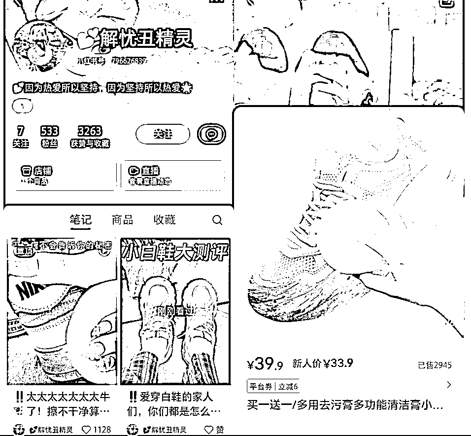
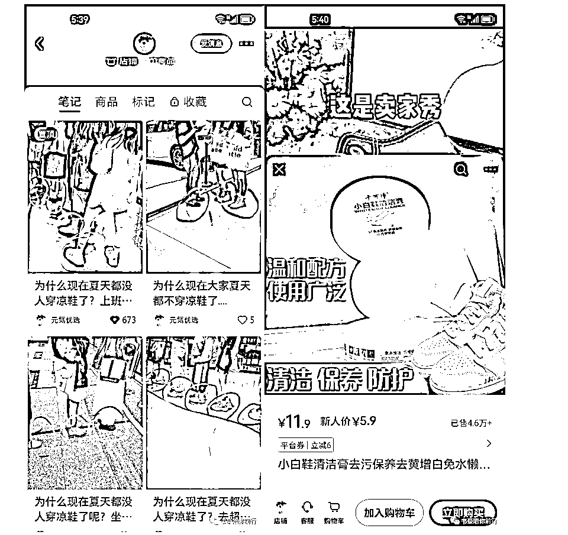
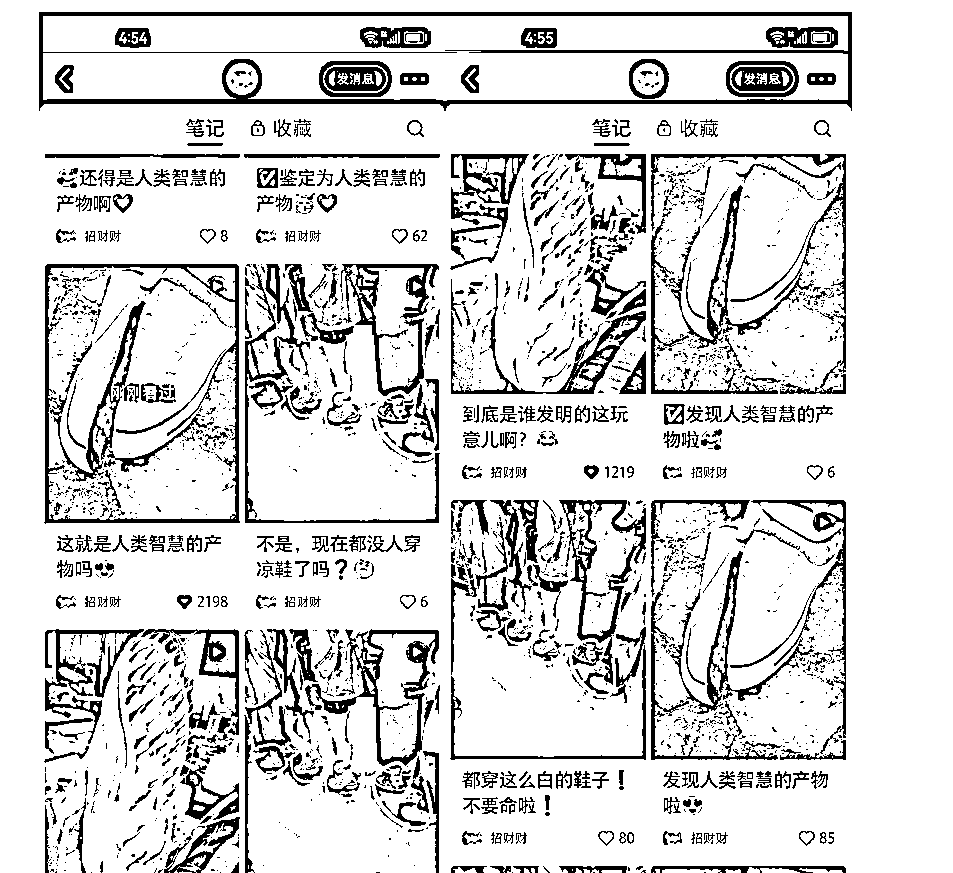

# 小红书开30个店铺，变现90万后，我的选品建议

> 来源：[https://tb9qrhlhl7.feishu.cn/docx/JZVrdEreio0l8Ex0OD5ctSAynSe](https://tb9qrhlhl7.feishu.cn/docx/JZVrdEreio0l8Ex0OD5ctSAynSe)

# 一、自我介绍

大家好，我是生财龙珠圈友书豪，也是小红书店铺航海的教练，一个连续四年年入百万的 95 后。

依靠公众号矩阵赚到第一桶金，在抖音做个护家清类目卖过 1000 万 GMV 的货，今年在小红书平台开了 30 个店铺变现了 90 万的利润。

# 二、经营30个小红书店铺，我们是怎么做到的！？

小红书月活2亿平台的用户量级，80%都是女性用户，商业化平台处于初期，2023年又处于电商元年，身边许多电商同行纷纷入局小红书店铺赛道。大多数在抖音平台打拼的团队转型到小红书平台，我们在今年2月也开始入场。

入局小红书电商的这八个月时间，我们一路走来跌跌撞撞，走了许多的弯路，如果重来一遍，我们会在红利初期的时候，更加专注，更加笃定的专注在百货+个护家清赛道。花开两朵，各表一支，先说说，我们打了哪些不同的类目，益智解压玩具、女装、聚拢内衣 、身体链配饰、情趣内衣、项圈、百货、个护家清。

打了这么多的类目，其实扛起我们主要利润大头的还是百货个护家清类目。

百货个护家清类目是自带内容素材痛点的类目，并且这些类目大多数的品，都能在抖音上找到大量的素材。

30个店铺，简单通过10几个个体户营业执照开通30个店铺并不是难动作。批量搞定关联账号的实名资源也有行业的成熟渠道。这部分不展开讲，小红书店铺航海手册都有。

对于刚起步的航海船员而言，依靠家人同学资源，多开几个个人店铺即可。

像我们是有9个人的团队，所以我们决定做大，给大家说句肺腑之言，红利期项目，学会给团队分钱，上限可以到项目利润的40%，这样你是不用去具体定每天发多少笔记，每天选多少品，定的太细反而不利于你调动团队的积极性。学会分钱，不用傻傻去盯着员工加班加点了。让他们自己卷自己呀！

# 三、做小红书店铺想要赚到第一个1万元，最重要的是选赛道、选品

为什么呢？

不少圈友和我交流，很苦恼不知道选什么赛道、不知道选什么品？

这里我直接给一个推荐，特别是新手，选择百货赛道。可能有的同学还是很懵逼，百货赛道是什么，怎么选品呢？

我给大家列一些我们打爆过的品（单品超过2000单）

1、手持小拖把（在抖音上也是销量超过 100 万单的爆品，根本不愁内容素材啊！不信抖音搜一搜）

2、小白鞋清洁膏（在抖音上也是销量超过 100 万单的爆品，根本不愁内容素材啊！不信抖音搜一搜）

3、宋祖儿同款搓澡神器

4、生物酶泡泡粉

5、发光掏耳勺

6、管道疏通济

不一一列举了，我们在小红书打爆过几十个2000单以上的爆品，这些品都有一个共同的特征，他们都是在抖音去年前年就爆过一次的品。

方法很简单：

去小红书发现页刷对标，那些小红书账号低于200粉丝，同时最近1个月发的单篇带货笔记点赞过100，同时该带货笔记商品销量大于100。就是一个不错的品。

这种爆款方法，本质就是找没多少粉丝但已经有品在爆的对手，去跟品！低粉爆款四个字等价于六个字，那就是粉丝少成交多！

这些品还可以在灰豚数据上面搜到呢！关于具体的选品，其实我6月份就已经在生财分享过我们的选品策略了。大家可以再复习一下我们的选品方法https://articles.zsxq.com/id_xwveu3e0usfv.html

# 四、选品踩过哪些坑

我们打了很多类目。从益智解压玩具、女装、聚拢内衣 、身体链配饰、情趣内衣、项圈一直到百货、个护家清。

猛然回首，发现占据我们利润最高的赛道还就是百货个护家清赛道。特别是女装赛道，出单难也就算了，卖出去100单的品，还能退货80单，看上去单件利润高，可是时间精力、资金投入性价比极低。

即使是身体链胸链这样的品，我们虽然能赚到4万的利润，但是不持久。

https://articles.zsxq.com/id_8o3ptacdp6mj.html

关于身体链胸链的小红书带货分享我今年6月份也在咱们生财分享过。

圈友们，从价格层面你们也能理解，百货个护家清赛道是非常好的赛道，因为所有的产品销售定价都是在 50 元以下的单品，大部分是在 30 元以下的单品，这个价格区间，只要你的小红书笔记视频素材有很强的煽动性，你就能够猛烈的出单！

# 五、对还未跑通的小伙伴，我的选品建议

做小红书电商，可能大家总觉得，小红书都是一群爱美的女性，所以想打女装，但女装是竞争最激烈的赛道，轮不到我们这些小卖家去吃肉啊！

所以我个人的建议是：放弃女装、放弃女装、放弃女装，重要的话说三遍哦。而且什么袜子啊，什么益智玩具啊，在我看来都不是特别好的选品。什么意思呢？你选这些品，根本达不到月销1000单以上。

咱们不要忘记了，小红书那些爱美的女生们，他们还有卫生需求啊，不仅是个人卫生，他们还关心家庭卫生啊，选择家庭卫生这一类目的话，能非常好的帮助大家更快出单。

因为这一类的品，根本就不愁找素材，现有的爆款素材就已经很多了。

想一下，一个带货视频，必备的内容要素是什么？是自带痛点啊！自带产品使用前和使用后的反差。我强烈建议大家，跑步入场百货赛道，我不怕大家和我进来卷，小红书的百货赛道市场是很大的！

在我看来，选好百货类目，你成功的概率至少提升 60%，我身边也有不少朋友，我是看着他们乖乖的从女装赛道投降，转身进入百货赛道赚到钱的。可能是因为我在他们心目中有一点点威信，至少他们看到我这几年创业拿到过结果。

地缝刷、小白鞋清洁膏、宋祖儿同款搓澡神器、生物酶泡泡粉、发光掏耳勺等这些品今天跟大家分享，是想告诉大家一个理念，这些品在抖音的素材极多。

你去选那些素材很少的品，巧妇难为无米之炊啊，那还怎么打！小红书选品，抖音找素材，就这么简单粗暴！

大家记住一点，越是简单的方法，越有效果！

# 六、案例拆解

有了上面的实操步骤，我拿【小白鞋清洁膏】这个品来给大家具体演示下：

首先，我们通过灰豚数据和小红书低粉爆款选品法，都能选到这个品，都能找到这个品。

然后，我们来拆解这个【解忧丑精灵】账号的爆款笔记。

1、笔记标题

这是她的爆款标题：！！太太太太太太太牛🐂了！擦不干净算我输！?

标题不用你想，直接抄抄抄！

2、笔记封面

你看它的爆款笔记封面还有一个封面标题：干洗店不会告诉你的秘密

封面怎么抄？加个贴纸，改个滤镜和对比度，不就是伪原创了吗？

3、视频脚本

“看看啊看看啊，这是卖家秀，哇，我买咯。再好的洗涤剂，它也是洗不干净的。包括这种泡沫清洗剂……”

我们可以直接把他的音频拿来用。

好了，接下来制作我们自己的小红书笔记：

第一步：直接下载上面这个爆款笔记的视频，保存到手机或者电脑；

第二步：保留音频，对它的爆款笔记的画面进行混剪就可以。

（混剪画面可以去抖音上搜“小白鞋清洁膏”，找到爆款视频下载下来。)

这里有 2 个关键技巧：

1、定好了一个产品后，一定要测试≥12 个笔记，选择对手最爆的那个笔记脚本混剪 4 条。

2、同商品多爆款笔记模版组合测试：多找几个爆款笔记的【封面+标题】做组合测试。分为三组不同的标题+封面进行测试。

可以看到这个解忧丑精灵的账号，他也是测试了多个标题+封面，最后爆了一条笔记杀上 2945 单。

不要只测试三五个笔记就放弃，也许你测试的第十个笔记就爆了一两千单。小红书的长尾流量是很大的。

就拿小白鞋清洁膏这个品来说，账号“元気优选”和“解忧丑精灵” 的爆款笔记封面和标题不一样，但是都爆了，都是同一套视频笔记在混剪。

对于新手而言，切记不要盲目创新脚本，对手的脚本模板，已经是经过市场认可的脚本，还是熟悉的佩方，爆款前三秒给痛点或者给猎奇，中间是转化画面，给使用前后对比的使用效果，最后引导购买。这一套玩法的配方百战百胜！

最后，祝大家在小红书店铺赛道，旗开得胜，跑出第一单，把流程方法学会！然后猛烈的杀出第一个 100 单，建立信心！然后你自己就有出 1000 单的希望和自信了！！

以上，一起生财有术！欢迎各位圈友前来交流，微信 wsh137552775