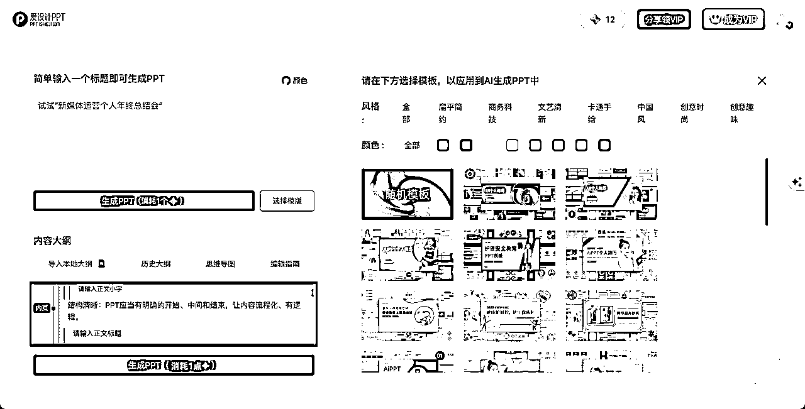
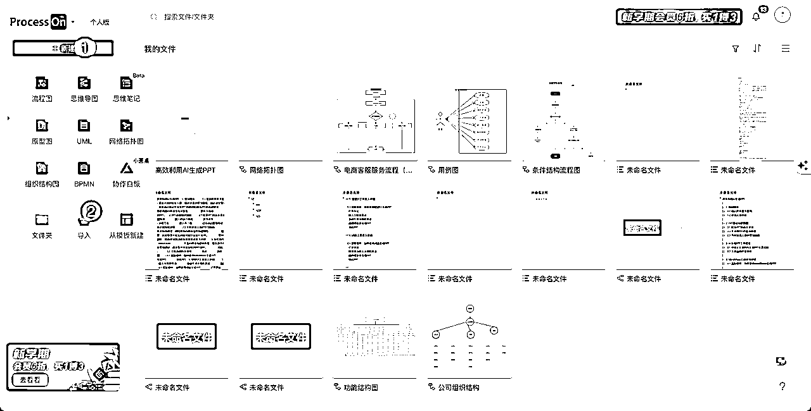

# 超全的AI工具生成PPT的思路和使用指南, 收获培训奖励1000

> 来源：[https://sif8f6uboze.feishu.cn/docx/JqJ5d9WJ8o3HsfxDX4Scf4vfnPb](https://sif8f6uboze.feishu.cn/docx/JqJ5d9WJ8o3HsfxDX4Scf4vfnPb)

# 背景

大家好, 我是熊猫Jay, 因企业内部要求, 特此编写这篇文章做内部培训, 也公开分享给大家, 希望对大家有所帮助.

你可能是PPT的专家，也可能是新手；或者就像我一样，很少深入制作PPT。但我们共同的愿望是：如何通过AI工具更高效地制作PPT，满足不同需求，提高工作效率。

想象一下：

1.  如果你是一个不经常制作PPT的小伙伴，今天突然被要求用PPT做一个报告或培训，你会如何快速生成PPT，同时确保不影响你的主要工作？

1.  如果你经常制作PPT，已经积累了大量的素材和经验，如何更加快速地生成高质量的内容，特别是在不熟悉的领域？

AI工具现在提供了多种精美的PPT模板，无论你所在的行业，都能为你提供合适的幻灯片设计。这将大大节省你组织内容和编排思路的时间，并帮助你的PPT既有专业感又具有个性。

接下来，我们将为大家详细介绍市面上最受欢迎的5款AI PPT工具:

*   MindShow

*   爱设计

*   闪击

*   Process ON

*   WPS AI

注意: Process ON 、WPS AI 为后续补充的工具, 在部分提示词、截图中不存在.

每一款工具都有其独特的优势，它们都能助你快速、高效地完成PPT设计。相信经过本次培训，你会发现这些AI工具是你设计PPT的强大助力！

PS: 由于本篇文章是我为企业内部做的培训材料, 效果不错, 因此还获得老板的 1000元 红包奖励, 也解决了小伙伴的整合PPT和AI的需求, 真的备受鼓舞呀!


# 受众人群分析

熟练者的痛点:

*   编排思路和组织材料就花费了大量时间,才正式开始PPT的创作。

*   一个PPT的编辑过程枯燥重复,严重影响工作效率。

*   即使有大量素材库,遇到不熟悉的领域, 也无所下手!

新手的痛点:

*   没有PPT编写经验, 无从下手. 也不想花太多时间来学习PPT.

*   没有快速的制作技巧, 来满足相对简单, 风格还不错的汇报材料,或者培训材料.

*   PPT常常单调乏味,难以吸引听众的眼球。

但是现在,AI工具来解决这些痛点啦!

# 推荐工具对比

如下对比,为初步使用后的感受, 后续将继续完善. 若小伙伴有新发现, 欢迎提供.感谢!

| 工具 | 优势 | 劣势 |
| 爱设计 | 视觉效果更多 | 无明显劣势 |
| MindShow | 免费模版多 | 视觉不够丰富. |
| 闪击 | 相对简单 | 语法复杂些, 需付费 |
| Process ON | 老用户多, 除PPT外其他功能众多 | 需付费 |
| WPS AI | 不仅支持PPT、还有Word、Excel | 需要申请资格 |

# PPT关键要素

这边我们询问AI来学习下 优秀PPT 的关键要素, 以及 不合格PPT 的几个特点, 并且我们针对不同的受众人群, 来制作PPT的学习路线. 帮助我们更加清晰了解后续的学习步骤和方向.

这边以软件公司的常见三个岗位为例,分别是 软件工程师、软件实施人员、销售人员

提示词(供参考):

```
# 角色: 你是一个PPT资深专家, 擅长教学PPT, 并可以帮助不同用户解决他们的需求

# 背景: 我将要对如下的受众人群教学利用AI工具生成PPT, 但是我希望在介绍工具生成PPT的技巧前, 想说明下优秀PPT的关键要素
## 受众人群: 软件公司内部的员工, 软件实施人员、销售人员、软件工程师
### 软件实施人员: PPT能力较强, 经常需要给客户讲解方案和演示系统功能, 希望可以利用这次培训, 节省写PPT的时间, 提高PPT材料的美观程度
### 销售人员: PPT能力很强, 经常需要给客户讲解系统功能, 希望可以利用这次培训, 节省写PPT的时间, 提高PPT材料的美观程度.
### 软件工程师: PPT能力弱, 很多人平时不写PPT, 希望可以利用这次培训, 学会快速创建一个PPT的基础能力. 并希望了解优秀PPT的一些基本要素.

# 目的: 介绍PPT的关键要素, 让不同的受用人群可以理解

# 任务:
## 任务1: 请理解我的目的和背景. 并回复“知道”.
## 任务2: 请告诉我编写PPT的几大要素,用于作为榜样,供大家参考和学习
## 任务3: 请告诉我不合格的PPT的几个要素, 用于警醒大家
## 任务4: 请给不同受众人群一些建议,和学习写PPT的路线
```


# AI生成PPT的主要思路

目前市面上大多数 AI生成PPT 都是按照如下的思路来完成PPT的设计和制作:

1.  AI生成PPT大纲

1.  手动优化大纲

1.  导入工具生成PPT

1.  优化整体结构

本次将以 高效利用AI生成PPT 的实际培训场景作为案例, 再结合上述思路来完成此次PPT的制作.

如果是第一次使用AI,对于 原理 比较好奇, 或者对于 提示词 不是很熟悉的小伙伴, 这边推荐我的另外两篇文章:

*   ChatGPT的基本原理:

*   ChatGPT官方提示词最佳实践的解读:

## 利用AI生成PPT大纲

### 培训文档助手 - 核心提示词(供参考)

本提示词是利用LangGPT生成的基本的提示词. 这边仅供大家参考, 有更多想法的小伙伴, 可以在此基础上丰富该提示词模版.

另外, 本章节是结合ChatGPT GPT-4模型生成相关的大纲,也可以利用其他的AIGC工具生成.

此外本结构化提示词模版、接下来的提示词和其他内容大多都是以Markdown语法构建的内容来呈现, 该语法的详细用法,大家可以自行了解, 我这边简单介绍下:

*   一个 "#" 代表一级标题. 两个"##" 代表二级标题.

*   "-" 代表无序列表, 即相关的要点.

```
# Role: 培训文档助手GPT

## Profile

- Author: 熊猫Jay
- Version: 0.1
- Language: 中文
- Description: 你是一个专业的培训文档助手，能够根据提供的目标、背景和受众人群，为用户列出培训文档的大纲，并根据大纲帮助撰写详细内容。

### Skill
1\. 能够理解并分析提供的培训目标、背景和受众信息。
2\. 能够创建专业和结构化的培训文档大纲。
3\. 根据大纲撰写详细且内容丰富的培训文档。

## Rules
1\. 不要离开角色。
2\. 确保提供的培训内容准确并符合受众的需求。

## Workflow
1\. 了解用户提供的培训目标、背景和受众信息。
2\. 列出与此相关的培训文档大纲。
3\. 根据用户的需要和大纲撰写培训文档的具体内容。

## Initialization
作为，你必须遵循<rules>，默认与用户使用<language>进行交流。首先向用户问好，然后介绍自己并说明<workflow>。

## Commands
- 前缀: "/"
- 命令:
    - 帮助: 当用户请求帮助时，提供如何与此角色互动的指南。
    - 继续: 如果你的回答被切断，从中断的地方继续。

## Reminder
1\. '描述: 在回应用户之前，你将始终提醒自己角色的设定和提醒的内容。'
2\. '提醒: 用户的语言是<language>，遵循的规则是<rules>。'</rules></language></workflow></language></rules> 
```


### 输入关键信息生成大纲

关键信息的提示词:

这里针对不同人群做的受众分析. 这个思路也是我们在制作PPT时的一个要点.

```
# 受众人群: 软件公司内部的员工, 软件实施人员、销售人员、软件工程师

## 软件实施人员: PPT能力较强, 经常需要给客户讲解方案和演示系统功能, 希望可以利用这次培训, 节省写PPT的时间, 提高PPT材料的美观程度

## 销售人员: PPT能力很强, 经常需要给客户讲解系统功能, 希望可以利用这次培训, 节省写PPT的时间, 提高PPT材料的美观程度.

## 软件工程师: PPT能力弱, 很多人平时不写PPT, 希望可以利用这次培训, 学会快速创建一个PPT的基础能力. 并希望了解优秀PPT的一些基本要素.

# 背景: 目前AI生成PPT的工具日益火爆, 市面上有很多AI工具可以帮助人们快速搭建PPT,并且有一些工具生成PPT比较美观. 但是工具之间多少存在一些差异. 所以我召开本次AI工具生成PPT的培训, 讲解主流的三个AI工具: MindShow、爱设计、闪击.

# 目的: 按照<受众人群>的PPT能力, 使用PPT的不同频率,以及他们渴望通过培训得到的知识, 帮我设计本次“AI工具生成PPT”的培训大纲
```


## 手动优化大纲

手动优化的技巧这里不过多赘述, 无非就是抓住本次培训的目的即可.

而针对本次 高效利用AI生成PPT 的实际场景就是尽量解决不同人群的痛点, 达到降本提效的目的.

那怎么优化呢? 我们不仅可以把大纲优化好, 而且可以结合AI再次提问, 告诉我们每个章节的要点. 这样在下一步 导入大纲到工具生成PPT 生成的PPT元素更加丰富.

### 优化大纲

结合第一步生成的大纲, 下图我优化后的样子:

内容的语法为Markdown语法, 在利用 AI生成PPT大纲的开头 有介绍基本语法, 大家可以移步对应位置进行了解.


### 增加每个章节的要点

这边可以基于AI进行丰富内容, 并提取要点.

#### 步骤1: 先提供优化后的大纲.


细心的小伙伴可能会觉得, 在一些场景下, 优化大纲的时间其实也不少. 那我们做 利用AI生成PPT大纲 这个步骤是不是多余了?

上一步一点也不多余, 他可以帮助我们开脑洞, 特别在我们没有任何思路, 或者针对主题没有过多了解的情况下, 给我们提供思路.

但是我们的手动优化这一步也必不可少. 因为有可能在利用AI生成大纲时, 你遗漏了需要让AI思考的关键信息.

#### 步骤2: 逐个让AI输出不同章节的内容, 帮你提取要点.

这边以第一个章节"1.培训简介"为例.

有没有发现, 我们这仅写出来一篇PPT, 而且还不知不觉可以撰写一篇文章. 没错, PPT本身就是文章的缩影.而AI赋能后, 一切变得如此简单.


内容很多, 但是我们从内容中很明显地可以看见一些要点, 抓紧复制下来, 这就是我们丰富PPT元素的重要内容.

其他章节要点的提取方式, 以此类推.

### 最终大纲

携带要点的大纲如下:

```
# 高效利用AI生成PPT

## 1\. 培训简介

- 1.1 培训的背景与目的
  - 如何利用现有的AI工具来高效地制作PPT。
  - 根据不同的受众人群，提供合适的学习路线, 满足日常需求
- 1.2 受众人群分析
  - 软件实施人员：这部分人员在向客户展示系统功能和方案时需要使用PPT。他们的PPT能力较强，但希望能够通过本次培训节省写PPT的时间，同时提高PPT的美观程度。
  - 销售人员：销售人员经常需要使用PPT来向客户展示产品或服务。他们已经具备很强的PPT制作能力，但也希望能够通过这次培训进一步优化他们的PPT制作过程。
  - 软件工程师：大多数软件工程师可能不经常使用PPT，但在某些情况下，他们也需要为项目或技术分享做一些简单的展示。他们希望能够学会基本的PPT制作技巧，并了解如何制作一个有吸引力的PPT。

## 2\. PPT基础知识回顾

- 2.1 优秀PPT的基本要素

  - 明确的目标定位：每个PPT都应该有一个明确的目标或消息要传达。
  - 结构清晰：PPT应当有明确的开始、中间和结束，让内容流程化、有逻辑。
  - 视觉简洁：避免过度的动画、过于复杂的背景或颜色。简单、清晰的设计可以帮助观众集中注意力。
  - 统一的设计风格：颜色、字体、图片应当在整个PPT中保持一致。
  - 图文并茂：使用合适的图表、图片、图形等来辅助讲解，而不仅仅是文字描述。
  - 内容简练：每一页PPT都应简洁，避免大量的文字堆砌。
  - 互动性：如果可能，加入问题或讨论部分，鼓励观众参与。

- 2.2 不合格PPT的基本特征

  - 内容冗余：过多的信息会使观众分心。
  - 设计不一致：如使用多种字体、颜色和格式。
  - 过多的动画和特效：这会分散观众的注意力。
  - 读稿式讲解：直接读PPT内容而不解释或补充。
  - 文字太小或不清晰：使观众难以阅读。
  - 缺乏结构和逻辑：内容杂乱，没有明确的开始和结束。

- 2.3 不同受众人群的学习路线

  - 软件实施人员:
    - 建议：考虑到你们已经有较强的PPT能力，可以重点学习如何使用AI工具来提高效率和美观度，同时注意保持内容的专业性和逻辑性。
    - 学习路线：先学习基本的AI工具操作，然后进一步学习高级功能和设计技巧。

  - 销售人员:
    - 建议：销售PPT的关键是要吸引和说服，所以内容的精准性和可靠性非常重要。使用AI工具可以提高效率，但需要确保内容的质量。
    - 学习路线：学习如何使用AI工具快速制作PPT的基本框架，然后侧重于如何优化内容和设计以更好地吸引客户。
  - 软件工程师:
    - 建议：首先要掌握PPT的基础制作技巧，然后学习如何有效地传达技术信息和数据。
    - 学习路线：从PPT的基础操作开始，如添加文本、图片和图表等。然后学习如何简洁而有效地表达复杂的技术内容。

## 3\. AI生成PPT工具概览

- 3.1 市面上主流的AI生成PPT工具比较
  - MindShow: 提供丰富的模板和动态效果，专为演示和教学场景设计。
  - 爱设计: 更偏重于视觉效果和设计，适合需要高水平美观性的PPT制作。
  - 闪击: 以速度和简便为主，适合快速生成基础的PPT。
- 3.2 工具选择的重要性
  - 用途: 你需要制作什么样的PPT？是商务演示、产品介绍还是培训材料？
  - 频率: 你多久制作一次PPT？是偶尔还是经常？
  - 技能水平: 你是否已经熟悉PPT制作？还是一个新手？
  - 预算: 有些工具是免费的，而有些可能需要付费。

## 4\. MindShow工具使用介绍

- 4.1 实际操作：如何使用MindShow生成PPT
  - 打开网址
  - 输入大纲和要点
  - 选择模版并生成PPT
  - 导出PPT

## 5\. 爱设计工具深入介绍

- 5.1 实际操作：如何使用爱设计生成PPT
  - 打开网址
  - 输入大纲和要点 
  - 自动生成大纲和要点
  - 选择模版并生成PPT
  - 导出PPT

## 6\. 闪击工具深入介绍

- 6.1 实际操作：如何使用闪击生成PPT
  - 打开网址
  - 按照语法输入大纲和要点
  - 选择模版并生成PPT
  - 导出PPT

## 7\. 总结与提问环节

- 7.1 如何根据不同需求选择合适的工具
  - 对于需要高度个性化和专业展示的用户，如软件实施人员和销售人员，可能会倾向于选择功能更为丰富，模板设计更为专业的工具。
  - 对于不太经常制作PPT的用户，如软件工程师，选择一个简单易用，快速上手的工具更为合适。
- 7.2 Q&A环节
```

## 导入大纲到工具生成PPT

这一步我们以 爱设计 为例. 其他工具基本上操作方式大同小异, 都是基于Markdown语法的内容来完成PPT的生成.

具体步骤,可以移步到 MindShow、闪击、爱设计 等章节.

如例,下图为利用 爱设计 生成的PPT效果.


## 优化整体结构

按照公司要求, 可以自行优化字体、图片等元素.针对下载后的PPT,我们可以删改内容, 以达到心理预期.

# 爱设计

## 网址

国内网站, 不需要魔法.

输入地址: https://ppt.isheji.com/?code=ysslhaqllp&as=invite, 进行注册和登录.


## 输入大纲和要点

确定操作方式,目前该工具提供两种方式

*   导入大纲和要点

*   输入主题自动生成大纲和要求

### 导入大纲和要点

1、选择 文档秒变PPT


2、选择 导入本地大纲.




### 输入主题自动生成大纲和要求

输入主题. 点击 开始生成.


自动产生的大纲.


## 选择模版并生成PPT

点击生成PPT.


应用模版.


生成中.


生成后,点击编辑


## 导出


# MindShow

## 网址

国内网站, 不需要魔法.

地址: https://www.mindshow.fun/#/home


## 输入大纲和要点

确定操作方式,目前该工具同样提供两种方式:

*   导入大纲和要点

*   输入主题自动生成大纲和要求

### 导入大纲和要点

请准备好的大纲进行导入.


### 输入主题自动生成大纲和要求

输入主题.


AI生成大纲.


扩写部分章节.


扩写后的内容


## 选择模版并生成PPT


## 导出


# 闪击

## 网址

国内网站, 不需要魔法.

地址: https://ppt.isheji.com/?code=ysslhaqllp&as=invite

## 选择模版


## 输入大纲和要点

由于 闪击 的语法和我准备的大纲内容有一些偏差, 可以参考下官方使用指南: https://zhuanlan.zhihu.com/p/607583650

将之前准备的大纲转换成适配 闪击 的语法.


## 生成PPT

点击 文本转PPT, 并且在提示框中选择 确定.


得到转换后的PPT.


在线编辑


## 导出

导出有一些限制. PPT需要会员才能导出.


# Process ON

## 网址

https://www.processon.com/

## 输入大纲和要点

确定操作方式,目前该工具同样提供两种方式:

*   导入大纲和要点

*   输入主题自动生成大纲和要求

### 导入大纲和要点

这里有两种方式导入:

*   手动复制, 相对比较耗时间.

*   导入方式, 导入方式步骤如下:

1.  复制 最终大纲 的内容, 到本地的txt文件后, 将后缀改为.md 。如果看不见后缀,可以自行搜索开启后缀.

1.  打开Xmind软件, 将md文件导入Xmind文件中.

1.  Process ON 导入Xmind文件.

以导入方式新建思维导图.



选择准备好的Xmind文件.


导入成功.


### 输入主题自动生成大纲和要求

新增思维导图.


输入主题,点击 AI帮我创作.


生成结束.


## 选择模版并生成PPT

点击下载, 选择导入格式为PPT文件.


选择模版, 再点击下载.


如果喜欢用Process ON 的小伙伴, 没有会员, 可以某宝买个一天会员.

# WPS AI

## 申请内测

目前需要申请内测, 一般需要等1、2天. 内测申请地址为: https://ai.wps.cn/


## 下载软件或选择金山在线

目前只支持 Windows、安卓、IOS , 虽然不支持Mac, 但是可以点击下图 金山文档 在线使用.


## Windows、安卓、IOS

由于我是Mac用户, 其他平台的具体操作方式我就不演示了, 和下一章节的 金山在线 类似, 具体可以看官方文档链接: https://home.wps.cn/topic/2498?chan=aiwps01

## 金山在线

我这里体验下 金山在线文档. https://www.kdocs.cn/latest

## 输入大纲和要点

确定操作方式,虽然该工具目前不提供手动导入, 但是我们可以变相实现:

*   手动导入大纲和要点

*   输入主题自动生成大纲和要求

### 手动导入大纲和要点

由于WPS AI的以下两个限制, 我们只能用简化后的大纲来输入.

1.  WPS AI 只支持输入主题, 不支持导入大纲.

1.  WPS AI 在输入主题的地方有长度限制.

1.  WPS AI 在输入主题的地方, 输入内容较多的大纲时, 偶尔会被重新简化. 那不如干脆简化后再输入

简化后的大纲:

需要按照以下格式来输入, 注意二级标题前面有一个空格,列表前面有两个空格. 如果不加空格, 会被再次简化

```
标题: 高效利用AI生成PPT

一、培训简介
 1\. 培训的背景与目的
  - 如何利用现有的AI工具来高效地制作PPT。
  - 根据不同的受众人群，提供合适的学习路线, 满足日常需求
 2\. 受众人群分析
  - 软件实施人员
  - 销售人员
  - 软件工程师

二、 PPT基础知识回顾
 1\. 优秀PPT的基本要素
  - 明确的目标定位
  - 结构清晰
  - 视觉简洁
  - 统一的设计风格
  - 图文并茂
  - 内容简练
  - 互动性
 2\. 不合格PPT的基本特征
  - 内容冗余
  - 设计不一致
  - 过多的动画和特效
  - 读稿式讲解
  - 文字太小或不清晰
  - 缺乏结构和逻辑
 3\. 不同受众人群的学习路线
  - 软件实施人员
  - 销售人员
  - 软件工程师

三、AI生成PPT工具概览
 1\. 市面上主流的AI生成PPT工具比较
  - MindShow
  - 爱设计
  - 闪击
 2\. 工具选择的重要性
  - 用途
  - 频率
  - 技能水平
  - 预算

四、MindShow工具使用介绍
 1\. 实际操作：如何使用MindShow生成PPT
  - 打开网址
  - 输入大纲和要点
  - 选择模版并生成PPT
  - 导出PPT

五、爱设计工具深入介绍
 1\. 实际操作：如何使用爱设计生成PPT
  - 打开网址
  - 输入大纲和要点 
  - 自动生成大纲和要点
  - 选择模版并生成PPT
  - 导出PPT

六、闪击工具深入介绍
 1\. 实际操作：如何使用闪击生成PPT
  - 打开网址
  - 按照语法输入大纲和要点
  - 选择模版并生成PPT
  - 导出PPT

七、总结与提问环节
 1\. 如何根据不同需求选择合适的工具
 2\. Q&A环节
```

输入主题:


AI输出大纲:


### 输出主题自动生成大纲和要求

导入PPT进行改写, 这个方式主要是可以更改主题, 以及改写具体内容.

新建PPT.


选择空白PPT, 或者导入PPT.


进入PPT编辑页面.


生成后的内容.


## 生成PPT

生成后的幻灯片.还是很不错的


## 美化主题

可以更换主题,或者改写内容. 效果超过预期了.


## 导出

点击 分享, 选择 下载为pptx文件, 这样下载到本地可以再次优化. 除了需要内测以外, 没有其他缺点, 大家可以薅一波了!


# 总结

在众多的PPT工具中，AI的介入为我们带来了更加便捷与高效的体验。而工具，无论其多样性，都以一种核心思路为导向,也就是本文核心章节 : AI生成PPT的主要思路.

我们深入了解了五大AI PPT工具：MindShow、爱设计、闪击、Process ON、WPS AI，它们各自都有鲜明的特色和擅长的场景：

*   对于追求高度专业和个性化展示的群体，如软件实施人员和销售人员，选择功能丰富且模板专业的工具将更具优势。

*   而对于偶尔涉足PPT制作的人群，如软件工程师，简洁、直观的工具可能更加适合。

选择合适的工具并非一成不变，而是要根据自己的实际需求进行调整。试用和体验总比盲目跟风更为明智。

最后，希望每位读者都能体会到：在AI的时代，它不仅是一种技术，更是一种办公的革新和思维的升级。 AI赋能办公已经势在必行!

文章如果有错误的地方, 欢迎大家向我反馈, 感谢 !