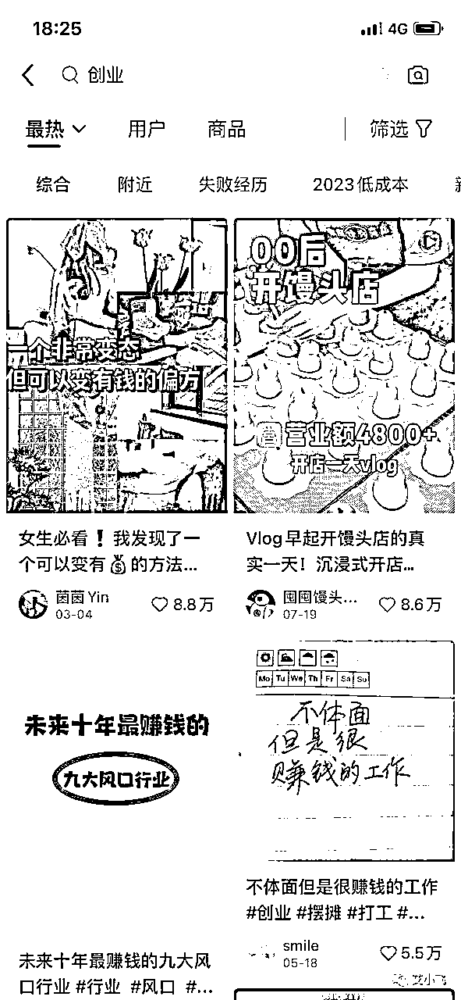
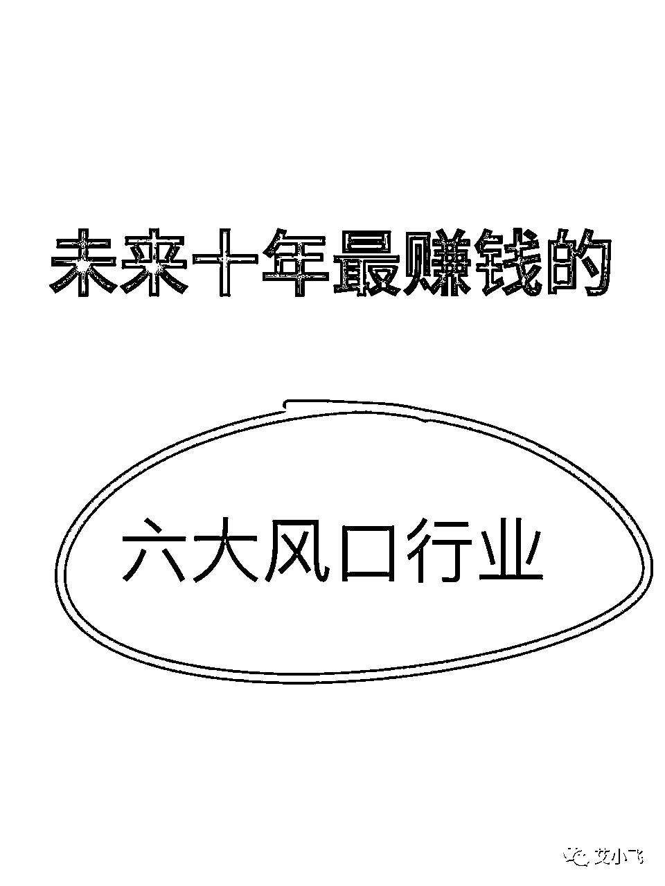

# 如何利用小红书矩阵起号，打破流量难题

> 来源：[https://nivut760ftk.feishu.cn/docx/K6yqdpWXOoyMU9x5XTwcDv3FnMf](https://nivut760ftk.feishu.cn/docx/K6yqdpWXOoyMU9x5XTwcDv3FnMf)

各位圈友们大家好，我叫艾小飞，擅长小红书私域引流

今天我来给大家分享的主题是：

《如何利用小红书矩阵起号，打破流量难题》

说到小红书，有些圈友可能很明显的感受到，一年前和现在的小红书，流量变化很大

发布笔记不像一年前，随便发都有500的小眼睛，现在可能连100都难做到。

这是为什么呢？

首先是因为有越来越多的优秀创作者，开始布局小红书平台了，而平台的流量机制，又是赛马制的。

什么是赛马制?

谁的内容更获得用户的喜欢，谁就能获得平台更多的流量推荐

第二呢，有很多的优秀创作者，他不甘满足于一个账号上的成功，他想把账号成功模式，批量复制到更多的账号上，来获取更多的流量。

所以才有了今天很多人，都想在小红书上起号，但发现小眼睛始终不过百的原因。

不是你不够优秀，而是他们的内容质量和账号数量都太牛了，哪怕你的内容质量很好，你单个账号怎么能拼得过别人批量的账号呢

为了让大家了解清楚，什么是矩阵号，我简单的给你们科普下

在单个或多个平台上，注册有2个账号以上的，都算是矩阵号

矩阵号按照大类别，可以分为两种。

1.纵向矩阵

在单个平台上的纵深布局，比如在小红书平台上创建多个账号，发布相似的内容

2.横向矩阵

在多个平台上的横向布局，比如小红书，抖音、快手、视频号等。

本篇我们主要来探讨一下第一种，打造“纵向矩阵”。

可能你会好奇，打造矩阵号有什么好处呢？

在这里我列举了5点：

1.提升抗风险能力

做过小红书的朋友都知道，时常因为小红书限流、禁言、封号等问题而困扰过

但如果你把风险平均分摊到10个账号上，A账号封了，还有B账号在，这样可以很大程度上降低你的流量损失

2.提升测试效率

如果你注册了一个新号，去测试某个标题是否有流量，跟我同时注册10个新号去测试，得到的效率是不一样的

当你一个号测试成了，我10个号里的某个号都跑通整个流程了

3.降低试错成本

比如我想在小红书上引流创业粉，但我不知道要以什么形式或内容去引流，这时我想到了创业搭子，裸辞创业，创业干货，创业项目，我用一个号去同时测试，到底哪个才能引到精准粉，几乎是很难的

这时候如果我有10个号，每个号负责一个板块，然后再做数据对比，看看哪种内容，引来的人变现能力更强，那我就去做那个，这就是矩阵号，给我降低了试错成本

4.占领用户心智

你们有没有注意到，你们城市里的沙县小吃，为什么他都没怎么打广告，我们却知道他是卖什么的？

沙县小吃也是利用了矩阵玩法，批量在每个城市开店经营，当你每次你路过他门店的时候，都会对他的印象+1，哪怕你不去吃，但他已经在你心里种下了一个印象

同理，在小红书上玩矩阵也是一样的

我举个例子，比如你去搜创业的关键词，10篇笔记里面，看到5篇分享内容都是来自同一个人的，你也许会对他产生一种信任，感觉这人挺靠谱的，于是你可能会加他的联系方式，然后购买他的课程...

这就是矩阵能占领用户心智的好处

5.提升流量效率

我举个很简单的例子吧，你一个号发布笔记有500小眼睛对吧，那我用10个号同时发布呢，有多少小眼睛？

是不是就能有5000的浏览量看过我的内容，把效率提升至十倍，这就是他的好处

好了，说了那么多好处，如果没有实操教程，就说不过去了，那接下来，我就用我的实战经验，来给你们分享下，我是怎么做矩阵号的

我就以我在小红书上，矩阵引流创业粉为例吧

首先在注册账号之前，在不了解这个赛道的情况下，我会去搜索同行，看看他们都是怎么做的

比如我会这样搜索

看看关键词之下，最受欢迎的是什么类型的

分别看50篇笔记之后，我要统计数据的是：

1.什么内容受欢迎

2.图文还是视频的多？

3.他们在评论区都聊了什么？

4.我能不能去复制他们的内容？

5.模仿后大概多久能爆？

ok，了解到这些关键信息后，我就开始找手机和号码，来注册一个新号了

然后呢我用流量去注册好登录之后，就保持一机一卡一账号的状态，开始去刷这类的同行

评论关注点点赞，基本上操作完2-3小时后，我就开始修改账号头像名字简介了

完了后就开始写内容，比如这个爆款封面是这样的

我想测试看看，如果模仿他的这个爆款封面，我的还能不能爆，我就会这样去制作

看得出有啥区别了吗?

（现在用这样的封面很容易被提示违规，我只是给大家举例子）

搞定了封面，接下来就是标题了

比如这个爆款标题是这样的：

《未来十年最赚钱的九大风口行业》

那我就会改成：

《未来十年最赚钱的六大风口行业》

看得出什么区别了吧

ok，封面和标题都搞定了，选好了话题标签后，那我就发布了

等待30分钟后，看看数据怎么样？

一般来说新号的权重很低的，你的第一篇笔记，小眼睛很难突破500

没关系，那我就继续按照这个方式，再去找下一篇爆款的素材，来模仿复制他的内容，相隔40分钟后，再去发布下一篇笔记

如果这篇笔记还是没啥流量怎么办呢？没关系的，心态放好就行，那我就继续发，反正也没什么成本对吧

因为小红书的爆款都是重复的，当我复制爆款内容连续发了3天后，其中有一篇笔记流量，从最开始的100，到10000的一个爆发性增长，这个时候我就马上再用另外一台手机，去注册新号，

还是按照刚刚的那个流程去操作，当养号2-3小时后，我就继续发布上一个(A账号)爆款过的笔记内容，把这个流量给吃尽为止

如果这时候，这个B账号还能继续爆，那我就会继续用另外一台手机去注册C账号，在用同样的方式，去复制B账号的内容，然后就以此类推下去

因为我的做法跟其他人有所不同，其他人都是在没有爆款的情况下，就去批量注册账号铺量，而我是验证了上一个账号爆款之后，再去注册下一个账号，慢慢的累积上去的，这样做的好处是，省时省力省成本，而且效率是非常高的

总结一句话就是，爆款过后的矩阵，是如虎添翼，而无爆款的矩阵，是在浪费时间，这是我的实操路径，也是我每天能高效引流的技巧

好了，今天的分享就到这了，谢谢大家！

原创：艾小飞

转载可私信

禁止搬运和抄袭

微信：aifei9977 （记得备注来意）