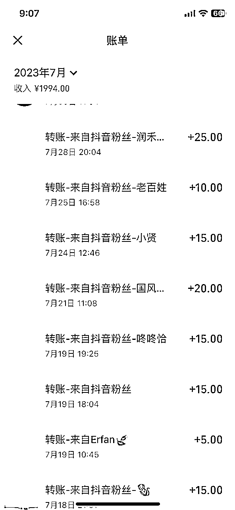
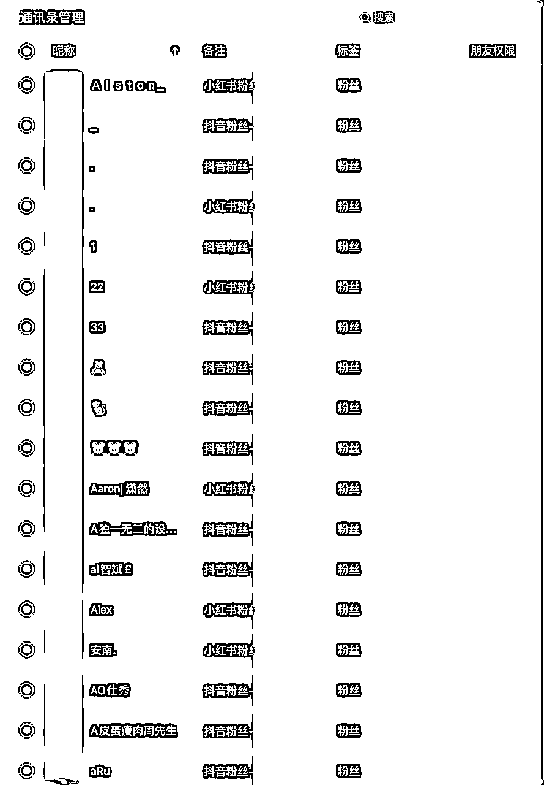

# 关于我一个视频10万多人观看，并且变现6500+的事

> 来源：[https://gm369vy1q1.feishu.cn/docx/KDIddSWkUovLxgxEsrdcrGxBnef](https://gm369vy1q1.feishu.cn/docx/KDIddSWkUovLxgxEsrdcrGxBnef)

各位生财的圈友好，我是益达，一名生财新生。

首先，简单的介绍一下我自己，我是一名互联网设计师，平常喜欢旅行、徒步、看电影，也琢磨一些新生事物，比如Midjourney，也算是第一批玩AI绘画的设计师群体。

也是因为接触AI绘画，所以命运的小齿轮开始进行了转动，我凭借一个小视频变现了6500+。

仅引流到微信转账收入：

虽然赚的不是太多，但是也在我迷茫的道路上点燃了一盏小蜡烛。

全文主要包括几个方面：

1、迷茫期我是如何尝试的

2、视频爆了我做了哪些措施

3、如何进一步发展

4、一些个人小感悟

## 一、迷茫期我是如何尝试的

### 1、我的背景

我是一位名副其实的小镇做题家，普通的城市，普通的家庭，普通的大学，普通的自己。

虽然哪哪都很平凡普通，但是我有一颗不甘平庸的心。

或许是小时候时常被外公外婆教育，想要什么要自己争取；

或许是在朋友圈时不时能看到人家晒自由职业；

也或许是自己想要拼命逃离这毫无波澜的生活；

基于这种种的或许，我特别喜欢尝试做一些不一样的事情。

比如喜欢记录一些东西，所以我写了35万的日常读书和思考

喜欢整理设计的文章资料，所以记录了91万字的设计体系（现在好久没记录了😅）

喜欢看电影看动漫、看电视剧，所以就看了记录在案的900多部

也正是因为这些愿意“作”的特性，所以在今年AIGC浪潮我也不断尝试～

### 2、在AIGC的浪潮中冲浪

我相信很多人都有不少兴趣，比如唱歌、跳舞、写作等等

那么如何通过这些兴趣爱好去做一些事情呢？

这个事情我也想了很久...

但是，光想肯定是想不出来的

得去实践，才能发现问题

王阴阳说过：想，都是问题；做，才是答案！

#### 想是问题，做是答案

在Chat GPT出来的时候，我相信互联网人都在各种尝试

但是，世界上的事情哪有很简单就能完成的呢？

*   可能没有科学上网工具，放弃了

*   可能注册页面打不开，放弃了

*   可能邮箱验证不了，放弃了

*   可能没有真正的帮助自己，放弃了

这一步，就筛选了一大部分的人...

#### 遇到问题，往前走别回头

这些问题，我也遇到过，不过我没有放弃，我是往前再跨了一步，我不断在生财和GPT社群翻找资料，进行整理，把整个的一条注册流程摸清楚，自己尝试着走一遍。

好了，这注册流程自己已经会了，在开始玩了，那么结束了吗？

并没有，是不是可以把教程写出来，教给他人呢？说干就干，我把自己整个的注册流程做成图文的方式，又在各大视频平台进行发布，也获得了很好的反馈，自己也对这个知识点又进一步理解了。

再多走一步，我把这个注册流程又整理了一份，在公司团队内部进行了分享，又获得了一些正向的反馈

这应该就叫做复利效应～

#### 不断尝试，寻找兴趣

生财中也有特别多关于Chat GPT赚钱多法子，可是我看了一圈，发现没有特别适合我的东西。

所以我又回到了迷茫的起点。

可能是互联网设计师，所以接触的信息都比较前沿，在Midjourney盛行的时候，我又蠢蠢欲动，但是这次我有了兴趣，因为AI绘画比较对口我的设计专业，有兴趣了。

那段时间下班后就一直泡在Midjourney和Stable diffusion中，研究关键词、研究如何进行组合。

当时也没有想着如何赚钱，只是想着把今天学到的AI绘画内容给分享出来。

所以，我就不断的做，不断的做...

部分AI绘画内容：

终于，有条我都没怎么花精力的视频突然爆了

当然这也需要稍微结合一下大家的需求、好奇心、热点、求知欲等等

浏览量开始一天几千上万的增加～

从此，命运的齿轮开始转动～

有人找我接单了，有人找我咨询了，有人找我合作了...

这时候脑海里突然想起了一句话：如果，你觉着你不如别人，那么，你尽管努力。剩下的交给天意！

## 二、视频爆了我做了哪些措施

### 1、快速复制爆款

起初视频火了之后，开始我还没有在意，后面不断的有人找我询问是否能帮着换脸，我才发现这是一个可以变现的机会。

在接了十几单之后，我发现很多人是想要制作形象照。

也对自己的视频进行拆解分析

*   很新奇，很多人没见过可以换脸

*   有换脸和没换脸的对比

*   自己本身有制作需求

*   线下拍形象照比较麻烦

然后我针对这个需求就开始在新榜和蝉妈妈等平台看这一类型的数据以及对应的博主。看他们是如何进行制作以及平台的一些规则玩法。

通过新红榜查看“AI形象照”话题，出现4条数据，其中两条都是我的，所以说是一片蓝海

接下来就是大量的制作关于不同姿态、不同颜色、不同服饰的形象照视频，每天都发，每天平台都发，修改抖音个人简介。

趁着平台有流量有曝光，制作同一类型的视频，有助于平台打标签，把你的视频推给相应的人。

这个时间节点很重要，可能你这个视频热度下去了，就没流量了。

### 2、组织话术、创建店铺

当每天都有很多人私信我如何进行制作形象照的时候。

我提取大多数用户的问题，进行集合

*   用户的困惑

*   如何进行制作

*   大约需要多久

*   效果好不好

针对用户这些一系列的问题，我组织好话术，并且下载了专门的输入法（因为输入法可以定义常用语，苹果自带的不行）。

当有用户私聊我的时候我直接话术发过去，并且告诉他多少钱，然后制作，需要提供什么，而且说明“抖音不一定一直在线，可以+V细聊”

这样不但减少了我的交流成本，用户也能一下子get到意思，并且有了心里预期多少钱。

特别是后面的这句话，一般有兴趣的用户，都会主动的加我，来询问。

通过这些交流话术，我引流到微信的用户比例大概在90%以上。

然后自己对于加入的用户进行标签备注，方便后期维护和发朋友圈。

但是对于这些单方向的去加人，去成交是不够的，所以我开始在小红书、视频号创建店铺，做被动的成交。

这时候我开始观察小红书人家的店铺是如何装修的，在详情里面进行图文结合，打消用户的疑虑。

由于我是第一次去创建小红书和视频号店铺，很多规则和玩法都不清楚。

我又把航海往期的手册都给看了一遍 生财有术5月小红书店铺航海 和 生财有术5月小红书运营航海 等等

在这里感谢生财这个大平台，感谢航海手册的贡献者～

### 3、经营朋友圈

当引流到微信的用户，其实他们是会第一时间去看你的朋友圈，了解你大概是个怎样的人，是否值得信赖。

所以你就需要认真经营你的朋友圈，最基础的就是同步发你的视频

时不时的发一些出单的截图、好评的截图等（记得不要泄露人家的肖像）

还有就是发朋友圈的时候，可以给粉丝一些再次制作的福利

比如：前五位下单，免费；前10位下单，打8折等等

把存量用户给活跃起来，这些存量用户也会介绍其他来。

## 三、如何进一步发展

如果把发现发现赚钱机会称为野路子“第一步”，那组织话术，创建店铺就可以称为正规军“第二步”

那么是不是还可以往前走一步呢？

这个想法我也思考了很久...

直到一位粉丝找到我，说是否可以教他学习AI技术。

对呀，我怎么没想到我可以“授人以渔”呢？

这个粉丝蛮执着的，开始我拒绝了（因为她没有电脑基础）一直要我教我

就这样我开启了由“赚人家的钱”转变为“教人家赚钱”

接着我的第二单也来了，都是被动接单教学...

所以，有时候遇到瓶颈，先不要着急去解决，可以多走几步，可能问题就迎刃而解了。

## 四、一些个人小感悟

其实在写这篇小感悟的时候，我想了很久，我这个小感悟，赚点小钱是否值得写出来呢？

在生财这个大平台我的这些可能只是小打小闹，算不上什么。

但是转念一想，可能生财也有很多像我这样还在不断探索的小学生，我的小成功或许也能给大家一点点小帮助。

实在不济，也相当于是复盘了我的经历，发现我的一些不足的点，继续优化。

### 1、人要有探索精神

通过整个的复盘，我发现这次的小成功主要还是基于我喜欢“折腾”

因为喜欢探索，所以我玩起了AIGC

因为喜欢分享，所以我发布自己的作品

因为喜欢思考，所以我发现了一个小商机

因为喜欢钻研，所以才有了稳定的资源

因为喜欢复盘，所以我才有了这篇分享

人生很多时候都是需要探索精神，才能有新的变化，不然一直工作住所俩点一线，又梦想着一天能够发财，这种几率微乎其微。

近几年我也有比较多的朋友被裁员，有些在慢慢的发展之前的兴趣，转变为事业；也有些被迫转行或者逃离北上广，但是他们的能力、谈吐、情商、认知其实都差不多。

我发现他们差的其实就是“探索欲”和对工作之外事物的介入程度，现在工作不再变得特别稳定，每个人其实都需要去思考一下“我不做这份工作，我还能靠什么赚钱”

### 2、人要居安思危

当你在思考这个的时候，你看到新生事物，你就会去想着了解一下，在了解的过程中其实就有无限的可能。

“危机，危机”在危险的背后，其实还有机会，你不居安思危，等到真正危险的时候，可能自己就一片茫然。

哈哈，这里扯的比较远了，不过也是我对于这件事情最底层的思考。

希望，对大家有所帮助。

### 3、可以这样了解我

最后介绍一下我自己，我是“益达”，一位在深圳工作的互联网设计师，喜欢徒步、摄影、旅行、记录

◎ 设计拿过省级一等奖🏅

◎ 创业项目受过电视台采访🎙

◎ 做生活的设计主理人🙆♂️

◎ 花瓣认证设计师🌸

◎ 5年互联网UX从业经验🌍

◎ 语雀知识库持续建立中🏠

◎ 学习达人，累计学习1300天+📖

◎ 电影百事通，豆瓣观看1000部+🎬

◎ 摄影爱好者，500PX广东省会员📹

◎ 不听歌会死星人，网易云听歌40000首🎵；

我的自媒体账号全网同号为“益达设计库”，欢迎了解

还可以这样认识我，我的 益达 · 语雀（平常会记录一些生活的日常）

最后，感谢大家的阅读，欢迎大家多多指教~