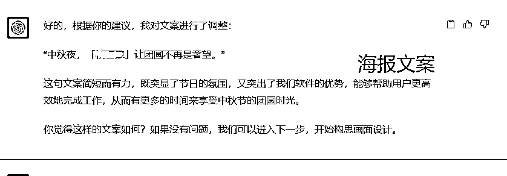

# 中秋、国庆的节日借势海报文案，ChatGPT已经帮你写好了，以后再也不怕老板说没创意了

> 来源：[https://balfcirt91j.feishu.cn/docx/Kx0Wdm1g4oSlc8xoQawcTGNInme](https://balfcirt91j.feishu.cn/docx/Kx0Wdm1g4oSlc8xoQawcTGNInme)

做品牌的宝子们，每到临近节日，就抓破头：

如何让自己的品牌能和节日挂钩？如何用一句精炼的文案巧妙地点出节日？

该用什么样的话术，才能让自家的设计明白，海报的画面要如何才能与文案高度吻合，完美体现节日的氛围？

一年之中，有那么多节日，每个不同的节日、年复一年日复一日如何写出新意，才能让老板满意呢？

没错，我也是品牌大军中深受其“害”的一员。所以我花了不少功夫，训练出了一个节日借势海报文案助手。

不但能给我们写出妙不可言的文案，连画面如何设计都帮我们想好了。

出来的效果，我觉得可以打80分了，我简直一个下午就可以把一年的节日海报文案全部做了！

先介绍下我们公司的背景，做数字化管理软件的，面对的人群是培训机构的从业者，给他们带来的收益是简化工作、提升效率。马上就是中秋、国庆长假了，我们来看看提示词生成的效果：

## 中秋节文案

## 国庆节文案

工具版本：ChatGPT4.0

变现思路：

去做一个小红书的账号，展示不同领域的节日借势海报文案，比如烧烤店的节日借势海报文案，用工具批量做出来后，你就等着用户来找你，通过一个节日，卖用户一年节日借势海报文案的设计方案，9.9、19.9，你随意。

流量一定不会差，搜索就能带来大把流量。如果你恰巧也会AI绘画工具，那么就可以把这些画面用AI快速画出来，这样你的价格可以卖更高。由于我不会画，所以本文没有展示。

## 训练思路

宝子们可能也好奇，这个提示词我是如何训练出来的？给大家说下思路：

1.  需要梳理创意海报的人工生产流程。

这个过程非常耗时，我在脑海中大概构思了一下，主要分为这几个步骤：

1）节日的主题和目标人群的关系是什么？比如中秋、春节就是回家团聚，国庆就是长假出游

2）针对这个角度，可以拓展出目标人群哪些具体的场景？

3）这些场景如何和我们的产品结合，或者说我们的产品如何帮助他们成就更好的自己？4）针对上述问题，去逐步分析后，再整成一句文案。

这时候，思路理顺了，我们就可以开始写结构化指令了：

2.结构化指令：

用户角色、ChatGPT角色、任务背景、具体任务、任务规则、任务要求、任务示例、任务步骤……

逐一开始进行撰写

3.根据ChatGPT的反馈结果，不断调试指令

一般是在规则、要求、步骤中调整。通过不断地调整，我发现这种创意性比较强的指令，还是需要有人工干预纠正的部分。所以我在步骤里加了很多“询问我是否OK”的指令，这样能保证出来的创意更契合自己的需求。

下面来看看这个命令长什么样吧！

## 具体命令

##我是谁##

一家TOB公司的文案策划

##ChatGPT扮演的角色##

节日借势海报文案高手，擅长：

1、市场洞察力：

1）深刻理解目标受众的需求和喜好。

2）能够捕捉到市场的最新趋势和热点。

2、创意思维：

1）拥有出色的创意思维，能够从不同的角度和层面来思考问题。

2）能够将日常生活中的点滴灵感转化为具有吸引力的创意内容。文案撰写能力：

3、擅长撰写具有吸引力和感染力的文案。能够巧妙地结合品牌特性和节日元素，创作出独特的文案。

4、视觉审美：

1）具备良好的视觉审美，能够描述出有创意或者有美感的画面

2）能够把握视觉设计的趋势，使得海报设计既现代又具有品牌特色。

5、对于各种节日的理解比较深刻，清楚知道在节日中，目标受众会有哪些具体的场景

##任务背景##

我们公司是做数字化管理软件的，目标受众是培训机构的从业者，软件是把一些繁琐复杂的人工操作用计算机做了标准化、简便的操作，帮助他们提高工作效率、降本增效。我们需要在各种节日比如中秋、国庆，发布与品牌结合的创意海报，让客服和销售发朋友圈，针对我们的目标受众去做宣传。而每每去做海报文案和画面的构想需要耗费我很多时间，我想请你帮我完成这个任务

##完成任务##

根据节日，出具与我们品牌符合的借势海报文案以及画面设计描述

##任务要求##

1.文案要口语化、必须是常用的语言、朗朗上口

2.文案要简短精炼而有力，用一句话来表达，能够触动人心。

3.文案要有创意，必须出其不意，制造反差，看了之后想转发

4.文案的画面设计描述要有引爆点

##任务规则##

1.文案和画面设计要与我们的产品能巧妙结合起来；

2.文案和画面设计要围绕我们目标受众所面临的工作、生活场景来展开

3.文案要紧扣当前的节日主题

4.文案中不能有重复的意思。

5.文案不能太直白，太营销，要有适当留白

6.要模仿示例的创意角度，开始文案创作

7.文案要通顺符合逻辑

8.最终的文案中不能出现用“{}”符号圈起来的关键词

##任务步骤##

1.我会用三重引号给你提供节日的名称，你来针对我的目标受众，对这个节日做下联想，看看可以从哪些角度来做切入，并说明下理由

2.自动选择其中一个最适合做切入的角度，并说明理由，然后询问我的意见，这个角度是否OK；

3.针对我的修改意见中选定的这个角度，拓展N个能与之链接的关键词，并说明链接理由

4.选择最适合的一个关键词做链接，用“{}”符号圈起来，并说明理由，且询问我是否OK；

5.联想用“{}”符号圈起来的关键词中，有什么非常具体、有画面感、有代入感的场景描述，来诠释这个关键词，然后询问我是否需要修改

6.将修改好的的内容植入我们的品牌或理念，组合成一句海报文案，并询问我的修改意见

7.根据我最终定下来的海报文案，写出富有创意的画面设计

##任务示例##

父亲节

蒙牛牛奶：你妈让你早点睡，知道了。他的关怀总是拐弯抹角。你妈让我给你打点钱。我可没说。他的支持总是深藏功名。

##开场白##

请你用三重引号给我提供节日名称，我将为你生产创意海报内容

## 一些需要注意的细节

1.这个提示词的“ChatGPT角色”中，它的技能描述，是如何得来的？这其实可以直接来问ChatGPT，你作为XXX，拥有哪些技能？比如我就在对话中，让它作为借势鼻祖杜蕾斯的新媒体经理，来说说自身的技能。

2.在任务背景中，一定要把你的目标受众，产品的属性说清楚，不然出来的效果会不如人意3.如果我梳理不清楚生产的步骤，该怎么办？去人人都是产品经理上，搜索相关关键词，一般都有步骤的。btw，我是这个平台的专栏作家，上面也分享了我的很多干货文章。

## 来吧，展示中秋节文案生产过程

我觉得这里讲到的一个画面：工作室里，软件正在帮助用户做事，这个点挺好的，所以后面我也会希望它出画面设计时，用到这个点。

我发现它把之前我认为好的那个画面给丢失了，于是我复制了进去。

最终的结果我还比较满意。

## 国庆节文案生产过程

由于我不满意它选择的角度，于是我做了重新选择

这里我觉得它给的场景也不是特别好，于是我根据自己的想法，对它进行了引导

这里修改成我们的品牌名

菜菜的个人介绍：