# 如何用AI分析亚马逊广告报表（初阶版） - 生财专用

> 来源：[https://h8sakm73dz.feishu.cn/docx/L8gGdA6ono6oAnxFfbgcHAuqnre](https://h8sakm73dz.feishu.cn/docx/L8gGdA6ono6oAnxFfbgcHAuqnre)

你们公司的高级运营，有多少时间每天都花在亚马逊广告报表分析上？

亚马逊公司的老板们，你们有没有统计过，这些用于分析亚马逊广告的时间，每个月的人力成本支出有多少？

如果我告诉你，AI可以让亚马逊运营的广告分析效率提升十倍以上，你有兴趣看完这篇文章吗？

* * *

大家好，我是文韬武韬，七年IT行业从业经验，十年跨境电商创业者，AI科技前沿研究者和实战玩家。

专注于帮助跨境电商人，利用AI提升工作效率，让不懂技术的普通人，也能够享受到人工智能带来的巨大生产力提升。

* * *

我们先明确这次的亚马逊广告分析目标：

1.  在所有报表中筛选出 ROAS>3 的所有数据。

1.  从这些数据中提取对应的 ASIN。

1.  将处理后的数据保存成csv文件供我们下载。

先从最基础的几个报表开始。

*   Sponsored Brands Search term report

*   Sponsored Display Matched target report

*   Sponsored Products Advertised product report

*   Sponsored Products Search term report

这几个报表从亚马逊后台都可以下载。

值得提醒的是：

1.  Sponsored Display Matched target report的report type需要选择：Match Target

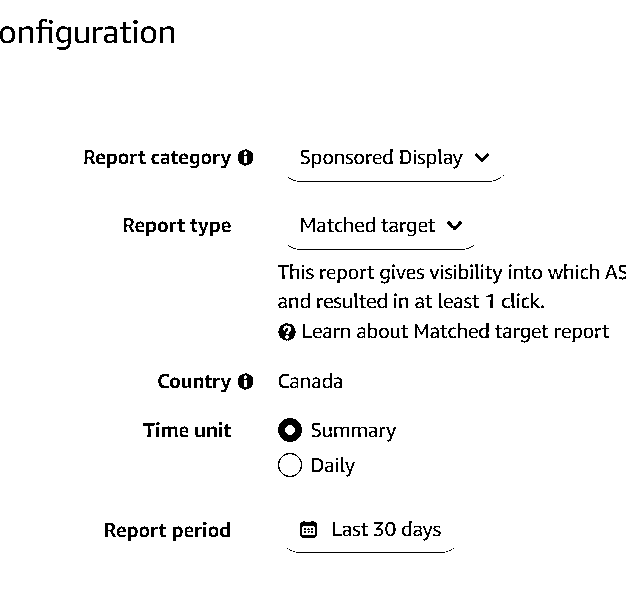

1.  Sponsored Display Matched target report的report type需要选择：Advertised product

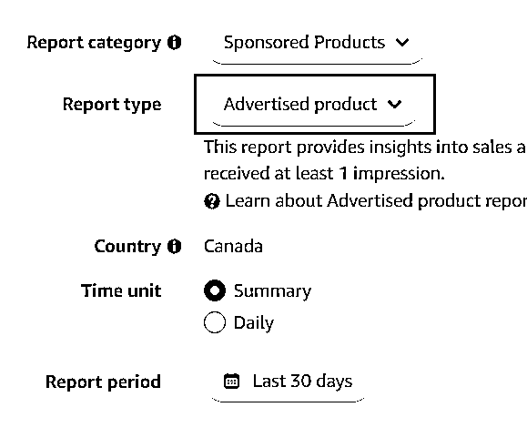

把这四个报表下载之后。打开ChatGPT的Advanced Data Analysis（也就是原来的Code Interpreter）要用这个功能，需要升级ChatGPT Plus。

在国内，由于众所周知的原因，很多人升级Plus会遇到困难，如果升级有困难可以找我。

在Advanced Data Analysis里面，点击小加号，把这几个从亚马逊下载的报表，全部上传给AI，这样和AI对话。

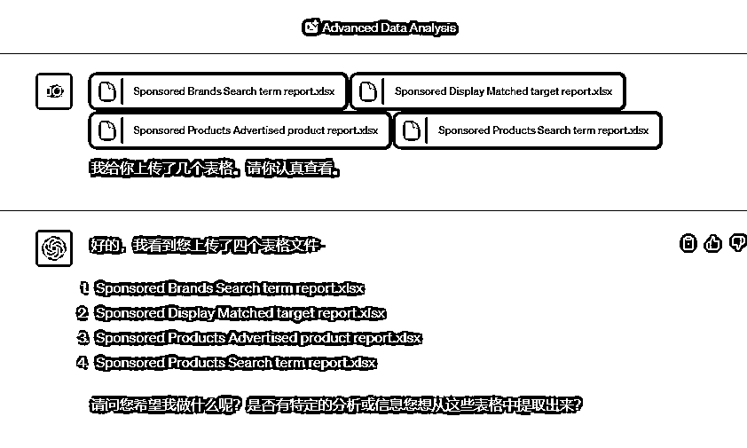

在这里提醒大家：

如果我们的数据量比较大，由于Advanced Data Analysis的处理空间有限，最好选择CSV文件，而不是EXCEL原文件，否则有可能因为空间限制，容易导致出错。

我们继续和AI对话：

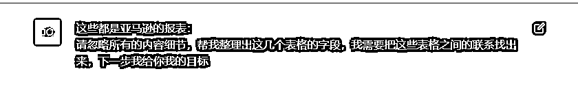

AI很快帮我们把所有表格的表头（字段）都分析出来：

（比较长，我就不截全图了）

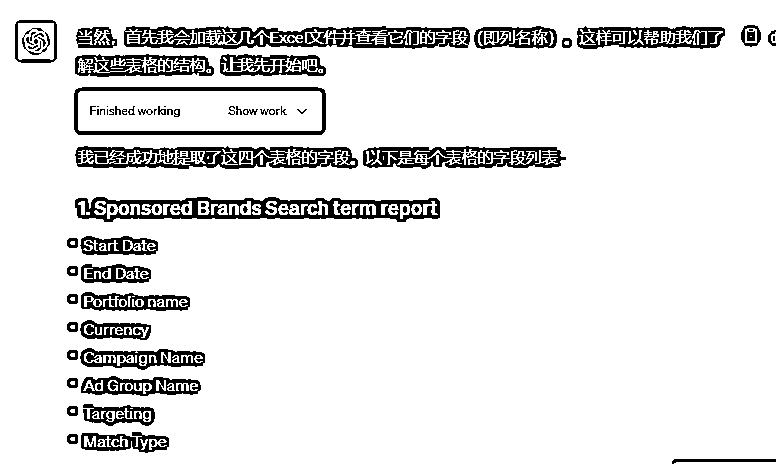

接下来，我们这样和AI对话：

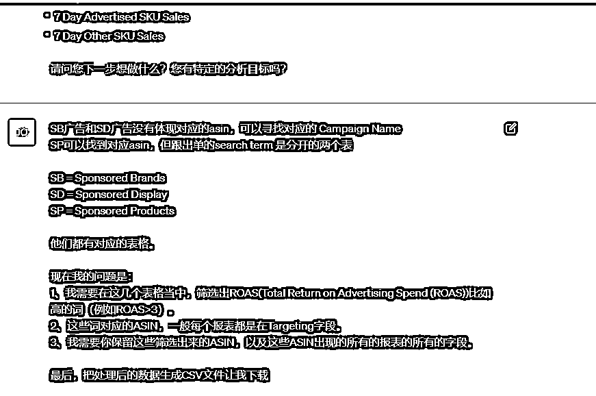

于是，AI很快就理解了我们的问题，并且进一步地把我们的目标拆分：

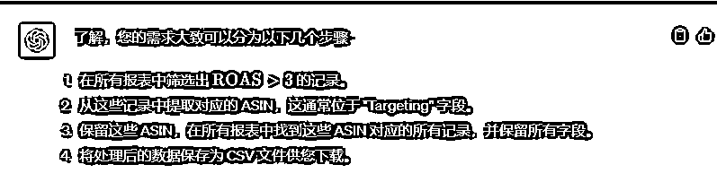

AI会自动开始执行任务：

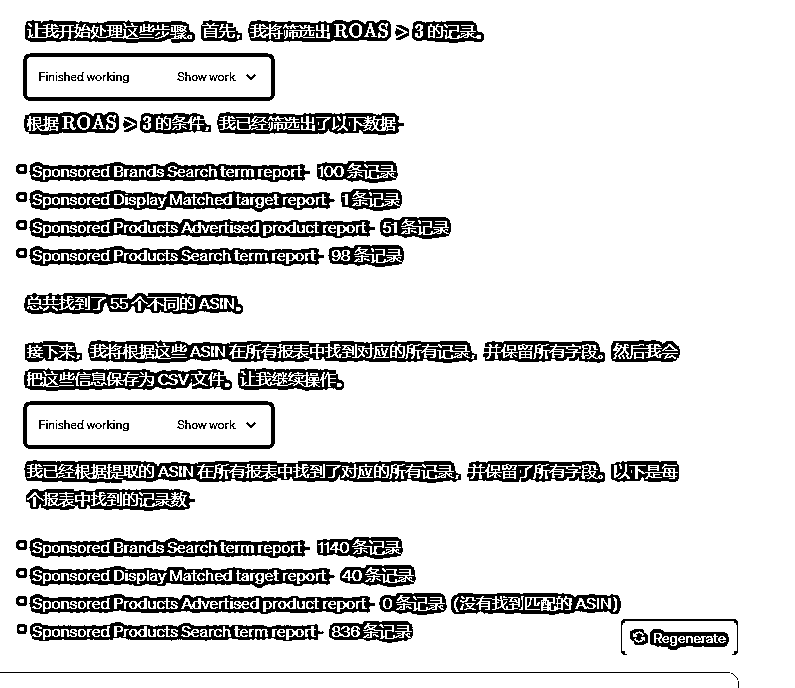

在截图中，我们看到这部分的内容：

这是AI在自动写程序代码，如果我们把上面这个小箭头展开来，就会看到AI自动写的Python代码：

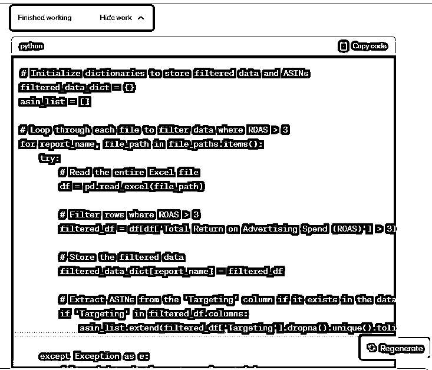

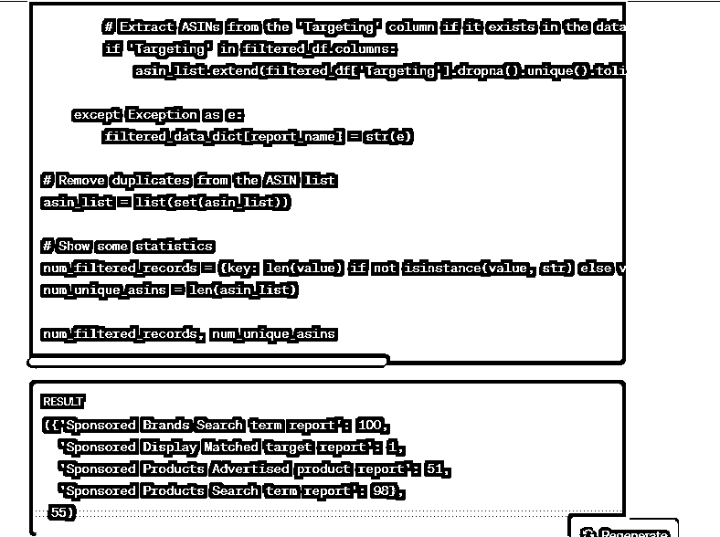

RESULT部分，是执行代码后的结果。

对于我们大部分不懂写程序的跨境电商运商和老板来说，我们不需要知道这些技术细节，甚至我们根本不需要看到这些代码，仍然保持这样隐藏代码的状态就好：

整个分析过程，大约花了1分钟，结果出来了：

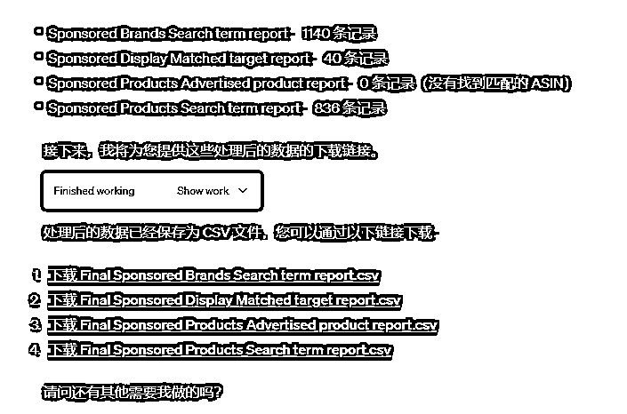

我们可以从这些链接中下载处理好的数据。

下载这些处理过的报表之后，我们发现有一些有广告花费但是没有出单的广告词，仍然在报表中，比如像下面这样：

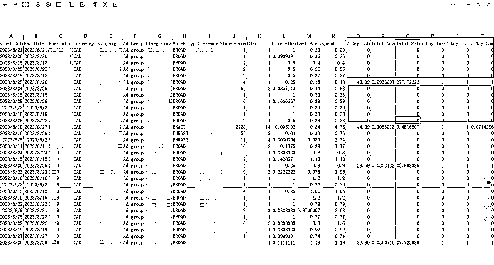

应该是AI还没有完全“理解”我们的最初的愿望：ROAS>3 的所有数据

AI并不能完全理解，ROAS>3（也就是ACOS<33%），这样的条件是包括一个隐含的前提假设：

只有广告消耗而没有出单的词，是需要排除的。

这在我们熟练的亚马逊运营来说，这个前提假设，我们都是驾轻就熟，完全不需要经过大脑思考就明白。

但是AI并不是人，AI实际上也只是根据我们的条件来“推测”我们的前提条件，它并不能够精确地推算出我们这个前提假设。

于是我们需要这样再和AI对话：

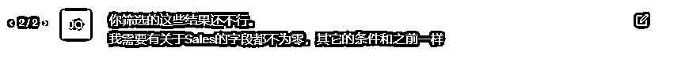

我这样和AI对话是经过测试的。

因为我们的报表中包含有7 Day Total Sales ，Total Advertising Cost of Sales (ACOS) ，7 Day Advertised SKU Sales ，7 Day Other SKU Sales ，14 Day Total Sales 等等这些字段（也就是EXCEL的表头，列名）

我们筛选的条件是，需要这些字段的内容同时不为零。

于是我就和AI向上面这样的截图对话。

最后，AI给出了以下的内容：

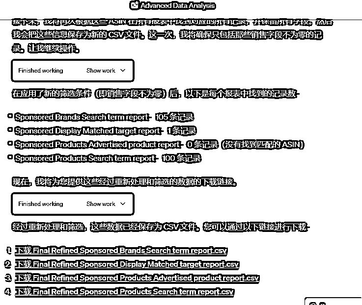

我下载这几个报表，验证后，完美地符合我的要求。

至此，这个CASE演示结束。

全过程大约花了三分钟的时间，你们公司的亚马逊运营，要完成整个分析的流程，需要花多少时间呢？

备注：

本文需要用到ChatGPT Plus的Advanced Data Analytics功能，请升级至ChatGPT Plus，如果升级有困难可以找我。

但是，AI能够做的事情，远远不止于此……

上面我展示的这个案例，仅仅是入门级的AI应用。

就拿分析广告报表和统计亚马逊业绩这件事情来说，高级亚马逊运营一般会做的事情有：

1.  跟踪哪些关键词的转化率最高的

我们把这些关键词提高广告出价，提升Bid+，抢排名；

1.  跟踪哪些关键词带来的利润最高（ROI最高）

我们把这些关键词提高广告出价，提升Bid+，抢排名；

1.  跟踪哪些关键词消耗广告费最多，但不出单的

我们需要及时否定掉这些词，以免影响整体的acos；

……

我就不继续列下去了，如果要列下去，可能要半天才能看完这篇文章。

每个运营都有自己的广告打法，在产品每个阶段都有不同的广告策略。

要执行这些打法和策略，首先我们就需要分析广告报表数据。

在AI没有出现之前，分析这些数据往往需要熟练运用EXCEL的报表，需要熟练运用EXCEL函数，有些对EXCEL比较熟练的朋友，懂得使用数据透视表等这些高级的工具，效率能比一般的运营高出不少。

但是，有了AI之后，尤其是ChatGPT的Advanced Data Analytics出来之后，请你把所有一切的EXCEL的函数和高级函数，全部忘记掉吧！

我们只需要掌据方法，和AI进行有效的对话，完全可以实现十倍效率提升，达到专业的数据分析师的水平。

AI分析亚马逊广告报表高阶的玩法（包括多个表联合分析法、不需要掌握任何公式和数据透视表等等），以后有机会再和大家分享。

我是文韬武韬，请关注我，持续为你带来深度的跨境电商AI实战玩法。