# 三大招，公众号流量主收益提升10倍

> 来源：[https://q2srbwoeiz.feishu.cn/docx/LQsid5bjVonnmuxz8wKc2O6InwF](https://q2srbwoeiz.feishu.cn/docx/LQsid5bjVonnmuxz8wKc2O6InwF)

大家好，我是程序员田同学，一个在小程序行业沉淀了五年，在老年私域粉+公众号\小程序流量主赛道专研三年的玩家。

做公众号流量主，我认识的许多人每天只关注文章阅读量和收益，并不关心其他数据指标。

其实，流量主后台给予了一系列数据指标，帮助流量主用于提升广告收益，今天就着重分享一下公众号流量主收入提升的三大奥秘。

在 2021 年我开始写个人公众号，只是开通个流量主放在那听天由命，几年以来文章阅读无论是几百还是几千，底部的流量主收益几乎都是可以忽略不计的。

看一下我个人公众号两年以来的流量主收益。

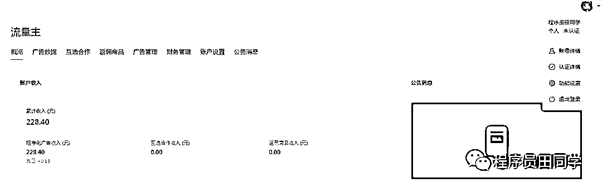

自从我接触老年粉私域以后，一个搬运公众号的流量主收益两个月后，就变成了这样。

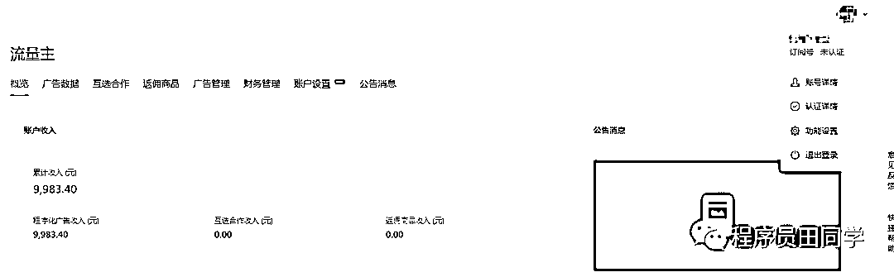

一个搬运公众号一天流量主的收益，比我原创两年的个人公众号收益都要高。

这让我意识到，在公众号阅读量不变的前提下，公众号流量主收益的提升是有迹可循的。

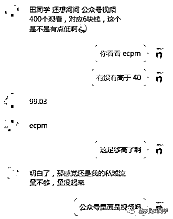

在开始之前，我们先了解一个广告行业的通用概念—ecpm 。ecpm 又叫千次曝光收益，广告被曝光一千次获取的收益。

小程序或者公众号文章发布以后，底部的广告有的人会一滑而过，有的人会停留一段时间而后一滑而过，有的人会感兴趣点击。

一滑而过会至少产生一个拉取，因为网络各种原因反复拉取会使拉取量有偏差；

停留一段时间而后一滑而过会产生一个有效曝光，不要问几秒才算有效曝光，系统有一套自己的评判标准，可以确定的是停留时间越长越好；

点击广告会产生一个有效点击。

打开流量主-广告数据-每日数据明细，这些数据都会清晰的在流量主后台展示出来，所有的优化也都是依赖这些数据指标。

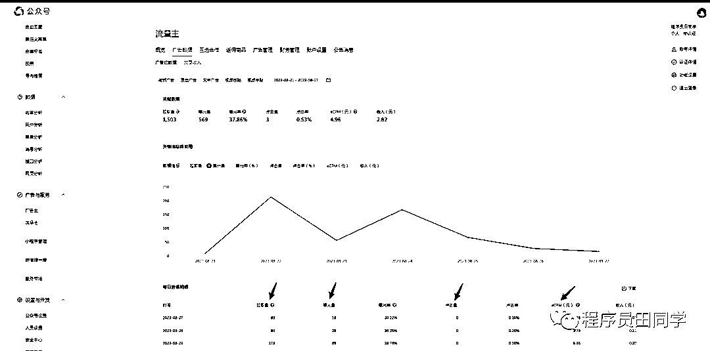

第二天，腾讯广点通投放系统，会根据有效曝光和点击量综合计算得出流量主的总收益，再除以 1000 就得出了 ecpm。

理解了这些，你应该就会知道在什么样的用户场景下，广告收益才能达到极致？

在自然状态下，某一个用户刷到了你的文章，并把文章看到了最底部，在底部广告位停留了几秒钟，然后点击了广告。（用户自然行为，一定不要人工刷）

影响公众号ecpm 最核心的因素是什么呢？

是用户质量，更具体的说是广告曝光率和点击率。流量主优化也着重于提高这两个比率。

# 一、如何提高广告曝光呢？

很多人都有一个误解，认为只要广告被用户看到了就算一个有效曝光。实际上广告投放系统判断有效曝光有一套严密的算法。

我们虽然不知道具体的规则，但可以确定的是广告显示的时间越长，有效曝光的几率越大。

所以，公众号放单视频的文章，要比文字的 ecpm 要高。

用户在观看下面5.42分的视频时，底部的广告位会持续的产生曝光。

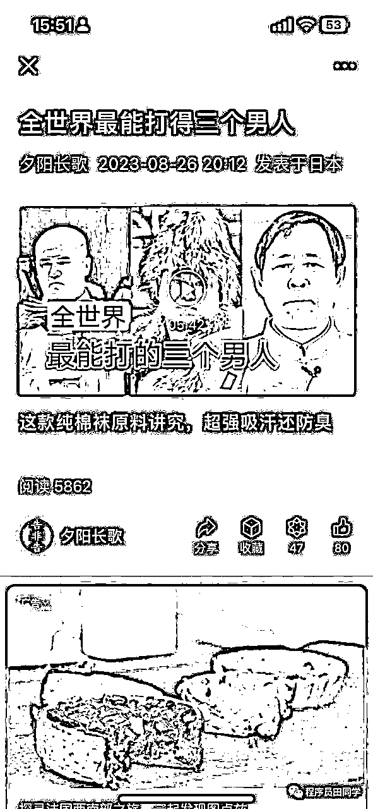

将我的个人公众号和我另外一个只放视频的公众号ecpm进行对比，差了20倍不止。图文小程序的ecpm一般是140左右。

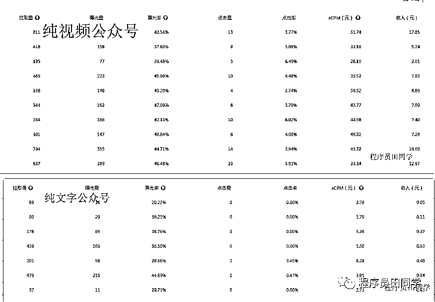

但是，在现在GPT爆文的玩法下，如果都在公众号里面放视频，公众号文章就会失去系统推荐。

那如何既不影响爆文的推荐，又能让用户在底部停留时间足够长呢？

可以在文章底部放一个视频，或者图片等乱七八糟吸人眼球的东西，「让用户在底部停留的时间尽可能的长」。

# 二、如何提高广告的点击率呢？

公众号流量主后台很多人忽略了一个功能——广告屏蔽。

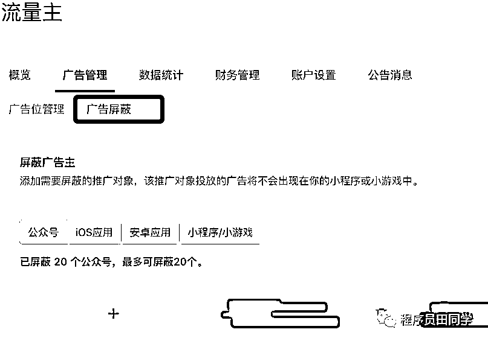

我们可以根据公众号粉丝的用户属性，屏蔽一些用户永远不会感兴趣的广告。

如果是做中老年流量主，遇到咸鱼之王等之类的游戏进行屏蔽。

比如，遇到下图这样广告就留着，中老年男粉点的概率非常的高。

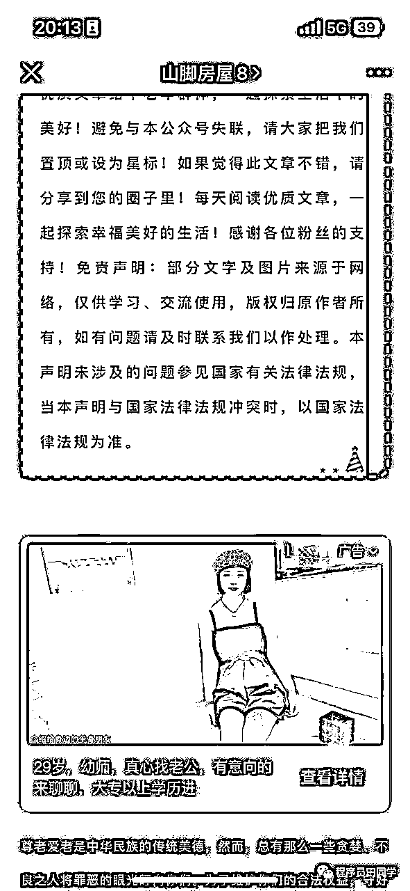

「差之毫厘谬以千里，赚钱细节很重要，不优化点击率永远不会有改变，优化就有机会」。

# 三、沉淀私域

「做公众号爆文，文章被推荐，瞬时达到十万阅读，乍一看成绩斐然，但大部分情况下是昙花一现」。

在我所了解到的一些信息中，大部分都是这样的情况。

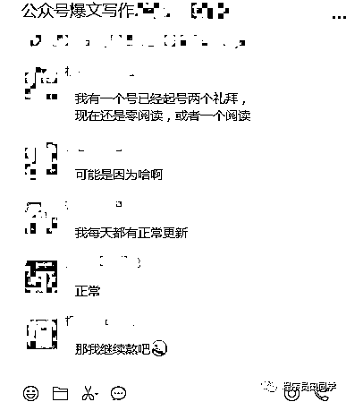

我们给平台供给内容，平台给我们流量收益，这种看天吃饭的感觉很没有安全感。

上个月我在生财分享了一篇文章，亦仁老大评论区的一个角落给予了一个很好的方向——私域群沉淀。

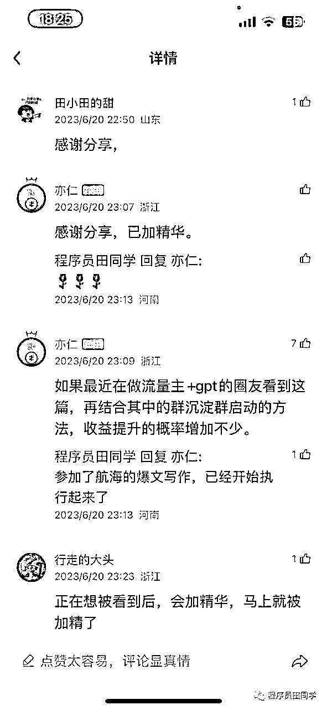

既然我们无法改变平台的推荐机制，但我们可以将流量沉淀到私域群，做到反复触达。具体引流链路可以参考下图，也可自由发挥。

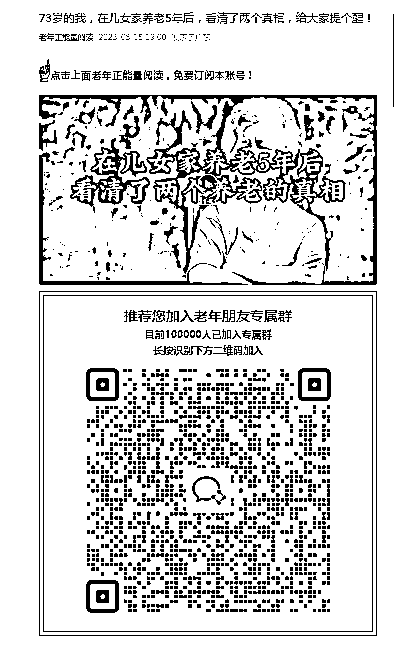

「做公域流量心情忽上忽下，流量沉淀才能提升幸福指数」。

大家如果有什么需要，也欢迎和我交流。