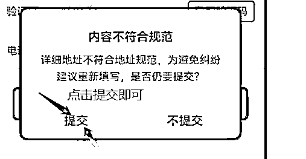

# 拼多多店铺搭建保姆教程

> 来源：[https://lv9qj6hfr4z.feishu.cn/docx/LvvkdB1f2ohYbkx1AgxcYIc9nmg](https://lv9qj6hfr4z.feishu.cn/docx/LvvkdB1f2ohYbkx1AgxcYIc9nmg)

拼多多店铺搭建保姆教程

拼多多店铺注册。首先打开咱们刚刚下载的拼多多的商家版APP。选择0元开店，填写自己本人的手机号码进行注册，获取验证码。点击立即入驻。

潜力商家发现计划是随机出现的 只是一个调研表只是平台的一个小调查，如图所示填写就好了，填完直接提交即可。没有的话也没关系 不影响什么。

现在这一步进行店铺认证的操作，先点击【立即设置】进去填写自己的真实资料即可。（注意：平台默认的经营类目这一栏，一定不要勾选医药健康！！！）。

在认证之前我们仅需要填写店铺名称、以及店铺登录密码。

填写完毕以后点击前往填写资料，看到认证页面，上传自己本人身份证正面+反面照片，照片按照案例拍摄上传。勾选我同意。点击下一步（人脸验证）即可完成店铺实名认证。

身份认证好了以后告诉我下一步哦步骤解析：拼多多跟其他电商平台是一样的， 必须要先进行身份认证才能才能开始经营， 系统要确定是自己在操作开店，不是冒名顶替开的哦！（如需设置密码，请按照 Aa135246- 这个密码格式进行设置 可以做个参考）

嗯 店铺名字是需要你自己想一个的哦 发挥一下想象，店铺名这个东西简单一点 让人印象深刻一些就可以了哦。如果店铺名字被使用 前面或者后面加字母即可！

密码是需要 大写字母+小写字母+数字 组成的哦

加起来要大于等于8位

例如：Abc123456

还是刚刚的位置 点击店铺简介，把这句话添加进去：以信誉第一为宗旨，始终保证产品的质量为您提供优质的服务。本店新开张，诚信经营，以顾客第一为宗旨，每样商品都是低价销售，欢迎选购。

1.点击发布宝贝

2.复制老师发给你的标题（下面这一句话）：餐厅家用多功能桌面纸巾盒木质塑料抽纸盒客厅卫生间纸巾盒

3.在宝贝标题出粘贴标题（商品分类自动生成）

4.点击小照相机选择相册去选择刚刚保存的图片

5.设置拼单价：9.9。单买价自动生成，如未自动生成，按图设置即可。

6.设置库存为100

7.完成后点击创建 显示发布中 就是创建成功了

8.返回下拉刷新一下 主页 工具栏 就出现了

现在我们操作【运费模板设置】

先点击进入手机拼多多商家版首页，点击常用应用，然后点击-【物流工具】--【运费模板】

模板名称：一件代发

发货地：广东省 / 广州市 / 天河区

计费方式：按件数计费

然后按照图示的步骤操作完成后，截图给我，然后我们继续下一步，具体操作步骤如下图：

注意 ！：

1\. 香港 澳门 台湾，内蒙古，青海，甘肃， 宁夏，海南，取消打钩。选择（合作快递不配送该区域）西藏 新疆删除也选择合作快递不配送该区域

2\. 顺丰包邮切记不可勾选

步骤解析：显示未使用不用担心，后面使用的时候点选这个新建的一件代发模板即可。

接下来我们设置店铺的退货模板哦

点击【常用应用

下拉到最下方找到【地址管理】然后点击【新增地址】

收件人：你自己的姓 加先生或者女士

选择地址区：广东省/广州市/天河区

详细地址： 咨询店铺小二管理

手机号码：填写自己的手机号码

电话号码：可不填

设置完成之后点击【保存】即可，操作步骤如下图：

这一步的操作是为了防止消费者随意退回商品，然后设置详细地址：咨询店铺小二管理，就完全可以杜绝这个问题。

下面点击我的--设置--【聊天管理】，找到【开场白和常见问题】，点击进去设置常见问题

问题1：有货吗？

答案：亲，可以下单就是有货的呦~如果喜欢的商品已售完，建议收藏关注是否还会补货上架，或选购其他商品哦~

问题2：发什么快递？

答案：亲，仓库会根据亲的地址选择最合适的快递的哦~默认快递为：圆通，韵达，中通，比较偏远的地区或发邮政。

问题3：什么时候发货？

答案：亲，下单成功后正常下午5点之前的当天发货，5点之后的第二天发货，一般我们会在48小时内发货，还请您耐心等待~

注：虽然我们设置了自动回复，但是也可能因为各种原因导致没有自动回复成功，所以我们一定要注意有没有客户咨询哦， 最近官方严查，如果有消费者咨询未回复的话，严重是会导致封店的哦，所以的话同学每天晚上9.00-10.00的时候一定要去查看一下店铺后台是否有未回复的消息

【客服考试】现在要把自己店铺的客服系统开通，这样能够让我们及时的查看到客户的消息以及回复解答客户的问题~在店铺首页-点击下面的消息-然后点击参加考试，进行客服考试就可以了~

步骤详解：客服系统的开通能让我们与客户之间进行详细沟通，增加订单成交性，参加考试的时候 ，严格按照我发的答案，根据我发的答案去选择答案填写，不要填错了，否则答题会变更顺序对不上。

现在打开拼多多软件（买家版）点击上方搜索按钮，然后看图点击小三角选择店铺，输入店铺名称即可找到你的店铺了。

然后学习【下架商品】先打开商品管理---找到该件商品---再点击下架

接下来，学习操作店铺基础营销工具【限时限量购】打开手机拼多多商家版后台---然后点击【常用应用】---找到【限时限量购】，点击进去---然后点击下方的【立即创建】，然后选择右上角的【限时促销】，设置内容如下图所展示，设置完毕截图告诉我。（图片请查看原图）

【营销推广课程】

现在我们学习店铺推广课程之多件优惠设置

打开你手机上的拼多多商家版 点击【常用应用】点击【店铺打折】再点击中间的【自定义创建】，进去后页面我们再选择指定商品设置，详情操作步骤请严格按照图片内容步骤操作，不会的地方截图问我，最后【确认创建】即可。（图片请查看原图）。

【营销推广课程】现在我们学习营销推广课程之多多进宝设置打开你手机上的拼多多商家版---然后点击【全部应用】----【多多进宝】进去，然后选择【全店推广】进去点击【佣金比例】设置。一般建议设置为【5%】。设置好了点击【确定】即可开通推广。

【营销推广课程】徒弟现在我们学习营销推广课程之【新客立减】设置。打开手机拼多多商家版后台---然后点击【营销】-往右边拉--找到【新客立减】点击进去---然后点击立即创建---选择商品---设置金额（一般1-2元）---完成创建

步骤解析：多多进宝是属于站外推广，设置一定比例的佣金会有专门的推手负责我们店铺商品的站外推送，也是最直接有效的方法之一（图片请查看原图）。

拼多多商家版打开，点开常用应用后点击箭头处（店铺装修），进去后点击新建一键装修，选择喜欢的装修风格后即可提交使用

现在拼多多搜索你的店铺，看看装修效果，店铺美观度上去后，是可以提升店铺的下单转化率的

现在打开手机拼多多商家版，点击【店铺】然后点击【数据中心】在数据中心里面我们可以看到所有产品数据，包括订单数据，访客数据，流量数据，等等。我们可以通过实时，日报周报等数据测研我们的店铺情况。亲的店铺属于刚刚创建，产品也刚刚上架，没有数据是很正常的现象，我们有了产品就可以根据实时的数据做出调整。

这个里面是店铺订单成交之后，买家收到货了 评价的反馈情况，如果有差评的话分数会变低，后续经营店铺可以根据数据去调整我们售卖的商品。这个地方是店铺的领航员数据，一般都是5星，店铺有订单数据之后会变成4星5星，如果低于了店铺流量就会变少哈，后续需要实时查看优化。店铺上架好了商品也要让其发酵，后续再根据反馈的情况来规划