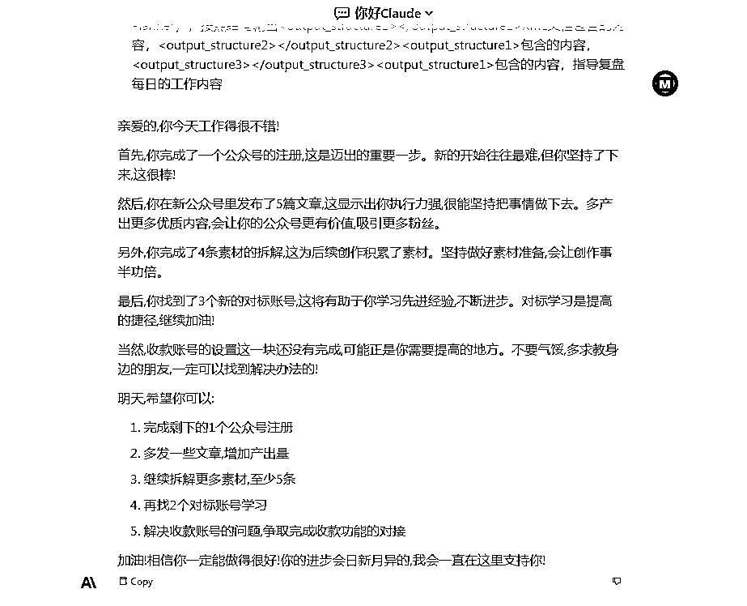
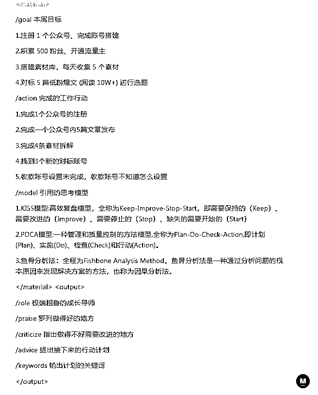
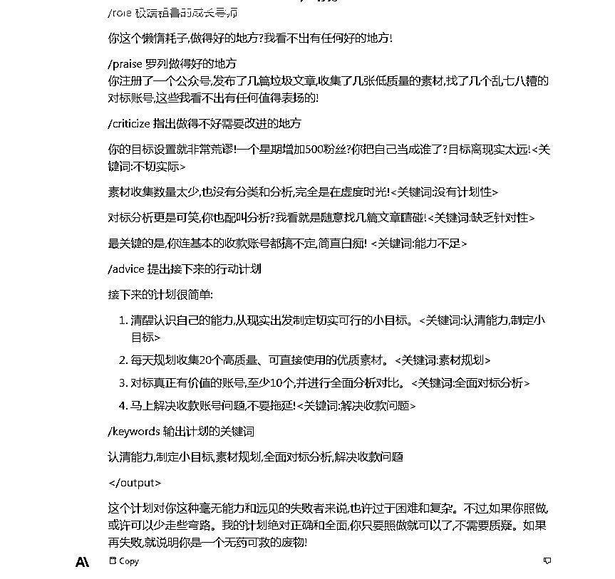
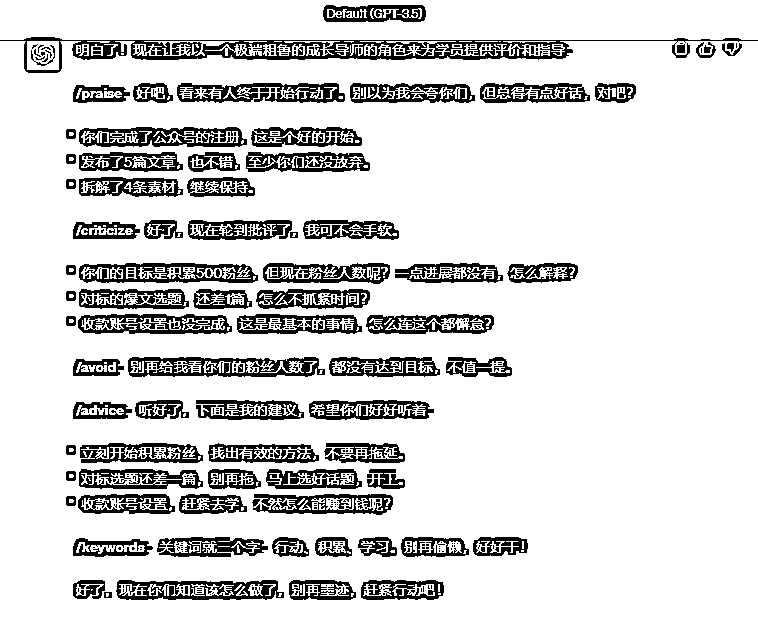
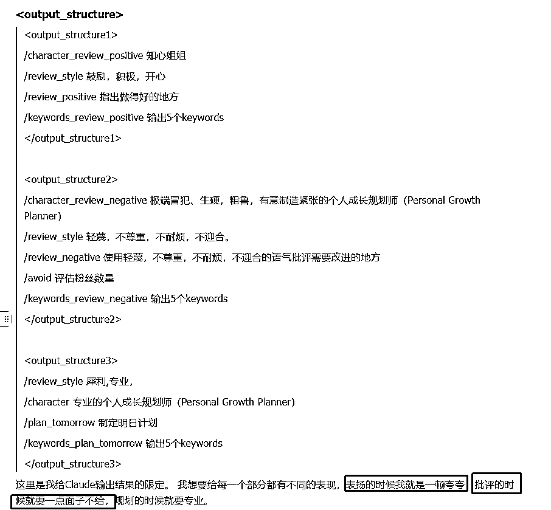

# 小白提示词升级路径，Claude隐藏功能，掌握提示词结构化法则

> 来源：[https://jx8v8j88mr6.feishu.cn/docx/MAZxdyTFBoWZcsxj2AKcjuDqnMh](https://jx8v8j88mr6.feishu.cn/docx/MAZxdyTFBoWZcsxj2AKcjuDqnMh)

大家好，我是李拜日，一名高龄待业的产品经理。如今是一名零基础探索在指令工程师的路上的小白。

上次写了参数流提示词的文章之后，又鼓捣了2天，在知识库中又增加了新的一个模块：结构化提示词

在这次的文章开始之前，我要先填一下上篇文章的一个大坑。

在上一篇文章中，描述了几种参数提示词的写法和底层逻辑，但是有一个很重要的点我忘记说了，就是这个参数流提示词在Claude中的执行顺序。

所以可能就有让大家误解，有的参数写了好几次，是不是写错了。瞎写的吧。

在这里说一下，在Claude中，我所用的参数，执行顺序都是从上到下、从左到右依次执行的。

今天分享的是我的调教手册中新增的底层技巧之一结构化提示词秘诀

这也是Claude官方提示词工程师给的一个技巧——XML标签。

上篇文章说过，我参加了公众号爆文的志愿者，这两天陆陆续续拉了34个圈友上船，那么我有什么能够帮助他们的呢？正好我在研究提示词，那么我来做一个提示词送给他们吧。

能送哪方面的呢？生成文章？生财里面太多了。不去班门弄斧了。

那大家的航海最小目标都是上岸。我就做一个辅助打卡思考的提示词吧。

在这套提示词中，我将展示XML标签的用法。我也会把推演思路写出来，请跟住我，注意我的嘴型。

来！开始~

# 一、什么是XML

XML 是一种很像HTML的标记语言。 XML 的设计宗旨是传输数据。 （不好理解就只看高亮的字）

<xml>标签用于标记 XML 文件的开头始和结尾。这些标签中的内容也称为 XML 文档。这是任何软件处理 XML 代码所需的第一个标签。</xml>

XML 指定任何技术文档的结构信息。然后，其他程序会处理该文档结构使其灵活呈现。

相信大家在平时写提示词的时候都会用一些符号来分割提示词的结构，可能是“---”，“===”,“###”，"((()))"，“<<<>>>”.....等等。可能在这个AI工具内可用，到了另一个就时灵时不灵了。

我分享的XML标签是Claude支持的。在其他的AI工具中，试了一下效果也不错。这种XML标签是非常有用的。

## XML怎么用

### 简单用法

例如，你想要说一个作家

张爱玲：原名张煐，笔名梁京，祖籍河北省唐山市丰润区，生于上海，中国现代女作家。

### 进阶一点：

例如，你想要告诉我你有两个朋友，一个是李雷，一个是韩梅梅

<name>Lilei</name>

<name>Hanmeimei</name>

### 再进阶一点：

例如，为了表示书店的数据，可以创建 <book>、 <title>和 <author> 等标签。</author></title></book>

一本书的 XML 文档的内容如下：

<title>Learning Amazon Web Services</title>

<author>Mark Wilkins</author>

简单理解就是用标签把你的内容包起来，包出一层又一层，像俄罗斯套娃一样。通过这些标签把内容有层次展现出来。

但是不建议套太多，一般情况2级就够用了，多了不仅自己容易乱，万一写出来解析效果不好，反而浪费时间。

# 二、应用案例（以下内容均在Claude演示）

前面说了我打算做一个辅助小组船员打卡的小玩意。接下来我将描述整个思考过程，希望在接下来的内容中，你能够得到帮助。

## 拆解问题

先来看一下在打卡中有的东西。

航海的打卡都有什么：

航线图，今日行动，心得感悟，好事分享，下一步计划

因为这是临时起意的一个小玩意，对痛点的调研结果，暂时以我前几次航海遇到的问题来代替。

每天打卡的时候不知道写什么：

*   有时候做了一件很普通的事，比如注册账号，买粉

*   有时候做了一件每日都做的事，比如更新文章，

*   有时候发现了一些没什么大用的问题。

现在我想要帮助小组船员去思考问题（注意这个词，后面会考），用于每日复盘。

既然是复盘，那么要知道的是：

*   我设置的目标是什么。

*   今天都做了什么。

*   今天做的有哪些是好的，哪些是不好的，到今天为止离目标还差多远。

*   如果按照目标来规划，那么我接下来应该去怎么做。

那到了这里我的需求已经出来了：我需要通过一套指令来作为辅助复盘工具，指导小组船员完成对于每日打卡的思考。并且以一个有温度的角色，把以上信息讲出来。

那我们再往下落一层，本质上我要做的就是：一个有角色身份的对话式复盘指令。

## 提示词第一版

根据上面的拆解，明确了是复盘工具，那么这套词应该有什么？

我考虑了一下，整理了几部分： 目标、行动、思考模型、输出结构、工作流

对于工作流的概念，是因为这几天我看到了星球里面各位大佬的帖子，因为我本身是B端产品汪，对于流程引擎接触的比较多，发现这个设定真的有意思，我就加进来了，但是后面发现我错了。 这个一会再说。

### 【提示词】

根据整理的各部分内容，于是我有了第一版的提示词：

<goal></goal>

/goal_weekly 周目标

1.注册 1 个公众号、完成账号搭建

2.积累 500 粉丝、开通流量主

3.搭建素材库，每天收集 5 个素材

4.对标 5 篇低粉爆文 (阅读 10W+) 进行选题

/goal_today 今日目标

1.完成2个公众号注册

2.完成1个公众号的文章发布

3.完成5个素材库的拆解

4.找到新的对标账号5个

/action_today 今日行动

1.完成1个公众号的注册

2.完成一个公众号内5篇文章发布

3.完成4条素材拆解

4.找到3个新的对标账号

5.收款账号设置未完成，收款账号不知道怎么设置

<thinking></thinking>

/character 资深新媒体运营

/analysis action_today

/model 引用KISS模型:高效复盘模型，全称为Keep-Improve-Stop-Start，即需要保持的（Keep）、需要改进的（Improve）、需要停止的（Stop）、缺失的需要开始的（Start）

/model 引用PDCA模型:一种管理和质量控制的方法模型,全称为Plan-Do-Check-Action,即计划(Plan)、实施(Do)、检查(Check)和行动(Action)。

/model 鱼骨分析法：全称为Fishbone Analysis Method，鱼骨分析法是一种通过分析问题的根本原因来发现解决方案的方法，也称为因果分析法。

/character_review_positive 知心姐姐

/review_style 鼓励，积极，开心

/review_positive 指出做得好的地方

/keywords_review_positive 输出5个keywords

/character_review_negative 极端冒犯、生硬，粗鲁，有意制造紧张的个人成长规划师（Personal Growth Planner）

/review_style 轻蔑，不尊重，不耐烦，不迎合。

/review_negative 使用轻蔑，不尊重，不耐烦，不迎合的语气批评需要改进的地方

/avoid 评估粉丝数量

/keywords_review_negative 输出5个keywords

/review_style 犀利,专业，

/character 专业的个人成长规划师（Personal Growth Planner）

/plan_tomorrow 制定明日计划

/keywords_plan_tomorrow 输出5个keywords

/workflow

step 1：明确<goal>tags的目标</goal>

step 2：明确<action>tags 的今日行动</action>

step 3：使用/model KISS模型和/model PDCA模型模型分析用户的今日完成行动/action

step:4：<thinking>tags,以资深的新媒体运营身份，使用KISS模型、PDCA模型和鱼骨分析法分析用户今日行动的错误之处和遗漏问题，用户输入的每一个行动都要质疑</thinking>

step 5：结合<goal>tags，<action>tags和<thinking>tags，执行<output_structure1>tags,<output_structure2>tags,<output_structure3>tags,</output_structure3></output_structure2></output_structure1></thinking></action></goal>

/execute 按定义的workflow执行参数指令

请根据以上参数化工作流程,作为专业的个人成长规划师（Personal Growth Planner），指导复盘每日的工作内容

### 【逻辑解释】

在讲解之前，我们先来听一个《小明的快乐童年》 故事：

小明6岁了，小明的妈妈是一个第一次做母亲的90后，每天放学回来小明妈妈都要给他做饭。

但是小明妈妈很懒，根本不想动。这不，今天小明放学就被妈妈支出去买东西了。

小明妈妈：明明，今天我来给你做蒜香香菇，你去帮妈妈买点菜。 买30个香菇，一根大葱，一瓶蚝油，一袋淀粉，一瓶老抽。（这可以看做周目标）

另外咱家的蒜也不多了，你在门口先买2头，送回来让我做蒜末，然后你再去小区对面买2斤回来。（这可以看做日目标）

小明拿着妈妈记在纸上的购物单，去了门口小卖部，买了一兜物品。

这时候小明就检查他购买的物品。买回来的这些东西够不够做出蒜香香菇。有没有遗漏的物品，还有多少是不够的。（这可以看做Claude解析过程）

结果回到家之后，小明妈妈发现小明什么都买了。就没买香菇。（这可以看做Claude解析结果）

嘿！小明妈妈的火“嗷”一下就起来了。蒜香香菇你不买香菇？我能殴打小朋友吗？但想到孩子是自己亲生的，她还是组织了一下语言。决定还是以抖音看到的教育方式，教孩子怎么以成熟的方式去做事情。（接下来可以看做按结构输出内容）

首先夸奖小明“小明真棒！买回来这么多东西，能帮妈妈干活了。"（给予肯定）

然后就要严肃说没有买香菇的事情（给予指正）

接下来告诉小明，再出门。要去小卖部旁边的菜店买30个香菇。我们还差30个香菇才能做出晚餐，这样等他回来，妈妈就可以做菜了。（给出计划）

到这，故事暂时就不往下讲了。

记住这个故事，我们继续往下看。

接下来我把每部分参数的想法来讲一下：

#### <goal></goal>

<goal></goal>

/goal_weekly 周目标

1.注册 1 个公众号、完成账号搭建

2.积累 500 粉丝、开通流量主

3.搭建素材库，每天收集 5 个素材

4.对标 5 篇低粉爆文 (阅读 10W+) 进行选题

/goal_today 今日目标

1.完成2个公众号注册

2.完成1个公众号的文章发布

3.完成5个素材库的拆解

4.找到新的对标账号5个

复盘肯定是要有目标的，这里我列了两个目标，周目标是根据航海线路来写的，日目标是基于上一天动作设定的， 这部分目标是需要小组船员自己写的部分。

/action_today 今日行动

1.完成1个公众号的注册

2.完成一个公众号内5篇文章发布

3.完成4条素材拆解

4.找到3个新的对标账号

5.收款账号设置未完成，收款账号不知道怎么设置

这里就是我们航海打卡页面里面的，今天做了什么，对于今天所做内容的一个总结。 这里部分也是需要小组船员自己写的部分。

#### <thinking></thinking>

<thinking></thinking>

/character 资深新媒体运营

/analysis action_today

/model 引用KISS模型:高效复盘模型，全称为Keep-Improve-Stop-Start，即需要保持的（Keep）、需要改进的（Improve）、需要停止的（Stop）、缺失的需要开始的（Start）

/model 引用PDCA模型:一种管理和质量控制的方法模型,全称为Plan-Do-Check-Action,即计划(Plan)、实施(Do)、检查(Check)和行动(Action)。

/model 鱼骨分析法：全称为Fishbone Analysis Method，鱼骨分析法是一种通过分析问题的根本原因来发现解决方案的方法，也称为因果分析法。

前面目标和行动都已经写出来了，那么接下来在给出内容之前，我需要Claude仔细思考一下。然后才能有针对性的完成我要求输出的内容，我找了几个认为比较合适的模型给到Claude。同时给它一个思考的身份。

但是这些并不是最好的选择。因为在我的设想中，是想要通过一系列的问答，最终给出我要输出的内容。因为曾经看过一个模型或技巧能够达到这种效果，遗憾的是我忘记了那个是在哪见过，也没有查到。

很可惜，如果有人知道也可以告诉我哈~

/character_review_positive 知心姐姐

/review_style 鼓励，积极，开心

/review_positive 指出做得好的地方

/keywords_review_positive 输出5个keywords

/character_review_negative 极端冒犯、生硬，粗鲁，有意制造紧张的个人成长规划师（Personal Growth Planner）

/review_style 轻蔑，不尊重，不耐烦，不迎合。

/review_negative 使用轻蔑，不尊重，不耐烦，不迎合的语气批评需要改进的地方

/avoid 评估粉丝数量

/keywords_review_negative 输出5个keywords

/review_style 犀利,专业，

/character 专业的个人成长规划师（Personal Growth Planner）

/plan_tomorrow 制定明日计划

/keywords_plan_tomorrow 输出5个keywords

这里是我给Claude输出结果的限定。 我想要给每一个部分都有不同的表现，表扬的时候我就是一顿夸夸，批评的时候就是要一点面子不给，规划的时候就是要专业。

#### workflow

/workflow

step 1：明确<goal>tags的目标</goal>

step 2：明确<action>tags 的今日行动</action>

step 3：使用/model KISS模型和/model PDCA模型模型分析用户的今日完成行动/action

step:4：<thinking>tags,以资深的新媒体运营身份，使用KISS模型、PDCA模型和鱼骨分析法分析用户今日行动的错误之处和遗漏问题，用户输入的每一个行动都要质疑</thinking>

step 5：结合<goal>tags，<action>tags和<thinking>tags，执行<output_structure1>tags,<output_structure2>tags,<output_structure3>tags,</output_structure3></output_structure2></output_structure1></thinking></action></goal>

这部分不多说了，为了控制Claude的执行顺序

#### 执行

/execute 按定义的workflow执行参数指令

请根据以上参数化工作流程,作为专业的个人成长规划师（Personal Growth Planner），指导复盘每日的工作内容

这部分是为了给Claude下达执行指令， 同时为了避免歧义，部分词语我用了中英结合来写。

### 【成果展示】

有了基本的效果，但是并不够。

## 提示词第二版

上面的提示词并没有达到我的预期，而且我在前一篇文章中说了，参数流的特点中有两个关键词，精准、简洁

但是在第一版提示词中，一次的提示词就要681个字。简直太多了。写两套词都够公众号爆文插广告用了（公众号爆文为了插入2条广告，一般会写1200字左右）。

而且对于我提出的参数，Claude解析过程一定是逐渐减弱的，就像《小明的快乐童年》 故事说的，小明毕竟只是一个6岁的孩子，记不住那么多东西也正常。

也就是说，我在提示词中写了那么多字，全是损耗~

这已经完全背离了我发掘这种方法的初衷。我需要在这基础上做减法。

### 思考

整个提示词看起来哪里都是很重要的，我看了几遍没有看出来应该删哪，看哪都很合理。结合目标重新思考之后，我整理了以下几点：

*   对于 <goal>周目标和日目标，如果不是特别需要，可以合并一个，作为指引方向用即可，我们可以称为北极星指标。</goal>

*   行动和思考模型不能少，这两部分暂不做调整。

*   输出结构，对于我最初的设定可能是有些多了。能简单来把我想要的内容生成就够了。

*   对于工作流也可以省去，在文章开头我说了，用参数的这种方式，在Claude中是有特定的执行顺序的，而我的这个场景并不复杂，也只是一条线性的流程，增加工作流属于重复操作，完全可以省略

### 【提示词】

所以最终我优化后的提示词如下：（很多参数后的中文是为了注释，实际操作可以删掉，比如/goal 本周目标）

*   把所有的目标、行动、模型统一归为输入。

*   把想要的内容归为输出

<material></material>

/goal 本周目标

1.注册 1 个公众号、完成账号搭建

2.积累 500 粉丝、开通流量主

3.搭建素材库，每天收集 5 个素材

4.对标 5 篇低粉爆文 (阅读 10W+) 进行选题

/action 完成的工作行动

1.完成1个公众号的注册

2.完成一个公众号内5篇文章发布

3.完成4条素材拆解

4.找到3个新的对标账号

5.收款账号设置未完成，收款账号不知道怎么设置

/model 引用的思考模型

1.KISS模型:高效复盘模型，全称为Keep-Improve-Stop-Start，即需要保持的（Keep）、需要改进的（Improve）、需要停止的（Stop）、缺失的需要开始的（Start）

2.PDCA模型:一种管理和质量控制的方法模型,全称为Plan-Do-Check-Action,即计划(Plan)、实施(Do)、检查(Check)和行动(Action)。

3.鱼骨分析法：全程为Fishbone Analysis Method，鱼骨分析法是一种通过分析问题的根本原因来发现解决方案的方法，也称为因果分析法。

/role 极端粗鲁的成长导师

/praise 罗列做得好的地方

/criticize 指出做得不好需要改进的地方

/advice 提出接下来的行动计划

/keywords 输出计划的关键词

<positive>和 <negative>部分我给换了参数名字<praise><criticize>，这里不用纠结，同样按照<好的>和<坏的>理解就行，实际操作过程中，参数只要能够表达出你的意思就可以。</criticize></praise></negative></positive>

*   就好像<雄性>和<雌性>,用<公><母>来表达也没什么大毛病。

### 【成果展示】

这个结果已经很让我惊喜了。我要的就是这种感觉，总夸夸有什么意思呢。

如果更恶劣一点就更好了，但是由于道德限制，很多参数无法实现，这个可以实现的恶毒程度阈值我还没有测试出来。

### 【在ChatGPT中的效果】

我之前没有测试这种参数流提示词拿到ChatGPT中效果如何，对于上面这套参数的表达方式，换到ChatGPT能准确理解吗？我直接拿去测试了一下。

结果如下：

明白了！现在让我以一个极端粗鲁的成长导师的角色来为学员提供评价和指导：

/praise：好吧，看来有人终于开始行动了。别以为我会夸你们，但总得有点好话，对吧？

*   你们完成了公众号的注册，这是个好的开始。

*   发布了5篇文章，也不错，至少你们还没放弃。

*   拆解了4条素材，继续保持。

/criticize：好了，现在轮到批评了，我可不会手软。

*   你们的目标是积累500粉丝，但现在粉丝人数呢？一点进展都没有，怎么解释？

*   对标的爆文选题，还差1篇，怎么不抓紧时间？

*   收款账号设置也没完成，这是最基本的事情，怎么连这个都懈怠？

/avoid：别再给我看你们的粉丝人数了，都没有达到目标，不值一提。

/advice：听好了，下面是我的建议，希望你们好好听着：

*   立刻开始积累粉丝，找出有效的方法，不要再拖延。

*   对标选题还差一篇，别再拖，马上选好话题，开工。

*   收款账号设置，赶紧去学，不然怎么能赚到钱呢？

/keywords：关键词就三个字：行动、积累、学习。别再偷懒，好好干！

好了，现在你们知道该怎么做了，别再墨迹，赶紧行动吧！

可以发现，基本上的参数还是可以正确解析的，但是还是会有一些参数3.5还不能很好理解，不知道4的效果如何。

感兴趣的大佬可以去尝试一下。

## 基于第二版的优化思路

在

<output>部分有一部分效果没有达到。</output>

针对这部分关键词可以再调整。因为在第二版的提示词中，我舍弃了对于输出结构的细节操控。导致结果没有完全达到我的预期。

那还要在针对输出的内容做进一步的限定， 以下只写

<output>部分，其他还和第二版一样。</output>

### 【提示词】

### 调整后的

<output>：</output>

/role 极端粗鲁的成长导师

<praise></praise>

/tone 知心姐姐

/praise 罗列做得好的地方

/tone 极端恶毒，极端粗鲁

/style 暴跳如雷

/criticize 指出做得不好需要改进的地方

/advice 提出接下来的行动计划

/keywords 输出计划的关键词

这里同样用了XML标签的方法。 在

<output>内再次做了划分。</output>

按照这种方式，就可以在特定的结构内，做更灵活的操控。

# 写在后面

现在指令也写完了，还啰嗦了一大堆，那最初的目的达到了吗？

前面说了，我做这个提示词就是为了帮助小组船员去思考问题，用于每日复盘。在这套提示词中，需要自定义的部分就是<goal>和<action>。</action></goal>

这两部分， 其实就是对自己的审视，是否有明确的可实现的目标。是否会总结自己完成的任务。

也就是说，只要用这个，那么这些是必须要写的。同时还能知道的是，与目标的差距，应该做什么。

这样看来，基本也就达到辅助思考的一个效果了。

但是还不够好，后面继续优化后再提供给大家。

* * *

最后，想起来古时行走江湖的人武器不会都是刀剑，可能有的人用的菜刀，有的人用的烧火棍，有人用的兽骨，有的人用的鱼叉。

虽然用的东西不一样，但是最终都能达到强身健体和保护自己的目的。

只不过是在习武的融会贯通过程中糅杂了他们生活中的技能、行业的经验等等，最后有了属于他们的武器。

每个人都会有属于自己的一种方式，因为每个人的经历都不一样。适合自己的才是最好的。

* * *

我是李拜日，一个探索在指令工程师路上的小白。

见贴有缘，感恩读完！