# 4周4万+，免费带领100+互联网小白用GPT参与大众点评项目捡钱

> 来源：[https://zb30cprf4w.feishu.cn/docx/MEZZd1AmCow4k2xdS2gc64G5nEh](https://zb30cprf4w.feishu.cn/docx/MEZZd1AmCow4k2xdS2gc64G5nEh)

# 一、前言

生财圈友们大家好，我是小贝，第一次在生财发帖，如有不足，请多多包涵。

这一次主要分享的是：《四周4w+，免费带100+互联网小白入场大众点评项目捡钱》

我们通过四周的时间，我们不仅完整跑通了一个项目，完善迭代了sop手册，

还多了一群有结果的伙伴们，今天我将这篇文章分享出来，希望能给各位生财圈友带来收获。

在此非常感谢@子潦的介绍，带我们了解了大众点评项目

还要感谢@七小 哥和@EVE 小杰，将这篇文章进行细节润色，化腐朽为神奇。

文章分享前，先来一段自我介绍。

我是小贝

【昵称】 小贝

【坐标】 重庆，985在读

【标签】

AI探索家、校园流量、篮球爱好者

【项目经历】

🔹免费带领100+互联网小白用GPT参与大众点评项目捡钱；

🔹参与操盘撸货项目，带领校园团队赚到第一桶金；

🔹假期独自运营管理一个篮球训练营，参加学员20+

【提供资源】

🔹 GPT、MJ等各类AI账号；

🔹 校园流量后端项目对接；

🔹 篮球相关交流

合伙人是@彦肼

【昵称】彦井

【坐标】南昌

【标签】

19岁大学生创业者，情感博主，黄昏热恋者

【经历分享】

🔹大一下学期尝试过做社群，跑项目，卖课程，半年通过私域收入5w+；

🔹认知觉醒，暑假旅游三座城市去感受世界，突破自我；

🔹为私域中的近50位朋友提供情感咨询，得到大家一致认可；

【提供资源】

🔹情感咨询服务

🔹朋友圈的黄昏照片分享

🔹私域运营交流

先上几张数据图片，四周带百来名朋友实战的成果：

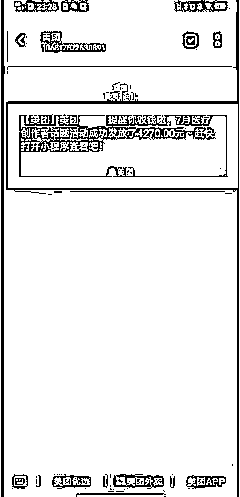

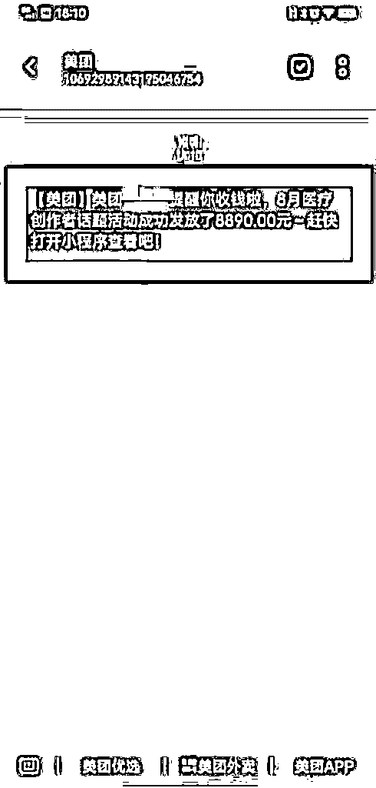

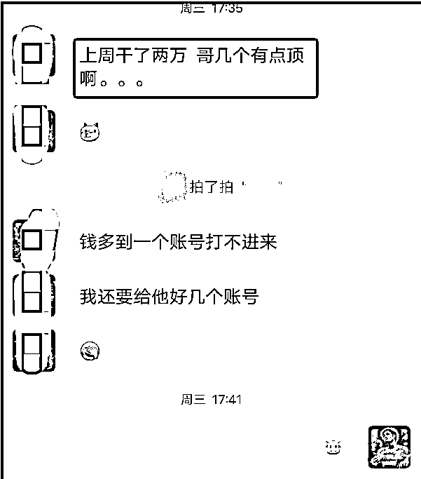

接下来步入正文

# 二、线下见面会与朋友交流，达成合作

7月6号在曹大和张哥的AIGC赋能商业峰会上与好朋友子潦交流，讨论到大众点评的投稿项目

这个项目还确实相对比较小众，便向子潦详细了解了项目信息。

## 1）项目背景

大众点评想要完成内容化转型，致力于提供丰富的用户生成内容来满足用户需求

为了增加平台上的内容数量和质量，大众点评鼓励用户参与投稿活动

投稿者可以通过分享自己的点评、评分和照片来为平台贡献有价值的内容

通过审核后投稿者可以获得平台发布的现金奖励。

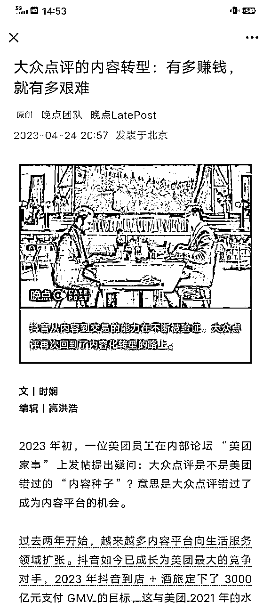

这个项目也就是和大众点评官方合作

在大众点评APP上投稿，通过官方审核获得投稿收益

子潦也已经参与了一个多月，取得一定的成果。

因为我们参与的是AI峰会，自然会交流如何用AI给项目增效

GPT这个文本生成式AI便能够很好的解决这个项目的文案问题。

随着交流逐渐深入，我们越发觉得这个项目大有可为

原因如下：

### 1.项目本身是平台大力推广提倡的

因为是与平台官方合作，不用担心涉及平台的雷区被封号

投稿过程就是平台完成内容化转型的过程，项目本身就是平台大力推广提倡的

平台获得的内容的丰富度，投稿者获得现金奖励，双赢。

### 2.项目门槛不高，小白都可以上手

因为是项目的初始推广期，平台对内容要求相对不高

尤其我们总结好了相关的图片模板再结合GPT生成文案（下文详细说明）

刚入门通过率都在20%—40%之间，熟练后通过率可以达到50%-60%

还是很容易能够拿到结果的。

（下图为部分小伙伴们的实操结果）

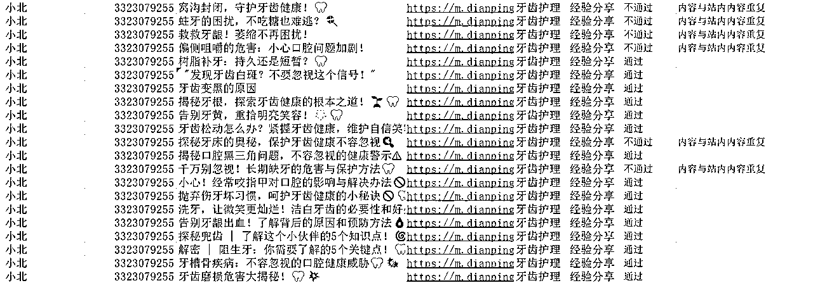

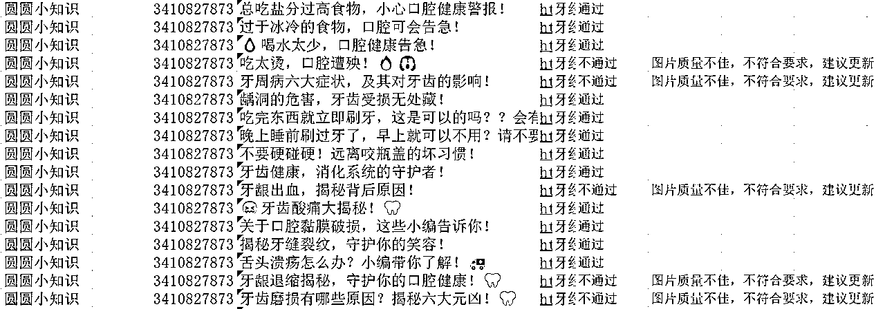

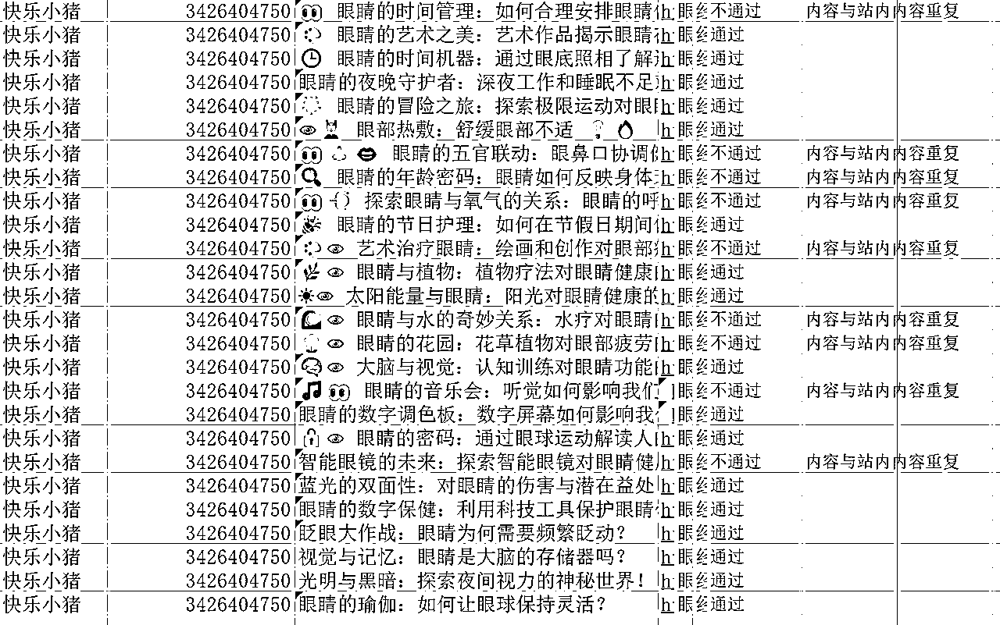

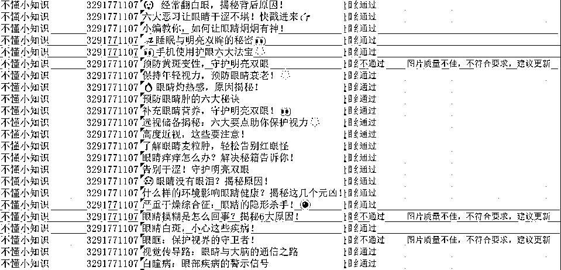

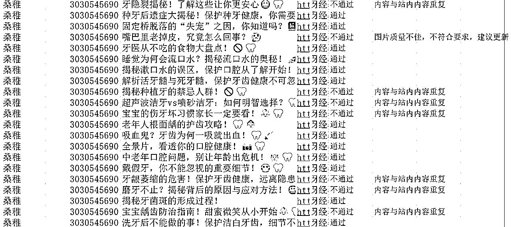

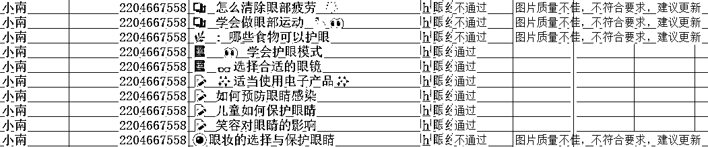

甚至群内有朋友在参加了项目拿到不错的结果后，自发帮我们宣传

把身边同样对互联网项目没太多了解的朋友也拉来一起实战生财！

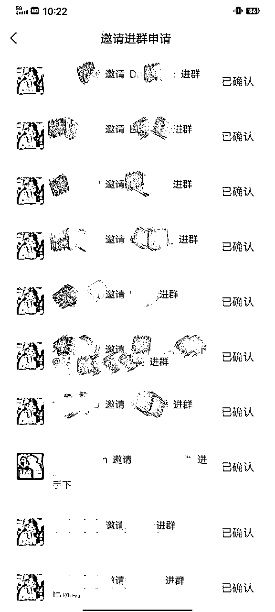

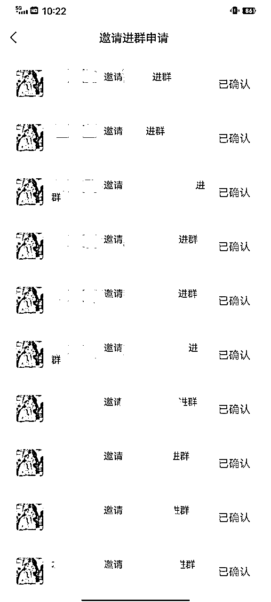

### 3.量大出奇迹，执行就有收益

不需考虑前端引流以及后端成交，只需复制已通过的优秀笔记向官方投稿

一篇笔记制作的时间5—20分钟不等，再结合一定的通过率

可以说是只要你执行了就肯定能有收益

对于互联网小白来说，这个项目用来赚第一桶金再合适不过

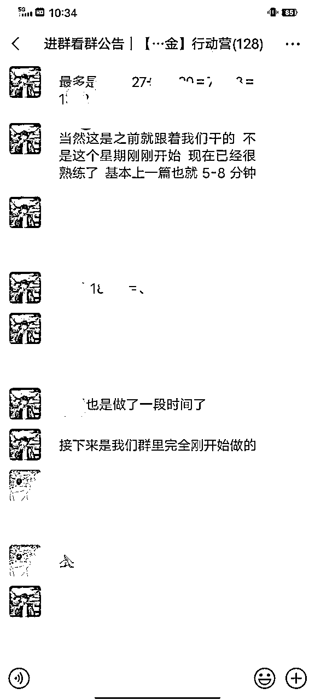

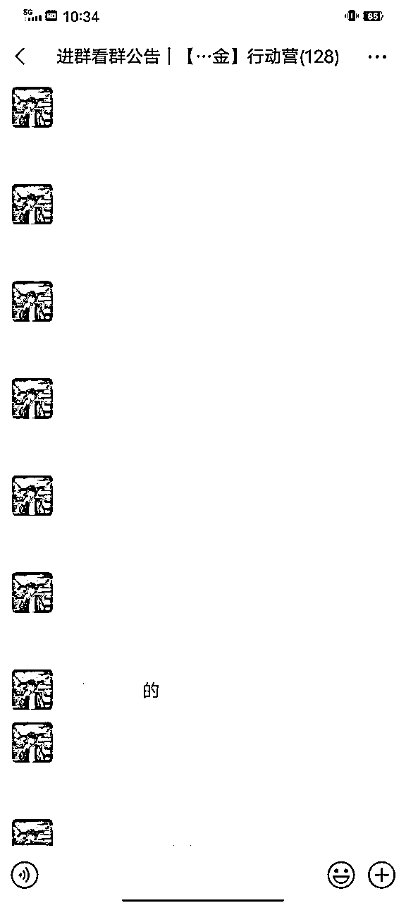

# 三、极致利他，免费带领百名小白迷你航海，走向生财之路

确定好方案后,我们迅速编制出首个项目SOP实践手册

本想收费带其他伙伴共同实战

但思考后,最终我们还是决定举办一次免费的项目培训,带所有信任我们的伙伴一起生财!

## 1）既然官方还处在推广期，就果断入局，躬身实践！

我们在前段时间创立的GPT大学城以及@七小 哥的创富研习社里发了项目的简单介绍

带领社群中信任我们的朋友,进行一次迷你航海之旅!

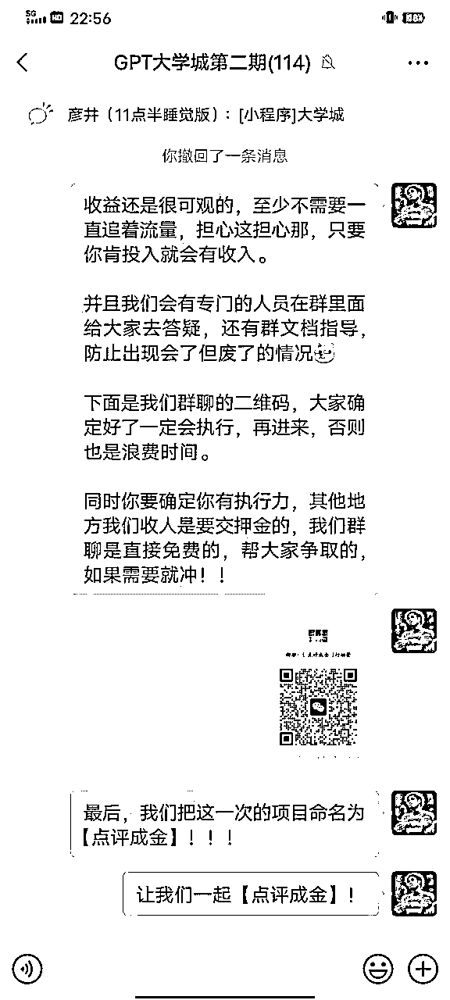

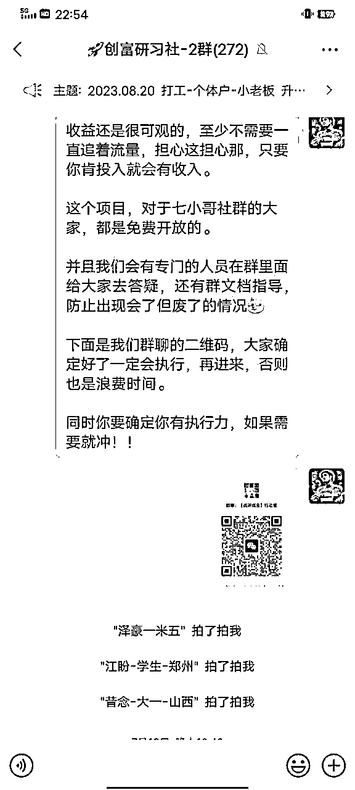

于是，我们正式带领百名朋友入局大众点评项目，其中大部分都是小白，对互联网项目还没太多经验

## 2）跟着执行的朋友，基本都拿到一个不错的结果

第一周入门，第二周熟练，正反馈来的还是挺快的

成功变现的人数也从一开始的几人，慢慢到几十人！

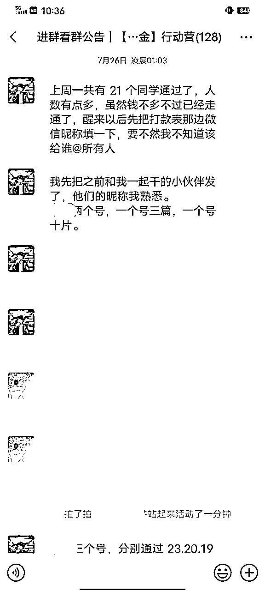

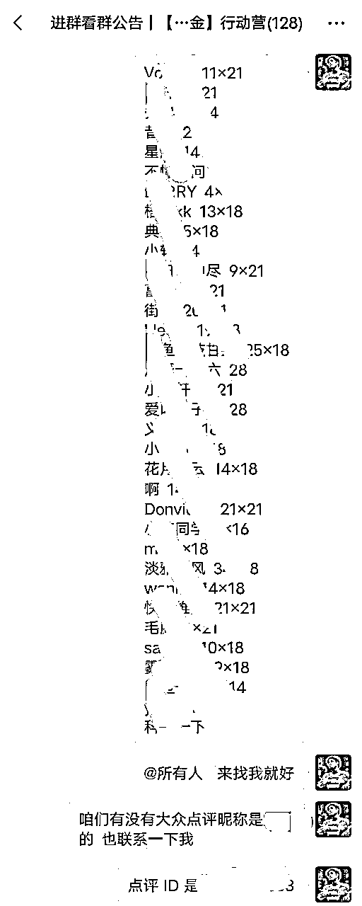

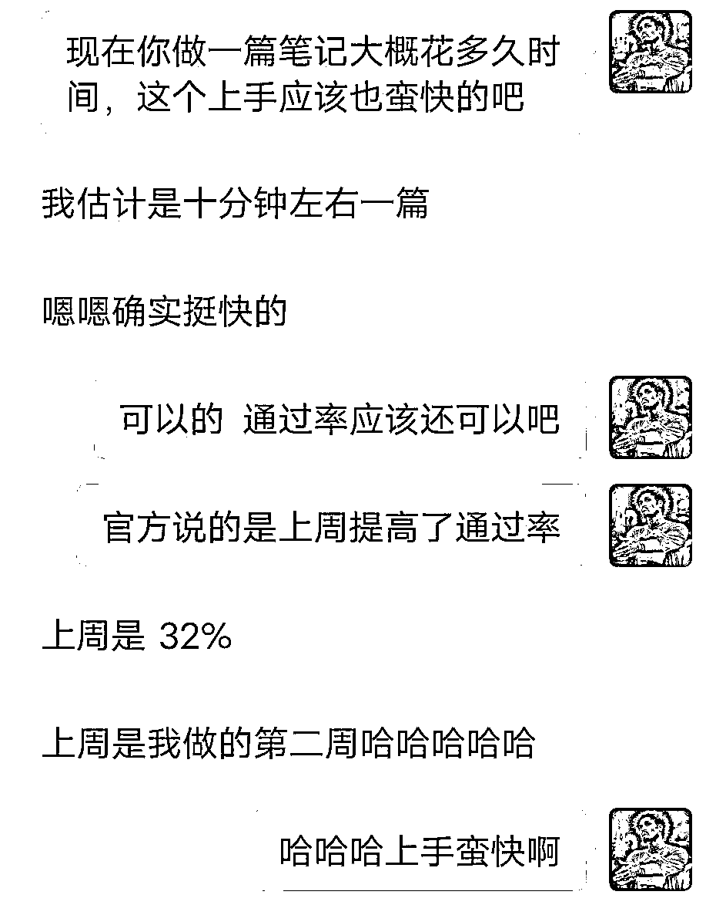

## 3）那这个项目还可不可以入局呢？

可以很负责任的和大家说，是完全可以入局的

并且还是像我之前说的，只要执行就有收益！

只要官方还处于推广期，与我们继续合作，发放投稿奖励

那么这个大众点评的项目是完全可以一直做下去的

直到官方停止推广，相应的投稿奖励也暂停发放为止！

# 四、项目实操SOP手册

接下来就给大家介绍一下我们大众点评项目的整个流程

## 1）注册大众点评白名单

因为是官方和我们主动对接，我们负责给官方统一的白名单

所以大家首先在大众点评上复制自己的昵称和ID，下面介绍一下如何找到自己的ID

找到自己的id：打开大众点评，点开 “我的” —— “ 个人主页”——右上角 “···” —— “分享” —— “复制链接”

将链接粘贴到某一地方， "userprofile” 后面十位数的数字就是大众点评ID

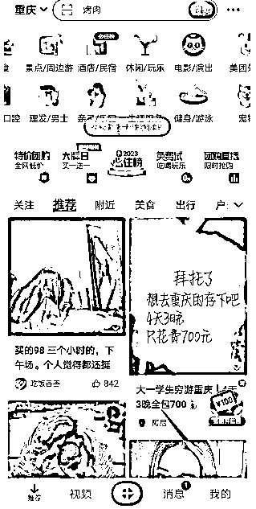

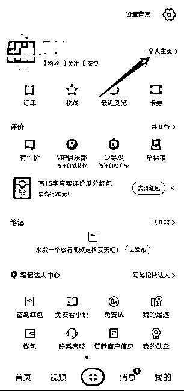

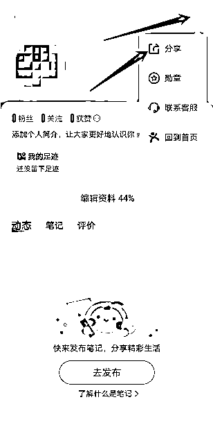

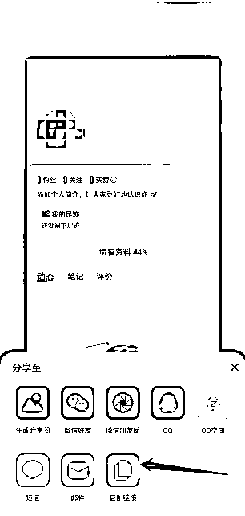

比如：【点小评5553529362 正在#大众点评#分享自己的生活】来大众点评发现好去处 https://m.dianping.com/userprofile/3105409993?shareid=Nx2cLhEnHm_1689147189966的ID就是3105409993

复制下来，填到我们的白名单里面，我们把表格同步给官方，官方会给大家开通。

开通之后，大家就可以按照下面的要求去制作笔记，发到大众点评上面了。

## 2）如何制作大众点评笔记

大众点评笔记和小红书类似，分为两个部分：正文和图片

### 1.正文

这里我们就需要用到GPT了

比如口腔主题，我们让GPT产出50个关于口腔的主题，然后选其中一个主题让它详细说明

一定要注意，把背景说清楚，把要求说清楚，关键词可以和小红书笔记的关键词类似

例如：请你扮演一名文案专家，帮我写一篇300字左右的文案。文案的主题是xxx

要求文案里要有适当的emoji表情，内容生动有趣

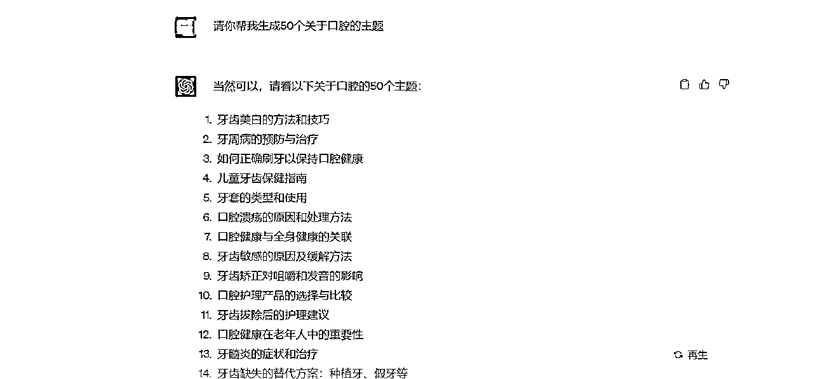

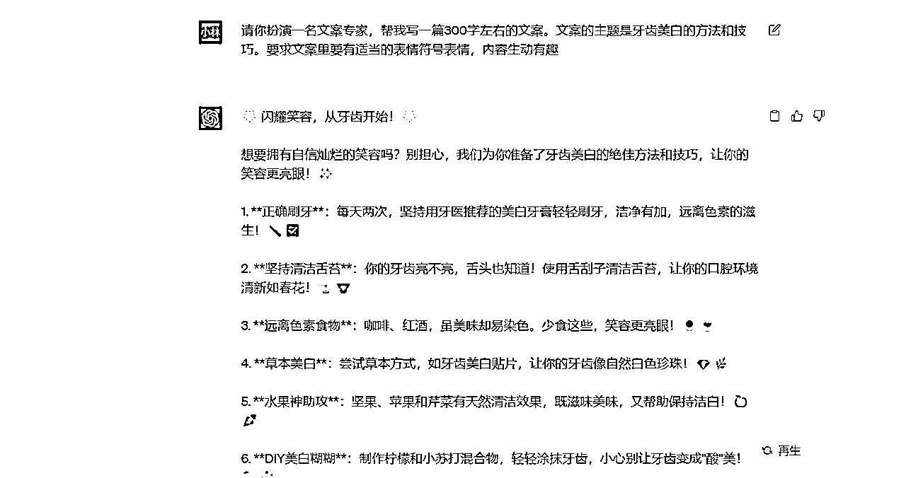

如果说单个小主题产出的内容比较少的话，你可以和他说“单个主题内的内容不少于150个字”

或者你干脆直接再问一个新的问题。“请你以xxx为主题写200字的文案” xxx就是具体的小的主题。

例如我觉得“正确刷牙”这个小主题字数太少，我就和它说：请你以正确刷牙为主题写200字的文案

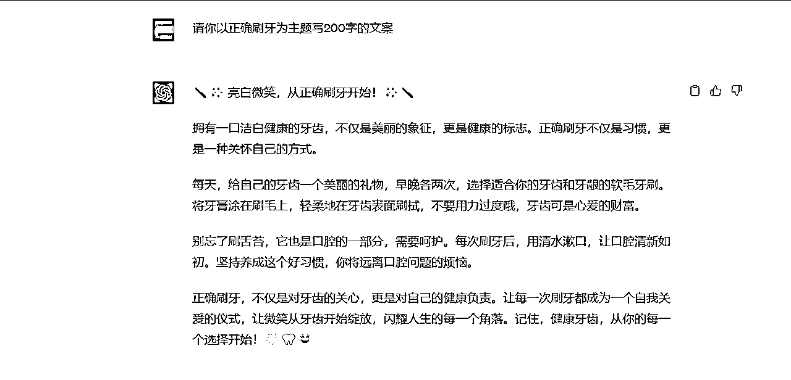

可以看到，生成笔记正文对GPT的应用也不太高，就是基础的关键词替换

对于没有任何GPT基础的小白来说也非常友好

笔记的正文这一部分我们就完成了，接下来是图片

### 2.图片

选择稿定设计或者其他作图软件，套用图片模板

接着将正文分段搬进图片模板，进行一些基本的排版处理即可

下面以“稿定设计”下方左起第二个“模板”为例

给大家看一段大众点评图片制作演示视频

视频也就2分多钟，可以说制作过程并不复杂，但有一些小tips仍然需要我们注意

这些tips是我们吸取了前期通过率不高的教训后，将大量已通过笔记归纳总结得出

也是我们通过率提升如此迅速的核心

制作图片有几点需要注意：

*   图片模板贴纸、卡通元素建议一律删除，越简洁的官方越喜欢。

*   图片模板不要背景有网格状或横竖线的，官方几乎不会通过（类似下图，背景网格状）

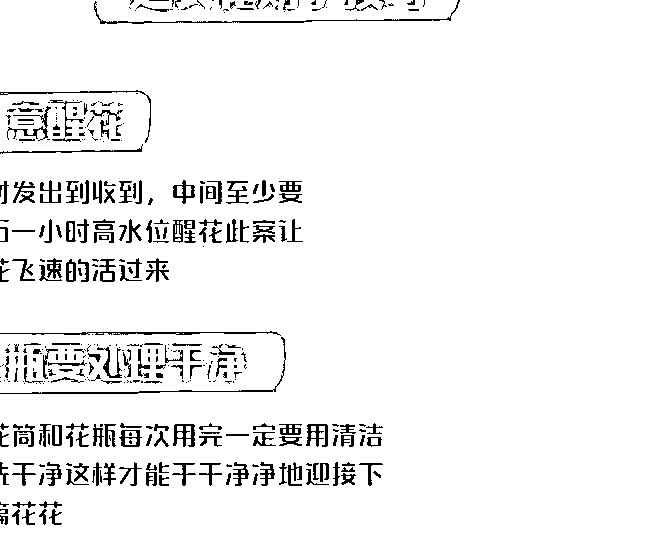

*   图片里的标题、小标题、正文的字号可以直接套用下图标准

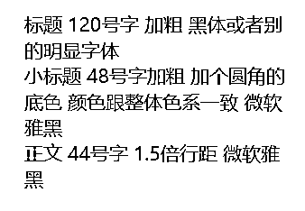

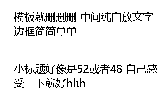

就这样，笔记的正文以及图片两部分就结束啦

## 3）如何上传笔记

### 1.下载大众点评，并完成注册

在应用商店中搜索并下载大众点评，使用手机号进行注册

一个手机可以同时登录两个账号，多个账号可以避免“同质化内容”

### 2.熟悉应用程序的功能和界面

点进大众点评app了解基本功能和界面

### 3.维护基础信息

注册好账号后设立好自己的昵称，性别，头像等基础信息。

接着按上文指引复制自己的个人主页链接。

### 4.制作笔记

参考上文“如何制作大众点评笔记”

注意：拿口腔这个大的话题来说，好好刷牙是一个小的话题

一个小的话题在一个号里面只能发一次，否则会被判内容同质化。

图片模板最多使用两次或者三次，而且只能在一个账号里面发布。

### 5.上传到大众点评App

点击主页面“+”上传即可。

有一点很重要！！！一定要带官方的活动标签# xxx

比如口腔的笔记最后就要加#暑期护牙指南

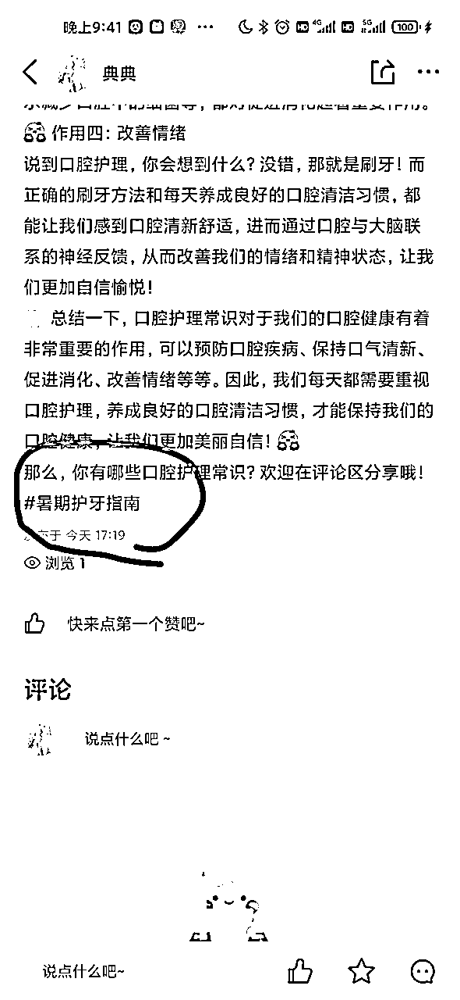

### 6.与用户互动

鼓励与其他用户进行互动，比如及时回复评论等等

可以给自己的笔记增加曝光和影响力

但是不允许互粉互赞，没有任何意义。

# 五、项目收获与感悟

## 1)躬身入局，把握风口

当我了解到好朋友子潦那边在做这个项目的时候，立马去进一步了解项目的具体数据和情况

看看有没有可能去把项目给扩大，把握住这个风口。

在了解完项目之后，我们就立马去小范围内测，有一定效果后

决定免费带100+的朋友去尝试把握风口，躬身入局。

同时实战营里面的大家也都很给力

过去4周，社区内部的总营收达到4万+，

甚至最近这周的总营收达到2w+

越来越多的人参与进来，去下场实战，把握风口。

也越来越多的人可以通过这个项目达到一周收入1k+，赚到自己在互联网上的第一桶金。

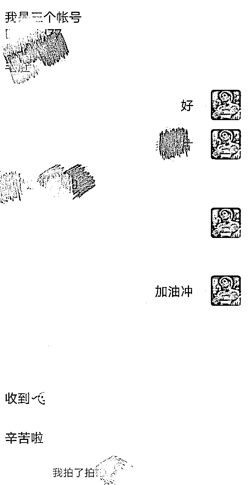

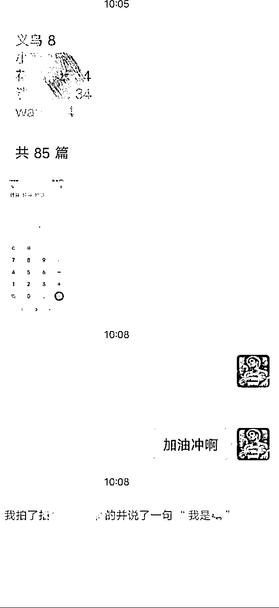

这越发让我相信：当风口来临时，只要我们能够确定好项目的本质和项目的一个整体方向，

那么就不要犹豫立马下场去做，在实操中不断的迭代优化自己的项目sop，提高自己的赚钱能力。

勇敢的人总是提前享受世界！

希望我们每一个人都可以成为一个敢于躬身入局的人，去享受这个值得我们热爱的世界！

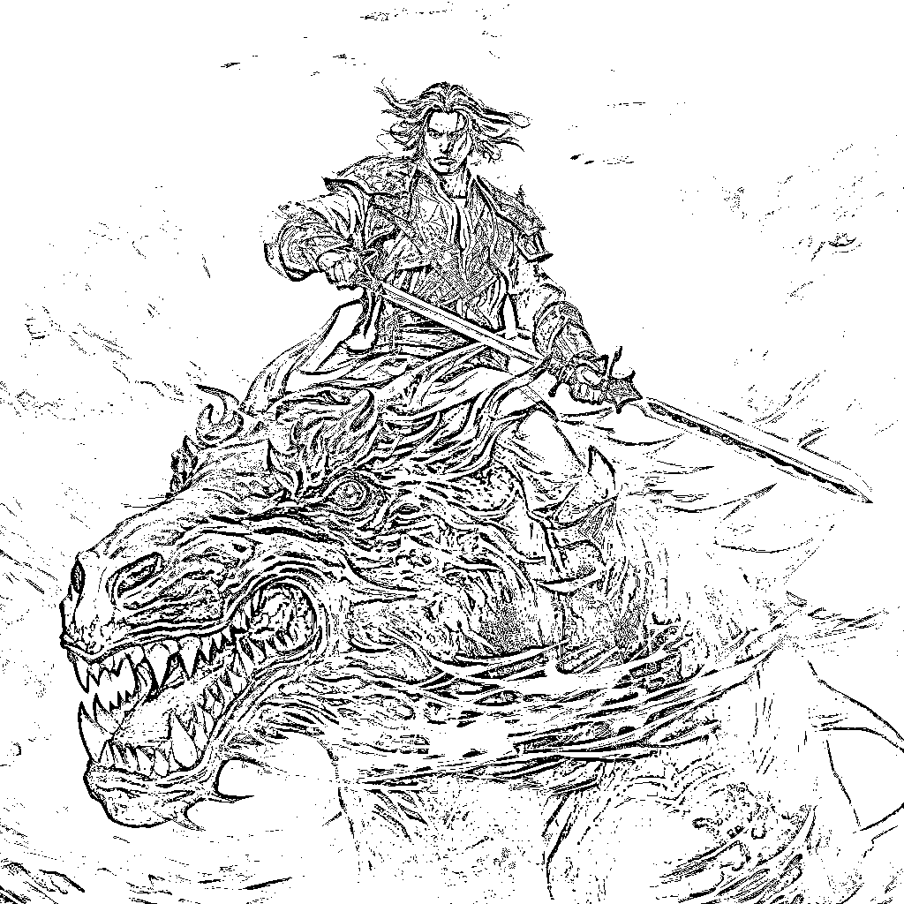

## 2)真诚利他，手留余香

在了解完这个项目之后，我们立马免费带了近百位朋友一起入局，去做这个项目

从最开始的只有几个人做到十几个再到现在三十几个人

有更多的小伙伴愿意去实操，去躬身入局，去成为一个勇敢的人。

同时他们也在不断的去询问如何优化迭代，大家互帮互助

我们也欢迎群内的大家来私聊，一起去优化迭代，让大家的通过率都得到提高。

从项目发布到现在过去四周，我通过帮助大家，

我自己也更加清楚，什么样的作品通过率会更高一些，

也越发明白，只有实战，只有利他，才可以收获到更多平时看不到的东西！

虽然是免费实战营，但我们也尽可能在群里给大家答疑解惑，知无不言，言无不尽

所以才会有小伙伴主动推荐朋友进到社群内参与我们的项目，所以才能收获很多朋友的好评

最最重要的是，在前行的道路上收获了许多真挚的友谊，闯关路上亦增诸多益友

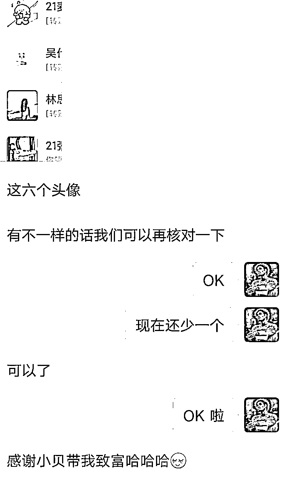

在得到大家的反馈之后，我更加充满能量，愿意去做这么一些事情

也充分认识到了真诚是唯一的必杀技

## 3)二八定律，马太效应

在这一次项目中，我们更加清楚地认识到了二八定律

在我们实战营当中的数百人中

能得到结果并且最终坚持下来的，只有那百分之二十下场实操的成员

随着项目的进行，他们制作笔记越发熟练，收益也越多

更多的人其实只是在观望，看别人怎么做的

这个项目实际操作特别简单，基本不需要花费多少时间。

但还是会存在有人担心这，担心那，不愿行动，认为自己还没有准备好

想多了只会让自己迈不开脚步，确定好了做，那就闭上眼睛迈出第一步，干就完了！

从文案的生成、图片的制作到笔记的不断迭代优化

尽管我们把sop不断的优化，最终去实践实操的往往只有那20%的人

最终享用到蛋糕的人也只有那20%的人

当然也很有可能是因为免费实战营，没有门槛所以不被重视和珍惜

这也让我们讨论对后面的制度做出一定调整，需要设立一定门槛来进行双向筛选

也希望借此门槛来结识更多真正有执行力，敢想敢做的朋友！

## 感谢@子潦的介绍，没有你的推荐就没有如今造福百名小白的实战项目！

## 感谢@七小 哥和@EVE 小杰，没有你们的帮助就没有这篇分享文章！

## 感谢生财有术提供的交流平台，能够让我们一起交流成长！

## 也很感谢点赞评论的圈友们，文章有价值，别忘记回去赞一个喔！

# 最后祝大家一起生财有术！