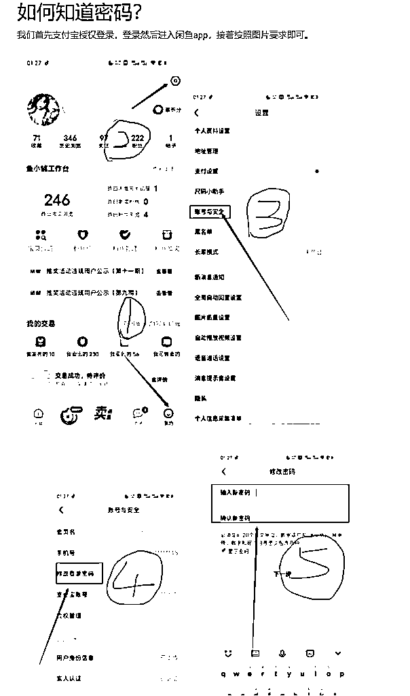
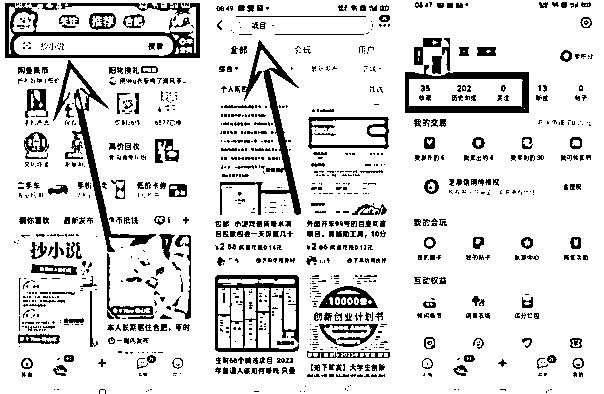

# 生财的一篇精华帖，让我四个月引流1.5W创业粉，成功变现25W

> 来源：[https://gaqk7v831uu.feishu.cn/docx/MYkYdonexoxzQIxAZ66cmhP0nOb](https://gaqk7v831uu.feishu.cn/docx/MYkYdonexoxzQIxAZ66cmhP0nOb)

各位圈友大家好，我是知凡

# 先做一下自我介绍：

其实自高中起就属于不安分的那一小类人，总想通过兼职副业赚点钱，也算是互联网上的一名资深老韭菜了。

自19年至今近五年时间，做过创业版块的知乎及公众号；淘宝蓝海单品单店和蓝海高客单店群；抖店无货源自营及招商。

22年下半年主做视频号引流，靠一套模板每条视频都能破百万播放，单账号三天涨粉5W，单日引流1000+精准创业粉，变现10W+。

目前有一个自己的工作室，主营业务是在抖音做手绘类创业IP引流变现，同时在测试各类小项目，5月初在生财看到了乔合大佬的分享，马上安排人实操，截止到今天也快四个月了，也算是拿到了正反馈，所以今天专门写这篇帖子来感谢生财及乔合大佬。

前天刷到了亦仁大佬讲的一段话：

在社群内选项目做生意赚钱，和外面的创业，最大的不同是什么？

前者是确定有解，后者是不确定有没有解。

前者已经有大量的跑通和闭环，大量的人已经赚到钱了，我们要做的是去“破解”而已，这难度是比后者至少要小一个数量级。

而对于后者，最难的是，你不知道前方有没有路，大量的精力和资源在寻找方向上。

正是这段话让我产生了分享的欲望，因为我自己正是这段内容的一个真实案例。

在加入生财前，选项目做项目更多是因为相信，所以看见，但是作为生财圈友，完全有理由也有底气因为看见，所以相信！

希望能通过我的反馈，让更多圈友从“生财潜水区”走出来，找到适合自己的项目。

# 初遇闲鱼引流项目

今年五月初，偶然在星球内看到了乔合大佬分享的咸鱼引流项目，项目内容拆解的既干又有深度，感觉这个项目在解决私域流量问题的同时，还能结合培训实现业务闭环，故直接安排人员上马操作。

说来也巧，在搞了一个月左右的时间点，可能动静有那么点，乔合总还专门回来问了一下实操成果，把我做了典型案例在合伙人群里做了分享。

今天这篇文章，不仅会把这个项目的详细教程公布给大家，还会把我是如何根据自身情况完成项目优化，提高转化率的心路历程拆解给大家。

为了方便各位更好理解，我先简单讲下整个项目的底层逻辑。

# 首先讲一下这个项目的底层逻辑：

在咸鱼批量发布虚拟资料类教程（由学员完成），引流到私域进行沉淀（粉丝回收到自己微信），然后通过朋友圈和私聊转化闲鱼虚拟资料知识付费课程，最终建立起一套可以自动裂变运行的流量印钞机！实现项目闭环！

## 玩法详解：

学员在咸鱼开一个或多个账号，去卖我提供的课程、资料、教程，卖出去的课程收益都是学员的，然后通过我们的方式把买课程的这个人引流到我们的微信，每个引流过来的粉丝我以 1--5 块钱回收。

学员的收益为：前端咸鱼卖课程的钱+卖给我这个粉丝我给你结算的 1--5 元。

我的收益为：学员交的项目门槛费。

也就是说我不断的收学员，就会有源源不断的账号帮我在咸鱼发布引流文案帖子，而引流过来的粉丝，我又可以不断转化为做这个项目的新学员。

只要我回收粉丝的总和支出＜学员门槛费用，那我就是赚钱的，最重要的是我拿到的私域粉丝的积累。这是一个完美的闭环。

# 分享一下这几个月实操下来所拿到的成果：

自五月初至今天八月底，合计四个月120天左右，共计引流到私域微信15211粉丝，平均127人/天。

自五月初至今天八月底，合计收学员478人，总成交转化率3.14%。

其中pro车，车费门槛299元/人，合计学员358人，总收益107042元。

plus车，车费门槛1580/人，合计学员120人，总收益189600元。

总计收益296642元，近30w。

收益的近30w中，其中用于粉丝回收结算的支出我合计了一下基本在5w左右，所以这个项目跑通的后的总和毛利润在25w左右。

最近每天持续上粉到私域的数量在130左右，这些纯粹的商业粉我还没有做二次或者其他项目的转化，目前只在私域沉淀，保持朋友圈更新保持粉丝粘性。

# 关于项目优化：

大家看完我做这个项目的详细收益后，是不是觉得还可以。

其实刚开始做这个项目的时候我们是赔钱的，后面通过不断优化才扭亏为盈的。

相信很多圈友和我刚开始一样，在生财找到了自己想做的项目，结果执行了一段时间后发现实际收获跟预期相差很大。

造成这个结果的原因，我认为主要有两个，其一是自己在执行层面没有做到位，就像坤哥一篇文章里讲的，选择，是在对的方向，做足了努力。如果确定不是自己执行力的问题，那么就可能和我遇到的第二个原因一样。

二、没有结合自身情况优化项目，盲目按照大佬的路径走，忽略了和大佬之间的资源差异。

## 亏损的原因

刚开始操作这个项目的时候我还是信心满满的，毕竟乔合大佬1380的客单价每天都会有很多人缴费进群，就算按照1%的转化率去算，5块一个的粉丝回收价，500块回收成本就能转化一单1380的，还是有880的利润空间。

那换我来做，就算转化率只能做到乔总的一半，也就是0.5%，5块一个的粉丝回收价，1000块钱的回收成本就能转化一单1580的（我的客单价定的是1580），利润还是有580。

账算完感觉能干，自己测试了一段时间后就开始招募第一批种子学员了，因为之前有一点私域，所以第一批很快就招了10个学员开干。

首批学员都是经过了一部分筛选的，所以干的非常起劲，有一个学员直接开了5个号，一个人一周就给我引流了接近400人，那一周每天起床看到的都是密密麻麻的好友请求，整个人除了像打了鸡血一样，更是觉得暴富已经理我不远了，单纯的以为按照0.5%的转化率，肯定能出几单1580的。

结果一周时间过去了，新开的接粉号好友数从0涨到了800，实际却只转化了一个1580的学员，这个转化率直接给我浇了一盆冷水。不仅如此，这800多的粉丝，我还要付出4000多元的回收成本，算下来第一个周就直接亏损了接近3000元。

面对出道即赔钱的情况，我开始怀疑这个项目到底能不能挣钱，甚至一度有了放弃这个项目的念头。

但是同事的一句话点醒了我，他说我不应该盲目自信，忽视掉和乔总之间的差距，乔总能转化是因为他本身有足够的积累，不管是朋友圈运营、还是私域信任度，都跟我们不是一个档次的。我们不能再盲目复制乔总的玩法，应该去做一点优化。

仔细思考了同事的话，确实如此，于是紧急和同事开会研究，最终作出了这几个优化点：

## 优化方案

第一、降低客单价

考虑到我们的朋友圈素材还不够丰富以及闲鱼过来的粉丝付费能力一般，所以新增一个299元的SKU来过渡，信任不够，低价来凑，有了低客单价做支撑，转化率肯定是会提升的，在这个过程中又可以源源不断的增加我们的朋友圈素材来提高信任，短期内形成良性循环。

第二、调整产品交付模式

原本1580的客单价包含了前端如何做闲鱼引流以及后端如何开后台转化学员。

调整后1580的交付内容不变，单粉回收价为5元。

而299客单价的交付只包括前端如何做闲鱼引流，不包含如何做后端，且单粉回收价只有一元，更契合闲鱼粉的学生党属性。

第三、优化项目名字及海报

将乔总的“闲鱼创业粉引流”改为了“流量印钞机”

海报也在乔总的基础上进行了优化

果然，在进行一系列优化之后，整个转化数据直线上升，开始扭亏为盈。

为了方便各位理解，这是优化后的项目介绍，

## 低价车费的优点：

#### 1.前期造就的价格差极大提高成交量

299车费是在1580车推行了一段时间后发售的，当299的价格一出，之前因为1580感觉价格高的人基本都报名学习了。（299现在已经涨价为399）

#### 2.低消费人群容易接受

咸鱼引流过来的有小部分学生粉，头脑活跃，执行力到位，但是手头资金不足，不足以支撑1580的门槛费，所以299报名非常积极。

#### 3.成交率高

299价格的成交转化率远高于1580，容易被大部分想尝试的人接受

#### 4.交付容易

价格低造就了心理预期低，不会出现严重的售后问题，交付相对轻松

#### 5.回收单价极低

最重要的一点，粉丝回收价格1元/个，这个价格的商业粉，真的香。

当然在此建议，如果有圈友想跑一跑这个项目，价格可以再做适当调整，找个最容易触发消费G点的价格，配合朋友圈以及营销话术，提高转化率。（我的转化做的很垃圾，没有强硬营销，也是为了不伤粉丝后期还可以转化其他项目）

# 关于割韭菜：

做知识付费离不开这个话题，不管任何项目，能不能做起来，我始终认为是事在人为。

就像亦仁说的一样：

卖项目不等于割韭菜，信息的流动是需要成本的，让信息差可以流动起来，本身就是在创造价值，创造价值就应该获得回报。

我从了解这个项目，到跑通这个项目，花了约一周的时间，这是执行力拉满的情况下，从前端咸鱼账号到后端后台配置，以及虚拟资料的整理和粉丝的转化话术。

在这个过程中，我占据了一个天然优势，那就是我这边本身有一定的私域基础，因而刚开始跑项目的时候，就直接有10几个学员在发贴推，所以滚雪球的速度比较快。

而在后期真正收学员交付开始，我会发现有近50%的学员只是初窥门庭，执行力缺失造就了连299都赚不到，这也是为什么近300个账号在跑，平均每天却只进粉130的原因。

# 下面讲一下流量印钞机项目具体操作流程：

大家如果有想实操的，或者有想拿来培训的，可以以这部分内容作为交付文档，这也是我从乔总那边付费学习的，在乔总基础上做了一点点优化。

## 第九版更新时间

2023年8月20日15:10:17

素材库新增7个项目

## 项目基础逻辑：

我提供市面上热度比较高的项目素材，比如这段时间比较火的无人直播/小红书无货源等项目项目教程。

你在咸鱼上开账号，首先绑定我这边的自动发货后台（发货后台前7天免费，后续30元/月），然后发布闲置帖子。

举例：帖子内容即为 2023最新小红书无货源教程+【配图】。

发布闲置以后，会有很多想做小红书店铺的人看到并购买这个教程。

客户购买教程以后后台会自动发货，并发送一条链接，链接内有我的微信，客户添加微信你即可赚取我结算的佣金

你的收益：前端咸鱼卖课程的钱+粉丝引流到我这我给你结算的每个粉丝1--5元。

## 闲鱼创业粉引流项目素材库【不断更新】

## 点此处跳转项目库

### 第一步：确认自己卖粉还是给自己引流

pro车仅支持卖粉，Plus车支持自己引流，如果要自行引流，联系我发其他交付文档。

### 第二步： 授权后台

给我你的闲鱼账号密码我登录后台授权自动发货

授权好后我会给大家每人一个专属的暗号链接，这个是用来登记引进来的是属于哪个学员的，这样方便给大家结算卖粉的钱，引进来一个人我们是1--5元包回收的。

例如这样子：每周周一周四，我会给上的数据每个暗号的学员 结算。

这个是用来登录我们后台系统自动帮你发货的，后边出的单子大家是不需要手动发货的，这样就不用担心晚上三更半夜有人下单没人发货的情况了。

备注：跟大家要账号密码并不会登录大家的咸鱼账号，只是为了绑定我们这边的自动发货后台进行授权，账号安全方面大家无需任何担心。

### 第三步：项目准备条件

准备材料：三张电话卡(厅卡、非虚拟卡)、三部手机 [一个支付宝号也行，一个支付宝账号就有一个闲鱼号]

备注：本项目并非必须三个号或者三个号以上才可以做，一机一号就可以正常运转，但是多号收益大于单号，兄弟们根据自己情况灵活调整即可。

手机：如果没有多的手机 建议去闲鱼买个200块钱的普通小米安卓机，不要用多开容易被封号限制流量！最好是1卡1ip。

手机卡：可以直接去营业厅开副卡即可不要钱部分营业厅要钱10块钱一张！ 一般都可以开两张副卡 三个手机号就出来了！

①两三个闲鱼账号连接wifi不会限流的，后边批量起号的话，用流量不然会限流。

②在每部手机上下载支付宝 和 闲鱼 两个APP

③注册三个支付宝 并进行实名验证操作 实名需要绑定银行卡

④打开闲鱼APP 用支付宝进行登录 并且进行实名 一定要进行实名操作

如图：

一个人可以注册三个支付宝和闲鱼，如果已经超了就找亲朋好友家人多弄几个【这个是你批量起号的情况下】

### 第四步：怎么养号

第一天就可以发布作品了 但是同时也要养养号

① 在 “我” 下面 找到互动权益 打开 “领闲鱼币” 具体如下图

② 每天领取闲鱼币 并且把 “赚经验” 里面的项目全部做完 做完之后 升级小店

③ 在主页搜索“项目”或“赚钱” 然后 每隔八小时收藏+5 浏览+20 关注+3 【这个很重要】 模拟正常买家滑动界面

注意事项： 发布一件新宝贝和邀请小伙伴来签到赚币 这两项内容可以不做

其他所有的任务 都需要下载APP进行操作： 淘特、菜鸟、手机天猫、淘宝、饿了吗！把能完成的任务都把他完成。

### 第五步：对标账号

【闲鱼】https://m.tb.cn/h.UGSFaq4?tk=focFdOljU1b CZ0001 「这是我的闲鱼号，快来看看吧～」

### 第六步：如何参考别人的账号的文案和素材【重点】

我们怎么制作？我们要发布什么？

如何找到爆品的教程视频实操：

链接：https://pan.quark.cn/s/1b1199d70c73

提取码：8YYM

对照上边链接的方法找到闲鱼市场卖的好的 [项目] 比如百度答题，撸骗子等等...我们要做的，就是一个字抄 这个时候再加上我们的去重方法。

### 第七步：作品去重方法【重点】

这边在发布作品的时候 需要对文案图片做一个简单的修改,为规避闲鱼查重

用视频给到大家做演示：

我用夸克网盘分享了「闲鱼去重避免同质化没流量视频」，点击链接即可保存。打开「夸克APP」，无需下载在线播放视频，畅享原画5倍速，支持电视投屏。

链接：https://pan.quark.cn/s/699e9335ac2a

提取码：T3kb

在此有的学员会有疑问，素材库内只有40个项目，那不是只能发布40个项目的帖子就没有了么？？？

着重回答一下，每一个项目我们都可以发布无数次，只要每次发布的文案和配图不是相同的，每一帖子换文案换图片，就可以实现一个项目发布多次闲置帖子。甚至你一个账号只发“无人直播教程”都可以实现！！！

找到你想发布的项目

然后不停的怼作品就行了 第一天发布5条作品

从第二天开始发布8条以上 ！

【重点： 每次发布的地址，填写不同地方，可定位到人多的地方，比如北上广地区】

发布完成之后，开启加曝光和闲鱼币抵扣，如下图：

因为我们发布的是虚拟商品 这次操作是不需要大家去发货的 只需要把大家的账号密码发我 我这边可以给大家自动发货 且这个操作可以大大避免同行捣乱和仅退款行为 更好的保证大家的收益

疯狂怼作品即可 寻找爆品的方法参考上边的那条【如何闲鱼市场寻找爆品】的网盘链接

注意事项：发布项目的时候需要注意 有可能会触及违规 你需要想尽一切办法去避免这个违规 ，这个需要你自己根据你发布项目去进行测试，最好的办法就是参考同行，然后进行优化。如果担心的话，可以用闲鱼违规词检测工具进行检测一下https://uutool.cn/check-word/

### 第八步：发作品后顾客下单了怎么办？

1，发货我们搞定 ， 如果顾客来咨询你你就让客户拍下即可，其他的什么都不用管，可以回答一下，说这个是系统详细的课程，可以设置一下自动回复。

我的自动回复是这样的【您好，标价就是实价，系统教程，拍下自动发货】如何设置自动回复？

打开闲鱼app，点击右下角我的，再点击右上角设置找到全局自动回复打开，把上边那句话加进去即可。

2，顾客下单后我们会给你的店铺自动发货，这边给引过来我们对接 ，我们发大家的专属暗号过去，别人添加过来是会备注来意的

3，如果你的店铺没有鱼小铺的话，客户购买过后，商品会下架，到商品下架的地方再重新上架就行

4， 发货完成后过几分钟，邀请客户进行好评，客户收货后过几分钟，钱就到你支付宝账户了。

关于客户退款问题：

只要客户提出退款诉求，直接退款即可，对于我们来讲，这些资源与教程可以利用无数次，所以基本没有成本，退款也没有什么损失。

反之如果拒绝退款，客户有可能给差评或者投诉，差评会极大影响曝光量和转化率。兄弟们不要因小失大。

还有，如果前端咸鱼文案内容出现“免费带”“包教包会”等字眼，或者是其他素材库内没有的项目，我这边是无法完成客户交付的，也会直接告诉客户去咸鱼申请退款，后端只有教程，没有其他服务，兄弟们周知！

关于好友通过速度：

（因自动通过软件出问题，只能手动通过，时间一般为早8-晚11，早8-早9、晚10-晚11这两个通过时间会变慢）

温馨提示：如果遇到这种的就不用理是同行的，不要发他V！不然可能会被举报下架

### 第九步：怎么快速优化提高曝光

9.1 发布价格 统一设置成5-10元之间 发布过后一个小时后开始降价 每次降0.1元 一个商品一天可以降三次

9.2 商品降价到6元之后 每天只需降价一次 每次降价0.1元即可

③ 在闲鱼上面搜索0.01元的小黄鱼，或者也可以搜“互”和搜“0.01” 找到我想要 给对方发信息： 来不来？ 或者发个虎 这个是一个暗号来的 看得懂的 如果对方回复你 来或者直接把商品发给你 你直接购买 先不要付款 等待别人把价格改成你们彼此同意的价格后 再付款，同样如果别人找你也是一样。这样的操作，我们称之为刷单。

9.3 每天可以刷个三单，尽量在早上八九点钟左右刷，这个时候，人数很活跃。这样可以把你的店铺排名做上去。

9.4 如果出现成交客户，可以在咸鱼给客户私信消息：“亲亲如果您购买的资料还算满意，也麻烦您给个hp（好评），这边将再次送您20个副业项目合集”，话术可以灵活调整，规避违规词。

9.5总结一下 每天必做内容：

1) 签到和闲鱼币任务

2) 每天发布10个左右的宝贝

3) 宝贝降价操作 每个宝贝每天都要来一遍

4) 卖出宝贝 立马上架

5) 开启闲鱼币抵扣和闲鱼币推广

6) 宝贝每天都需要擦亮，早上八九点做都可以

7) 刷单 注意一下频率 不要太高 每天两单即可

### 第十步：闲鱼账号防封以及解封思路

任何项目中间都会有个饱和期，因为入局的人变多了，这个时候你分到的羹就会很少，平台的管控以及同行的恶意举报导致一系列的商品下架亦或者账号被封永久的情况。

#### 10.1永久封号的类型

被封号分两种，

第一种自己发违禁词严重的账号权重不好被闲鱼机器人检测出来了，直接永久大礼包

第二种就是被同行举报

#### 10.2卖虚拟品被封号后找客服解封的前提准备

第一步，找我这边把你这个店铺的链接图给下掉

第二步，客户找你要微信你直接拒绝的图片，客户找你说没有那个项目同意退款的截图，以上截图缺一不可

第三步，被封之后可以申诉的，但是第一次申诉都不会通过因为这个是机器人给你审核的，这个时候我们要找人工客服

#### 10.3操作流程

准备好材料之后，接下来找人工客服然后说，网盘链接失效我都主动给用户退款，顾客要脱离闲鱼平台沟通我也多次明确拒绝，看流程图：

#### 10.4总结：

你要反复明确的你的态度，用上你的材料一口咬定客户要脱离平台你都是拒绝的然后客户要退款都是同意的。不是真正的违规，基本上都是1-2个工作日就会给你解开。

## 闲鱼虚拟商品曝光量的底层逻辑

第一 账号的权重 ：

① 账号注册的时间长短 是否有违规

② 账号的活跃程度是否每天都在做任务

③ 账号是否购买过商品 评价点赞情况如何

④ 账号里面有多少商品 销售如何 好评多少 这一点最为重要

第二 商品的权重：

① 发布的商品与平台其他商品的重复度

② 是否有敏感词 违禁词和违规词

③ 商品的 浏览曝光比 和 购买浏览比

可以这么总结：

① 账号操作的时间越长权重越高 你无论发布什么作品(只要不违规) 平台给你推的曝光量就多

② 发布的商品尽量少和平台其他商品低重复 获得的曝光量就高 这个取决于你对编辑文案和图片的能力

③ 浏览曝光比 取决于你的主图 和 你文案前面的15个字

④ 购买浏览比 取决于你文案的渲染能力

## 学员的结算和收益！

你的收益来源于两点

第一：卖教程的收益 给你都是你的 一般都是定价1-10块钱课程看不同类目

第二：把粉丝引流过来给我们的收益 ，一个人给1--5块钱给你！周一周四统一结算。

## 注意事项的再次强调！

# 写在最后

全职互联网老韭菜，在流量印钞机这个项目完全跑通以后，就没有再在一线战斗

6月份以后重新规划了下半年计划与目标，也思考了很长时间以后的路应该怎么走

最后的结果还是围绕两个字：流量。或者更精确一点叫私域流量。

回顾这几年再互联网上的起起伏伏，真正让我跑通的，赚到钱的项目，一直都是围绕着流量。

所以我以后的路走的大概率也是流量路线，要精准的、有粘性的私域流量。

最近这几个月一直在做创业类手绘视频的项目拆解，底层逻辑为：

以抖快平台为公域流量池，不断吸引精准商业类粉丝加私域，进行流量沉淀，进而做成交与转化。

目前手绘视频这个项目也取得不错的引流效果：

这篇文章也希望圈友们多多点赞，想冲击一下精华贴

如果有幸精华，下篇文章我会具体拆解一下手绘视频创业粉引流——商业ip打造的全流程。

当然也非常希望能与圈内各位大佬交流链接，合作共赢。