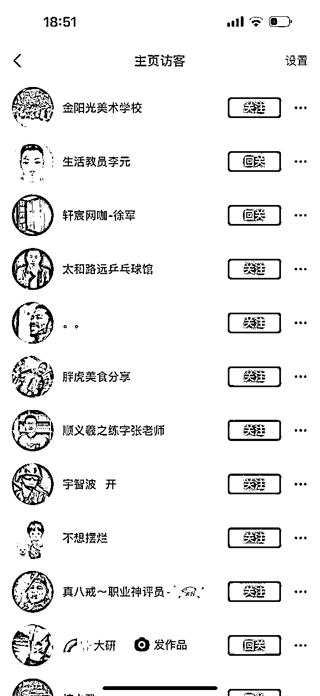
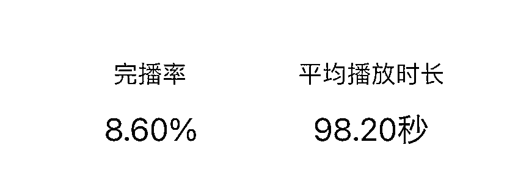
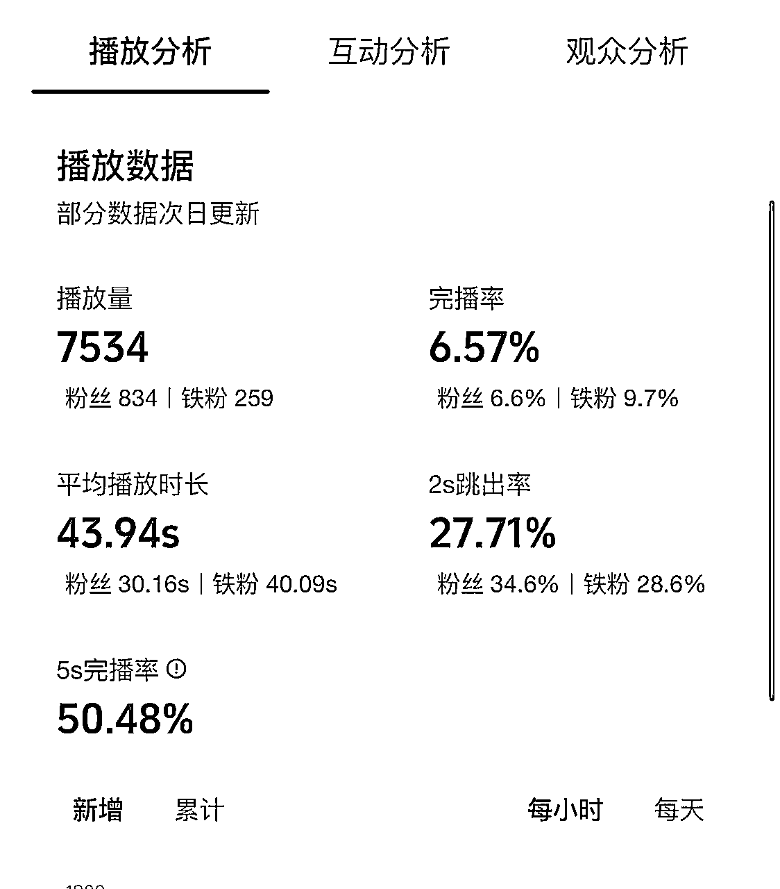

# 实体这样做抖音，才能赚大钱，

> 来源：[https://aso41gpxhm.feishu.cn/docx/Mv1Xds3Esoz7VrxaxoiciLmsn0f](https://aso41gpxhm.feishu.cn/docx/Mv1Xds3Esoz7VrxaxoiciLmsn0f)

### 实体要跃迁，必须用抖音

这一年半一直在帮实体做私域裂变，因为裂变来的都是较精准的客户，所以说转化率有一定的保证，但裂变有几个问题，

1、实体本身需要一定的私域积累效果才比较好；

2、裂变的精准度高，一旦精准量注定就上不去；

3、完成不了实体大规模提高曝光这个点；

做好私域经营实体活着确实能不错，但是需要要做爆，只靠私域还差点动作，抖音是能解决上面的问题的，

抖音不仅可以加速私域积累，而且可以获得势能，

未来三年你无论认不认可，赚大钱的机会还是在抖音，在如此内卷的实体行业，你的机会只有在抖音上了，实体的破局点就在抖音+私域

我本身的教培客户居多，做b端的服务，我早在一年前就尝试抖音吸取教培老师的关注，然后绞尽脑汁的想干货做内容，无论是投定向呀、投抖加，发现关注的都是一些老头老太太，其实中途也把市场上那些大v博主的课都看了一下，

经过了大量的试错，找到了正确的逻辑，播放量也变大了、粉丝也精准了、涨粉也变快了，每天我的账号涨粉在200-300粉左右，年底我的账号能成为教培招生领域第一大号，

### 实体晒产品、讲成绩，注定没流量

1、吧啦吧啦口播讲干货，如果在一个领域没有强大的知名度以及海量的粉丝量，吧啦讲干货是没有人听的，另外抖音已经在好几年了，每个赛道已经占住人了，而且内容该讲的已经讲了一遍了，这个赛道的用户已经听疲倦了，这样的内容是没有流量的，用户也不喜欢；

2、天天晒成绩、讲产品，吧啦吧啦讲晒产品、讲成绩，100个同行都是这么做，没有一点内容，用户是一点点都不感兴趣的，而且抖音也容易识别为营销号；

我估计这是绝大多数人做抖音的方式，尤其实体，天天怼着自己的店铺拍，100个同行都是这么干，用户看疲倦了，压根带来不来流量，更别说带来订单了，

对于实体来讲，都是有成熟的产品，用户基本都在同城，

第一阶段就是让更多的人知道你这家店就够了，也就是需要更多的流量；

第二阶段抖音做起来，在围绕的抖音来重塑你的产品；

### 粉丝资产逻辑

华与华一直有一个逻辑，就是把消费变成资产，因为资产是可以产生利息的，不要把消费变成消费，对于抖音来讲，粉丝就是自己资产，自己的品牌就是自己的资产，如果投资大量的现金在抖音上，涨了粉丝、提升了ip的知名度，这就是资产，

举一个辛巴的案例，辛巴一直分享了，别人觉得粉丝值5毛的时候，他认为粉丝值几十几百，所以在2元的价格的时候疯狂投流买入，成为快手第一个破亿粉丝的主播，而且辛选集团年销500多个亿，其实也是认定了粉丝就是资产，愿意海量投入，

再换一个视角，一个实体店投入在30-50万，如果把30-50万现金投在抖音上，涨粉会在10-20万这个区间，而且是相对来说的精准粉，如果在同城本地的话，10-20万的粉丝已经是当地的龙头了，变现会远大于一个实体店，

目前抖音也是杠杆率最大的一个平台，把钱都在抖音上的杠杆会远大于其他的，

要把粉丝思考成资产，目前我这个号是1万粉丝，接下来就要加大投放，迅速跑到10万粉丝，

### 做人群+剧情化，23年实体抖音破局点

做人群+剧情化，也就是说做人群相关的话题，而不是讲产品，要进行剧情化表达，这里剧情化要讲一下

1、对于实体艺术培训机构，天天讲自己的艺培机构怎么怎么好，是没有流量，我们要做话题，它的用户是宝妈，要圈同城的宝妈，我们要讲宝妈感兴趣的话题，

话题就是：婆媳关系、育儿关系、夫妻关系、家庭发展等，用这样的话题吸引同城宝妈关注，

这叫做话题不垂直，人群垂直，但是讲话题不能干巴巴的口播讲了，要用剧情化，把这个演绎出来，一方面人还是喜欢上帝视角看发生的东西，而不是一个人对着屏幕给你讲道理，另一方面你剧情表达的信息密度会高，停留会长，

假设你是绘画机构，抖音应该这么拍，人群+剧情化表达

育儿关系为例：让孩子画一幅她心中的妈妈，然后美女老师，带着孩子去他家里送给她妈妈，然后再讲一下她妈妈的故事，整个过程用抖音记录下来，这样就有流量；

这类的内容可以引起家长的亲子关系的共鸣，

家庭发展为例：可以拿着校区孩子的作品去做换好物，可以拿着画给同城的烧烤店老板换个烧烤，给奶茶店老板换个奶茶，邀请到你的店里，画着画，相互讲一下创业的心酸，这样做也会有流量；

下方这个链接就是以物换美好

https://v.douyin.com/ie46TnvL/

这类的内容可以突出校长的人设、也突出创业的不易，让校长人格更立体，

这就叫剧情化的表达，内容上没有宣传你的产品，但是处处是你的产品

这里很多人可能会讲，会不会生产成本高，用手机拍摄就可以，把真实性剪出来就好，不用用太复杂的技术，真实反而感兴趣的人会更多，

2、对于服装店，同样也不能天天怼着衣服拍，这样更没有流量，因为服装店，

如果是年轻女装，用户是年轻女性，年轻女性感性的话题就是：情感、职场等；

如果是大龄服装，用户是爸爸妈妈，那么用户就是他的儿子女儿，儿子女儿感性的话题就是；父母感情等

那么，对于大龄女装讲父母感情这个话题，剧情化表达可以这样拍

以父母感情为例：找一些清洁工阿姨呀、保安大叔呀，给他们做一次整个的衣服改造，衣服就送他们了，然后整个的改造过程拍出来，前后对比，再让阿姨讲一下喜欢的衣服是什么样的，自己孩子给自己买过的衣服是什么样的，这样拍出来就有流量，

下面就是改造保安大叔类的

https://v.douyin.com/ie4MhW6A/

这类内容可以引发儿女的思考，该给爸妈添置一身衣服了，

3、对于花店，花店的客户男性居多，但是买花频率高的其实是海王、渣男，所以我们要找到海王、渣男感兴趣的话题

话题就是：如何三天追女孩子、用什么的话题约女孩子晚上出来、送对礼物感动女孩子一个月等，剧情化表达可以这么拍

以追女孩子为例：可以在街上免费送给男孩子、女孩一朵花，让他给自己喜欢的那孩子、女孩子表白，然后再给他们支招，如何追到女孩子，整个过程用抖音记录下来，每天一个追女孩子小妙招，也可以找身边的朋友当演员配合采访演绎也可以；

这样的内容有意思，有期待，同城的男性也喜欢看，

4、对于to b的，以我为例吧，我目前主要服务于艺术培训机构，我的用户是艺术培训机构的老板，我之前天天讲校区管理什么的，因为同质化内容太多了，也是纯口播，没有一点点流量，

对于艺术培训机构的老板的话题：合伙股权、旅游、校区管理、招生等话题，

我设计的剧情化表达：

抖音招生：前面我会参访几个人，问可以请我吃个饭或者是借我100元，第三个问到教培机构老板，然后通过一个抖音招生或者是私域招生知识，换一顿饭或者是借100元，一般我找的教培老板都是大长腿美女，都是请的模特，所以整体流量都好很多，

### 调整视频结构，黄金开头+中间反转+最后共鸣

做抖音要数据化分析，要明确一个点，我们是抖音的打工人，先要为抖音做贡献，

所以，我们生产的内容既要一开始吸引用户的注意让用户留下来，又要看的时间长，最后呢，还要看的有价值，所以我们要设计视频的机构

黄金开头+中间不断反转+最后共鸣这就是大爆款的前提

黄金开头就是黄金1s，要第一秒拉取注意力

一开始女生泼了一盆水，然后我吧啦吧啦讲艺术培训机构怎么做抖音，然后一个大长腿美女不断的给我擦水

开始泼水拉取注意力，反转是女孩子不断给我擦水，然后很多人也在看这个美女在干什么，甚至都忘记我在讲什么了，不知不觉，就看下去了，

再看一下这个搏击机构做的黄金开头，

https://v.douyin.com/ie4PB5JC/

一开始一个教练就在不断打小孩子的巴掌，也会一下子把家长的注意力拉进去，看一下到底发生了什么，

中间反转，中间反转目的就是为了用户能再看下去，提高播放时长，

再看一这个视频，中间反转到反霸凌这个话题，再引出要学搏击，其实一下击中家长的心，黄金开头反转再引到自己的行业

https://v.douyin.com/ie4PB5JC/

再看一下这个视频，美女穿的篮球打篮球，一下子变装大长腿，其实这种内容特别适合，篮球培训机构拍

https://v.douyin.com/ie4PgQgU/

### 画面丰富度等于流量密码

对于内容来讲，很多口播类的视频，为什么出不了超大爆款，其实本质就是画面的丰富度不够，

看上面两个数据，后面的2秒跳出率以及5秒完播率，数据比第一条好10倍，

原因有这几个

1:室外有x因素，例如一个人摔倒了、一个老奶奶慢悠悠的过马路，这也是一种信息的传达，这种用户会被吸引，不会跳出视频，在室内就没有这种x因素，有时候爆款就是一个细节爆的；

2、从进化论来思考，我们的祖先生活在丰富多彩的自然环境中，如森林、草原和湖泊，他们需要识别和适应各种危险和机会，因此，对色彩和细节的敏感度可能已经通过自然选择被编码到我们的基因中，对色彩与细节敏感的关注度本身是强的；

拍段视频，背景能人多就人多，能在拍就在景点拍，

### 信息丰富度等于播放时长

抖音有一个考核指标叫做均播时长，就是平均每个用户的播放时长，这是第一考核指标，因为对于抖音来讲，需要你做的内容能留住用户，对所有的平台都是有价值的，

对我们也是有价值的，我们的短视频消耗用户的时间越长，建立认知也就越容易，

提高播放时长，其实很简单，提高信息的丰富度，就是信息密度，也就是传递出来的信息一定要多，视频号抖音都一样，我给你看几个数据

这是视频号访谈类内容的均播时长，访谈类内容一问一答，

这是不断切换画面信息内容的均播时长，

如何提高信息丰富度，以下面x为例

x x x x x x x

每一个x就是一个信息，多个x组成一个视频，在短视频内存在的时间不要超过7秒，也就是4-7秒一个信息传递，然后不断反转，这样才能提高信息传递的密度，也就是时长，

### 做直播你就赢了

对于实体来讲，开直播你就赢了，很简单，你调研一下，你周边的店有几家开直播，没几家，你开了就赢了，就算你的场观就500人，那也就是500个人路过你的店铺，听你讲了一下产品，你对比周边商家，就有很大的优势，

直播间就是来转化的：

直播就很清晰，来直播间就是来卖货的，所以直播间不用太花里胡哨，直达目的，卖货，

关于直播脚本：

直播是不断优化一套脚本，反复循环讲这一套脚本，而不是每天创造一套新脚本，如果每天都是讲同样的脚本你就会不断吸引新用户，在直播间我们要的是新用户，

拆解脚本：

找到你店铺对标的大型直播间，然后录屏，1对1模仿，柔和成自己的脚本即可

直播实操：

早、中、晚，三个时段各直播一个小时以上，看时段数据，哪个时段好，就集中在哪个时段进行直播

拉直播间：

第一轮直播30天以上，通过一套脚本循环，抖音知道你需要什么样的用户，直播间标签就越来越好