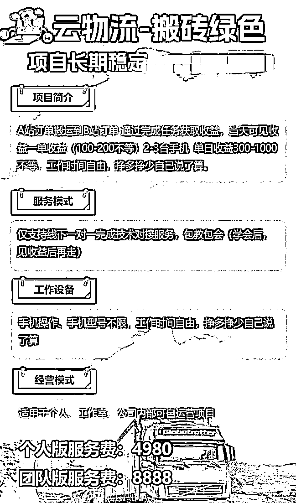
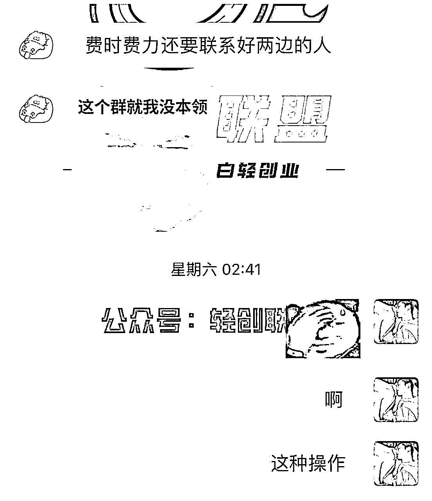

# 外面收费几千的货拉拉物流项目保姆级教程

> 来源：[https://qaigu0wmxc.feishu.cn/docx/N8mqdFdkCokYFUxTlr1cl6RhnHc](https://qaigu0wmxc.feishu.cn/docx/N8mqdFdkCokYFUxTlr1cl6RhnHc)

今天去外面知识付费来的项目玩法

ps：我没实操过 但是我下面的学员有去实操他和我说的如下

既然是一个项目 肯定有他赚钱的逻辑在里面只是赚多赚少的问题了 分享出来让大家少花点冤枉钱

整个项目逻辑就是从这个平台接高价单 再到另一个平台低价出，你就属于是个中介吧。

# 第一步：项目流程

需要下载两个APP 货拉拉 和运满满

## 1\. 车型种类区别

4.2米货车最大载重8吨，最大24方，最高2.2米高栏，最宽2.4,

5.2米货车最大载重10吨，最大28方，最高2.2米高栏，最宽2.4,

6.8米货车最大载重12吨，最大43方，最高2.4米高栏，最宽2.4

7.6米货车最大载重12吨，最大48方，最高2.4米高栏，最宽2.4

9.6米货车最大载重18吨，最大61方，最高2.4米高栏，最宽2.4

## 2\. 倒单流程

一、首先在货拉拉上挑选优质订单，点开订单看公里数和总价算一算单价每公里多少钱，每个地方单价都不一样，有些地方单价高也没有司机接单。

二、订单选择800以下的单子不看没有利润空间，不接一些超长超宽的货物的订单，不接钢管、钢卷、玻璃瓷砖易碎，（瓷砖整箱整托盘可以拉）易燃易爆危险品的物品，容易纠纷运满满不让发单。钢管钢卷很少司机敢拉。

三、前期不熟可以先接预留时间长的订单，例如间隔有3-4小时以上有充分找司机的订单或预定明天的订单这样有充分时间去运作，

四、即使订单价格会高点但是时间紧需要1个小时之内装货，新手暂时不建议接，容易挨骂被投诉

五、抢到订单第一时间打电话给客户，问客户货物是什么东西，有多重，最长有多长，最宽是多少，了解清楚后说货拉拉位置不准，让客户加微信发个位置，一般都是真实手机号码后续需要给到运满满司机，（货拉拉平台的手机号码是虚拟号码加不上微信，而且会录音不能说让客户取消订单线下交易这种话）

需分清楚哪个是给钱的老板，正常的话有发货人电话和收货人电话，（优先打电话给发货人）预付订单是已经给过钱的了，货到付款的看平台那个叫车的问一下谁给钱，如果不是同一个人可以加下另外一个给钱微信（也可以不加让运满满司机找他拿钱，需运满满上叫车把我们利润空间弄到定金上选择不退还），

### 2.1货拉拉部分

主要车型:高栏车、箱式(冷藏)平板、飞翼

4米2车厢长度4.2米，车宽:标箱2.1米，宽体车2.3

2.45米，

高栏车最多装23方、10吨: 箱式18-19方、10吨:3.5-4元/公里

6米8车厢长度6.8米，车宽: 2.3-2.45米

高栏车最多装39方、10吨:箱式35方左右、10吨:5.5-6元/公里

接单:接单后要第一时间打电话给货主问清楚装的是什么货，多少吨，多少方，加微信。根据货物推荐使用车型，或者按货主要求叫车。运费:货到付款的直接跟货主说货送到了运费结给司机，不要支付到平台。订单完成后点线下收款。

已支付运费或者部分运费的，和货主沟通，引导货主取消订单，私下交易，货送到后运费直接结给司机，如果货主不同意，这单就没法做。

发票:要开发票的增加3%费用，税费可以根据自己利润选择是否向客户收取，客户愿意支付最好，如果就不愿意额外支付税费，可根据自己利润自行调整。

### 2.2运满满部分

发单:装卸货按货拉拉装卸货位置填写，车型，位置一定要确认好，如果信息填写错误司机到装货点无法承运需赔偿司机放空费，等待费。

额外要求一定要通过虚拟电话说清楚或者备注清楚、

为保障双方权益，尽量使用虚拟号码与司机沟通(虚拟电话有录音)。微信沟通的话重要事项尽量用文字或语音表达。

司机责任导致货物无法承运可没收定金;发货方责任导致货物无法承运需赔偿司机损失

## 3\. 运满满发单流程

一、把客户发过来的地址，发货地址和收货地址重量或方数的输入到运满满上发单，目前发单有两种选择一种是一口价模式，一种是电仪

二、一口价模式没有电话骚扰把自己的接到的订单，想赚的差价直接弄到定金上选择不退还（如果没有司机接单一口价上慢慢价钱一般一次加50左右）

电仪模式司机会疯狂打电话过来，你直接让司机报价不报价不理他下一个，跟一口价一样把利润差价弄到定金上面去选择不退还

## 4.货拉拉防骗技巧

1\. 货拉拉上接到的好单靓单这些需要注意下，但凡客户要让你交押金定金之类的都不接

## 5.货拉拉规避废号扣分

一、遇到没有司机接单临近1小时之内就打电话给客户说车坏了或爆胎博同情让客户取消订单

自己尽量不要取消订单，让客户取消订单尽量不要留下文字信息，用客户真是号码沟通或者微信电话沟通（不能使用平台提供的虚拟号码），如果真的要取消订单可以选择限行地区或客户货物超长重宽、

1.  平台电话上会录音不要说一些违规词，（例如：严禁让客户线下交易取消订单的，或者误导客户让客户取消订单的，）

## 6.话术培训

一，遇到一些客户问车辆不符，就说我们是一个物流公司有很多车，这俩车离你这比较近就过来了都是一样的。

二、跟运满满司机说好，叫他不要乱说话，说找你给钱拿钱就好了。正常不会乱说有些司机比较嘴碎。

## 7.接单话术

平台接到单后，打电话给货主

沟通说我们是货拉拉车队的，附近有大量各种类型的车，全国各地的车都有的。

跟老板确认货物货物情况、重量 长，宽、需要车型，装货时间，卸货时间

问货主真实手机号码，[目前拨打的是虚拟号码来的]

问好后 就可以到运满满放单，把所有资料复制过去发单出去。

运满满放单后，有司机接单了，司机打电话来，可直接把货主手机号码给司机让司机跟货主联系沟通，也可以自己跟，加好司机跟货主微信，从中沟通，跟货主拿位置，发给司机，自己跟单子就不容易给司机跳单。

假如货主在货拉拉平台支付了钱，需要叫货主在货拉拉上退单，直接付款给司机，需要叫货主填退单理由，

理由填写: 找到车了或者暂时不用车了。

有些货主硬要走平台的单子，成品号不接，资料号可以接 【成品号不能提现，只能加油使用】

货物问题，没问题的情况，这单基本完成了。货主的微信能加上的全部加上到微信上，后期可做私域。

一切都是沟通与话术，我们就是全国各地的车队，老板需要什么要求，需要什么车，都能满足他，态度好一些，货主需要什么要求，我们就跟司机提什么要求。

注意事项:

取消理由一定要让货主选择货主的原因，不然会扣分.一定要让货主把钱支付给司机，硬要走平台支付的单子，不能接，司机跟货主对接上后，有什么问题，直接让司机跟货主联系，尽量不要在去插手。

## 8.车辆型号公里数价格概算表

4.2米的车型：

吨数：5-8吨 方数：10-20

500公里内（*5元）//500公里外（*3.5元）

5.2米的车型：

吨数：8-10吨 方数：15-30方

500公里内（*5元）//500公里外（*4元）

6.8米的车型：

吨数：10-14吨 方数：20-40方

500公里内（*5.5元）//500公里外（*4元）

7.6米的车型:

吨数:12-18吨 方数:30-50方

500公里内(*6元)//500公里外(*4元)

9.6米的车型:

吨数:18-25吨 方数:50-65方

500公里内(*6元)//500 公里外(*5元)

13米的车型:

吨数:28-33吨 方数:80-90方

500公里内(*7元)//500公里外(*6元)