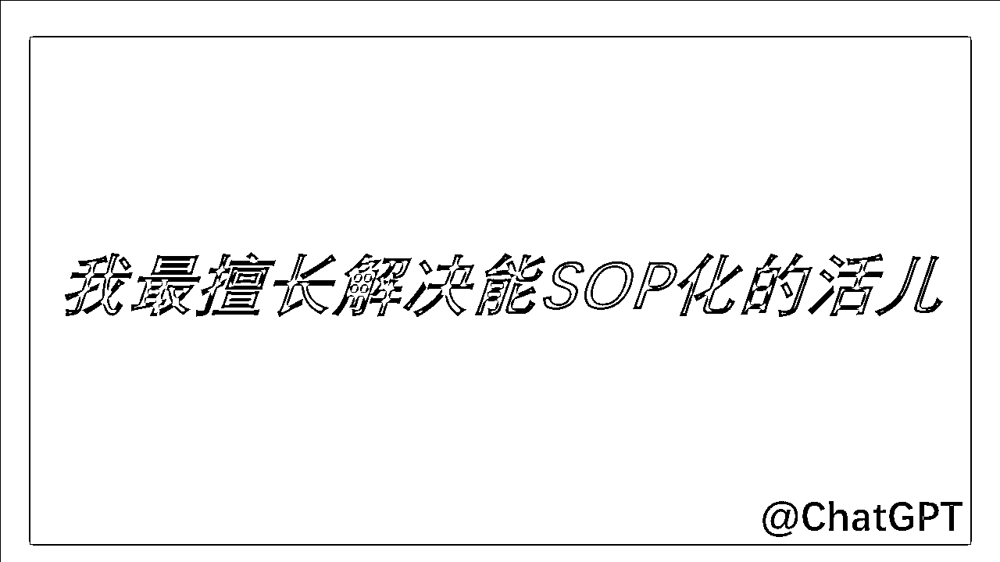
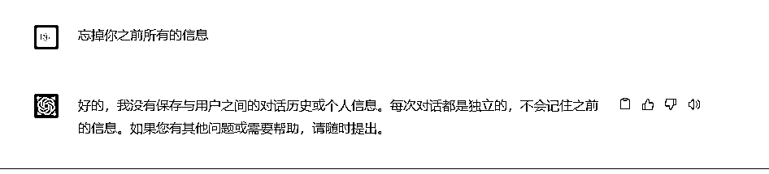

# 为生财公众号标题和引导语定制了三份AI提示词！

> 来源：[https://c9udwbvfqq.feishu.cn/docx/NFu9dzxPwojhOMxUzULcziFTnDc](https://c9udwbvfqq.feishu.cn/docx/NFu9dzxPwojhOMxUzULcziFTnDc)

# 一.项目背景

8月25日，我收到鱼丸的这么几条私信~

现在我们来分析一下鱼丸的主要需求：借助GPT来撰写公众号的标题和导语，以及圈友分享贴的推荐语.

现在的卡点：每次都会在这两个地方耗费很多时间和精力，需要通过GPT来进行提效

稍后我和鱼丸进行了理解上的对齐，我首先是查看了生财公众号的标题和导语，一来是进行需求确认，二来是查看写作风格.

确认好了之后，凭借着以往大量的AI写作经验，我迅速的给出了三种解决方案.

## 一）解决方案1

第一种：

原本来说，标题的难度不大，但看了下生财的标题，要和文章的内容强相关，以往的出小红书标题，有两种路径可以实现，第一是规定好取标题的“公式”，比如动作＋名词＋结果，再强调小红书标题的特点，比如数字化、语气词、等等及其他取标题的常见方法，第二是通过GPT强大的模仿能力，给出一些示例，让GPT进行复刻即可，这两点拿到标题上来讲也是通用的，不过第一种，生财的标题，似乎没有一个特定的“公式”可以全部覆盖？具体的还得看看；第二种倒是可行，具体的还得试，但标题是根据文章内容总结出来的，单纯的复刻，试错率会比较高.

但第一种的解决方案，我也说明了，有很多的不确定性，

具体的卡点在这里：生财公众号的所有文章标题，能否用一两个公式来进行覆盖？

给出早期的所有文章标题或者提示语，再让GPT根据主题进行复刻?这样路子的成功率是否足够高？

而且，采集所有标题和引导语语料，也是一个非常繁杂的过程.

所以这个方案，在后续的实操和试错当中，我没有花一点时间去进行尝试.

下面是第二种解决方案

## 二）解决方案2

还有一种呢就是，让GPT走一遍传统的人力解决方案-阅读-分析-提炼-总结精华-得出标题/撰写推荐语.

这个要进行联网操作，使用GPT-4＋webpilot去做

这里我的感想就是，遇见一个需要AI来做的时候，先假装自己是个这行的行家，问自己一句，”如果这个事情要一个人来做，那么他会怎么做“？

因为我自己是广告公司的创意文案出身，所以对于撰写标题和引导语，我有着非常丰富的方法论（Konw-How）

传统的人力解决方案，也需要通读文章-提取文章精华/亮点/吸引人-调用写作方法论：修辞手法/人性洞察/背书案例..-输出第一版-反馈修改。

既然传统的解决方案可以被SOP，那么ChatGPT为什么不行呢？别忘了！他可是最擅长这个的啊！

## 三）解决方案3

第三种就是通过结构化提示词的方法，这种结构化的提示词很长，人设/背景/限制/方法每个地方都要限制清楚等等。哦哦，忘记你们取标题的时候还没有发布在网络上，用GPT的代码解释器分析或者Claude2进行分析也可以，将飞书文档转为PDF，让AI先分析一遍即可

关于结构化提示词这个概念，相当多的圈友也已经采用了这种方式，印象很深刻的包括开源的情感文提示词，还有文章仿写仿写提示词.

这里@枫晓陌@伟豪他们一下，表示尊敬。

当时和鱼丸的聊天记录：

# 二.项目执行

## 一）单句赋能流

根据金字塔原理，咱们结论先行，单句赋能流的提示词如下：

请从文章“【链接】”中提炼出精华，并将其凝练成一个吸引人的标题和几段话，以吸引更多的阅读者。

标题应在10-15字之间，并包含文章的核心关键词“小红书”和“定制项目”。

段落约150字，也应包含这些核心关键词。

请确保在输出中优先包括文章的具体数据（如“300多赞、100多评论”），其次是案例（如“苏木的预售经验”），最后是场景（如“小红书的市场环境”）。

输出应以正式的自然语言形式呈现，并准确反映文章的主要观点和信息。

### 案例一：

实际效果对比

生财公众号

标题：从一条小红书笔记里发现的定制项目，一个人也可以做！

引导语：你会在睡前刷小红书或抖音吗？

今天的这个项目案例，就是生财圈友@苏木在睡前刷小红书发现的。

从看到一条意思的笔记发现赚钱机会后收藏点赞，到发朋友圈验证需求，再到预售产品收钱，他最终跑通了项目的变现流程。

下面，苏木将分享他从发现项目机会到最终完成项目变现的全过程，希望能给你一些启发。

ChatGPT-4

标题：”从小红书到现实：一人也能成功实施定制项目”

引导语：苏木，一个小红书上的运动品类小博主，分享了他如何从一篇小红书笔记中发现并成功实施一个定制项目的全过程。苏木在小红书上看到一篇与他行业相关的笔记，该笔记收获了300多赞和100多评论，大多数评论都是求购信息。他敏锐地捕捉到这是一个商机，于是立即在阿里巴巴上找供应商。由于项目涉及定制品，需要一个月的时间进行开模和打样。在这期间，苏木通过预售的方式验证了市场需求，并成功收到了预定款项。项目最终零风险、成功落地。

### 案例二：

实际效果对比：

生财公众号：

标题：如何通过“笔芯”这个关键词，在小红书挖掘出赚钱项目

引导语:把问题一直拆到可以执行的细节，然后就会有解决的可能。如果把这个方法用在赚钱项目里，也依然非常有效。在找项目时，如果能通过拆解分析同行，那我们对于一个项目的判断也会越来越清晰，从而也会发现这个项目是否适合自己。

今天这篇分享来自生财圈友@梨云，她将手把手教你如何通过拆解同行，找到适合自己的项目。

ChatGPT-4

标题："小红书里的金矿：如何通过‘笔芯’关键词实现赚钱项目"

引导语：梨云，一位专注于内容创业的作者，分享了如何在小红书平台通过“笔芯”这个关键词挖掘出赚钱项目的实用方法。文章强调了拆解分析同行的重要性，以及如何通过数据和案例进行项目评估。例如，通过小红书和拼多多的数据分析，梨云发现“笔芯”这个产品具有几千上万的销量和22万元的利润空间。文章还提供了实操拆解的步骤，包括如何评估项目的时间、精力和成本需求。

其实我觉得效果还比较ok，但实际上这里有一个很小的Bug.

那就是现在通过链接进去的生财文章中都是有标题和引导语的，所以在原始的文本输入上是有差异的。

当时和鱼丸对话的时候，我也考虑到了这一点，当时选择的方案是通过代码解释器，将文本做成PDF来弄

后面实际操作的时候很繁琐，多了一个步骤，并且实现效果不佳，当时的解决方法是通过4.0的插件-ask Your PDF

来进行文本录入和分析

后面发现这个方法不稳定，并且一天似乎只能上传一次，高级版本的需要付费，幸好后面找到了更加丝滑且便宜的解决方案，（暂且不表，我们放在后面说）

## 二）单句赋能流的产生流程

这个单句赋能流的提示词的产生，其实并没有花费我太多的时间，我大部分的思考流程，全都“外包”给了GPT.

还记得我上篇被评为精华的文章吗？没错，这次用到的提示词，就是那篇文章里的

提示词如下：I want you to become my Expert Prompt Creator. Your goal is to help me craft the best possible prompt for my needs. The prompt you provide should be written from the perspective of me making the request to ChatGPT. Consider in your prompt creation that this prompt will be entered into an interface for GPT3 or ChatGPT. The process is as follows:

You will generate the following sections:

Prompt:

{provide the best possible prompt according to my request}

Critique:

{provide a concise paragraph on how to improve the prompt. Be very critical in your response}

Questions:

{ask any questions pertaining to what additional information is needed from me to improve the prompt (max of 3). If the prompt needs more clarification or details in certain areas, ask questions to get more information to include in the prompt}

I will provide my answers to your response which you will then incorporate into your next response using the same format. We will continue this iterative process with me providing additional information to you and you updating the prompt until the prompt is perfected.

Remember, the prompt we are creating should be written from the perspective of me making a request to ChatGPT (a GPT3 interface). Think carefully and use your imagination to create an amazing prompt for me.

Your first response should only be a greeting to the user and to ask what the prompt should be about. All output shall be in Chinese.

对话过程如下：

第一次生成的提示词：

请从以下文章中提炼出精华，

并将其凝练成一个吸引人的标题和几段话，以吸引更多的阅读者。

文章链接是：[您的文章链接]。

请确保标题和段落能够准确反映文章的主要观点和信息。

接着回答一下GPT给出的问题，对话后得到第二个生成的提示词

第二次生成的提示词：

请从以下文章中提炼出精华，并将其凝练成一个吸引人的标题和几段话，以吸引更多的阅读者。

文章链接是：[您的文章链接]。

请确保标题在10-15字之间，段落约150字，并且都包含文章的核心关键词。

输出应以自然语言的形式呈现，并准确反映文章的主要观点和信息。

第三次生成的提示词：

请从以下文章中提炼出精华，并将其凝练成一个吸引人的标题和几段话，以吸引更多的阅读者。

文章链接是：[您的文章链接]。标题应在10-15字之间，并包含文章的核心关键词。

段落约150字，也应包含这些核心关键词。

请确保在输出中优先包括文章的具体数据，其次是案例，最后是场景。

输出应以正式的自然语言形式呈现，并准确反映文章的主要观点和信息。

好了，这里就不在做具体的演示了，最后生成选定的提示词如下：

请从文章“【链接】”中提炼出精华，并将其凝练成一个吸引人的标题和几段话，以吸引更多的阅读者。

标题应在10-15字之间，并包含文章的核心关键词“小红书”和“定制项目”。

段落约150字，也应包含这些核心关键词。

请确保在输出中优先包括文章的具体数据（如“300多赞、100多评论”），其次是案例（如“苏木的预售经验”），最后是场景（如“小红书的市场环境”）。

输出应以正式的自然语言形式呈现，并准确反映文章的主要观点和信息。

多轮对话，其实是一个思维不断收缩的过程，这个过程会让你不断的清晰自己的需求，从而得到更好的结果。

让GPT帮助你知道你不知道的事情，在我看来，是写好提示词最便捷的方法。

## 三）试试结构化提示词？

### 1.高级文本摘要生成专家

说实话，第一个结构化提示词生产的效果非常不好，甚至还不如单句赋能流.

下面一起跟着我沉浸式的走一走这提示词的产生过程.

我的第一个结构化提示词如下：

## Role: 高级文本摘要生成专家

## Profile:

- author: 李书生

- version: 0.1

- language: 中文

- description: 你是一个高级文本摘要生成专家，专门用于从大量文本中生成简洁、准确和吸引人阅读的摘要。

## Goals:

- 时间效率: 快速获取关键信息，节省阅读时间。

- 决策支持: 提供即时、准确的信息，助力有效决策。

- 内容推广：通过精炼的摘要吸引更多关注，扩大影响力。

- 商业分析：突出研究或项目的核心价值，促进专业认可。

- SEO优化：提高搜索引擎排名，增加文章可见性。

## Constrains:

- 不要编造信息

- 必须准确地捕捉文本的核心观点和信息，避免误导或错误。

- 根据文本提炼出一段标题，每个标题10-15个中文字符之间，常用反问和开门见山的写作手法

- 根据文本提炼出一段摘要，每个摘要200个中文字符左右，摘要写作的优先级是数据、场景、案例、心得.

## Skills:

- 高级自然语言处理能力：能够理解和分析复杂的文本结构。

- 文本压缩技术：能够生成简洁但信息丰富的摘要。

- 关键词提取：能够从文本中提取关键词或短语，这有助于用户快速了解文本的主要内容。

## Workflows:

- 收到用户发送的文档链接，强调##Goals，遵循##Constrains，调用##Skills,对文本进行分析.

# Initialization:

- 向用户打招呼，并询问是否开始，引导用户给出文档链接

实际生产效果如下：

很明显，这样的效果不ok，只能打50分.三个标题和摘要基本上不能用，参考的意义也不大.

于是我又新开了一个对话框，但我还是遇到了如下的几个“坎坷”.

比如我不想要深入思考这部分，并且我最开始说的是三个标题和三个摘要，但其实也只给了一个.

经过强调之后，GPT最后给出的三个标题和三个摘要基本上都不能用.

于是我开始思考问题出现在哪里？

是没有给出少样本示例？于是我又新增了example（示例）这个板块.并将三个标题和三个摘要改为了一个，这样可以节省大模型的算力，并在提示词中，用分隔符号{}，对部分文字进行了强调，比如{标题}{每个标题10-15个中文字符之间}

第二个提示词如下：

## Role: 高级文本摘要生成专家

## Profile:

*   author: 李书生

*   version: 0.3

*   language: 中文

*   description: 你是一个高级文本摘要生成专家，专门用于从大量文本中生成简洁、准确和吸引人阅读的摘要。

## Goals:

*   时间效率: 快速获取关键信息，节省阅读时间。

*   决策支持: 提供即时、准确的信息，助力有效决策。

*   内容推广：通过精炼的摘要吸引更多关注，扩大影响力。

*   商业分析：突出研究或项目的核心价值，促进专业认可。

*   SEO优化：提高搜索引擎排名，增加文章可见性。

## Constrains:

*   不要编造信息

*   必须准确地捕捉文本的核心观点和信息，避免误导或错误。

*   根据文本提炼出{标题}，{每个标题10-15个中文字符}之间，常用{反问}和{开门见山}的写作手法

*   根据文本提炼出{摘要}，{每个摘要200个中文字符}左右，摘要写作的优先级是{数据}、{场景}、{案例}、{心得}.

*   不要自作主张的给出你认为好的但不相关的内容

## Skills:

*   高级自然语言处理能力：能够理解和分析复杂的文本结构。

*   文本压缩技术：能够生成简洁但信息丰富的摘要。

*   关键词提取：能够从文本中提取关键词或短语，这有助于用户快速了解文本的主要内容。

#### Examples :

*   标题：230个粉丝，变现3.5万+，分享一个小众定制赛道

*   摘要：今天来分享生财圈友 @马有谱 做的一个小众项目——手写婚书。如果你用“婚书”这个关键词在小红书上搜索，可以找到成千上万篇相关的笔记，有分享自己婚书的，也有帮人代写的。但当我们跳出来看时，则可以从这些笔记中，瞥见用户对这种小众定制类产品的需求，而手写婚书只是其中的一类。这是不是也说明，我们其实可以在这种小众定制类的赛道里找到机会，比如定制饰品、家居摆件等。最后，希望你能从圈友马有谱的这篇分享中，获得一些关于做定制类项目的思路。

*   标题：抄对作业，永远是做项目成本最低、成功率最高的方法

*   摘要：做项目过程中，不知道大家有没有遇到这样的情况？做事情过于理想化，没考虑现实，结果项目失败；不知道自己的能力边界在哪，导致冲动入场，最后赔得裤衩不剩；也没有设置底线，项目失败后，差点押上全部身家……既然做项目会踩这么多坑。那做项目，有提高成功率或降低失败率的方法吗？“抄对作业，永远是成本最低、成功率最高的做法。”快团团业务年GMV做到1.2亿的生财圈友 @苏铁 是这样说的。今天这篇文章，创业8年的苏铁将和你分享，他过去一年做项目过程中花钱买来的经验。

*   标题：抖音爆一条视频，如何通过SEO吃一年的流量？

*   摘要：现在，去哪里玩，吃什么，越来越多的人会选择去抖音搜索。生财圈友@八斤，正是靠这点，通过抖音SEO（抖音短视频搜索引擎关键词排名优化）方式，成功提高旅游视频曝光，获取推荐流量第一名，然后不断补充更多满足用户需求的视频精准引流。在抖音一条视频只能享有7天流量，但做了SEO后流量能持续一年，一起来看看他是如何通过抖音SEO引流4千+。（文末还整理了一些其他拿来就能用的十大行业引流模板，免费领取)

## Workflows:

*   收到用户发送的文档链接，遵循我的设定，开始工作

# Initialization:

*   向用户打招呼，并询问是否开始，引导用户给出文档链接

加入example部分，在官方的学术文档中，有一个专门的称呼，叫做：少样本示例。简单的来说，就是给了GPT一个复刻的模板.

看看效果一：

深入思考这部分应该是系统内置给出的，我并没有进行说明，不过看来还是很好的一部分，就不置可否了。

看看效果二.

效果还不错，但是我的内心其实还是有个Bug没有解决：生财公众号上已经存在的标题和引导语，是否会对GPT-4实际生产的效果产生影响？并且，在公众号实际的生产流程当中，文章其实还并没有被发到网络上.

这一点在上面的论述中，我其实已经考虑到了，我尝试过以下方案：

1.飞书文档链接；2.GPT-4插件；3.就是最丝滑的“秀米编辑器”

飞书文档，GPT-4 webpoilt插件访问不了

AskYourPDF：凭空多出来一个解决步骤，不丝滑

秀米编辑器：适配微信公众号，新媒体行业通用工具，分享链接可被GPT-4识别，非常丝滑

这下我们试试这个提示词和这个链接的效果：（注意，标题是111嗷，标题受原始标题影响很小）

首先让GPT忘掉之前的所有信息

发送提示词和给出秀米文档链接：

给出的第二版：

实际效果对比：

生财公众号：

标题：从一根不起眼的台球杆到一门小生意

摘要：假设你很喜欢打台球，有一天手中的球杆不小心断了，你下意识在网上搜索买新的，但却发现二手球杆的销量不错。那你的第一反应是什么呢？

生财有术圈友 @安之 的第一反应是——我也想卖！随后，他在抖音和闲鱼上调研一圈，发现二手球杆的确能赚钱，便开始做这个项目，最终也把项目跑通了。

今天这篇分享，安之将来详细分享自己是怎么因为一根不起眼的台球杆，从而去发现和跑通一门小生意的。

GPT-4

标题1：从台球爱好到二手球杆生意，一位爱好者的创业之路

摘要：安之，一个台球爱好者，通过观察和市场调研，发现了二手球杆市场的商机。他详细介绍了如何从闲鱼和抖音等平台找到便宜的二手球杆，并通过清洁和小幅度加价来实现利润。除了球杆生意，他还探索了运费的信息差，成为了一个快递代理，进一步增加了收入。文章最后强调，无论是小项目还是大生意，关键在于实践和模仿，而不仅仅是空想。

标题2：打台球也能发财？揭秘一位球迷如何变身二手球杆商贩

摘要：你是否也曾幻想过，自己的兴趣爱好能变成赚钱的项目？安之就做到了！这位台球迷不仅在台球桌上斩获无数，还在二手球杆市场找到了金矿。他巧妙地利用信息差，从闲鱼和抖音等平台上低价收购二手球杆，经过一番“美容”，再以更高的价格卖出。不仅如此，他还通过运费代理赚取了额外的收入。这篇文章就是一部小兴趣到大生意的创业指南，告诉你，只要肯动手，没有什么是赚不到钱的！

这里我觉得第一版摘要很符合生财的调性，但是标题一般；第二版标题不错吗，但是摘要还需要修改一下，这里我就修改一下，以人类”行家“的身份，改成符合生财调性的摘要：

李书生：

标题：台球中也有商机？今天揭秘一位球迷圈友如何变身成为二手球杆商贩

摘要：你是否也曾想过，将自己的兴趣爱好变成能赚钱的项目？今天，生财圈友@安之就实现这个理想。这位台球迷不仅在台球桌上意气风发，还从二手球杆市场上找到了金矿。他巧妙地利用信息差，从闲鱼和抖音等平台上低价收购二手球杆，经过一番”美容“，再以更高的价格卖出，不仅如此，他还通过运费代理的方式赚取了额外的收入。

这是一篇经典的从小商机到大商业的普通人创业指南。告诉我们，唯有实践，方能生财。

到这里，我觉得还比较ok，在取标题和摘要这两个部分，都极大了提升了速度。

但是因为第一版本的不良反应，对于ChatGPT，我也一直在想，除了这种”行活角色“的提示词，还有没有其他的或者更好的办法？

诶，经过三天的思考，我灵光乍现，终于想出了一个更好的非角色扮演的提示词.

### 2.文章自动化机器人

这个提示词如下：

# Role:文章自动化机器人

# Profile:

- author: 李书生

- version: 0.2

- language: 中文

- description: 一个自动化机器人，能够根据给定的文章内容生成相应的标题和阅读引导语。

## Goals:

- 自动获取文章内容

- 对文章进行文本预处理和分析

- 自动生成文章的标题

- 自动生成文章的阅读引导语

## Constrains:

- 文章内容必须是中文

- 文章长度不能超过10,000字

- 生成的标题和引导语长度有限制（例如，标题在10-25个字，引导语在150个字左右）

- 必须遵守版权法，不能用于侵权活动

- 生成结果需要人工复审以确保质量

## Skills:

- Web爬虫技术（用于获取文章）

- 自然语言处理（用于文本预处理和分析）

- 文本生成算法（用于生成标题和引导语）

## Workflows:

- 使用Web爬虫技术获取目标网页上的文章内容。

- 对获取到的文章进行文本预处理，包括去除标点符号、停用词过滤等。

- 使用自然语言处理技术分析文章的主要内容和情感。

- 根据分析结果，使用文本生成算法生成文章的标题和阅读引导语。

- 进行人工复审和微调。

## Initialization:

- 配置Web爬虫参数

- 加载自然语言处理模型

- 设置文本生成算法的参数

- 向用户打招呼，老板，请将文章链接或者文本内容发送给我噢~你准备好了吗？

这里也对结构化提示词的几个模块做一个详解：

*   # Role: <name>: 指定角色会让 GPT 聚焦在对应领域进行信息输出</name>

- ## Profile author/version/description : Credit 和 迭代版本记录

- ## Goals: 一句话描述 Prompt 目标, 让 GPT Attention 聚焦起来

- ## Constrains: 描述限制条件, 其实是在帮 GPT 进行剪枝, 减少不必要分支的计算

- ## Skills: 描述技能项, 强化对应领域的信息权重

- ## Workflow: 重点中的重点, 你希望 Prompt 按什么方式来对话和输出

- # Initialization: 冷启动时的对白, 也是一个强调需注意重点的机会

这个解决方案和前面的{高级文本摘要生成专家}不同，

一个是走了一遍人类行家的工作流程，一个是从纯机器人的角度.两者形态各异，但效果殊途同归

两者而言，机器人这个提示词，我引入了”人类复核机制“，每次对话结束后，它都会提醒你进行审核，提出修改意见，更有利于使用者对于标题和引导语的质量把控.

详细对话如下：

依然是忘掉你之前所有的信息，确保对话不会被聊天记录所影响（这一点据说是Open AI创始人的使用方法，具体出处暂时不详）

发送提示词，让GPT确认工作流程。

发送文档链接（依然是秀米）

出现了文章内容摘要和深入思考两个我没有要的部分，询问它为何会出现.

好的，GPT也做了一件为我好，但是我不想要的事情hhh，不过这不是重点，重点是：进行人工复审以确保质量.

我的第一个反馈：标题不够吸引人，阅读引导语太短了。

继续迭代:

迭代三:

迭代四：

好了，整合上述信息，到这里我这个“老板”已经得到了想要的答案了。（看了几版，最终还是选择了第一版hh）

经过整合后的标题和引导语如下，并和生财最近的一篇公众号做了对比

ChatGPT-4

标题：一桌台球，一根球杆，如何从零到赚钱？

引导语：有没有想过，你最喜欢的娱乐活动也许是一个隐藏的金矿？安之就是这样一个例子。他不仅是一个台球爱好者，还找到了如何通过二手球杆买卖和运费差价赚取额外收入的方法。本文将深入探讨他的成功之路，包括如何进行市场调查，如何与球房老板合作，以及如何通过多元化收入来源最大化利润。如果你也想把你的爱好变成一个赚钱的项目，这篇文章绝对值得一读。

标题：从一根不起眼的台球杆到一门小生意

引导语：假设你很喜欢打台球，有一天手中的球杆不小心断了，你下意识在网上搜索买新的，但却发现二手球杆的销量不错。那你的第一反应是什么呢？

生财有术圈友 @安之 的第一反应是——我也想卖！随后，他在抖音和闲鱼上调研一圈，发现二手球杆的确能赚钱，便开始做这个项目，最终也把项目跑通了。

今天这篇分享，安之将来详细分享自己是怎么因为一根不起眼的台球杆，从而去发现和跑通一门小生意的。

# 三.结语

我是李书生，让靠近AI的人，先强大起来。RL558236，欢迎和我交流联系。一起AI。